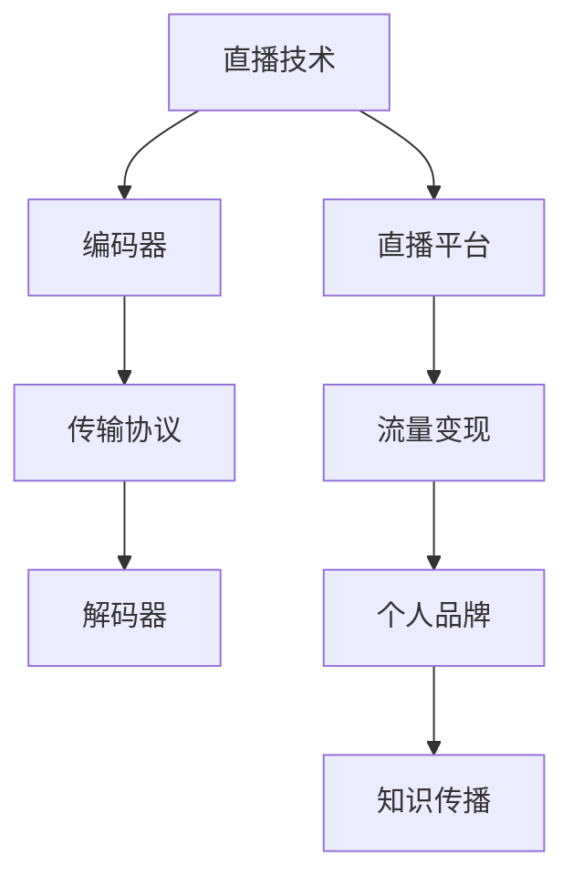

                 

关键词：直播技术、知识变现、程序员、技术博客、在线教育、流量变现、社交媒体

> 摘要：本文将探讨程序员如何通过直播技术实现知识变现，分析当前直播平台的发展趋势，介绍程序员如何创建有吸引力的直播内容，以及如何利用社交媒体和网络营销来扩大影响力和吸引观众。

## 1. 背景介绍

随着互联网技术的飞速发展，直播技术逐渐成为人们日常生活的重要组成部分。直播不仅为用户提供了即时互动的娱乐体验，也为内容创作者提供了新的知识传播和变现途径。程序员作为技术领域的专业人士，他们拥有丰富的知识和技能，如何将这些优势转化为实际的商业价值，是当前热议的话题之一。

近年来，在线教育和知识付费市场迅速扩张，越来越多的程序员开始尝试通过直播平台分享技术知识，实现个人品牌的建立和变现。直播技术不仅可以帮助程序员拓宽传播渠道，提高内容覆盖面，还能通过互动和反馈机制增强观众参与感，提高知识的传递效率。

本文旨在为程序员提供一套系统的直播知识变现策略，从平台选择、内容制作到社交媒体推广，全面解析如何利用直播技术实现知识变现。

## 2. 核心概念与联系

### 2.1 直播技术的基本概念

直播技术是指通过互联网实时传输视频和音频内容的技术。它主要包括以下几个核心组成部分：

- **编码器（Encoder）**：负责将视频和音频信号转换为数字信号，进行压缩处理，以便在网络中传输。
- **传输协议**：如RTMP、HLS、FLV等，用于确保数据的可靠传输。
- **解码器（Decoder）**：在观众端接收并解码传输过来的视频和音频数据，输出为可观看的媒体内容。
- **直播平台**：提供直播技术支持和服务的平台，如YouTube、Twitch、Bilibili等。

### 2.2 直播技术与知识变现的联系

直播技术与知识变现的结合，主要体现在以下几个方面：

- **实时互动**：直播的实时性为观众提供了与主讲人实时互动的机会，增强了观众的参与感和学习体验。
- **内容传播**：直播技术打破了地域和时间的限制，使主讲人的知识可以快速传播到全球观众。
- **流量变现**：通过直播平台提供的广告分成、会员订阅、礼物打赏等方式，主讲人可以将观众流量转化为实际收入。
- **个人品牌**：优秀的直播内容有助于主讲人建立个人品牌，提升专业影响力和市场价值。

### 2.3 Mermaid 流程图



## 3. 核心算法原理 & 具体操作步骤

### 3.1 算法原理概述

直播知识变现的核心算法原理主要包括以下几个方面：

- **内容制作**：主讲人需根据目标观众的需求和兴趣，策划和制作高质量的技术内容。
- **平台选择**：根据个人定位和目标市场，选择合适的直播平台。
- **流量运营**：通过社交媒体和网络营销手段，扩大观众基数和提高曝光率。
- **变现策略**：利用直播平台提供的多种变现渠道，实现流量向收入的转化。

### 3.2 算法步骤详解

#### 3.2.1 内容制作

1. **选题策划**：根据自身专业领域和观众需求，选择具有吸引力和实用性的主题。
2. **内容结构**：确定课程大纲，合理安排课程内容，确保知识的连贯性和逻辑性。
3. **录制与编辑**：使用专业的录制设备和软件，保证视频和音频质量，并进行必要的后期编辑。

#### 3.2.2 平台选择

1. **平台分析**：了解各个直播平台的特点、用户群体和变现模式。
2. **个人定位**：根据自身特长和目标市场，选择最适合的平台。
3. **注册与设置**：完成平台账号注册，并进行个人资料和频道设置。

#### 3.2.3 流量运营

1. **社交媒体推广**：利用微博、微信公众号、抖音等社交媒体平台，发布直播预告和互动内容，吸引潜在观众。
2. **社群运营**：建立QQ群、微信群等社群，与观众建立深度联系，提升粉丝粘性。
3. **SEO优化**：通过SEO技术，提高直播内容在搜索引擎中的排名，吸引更多观众。

#### 3.2.4 变现策略

1. **广告分成**：根据直播平台的规定，通过观看广告获得收入。
2. **会员订阅**：推出会员制度，为付费用户提供独家内容和服务。
3. **礼物打赏**：鼓励观众通过送礼物的方式支持主讲人。
4. **商品销售**：通过直播销售相关书籍、教程或课程，实现知识变现。

### 3.3 算法优缺点

#### 优点

- **实时互动**：增强观众参与感和学习体验。
- **广泛传播**：突破地域和时间限制，提高知识传播效率。
- **多样化变现**：提供多种变现渠道，实现流量向收入的转化。

#### 缺点

- **内容质量要求高**：需要持续输出高质量内容，保持观众兴趣。
- **技术门槛较高**：直播技术和平台操作需要一定的技术基础。
- **变现周期较长**：从内容制作到变现需要一定的时间积累。

### 3.4 算法应用领域

- **在线教育**：通过直播教学，为学员提供实时互动的学习体验。
- **技术分享**：程序员可以通过直播分享技术心得和实战经验。
- **个人品牌建设**：通过直播展示专业能力，提升个人市场价值。
- **企业培训**：为企业员工提供定制化的在线培训服务。

## 4. 数学模型和公式 & 详细讲解 & 举例说明

### 4.1 数学模型构建

直播知识变现的数学模型可以简化为以下公式：

\[ 收入 = 观众数量 \times 参与度 \times 变现率 \]

其中：

- **观众数量**：通过直播平台的数据统计得出。
- **参与度**：包括观众在直播中的互动行为，如评论、点赞、打赏等。
- **变现率**：指观众转化为付费用户或购买商品的比率。

### 4.2 公式推导过程

\[ 收入 = (观看次数 + 评论数 + 点赞数 + 打赏金额) \times 变现率 \]

其中，各项指标反映了观众的参与度和互动行为，变现率则取决于直播平台和主讲人的变现策略。

### 4.3 案例分析与讲解

#### 案例一：某程序员在B站直播编程教学

- **观众数量**：1000人
- **参与度**：观看次数：800次，评论数：200条，点赞数：500个，打赏金额：1000元
- **变现率**：10%

根据公式计算，该程序员的收入为：

\[ 收入 = (800 + 200 + 500 + 1000) \times 0.1 = 1500 \text{元} \]

#### 案例二：某程序员在YouTube直播游戏开发

- **观众数量**：10000人
- **参与度**：观看次数：8000次，评论数：2000条，点赞数：5000个，打赏金额：3000元
- **变现率**：20%

根据公式计算，该程序员的收入为：

\[ 收入 = (8000 + 2000 + 5000 + 3000) \times 0.2 = 7700 \text{元} \]

## 5. 项目实践：代码实例和详细解释说明

### 5.1 开发环境搭建

为了更好地进行直播，我们需要搭建一个基本的开发环境。以下是搭建环境的步骤：

1. 安装直播软件：如OBS Studio、XSplit等。
2. 配置摄像头和麦克风：确保直播画质和音质。
3. 安装直播平台客户端：如B站直播助手、YouTube Live等。

### 5.2 源代码详细实现

以下是一个简单的直播脚本示例，使用Python编写：

```python
import cv2
import numpy as np
import PySimpleGUI as pg

def video_capture():
    # 初始化摄像头
    cap = cv2.VideoCapture(0)
    while True:
        # 读取摄像头帧
        ret, frame = cap.read()
        if not ret:
            break
        # 显示摄像头帧
        cv2.imshow('Live Streaming', frame)
        if cv2.waitKey(1) & 0xFF == ord('q'):
            break
    cap.release()
    cv2.destroyAllWindows()

if __name__ == "__main__":
    video_capture()
```

### 5.3 代码解读与分析

1. **初始化摄像头**：使用`cv2.VideoCapture(0)`初始化摄像头。
2. **读取摄像头帧**：使用`cap.read()`读取摄像头捕获的帧。
3. **显示摄像头帧**：使用`cv2.imshow()`将摄像头帧显示在窗口中。
4. **关闭摄像头**：使用`cap.release()`释放摄像头资源。

### 5.4 运行结果展示

运行上述代码，会打开一个窗口显示摄像头捕获的实时视频流。通过OBS Studio或其他直播软件，可以将这个视频流推送到直播平台。

## 6. 实际应用场景

### 6.1 在线教育

随着在线教育的兴起，程序员可以通过直播进行编程教学、算法讲解等技术知识传授。通过直播，学员可以实时提问，与讲师互动，提高学习效果。

### 6.2 技术分享

程序员可以通过直播分享技术心得和实战经验，如开发工具的使用、编程技巧的分享等。直播的互动性可以帮助观众更好地理解和掌握技术知识。

### 6.3 个人品牌建设

通过直播展示专业能力，程序员可以建立个人品牌，提升在行业内的知名度和影响力。优秀的直播内容还可以帮助程序员获得更多的职业机会。

### 6.4 未来应用展望

随着5G技术的普及，直播技术将更加高效、稳定。程序员可以利用直播技术开展更多形式的技术活动，如在线研讨会、技术沙龙等。同时，人工智能技术的融入也将为直播内容制作和推荐提供更多可能性。

## 7. 工具和资源推荐

### 7.1 学习资源推荐

- 《直播营销实战：教你如何通过直播赚钱》
- 《Python编程：从入门到实践》
- 《在线教育实战：打造个人品牌与流量变现》

### 7.2 开发工具推荐

- OBS Studio：一款功能强大的直播软件。
- XSplit：专业的直播和视频编辑软件。
- PySimpleGUI：一个简单易用的Python GUI库。

### 7.3 相关论文推荐

- “直播平台商业模式研究”
- “在线教育中直播技术的研究与应用”
- “社交媒体在直播知识变现中的作用”

## 8. 总结：未来发展趋势与挑战

### 8.1 研究成果总结

本文系统地探讨了程序员如何利用直播技术进行知识变现的策略，分析了直播技术的基本概念和原理，以及实际操作步骤。通过数学模型的构建和案例分析，进一步说明了直播知识变现的可行性和潜在收益。

### 8.2 未来发展趋势

随着互联网技术的不断进步，直播技术将变得更加成熟和普及。未来，直播内容将更加多样化，形式更加丰富。人工智能和大数据技术的融入，也将为直播内容制作和推荐提供更加智能化的解决方案。

### 8.3 面临的挑战

1. **内容质量**：持续输出高质量的内容是保持观众兴趣和实现变现的关键。
2. **技术门槛**：直播技术和平台操作需要一定的技术基础，对于非专业人士可能存在一定的门槛。
3. **竞争压力**：随着越来越多的人加入直播领域，竞争将越来越激烈。

### 8.4 研究展望

未来，直播技术将在在线教育、企业培训、个人品牌建设等领域得到更加广泛的应用。程序员可以利用直播技术，拓宽传播渠道，提升专业影响力，实现知识变现。同时，研究如何利用人工智能和大数据技术优化直播内容制作和推荐，将是一个重要的研究方向。

## 9. 附录：常见问题与解答

### 问题1：直播设备怎么选择？

**解答**：选择直播设备时，需要考虑画质、音质和稳定性。摄像头建议选择1080P及以上分辨率，麦克风则选择专业级电容麦克风，以保证音频质量。此外，选择一款稳定的直播软件也非常重要。

### 问题2：如何吸引更多的观众？

**解答**：可以通过以下方式吸引观众：
1. 制定有吸引力的直播主题，确保内容具有实际价值。
2. 利用社交媒体进行推广，发布直播预告和精彩片段。
3. 与其他主播合作，进行跨平台互动。
4. 保持直播时间的稳定，建立观众期待。

### 问题3：如何进行流量变现？

**解答**：可以通过以下方式进行流量变现：
1. 利用直播平台提供的广告分成。
2. 推出会员制度，为付费用户提供独家内容。
3. 通过礼物打赏获得收入。
4. 销售相关书籍、教程或课程。

## 作者署名

作者：禅与计算机程序设计艺术 / Zen and the Art of Computer Programming

