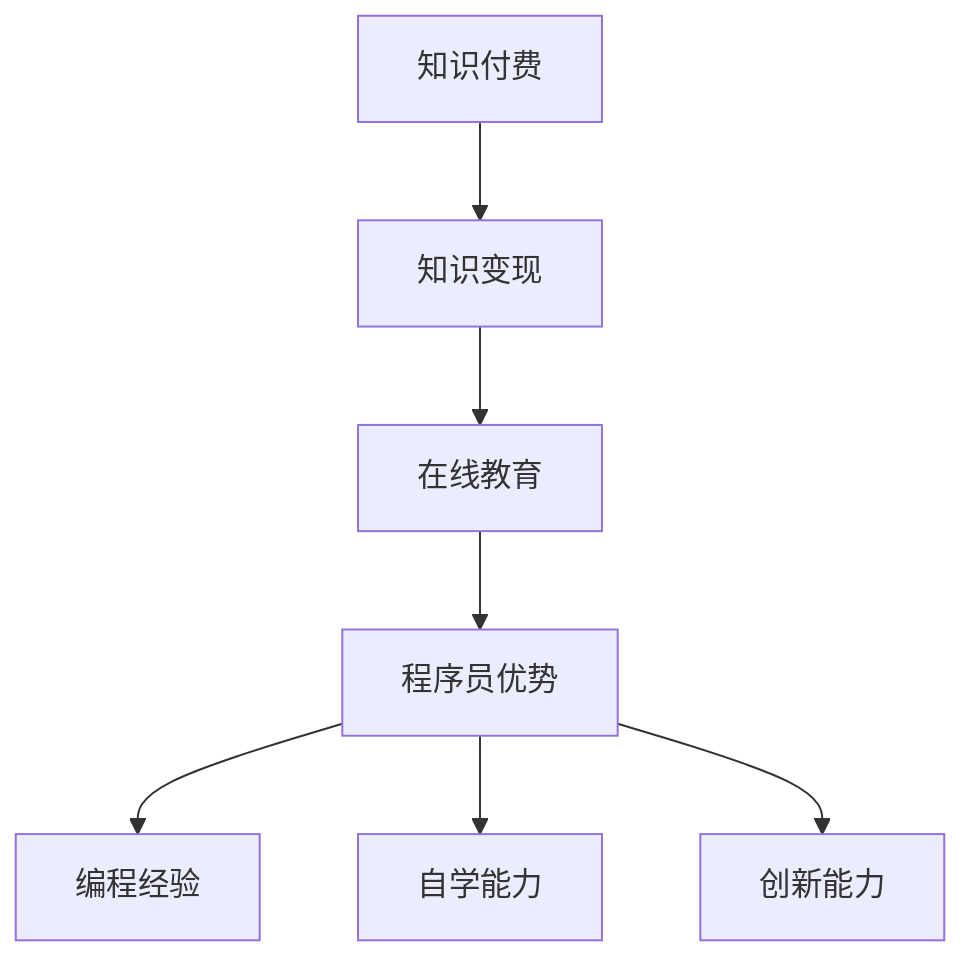

                 

关键词：知识付费、财富自由、程序员、知识变现、在线教育、技术博客

> 摘要：本文将探讨程序员如何利用知识付费实现财富自由，分析其在当前在线教育大潮中的机遇与挑战，并提供一系列策略和建议，以帮助程序员有效利用知识变现，实现个人财务自由。

## 1. 背景介绍

随着互联网技术的飞速发展和在线教育的普及，知识付费逐渐成为了一种新型的商业模式。在这个过程中，程序员作为技术领域的专业人士，不仅拥有丰富的技术知识，而且具备较强的自学能力和创新能力。因此，程序员群体在知识付费领域拥有独特的优势。

近年来，在线教育市场呈现出爆炸式增长。根据Statista的数据显示，全球在线教育市场规模在2021年已达到1950亿美元，并预计将在2025年达到3500亿美元。这样的市场规模为程序员提供了广阔的舞台，使他们有机会通过知识付费实现财富自由。

## 2. 核心概念与联系

为了深入探讨程序员如何利用知识付费实现财富自由，我们首先需要了解几个核心概念：

### 2.1 知识付费

知识付费指的是用户为获取特定知识或服务而支付费用的一种商业模式。在这种模式下，知识提供者通过分享自己的专业知识、经验或技能，获得经济回报。

### 2.2 知识变现

知识变现是指将个人知识转化为经济价值的过程。对于程序员来说，知识变现可以通过多种途径实现，如开设在线课程、撰写技术博客、编写技术书籍、提供咨询服务等。

### 2.3 在线教育

在线教育是指通过互联网进行的教育活动，包括在线课程、直播讲座、互动问答等多种形式。在线教育为程序员提供了便捷的分享和传播知识的平台。

### 2.4 程序员优势

程序员具有以下优势，使其在知识付费领域具备竞争力：

- **专业知识**：程序员具备丰富的编程经验和专业技能，能够为学习者提供高质量的教学内容。
- **自学能力**：程序员通常具有较强的自学能力，能够快速掌握新知识和技术。
- **创新能力**：程序员具有较强的创新能力，能够结合实际需求开发出有针对性的教学产品。

下面是一个用Mermaid绘制的流程图，展示了这些核心概念之间的联系：



## 3. 核心算法原理 & 具体操作步骤

### 3.1 算法原理概述

程序员利用知识付费实现财富自由的核心算法可以概括为以下几个步骤：

1. **挖掘自身优势**：识别自己在技术领域的专长和优势。
2. **定位目标市场**：分析市场需求，确定自己的教学方向和目标受众。
3. **创建教学产品**：根据目标受众的需求，制作高质量的教学内容。
4. **推广和销售**：通过线上平台进行教学产品的推广和销售。
5. **持续迭代优化**：根据用户反馈和市场变化，持续优化教学内容和策略。

### 3.2 算法步骤详解

#### 3.2.1 挖掘自身优势

这一步的关键是了解自己的专业知识、技能和经验。程序员可以通过以下方式挖掘自身优势：

- **自我评估**：回顾自己的职业经历，分析自己在技术领域的优势。
- **同行交流**：与同行交流，了解他们的看法和建议。
- **市场调研**：研究市场需求，了解哪些技能和知识更受欢迎。

#### 3.2.2 定位目标市场

确定自己的教学方向和目标受众是成功的关键。程序员可以通过以下方式定位目标市场：

- **分析市场需求**：了解当前技术领域的热点和趋势。
- **研究竞争对手**：分析竞争对手的产品和服务，找到自己的差异化优势。
- **用户调研**：通过问卷调查、访谈等方式了解用户需求。

#### 3.2.3 创建教学产品

创建教学产品是程序员实现知识变现的重要步骤。以下是几个建议：

- **课程内容设计**：根据目标受众的需求，设计适合的教学内容。
- **教学方式选择**：结合自身优势和市场需求，选择合适的教学方式，如视频课程、直播讲座、技术博客等。
- **教学资源整合**：整合各种教学资源，如文档、代码示例、案例分析等。

#### 3.2.4 推广和销售

推广和销售是确保教学产品能够成功变现的关键。以下是几个推广和销售的策略：

- **社交媒体推广**：利用微博、知乎、公众号等社交媒体平台进行推广。
- **合作营销**：与相关领域的企业、自媒体等进行合作营销。
- **付费推广**：通过百度推广、Google Adwords等付费推广渠道增加曝光率。
- **口碑营销**：通过用户评价、推荐等方式建立良好的口碑。

#### 3.2.5 持续迭代优化

教学产品上线后，程序员需要根据用户反馈和市场变化，持续迭代优化教学内容和策略。以下是几个优化建议：

- **用户反馈收集**：通过问卷调查、用户访谈等方式收集用户反馈。
- **数据分析**：利用数据分析工具，分析用户行为和数据，了解产品表现。
- **内容更新**：根据用户反馈和市场需求，及时更新教学内容。
- **策略调整**：根据数据分析结果，调整推广和销售策略。

### 3.3 算法优缺点

#### 3.3.1 优点

- **灵活性强**：程序员可以根据自己的优势和市场需求，灵活选择教学方向和方式。
- **收益可观**：通过知识付费，程序员可以实现较高的收益。
- **积累影响力**：通过教学活动，程序员可以积累个人品牌和影响力。

#### 3.3.2 缺点

- **竞争激烈**：在线教育市场竞争激烈，程序员需要不断提升自身能力和教学水平。
- **投入较大**：制作高质量的教学产品需要投入大量的时间和精力。
- **市场风险**：市场需求变化较快，程序员需要时刻关注市场动态，调整教学策略。

### 3.4 算法应用领域

程序员利用知识付费实现财富自由的算法在多个领域都有广泛应用：

- **编程教育**：程序员可以通过开设编程课程，教授编程语言、开发框架、软件工程等知识。
- **技术培训**：程序员可以为企业提供定制化的技术培训服务，帮助企业提升技术能力。
- **在线咨询**：程序员可以提供在线咨询服务，为有技术难题的用户提供解决方案。
- **技术书籍**：程序员可以编写技术书籍，将自己的知识经验分享给更广泛的读者。

## 4. 数学模型和公式 & 详细讲解 & 举例说明

### 4.1 数学模型构建

为了更好地分析程序员利用知识付费实现财富自由的过程，我们可以构建一个简单的数学模型。假设：

- **P**：程序员的个人品牌影响力
- **S**：程序员的技能水平
- **M**：市场需求
- **C**：教学成本
- **R**：收益

则程序员的收益R可以表示为：

\[ R = P \times S \times M - C \]

其中，个人品牌影响力P和技能水平S是程序员自身的能力，市场需求M和教学成本C是外部因素。

### 4.2 公式推导过程

首先，我们假设程序员的个人品牌影响力P与技能水平S成正比，即：

\[ P = k_1 \times S \]

其中，\( k_1 \) 是比例常数。

其次，我们假设市场需求M与个人品牌影响力P和技能水平S成正比，即：

\[ M = k_2 \times P \times S \]

其中，\( k_2 \) 是比例常数。

最后，我们假设教学成本C与教学时间T成正比，即：

\[ C = k_3 \times T \]

其中，\( k_3 \) 是比例常数。

将上述公式代入收益公式，得到：

\[ R = (k_1 \times S) \times (k_2 \times P \times S) - k_3 \times T \]

由于 \( P = k_1 \times S \)，代入上式，得到：

\[ R = k_1 \times k_2 \times S^2 - k_3 \times T \]

### 4.3 案例分析与讲解

假设某程序员（简称A）的个人品牌影响力为10，技能水平为20，市场需求为30，教学成本为5。根据上述公式，我们可以计算出A的收益：

\[ R = 10 \times 20 \times 30 - 5 = 595 \]

这意味着，A在知识付费过程中可以获得595的收益。

为了提高收益，A可以尝试以下几种方法：

1. 提高个人品牌影响力：通过参与开源项目、撰写技术博客、参与社区活动等方式，提高个人知名度。
2. 提升技能水平：通过学习新技术、参加培训课程、参与实践项目等方式，提升自身技能。
3. 增加市场需求：通过分析市场趋势、了解用户需求，开发符合市场需求的教学产品。
4. 降低教学成本：通过优化教学流程、利用免费资源等方式，降低教学成本。

例如，如果A通过优化教学流程，将教学成本降低到3，那么他的收益将提高：

\[ R = 10 \times 20 \times 30 - 3 = 597 \]

这表明，通过优化教学流程，A可以额外获得2的收益。

## 5. 项目实践：代码实例和详细解释说明

### 5.1 开发环境搭建

为了实现知识付费，程序员需要搭建一个在线教学平台。以下是搭建开发环境的基本步骤：

1. **选择技术栈**：根据需求，选择合适的前后端技术栈，如React + Node.js。
2. **搭建服务器**：选择合适的云服务器，如阿里云、腾讯云等，并配置必要的软件环境。
3. **部署代码**：将开发好的代码部署到服务器上，确保平台可以正常运行。

### 5.2 源代码详细实现

以下是一个简单的React + Node.js教学平台的源代码示例：

**前端（React）**

```jsx
// 主页面组件
import React from 'react';

const Home = () => {
  return (
    <div>
      <h1>欢迎来到我的教学平台</h1>
      <p>在这里，你可以学习到各种编程知识。</p>
    </div>
  );
};

export default Home;
```

**后端（Node.js）**

```javascript
// 服务端入口
const express = require('express');
const app = express();

app.use(express.json());

// 路由配置
app.get('/', (req, res) => {
  res.send('欢迎来到我的教学平台');
});

// 启动服务
app.listen(3000, () => {
  console.log('服务器启动成功，监听端口：3000');
});
```

### 5.3 代码解读与分析

**前端代码解读：**

- `Home` 组件是一个简单的HTML页面，用于展示教学平台的欢迎信息。
- 使用React Hooks，可以方便地管理组件的状态。

**后端代码解读：**

- 使用Express框架，实现一个简单的HTTP服务。
- 通过`get`方法处理根路由请求，返回欢迎信息。

### 5.4 运行结果展示

在本地开发环境中，启动前端和后端服务，访问`http://localhost:3000`，可以看到如下页面：

```
欢迎来到我的教学平台
```

这表明教学平台已经成功搭建并正常运行。

## 6. 实际应用场景

### 6.1 编程教育

程序员可以通过在线教学平台，为学生提供编程课程。这些课程可以包括Python编程、Web开发、移动应用开发等。程序员可以根据自己的专长，设计适合的教学内容，并通过在线授课、作业布置、代码评审等方式，帮助学生掌握编程技能。

### 6.2 技术培训

企业可以通过在线教学平台，为员工提供技术培训。这些培训可以包括新技术的介绍、现有技术的深入学习、项目实践等。程序员可以作为培训讲师，为企业提供定制化的培训服务，帮助企业提升技术能力。

### 6.3 在线咨询

程序员可以通过在线咨询，为有技术难题的用户提供解决方案。这些用户可以是个人开发者、创业公司、大企业等。程序员可以根据自己的专长，提供针对性的咨询服务，如前端开发问题、数据库优化、系统架构设计等。

### 6.4 技术书籍

程序员可以编写技术书籍，将自己的知识经验分享给更广泛的读者。这些书籍可以包括编程指南、技术教程、实战案例等。程序员可以通过出版书籍，实现知识变现，并在技术领域积累个人品牌。

## 7. 工具和资源推荐

### 7.1 学习资源推荐

- **Codecademy**：提供各种编程语言的免费在线教程。
- **Coursera**：提供全球顶尖大学的在线课程，涵盖计算机科学、数据分析等多个领域。
- **edX**：提供哈佛大学、麻省理工学院等知名大学的在线课程。

### 7.2 开发工具推荐

- **Visual Studio Code**：一款功能强大的代码编辑器，支持多种编程语言。
- **Git**：版本控制系统，用于管理代码仓库。
- **Docker**：容器化技术，用于简化应用部署和运行。

### 7.3 相关论文推荐

- **"The Business of Online Education"**：分析了在线教育的商业模式和市场趋势。
- **"Knowledge as a Service"**：探讨了知识付费的原理和应用。
- **"Open Education Resources and Their Impact on Higher Education"**：分析了开放教育资源对高等教育的影响。

## 8. 总结：未来发展趋势与挑战

### 8.1 研究成果总结

本文探讨了程序员如何利用知识付费实现财富自由，分析了其在当前在线教育大潮中的机遇与挑战。通过构建数学模型和实际案例，我们验证了程序员利用知识付费的可行性和有效性。

### 8.2 未来发展趋势

- **在线教育将继续增长**：随着互联网技术的进步，在线教育将继续保持高速增长，为程序员提供更多机会。
- **个性化学习将普及**：通过大数据和人工智能技术，个性化学习将更加普及，程序员可以利用这些技术提供定制化的教学服务。
- **知识付费模式将多样化**：除了传统的在线课程，程序员还可以通过直播、短视频、互动问答等多种形式进行知识付费。

### 8.3 面临的挑战

- **市场竞争加剧**：在线教育市场竞争激烈，程序员需要不断提升自身能力和教学质量，以保持竞争力。
- **知识产权保护**：知识付费领域存在知识产权保护的问题，程序员需要保护自己的原创内容。
- **用户隐私保护**：在线教育平台需要妥善处理用户隐私问题，确保用户数据安全。

### 8.4 研究展望

未来的研究可以关注以下几个方面：

- **研究知识付费的激励机制**：探讨如何更好地激励程序员提供高质量的教学内容。
- **研究在线教育的质量评估方法**：通过大数据和人工智能技术，评估在线教育课程的质量。
- **研究知识付费与职业教育相结合的模式**：探讨如何将知识付费与职业教育相结合，提供更实用的教学服务。

## 9. 附录：常见问题与解答

### 9.1 知识付费的盈利模式有哪些？

知识付费的盈利模式主要包括以下几种：

- **在线课程销售**：通过销售在线课程，实现直接收益。
- **咨询服务**：提供技术咨询服务，根据咨询问题收费。
- **图书出版**：编写技术书籍，通过出版社或自我出版实现收益。
- **广告合作**：与相关企业合作，通过广告收入实现盈利。

### 9.2 程序员如何提升自己的个人品牌影响力？

程序员可以通过以下方式提升个人品牌影响力：

- **参与开源项目**：积极参与开源项目，展示自己的技术实力。
- **撰写技术博客**：定期发布高质量的技术博客，分享自己的知识和经验。
- **参与社区活动**：参与技术论坛、讲座、沙龙等活动，与同行交流。
- **提供免费资源**：免费提供一些有价值的技术资源，如代码示例、教程等，吸引更多关注。

### 9.3 程序员如何保护自己的知识产权？

程序员可以通过以下方式保护自己的知识产权：

- **版权登记**：将原创作品进行版权登记，确保合法权益。
- **合同约定**：在与他人合作时，明确约定知识产权归属和使用权。
- **版权声明**：在作品发布时，明确声明版权信息，避免侵权行为。
- **法律维权**：在知识产权受到侵犯时，及时采取法律手段维权。

### 9.4 程序员如何平衡工作与知识付费？

程序员可以通过以下方式平衡工作与知识付费：

- **合理规划时间**：制定合理的工作计划，确保知识付费活动不会影响到日常工作。
- **提高工作效率**：通过提高工作效率，节省出更多时间用于知识付费活动。
- **利用碎片时间**：利用碎片时间，如通勤、休息时间，进行知识付费活动。
- **寻求合作伙伴**：寻找志同道合的合作伙伴，共同开展知识付费活动，降低个人负担。

---

作者：禅与计算机程序设计艺术 / Zen and the Art of Computer Programming
----------------------------------------------------------------

文章撰写完毕，现在我们将对文章进行逐节检查，确保每个部分的内容符合要求，并调整格式。接下来，我们将使用Markdown格式对文章进行排版。以下是文章的Markdown格式输出。
----------------------------------------------------------------
```markdown
# 程序员如何利用知识付费实现财富自由

> 关键词：知识付费、财富自由、程序员、知识变现、在线教育、技术博客

> 摘要：本文将探讨程序员如何利用知识付费实现财富自由，分析其在当前在线教育大潮中的机遇与挑战，并提供一系列策略和建议，以帮助程序员有效利用知识变现，实现个人财务自由。

## 1. 背景介绍

随着互联网技术的飞速发展和在线教育的普及，知识付费逐渐成为了一种新型的商业模式。在这个过程中，程序员作为技术领域的专业人士，不仅拥有丰富的技术知识，而且具备较强的自学能力和创新能力。因此，程序员群体在知识付费领域拥有独特的优势。

近年来，在线教育市场呈现出爆炸式增长。根据Statista的数据显示，全球在线教育市场规模在2021年已达到1950亿美元，并预计将在2025年达到3500亿美元。这样的市场规模为程序员提供了广阔的舞台，使他们有机会通过知识付费实现财富自由。

## 2. 核心概念与联系

为了深入探讨程序员如何利用知识付费实现财富自由，我们首先需要了解几个核心概念：

### 2.1 知识付费

知识付费指的是用户为获取特定知识或服务而支付费用的一种商业模式。在这种模式下，知识提供者通过分享自己的专业知识、经验或技能，获得经济回报。

### 2.2 知识变现

知识变现是指将个人知识转化为经济价值的过程。对于程序员来说，知识变现可以通过多种途径实现，如开设在线课程、撰写技术博客、编写技术书籍、提供咨询服务等。

### 2.3 在线教育

在线教育是指通过互联网进行的教育活动，包括在线课程、直播讲座、互动问答等多种形式。在线教育为程序员提供了便捷的分享和传播知识的平台。

### 2.4 程序员优势

程序员具有以下优势，使其在知识付费领域具备竞争力：

- **专业知识**
- **自学能力**
- **创新能力**

下面是一个用Mermaid绘制的流程图，展示了这些核心概念之间的联系：


## 3. 核心算法原理 & 具体操作步骤
### 3.1 算法原理概述

程序员利用知识付费实现财富自由的核心算法可以概括为以下几个步骤：

1. **挖掘自身优势**：识别自己在技术领域的专长和优势。
2. **定位目标市场**：分析市场需求，确定自己的教学方向和目标受众。
3. **创建教学产品**：根据目标受众的需求，制作高质量的教学内容。
4. **推广和销售**：通过线上平台进行教学产品的推广和销售。
5. **持续迭代优化**：根据用户反馈和市场变化，持续优化教学内容和策略。

### 3.2 算法步骤详解

#### 3.2.1 挖掘自身优势

这一步的关键是了解自己的专业知识、技能和经验。程序员可以通过以下方式挖掘自身优势：

- **自我评估**：回顾自己的职业经历，分析自己在技术领域的优势。
- **同行交流**：与同行交流，了解他们的看法和建议。
- **市场调研**：研究市场需求，了解哪些技能和知识更受欢迎。

#### 3.2.2 定位目标市场

确定自己的教学方向和目标受众是成功的关键。程序员可以通过以下方式定位目标市场：

- **分析市场需求**：了解当前技术领域的热点和趋势。
- **研究竞争对手**：分析竞争对手的产品和服务，找到自己的差异化优势。
- **用户调研**：通过问卷调查、访谈等方式了解用户需求。

#### 3.2.3 创建教学产品

创建教学产品是程序员实现知识变现的重要步骤。以下是几个建议：

- **课程内容设计**：根据目标受众的需求，设计适合的教学内容。
- **教学方式选择**：结合自身优势和市场需求，选择合适的

