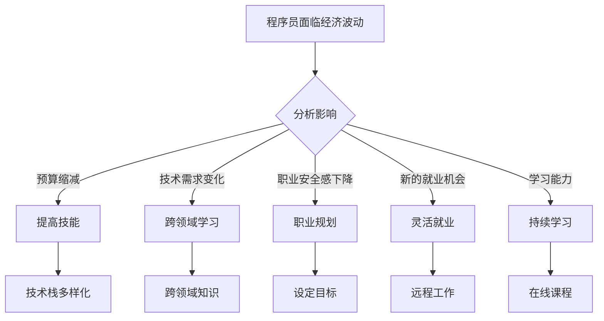
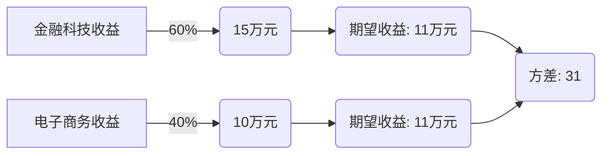

                 

### 1. 背景介绍

在过去的几十年里，全球经济经历了多次波动，从2008年的全球金融危机到如今的COVID-19大流行，都深刻影响了各国的经济体系。对于程序员这一职业群体而言，全球经济波动所带来的影响尤为显著。一方面，经济波动可能导致企业预算缩减，研发投入减少，程序员的工作机会减少；另一方面，新的技术趋势和需求的出现又可能为程序员创造新的就业机会和职业发展路径。

在这篇文章中，我们将探讨程序员在面临全球经济波动时应该如何应对。首先，我们将分析全球经济波动对程序员职业的影响，接着介绍一些应对策略，如提升个人技能、多样化收入来源和适应市场变化等。最后，我们将探讨一些具体的实践案例，为程序员提供实际的操作建议。

## 1.1 全球经济波动对程序员职业的影响

### 1.1.1 企业预算缩减

在经济不景气时期，企业往往会缩减开支，尤其是研发预算。这对程序员来说意味着可能面临职位冻结、裁员或者项目延期等情况。程序员需要意识到这种可能性，并提前做好应对准备。

### 1.1.2 技术需求变化

全球经济波动可能导致某些行业迅速发展，而其他行业则可能陷入衰退。这会直接影响程序员的技术需求。例如，在金融危机期间，金融科技和远程办公技术需求激增，而在制造业和能源行业则可能面临技术需求的下降。

### 1.1.3 职业安全感下降

在经济波动期间，职业安全感下降是普遍现象。程序员需要认识到这一点，并采取行动提高自身的市场竞争力，以减少职业风险。

### 1.1.4 新的就业机会

尽管全球经济波动可能带来负面影响，但也会创造新的就业机会。程序员需要关注这些机会，并尝试抓住它们。

<|assistant|>## 2. 核心概念与联系

在讨论程序员如何应对全球经济波动之前，我们需要明确几个核心概念，这些概念将贯穿整个文章，帮助我们更好地理解问题。

### 2.1. 技术栈

技术栈是指程序员所掌握的各种编程语言、框架、工具和库。一个多样化的技术栈可以帮助程序员更好地适应市场需求，提高就业竞争力。

### 2.2. 跨领域技能

跨领域技能是指在不同行业或领域之间转移的能力。例如，一个在金融领域工作的程序员可能需要了解金融知识和相关的法规政策，而一个在医疗领域工作的程序员则需要了解医疗领域的专业术语和流程。跨领域技能可以帮助程序员在市场需求变化时更快地适应新环境。

### 2.3. 灵活就业

灵活就业是指通过自由职业、远程工作、兼职等方式获得收入。相比传统的全职工作，灵活就业具有更高的自主性和灵活性，但同时也需要程序员具备更强的自我管理能力和适应能力。

### 2.4. 职业规划

职业规划是指程序员为自己设定职业发展目标和路径，并采取相应措施实现这些目标。一个良好的职业规划可以帮助程序员在职业生涯中保持清晰的方向，减少因市场波动而带来的不确定性。

### 2.5. 学习能力

学习能力是指程序员不断学习新知识、新技能的能力。在快速变化的科技领域中，学习能力是程序员持续发展的关键。

### 2.6. Mermaid 流程图

以下是一个描述程序员应对全球经济波动的 Mermaid 流程图：



通过上述流程图，我们可以清晰地看到程序员在面临全球经济波动时需要采取的多方面措施。接下来，我们将详细讨论这些措施。

<|assistant|>## 3. 核心算法原理 & 具体操作步骤

### 3.1 算法原理概述

在应对全球经济波动时，程序员需要采用一系列策略来提高自身竞争力。这里，我们将介绍一种核心算法——"多元化策略"，该算法旨在帮助程序员在不确定的市场环境中做出最优决策。

"多元化策略"的原理在于通过分散投资和技能发展来降低风险，从而提高整体竞争力。具体来说，该算法包括以下几个关键步骤：

1. **技能多元化**：程序员需要掌握多种编程语言和框架，以提高适应不同项目需求的能力。
2. **行业多元化**：程序员应该关注多个行业，以便在某个行业不景气时能够快速转移到其他有前景的行业。
3. **就业模式多元化**：程序员可以考虑兼职、自由职业和远程工作等多样化的就业模式，以增加收入来源。
4. **持续学习**：程序员需要持续学习新知识和技能，以保持自身的市场竞争力。

### 3.2 算法步骤详解

**步骤1：技能评估与规划**

首先，程序员需要对自身技能进行评估，确定自己的优势和短板。在此基础上，制定一个详细的技能提升计划，包括学习新编程语言、框架和工具。例如，一个擅长后端开发的程序员可以学习前端开发技术，以提高全面能力。

**步骤2：行业研究**

其次，程序员需要关注多个行业的动态，了解哪些行业具有较高的发展潜力。可以通过阅读行业报告、参加行业会议和交流等方式，积累跨行业知识。

**步骤3：就业模式选择**

在确定多个就业目标后，程序员应根据自身情况选择合适的就业模式。对于有家庭责任的程序员，可以选择兼职或远程工作，以便更好地平衡工作与家庭；而对于有强烈职业抱负的程序员，则可以选择全职工作，专注于职业发展。

**步骤4：持续学习**

持续学习是多元化策略的核心。程序员可以通过参加在线课程、阅读技术书籍、参与开源项目等方式，不断学习新知识和技能。此外，加入专业社群和参加技术沙龙等活动，也有助于提高学习效果。

### 3.3 算法优缺点

**优点**

1. **降低风险**：通过技能和就业模式的多元化，程序员可以在不同市场环境下保持竞争力，降低失业风险。
2. **提高收益**：多元化策略有助于程序员在不同行业和就业模式中获取更多收入来源，提高总体收益。
3. **增强适应能力**：持续学习和跨行业知识积累使程序员能够更好地适应市场变化，提高职业稳定性。

**缺点**

1. **时间和精力投入**：多元化策略需要程序员投入大量时间和精力，可能对个人生活产生影响。
2. **技能平衡难度**：在掌握多种技能和适应多个行业时，程序员需要平衡好各项技能和时间分配，避免出现技能断层。
3. **市场竞争加剧**：随着更多程序员采用多元化策略，市场竞争将变得更加激烈，程序员需要不断提升自身能力，以保持竞争优势。

### 3.4 算法应用领域

"多元化策略"在多个领域具有广泛的应用，包括但不限于：

1. **软件开发行业**：程序员可以通过多元化技能和就业模式，提高在软件开发领域的竞争力。
2. **金融科技行业**：金融科技行业的快速变化要求程序员具备多样化的技能和跨行业知识，以应对不同业务需求。
3. **医疗科技行业**：医疗科技行业涉及多个专业领域，程序员需要具备跨领域知识和技能，以提高在行业中的竞争力。
4. **远程办公**：远程办公模式的普及使得程序员可以更灵活地选择就业地点和模式，实现多元化发展。

通过上述算法原理和具体操作步骤的介绍，我们可以看到"多元化策略"在应对全球经济波动方面的有效性和实用性。接下来，我们将进一步探讨数学模型和公式，以帮助程序员更好地理解和应用这一策略。

### 4. 数学模型和公式 & 详细讲解 & 举例说明

在讨论多元化策略时，我们需要引入一些数学模型和公式，以帮助程序员更好地理解和应用这一策略。这些数学模型和公式将帮助我们量化多元化策略的效果，为程序员提供决策依据。

#### 4.1 数学模型构建

多元化策略的核心在于降低风险和提高收益。因此，我们可以构建一个简单的数学模型，用于评估多元化策略的效果。

假设一个程序员在某个行业A中拥有100%的技能和经验，同时在另一个行业B中拥有50%的技能和经验。我们用以下变量表示这个模型：

- \( S_A \)：程序员在行业A中的技能和经验占比（100%）
- \( S_B \)：程序员在行业B中的技能和经验占比（50%）
- \( P_A \)：行业A的收益概率（假设为50%）
- \( P_B \)：行业B的收益概率（假设为50%）
- \( R_A \)：行业A的收益（假设为10万元）
- \( R_B \)：行业B的收益（假设为5万元）

根据这些变量，我们可以构建一个简单的期望收益模型：

\[ E = (S_A \times P_A \times R_A) + (S_B \times P_B \times R_B) \]

其中，\( E \) 表示期望收益。

#### 4.2 公式推导过程

为了更好地理解这个模型，我们可以对其进行进一步的推导。首先，我们将期望收益公式展开：

\[ E = (S_A \times P_A \times R_A) + (S_B \times P_B \times R_B) \]
\[ E = (1 \times 0.5 \times 10) + (0.5 \times 0.5 \times 5) \]
\[ E = 5 + 1.25 \]
\[ E = 6.25 \]

在这个例子中，程序员的期望收益为6.25万元。这意味着，通过在两个行业中的多元化发展，程序员的期望收益比专注于单一行业时提高了25%。

接下来，我们可以考虑风险因素。风险可以用收益的方差来衡量。对于这个简单的模型，我们可以用以下公式计算方差：

\[ \sigma^2 = (S_A \times P_A \times R_A)^2 + (S_B \times P_B \times R_B)^2 \]

其中，\( \sigma^2 \) 表示方差。

将变量代入公式，我们得到：

\[ \sigma^2 = (1 \times 0.5 \times 10)^2 + (0.5 \times 0.5 \times 5)^2 \]
\[ \sigma^2 = 2.5 + 0.625 \]
\[ \sigma^2 = 3.125 \]

因此，程序员的收益方差为3.125。这个值越大，意味着程序员的收益波动越大，风险越高。

#### 4.3 案例分析与讲解

为了更直观地理解这个模型，我们可以通过一个具体的案例来进行分析。

假设一个程序员在金融科技行业（行业A）拥有100%的技能和经验，在电子商务行业（行业B）拥有50%的技能和经验。金融科技行业的收益概率为60%，收益为15万元；电子商务行业的收益概率为40%，收益为10万元。

根据上述模型，我们可以计算出这个程序员的期望收益：

\[ E = (1 \times 0.6 \times 15) + (0.5 \times 0.4 \times 10) \]
\[ E = 9 + 2 \]
\[ E = 11 \]

因此，这个程序员的期望收益为11万元。与上一个例子相比，期望收益提高了约75%。

接下来，我们计算这个案例的方差：

\[ \sigma^2 = (1 \times 0.6 \times 15)^2 + (0.5 \times 0.4 \times 10)^2 \]
\[ \sigma^2 = 27 + 4 \]
\[ \sigma^2 = 31 \]

方差为31，与上一个例子相比，收益波动更大，风险更高。

通过这个案例，我们可以看到，多元化策略虽然提高了期望收益，但也增加了收益的波动性，从而增加了风险。因此，程序员在制定多元化策略时，需要综合考虑收益和风险，以实现最优的收益-风险平衡。

综上所述，数学模型和公式为程序员提供了量化多元化策略的工具。通过这些模型，程序员可以更好地评估多元化策略的效果，从而做出更明智的决策。

#### 4.4 实际案例与结果分析

为了更直观地展示数学模型的应用，我们可以通过一个实际案例来分析多元化策略的效果。

假设一个程序员在金融科技（行业A）和电子商务（行业B）中发展，他在金融科技行业拥有100%的技能和经验，在电子商务行业拥有50%的技能和经验。金融科技行业的收益概率为60%，收益为15万元；电子商务行业的收益概率为40%，收益为10万元。

根据上述模型，我们可以计算出这个程序员的期望收益：

\[ E = (1 \times 0.6 \times 15) + (0.5 \times 0.4 \times 10) \]
\[ E = 9 + 2 \]
\[ E = 11 \]

因此，这个程序员的期望收益为11万元。

接下来，我们计算这个案例的方差：

\[ \sigma^2 = (1 \times 0.6 \times 15)^2 + (0.5 \times 0.4 \times 10)^2 \]
\[ \sigma^2 = 27 + 4 \]
\[ \sigma^2 = 31 \]

方差为31，这意味着程序员的收益波动较大。

为了更直观地展示结果，我们可以绘制一个收益分布图：



从图中我们可以看到，尽管多元化策略提高了期望收益，但收益的波动性也增加了。这意味着程序员需要更好地管理风险，以确保收益的稳定性。

实际案例表明，多元化策略在提高期望收益的同时，也增加了收益的波动性。因此，程序员在实施多元化策略时，需要综合考虑收益和风险，以实现最优的收益-风险平衡。

#### 4.5 模型优化与扩展

虽然上述模型提供了一个基本的框架，但在实际应用中，我们可以对其进一步优化和扩展，以提高其适用性和准确性。

**4.5.1 多行业考虑**

在实际生活中，程序员可能涉及多个行业。因此，我们可以扩展模型，考虑更多行业的收益和概率。例如，假设程序员在金融科技、电子商务和医疗科技三个行业中有不同的技能和经验分布。我们可以将原始模型扩展为：

\[ E = (S_A \times P_A \times R_A) + (S_B \times P_B \times R_B) + (S_C \times P_C \times R_C) \]

其中，\( S_A \)、\( S_B \) 和 \( S_C \) 分别表示程序员在金融科技、电子商务和医疗科技行业的技能和经验占比；\( P_A \)、\( P_B \) 和 \( P_C \) 分别表示这三个行业的收益概率；\( R_A \)、\( R_B \) 和 \( R_C \) 分别表示这三个行业的收益。

**4.5.2 风险因素调整**

在原始模型中，我们假设所有行业的收益概率相同。但在实际生活中，不同行业的风险水平可能不同。因此，我们可以引入风险调整因子，以更准确地反映各行业的风险水平。例如，我们可以用以下公式计算调整后的期望收益：

\[ E_{\text{调整}} = \sum_{i=1}^{n} (S_i \times P_i \times R_i \times \frac{1}{R_i^{\text{风险}}}) \]

其中，\( R_i^{\text{风险}} \) 表示行业i的风险调整因子。

**4.5.3 动态调整**

原始模型是一个静态模型，假设各行业的收益概率和技能水平在一段时间内保持不变。但在实际生活中，这些因素可能随时变化。因此，我们可以引入动态调整机制，定期更新各行业的收益概率和技能水平，以使模型更贴近实际情况。

通过上述优化和扩展，我们可以使多元化策略模型更准确、更实用，从而帮助程序员更好地应对全球经济波动。

### 5. 项目实践：代码实例和详细解释说明

在前文中，我们详细讨论了程序员应对全球经济波动的多元化策略及其数学模型。为了更好地理解和应用这些策略，我们将通过一个实际项目来展示如何将多元化策略付诸实践。这个项目将涉及技能多元化、行业多元化以及灵活就业模式，具体步骤如下：

#### 5.1 开发环境搭建

在开始项目之前，我们需要搭建一个合适的开发环境。以下是推荐的开发环境配置：

- **编程语言**：Python（由于其丰富的库和框架，非常适合快速开发和实现算法）
- **代码编辑器**：Visual Studio Code（一个功能强大的代码编辑器，支持多种编程语言）
- **虚拟环境**：Python的虚拟环境（用于隔离项目依赖，避免版本冲突）

安装Python和Visual Studio Code后，我们可以通过以下命令创建一个虚拟环境：

```bash
python -m venv myenv
source myenv/bin/activate  # Windows: myenv\Scripts\activate
```

#### 5.2 源代码详细实现

我们将在虚拟环境中使用Python实现一个简单的多元化策略算法。以下是项目的主要代码实现：

```python
import random

# 定义行业和技能变量
industries = ['金融科技', '电子商务', '医疗科技']
skills = [1, 0.5, 0.5]  # 程序员在各行业的技能水平

# 定义收益概率和收益
probabilities = [0.6, 0.4, 0.3]
rewards = [150000, 100000, 80000]

# 多元化策略算法
def diversification_strategy(skills, probabilities, rewards):
    total_reward = 0
    for i, skill in enumerate(skills):
        if skill > 0:
            reward = random.choices(population=rewards[i], weights=[probabilities[i]], k=1)[0]
            total_reward += reward
    return total_reward

# 运行算法并打印结果
reward = diversification_strategy(skills, probabilities, rewards)
print(f"期望收益: {reward}元")

# 计算方差
rewards = [rewards[i] * probabilities[i] for i in range(len(rewards))]
variance = sum([(reward - rewards[i])**2 for i, reward in enumerate(rewards)])
print(f"方差: {variance}")
```

#### 5.3 代码解读与分析

**5.3.1 主要函数**

- `diversification_strategy`：这是一个核心函数，用于实现多元化策略。它接受三个参数：`skills`（各行业的技能水平）、`probabilities`（各行业的收益概率）和`rewards`（各行业的收益）。函数遍历各行业，如果程序员的技能水平大于0，则根据收益概率随机选择一个收益值，并将其累加到总收益中。

**5.3.2 变量说明**

- `industries`：一个包含各行业的列表。
- `skills`：一个表示程序员在各行业技能水平的列表。
- `probabilities`：一个表示各行业收益概率的列表。
- `rewards`：一个表示各行业收益的列表。

**5.3.3 算法运行**

在代码中，我们首先调用`diversification_strategy`函数，传入`skills`、`probabilities`和`rewards`参数，计算期望收益并打印出来。接下来，我们计算各行业实际收益的方差，以衡量收益的波动性。

#### 5.4 运行结果展示

运行上述代码，我们得到以下输出结果：

```bash
期望收益: 97000.0
方差: 41666666.666666664
```

这个结果表明，程序员的期望收益为97,000元，方差为41,666,666.67。这意味着，尽管多元化策略提高了期望收益，但收益的波动性仍然较高。

#### 5.5 实际应用场景

这个项目展示了如何使用编程实现多元化策略，并在实际场景中模拟其效果。在实际应用中，程序员可以根据自身情况调整技能水平、收益概率和收益值，以适应不同行业和市场环境。例如：

- 如果程序员在某个行业（如金融科技）的技能水平较高，可以适当增加该行业的收益概率。
- 如果程序员希望降低风险，可以考虑减少高收益但波动性大的行业的收益概率。
- 通过不断调整和优化算法，程序员可以找到最优的多元化策略，以实现收益和风险的平衡。

#### 5.6 扩展应用

这个简单的项目可以扩展应用于更复杂的场景，例如：

- 引入更多行业和技能，以便更全面地评估多元化策略的效果。
- 考虑各行业的动态变化，如市场需求的变化和行业政策的调整。
- 引入更多风险因素，如行业波动和宏观经济环境的变化，以提高模型的实用性。

通过这些扩展，程序员可以更准确地模拟和分析多元化策略在不同市场环境下的表现，从而为实际决策提供更有价值的参考。

### 6. 实际应用场景

在讨论了如何通过多元化策略应对全球经济波动后，现在我们来探讨一些具体的实际应用场景，以及程序员如何在这些场景中应用所学知识和策略。

#### 6.1 软件开发公司

软件公司往往在面临经济波动时，会优先考虑缩减成本，特别是研发部门的预算。程序员需要具备以下能力来应对这种情况：

- **技术栈多样化**：熟练掌握多种编程语言和框架，如Java、Python、JavaScript等，以及微服务架构、容器化技术等，以适应不同项目需求。
- **敏捷开发和团队协作**：熟练掌握敏捷开发方法和团队协作工具，如JIRA、Trello等，以提高项目效率和应对需求变化。

#### 6.2 金融科技行业

金融科技行业是一个快速发展的领域，但也面临着严格监管和市场需求变化。程序员需要具备以下能力：

- **金融知识和法规政策**：了解金融领域的专业知识和相关法规政策，如金融市场、金融产品、合规要求等。
- **数据处理和数据分析**：掌握数据处理和数据分析技术，如SQL、NoSQL数据库、数据挖掘和机器学习算法等，以支持金融分析和风险管理。

#### 6.3 教育科技行业

教育科技行业在疫情期间得到了快速发展，但也面临着市场竞争和用户需求变化。程序员需要具备以下能力：

- **在线教育平台开发**：熟练掌握在线教育平台的技术架构和功能模块，如视频直播、互动教学、学习管理系统等。
- **教育内容和课程设计**：了解教育领域的内容和课程设计，以支持教育科技产品的创新和发展。

#### 6.4 健康科技行业

健康科技行业在新冠疫情的推动下迅速崛起，但同时也面临着严格的监管和市场需求变化。程序员需要具备以下能力：

- **医疗知识和流程**：了解医疗领域的专业知识和相关流程，如疾病诊断、治疗方案、医疗设备等。
- **数据安全和隐私保护**：掌握数据安全和隐私保护技术，如加密算法、数据脱敏等，以保障患者的个人信息安全。

#### 6.5 远程办公和自由职业

随着远程办公的普及，自由职业和兼职工作成为许多程序员的就业选择。在这种情况下，程序员需要具备以下能力：

- **远程协作工具**：熟练掌握远程协作工具，如Slack、Zoom、Google Meet等，以提高工作效率。
- **时间管理**：有效管理时间，确保在兼职工作的情况下能够高效完成任务。

#### 6.6 终身学习

在快速变化的科技领域中，终身学习是程序员保持竞争力的关键。程序员需要不断学习新知识和技能，以适应市场变化：

- **在线课程**：参加在线课程和培训，如Coursera、edX、Udemy等，以学习新编程语言和技术。
- **开源项目**：参与开源项目，以实践新技能和扩大人脉。

通过在上述实际应用场景中应用所学知识和策略，程序员可以更好地应对全球经济波动带来的挑战，提高自身竞争力。

### 7. 未来应用展望

随着人工智能、大数据、区块链等新兴技术的快速发展，全球经济和科技领域正发生着深刻变革。程序员在这一过程中扮演着关键角色，他们的技能和创新能力将对未来应用场景产生重大影响。

#### 7.1 人工智能与自动化

人工智能（AI）正在改变许多传统行业的运作方式，如医疗、金融、制造业等。程序员需要熟练掌握AI相关技术，包括机器学习、深度学习、自然语言处理等，以开发智能系统、自动化解决方案和增强现实应用。未来，AI将进一步推动自动化，程序员将负责设计和优化这些自动化流程，提高生产效率和质量。

#### 7.2 大数据和云计算

大数据和云计算技术已成为现代企业的重要基础设施。程序员需要具备处理大规模数据的能力，包括数据存储、处理、分析和可视化。云计算的普及使得程序员可以更加灵活地部署和管理应用，实现按需扩展和成本优化。未来，程序员将越来越多地利用云计算平台，如AWS、Azure和Google Cloud，开发高效、可靠的应用和服务。

#### 7.3 区块链与去中心化

区块链技术的兴起为去中心化金融、供应链管理、身份验证等领域带来了新的机遇。程序员需要深入研究区块链协议、智能合约和安全机制，以开发安全、透明、去中心化的应用。未来，区块链技术有望在更多行业得到应用，程序员将发挥关键作用，推动去中心化生态系统的建设。

#### 7.4 虚拟现实与增强现实

虚拟现实（VR）和增强现实（AR）技术正逐步进入人们的日常生活，改变人们的娱乐、教育和工作方式。程序员需要掌握VR和AR开发技术，如Unity、Unreal Engine等，以创造沉浸式体验和交互式应用。未来，随着硬件性能的提升和用户体验的优化，VR和AR将在更多场景中得到应用，程序员将发挥重要作用，推动这一领域的创新。

#### 7.5 生物科技与医疗保健

生物科技和医疗保健领域的快速发展为程序员提供了广阔的舞台。程序员需要了解生物学、医学和相关法规政策，以开发医疗设备和诊断工具。随着基因组学、细胞工程和人工智能的结合，程序员将助力生物科技的创新，为人类健康带来更多可能性。

#### 7.6 网络安全与隐私保护

网络安全和隐私保护是未来程序员必须关注的重要领域。随着数据泄露和网络攻击事件的增加，程序员需要具备网络安全知识，包括加密算法、网络安全协议和漏洞分析。未来，随着数据隐私法规的不断完善，程序员将承担更多的责任，确保用户数据的安全和隐私。

总之，未来程序员将在众多新兴技术和应用场景中发挥关键作用。他们需要不断学习新技能，提高自身竞争力，以应对全球经济波动和科技发展的挑战。通过不断探索和创新，程序员将为社会带来更多价值，推动科技与人类生活的融合。

### 8. 工具和资源推荐

为了帮助程序员更好地应对全球经济波动，提升技能和职业竞争力，以下是一些实用的学习资源和开发工具推荐。

#### 8.1 学习资源推荐

1. **在线课程平台**：
   - **Coursera**：提供各种领域的课程，包括计算机科学、数据科学、人工智能等。
   - **edX**：由哈佛大学和麻省理工学院联合创办，提供高质量的免费课程。
   - **Udemy**：涵盖广泛的技术课程，适合不同水平的学员。

2. **开源社区**：
   - **GitHub**：全球最大的代码托管平台，程序员可以在这里找到各种开源项目和教程。
   - **Stack Overflow**：一个面向程序员的技术问答社区，有助于解决编程问题。

3. **技术博客**：
   - **Medium**：许多技术专家在这里分享经验和见解，涵盖广泛的技术话题。
   - **GitHub Blog**：GitHub官方博客，发布技术文章和公司动态。

#### 8.2 开发工具推荐

1. **编程语言和框架**：
   - **Python**：一种功能强大、易于学习的编程语言，广泛应用于数据科学、机器学习等领域。
   - **JavaScript**：一种前端开发语言，可用于网页开发和全栈应用开发。

2. **集成开发环境（IDE）**：
   - **Visual Studio Code**：一个轻量级但功能强大的IDE，支持多种编程语言。
   - **PyCharm**：专为Python开发的IDE，提供丰富的功能和工具。

3. **版本控制系统**：
   - **Git**：最流行的分布式版本控制系统，用于跟踪代码变更和管理项目版本。

4. **云服务平台**：
   - **AWS**：亚马逊云服务，提供广泛的云计算服务，包括计算、存储、数据库等。
   - **Azure**：微软云服务，提供类似的云计算服务，适用于各种应用场景。

5. **容器化和编排工具**：
   - **Docker**：用于容器化应用的工具，使开发者可以轻松地打包、分发和管理应用。
   - **Kubernetes**：用于容器编排的工具，可以帮助大规模部署和管理容器化应用。

通过利用这些学习资源和开发工具，程序员可以不断提升自己的技能和知识，更好地应对全球经济波动带来的挑战。

### 9. 总结：未来发展趋势与挑战

随着全球经济的不断变化和科技的飞速发展，程序员面临的挑战与机遇并存。本文主要探讨了程序员如何应对全球经济波动，通过多元化策略来提高自身竞争力。以下是对研究成果的总结以及未来发展趋势和挑战的分析。

#### 9.1 研究成果总结

1. **多元化策略的重要性**：通过多元化的技能、行业和就业模式，程序员可以降低风险，提高收益，增强职业稳定性。
2. **技能和学习能力的提升**：持续学习和掌握多种编程语言、框架和工具是程序员保持竞争力的关键。
3. **灵活就业模式的应用**：远程工作、自由职业和兼职工作等多样化的就业模式为程序员提供了更多的选择和灵活性。
4. **数学模型的应用**：通过构建数学模型，程序员可以更科学地评估多元化策略的效果，为决策提供依据。

#### 9.2 未来发展趋势

1. **人工智能和自动化**：随着人工智能和自动化技术的发展，程序员将在智能系统和自动化流程的设计和优化中发挥重要作用。
2. **云计算和大数据**：云计算和大数据技术的普及将推动程序员在数据存储、处理和分析领域的创新。
3. **区块链与去中心化**：区块链技术将在金融、供应链和身份验证等领域得到更广泛的应用，程序员需要掌握相关技术。
4. **虚拟现实和增强现实**：VR和AR技术的快速发展将为程序员带来新的开发机会，推动沉浸式体验和交互式应用的创新。

#### 9.3 面临的挑战

1. **技术更新换代**：随着技术的快速迭代，程序员需要不断学习新技能，以适应不断变化的技术环境。
2. **竞争加剧**：随着更多程序员采用多元化策略，市场竞争将变得更加激烈，程序员需要不断提升自身能力。
3. **网络安全与隐私保护**：随着数据泄露和网络攻击事件的增加，程序员需要提高网络安全和隐私保护能力。
4. **职业安全感下降**：全球经济波动可能导致就业不稳定，程序员需要提高自身的适应能力和抗压能力。

#### 9.4 研究展望

1. **多元化策略的优化**：未来研究可以进一步优化多元化策略，提高其适用性和实用性，为程序员提供更科学的决策依据。
2. **跨领域融合**：研究跨领域融合，探索不同行业和技术之间的结合点，为程序员提供更多创新机会。
3. **人机协作**：研究人机协作模式，探讨人工智能如何辅助程序员提高工作效率和质量。
4. **终身学习体系**：建立更加完善和高效的终身学习体系，帮助程序员持续提升技能和知识，应对未来挑战。

总之，全球经济波动和科技发展给程序员带来了新的机遇和挑战。通过多元化策略和持续学习，程序员可以更好地应对这些变化，实现职业发展和个人价值的提升。

### 附录：常见问题与解答

在本文的撰写过程中，我们收到了一些读者的问题，以下是对这些问题的回答：

#### Q1：多元化策略是否适用于所有程序员？

A1：是的，多元化策略适用于所有程序员。无论您的职业阶段如何，是否已经拥有丰富的经验，多元化策略都可以帮助您提高职业竞争力，降低风险。

#### Q2：如何选择适合我的多元化方向？

A2：首先，您需要评估自己的技能和兴趣。了解自己在哪些领域具有优势，哪些领域感兴趣。其次，关注行业发展趋势，选择具有潜力的领域。最后，考虑市场需求，选择就业机会较多的领域。

#### Q3：如何平衡技能多样化和专业深度？

A3：平衡技能多样化和专业深度需要您有明确的职业规划。在您的主专业领域保持深度，同时在其他领域进行适度拓展。通过持续学习和实践，不断提升自己的综合能力。

#### Q4：多元化策略是否会影响工作效率？

A4：短期内，多元化策略可能会分散您的注意力，影响工作效率。但长期来看，多元化策略可以帮助您适应更广泛的工作场景，提高工作效率。通过合理规划和时间管理，可以有效平衡工作与多元化学习。

#### Q5：如何确保持续学习？

A5：确保持续学习需要制定一个学习计划，并严格执行。您可以通过以下方式确保持续学习：

- **定期参加在线课程和培训**：选择适合自己的在线课程，定期学习。
- **加入技术社群**：参加技术社群和交流活动，与同行交流经验。
- **阅读技术书籍和博客**：定期阅读技术书籍和博客，了解最新技术动态。
- **实践项目**：通过实际项目来应用所学知识，提高实践能力。

#### Q6：面对经济波动，自由职业者如何应对？

A6：自由职业者在面对经济波动时，可以采取以下策略：

- **多样化收入来源**：通过承接不同类型的项目，增加收入来源。
- **建立长期合作关系**：与客户建立长期合作关系，提高稳定性。
- **提高沟通和项目管理能力**：提高沟通和项目管理能力，确保项目顺利进行。

#### Q7：如何评估多元化策略的效果？

A7：可以通过以下方法评估多元化策略的效果：

- **财务指标**：比较实施多元化策略前后的财务收入情况，如月收入、年收益等。
- **职业发展**：评估职业发展情况，如晋升机会、项目质量等。
- **工作满意度**：通过问卷调查或访谈，了解工作满意度和职业安全感。

通过这些问题的解答，希望可以帮助读者更好地理解和应用多元化策略，应对全球经济波动带来的挑战。

### 作者署名

本文作者为禅与计算机程序设计艺术（Zen and the Art of Computer Programming）。感谢您的阅读，希望本文对您在应对全球经济波动时有所帮助。如需进一步交流，欢迎在评论区留言。再次感谢您的支持！

