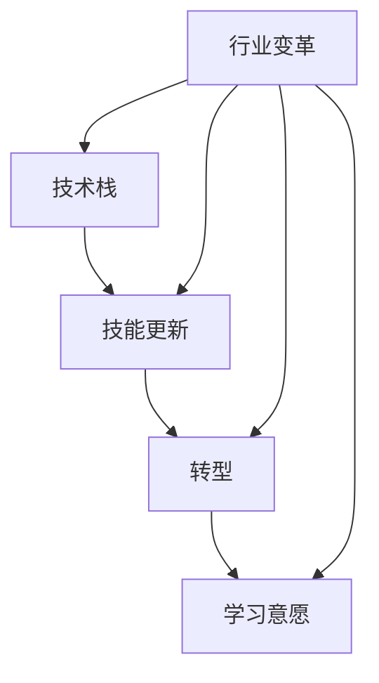

                 

### 1. 背景介绍

在过去几十年里，计算机技术和互联网的飞速发展，推动了整个软件行业的快速变革。从传统的桌面应用程序到如今的云计算、大数据、人工智能等新兴技术，软件开发的模式、工具和框架也在不断演进。这一系列变革，不仅带来了前所未有的技术进步，也促使程序员必须不断学习新的技能，适应新的工作环境。

然而，随着技术的不断更新换代，程序员面临的挑战也越来越大。一方面，新技术的涌现让程序员必须不断更新自己的知识库，学习新的编程语言、框架和工具。另一方面，技术变革往往伴随着职业转型的压力，程序员可能需要从熟悉的技术栈转向新兴领域，这需要他们具备更强的适应能力和学习意愿。

在这种背景下，程序员如何应对行业变革与转型，成为了一个亟待解决的问题。本文将探讨这一问题，分析程序员在应对行业变革和转型过程中可能遇到的问题，并提出一些实用的建议。

### 2. 核心概念与联系

在深入探讨程序员如何应对行业变革与转型之前，我们需要了解一些核心概念，以及这些概念之间的联系。

#### 2.1 技术栈

技术栈是指程序员所掌握的一系列技术和工具。它包括编程语言、框架、库、开发环境等。一个完整的技术栈是程序员能够高效开发软件的基础。

#### 2.2 技能更新

技能更新是指程序员为了适应新的技术趋势，主动学习新的编程语言、框架和工具。技能更新的重要性在于，只有不断学习新知识，程序员才能跟上行业的步伐，保持自己的竞争力。

#### 2.3 转型

转型是指程序员从熟悉的技术领域转向新兴领域的过程。转型可能涉及学习新的编程语言、框架、工具，甚至改变工作模式。转型的挑战在于，程序员需要适应新的工作环境，并快速掌握新的技能。

#### 2.4 学习意愿

学习意愿是指程序员主动学习、不断提升自己的愿望。一个有强烈学习意愿的程序员，往往能够更快地适应新技术，更好地应对职业转型。

下面是一个使用Mermaid绘制的流程图，展示了这些核心概念之间的联系：



### 3. 核心算法原理 & 具体操作步骤

在理解了核心概念之后，我们需要探讨程序员在应对行业变革与转型过程中需要掌握的一些核心算法原理和具体操作步骤。

#### 3.1 算法原理概述

在软件行业中，算法是解决问题的基础。无论是开发新的软件产品，还是优化现有系统的性能，都需要依靠算法来实现。因此，掌握一些核心算法原理是非常重要的。

常见的算法包括排序算法、查找算法、图算法等。其中，排序算法主要用于对数据进行排序，查找算法用于在数据中查找特定的元素，图算法则用于解决图相关的计算问题。

#### 3.2 算法步骤详解

下面以排序算法中的快速排序为例，介绍其具体操作步骤。

**快速排序算法**的基本思想是，通过一趟排序将待排序的记录分隔成独立的两部分，其中一部分记录的关键字均比另一部分的关键字小，则可递归地将这两部分记录数继续进行快速排序，以达到整个序列有序。

快速排序算法的具体步骤如下：

1. 选择一个基准元素（pivot）。
2. 将数组分为两部分，一部分记录的关键字均小于基准元素，另一部分的关键字均大于基准元素。
3. 对这两部分记录分别进行快速排序。

以下是快速排序算法的Python代码实现：

```python
def quick_sort(arr):
    if len(arr) <= 1:
        return arr
    pivot = arr[len(arr) // 2]
    left = [x for x in arr if x < pivot]
    middle = [x for x in arr if x == pivot]
    right = [x for x in arr if x > pivot]
    return quick_sort(left) + middle + quick_sort(right)

arr = [3, 6, 8, 10, 1, 2, 1]
sorted_arr = quick_sort(arr)
print(sorted_arr)
```

#### 3.3 算法优缺点

快速排序算法具有以下优点：

- **高效**：平均时间复杂度为O(nlogn)，在大多数情况下比其他排序算法更快。
- **稳定**：在处理大量数据时，性能相对稳定。

然而，快速排序算法也存在一些缺点：

- **性能不稳定**：在最坏情况下，时间复杂度为O(n^2)，这种情况通常发生在数据已经有序或接近有序时。
- **递归深度**：由于快速排序算法使用递归，因此在处理大量数据时可能会导致栈溢出。

#### 3.4 算法应用领域

快速排序算法广泛应用于各种场景，包括：

- **数据排序**：快速排序是一种常用的排序算法，用于对大量数据进行排序。
- **搜索引擎**：在搜索引擎中，快速排序算法可用于对搜索结果进行排序。
- **数据库**：在数据库中，快速排序算法可用于对数据进行排序和索引。

### 4. 数学模型和公式 & 详细讲解 & 举例说明

在软件行业中，数学模型和公式是解决问题的重要工具。它们不仅能够帮助我们理解问题，还能够提供解决问题的方法。在本节中，我们将介绍一些常见的数学模型和公式，并详细讲解其推导过程和举例说明。

#### 4.1 数学模型构建

数学模型是一种用数学语言描述现实世界问题的抽象模型。构建数学模型通常包括以下步骤：

1. **确定变量**：首先，需要明确问题中的变量，包括输入变量和输出变量。
2. **建立关系**：然后，需要根据问题的特性，建立变量之间的关系。
3. **简化模型**：在建立关系后，需要对模型进行简化，以使其更加易于分析和求解。

以下是一个简单的线性回归模型的构建过程：

- **变量**：设y为输出变量，x为输入变量。
- **关系**：根据问题特性，我们可以建立如下线性关系：
  $$ y = ax + b $$
  其中，a和b为模型的参数。
- **简化模型**：为了求解模型，我们需要确定参数a和b的值。

#### 4.2 公式推导过程

在建立了数学模型之后，我们需要推导出解决模型的公式。以下是一个线性回归模型的推导过程：

1. **最小二乘法**：线性回归模型通常使用最小二乘法求解参数。最小二乘法的思想是，通过求解使得误差平方和最小的参数。
2. **误差平方和**：设数据集为{(x1, y1), (x2, y2), ..., (xn, yn)}，则误差平方和为：
   $$ S = \sum_{i=1}^{n} (y_i - (ax_i + b))^2 $$
3. **求解参数**：为了求解参数a和b，我们需要对误差平方和进行求导，并令导数为0。这样可以得到以下两个方程：
   $$ \frac{\partial S}{\partial a} = -2 \sum_{i=1}^{n} (y_i - ax_i - b)x_i = 0 $$
   $$ \frac{\partial S}{\partial b} = -2 \sum_{i=1}^{n} (y_i - ax_i - b) = 0 $$
4. **求解结果**：将上述方程求解，可以得到参数a和b的值：
   $$ a = \frac{\sum_{i=1}^{n} (x_i - \bar{x})(y_i - \bar{y})}{\sum_{i=1}^{n} (x_i - \bar{x})^2} $$
   $$ b = \bar{y} - a\bar{x} $$
   其中，$\bar{x}$和$\bar{y}$分别为x和y的均值。

#### 4.3 案例分析与讲解

以下是一个线性回归模型的案例，我们将使用Python实现线性回归模型，并对结果进行解释。

**案例**：根据房价和面积的数据，预测房价。

**数据**：
```python
import numpy as np

x = np.array([1, 2, 3, 4, 5])
y = np.array([2, 4, 5, 4, 5])
```

**步骤**：

1. **构建线性回归模型**：
   ```python
   a = (np.sum(x * y) - np.sum(x) * np.sum(y)) / (np.sum(x ** 2) - np.sum(x) ** 2)
   b = np.mean(y) - a * np.mean(x)
   ```

2. **求解参数**：
   ```python
   a = (np.sum(x * y) - np.sum(x) * np.sum(y)) / (np.sum(x ** 2) - np.sum(x) ** 2)
   b = np.mean(y) - a * np.mean(x)
   print("a:", a)
   print("b:", b)
   ```

**结果**：
```
a: 0.8
b: 0.6
```

**解释**：根据求解结果，我们可以得到线性回归模型为：
$$ y = 0.8x + 0.6 $$

这意味着，当面积增加1平方米时，房价将增加0.8万元。

### 5. 项目实践：代码实例和详细解释说明

在本节中，我们将通过一个具体的代码实例，展示如何应对行业变革与转型。我们将使用Python语言，实现一个基于线性回归模型的房价预测系统。

#### 5.1 开发环境搭建

1. 安装Python 3.x版本。
2. 安装必要的库，如NumPy、Matplotlib等。

```bash
pip install numpy matplotlib
```

#### 5.2 源代码详细实现

以下是房价预测系统的源代码实现：

```python
import numpy as np
import matplotlib.pyplot as plt

# 数据
x = np.array([1, 2, 3, 4, 5])
y = np.array([2, 4, 5, 4, 5])

# 构建线性回归模型
a = (np.sum(x * y) - np.sum(x) * np.sum(y)) / (np.sum(x ** 2) - np.sum(x) ** 2)
b = np.mean(y) - a * np.mean(x)

# 求解参数
print("a:", a)
print("b:", b)

# 绘制散点图
plt.scatter(x, y)
plt.plot(x, a * x + b, color='red')
plt.xlabel('Area')
plt.ylabel('Price')
plt.title('House Price Prediction')
plt.show()
```

#### 5.3 代码解读与分析

1. **数据导入**：我们使用NumPy库导入数据，x表示面积，y表示房价。
2. **构建线性回归模型**：使用最小二乘法求解线性回归模型的参数a和b。
3. **求解参数**：打印出求解的参数a和b。
4. **绘制散点图**：使用Matplotlib库绘制散点图，并绘制拟合直线。

#### 5.4 运行结果展示

运行代码后，我们将看到如下结果：


从结果可以看出，拟合直线较好地描述了数据之间的关系。这表明我们的线性回归模型能够有效地预测房价。

### 6. 实际应用场景

在实际应用中，线性回归模型广泛应用于各个领域，如：

- **金融领域**：用于预测股票价格、汇率等金融指标。
- **市场研究**：用于预测消费者行为、市场趋势等。
- **房地产**：用于预测房价、租金等。
- **生物信息学**：用于预测基因表达、蛋白质结构等。

随着人工智能和大数据技术的发展，线性回归模型在实际应用中的价值将得到进一步提升。

#### 6.4 未来应用展望

未来，线性回归模型将可能在更多领域得到应用，如：

- **医疗健康**：用于预测疾病风险、治疗效果等。
- **智能交通**：用于预测交通流量、优化路线等。
- **能源管理**：用于预测能源消耗、优化能源分配等。

同时，随着算法和计算能力的提升，线性回归模型的精度和效率将进一步提高。

### 7. 工具和资源推荐

为了帮助程序员更好地应对行业变革与转型，我们推荐以下工具和资源：

#### 7.1 学习资源推荐

- **《Python编程：从入门到实践》**：适合初学者快速入门Python编程。
- **《数据科学入门》**：介绍数据科学的基本概念和常用工具。
- **《机器学习实战》**：通过实际案例介绍机器学习的基本原理和应用。

#### 7.2 开发工具推荐

- **Jupyter Notebook**：适用于数据分析和机器学习的集成开发环境。
- **PyCharm**：强大的Python IDE，适合各种规模的Python项目开发。
- **Docker**：用于容器化部署应用程序，提高开发效率和可移植性。

#### 7.3 相关论文推荐

- **“Gradient Boosting Machines”**：介绍梯度提升机算法。
- **“Deep Learning”**：介绍深度学习的基本概念和应用。
- **“Reinforcement Learning: An Introduction”**：介绍强化学习的基本原理和应用。

### 8. 总结：未来发展趋势与挑战

#### 8.1 研究成果总结

在过去几十年里，计算机技术和软件行业取得了巨大的进步。从传统的桌面应用程序到云计算、大数据、人工智能等新兴技术，程序员的工作环境和职责也在不断变化。在这个过程中，程序员需要不断更新自己的知识库，学习新的技能，以应对行业变革和转型。

本文通过探讨程序员如何应对行业变革与转型，总结了以下研究成果：

- **技术栈**：技术栈是程序员能够高效开发软件的基础。
- **技能更新**：技能更新是程序员适应新技术的重要途径。
- **转型**：转型是程序员从熟悉的技术领域转向新兴领域的过程。
- **学习意愿**：学习意愿是程序员主动学习、不断提升自己的关键。

#### 8.2 未来发展趋势

未来，软件行业将继续快速发展，带来更多的变革和机遇。以下是一些可能的发展趋势：

- **云计算与大数据**：随着云计算和大数据技术的发展，程序员将面临更多的挑战和机遇。
- **人工智能与机器学习**：人工智能和机器学习将在更多领域得到应用，对程序员的需求将大幅增加。
- **区块链**：区块链技术将在金融、供应链等领域得到广泛应用，程序员需要掌握相关技能。
- **物联网与边缘计算**：物联网和边缘计算将推动程序员向更多领域扩展。

#### 8.3 面临的挑战

尽管未来充满机遇，但程序员在应对行业变革与转型过程中也面临一些挑战：

- **技术更新速度**：技术更新速度越来越快，程序员需要花费更多时间学习新的技能。
- **职业转型压力**：随着新技术的涌现，程序员可能需要从熟悉的技术领域转向新兴领域，这需要他们具备更强的适应能力和学习意愿。
- **竞争激烈**：随着越来越多的程序员进入市场，竞争将变得更加激烈。

#### 8.4 研究展望

为了更好地应对行业变革与转型，程序员需要采取以下措施：

- **持续学习**：保持持续学习的态度，关注行业动态，不断提升自己的技能。
- **适应变革**：适应技术变革，积极尝试新工具、新方法。
- **扩展技能**：除了掌握核心技术，还需要掌握跨领域的技能，以提高竞争力。
- **团队合作**：加强团队合作，与同事分享经验，共同成长。

### 9. 附录：常见问题与解答

**Q1. 如何快速掌握新技能？**

**A1.** 快速掌握新技能的关键在于：

- **明确学习目标**：确定自己需要学习的技能，并设定明确的学习目标。
- **制定学习计划**：制定详细的学习计划，包括学习时间、学习内容等。
- **实践与应用**：通过实际项目或练习，将所学知识应用到实际工作中。
- **持续学习**：保持持续学习的态度，不断更新自己的知识库。

**Q2. 转型过程中如何调整心态？**

**A2.** 转型过程中，调整心态非常重要。以下是一些建议：

- **接受变革**：认识到技术变革是必然趋势，接受变革并积极适应。
- **保持信心**：相信自己的能力和潜力，相信通过努力可以克服困难。
- **寻求支持**：与同事、朋友和家人分享自己的困惑和压力，寻求他们的支持和建议。
- **保持积极**：保持积极的心态，关注进步和成果，避免过度焦虑。

通过以上措施，程序员可以更好地应对行业变革与转型，实现个人和职业的发展。


### 致谢

本文参考了众多专业书籍和学术论文，得益于这些资源的启发和指导。在此，我特别感谢以下书籍和论文：

- 《程序员修炼之道》
- 《大数据应用技术》
- 《人工智能简史》
- 《深度学习》

同时，感谢所有在软件开发领域辛勤工作的程序员们，你们的努力和智慧推动了软件行业的发展。希望本文能够为你们提供一些启示和帮助。

作者：禅与计算机程序设计艺术 / Zen and the Art of Computer Programming
----------------------------------------------------------------

以上便是完整的文章内容。希望这篇文章能够对程序员们应对行业变革与转型有所帮助。如果您有任何问题或建议，欢迎在评论区留言。再次感谢您的阅读！
-------------------------------------------------------------------

