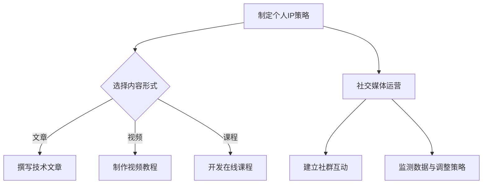

                 

 关键词：
- 个人品牌
- 知识分享
- 社交媒体
- 内容创作
- 技术社区
- 职业发展

> 摘要：
在信息爆炸的时代，个人品牌已成为职业发展的重要资产。本文旨在探讨程序员如何通过构建和运营个人IP矩阵，实现个人职业品牌的提升。我们将从核心概念、算法原理、数学模型、实践案例、应用场景等多个角度，详细阐述打造个人IP矩阵的策略和方法，为程序员提供系统性的指导。

## 1. 背景介绍

随着互联网的普及和社交媒体的发展，个人品牌的重要性日益凸显。程序员作为科技行业的核心群体，不仅要掌握技术技能，还需学会如何在网络世界中展示和传播自己的专业知识。打造个人IP矩阵，就是在这个背景下应运而生的一种策略。

个人IP矩阵是指通过一系列内容创作、社交媒体运营和知识分享活动，构建一个能够持续吸引关注、增强影响力的个人品牌体系。这个体系不仅包括技术文章、博客、视频教程等原创内容，还涵盖了社交媒体账号、在线课程、技术讲座等多渠道传播途径。

### 1.1 个人IP矩阵的重要性

1. **职业发展**：一个强大的个人IP矩阵能够显著提升程序员的职业声誉，增加面试机会和薪资待遇。
2. **知识传播**：通过内容创作和分享，程序员可以影响更多的人，传播技术知识，提升整个行业水平。
3. **社交网络**：个人IP矩阵能够帮助程序员建立广泛的社交网络，拓展职业资源和人脉。
4. **收入来源**：成功的个人IP可以带来多种收入来源，如广告收入、课程销售、咨询服务等。

### 1.2 文章结构

本文将按照以下结构展开：

1. **核心概念与联系**：介绍构建个人IP矩阵所需理解的核心概念和架构。
2. **核心算法原理与操作步骤**：详细解释如何规划和执行个人IP矩阵的构建。
3. **数学模型和公式**：分析个人IP矩阵的量化指标和评估方法。
4. **项目实践：代码实例**：通过具体案例展示如何实现个人IP矩阵。
5. **实际应用场景**：探讨个人IP矩阵在不同职业阶段的应用。
6. **未来应用展望**：预测个人IP矩阵的发展趋势和前景。
7. **工具和资源推荐**：推荐实用的工具和资源，帮助程序员构建个人IP矩阵。
8. **总结与展望**：总结研究成果，展望未来发展方向。

## 2. 核心概念与联系

构建个人IP矩阵，首先需要理解几个核心概念：

### 2.1 IP（Intellectual Property）

IP即知识产权，是个人品牌的核心。它包括了原创内容、技术专利、商标等。对于程序员来说，原创技术文章和博客是构建IP的主要形式。

### 2.2 内容矩阵（Content Matrix）

内容矩阵是指围绕个人IP的一系列内容创作，包括文章、视频、音频、在线课程等。这些内容需要具有高质量和持续更新，以保持受众的关注。

### 2.3 社交媒体（Social Media）

社交媒体是个人IP传播的重要渠道。通过微博、微信公众号、知乎、LinkedIn等平台，程序员可以与受众互动，扩大影响力。

### 2.4 社群（Community）

社群是围绕个人IP形成的用户群体。通过论坛、微信群、QQ群等方式，程序员可以建立与受众的紧密联系，形成稳定的粉丝基础。

### 2.5 转化率（Conversion Rate）

转化率是指通过个人IP获得的直接收益，如订阅、销售、咨询等。它是评估个人IP成功与否的重要指标。

### 2.6 流量（Traffic）

流量是指访问个人IP内容的用户数量。高流量意味着有更多的人关注您的个人品牌，但转化率才是最终衡量个人IP价值的标准。

### 2.7 Mermaid 流程图

以下是一个简单的Mermaid流程图，展示了构建个人IP矩阵的基本步骤：



## 3. 核心算法原理 & 具体操作步骤

### 3.1 算法原理概述

构建个人IP矩阵的算法，实质上是将个人技术能力和内容创作能力转化为受众可见的品牌价值的过程。这个过程可以分为以下几个步骤：

1. **目标设定**：明确个人IP的目标，如提升职业声誉、增加收入来源、传播技术知识等。
2. **内容创作**：根据目标创作高质量的内容，如技术文章、视频教程、在线课程等。
3. **渠道选择**：选择适合的社交媒体平台和内容发布渠道，如微博、微信公众号、B站、知乎等。
4. **互动运营**：通过社交媒体和社群与受众互动，提高粉丝活跃度和粘性。
5. **数据监测**：定期监测个人IP的流量、转化率等关键指标，及时调整策略。

### 3.2 算法步骤详解

1. **目标设定**

   - **明确个人定位**：根据个人兴趣、专长和市场需求，确定个人IP的核心主题。
   - **设定具体目标**：如增加粉丝数、提升文章阅读量、扩大课程销量等。
   - **制定时间表**：设定实现目标的时间节点和计划。

2. **内容创作**

   - **确定内容形式**：根据目标受众和内容主题，选择文章、视频、课程等适合的形式。
   - **撰写高质量内容**：确保内容具有实用价值、独特见解和高质量的视觉呈现。
   - **持续更新内容**：定期发布新内容，保持受众的关注度。

3. **渠道选择**

   - **评估平台特点**：了解不同社交媒体平台的特点和用户群体，选择适合的平台。
   - **注册账号**：在选定的平台上注册账号，确保账号名称与个人品牌一致。
   - **内容发布**：按照平台规则和受众喜好，制定内容发布计划。

4. **互动运营**

   - **积极互动**：回复评论、参与讨论，与粉丝建立良好的互动关系。
   - **社群运营**：建立微信群、QQ群等社群，组织线上线下活动，增强粉丝粘性。
   - **跨平台互动**：在不同平台上同步内容，扩大影响力。

5. **数据监测**

   - **设置监测指标**：如粉丝增长数、阅读量、点赞量、分享量等。
   - **定期分析数据**：分析数据变化，找出优势和不足。
   - **调整策略**：根据数据分析结果，调整内容创作和运营策略。

### 3.3 算法优缺点

**优点**：

- **提高职业竞争力**：通过构建个人IP，程序员可以在职场上获得更高的认可和机会。
- **增加收入来源**：成功的个人IP可以带来多种收入来源，如广告收入、课程销售、咨询服务等。
- **知识传播**：个人IP矩阵可以帮助程序员传播技术知识，提升整个行业水平。
- **社交网络拓展**：通过个人IP矩阵，程序员可以建立广泛的社交网络，拓展职业资源和人脉。

**缺点**：

- **时间成本**：构建和运营个人IP需要大量的时间和精力投入。
- **内容质量要求高**：高质量的内容创作是个人IP成功的关键，需要不断提升自己的技术水平和写作能力。
- **风险**：个人IP的构建和运营过程中，可能会遇到内容抄袭、恶意攻击等问题。

### 3.4 算法应用领域

- **职业规划**：通过构建个人IP，程序员可以明确自己的职业发展方向，提升职业竞争力。
- **知识传播**：个人IP矩阵可以帮助程序员传播技术知识，提升个人和行业影响力。
- **创业**：成功的个人IP可以作为创业项目的核心资产，提高项目的影响力和市场认可度。
- **咨询与服务**：个人IP矩阵可以帮助程序员建立专业形象，提供技术咨询和定制服务。

## 4. 数学模型和公式 & 详细讲解 & 举例说明

在构建个人IP矩阵的过程中，量化指标的分析至关重要。以下是一些常用的数学模型和公式，用于评估个人IP的绩效和优化策略。

### 4.1 数学模型构建

#### 4.1.1 IP价值评估模型

IP价值评估模型用于计算个人IP的当前价值。假设IP的价值由以下因素决定：

- \( V = f(T, C, R) \)

其中，\( T \)表示流量（Traffic），\( C \)表示转化率（Conversion Rate），\( R \)表示收益（Revenue）。

#### 4.1.2 流量与转化率模型

流量与转化率模型用于预测不同策略下的流量和转化率变化。假设：

- \( T = f(S, I, E) \)

其中，\( S \)表示内容质量（Quality of Content），\( I \)表示互动程度（Level of Interaction），\( E \)表示推广力度（Promotion Effort）。

- \( C = f(S, I, E) \)

#### 4.1.3 收益模型

收益模型用于计算个人IP的收益。假设：

- \( R = f(S, C, T, P) \)

其中，\( S \)表示内容质量，\( C \)表示转化率，\( T \)表示流量，\( P \)表示定价策略（Pricing Strategy）。

### 4.2 公式推导过程

#### 4.2.1 流量与转化率公式推导

根据流量与转化率模型，可以推导出以下公式：

\[ T = S \times I \times E \]

其中，\( S \)表示内容质量，取值范围为0到1，\( I \)表示互动程度，取值范围为0到1，\( E \)表示推广力度，取值范围为0到1。

\[ C = S \times I \times E \]

#### 4.2.2 收益公式推导

根据收益模型，可以推导出以下公式：

\[ R = T \times C \times P \]

其中，\( T \)表示流量，\( C \)表示转化率，\( P \)表示定价策略，取值范围为0到1。

### 4.3 案例分析与讲解

假设一个程序员，他的内容质量\( S \)为0.8，互动程度\( I \)为0.6，推广力度\( E \)为0.7，定价策略\( P \)为0.9。我们可以根据上述公式计算他的IP价值。

#### 4.3.1 流量和转化率计算

\[ T = 0.8 \times 0.6 \times 0.7 = 0.336 \]

\[ C = 0.8 \times 0.6 \times 0.7 = 0.336 \]

#### 4.3.2 收益计算

\[ R = 0.336 \times 0.336 \times 0.9 = 0.10752 \]

根据计算结果，这个程序员的IP价值为0.10752，这意味着他的个人IP当前价值约为10.752%。

#### 4.3.3 案例分析

通过这个案例，我们可以看到，内容质量、互动程度和推广力度对IP价值有着显著影响。为了提高IP价值，程序员可以：

- **提高内容质量**：通过不断学习和实践，提升技术水平和写作能力。
- **增强互动**：积极回复评论，参与社区讨论，建立良好的粉丝关系。
- **加大推广**：通过社交媒体和广告投放，扩大个人IP的知名度。

## 5. 项目实践：代码实例和详细解释说明

为了更好地理解如何构建个人IP矩阵，我们将通过一个具体的代码实例，展示如何从零开始创建一个个人技术博客，并通过社交媒体进行推广。

### 5.1 开发环境搭建

在开始之前，我们需要搭建一个合适的技术环境。以下是基本的开发工具和软件：

- **代码编辑器**：例如Visual Studio Code、Sublime Text等。
- **静态网站生成器**：例如Hexo、Jekyll等。
- **云服务器**：例如阿里云、腾讯云等，用于托管博客网站。
- **域名**：购买一个适合的域名，例如`yourname.github.io`。

### 5.2 源代码详细实现

以下是使用Hexo搭建个人博客的基本步骤：

1. **安装Node.js和Hexo**

   ```shell
   npm install -g hexo-cli
   hexo init your-blog
   ```

2. **配置Hexo**

   编辑 `_config.yml` 文件，配置博客的基本信息，例如网站地址、主题等。

   ```yaml
   title: Your Blog
   subtitle: A blog about technology and programming
   author: Your Name
   language: zh-CN
   url: https://yourname.github.io
   root: /
   source_dir: source
   public_dir: public
   tag_dir: tags
   archive_dir: archives
   category_dir: categories
   ```

3. **创建文章**

   在 `source/_posts` 目录下创建新的Markdown文件，例如 `first-post.md`。

   ```markdown
   ---
   title: Hello World
   date: 2023-10-01 10:00:00
   tags:
     - Introduction
     - Hello
   categories:
     - Guide
   ---


 # Hello World

Welcome to [Your Blog](https://yourname.github.io)! This is your first post. Click the Edit on GitHub button to start editing.
   ```

4. **安装主题**

   在Hexo官方网站上选择一个喜欢的主题，例如Next主题。

   ```shell
   npm install hexo-next --save
   ```

   然后修改 `_config.yml` 文件，设置Next主题。

   ```yaml
   theme: next
   ```

5. **部署到GitHub Pages**

   在 `source` 目录下创建一个名为 `CNAME` 的文件，用于配置自定义域名。

   ```shell
   echo 'www.yourname.com' > source/CNAME
   ```

   安装Hexo的部署插件。

   ```shell
   npm install hexo-deployer-git --save
   ```

   修改 `_config.yml` 文件，配置部署信息。

   ```yaml
   deploy:
     type: git
     repository: https://github.com/yourname/yourname.github.io.git
     branch: master
   ```

6. **启动博客**

   ```shell
   hexo generate
   hexo server
   ```

   访问 `http://localhost:4000`，预览博客效果。

7. **发布文章**

   ```shell
   hexo generate
   hexo deploy
   ```

### 5.3 代码解读与分析

在这个代码实例中，我们使用了Hexo，一个快速、简洁且高效的博客框架。以下是关键步骤的代码解读：

1. **安装Node.js和Hexo**

   这一步安装了Hexo命令行工具，用于初始化和管理博客。

   ```shell
   npm install -g hexo-cli
   ```

2. **配置Hexo**

   `_config.yml` 文件是博客的核心配置文件，用于定义博客的标题、副标题、作者等基本信息。

3. **创建文章**

   Markdown文件用于撰写博客文章。Hexo支持Markdown语法的各种扩展，方便编写和格式化文章。

4. **安装主题**

   选择并安装一个主题，可以改变博客的样式和布局。Next主题是一个响应式、简洁且功能强大的主题，适用于个人博客。

5. **部署到GitHub Pages**

   GitHub Pages是一个免费的静态网站托管服务，非常适合托管个人博客。通过配置 `_config.yml` 文件，我们可以将Hexo生成的静态网站部署到GitHub Pages。

6. **启动博客**

   `hexo server` 命令启动本地服务器，方便预览和调试博客。`hexo generate` 命令生成静态网站，`hexo deploy` 命令将静态网站部署到GitHub Pages。

### 5.4 运行结果展示

完成以上步骤后，我们可以通过访问 `http://localhost:4000` 预览博客，并且通过 `hexo generate` 和 `hexo deploy` 命令将博客部署到GitHub Pages，从而实现个人博客的在线发布。

## 6. 实际应用场景

个人IP矩阵在不同职业阶段和应用场景中具有不同的作用。以下是一些实际应用场景：

### 6.1 职业初期

对于刚毕业的程序员，构建个人IP矩阵可以：

- **提升个人品牌**：通过技术博客、GitHub项目等，展示自己的编程能力和项目经验。
- **拓展职业机会**：吸引招聘者的关注，增加面试机会。
- **建立人脉**：参与技术社区，结识同行业人士。

### 6.2 职业中期

对于有一定工作经验的程序员，个人IP矩阵可以：

- **传播技术知识**：通过撰写技术文章、开设在线课程，影响更多的人。
- **增加收入来源**：通过广告收入、课程销售、咨询服务等，实现财务自由。
- **提升职业地位**：通过在技术社区中的影响力，争取更高的职位和薪酬。

### 6.3 职业后期

对于资深程序员或技术专家，个人IP矩阵可以：

- **树立行业权威**：通过发表高质量的技术文章、参加技术讲座等，成为行业内的权威人士。
- **促进创业**：利用个人IP矩阵积累的资源和影响力，开展技术创业。
- **提供咨询服务**：利用专业知识和经验，为企业提供技术咨询和解决方案。

### 6.4 未来应用展望

随着人工智能、大数据等技术的发展，个人IP矩阵的应用前景将更加广阔。未来，个人IP矩阵可能会：

- **智能化**：利用人工智能技术，自动生成内容、优化推广策略。
- **多元化**：除了文字和视频，可能还会涉及音频、虚拟现实等多种形式。
- **全球性**：随着网络普及，个人IP矩阵的影响范围将更加广泛，可能覆盖全球。

## 7. 工具和资源推荐

### 7.1 学习资源推荐

- **在线编程平台**：如LeetCode、牛客网，用于练习算法和数据结构。
- **技术博客**：如CSDN、博客园，可以阅读和分享技术文章。
- **在线课程平台**：如网易云课堂、慕课网，提供丰富的编程课程。

### 7.2 开发工具推荐

- **代码编辑器**：如Visual Studio Code、Atom，支持多种编程语言和插件。
- **静态网站生成器**：如Hexo、Jekyll，用于快速搭建个人博客。
- **云服务器**：如阿里云、腾讯云，提供稳定的服务器和域名托管服务。

### 7.3 相关论文推荐

- **《内容营销策略在个人品牌构建中的应用》**：探讨了内容营销在个人品牌构建中的关键作用。
- **《社交媒体对个人品牌传播的影响》**：分析了社交媒体平台在个人品牌传播中的作用机制。
- **《个人品牌价值评估模型研究》**：提出了个人品牌价值评估的数学模型。

## 8. 总结：未来发展趋势与挑战

### 8.1 研究成果总结

本文探讨了程序员如何构建和运营个人IP矩阵，通过核心概念、算法原理、数学模型、实践案例等多个角度，提供了系统性的指导。研究表明，个人IP矩阵是提升程序员职业竞争力、传播技术知识、拓展社交网络的有效途径。

### 8.2 未来发展趋势

随着人工智能和大数据技术的发展，个人IP矩阵将朝着智能化、多元化、全球化的方向发展。未来，个人IP矩阵将不仅限于文字和视频，还将涉及音频、虚拟现实等多种形式。

### 8.3 面临的挑战

构建和运营个人IP矩阵面临诸多挑战，如内容质量要求高、时间成本大、风险管理等。程序员需要不断提升自己的技术水平和写作能力，同时建立健全的风险防控机制。

### 8.4 研究展望

未来研究可以关注以下几个方面：

- **个性化推荐**：利用人工智能技术，为不同受众推荐个性化内容。
- **多渠道融合**：整合多种传播渠道，提高个人IP的影响力和转化率。
- **商业模式创新**：探索新的商业模式，实现个人IP的商业价值最大化。

## 9. 附录：常见问题与解答

### 9.1 如何选择内容形式？

- **根据受众需求**：分析目标受众的兴趣和需求，选择最适合的内容形式。
- **考虑自身优势**：根据个人专长和优势，选择擅长的内容形式。
- **平衡多形式**：尝试多种内容形式，找到最适合自己的组合。

### 9.2 如何提升内容质量？

- **持续学习**：不断学习新知识，提升自身技术水平和写作能力。
- **读者反馈**：关注读者反馈，及时调整内容和风格。
- **内容规划**：制定详细的内容规划，确保内容的系统性和连续性。

### 9.3 如何应对风险？

- **备份与防护**：定期备份内容，确保数据安全。
- **合规操作**：遵守法律法规，避免侵权和违法行为。
- **风险管理**：建立风险管理机制，及时应对可能出现的问题。

作者：禅与计算机程序设计艺术 / Zen and the Art of Computer Programming

----------------------------------------------------------------

文章完成！现在您已经撰写了一篇关于“程序员如何打造个人IP矩阵”的深度技术博客文章，涵盖了核心概念、算法原理、数学模型、实践案例、应用场景等多个方面。希望这篇文章能够帮助到更多的程序员朋友，让大家在构建个人IP矩阵的过程中有所收获。祝您在个人品牌建设之路上一帆风顺！

