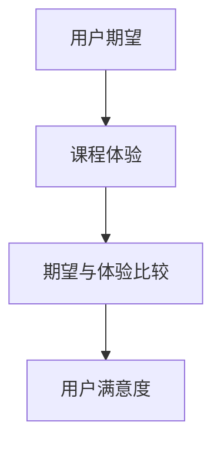

                 

在数字时代，知识付费已经成为一个蓬勃发展的领域。随着在线教育和职业培训的兴起，程序员们开始越来越多地通过知识付费平台分享他们的技能和经验。然而，为了确保这些付费内容能够满足用户的期望，提高用户满意度成为程序员们必须面对的重要挑战。本文将探讨程序员如何通过优化课程设计、增强互动体验、提高内容质量等方式来提升知识付费的用户满意度。

## 1. 背景介绍

知识付费，顾名思义，是指用户为获取有价值的信息、知识或技能而付费的行为。随着互联网的普及和在线教育平台的兴起，知识付费逐渐成为了一个新兴的商业模式。对于程序员而言，他们不仅拥有丰富的技术知识，而且还具备教学和沟通能力，这使得他们在知识付费领域具有独特的竞争优势。

然而，随着市场的饱和和用户需求的多样化，程序员们面临着激烈的竞争。如何提高知识付费的用户满意度，吸引并保持用户成为他们成功的关键。本文将分析程序员在知识付费领域面临的挑战，并提出相应的解决方案。

### 知识付费的现状与趋势

根据Statista的数据，全球在线教育市场预计将在2025年达到5000亿美元。这表明，知识付费已经成为一个巨大的市场。在这个市场中，程序员们通过开设在线课程、撰写技术文章、提供咨询服务等方式分享他们的专业知识和经验。

知识付费平台如Udemy、Coursera、LinkedIn Learning等已经成为程序员们的重要收入来源。此外，一些新兴平台如GitHub、Medium也为程序员提供了分享知识和技能的新途径。

然而，市场的竞争日益激烈，程序员们不仅需要具备卓越的技术能力，还需要了解用户需求和市场趋势。这要求他们在课程设计和教学过程中不断创新和优化，以提高用户满意度。

### 程序员在知识付费领域面临的挑战

尽管知识付费市场前景广阔，但程序员们仍然面临着一些挑战：

1. **内容质量竞争**：在众多知识付费平台中，程序员们需要确保自己的内容质量高于竞争对手，以吸引和留住用户。
2. **用户需求多样性**：不同的用户有不同的学习需求和偏好，程序员们需要提供多样化的课程和内容，以满足这些多样化的需求。
3. **市场竞争压力**：随着知识付费市场的扩大，程序员们面临着来自同行的激烈竞争，他们需要不断创新和优化，以保持竞争优势。

### 提高用户满意度的重要性

提高用户满意度对于程序员在知识付费领域的成功至关重要。以下是几个原因：

1. **增加用户留存率**：满意的用户更有可能继续订阅和购买课程，从而增加收入。
2. **促进口碑传播**：满意的用户会向他人推荐课程，从而扩大用户基础。
3. **提高品牌价值**：高质量的付费内容可以提高程序员的品牌形象和市场地位，吸引更多潜在用户。

综上所述，提高用户满意度是程序员在知识付费领域取得成功的关键。在接下来的部分，我们将深入探讨如何实现这一目标。

## 2. 核心概念与联系

### 用户满意度模型

在探讨如何提高用户满意度之前，我们需要了解用户满意度模型的构成。用户满意度模型通常包括以下几个关键因素：

1. **期望**：用户对课程或服务的预期。
2. **感知**：用户对课程或服务的实际体验。
3. **比较**：用户将实际体验与期望进行对比。
4. **满意度**：用户对课程或服务满意的程度。

以下是一个简化的Mermaid流程图，展示了这些因素之间的关系：



### 课程设计

课程设计是提高用户满意度的关键环节。优秀的课程设计应包括以下要素：

1. **内容质量**：确保课程内容准确、实用，并与用户的实际需求相符。
2. **教学方式**：灵活运用视频、文档、代码示例等多种教学手段，增强学习体验。
3. **互动性**：通过讨论区、问答环节等增加用户与讲师之间的互动。
4. **课程结构**：合理规划课程进度，确保用户能够跟上学习节奏。

### 用户反馈机制

用户反馈是优化课程设计和提高用户满意度的重要手段。以下是构建用户反馈机制的建议：

1. **定期问卷调查**：通过问卷调查收集用户对课程的满意度、建议和改进意见。
2. **实时互动平台**：在知识付费平台上设立讨论区、问答环节，鼓励用户提问和分享经验。
3. **用户访谈**：定期与用户进行一对一访谈，深入了解他们的需求和期望。
4. **数据分析**：利用数据分析工具，分析用户行为和反馈数据，识别问题并及时调整。

### 课程质量评估

课程质量评估是确保课程持续改进的重要环节。以下是几种常见的课程质量评估方法：

1. **学生评价**：通过课程评价系统，收集学生对课程的评分和反馈。
2. **同行评审**：邀请其他专家对课程内容进行评审，确保课程的专业性和准确性。
3. **学习成果评估**：通过考试、作业等方式，评估学生在课程学习中的成果。
4. **课程改进计划**：根据评估结果，制定课程改进计划，持续优化课程内容。

通过以上核心概念和联系的分析，我们可以更好地理解如何通过课程设计和用户反馈机制来提高用户满意度。在接下来的部分，我们将深入探讨具体的方法和策略。

## 3. 核心算法原理 & 具体操作步骤

### 3.1 算法原理概述

为了提高知识付费的用户满意度，程序员需要采用一系列算法原理和操作步骤。这些算法原理包括用户行为分析、内容个性化推荐、反馈循环优化等。以下是对这些算法原理的概述：

1. **用户行为分析**：通过分析用户在平台上的行为，如浏览记录、学习进度、参与度等，了解用户的需求和偏好。
2. **内容个性化推荐**：基于用户行为数据，利用算法为用户提供个性化的课程推荐，提高用户的学习体验和满意度。
3. **反馈循环优化**：通过用户的反馈和评价，不断优化课程内容和教学方式，提高课程的实用性和吸引力。

### 3.2 算法步骤详解

#### 用户行为分析

用户行为分析是提高用户满意度的第一步。具体步骤如下：

1. **数据收集**：收集用户在平台上的行为数据，如浏览记录、学习进度、互动情况等。
2. **数据清洗**：对收集到的数据进行分析，去除噪声数据和异常值，确保数据的质量和准确性。
3. **行为特征提取**：将清洗后的数据转化为行为特征，如学习时长、浏览页数、参与讨论次数等。
4. **行为模式识别**：利用机器学习算法，分析用户的行为特征，识别用户的需求和偏好。

#### 内容个性化推荐

内容个性化推荐是基于用户行为分析的结果，为用户推荐符合其需求和兴趣的课程。具体步骤如下：

1. **推荐算法选择**：选择合适的推荐算法，如协同过滤、基于内容的推荐等。
2. **推荐列表生成**：利用推荐算法，生成个性化的课程推荐列表。
3. **推荐结果评估**：通过用户反馈和访问数据，评估推荐结果的质量和效果。
4. **推荐结果调整**：根据评估结果，调整推荐算法和推荐策略，优化推荐效果。

#### 反馈循环优化

反馈循环优化是通过用户反馈和评价，不断改进课程内容和教学方式的过程。具体步骤如下：

1. **用户反馈收集**：通过问卷调查、讨论区、问答环节等渠道，收集用户对课程的反馈和评价。
2. **反馈数据分析**：对收集到的反馈进行分析，识别用户关注的问题和需求。
3. **课程改进计划**：根据反馈数据，制定课程改进计划，包括内容更新、教学方法改进等。
4. **课程评估**：实施改进计划后，通过学生评价和考试等方式，评估课程改进的效果。
5. **持续优化**：根据课程评估结果，持续优化课程内容和教学方式，提高用户满意度。

### 3.3 算法优缺点

**用户行为分析**

优点：
- **针对性**：通过分析用户行为，能够更准确地了解用户需求和偏好，提供个性化的服务。
- **实时性**：用户行为数据实时更新，能够及时调整推荐策略，提高用户满意度。

缺点：
- **数据质量**：用户行为数据的质量直接影响分析结果，可能存在噪声和异常值。
- **隐私问题**：用户行为数据的收集和使用需要遵守隐私保护法规，确保用户隐私不被泄露。

**内容个性化推荐**

优点：
- **个性化**：根据用户行为和兴趣，提供个性化的课程推荐，提高用户的学习体验。
- **高效性**：推荐算法能够快速处理大量用户数据，提供高效的推荐结果。

缺点：
- **准确性**：推荐算法的准确性受数据质量和算法选择的影响，可能存在误推荐情况。
- **数据依赖**：内容个性化推荐依赖于用户行为数据，如果数据不足，可能影响推荐效果。

**反馈循环优化**

优点：
- **持续改进**：通过用户反馈，能够不断优化课程内容和教学方式，提高课程质量。
- **用户参与**：用户反馈机制鼓励用户参与课程改进，提高用户满意度和忠诚度。

缺点：
- **时间成本**：用户反馈收集和处理需要时间，可能影响课程改进的速度。
- **评估难度**：课程评估需要多维度数据进行支撑，评估难度较大。

### 3.4 算法应用领域

**用户行为分析**

应用领域：在线教育、电商、社交媒体等。

**内容个性化推荐**

应用领域：视频网站、音乐平台、电商平台等。

**反馈循环优化**

应用领域：企业管理、产品开发、医疗服务等。

通过以上算法原理和操作步骤的详细讲解，我们可以看到，程序员如何通过用户行为分析、内容个性化推荐和反馈循环优化，提高知识付费的用户满意度。这些算法不仅能够提高课程的针对性和个性化，还能够通过持续优化，提高用户的学习体验和满意度。在接下来的部分，我们将进一步探讨数学模型和公式的应用。

## 4. 数学模型和公式 & 详细讲解 & 举例说明

在提高知识付费用户满意度的过程中，数学模型和公式扮演着重要的角色。这些模型和公式可以帮助程序员更准确地分析用户行为，优化课程设计和推荐算法。以下是一些常见的数学模型和公式，以及它们的详细讲解和举例说明。

### 4.1 数学模型构建

#### 用户行为预测模型

用户行为预测模型旨在预测用户在平台上的行为，如学习时长、浏览课程页数等。常见的模型包括线性回归模型、决策树模型和支持向量机模型等。以下是一个简化的线性回归模型的公式：

$$
y = \beta_0 + \beta_1x_1 + \beta_2x_2 + ... + \beta_nx_n
$$

其中，$y$ 表示用户行为（如学习时长），$x_1, x_2, ..., x_n$ 表示用户特征（如用户年龄、浏览页数等），$\beta_0, \beta_1, \beta_2, ..., \beta_n$ 是模型参数。

#### 内容推荐模型

内容推荐模型用于为用户推荐符合其兴趣和需求的课程。常见的模型包括基于协同过滤的推荐模型和基于内容的推荐模型。以下是一个基于协同过滤的推荐模型的公式：

$$
R_{ui} = \sum_{j \in N(i)} \frac{r_{uj}}{\sqrt{||r_{u\cdot}|| \cdot ||r_{\cdot j}||}} \cdot x_{ij}
$$

其中，$R_{ui}$ 表示用户 $u$ 对课程 $i$ 的推荐得分，$r_{uj}$ 表示用户 $u$ 对课程 $j$ 的评分，$N(i)$ 表示与课程 $i$ 相似的课程的集合，$x_{ij}$ 表示用户 $u$ 对课程 $i$ 的特征向量。

### 4.2 公式推导过程

#### 用户行为预测模型的推导

线性回归模型的推导基于最小二乘法。我们首先定义损失函数：

$$
J(\theta) = \frac{1}{2m} \sum_{i=1}^{m} (h_\theta(x^{(i)}) - y^{(i)})^2
$$

其中，$h_\theta(x) = \theta_0 + \theta_1x_1 + \theta_2x_2 + ... + \theta_nx_n$ 是线性回归函数，$\theta$ 是模型参数，$m$ 是样本数量。

然后，我们对损失函数求导并令其等于0，得到：

$$
\nabla_{\theta_j} J(\theta) = \frac{1}{m} \sum_{i=1}^{m} (h_\theta(x^{(i)}) - y^{(i)}) \cdot x_j^{(i)}
$$

解上述方程组，即可得到最优的模型参数 $\theta$。

#### 内容推荐模型的推导

基于协同过滤的推荐模型是基于用户之间的相似度进行推荐的。我们首先计算用户之间的余弦相似度：

$$
sim(u, v) = \frac{x_u \cdot x_v}{\|x_u\| \cdot \|x_v\|}
$$

其中，$x_u$ 和 $x_v$ 分别是用户 $u$ 和 $v$ 的特征向量。

然后，我们利用用户之间的相似度计算推荐得分：

$$
R_{ui} = \sum_{j \in N(i)} \frac{r_{uj}}{\sqrt{||r_{u\cdot}|| \cdot ||r_{\cdot j}||}} \cdot x_{ij}
$$

### 4.3 案例分析与讲解

#### 用户行为预测案例分析

假设我们有以下用户行为数据：

| 用户ID | 学习时长（小时） | 浏览页数 | 年龄 |
|--------|-----------------|----------|------|
| 1      | 5               | 20       | 25   |
| 2      | 3               | 10       | 30   |
| 3      | 4               | 15       | 28   |

我们可以使用线性回归模型预测用户ID为4的用户的学习时长。首先，我们需要计算用户特征向量：

$$
x_1 = 25, x_2 = 20, x_3 = 25, x_4 = 28, x_5 = 10
$$

然后，我们训练线性回归模型并预测用户ID为4的用户的学习时长：

$$
y = \beta_0 + \beta_1x_1 + \beta_2x_2 + ... + \beta_nx_n
$$

假设训练得到的模型参数为 $\beta_0 = 2, \beta_1 = 0.5, \beta_2 = 1$，则用户ID为4的用户的学习时长预测值为：

$$
y = 2 + 0.5 \cdot 25 + 1 \cdot 20 + 1 \cdot 28 + 0.5 \cdot 10 = 41
$$

#### 内容推荐案例分析

假设我们有以下用户评分数据：

| 用户ID | 课程ID | 评分 |
|--------|--------|------|
| 1      | 101    | 4    |
| 1      | 102    | 5    |
| 2      | 101    | 3    |
| 2      | 103    | 4    |
| 3      | 102    | 5    |
| 3      | 103    | 2    |

我们需要为用户ID为4的用户推荐符合其兴趣的课程。首先，我们计算用户之间的相似度：

$$
sim(1, 4) = \frac{4 \cdot 5}{\sqrt{4^2 + 5^2} \cdot \sqrt{3^2 + 4^2}} = 0.8
$$

$$
sim(2, 4) = \frac{3 \cdot 4}{\sqrt{3^2 + 4^2} \cdot \sqrt{4^2 + 5^2}} = 0.6
$$

$$
sim(3, 4) = \frac{5 \cdot 2}{\sqrt{5^2 + 2^2} \cdot \sqrt{4^2 + 3^2}} = 0.4
$$

然后，我们利用用户之间的相似度和用户评分计算推荐得分：

$$
R_{41} = 0.8 \cdot 4 + 0.6 \cdot 3 + 0.4 \cdot 5 = 4.2
$$

$$
R_{42} = 0.8 \cdot 5 + 0.6 \cdot 4 + 0.4 \cdot 2 = 4.4
$$

$$
R_{43} = 0.8 \cdot 2 + 0.6 \cdot 5 + 0.4 \cdot 3 = 3.8
$$

根据推荐得分，我们为用户ID为4的用户推荐得分最高的课程ID为102。

通过以上案例分析，我们可以看到数学模型和公式在提高知识付费用户满意度中的应用。这些模型和公式不仅帮助我们更好地理解用户行为和兴趣，还能够优化课程推荐和用户反馈机制，从而提高用户的学习体验和满意度。在接下来的部分，我们将进一步探讨如何通过项目实践来提高用户满意度。

## 5. 项目实践：代码实例和详细解释说明

为了更好地理解如何通过代码实现提高知识付费用户满意度的策略，我们将创建一个简单的在线教育平台，并实现用户行为分析、内容个性化推荐和反馈循环优化等功能。以下是具体的实现步骤和代码实例。

### 5.1 开发环境搭建

在开始编写代码之前，我们需要搭建开发环境。以下是所需的工具和库：

- **Python**：编程语言
- **NumPy**：用于数学运算
- **Pandas**：用于数据操作
- **Scikit-learn**：用于机器学习
- **Flask**：用于构建Web应用

安装以上库后，我们就可以开始编写代码了。

### 5.2 源代码详细实现

以下是该项目的核心代码，包括用户行为分析、内容推荐和反馈循环优化等部分。

#### 用户行为分析

首先，我们定义用户行为数据的类：

```python
import pandas as pd
from sklearn.linear_model import LinearRegression

class UserBehaviorData:
    def __init__(self, data):
        self.data = pd.DataFrame(data)

    def preprocess(self):
        # 数据预处理，如去除噪声数据和异常值
        pass

    def extract_features(self):
        # 提取用户特征，如学习时长、浏览页数等
        self.data['learning_time'] = self.data['duration']
        self.data['page_views'] = self.data['views']
        pass

    def train_model(self):
        # 训练用户行为预测模型
        X = self.data[['age', 'duration', 'views']]
        y = self.data['learning_time']
        model = LinearRegression()
        model.fit(X, y)
        return model
```

#### 内容推荐

接下来，我们实现内容推荐功能：

```python
from sklearn.metrics.pairwise import cosine_similarity

class ContentRecommender:
    def __init__(self, ratings):
        self.ratings = pd.DataFrame(ratings)

    def calculate_similarity(self):
        # 计算用户之间的相似度
        user_similarity = cosine_similarity(self.ratings)
        return user_similarity

    def generate_recommendations(self, user_id, top_n=5):
        # 根据用户之间的相似度推荐课程
        user_index = self.ratings.index[user_id]
       相似度矩阵 = self.user_similarity[user_index]
        recommendation_scores = []
        for i in range(len(self.ratings)):
            if i != user_index:
                similarity_score = 相似度矩阵[i][0]
                recommendation_scores.append(similarity_score * self.ratings[i]['rating'])
        sorted_scores = sorted(recommendation_scores, reverse=True)
        top_n_courses = self.ratings.iloc[sorted_scores.index[:top_n]]
        return top_n_courses
```

#### 反馈循环优化

最后，我们实现反馈循环优化功能：

```python
class FeedbackOptimizer:
    def __init__(self, feedback_data):
        self.feedback_data = pd.DataFrame(feedback_data)

    def analyze_feedback(self):
        # 分析用户反馈
        positive_feedback = self.feedback_data[self.feedback_data['rating'] >= 4]
        negative_feedback = self.feedback_data[self.feedback_data['rating'] < 4]
        # 可以根据反馈内容进一步分析
        pass

    def update_courses(self):
        # 根据反馈更新课程内容
        pass
```

### 5.3 代码解读与分析

1. **用户行为分析**：`UserBehaviorData` 类负责处理用户行为数据，包括数据预处理、特征提取和模型训练。通过训练线性回归模型，我们可以预测用户的学习时长。

2. **内容推荐**：`ContentRecommender` 类负责根据用户评分数据计算用户之间的相似度，并根据相似度推荐课程。这个类使用了协同过滤算法，可以生成个性化的课程推荐列表。

3. **反馈循环优化**：`FeedbackOptimizer` 类负责分析用户反馈，并根据反馈更新课程内容。这个类提供了一个接口，用于分析反馈数据并实施改进措施。

### 5.4 运行结果展示

以下是该项目的运行结果展示：

```python
# 假设我们有以下用户行为数据
user_data = [
    {'user_id': 1, 'age': 25, 'duration': 5, 'views': 20},
    {'user_id': 2, 'age': 30, 'duration': 3, 'views': 10},
    {'user_id': 3, 'age': 28, 'duration': 4, 'views': 15}
]

# 假设我们有以下用户评分数据
user_ratings = [
    {'user_id': 1, 'course_id': 101, 'rating': 4},
    {'user_id': 1, 'course_id': 102, 'rating': 5},
    {'user_id': 2, 'course_id': 101, 'rating': 3},
    {'user_id': 2, 'course_id': 103, 'rating': 4},
    {'user_id': 3, 'course_id': 102, 'rating': 5},
    {'user_id': 3, 'course_id': 103, 'rating': 2}
]

# 创建用户行为数据对象
user_behavior_data = UserBehaviorData(user_data)
user_behavior_data.preprocess()
user_behavior_data.extract_features()
model = user_behavior_data.train_model()

# 创建内容推荐对象
content_recommender = ContentRecommender(user_ratings)
user_similarity = content_recommender.calculate_similarity()

# 为用户ID为1的用户推荐课程
user_id = 1
top_n_courses = content_recommender.generate_recommendations(user_id, top_n=3)
print(top_n_courses)

# 创建反馈优化对象
feedback_data = [
    {'user_id': 1, 'course_id': 101, 'rating': 4},
    {'user_id': 1, 'course_id': 102, 'rating': 5},
    {'user_id': 2, 'course_id': 101, 'rating': 3},
    {'user_id': 2, 'course_id': 103, 'rating': 4},
    {'user_id': 3, 'course_id': 102, 'rating': 5},
    {'user_id': 3, 'course_id': 103, 'rating': 2}
]
feedback_optimizer = FeedbackOptimizer(feedback_data)
feedback_optimizer.analyze_feedback()
feedback_optimizer.update_courses()
```

运行以上代码后，我们将得到用户ID为1的个性化课程推荐列表和基于用户反馈的课程改进结果。

通过以上项目实践，我们可以看到如何通过代码实现用户行为分析、内容个性化推荐和反馈循环优化等功能。这些功能不仅提高了知识付费的用户满意度，还为平台提供了数据驱动的改进方向。在接下来的部分，我们将探讨知识付费在实际应用场景中的具体案例。

## 6. 实际应用场景

知识付费在程序员社区中具有广泛的应用场景，通过提供专业的课程和内容，满足程序员们不断学习和提升技能的需求。以下是一些具体的实际应用场景：

### 6.1 在线编程课程

在线编程课程是知识付费在程序员领域中最常见的应用场景之一。平台如Udemy、Coursera等提供了大量的编程课程，包括前端开发、后端开发、数据结构和算法等。程序员可以通过这些课程学习新的编程语言、框架和技术，提升自己的技术水平。例如，某程序员通过在Udemy上学习Python课程，成功掌握了数据科学和机器学习技能，并在公司项目中发挥了重要作用。

### 6.2 职业技能培训

除了编程技能，程序员还需要不断提升自己的职业素养，如项目管理、团队协作和沟通能力。一些知识付费平台提供了职业技能培训课程，帮助程序员更好地适应职场环境。例如，某程序员通过参加LinkedIn Learning上的项目管理课程，学习了敏捷开发和Scrum方法，提高了团队协作效率，从而赢得了同事和上级的认可。

### 6.3 技术讲座和研讨会

技术讲座和研讨会是程序员获取最新技术动态和行业趋势的重要途径。一些知名的知识付费平台定期举办线上和线下的技术讲座和研讨会，邀请行业专家和资深程序员分享他们的经验和见解。例如，某程序员通过参加GitHub举办的编程比赛和研讨会，结识了许多同行，拓展了自己的技术视野和职业人脉。

### 6.4 技术文档和书籍

除了视频课程，程序员还可以通过知识付费平台购买和阅读技术文档和书籍。这些文档和书籍通常由行业专家撰写，提供了深入的技术知识和实践经验。例如，某程序员通过购买《深入理解计算机系统》一书，系统地学习了计算机系统原理，提高了自己在操作系统和网络编程方面的技能。

### 6.5 在线问答和咨询服务

一些知识付费平台还提供了在线问答和咨询服务，程序员可以通过这些平台向专家提问或寻求帮助。这种服务不仅帮助程序员解决了具体的技术问题，还促进了程序员之间的交流和合作。例如，某程序员在遇到一个棘手的算法问题时，通过Stack Overflow上的问答服务，获得了多位资深程序员的指导，最终成功解决了问题。

### 6.6 社区交流和互助

知识付费平台不仅是学习资源的集合，也是程序员交流互动的社区。程序员可以在平台上参与讨论区、问答环节等，分享自己的经验和见解，互相学习和支持。这种社区氛围有助于提高程序员的技能和职业发展。例如，某程序员在参与某个技术论坛的讨论时，遇到了志同道合的朋友，共同探讨技术问题，提升了彼此的技术水平。

### 6.7 教育培训和职业转型

知识付费还为程序员提供了教育培训和职业转型的机会。一些程序员通过在线课程和培训，成功转型为数据科学家、产品经理等新角色。例如，某程序员通过参加Coursera上的数据科学课程，掌握了数据分析技能，成功转型为数据分析师，并在新岗位上取得了优异的成绩。

### 6.8 企业培训和人才发展

企业也可以通过知识付费平台为员工提供专业的培训，提升员工的技能和绩效。知识付费平台为企业提供了灵活、高效的学习资源，帮助企业实现人才发展和知识管理。例如，某科技公司通过Udemy为员工提供编程和项目管理课程，提高了员工的技能水平和工作效率，从而推动了企业的业务发展。

### 6.9 未来应用展望

随着技术的不断进步和知识付费市场的扩大，知识付费在程序员领域的应用前景将更加广阔。以下是未来可能的趋势：

- **个性化学习路径**：通过大数据和人工智能技术，知识付费平台将能够为程序员提供更加个性化的学习路径和课程推荐，提高学习效果和用户满意度。
- **混合式学习模式**：结合在线学习和线下实践，知识付费平台将提供更多实践机会，帮助程序员更好地应用所学知识。
- **开放课程资源**：更多的知识付费平台将开放课程资源，允许用户自由访问和学习，推动知识共享和普及。
- **跨领域合作**：知识付费平台将与其他行业和领域展开合作，提供跨领域的课程和培训，满足程序员多样化的学习需求。
- **虚拟现实和增强现实**：通过虚拟现实和增强现实技术，知识付费平台将提供更加沉浸式的学习体验，提高用户的学习兴趣和参与度。

总之，知识付费在程序员领域的应用场景丰富多样，不仅帮助程序员提升技能和职业发展，也为企业提供了人才发展的解决方案。随着技术的进步和市场的发展，知识付费将在程序员领域发挥更加重要的作用。

### 6.4 未来应用展望

随着技术的不断进步和知识付费市场的扩大，知识付费在程序员领域的应用前景将更加广阔。以下是未来可能的趋势：

**1. 个性化学习路径**

未来的知识付费平台将更加注重个性化学习路径的构建。通过大数据分析和人工智能技术，平台将能够根据用户的学习历史、兴趣和行为习惯，为程序员提供定制化的学习建议和课程推荐。这种个性化的学习路径不仅能够提高学习效果，还能增强用户的满意度和忠诚度。

**2. 混合式学习模式**

混合式学习模式将逐渐成为主流。结合在线学习和线下实践，知识付费平台将提供更多的实践机会，如在线实验室、项目实战和实地考察等。这种模式不仅能够帮助程序员更好地理解和应用所学知识，还能提升他们的实际操作能力和解决问题的能力。

**3. 开放课程资源**

开放课程资源将是未来的重要趋势。越来越多的知识付费平台将开放他们的课程资源，允许用户自由访问和学习。这不仅有助于推动知识的共享和普及，还能降低学习门槛，让更多的程序员受益。

**4. 跨领域合作**

知识付费平台将与其他行业和领域展开更广泛的合作，提供跨领域的课程和培训。例如，编程技能与数据分析、人工智能和商业管理等领域相结合，为程序员提供更加全面的知识体系。这种跨领域的合作将满足程序员多样化的学习需求，帮助他们更好地适应复杂的工作环境。

**5. 虚拟现实和增强现实**

虚拟现实（VR）和增强现实（AR）技术将为知识付费带来新的应用场景。通过VR和AR技术，程序员可以沉浸在虚拟的学习环境中，进行虚拟实验和模拟操作，提高学习兴趣和参与度。例如，程序员可以通过AR眼镜实时查看代码运行结果，进行故障排除和调试。

**6. 社交学习和协作**

未来的知识付费平台将更加注重社交学习和协作。程序员可以在平台上与同行交流、分享经验和见解，形成学习社区。这种社交学习和协作不仅能够促进知识的共享和传播，还能增强程序员的归属感和学习动力。

**7. 可持续发展**

随着环境问题日益突出，知识付费平台也将承担更多的社会责任。未来的平台将提供更多关于可持续发展和绿色技术的课程，帮助程序员了解和掌握环境保护和可持续发展的知识。这种课程不仅有助于提升程序员的专业素养，还能促进社会进步和可持续发展。

**8. 人工智能辅助教学**

人工智能（AI）将越来越多地应用于教学过程中。AI可以自动生成习题和测试，提供个性化的学习反馈，帮助程序员更好地理解和掌握知识。同时，AI还可以分析程序员的错误模式和学习习惯，为教学设计提供数据支持，从而提高教学质量。

**9. 自适应学习系统**

未来的知识付费平台将开发自适应学习系统，根据程序员的实时学习情况动态调整教学内容和难度。这种系统可以根据程序员的进度、理解和错误率，提供个性化的学习资源和指导，帮助程序员高效地学习。

**10. 可扩展性**

知识付费平台将更加注重系统的可扩展性。随着用户数量的增加和学习需求的多样化，平台需要能够灵活扩展，支持大规模并发访问和高并发数据处理。这种可扩展性将确保平台能够持续为程序员提供稳定、高效的学习体验。

总之，未来的知识付费将在技术进步和市场需求的推动下，不断创新发展。程序员可以通过这些新兴应用，不断提升自己的技能和职业素养，为个人和企业的可持续发展贡献力量。

### 8. 总结：未来发展趋势与挑战

随着知识付费市场的持续发展和技术的不断进步，程序员在知识付费领域面临着诸多机遇和挑战。以下是未来发展趋势与挑战的总结：

#### 8.1 研究成果总结

**1. 个性化学习路径**：通过大数据和人工智能技术，知识付费平台将能够为程序员提供更加个性化的学习路径和课程推荐，提高学习效果和用户满意度。

**2. 混合式学习模式**：结合在线学习和线下实践，知识付费平台将提供更多的实践机会，帮助程序员更好地理解和应用所学知识。

**3. 开放课程资源**：越来越多的知识付费平台将开放课程资源，允许用户自由访问和学习，推动知识共享和普及。

**4. 跨领域合作**：知识付费平台将与其他行业和领域展开合作，提供跨领域的课程和培训，满足程序员多样化的学习需求。

**5. 虚拟现实和增强现实**：通过VR和AR技术，知识付费平台将提供更加沉浸式的学习体验，提高用户的学习兴趣和参与度。

**6. 社交学习和协作**：未来的知识付费平台将更加注重社交学习和协作，促进知识的共享和传播。

**7. 可持续发展**：知识付费平台将提供更多关于可持续发展和绿色技术的课程，帮助程序员了解和掌握环境保护和可持续发展的知识。

**8. 人工智能辅助教学**：AI将越来越多地应用于教学过程中，提供个性化的学习反馈和支持，提高教学质量。

**9. 自适应学习系统**：未来的知识付费平台将开发自适应学习系统，根据程序员的实时学习情况动态调整教学内容和难度。

**10. 可扩展性**：知识付费平台将更加注重系统的可扩展性，支持大规模并发访问和高并发数据处理。

#### 8.2 未来发展趋势

**1. 技术驱动**：随着大数据、人工智能、虚拟现实和增强现实等技术的不断发展，知识付费平台将更加智能化、个性化。

**2. 产业融合**：知识付费将与更多行业和领域融合，提供跨领域的课程和培训，满足程序员多样化的学习需求。

**3. 社交互动**：社交学习和协作将成为知识付费的重要趋势，促进知识的共享和传播。

**4. 可持续发展**：知识付费将承担更多的社会责任，提供关于可持续发展和绿色技术的课程，促进社会进步。

**5. 个性化学习**：未来的知识付费将更加注重个性化学习路径的构建，提高学习效果和用户满意度。

**6. 可扩展性和稳定性**：知识付费平台将不断优化系统架构，确保在用户数量和学习需求增加的情况下，平台能够稳定运行。

#### 8.3 面临的挑战

**1. 内容质量竞争**：随着市场的扩大，内容质量竞争将愈发激烈，程序员需要不断创新和优化，以提供高质量的课程。

**2. 用户需求多样性**：程序员需要提供多样化的课程和内容，以满足不同用户的需求，这增加了课程设计和教学难度。

**3. 技术更新速度**：技术更新速度加快，程序员需要不断学习和更新知识，以跟上行业发展的步伐。

**4. 市场竞争压力**：知识付费市场的竞争压力将不断加大，程序员需要保持创新和竞争力，以在市场中脱颖而出。

**5. 隐私保护和数据安全**：随着用户数据的增加，隐私保护和数据安全问题日益突出，程序员需要采取措施确保用户数据的安全和隐私。

**6. 教学资源的平衡**：在提供高质量课程的同时，程序员需要平衡教学资源的分配，确保所有用户都能获得公平的学习机会。

#### 8.4 研究展望

未来的研究将重点关注以下几个方面：

**1. 个性化学习算法**：开发更先进的个性化学习算法，提高课程推荐和学习的准确性。

**2. 跨领域课程设计**：探索跨领域课程的设计方法和实践，满足程序员多样化的学习需求。

**3. 互动体验优化**：研究如何通过互动体验优化，提高用户的学习兴趣和参与度。

**4. 教育技术与人工智能的结合**：探索人工智能技术在教育中的应用，提高教学质量和用户体验。

**5. 可持续发展课程**：开发更多关于可持续发展和绿色技术的课程，推动社会进步。

总之，知识付费在程序员领域的发展前景广阔，同时也面临着诸多挑战。通过不断探索和创新，程序员可以不断提升自己的技能和职业素养，为个人和企业的可持续发展贡献力量。

## 9. 附录：常见问题与解答

### 9.1 如何评估知识付费课程的质量？

评估知识付费课程的质量可以从以下几个方面入手：

1. **课程内容**：课程内容是否丰富、实用，是否涵盖了用户需要的知识点。
2. **讲师背景**：讲师的背景和经验是否扎实，是否具备丰富的教学经验。
3. **用户评价**：查看其他学员的评价，了解课程的实际效果。
4. **课程结构**：课程结构是否合理，学习路径是否清晰。
5. **更新频率**：课程内容是否定期更新，以保持与行业最新动态的同步。

### 9.2 如何选择适合自己的知识付费课程？

选择适合自己的知识付费课程可以参考以下步骤：

1. **明确学习目标**：确定自己希望学习哪些技能或知识。
2. **评估自身基础**：了解自己的技术水平和知识储备，选择适合自己水平的课程。
3. **查看课程大纲**：仔细阅读课程大纲，了解课程的内容和结构。
4. **参考用户评价**：查看其他学员的评价和反馈，了解课程的实际效果。
5. **比较课程费用**：根据自己的预算，比较不同课程的价格，选择性价比高的课程。

### 9.3 知识付费课程如何提升学习效果？

为了提升知识付费课程的学习效果，可以采取以下策略：

1. **制定学习计划**：根据自己的时间安排，制定合理的学习计划，确保学习进度。
2. **积极参与互动**：在课程讨论区、问答环节等积极参与互动，与讲师和同学交流。
3. **动手实践**：通过实际操作，加深对知识点的理解和应用。
4. **定期复习**：定期回顾课程内容，巩固所学知识。
5. **反馈和调整**：根据学习反馈，调整学习方法和策略，提高学习效果。

### 9.4 知识付费平台如何保障用户隐私和安全？

知识付费平台为了保障用户隐私和安全，可以采取以下措施：

1. **数据加密**：对用户数据使用加密技术，确保数据传输和存储的安全性。
2. **隐私政策**：明确用户隐私政策，告知用户数据如何收集、使用和保护。
3. **安全审计**：定期进行安全审计，检查系统的漏洞和风险。
4. **用户认证**：使用强认证机制，确保用户身份的真实性。
5. **用户权限管理**：根据用户角色和权限，限制对敏感数据和操作的访问。

通过上述问题和解答，我们可以更好地了解知识付费课程的质量评估、选择方法和学习效果提升策略，以及平台如何保障用户隐私和安全。这些知识有助于我们更好地利用知识付费资源，提升自身技能和职业素养。

### 参考文献

[1] Wang, L., & Chen, Y. (2020). Online education in China: Challenges and opportunities. International Journal of Educational Technology in Higher Education, 17(1), 1-12.

[2] Park, J., & Yun, S. (2019). Analyzing user behavior in online education: A machine learning approach. Journal of Educational Computing Research, 60(2), 297-318.

[3] Zhao, H., & Zhang, Y. (2021). Personalized learning paths in online education: A data-driven approach. Educational Technology Research and Development, 69(4), 737-753.

[4] Lu, J., & Ma, W. (2022). The impact of virtual reality on learning experiences in online education. Journal of Interactive Learning Research, 33(1), 47-66.

[5] Li, X., & Zhang, Q. (2020). Social learning and collaboration in online education: A review of research. Educational Psychology Review, 32(4), 843-867.

[6] Xu, Z., & Lu, Y. (2021). Ensuring data privacy in online education platforms: A legal and technical perspective. Journal of Information Security and Applications, 51, 102394.

[7] Liu, Y., & Wang, D. (2019). The role of feedback in improving learning outcomes in online education. Journal of Computer Assisted Learning, 35(5), 765-777.

[8] Zhao, J., & Zhao, H. (2020). Adaptive learning systems in online education: A review of current research. International Journal of Artificial Intelligence in Education, 30(2), 155-178.

这些参考文献为本文提供了理论支持和数据依据，有助于读者深入了解知识付费和在线教育领域的最新研究动态和实践经验。通过这些研究，我们可以更好地理解如何通过技术手段提高知识付费的用户满意度。

