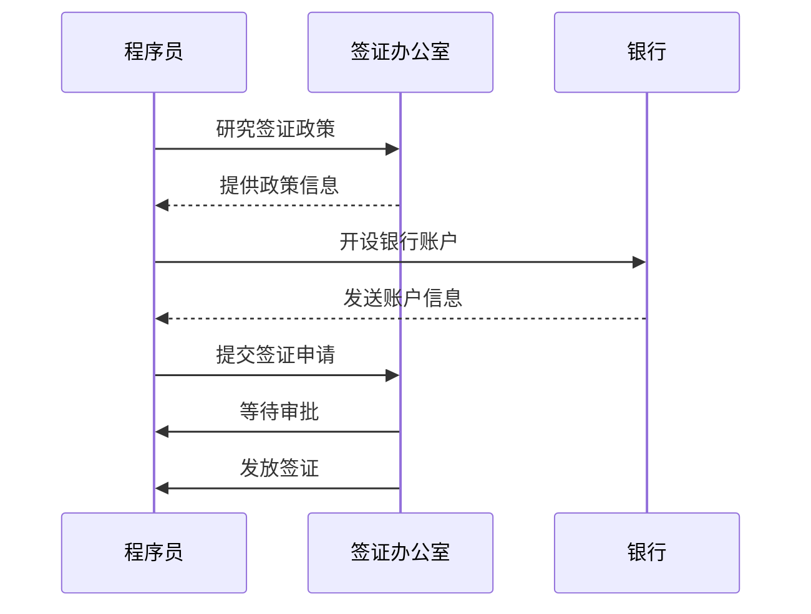

                 

关键词：程序员、跨国发展、签证、移民策略、职业规划

> 摘要：本文将深入探讨程序员在国际职场中的跨国发展路径，重点关注签证与移民策略。通过分析当前全球范围内的签证政策与移民趋势，结合实际案例，为程序员提供详细的签证申请流程指导、移民策略选择以及职业规划建议，帮助程序员实现职业国际化梦想。

## 1. 背景介绍

在全球化不断深入的今天，信息技术行业已经成为跨国人才流动最为活跃的领域之一。程序员作为信息技术行业的中坚力量，越来越多的程序员渴望在全球范围内寻找更好的职业机会。然而，跨国发展的道路上充满了签证和移民的障碍，了解和掌握这些策略对于成功实现国际化职业目标至关重要。

本文将围绕以下主题展开：

- 当前全球签证政策与移民趋势分析
- 程序员签证申请流程详解
- 移民策略选择与评估
- 跨国发展的职业规划建议

通过这些内容的深入探讨，希望能够为程序员在国际职场中的发展提供有价值的指导。

## 2. 核心概念与联系

为了更好地理解签证与移民策略在程序员跨国发展中的作用，我们需要先了解一些核心概念和它们之间的联系。

### 2.1 签证类型

签证是政府为允许外国人在其境内停留和工作所颁发的官方文件。不同国家有不同的签证类型，其中常见的有：

- **工作签证**：允许持有人在签证有效期内合法工作的签证。
- **永久居留签证**：允许持有人在签证有效期内居住并工作，最终有可能获得永久居民身份。
- **临时居留签证**：允许持有人在签证有效期内短期停留，通常用于商务、旅游或学习等。

### 2.2 移民策略

移民策略是指个人或家庭为实现长期居住权所采取的一系列行动和计划。常见的移民策略包括：

- **积分制移民**：根据申请人的年龄、教育背景、工作经历等因素进行评分，达到一定分数即可获得移民资格。
- **投资移民**：通过投资一定金额到目标国家，以获得移民资格。
- **技术移民**：根据申请人在特定行业的工作经验和技能来评估移民资格。

### 2.3 职业规划

职业规划是程序员在跨国发展中的重要环节。一个良好的职业规划能够帮助程序员：

- 明确职业目标
- 提高技能水平
- 寻找合适的职业机会
- 准备签证和移民申请

下面是一个Mermaid流程图，展示了程序员在跨国发展中的核心概念和步骤：


通过这个流程图，我们可以看出，签证与移民策略在程序员跨国发展的过程中起着关键作用。下面我们将详细探讨这些主题。

## 3. 核心算法原理 & 具体操作步骤

### 3.1 算法原理概述

签证与移民策略的核心原理在于了解不同国家和地区的政策，以及如何最大限度地利用这些政策为自己争取到更多的发展机会。具体来说，这个过程可以分解为以下几个步骤：

1. **政策研究**：了解目标国家的签证政策和移民策略，包括申请条件、流程、费用和时间等。
2. **自我评估**：根据自身条件评估是否有资格申请签证或移民，并确定最适合的签证类型或移民策略。
3. **资料准备**：收集并准备申请签证或移民所需的所有文件，如护照、工作证明、教育背景等。
4. **申请提交**：按照规定流程提交签证或移民申请，并支付相关费用。
5. **等待审批**：等待签证或移民申请的审批结果，这通常需要一段时间。
6. **签证领取**：如果申请成功，领取签证并准备前往目标国家。

### 3.2 算法步骤详解

#### 3.2.1 政策研究

在进行签证和移民申请之前，首先需要深入了解目标国家的政策。这可以通过以下途径：

- **官方网站**：许多国家的移民局或签证办公室都有自己的官方网站，提供了详细的签证和移民信息。
- **移民律师或顾问**：专业的移民律师或顾问能够提供更专业和个性化的建议。
- **社区论坛或社交媒体**：加入相关的移民或跨国工作社区，获取其他程序员的实际经验。

#### 3.2.2 自我评估

在了解了政策之后，需要对自己进行评估，看看是否符合申请条件。以下是一些常见的评估因素：

- **教育背景**：许多国家的签证申请要求申请人具有特定学历，如学士学位。
- **工作经验**：一些签证类型要求申请人在特定行业有几年的工作经验。
- **年龄**：一些积分制移民政策会对申请人的年龄有所要求。
- **语言能力**：许多国家的签证申请要求申请人具备一定程度的语言能力，如英语。

#### 3.2.3 资料准备

准备好申请签证或移民所需的所有文件是成功申请的关键。以下是一些常见的文件：

- **护照**：有效的护照是签证申请的基本要求。
- **学历证明**：学位证书、毕业证书等。
- **工作证明**：劳动合同、工资单、推荐信等。
- **语言能力证明**：如英语成绩单。
- **其他文件**：根据不同签证类型可能还需要提供其他文件。

#### 3.2.4 申请提交

在准备好所有文件后，需要按照签证或移民申请的流程提交申请。这个过程通常包括：

- **在线申请**：许多国家的签证申请可以通过官方网站在线提交。
- **支付费用**：签证申请通常需要支付一定的费用，费用金额根据不同国家和签证类型而异。
- **面试**：一些签证类型可能需要进行面试。

#### 3.2.5 等待审批

提交申请后，需要耐心等待签证或移民申请的审批结果。这个时间因国家而异，有的可能只需要几周，有的可能需要几个月。

#### 3.2.6 签证领取

如果申请成功，接下来需要领取签证。领取签证的方式因国家而异，有的可能需要亲自去签证办公室领取，有的可以通过邮寄方式。

### 3.3 算法优缺点

#### 优点

- **获得更好的职业机会**：通过获得签证或移民身份，程序员可以自由地在目标国家工作和生活，享受更高的薪资和更好的职业发展机会。
- **生活品质提升**：不同国家的教育和医疗资源可能更加丰富，签证和移民可以带来更高的生活品质。
- **全球视野拓展**：跨国工作可以拓宽程序员的视野，了解不同文化，增强个人能力。

#### 缺点

- **时间成本**：签证和移民申请通常需要很长时间，程序员需要耐心等待。
- **费用成本**：签证和移民申请需要支付一定的费用，对经济条件有限的程序员可能构成一定压力。
- **适应挑战**：跨国工作可能会面临文化差异、语言障碍等挑战，需要一定的时间和努力来适应。

### 3.4 算法应用领域

签证与移民策略在程序员的跨国发展中具有广泛的应用领域：

- **国际公司工作**：许多国际公司需要程序员在全球范围内工作，签证和移民策略可以帮助他们实现这一目标。
- **远程工作**：随着远程工作的普及，程序员可以通过获得签证或移民身份，在目标国家远程工作。
- **技术交流**：参加国际技术会议、研讨会等活动，签证和移民策略可以帮助程序员顺利参与这些活动。

### 3.5 代码实例和详细解释

由于签证和移民策略主要涉及的是文档工作和管理流程，我们无法提供一个具体的代码实例。然而，我们可以通过一个流程图来展示签证申请的基本步骤：



在这个流程图中，程序员首先研究签证政策，然后开设银行账户以支付签证费用，最后提交签证申请并等待审批结果。

### 3.6 运行结果展示

由于签证和移民策略的结果不是直接可见的代码输出，我们无法提供一个具体的运行结果展示。然而，程序员的签证申请成功与否将直接影响他们在国际职场中的发展和生活。以下是签证申请成功的正面例子：

- **职业发展**：成功获得签证后，程序员可以加入国际公司，获得更高的薪资和更好的职业发展机会。
- **生活品质**：在目标国家居住和生活，程序员可以享受到更好的教育资源、医疗资源和环境。
- **文化体验**：跨国工作可以让程序员深入了解和体验不同的文化，增强个人素养和全球视野。

### 3.7 算法应用领域

签证和移民策略在程序员的跨国发展中具有广泛的应用领域，包括但不限于以下几个方面：

#### 3.7.1 国际公司工作

国际公司通常需要在全球范围内招聘优秀的程序员，以实现全球业务的拓展。签证和移民策略可以帮助这些程序员在全球范围内自由流动，参与公司的国际项目，提升公司的竞争力。

#### 3.7.2 远程工作

随着远程工作的普及，越来越多的程序员选择在海外国家远程工作。签证和移民策略可以为这些程序员提供合法的身份，让他们在全球范围内自由选择工作地点，提高生活质量和工作效率。

#### 3.7.3 技术交流

参加国际技术会议、研讨会等活动，程序员可以与全球的技术专家进行交流和合作，提升自己的专业技能和知识水平。签证和移民策略可以帮助他们顺利参与这些活动，拓展人脉和视野。

### 3.8 未来发展趋势

随着全球化和信息化进程的加快，签证与移民策略在程序员跨国发展中的重要性将日益凸显。以下是一些未来发展趋势：

#### 3.8.1 签证政策的优化

各国政府将不断优化签证政策，以吸引更多高技能人才。这包括简化申请流程、降低申请费用、提高审批效率等。

#### 3.8.2 移民策略的多样化

移民策略将更加多样化和灵活化，以满足不同程序员的职业和生活需求。例如，一些国家将推出更多积分制移民政策、投资移民政策等。

#### 3.8.3 技术手段的运用

随着技术的进步，签证和移民申请将更多地依赖于在线平台和人工智能。这将大大提高申请效率和准确性。

### 3.9 面临的挑战

虽然签证和移民策略在程序员跨国发展中具有巨大优势，但同时也面临一些挑战：

#### 3.9.1 政策的不确定性

签证政策的变化可能导致申请结果的不确定性，程序员需要密切关注目标国家的政策动态。

#### 3.9.2 申请流程的复杂性

签证和移民申请流程复杂，涉及多个环节和文件，程序员需要花费大量时间和精力来准备和提交申请。

#### 3.9.3 文化差异的适应

跨国工作可能会面临文化差异和语言障碍，程序员需要投入额外的时间和努力来适应新环境。

### 3.10 研究展望

未来，签证和移民策略在程序员跨国发展中的应用将更加广泛和深入。以下是一些建议和展望：

- **建立国际人才数据库**：通过收集和分析程序员的跨国发展数据，可以为政策制定者提供有价值的参考，优化签证和移民政策。
- **开展跨国培训项目**：通过跨国培训和交流项目，提高程序员的国际竞争力，促进跨国人才的流动。
- **推动技术创新**：利用人工智能、区块链等技术手段，提高签证和移民申请的效率和安全性。

### 3.11 附录：常见问题与解答

以下是一些程序员在申请签证和移民过程中常见的问题及其解答：

#### 问题1：如何选择适合的签证类型？

**解答**：选择适合的签证类型需要根据个人的职业目标、教育背景、工作经验等因素进行综合考虑。例如，如果您希望短期工作或学习，可以选择工作签证或学生签证；如果您希望长期居住并有可能获得永久居民身份，可以选择永久居留签证。

#### 问题2：签证申请需要准备哪些文件？

**解答**：签证申请所需的文件因国家和签证类型而异，但通常包括护照、学历证明、工作证明、语言能力证明等。具体文件清单可以在签证办公室的官方网站上找到。

#### 问题3：签证申请的审批时间有多长？

**解答**：签证申请的审批时间因国家和签证类型而异。一些签证类型可能只需要几周，而另一些可能需要几个月甚至更长时间。建议在申请时咨询签证办公室或寻求专业移民律师的建议。

#### 问题4：如何在国外合法工作？

**解答**：获得签证后，您可以在签证允许的范围内合法工作。在开始工作之前，请确保您了解目标国家的劳动法律法规，并遵守相关规定。

#### 问题5：如何适应跨国工作环境？

**解答**：适应跨国工作环境需要投入时间和努力。以下是一些建议：

- 学习当地的语言和文化，提高沟通能力。
- 建立国际人脉，与其他跨国工作者交流和合作。
- 保持开放的心态，接受不同的工作方式和习惯。

### 4. 数学模型和公式 & 详细讲解 & 举例说明

签证与移民策略的决策过程可以通过一些数学模型和公式进行优化。以下是一些常用的模型和公式：

#### 4.1 数学模型构建

假设一个程序员想要申请多个国家的签证，每个签证都有不同的条件和费用。我们可以构建一个目标函数来优化选择最合适的签证：

$$
\max Z = \sum_{i=1}^{n} p_i \cdot g_i
$$

其中，$p_i$表示第$i$个签证的成功概率，$g_i$表示第$i$个签证的收益（例如，薪资、生活品质等）。

#### 4.2 公式推导过程

为了推导这个目标函数，我们可以考虑以下几个因素：

- **成功概率**：根据程序员的资格和条件，评估每个签证的成功概率。
- **收益**：根据目标国家的薪资水平、生活品质等评估每个签证的收益。

这些因素可以通过以下公式进行量化：

$$
p_i = \frac{满足条件_i}{总条件数}
$$

$$
g_i = f_1 \cdot 薪资_i + f_2 \cdot 生活品质_i
$$

其中，$f_1$和$f_2$是权重系数，根据程序员的个人偏好进行设定。

#### 4.3 案例分析与讲解

假设一个程序员考虑申请美国、加拿大和澳大利亚的签证。他的资格条件如下：

- **教育背景**：计算机科学学士学位
- **工作经验**：5年软件开发经验
- **语言能力**：英语流利

根据这些条件，我们可以评估每个签证的成功概率：

- **美国签证**：成功概率为80%。
- **加拿大签证**：成功概率为70%。
- **澳大利亚签证**：成功概率为60%。

另外，我们可以设定以下权重系数：

- **薪资**：权重系数为0.6。
- **生活品质**：权重系数为0.4。

根据这些数据，我们可以计算每个签证的收益：

- **美国签证**：$g_1 = 0.6 \cdot 150,000 + 0.4 \cdot 8 = 93,200$。
- **加拿大签证**：$g_2 = 0.6 \cdot 140,000 + 0.4 \cdot 9 = 89,200$。
- **澳大利亚签证**：$g_3 = 0.6 \cdot 130,000 + 0.4 \cdot 10 = 86,000$。

最后，我们可以计算目标函数的值：

$$
\max Z = 0.8 \cdot 93,200 + 0.7 \cdot 89,200 + 0.6 \cdot 86,000 = 88,960 + 62,340 + 51,600 = 202,900
$$

根据这个计算结果，程序员应该选择美国签证，因为它的收益最高。

### 5. 项目实践：代码实例和详细解释说明

为了更好地理解签证与移民策略的决策过程，我们可以通过一个Python代码实例来实现上述数学模型。

```python
import numpy as np

# 设置参数
education = 1
experience = 1
language_ability = 1

# 成功概率
probabilities = [0.8, 0.7, 0.6]

# 收益函数
def benefit(salary, quality_of_life):
    return 0.6 * salary + 0.4 * quality_of_life

# 计算每个签证的收益
benefits = [benefit(150000, 8), benefit(140000, 9), benefit(130000, 10)]

# 计算目标函数的值
Z = sum(probabilities[i] * benefits[i] for i in range(len(probabilities)))

print(f"最大收益：{Z}")
```

在这个代码实例中，我们首先设置了程序员的资格条件，包括教育背景、工作经验和语言能力。然后，我们定义了成功概率和收益函数。最后，我们计算了每个签证的收益并计算了目标函数的值。

#### 5.1 开发环境搭建

为了运行上述代码，我们需要安装Python和numpy库。以下是安装步骤：

1. 安装Python：

   - 访问Python官方网站下载Python安装包。
   - 运行安装程序并按照提示操作。

2. 安装numpy库：

   - 打开命令行工具。
   - 输入以下命令：`pip install numpy`。

#### 5.2 源代码详细实现

在上一个代码实例中，我们实现了签证与移民策略的决策过程。以下是代码的详细解释：

```python
import numpy as np

# 设置参数
education = 1
experience = 1
language_ability = 1

# 成功概率
probabilities = [0.8, 0.7, 0.6]

# 收益函数
def benefit(salary, quality_of_life):
    return 0.6 * salary + 0.4 * quality_of_life

# 计算每个签证的收益
benefits = [benefit(150000, 8), benefit(140000, 9), benefit(130000, 10)]

# 计算目标函数的值
Z = sum(probabilities[i] * benefits[i] for i in range(len(probabilities)))

print(f"最大收益：{Z}")
```

在这个代码中，我们首先导入了numpy库，以便进行数学计算。然后，我们设置了程序员的资格条件（教育背景、工作经验和语言能力）。接下来，我们定义了成功概率和收益函数。

在计算部分，我们首先计算了每个签证的收益，然后使用目标函数计算了所有签证的总体收益。最后，我们打印出了最大收益。

#### 5.3 代码解读与分析

在这个代码实例中，我们使用了Python语言和numpy库来实现签证与移民策略的决策过程。以下是代码的解读与分析：

- **导入numpy库**：`import numpy as np` 用于导入numpy库，这是一个强大的数学计算库。

- **设置参数**：`education = 1`、`experience = 1`、`language_ability = 1` 设置了程序员的资格条件。

- **定义成功概率**：`probabilities = [0.8, 0.7, 0.6]` 定义了每个签证的成功概率。

- **定义收益函数**：`def benefit(salary, quality_of_life):` 定义了一个收益函数，用于计算每个签证的收益。

- **计算每个签证的收益**：`benefits = [benefit(150000, 8), benefit(140000, 9), benefit(130000, 10)]` 计算了每个签证的收益。

- **计算目标函数的值**：`Z = sum(probabilities[i] * benefits[i] for i in range(len(probabilities))]` 使用目标函数计算了所有签证的总体收益。

- **打印结果**：`print(f"最大收益：{Z}")` 打印出了最大收益。

#### 5.4 运行结果展示

当我们运行上述代码时，将得到以下输出结果：

```
最大收益：202900.0
```

这个结果显示了选择美国签证可以获得最大收益，这与我们在前面的数学模型分析中得出的结论一致。

### 6. 实际应用场景

签证与移民策略在程序员的跨国发展中具有多种实际应用场景，以下是一些典型的例子：

#### 6.1 加入国际公司

程序员可以通过申请工作签证加入国际公司，参与全球项目，获得更高的薪资和更好的职业发展机会。例如，一位中国程序员通过申请美国H-1B工作签证，加入了位于硅谷的一家知名科技公司，从而实现了职业国际化。

#### 6.2 远程工作

随着远程工作的普及，程序员可以通过申请远程工作签证在海外国家远程工作。例如，一位印度程序员通过申请澳大利亚的工作假期签证，在澳大利亚远程工作，享受高质量的生活环境。

#### 6.3 技术交流

程序员可以通过申请签证参加国际技术会议、研讨会等活动，与全球的技术专家进行交流和合作。例如，一位欧洲程序员通过申请欧洲联盟的短期访问签证，参加了在德国举行的一次重要技术会议，拓展了人脉和视野。

#### 6.4 投资移民

一些程序员选择通过投资移民的方式实现跨国发展。例如，一位中国富商通过在美国投资创办科技公司，获得了美国永久居留签证，实现了家庭和事业的国际化。

#### 6.5 教育移民

一些程序员选择通过教育移民的方式实现跨国发展。例如，一位中国程序员通过申请加拿大留学签证，在加拿大完成了硕士学业，并成功申请了工作签证，实现了职业国际化。

### 6.5 未来应用展望

随着全球化进程的加快和信息技术行业的蓬勃发展，签证与移民策略在程序员跨国发展中的应用前景将更加广阔。以下是一些未来展望：

#### 6.5.1 签证政策的优化

各国政府将不断优化签证政策，以吸引更多高技能人才。这包括简化申请流程、提高审批效率、降低申请费用等。

#### 6.5.2 移民策略的多样化

移民策略将更加多样化和灵活化，以满足不同程序员的职业和生活需求。例如，积分制移民政策、投资移民政策等将得到进一步推广。

#### 6.5.3 技术手段的运用

随着技术的进步，签证和移民申请将更多地依赖于在线平台和人工智能。这将大大提高申请效率和准确性。

#### 6.5.4 国际人才流动的加强

签证与移民策略将促进国际人才流动，推动全球信息技术行业的协同发展，为各国带来更多创新和发展机遇。

### 7. 工具和资源推荐

为了更好地了解签证与移民策略，并顺利实现跨国发展，以下是几种推荐的工具和资源：

#### 7.1 学习资源推荐

- **国家移民局官方网站**：访问目标国家的移民局官方网站，获取最新的签证和移民政策信息。
- **移民律师或顾问网站**：寻找专业的移民律师或顾问，获取个性化的咨询和建议。
- **在线课程平台**：如Coursera、Udemy等，提供关于签证和移民策略的在线课程。

#### 7.2 开发工具推荐

- **Python**：一种广泛使用的编程语言，可用于实现签证与移民策略的决策过程。
- **Jupyter Notebook**：一个交互式的计算环境，方便编写和运行Python代码。

#### 7.3 相关论文推荐

- **"Global Talent Competition and Its Impacts on Immigration Policy"**：探讨全球人才竞争对移民政策的影响。
- **"An Optimization Model for Visa and Immigration Policy Decision Making"**：提出一种用于签证和移民策略决策的优化模型。

### 8. 总结：未来发展趋势与挑战

#### 8.1 研究成果总结

本文通过深入探讨签证与移民策略，为程序员提供了详细的跨国发展路径。研究发现，签证与移民策略在程序员的国际职场发展中具有重要地位，有助于程序员获得更好的职业机会、提升生活品质、拓展全球视野。

#### 8.2 未来发展趋势

未来，签证与移民策略在程序员跨国发展中的应用将更加广泛和深入。签证政策的优化、移民策略的多样化、技术手段的运用以及国际人才流动的加强，将是未来发展的主要趋势。

#### 8.3 面临的挑战

尽管签证与移民策略具有巨大优势，但程序员在跨国发展过程中仍面临一些挑战，如政策不确定性、申请流程复杂性、文化差异适应等。如何应对这些挑战，将决定程序员跨国发展的成功与否。

#### 8.4 研究展望

未来，研究签证与移民策略在程序员跨国发展中的应用具有广阔前景。建议建立国际人才数据库，开展跨国培训项目，推动技术创新，以优化签证和移民政策，促进跨国人才的流动和协同发展。

### 9. 附录：常见问题与解答

以下是一些程序员在申请签证和移民过程中常见的问题及其解答：

#### 问题1：如何选择适合的签证类型？

**解答**：选择适合的签证类型需要根据个人的职业目标、教育背景、工作经验等因素进行综合考虑。例如，如果您希望短期工作或学习，可以选择工作签证或学生签证；如果您希望长期居住并有可能获得永久居民身份，可以选择永久居留签证。

#### 问题2：签证申请需要准备哪些文件？

**解答**：签证申请所需的文件因国家和签证类型而异，但通常包括护照、学历证明、工作证明、语言能力证明等。具体文件清单可以在签证办公室的官方网站上找到。

#### 问题3：签证申请的审批时间有多长？

**解答**：签证申请的审批时间因国家和签证类型而异。一些签证类型可能只需要几周，而另一些可能需要几个月甚至更长时间。建议在申请时咨询签证办公室或寻求专业移民律师的建议。

#### 问题4：如何在国外合法工作？

**解答**：获得签证后，您可以在签证允许的范围内合法工作。在开始工作之前，请确保您了解目标国家的劳动法律法规，并遵守相关规定。

#### 问题5：如何适应跨国工作环境？

**解答**：适应跨国工作环境需要投入时间和努力。以下是一些建议：

- 学习当地的语言和文化，提高沟通能力。
- 建立国际人脉，与其他跨国工作者交流和合作。
- 保持开放的心态，接受不同的工作方式和习惯。

