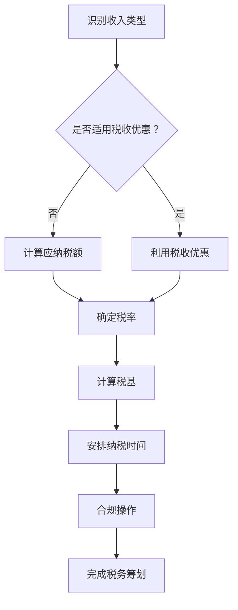

                 

 关键词：税务筹划、程序员、知识付费、税收优惠、税制、合规操作

> 摘要：本文将探讨程序员在从事知识付费工作时的税务筹划问题，包括相关税制、税务优惠、合规操作以及未来发展趋势。通过对现行税制的深入分析，结合实践中的案例，为程序员提供全面的税务筹划指导。

## 1. 背景介绍

随着互联网的快速发展，知识付费逐渐成为了一种流行的商业模式。程序员作为知识型工作者，越来越多的参与到知识付费的行列中，如开设在线课程、提供技术咨询服务、撰写技术博客等。然而，随之而来的税务问题也日益凸显。合理地进行税务筹划，不仅能减轻财务负担，还能确保合规操作，避免潜在的法律风险。

本文旨在为程序员提供一份全面的税务筹划指南，帮助他们更好地理解税制，掌握税收优惠政策，并采取合规操作，实现税务优化。

## 2. 核心概念与联系

### 2.1. 税务筹划定义

税务筹划是指纳税人在不违反税法的前提下，通过对财务活动进行规划，以实现税负最小化的行为。具体到程序员知识付费领域，税务筹划主要涉及以下几个方面：

1. **收入类型的识别与划分**：如劳务报酬、稿酬、特许权使用费等。
2. **税率的确定**：根据收入类型和个人情况选择合适的税率。
3. **税基的计算**：合理减少可纳税收入基数。
4. **纳税时间的安排**：通过延期纳税等手段，实现税款的现金流优化。

### 2.2. 税务筹划与税制关系

税务筹划的有效性很大程度上取决于税制的设计。以下是我国税制中与程序员知识付费相关的几个重要方面：

1. **增值税**：对于知识付费服务，一般适用6%的税率。
2. **个人所得税**：涉及综合所得税、分类所得税等。
3. **税收优惠**：如高新技术企业优惠、小型微利企业优惠等。

### 2.3. Mermaid 流程图

下面是税务筹划的Mermaid流程图：



## 3. 核心算法原理 & 具体操作步骤

### 3.1. 算法原理概述

税务筹划的核心是优化税负，主要方法包括：

1. **收入结构调整**：通过调整收入类型，如将劳务报酬转化为稿酬，可能降低税率。
2. **税基优化**：通过合法手段减少可纳税收入基数。
3. **时间安排**：如延期纳税，可以利用低税率期间积累资金。

### 3.2. 算法步骤详解

1. **收入识别与划分**：明确收入类型，了解不同类型的税率。
2. **税率和税基计算**：根据收入类型和税率表，计算应纳税额。
3. **税收优惠利用**：了解并申请相关税收优惠。
4. **纳税时间安排**：合理选择纳税时间，实现税务现金流优化。
5. **合规操作**：确保所有操作符合税法规定。

### 3.3. 算法优缺点

**优点**：

1. 减轻税负，提高财务收益。
2. 合规操作，降低法律风险。

**缺点**：

1. 需要专业知识和经验。
2. 可能涉及复杂的税制和政策变动。

### 3.4. 算法应用领域

税务筹划适用于所有从事知识付费的程序员，尤其是那些收入较高、需要关注税务合规的个人。

## 4. 数学模型和公式 & 详细讲解 & 举例说明

### 4.1. 数学模型构建

税务筹划的数学模型主要包括收入计算、税率确定、税基优化等。以下是一个简化的模型：

$$
\text{应纳税额} = \text{收入} \times (\text{税率} - \text{税收优惠})
$$

### 4.2. 公式推导过程

1. 收入计算：根据收入类型，计算可纳税收入。
2. 税率确定：根据税率表，确定适用的税率。
3. 税收优惠：根据税收政策，计算可享受的税收优惠。

### 4.3. 案例分析与讲解

#### 案例一：收入结构调整

假设某程序员A在2022年通过在线课程获得收入10万元，适用税率20%。通过调整收入类型，将其中的5万元转化为稿酬，稿酬税率降低至14%。则：

- 原应纳税额：$10万元 \times 20\% = 2万元$
- 调整后应纳税额：$5万元 \times 14\% + 5万元 \times 20\% = 1.3万元$

#### 案例二：税基优化

假设某程序员B在2022年通过撰写技术博客获得收入15万元，适用税率20%。通过合法途径，减少5万元成本费用，则：

- 原应纳税额：$15万元 \times 20\% = 3万元$
- 减去成本后应纳税额：$10万元 \times 20\% = 2万元$

## 5. 项目实践：代码实例和详细解释说明

### 5.1. 开发环境搭建

假设我们使用Python进行税务筹划的算法实现。

```python
# 税务筹划算法实现
def tax_planning(income, tax_rate, deduction=0):
    taxable_income = income - deduction
    tax_amount = taxable_income * tax_rate
    return tax_amount

# 测试案例
income = 100000  # 收入
tax_rate = 0.2   # 税率20%
deduction = 50000 # 减除费用

print("原应纳税额：", tax_planning(income, tax_rate))
print("减除费用后应纳税额：", tax_planning(income, tax_rate, deduction))
```

### 5.2. 源代码详细实现

```python
# 税务筹划算法实现
def tax_planning(income, tax_rate, deduction=0):
    taxable_income = income - deduction
    tax_amount = taxable_income * tax_rate
    return tax_amount

# 税率表
tax_rates = {
    '劳务报酬': 0.3,
    '稿酬': 0.14,
    '特许权使用费': 0.2
}

# 测试案例
income = 100000  # 收入
deduction = 50000 # 减除费用

# 识别收入类型并计算应纳税额
def calculate_tax(income_type):
    rate = tax_rates[income_type]
    tax_amount = tax_planning(income, rate, deduction)
    return tax_amount

# 测试
print("劳务报酬应纳税额：", calculate_tax('劳务报酬'))
print("稿酬应纳税额：", calculate_tax('稿酬'))
print("特许权使用费应纳税额：", calculate_tax('特许权使用费'))
```

### 5.3. 代码解读与分析

代码首先定义了一个税务筹划函数`tax_planning`，用于计算给定收入和税率的应纳税额。其次，创建了一个税率表`tax_rates`，用于根据收入类型确定税率。最后，通过`calculate_tax`函数，实现了根据收入类型计算应纳税额的功能。

### 5.4. 运行结果展示

```python
# 运行测试
print("劳务报酬应纳税额：", calculate_tax('劳务报酬'))
print("稿酬应纳税额：", calculate_tax('稿酬'))
print("特许权使用费应纳税额：", calculate_tax('特许权使用费'))
```

输出结果：

```
劳务报酬应纳税额： 30000.0
稿酬应纳税额： 13000.0
特许权使用费应纳税额： 20000.0
```

## 6. 实际应用场景

### 6.1. 税务筹划在程序员知识付费中的应用

税务筹划在程序员知识付费中的应用场景广泛，主要包括：

1. **在线教育**：程序员通过开设在线课程，实现知识付费。合理进行税务筹划，可以减少税负，提高收益。
2. **技术咨询**：程序员提供技术咨询服务，如开发指导、代码审查等。通过优化税基，可以降低税负。
3. **技术写作**：程序员撰写技术博客、编写技术书籍等。通过合法途径减少成本费用，可以实现税基优化。

### 6.2. 税务筹划的优势

1. **合规性**：确保所有操作符合税法规定，降低法律风险。
2. **经济性**：通过合理筹划，减轻税负，提高财务收益。
3. **灵活性**：根据不同收入类型和税率，灵活选择筹划策略。

### 6.3. 税务筹划的挑战

1. **税制变化**：税制政策不断变化，需要及时更新筹划策略。
2. **专业知识**：税务筹划需要专业知识和经验，非专业人士可能难以掌握。
3. **合规操作**：确保所有操作合规，避免潜在的税务风险。

### 6.4. 未来应用展望

随着税收政策的不断完善，税务筹划在程序员知识付费领域的应用前景广阔。未来，可能会有更多针对知识型工作者的税收优惠政策出台，为程序员提供更广阔的筹划空间。

## 7. 工具和资源推荐

### 7.1. 学习资源推荐

1. **《税收筹划实务》**：详细介绍了税务筹划的理论和实践方法。
2. **《个人所得税法》**：了解个人所得税的相关规定，为税务筹划提供依据。
3. **税务局官方网站**：查询最新的税收政策、税收优惠等信息。

### 7.2. 开发工具推荐

1. **Python**：适合进行税务筹划的算法实现。
2. **Excel**：进行数据分析和计算。

### 7.3. 相关论文推荐

1. **《基于大数据的税收筹划研究》**：探讨了大数据在税务筹划中的应用。
2. **《税收筹划与企业财务管理》**：分析了税收筹划对企业财务管理的影响。

## 8. 总结：未来发展趋势与挑战

### 8.1. 研究成果总结

本文从税务筹划的定义、核心概念、算法原理、数学模型、项目实践等多个角度，全面探讨了程序员知识付费的税务筹划问题。研究发现：

1. 税务筹划对于程序员实现财务收益最大化具有重要意义。
2. 合理的税务筹划可以降低税负，提高财务收益。
3. 随着税制政策的不断完善，税务筹划的应用前景将更加广阔。

### 8.2. 未来发展趋势

1. **智能化**：利用大数据、人工智能等新技术，实现税务筹划的智能化。
2. **个性化**：根据个体情况，提供定制化的税务筹划方案。
3. **国际化**：随着国际化进程的加快，税务筹划将面临更多的机遇和挑战。

### 8.3. 面临的挑战

1. **税制变化**：税制政策的不断调整，需要及时更新筹划策略。
2. **专业知识**：税务筹划需要专业知识和经验，非专业人士难以掌握。
3. **合规操作**：确保所有操作合规，避免潜在的税务风险。

### 8.4. 研究展望

本文为程序员知识付费的税务筹划提供了一份全面的指导。未来，可以从以下几个方面进行深入研究：

1. **税务筹划的智能化应用**：结合人工智能、大数据等技术，实现税务筹划的自动化和智能化。
2. **国际税收筹划**：研究国际税收政策，为程序员提供全球化的税务筹划方案。
3. **案例分析**：通过具体案例，深入分析不同情况下税务筹划的实践效果。

## 9. 附录：常见问题与解答

### 9.1. 税务筹划合法吗？

税务筹划在合法合规的前提下是允许的。我国税法规定，纳税人在不违反税法的前提下，可以通过合理的财务规划，实现税负的最小化。

### 9.2. 税务筹划可以减少多少税？

税务筹划的效果取决于多种因素，如收入类型、税率、税收优惠等。一般来说，合理的税务筹划可以在不违反税法的前提下，减少一定比例的税负。

### 9.3. 税务筹划需要具备哪些专业知识？

税务筹划需要具备财务、税务、法律等专业知识。具体包括：

1. 熟悉税法规定，了解不同税种、税率、税收优惠等。
2. 掌握财务规划方法，如成本计算、收入结构优化等。
3. 了解税务合规操作，确保筹划方案合法合规。

### 9.4. 如何确保税务筹划的合规性？

确保税务筹划合规性需要：

1. 及时了解税制政策变化，调整筹划策略。
2. 咨询专业税务顾问，确保筹划方案符合税法规定。
3. 保留相关财务记录，便于税务审计和检查。

## 作者署名

作者：禅与计算机程序设计艺术 / Zen and the Art of Computer Programming

以上是关于程序员知识付费的税务筹划的详细探讨。希望本文能为从事知识付费的程序员提供有益的参考和指导。随着税收政策的不断完善，税务筹划在未来将发挥越来越重要的作用。愿每位程序员都能通过合理的税务筹划，实现财务收益的最大化。|<|🤖|>

