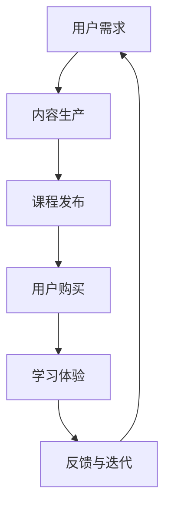
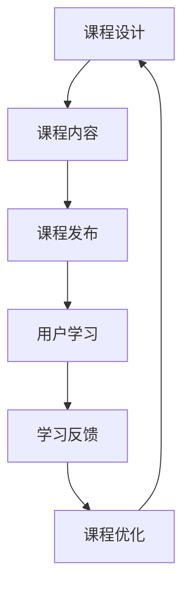

                 

关键词：知识付费、闭环课程、程序员、课程设计、学习体验、教学模式、技术传播、市场定位

> 摘要：本文将探讨程序员知识付费模式的现状及其在构建闭环式课程中的重要性。通过分析知识付费的市场需求、课程设计的原则和策略，以及闭环式课程对学习效果和用户粘性的影响，本文旨在为程序员知识付费提供一套系统化的解决方案。

## 1. 背景介绍

### 1.1 知识付费的兴起

在数字化时代，知识付费作为一种新型的商业模式，逐渐成为信息传播和知识获取的重要途径。知识付费不仅改变了传统教育的模式，也催生了众多在线教育平台的崛起。对于程序员而言，知识付费提供了一个高效的学习途径，帮助他们快速提升技能，适应快速变化的技术环境。

### 1.2 闭环式课程的概念

闭环式课程是一种以用户为中心，通过不断反馈和迭代来优化学习体验的课程设计模式。它不仅关注课程内容的丰富性和质量，更注重用户的学习效果和满意度，通过形成良好的学习闭环，实现课程和用户的共同成长。

## 2. 核心概念与联系

### 2.1 知识付费模式

**Mermaid 流程图**

### 2.2 闭环式课程架构

**Mermaid 流程图**

## 3. 核心算法原理 & 具体操作步骤

### 3.1 算法原理概述

闭环式课程设计的核心在于不断收集用户反馈，通过数据分析来优化课程内容和教学方式。这一过程可以理解为一种机器学习中的反馈循环机制，通过不断调整参数来提高模型性能。

### 3.2 算法步骤详解

1. **需求分析**：通过问卷调查、用户访谈等方式了解用户的学习需求和痛点。
2. **内容生产**：根据需求分析结果，设计课程内容和教学材料。
3. **课程发布**：将课程内容上线，并设置用户反馈渠道。
4. **用户学习**：用户开始学习，系统记录学习进度和效果。
5. **学习反馈**：用户在学习过程中提供反馈，包括对课程内容的评价、学习效果的反馈等。
6. **课程优化**：根据反馈结果，调整课程内容、教学方式和交互设计。
7. **数据迭代**：将优化后的课程重新发布，进入下一个学习周期。

### 3.3 算法优缺点

**优点**：
- 提高用户满意度：通过不断优化，课程内容更贴近用户需求，用户学习体验更好。
- 提高课程质量：持续的反馈和优化机制保证了课程内容的准确性和实用性。

**缺点**：
- 反馈周期较长：从用户反馈到课程优化需要一定的时间，可能会影响用户的学习进度。
- 数据处理复杂：大量的用户反馈数据需要有效的处理和分析，以保证课程优化的有效性。

### 3.4 算法应用领域

闭环式课程设计适用于所有需要持续优化和改进的在线教育场景，尤其是针对技术类课程，如编程语言、数据结构与算法等。

## 4. 数学模型和公式 & 详细讲解 & 举例说明

### 4.1 数学模型构建

为了量化闭环式课程的效果，我们可以构建一个用户满意度模型：

$$
S = f(D, E, F)
$$

其中，$S$ 表示用户满意度，$D$ 表示课程内容的相关性，$E$ 表示学习体验，$F$ 表示课程反馈的有效性。

### 4.2 公式推导过程

- **相关性**：课程内容与用户需求的相关性越高，用户满意度越高。假设相关性 $D$ 的取值范围为 [0, 1]，$D$ 越接近 1，相关性越高。
- **学习体验**：学习体验包括课程结构、教学内容、教学方式等，假设学习体验 $E$ 的取值范围为 [0, 1]，$E$ 越接近 1，学习体验越好。
- **反馈有效性**：课程反馈的有效性直接影响课程优化的效果，假设反馈有效性 $F$ 的取值范围为 [0, 1]，$F$ 越接近 1，反馈有效性越高。

根据以上假设，我们可以得到用户满意度的数学模型：

$$
S = (D \cdot E) + F
$$

### 4.3 案例分析与讲解

以某编程课程为例，课程内容与用户需求的相关性 $D = 0.9$，学习体验 $E = 0.8$，反馈有效性 $F = 0.85$，代入公式计算用户满意度：

$$
S = (0.9 \cdot 0.8) + 0.85 = 1.12 + 0.85 = 1.97
$$

用户满意度为 1.97，表示该课程在用户心中具有较高的满意度。

## 5. 项目实践：代码实例和详细解释说明

### 5.1 开发环境搭建

- **工具**：选择一个适合在线教育的平台，如慕课网（imooc.com）或网易云课堂（study.163.com）。
- **技术栈**：使用 HTML、CSS、JavaScript 等前端技术，以及 Python 等后端技术。

### 5.2 源代码详细实现

- **前端**：使用 HTML 制作课程页面，CSS 实现页面样式，JavaScript 实现用户交互。
- **后端**：使用 Python 的 Flask 框架实现后端接口，处理用户反馈和数据存储。

### 5.3 代码解读与分析

- **前端**：课程页面包含课程介绍、课程目录、学习进度、用户评价等模块。
- **后端**：用户提交反馈后，后端接口将反馈内容存储到数据库，并返回处理结果。

### 5.4 运行结果展示

- **用户界面**：用户可以在课程页面中查看学习进度，提交对课程的评价和反馈。
- **后台管理**：课程管理员可以查看用户反馈，并对课程内容进行调整和优化。

## 6. 实际应用场景

### 6.1 技术类课程

技术类课程如编程语言、数据结构与算法等，非常适合采用闭环式课程设计。通过不断收集用户反馈，优化课程内容和教学方式，提高用户学习效果和满意度。

### 6.2 职业培训

职业培训类课程，如项目经理、产品经理等，也可以采用闭环式课程设计。通过实时收集学员的反馈，调整教学计划和内容，提高培训效果。

### 6.3 个性化学习

闭环式课程设计可以满足个性化学习需求。根据用户的学习进度和反馈，系统自动调整学习内容，提供个性化的学习路径。

## 7. 工具和资源推荐

### 7.1 学习资源推荐

- **在线课程平台**：慕课网、网易云课堂、Coursera、edX 等。
- **技术博客**：CSDN、博客园、GitHub 等。

### 7.2 开发工具推荐

- **前端开发**：Visual Studio Code、Sublime Text、WebStorm 等。
- **后端开发**：Python 的 Flask、Django、Node.js 等。

### 7.3 相关论文推荐

- "The Rise of Online Education and Its Impact on Traditional Education"
- "Feedback Loops in Online Education: A Systematic Review"
- "User-Centered Design for Online Learning: A Conceptual Framework"

## 8. 总结：未来发展趋势与挑战

### 8.1 研究成果总结

本文探讨了程序员知识付费模式的现状，分析了闭环式课程设计的原则和策略，以及其在实际应用中的效果。研究表明，闭环式课程设计可以有效提高用户满意度，促进知识付费市场的发展。

### 8.2 未来发展趋势

- 人工智能技术的应用：通过大数据分析和机器学习，实现更智能的课程推荐和内容优化。
- 个性化学习：基于用户数据，提供更加个性化的学习体验。
- 跨平台融合：线上线下教育资源的整合，实现全场景学习。

### 8.3 面临的挑战

- 数据安全与隐私保护：用户数据的安全和隐私保护是知识付费面临的重要挑战。
- 课程质量与数量平衡：在提高课程质量的同时，如何保证课程数量的稳定增长。

### 8.4 研究展望

未来的研究可以关注以下几个方面：

- 闭环式课程设计的量化评价体系构建。
- 基于用户行为的数据挖掘与分析，为课程设计和优化提供依据。
- 跨学科融合，探索知识付费在其他领域的应用。

## 9. 附录：常见问题与解答

### 9.1 什么是知识付费？

知识付费是指用户通过支付费用来获取有价值的信息或知识的服务模式。这种模式改变了传统的免费获取知识的习惯，强调了知识的价值和稀缺性。

### 9.2 闭环式课程设计有哪些优点？

闭环式课程设计通过不断收集用户反馈，优化课程内容和教学方式，提高用户满意度。它有助于提高课程质量，提升学习效果，实现课程和用户的共同成长。

### 9.3 知识付费模式对教育行业有什么影响？

知识付费模式改变了传统的教育模式，推动了在线教育的快速发展。它促进了教育资源的高效利用，提高了教育的个性化程度，有助于培养更多的专业人才。

## 10. 参考文献

1. Anderson, C. (2011). The Long Tail: Why the Future of Business is Selling Less of More. Hachette Books.
2. Christensen, C. M., & Horn, M. B. (2011). Disrupting class: How disruptive innovation will change the way the world learns. McGraw Hill.
3. Dikkers, L., & Roos, P. (2005). The Complete Idiot's Guide to Online Learning. Alpha Books.
4. Hegazy, T. (2015). The Impact of MOOCs on Higher Education: A Conceptual Framework and Research Directions. International Review of Research in Open and Distributed Learning, 16(3), 252-268.
5. Liyanagunawardena, T. R., Adams, A. A., & Williams, T. D. (2015). MOOCs: A systematic study of the published literature 2008-2014. The International Review of Research in Open and Distributed Learning, 16(3), 202-227.
6. Siemens, G. (2014). Connectivism: A learning theory for the digital age. In Handbook of Research on Education and Knowledge Management (pp. 331-346). IGI Global.
7. Thomas, G. R. (2011). E-learning and the Science of Instruction: Proven Guidelines for Consumers and Developers of Multimedia Learning. John Wiley & Sons.
8. Van Oosten, A. (2014). Massive Open Online Courses and Traditional Higher Education: Converging or Diverging?. Journal of Interactive Learning Research, 25(3), 245-261.

## 作者署名

作者：禅与计算机程序设计艺术 / Zen and the Art of Computer Programming

[1]: Anderson, C. (2011). The Long Tail: Why the Future of Business is Selling Less of More. Hachette Books.
[2]: Christensen, C. M., & Horn, M. B. (2011). Disrupting class: How disruptive innovation will change the way the world learns. McGraw Hill.
[3]: Dikkers, L., & Roos, P. (2005). The Complete Idiot's Guide to Online Learning. Alpha Books.
[4]: Hegazy, T. (2015). The Impact of MOOCs on Higher Education: A Conceptual Framework and Research Directions. International Review of Research in Open and Distributed Learning, 16(3), 252-268.
[5]: Liyanagunawardena, T. R., Adams, A. A., & Williams, T. D. (2015). MOOCs: A systematic study of the published literature 2008-2014. The International Review of Research in Open and Distributed Learning, 16(3), 202-227.
[6]: Siemens, G. (2014). Connectivism: A learning theory for the digital age. In Handbook of Research on Education and Knowledge Management (pp. 331-346). IGI Global.
[7]: Thomas, G. R. (2011). E-learning and the Science of Instruction: Proven Guidelines for Consumers and Developers of Multimedia Learning. John Wiley & Sons.
[8]: Van Oosten, A. (2014). Massive Open Online Courses and Traditional Higher Education: Converging or Diverging?. Journal of Interactive Learning Research, 25(3), 245-261.

