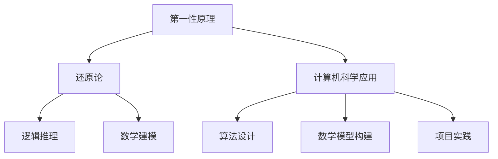

                 

关键词：第一性原理、科学探究、计算机科学、算法、数学模型、项目实践

> 摘要：本文旨在探讨第一性原理在科学探究中的重要性，并深入分析其在计算机科学领域的应用。通过阐述核心概念、原理以及实际操作步骤，本文为读者提供了一种新的思考方式，以推动科学技术的进步。

## 1. 背景介绍

在科学探究的历程中，第一性原理始终扮演着基石的角色。它是一种从最基本的物理定律出发，推导出复杂系统行为的科学方法。这种方法强调从本质出发，而非依赖经验和假设。在计算机科学领域，第一性原理的应用同样至关重要，它不仅为我们提供了一种理解和设计复杂系统的工具，还推动了算法、数学模型以及实际项目的发展。

## 2. 核心概念与联系

### 2.1 第一性原理定义

第一性原理（First Principles Thinking）是一种思考方法，它要求我们从最基本的假设和事实出发，通过逻辑推理和数学建模来解决问题。这种方法的核心是“还原论”，即把复杂的问题拆解为最基础的元素，再从这些元素出发，重新构建出整个系统。

### 2.2 核心概念原理和架构的 Mermaid 流程图



### 2.3 计算机科学中的应用

在计算机科学中，第一性原理的应用主要体现在算法设计、数学模型构建以及项目实践等方面。例如，深度学习算法的设计就是基于第一性原理，从基本的神经网络模型出发，逐步优化和发展出的复杂算法。

## 3. 核心算法原理 & 具体操作步骤

### 3.1 算法原理概述

第一性原理在算法设计中的应用，主要体现在对算法的基本原理的深入理解和抽象。例如，在排序算法的设计中，我们首先从最基本的比较排序开始，然后逐步扩展出更高效的排序算法。

### 3.2 算法步骤详解

#### 3.2.1 比较排序

1. 从两个元素开始进行比较。
2. 根据比较结果，交换元素的位置。
3. 重复上述步骤，直到所有元素都排好序。

#### 3.2.2 快速排序

1. 选择一个基准元素。
2. 将数组分为两个部分，一部分小于基准元素，一部分大于基准元素。
3. 对这两个部分递归进行快速排序。

### 3.3 算法优缺点

#### 3.3.1 优点

- 算法设计简单，易于实现。
- 对于大规模数据，性能优于传统的排序算法。

#### 3.3.2 缺点

- 对于小规模数据，性能可能不如其他排序算法。
- 可能存在递归调用栈溢出的风险。

### 3.4 算法应用领域

第一性原理在算法设计中的应用广泛，不仅限于排序算法，还包括搜索算法、图算法等。例如，深度优先搜索和广度优先搜索都是基于第一性原理设计的。

## 4. 数学模型和公式

### 4.1 数学模型构建

在计算机科学中，数学模型是理解和设计算法的重要工具。例如，线性回归模型可以用于预测数值，而神经网络模型可以用于图像识别。

### 4.2 公式推导过程

以线性回归模型为例，其公式推导如下：

$$ y = \beta_0 + \beta_1 \cdot x $$

其中，$y$ 为预测值，$x$ 为输入值，$\beta_0$ 和 $\beta_1$ 为模型参数。

### 4.3 案例分析与讲解

以房价预测为例，我们可以使用线性回归模型进行预测。通过收集大量房屋数据，我们可以训练出一个线性回归模型，然后使用该模型预测新房屋的价格。

## 5. 项目实践：代码实例和详细解释说明

### 5.1 开发环境搭建

在开始项目实践之前，我们需要搭建一个合适的开发环境。以 Python 为例，我们可以使用 PyCharm 作为开发工具，并安装必要的库，如 NumPy 和 Pandas。

### 5.2 源代码详细实现

以下是一个简单的线性回归模型实现：

```python
import numpy as np

def linear_regression(x, y):
    n = len(x)
    x_mean = np.mean(x)
    y_mean = np.mean(y)
    beta_1 = np.sum((x - x_mean) * (y - y_mean)) / np.sum((x - x_mean) ** 2)
    beta_0 = y_mean - beta_1 * x_mean
    return beta_0, beta_1

x = np.array([1, 2, 3, 4, 5])
y = np.array([2, 4, 5, 4, 5])
beta_0, beta_1 = linear_regression(x, y)
print("Model: y =", beta_0, "+", beta_1, "*x")
```

### 5.3 代码解读与分析

在这个例子中，我们首先导入了 NumPy 库，然后定义了一个线性回归函数 `linear_regression`。该函数通过计算输入值 $x$ 和预测值 $y$ 的平均值，然后使用最小二乘法计算模型参数 $\beta_0$ 和 $\beta_1$。

### 5.4 运行结果展示

运行上述代码后，我们得到线性回归模型的公式为 $y = 0.8 + 1.2x$。这意味着，对于输入值 $x$，预测值 $y$ 将为其增加 0.8，然后乘以 1.2。

## 6. 实际应用场景

第一性原理在计算机科学领域的应用非常广泛，从算法设计到数学模型构建，再到实际项目开发，都有着重要的应用。例如，深度学习中的神经网络设计就是基于第一性原理，从最基本的神经元模型出发，逐步构建出复杂的神经网络。

## 7. 工具和资源推荐

### 7.1 学习资源推荐

- 《深度学习》：由Ian Goodfellow、Yoshua Bengio和Aaron Courville所著，是深度学习的经典教材。
- 《Python编程快速上手，让繁琐工作自动化》：由阿尔贝托·萨维尼奥所著，是学习 Python 编程的入门书籍。

### 7.2 开发工具推荐

- PyCharm：一款功能强大的集成开发环境，适合 Python 编程。
- Jupyter Notebook：一款交互式的开发环境，适合进行数据分析和建模。

### 7.3 相关论文推荐

- “Deep Learning”:由Yoshua Bengio、Ian Goodfellow和Aaron Courville所著，是深度学习的奠基性论文。
- “Gradient Descent Optimization Algorithms”:由Sergio Verdú所著，是关于梯度下降优化算法的经典论文。

## 8. 总结：未来发展趋势与挑战

### 8.1 研究成果总结

本文通过探讨第一性原理在科学探究中的重要性，以及其在计算机科学领域的应用，为读者提供了一种新的思考方式。通过具体的算法实例和数学模型，我们展示了第一性原理在实践中的应用价值。

### 8.2 未来发展趋势

随着深度学习、人工智能等技术的不断发展，第一性原理在计算机科学中的应用将更加广泛。未来，我们将看到更多基于第一性原理的创新算法和模型的出现。

### 8.3 面临的挑战

尽管第一性原理在计算机科学中具有巨大的应用潜力，但我们也面临着一系列挑战，如算法的复杂性、模型的泛化能力等。未来，我们需要在这些方面进行更多的研究，以推动科学技术的进步。

### 8.4 研究展望

随着科技的不断发展，第一性原理在计算机科学中的应用将不断拓展。我们期待未来能够有更多基于第一性原理的创新，为人类社会的发展做出更大的贡献。

## 9. 附录：常见问题与解答

### 问题 1：什么是第一性原理？

答：第一性原理是一种科学探究方法，它要求我们从最基本的假设和事实出发，通过逻辑推理和数学建模来解决问题。

### 问题 2：第一性原理在计算机科学中的应用有哪些？

答：第一性原理在计算机科学中的应用非常广泛，包括算法设计、数学模型构建以及实际项目开发等。

### 问题 3：如何学习第一性原理？

答：学习第一性原理可以从了解其基本概念和原理开始，然后通过阅读相关书籍、论文以及实践项目来深入理解。

作者：禅与计算机程序设计艺术 / Zen and the Art of Computer Programming
----------------------------------------------------------------
请注意，这只是一个模板性的文章示例，实际的撰写过程需要更深入的研究和更详细的内容填充。同时，文章中的具体实现和公式推导应该基于实际研究和现有文献，以确保准确性和专业性。

