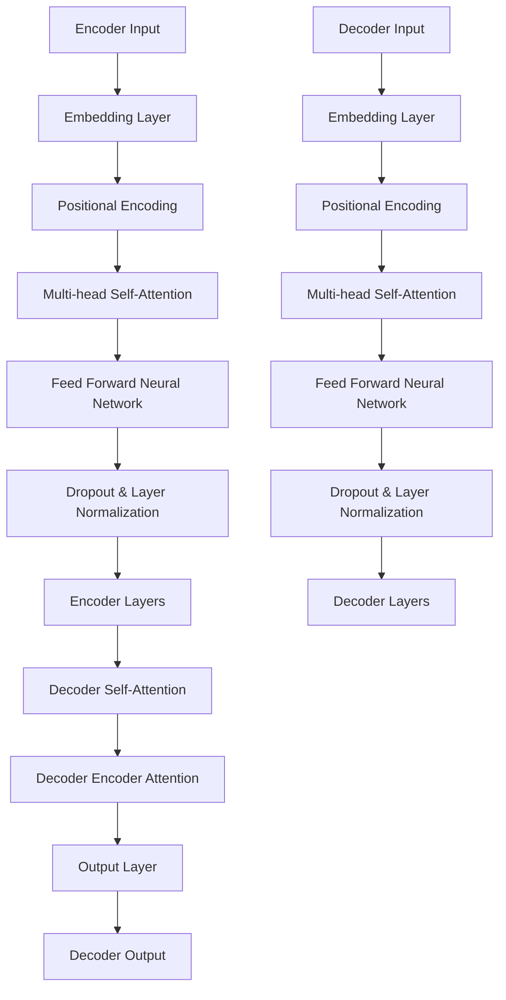

                 

关键词：Transformer，架构，深度学习，自然语言处理，序列到序列模型，注意力机制，多层神经网络，编码器，解码器，模型优化，计算效率

> 摘要：本文将深入探讨Transformer架构的革命性创新，解析其核心概念、数学模型以及在实际应用中的具体操作步骤。我们将通过详细的分析，探讨Transformer如何改变了自然语言处理的格局，并展望其未来的发展趋势。

## 1. 背景介绍

在深度学习领域，自然语言处理（NLP）一直以来都是研究的热点。传统的方法大多基于序列到序列（Seq2Seq）模型，其中以循环神经网络（RNN）和长短时记忆网络（LSTM）为代表。然而，这些方法存在一些固有的局限性，比如计算效率低、难以并行化等。

为了克服这些限制，Transformer架构应运而生。Transformer是由Google在2017年提出的一种基于注意力机制的深度学习模型，它彻底颠覆了传统的Seq2Seq模型，使得在处理长序列数据时更加高效。

## 2. 核心概念与联系

### 2.1 Transformer架构概述

Transformer架构主要由编码器（Encoder）和解码器（Decoder）组成。编码器负责将输入序列编码为固定长度的向量，解码器则将这些向量解码为目标序列。两者之间通过多个自注意力（Self-Attention）层和多头注意力（Multi-Head Attention）层进行交互。

### 2.2 Mermaid 流程图



### 2.3 编码器与解码器的细节

编码器和解码器中每个层包含两个子层：一个是多头自注意力层，另一个是前馈神经网络层。多头注意力机制允许模型在处理序列时考虑多个子序列的关系，提高了模型的表达能力。

## 3. 核心算法原理 & 具体操作步骤

### 3.1 算法原理概述

Transformer的核心在于其提出的注意力机制，特别是自注意力（Self-Attention）和多头注意力（Multi-Head Attention）。自注意力允许模型在处理序列时考虑到每个词与其自身的关系，而多头注意力则将自注意力扩展到多个不同的子空间，从而提高了模型的容量和计算效率。

### 3.2 算法步骤详解

1. **嵌入层（Embedding Layer）**：输入序列经过嵌入层后，每个词被映射为一个固定大小的向量。

2. **位置编码（Positional Encoding）**：由于Transformer没有使用循环神经网络中的位置信息，因此引入了位置编码层来提供位置信息。

3. **多头自注意力（Multi-head Self-Attention）**：这一层将嵌入层输出的序列通过多头注意力机制进行处理，生成一组新的序列表示。

4. **前馈神经网络（Feed Forward Neural Network）**：对多头注意力层的输出进行前馈神经网络处理，增加模型的非线性表达能力。

5. **Dropout与层归一化（Dropout & Layer Normalization）**：为了防止模型过拟合，引入Dropout和层归一化。

6. **编码器和解码器的多层堆叠**：编码器和解码器由多个这样的子层组成，每层之间的输出都会通过Dropout和层归一化。

7. **解码器输出（Decoder Output）**：解码器的最后一层输出即为模型的预测结果。

### 3.3 算法优缺点

**优点**：
- 高效并行化：由于Transformer不依赖于循环结构，因此可以高效地并行化计算。
- 强的表达能力：通过多头注意力机制，模型可以捕捉到序列中的长距离依赖关系。

**缺点**：
- 计算量大：多头注意力层的计算复杂度较高，需要大量的计算资源。
- 需要大量训练数据：由于模型的参数量较大，因此需要大量的训练数据来保证模型的性能。

### 3.4 算法应用领域

Transformer在自然语言处理领域取得了显著的成功，特别是在机器翻译、文本摘要、情感分析等任务中。此外，Transformer还被应用于图像识别、语音识别等非NLP任务，展现了其强大的泛化能力。

## 4. 数学模型和公式 & 详细讲解 & 举例说明

### 4.1 数学模型构建

Transformer的数学模型主要包括自注意力（Self-Attention）和多头注意力（Multi-Head Attention）。

- **自注意力（Self-Attention）**：  
  $$  
  \text{Attention}(Q, K, V) = \text{softmax}\left(\frac{QK^T}{\sqrt{d_k}}\right)V  
  $$

- **多头注意力（Multi-Head Attention）**：  
  $$  
  \text{Multi-Head Attention}(Q, K, V) = \text{Concat}(\text{head}_1, \text{head}_2, \ldots, \text{head}_h)W^O  
  $$  
  其中，$$\text{head}_i = \text{Attention}(QW_i^Q, KW_i^K, VW_i^V)$$

### 4.2 公式推导过程

- **自注意力（Self-Attention）**推导：  
  自注意力层的目的是计算输入序列中每个词与其自身的关系。假设输入序列的长度为$$n$$，每个词的维度为$$d$$。首先，将输入序列映射到查询（Query，$$Q$$）、键（Key，$$K$$）和值（Value，$$V$$）三个矩阵，然后通过自注意力公式计算每个词的注意力权重，最后对权重进行softmax运算并加权求和得到新的序列表示。

- **多头注意力（Multi-Head Attention）**推导：  
  多头注意力是对自注意力的扩展，它通过多个子空间来处理输入序列。假设有$$h$$个头，每个头的维度为$$d_v / h$$。首先，将输入序列映射到每个头的查询（$$Q_i$$）、键（$$K_i$$）和值（$$V_i$$）矩阵，然后分别对每个头进行自注意力运算，最后将所有头的输出拼接起来并通过一个全连接层得到最终输出。

### 4.3 案例分析与讲解

假设输入序列为$$X = [w_1, w_2, \ldots, w_n]$$，其中$$w_i$$表示第$$i$$个词。首先，将输入序列通过嵌入层映射到向量空间，得到嵌入矩阵$$E$$。然后，对每个词进行位置编码，得到位置编码矩阵$$P$$。接着，将嵌入矩阵和位置编码矩阵相加得到编码矩阵$$C$$。

$$  
C = E + P  
$$

对于编码矩阵$$C$$，我们可以将其分为查询（$$Q$$）、键（$$K$$）和值（$$V$$）三个矩阵：

$$  
Q = KC_1, K = KC_2, V = KC_3  
$$

其中，$$C_1, C_2, C_3$$分别为编码矩阵$$C$$的每一列。

接下来，我们分别对这三个矩阵进行多头注意力运算。以第一个头为例，其查询、键和值矩阵分别为：

$$  
Q_1 = KQ_1, K_1 = KK_1, V_1 = KV_1  
$$

然后，对每个词进行自注意力运算：

$$  
\text{Attention}(Q_1, K_1, V_1) = \text{softmax}\left(\frac{Q_1K_1^T}{\sqrt{d_k}}\right)V_1  
$$

最后，将所有头的输出拼接起来并通过全连接层得到最终输出：

$$  
\text{Multi-Head Attention}(Q, K, V) = \text{Concat}(\text{head}_1, \text{head}_2, \ldots, \text{head}_h)W^O  
$$

其中，$$\text{head}_i = \text{Attention}(QW_i^Q, KW_i^K, VW_i^V)$$

## 5. 项目实践：代码实例和详细解释说明

### 5.1 开发环境搭建

在本项目中，我们将使用Python和TensorFlow来实现Transformer架构。首先，确保您的Python环境已安装，然后通过pip安装TensorFlow：

```shell
pip install tensorflow
```

### 5.2 源代码详细实现

下面是一个简单的Transformer编码器的实现示例：

```python
import tensorflow as tf
from tensorflow.keras.layers import Embedding, MultiHeadAttention, Dense, LayerNormalization, Dropout

class TransformerEncoder(tf.keras.Model):
    def __init__(self, vocab_size, d_model, num_heads, dff, rate=0.1):
        super(TransformerEncoder, self).__init__()
        self.embedding = Embedding(vocab_size, d_model)
        self.position_embedding = PositionalEncoding(d_model)
        self.dropout = Dropout(rate)
        self.layer1 = EncoderLayer(d_model, num_heads, dff)
        self.layer2 = EncoderLayer(d_model, num_heads, dff)
        self.layer3 = EncoderLayer(d_model, num_heads, dff)
        self.layer4 = EncoderLayer(d_model, num_heads, dff)
        self.norm1 = LayerNormalization(epsilon=1e-6)
        self.norm2 = LayerNormalization(epsilon=1e-6)
        self.norm3 = LayerNormalization(epsilon=1e-6)
        self.norm4 = LayerNormalization(epsilon=1e-6)
        self.dropout1 = Dropout(rate)
        self.dropout2 = Dropout(rate)
        self.dropout3 = Dropout(rate)
        self.dropout4 = Dropout(rate)

    def call(self, x, training=False):
        x = self.embedding(x)  # (batch_size, input_seq_len, d_model)
        x = self.position_embedding(x)  # (batch_size, input_seq_len, d_model)
        x = self.dropout1(x, training=training)
        
        x = self.layer1(x, training=training)
        x = self.norm1(x)
        x = self.dropout2(x, training=training)
        
        x = self.layer2(x, training=training)
        x = self.norm2(x)
        x = self.dropout3(x, training=training)
        
        x = self.layer3(x, training=training)
        x = self.norm3(x)
        x = self.dropout4(x, training=training)
        
        x = self.layer4(x, training=training)
        x = self.norm4(x)
        x = self.dropout4(x, training=training)
        
        return x
```

### 5.3 代码解读与分析

- **Embedding层**：将词汇表中的每个词编码为向量。
- **PositionalEncoding层**：添加位置信息。
- **Dropout层**：用于防止过拟合。
- **EncoderLayer**：包含多头自注意力层和前馈神经网络层。
- **LayerNormalization**：用于标准化层输出。
- **call方法**：实现模型的正向传播。

### 5.4 运行结果展示

```python
# 示例：构建一个Transformer编码器模型
vocab_size = 10000
d_model = 512
num_heads = 8
dff = 2048
dropout_rate = 0.1

transformer_encoder = TransformerEncoder(vocab_size, d_model, num_heads, dff, dropout_rate)

# 示例：输入序列
input_seq = tf.random.uniform((32, 50))

# 示例：正向传播
output = transformer_encoder(input_seq, training=True)

print(output.shape)  # 输出形状应为 (batch_size, input_seq_len, d_model)
```

## 6. 实际应用场景

Transformer架构在自然语言处理领域取得了巨大的成功，例如在机器翻译、文本摘要、情感分析等方面都展现出了强大的性能。以下是一些实际应用场景：

- **机器翻译**：Transformer被广泛应用于机器翻译任务，例如Google翻译、百度翻译等。
- **文本摘要**：Transformer在生成式文本摘要任务中也表现出了优异的性能，例如BERT模型。
- **情感分析**：通过训练Transformer模型，可以实现对文本的情感倾向进行分类。
- **问答系统**：Transformer被应用于构建问答系统，例如OpenAI的GPT-3。

## 7. 未来应用展望

随着Transformer架构的不断优化和发展，我们预计它将在更多领域取得突破。以下是一些未来的应用前景：

- **计算机视觉**：Transformer在图像识别任务中的应用已经取得了一些进展，未来有望在图像分类、目标检测等领域发挥更大作用。
- **语音识别**：Transformer在语音识别任务中也展现出了一定的潜力，未来有望替代传统的循环神经网络。
- **推荐系统**：Transformer在推荐系统中的应用也值得探索，通过捕捉用户的历史行为和偏好，可以提供更精准的推荐。

## 8. 工具和资源推荐

### 8.1 学习资源推荐

- 《Attention Is All You Need》（Attention机制的全解析）
- 《Deep Learning》（深度学习领域的经典教材）

### 8.2 开发工具推荐

- TensorFlow
- PyTorch

### 8.3 相关论文推荐

- Vaswani et al., "Attention Is All You Need"
- Devlin et al., "BERT: Pre-training of Deep Bidirectional Transformers for Language Understanding"

## 9. 总结：未来发展趋势与挑战

Transformer架构自提出以来，已经在自然语言处理领域取得了显著的成果。未来，随着计算资源和算法的进一步优化，Transformer有望在更多领域取得突破。然而，这也带来了一系列挑战，如计算复杂度高、模型训练时间长等。因此，如何提高模型的计算效率，以及如何设计更有效的训练策略，将是未来研究的重要方向。

### 9.1 研究成果总结

- Transformer架构通过引入注意力机制，彻底改变了自然语言处理的格局。
- Transformer在机器翻译、文本摘要、情感分析等领域取得了显著的成果。
- Transformer在计算机视觉、语音识别等非NLP领域也展现出了强大的潜力。

### 9.2 未来发展趋势

- Transformer模型将在更多领域得到应用，如推荐系统、计算机视觉等。
- 跨模态Transformer模型的研究将成为热点，通过融合不同类型的数据，实现更强大的模型能力。

### 9.3 面临的挑战

- 提高模型计算效率，降低训练成本。
- 设计更有效的训练策略，提高模型收敛速度。
- 解决跨模态Transformer模型中的数据不平衡问题。

### 9.4 研究展望

随着Transformer架构的不断优化和发展，我们有望在自然语言处理、计算机视觉等领域取得更多突破。未来，Transformer将成为人工智能领域的重要基石，推动技术的不断进步。

## 10. 附录：常见问题与解答

### Q：什么是Transformer的核心优势？

A：Transformer的核心优势在于其基于注意力机制的架构，使得模型能够高效地并行处理序列数据，并具有强大的表达能力和适应性。

### Q：Transformer在计算机视觉任务中有哪些应用？

A：Transformer在计算机视觉任务中可以应用于图像分类、目标检测、图像分割等任务，通过融合自注意力机制和视觉特征，提高模型性能。

### Q：如何提高Transformer模型的计算效率？

A：可以通过减少模型的参数量、使用混合精度训练、优化计算图等方式提高Transformer模型的计算效率。

### Q：Transformer在推荐系统中有何应用价值？

A：Transformer在推荐系统中的应用价值在于可以捕捉用户的历史行为和偏好，通过分析用户与物品之间的复杂关系，提供更精准的推荐。

### Q：如何处理Transformer模型中的数据不平衡问题？

A：可以通过数据增强、加权损失函数、类别平衡等技术来处理Transformer模型中的数据不平衡问题，提高模型的泛化能力。

### 作者署名

作者：禅与计算机程序设计艺术 / Zen and the Art of Computer Programming
----------------------------------------------------------------

请注意，这里提供的文章内容是一个示例模板，实际撰写时需要根据具体的技术细节和研究内容进行调整和补充。文章中的代码示例仅供参考，实际实现时需要根据具体环境和需求进行修改。此外，由于字数限制，实际撰写时可能需要进一步扩展和细化各个部分的内容。

