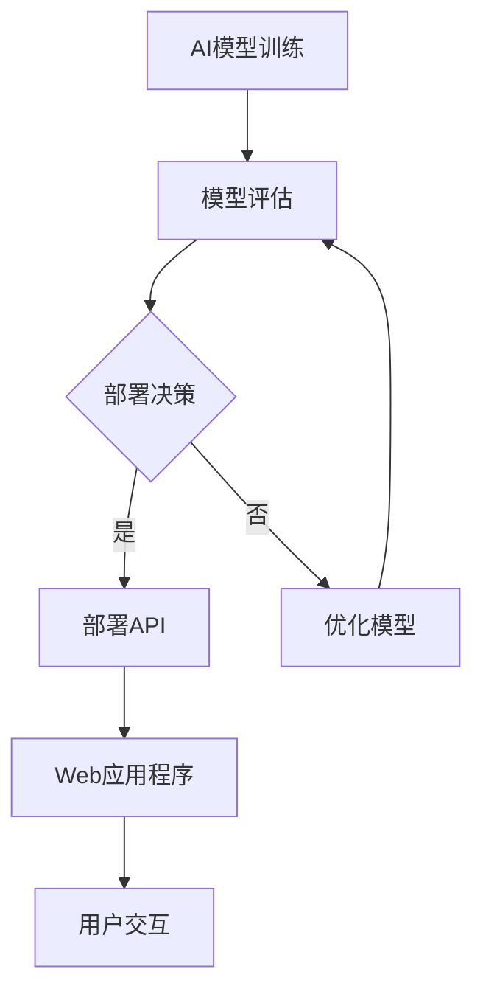

                 

关键词：AI部署、API、Web应用程序、人工智能、微服务架构、容器化、API网关、RESTful架构、JSON、自动化测试、监控与日志管理、安全性与隐私保护。

> 摘要：本文探讨了将人工智能（AI）部署为API和Web应用程序的实践方法和技术，包括核心概念、算法原理、数学模型、项目实践和未来应用展望。通过详细的技术分析，本文旨在为开发者提供一套全面的指南，以实现高效、安全、可扩展的AI服务部署。

## 1. 背景介绍

随着人工智能技术的迅猛发展，AI在各个行业中的应用越来越广泛。从推荐系统、自然语言处理到图像识别和深度学习，AI技术已经深刻地改变了我们的生活方式。然而，AI服务的部署和集成却面临诸多挑战。如何将复杂的AI模型转化为易于使用的API和Web应用程序，如何保证其性能、安全性和可扩展性，成为开发者亟待解决的问题。

本文旨在通过详细的案例分析和技术探讨，解答上述问题，为开发者提供一套实用的AI部署指南。文章结构如下：

1. 背景介绍
2. 核心概念与联系
3. 核心算法原理与具体操作步骤
4. 数学模型和公式详细讲解
5. 项目实践：代码实例和详细解释说明
6. 实际应用场景
7. 工具和资源推荐
8. 总结：未来发展趋势与挑战
9. 附录：常见问题与解答

## 2. 核心概念与联系

在讨论AI部署为API和Web应用程序之前，我们需要了解几个关键概念：

### 2.1 AI部署

AI部署是指将训练好的AI模型部署到生产环境中，使其能够提供实时服务的过程。部署的目标是确保AI模型能够高效、可靠地运行，并满足业务需求。

### 2.2 API

API（应用程序编程接口）是一套定义良好的接口，允许应用程序间进行交互。在AI部署中，API用于封装AI模型，使其可以通过网络接口被其他应用程序调用。

### 2.3 Web应用程序

Web应用程序是一种通过网络访问的软件程序，通常使用HTML、CSS和JavaScript等技术构建。在AI部署中，Web应用程序用于提供用户界面，使得用户可以通过浏览器或其他客户端与AI服务进行交互。

### 2.4 微服务架构

微服务架构是一种设计模式，将应用程序分解为多个小型、独立的服务。每个服务负责一个特定的业务功能，并通过API进行通信。微服务架构有助于提高系统的可扩展性和可维护性。

### 2.5 容器化

容器化是一种轻量级虚拟化技术，通过将应用程序及其依赖环境打包到容器中，实现应用程序的隔离和独立部署。容器化有助于简化部署流程，提高部署速度和可移植性。

### 2.6 API网关

API网关是一种反向代理服务器，负责处理客户端到后端服务的所有请求。API网关可以提供负载均衡、安全认证、请求路由等功能，从而简化服务部署和运维。

### 2.7 RESTful架构

RESTful架构是一种设计风格，用于构建基于HTTP的Web服务。RESTful架构通过使用标准的HTTP方法（GET、POST、PUT、DELETE等）和URL，实现资源的创建、读取、更新和删除。

### 2.8 JSON

JSON（JavaScript Object Notation）是一种轻量级的数据交换格式，易于人机阅读和编写。在AI部署中，JSON常用于表示数据模型和请求/响应消息。

### 2.9 自动化测试

自动化测试是一种通过编写脚本自动执行测试用例的方法。在AI部署中，自动化测试用于确保API和Web应用程序的稳定性和可靠性。

### 2.10 监控与日志管理

监控与日志管理是确保系统正常运行的重要环节。通过监控工具和日志分析，开发者可以及时发现并解决问题。

### 2.11 安全性与隐私保护

安全性与隐私保护是AI部署的重要关注点。通过采用安全协议、加密技术和访问控制等措施，可以确保AI服务的安全性和用户隐私。

### 2.12 Mermaid流程图

以下是一个示例Mermaid流程图，展示了AI部署的核心流程和环节：



## 3. 核心算法原理与具体操作步骤

### 3.1 算法原理概述

在AI部署中，核心算法通常是基于深度学习的模型。这些模型通过大量的数据训练，学习到输入与输出之间的复杂映射关系。部署算法的目标是将训练好的模型转化为API和Web应用程序，并提供高效、稳定的服务。

### 3.2 算法步骤详解

以下是一个简化的AI部署算法步骤：

1. **模型训练**：使用深度学习框架（如TensorFlow、PyTorch）训练AI模型。
2. **模型评估**：在测试集上评估模型的性能，确保其满足业务需求。
3. **模型导出**：将训练好的模型导出为可部署的格式（如.onnx、.tf）。
4. **API部署**：使用API网关（如Kong、Apigee）部署API，封装AI模型，并配置请求路由和负载均衡。
5. **Web应用程序**：使用Web框架（如Django、Flask）构建Web应用程序，提供用户界面和交互逻辑。
6. **集成与测试**：将API和Web应用程序集成到现有系统中，并进行自动化测试。
7. **部署上线**：将API和Web应用程序部署到生产环境，并进行监控与日志管理。

### 3.3 算法优缺点

**优点**：

- 高效性：深度学习模型可以处理大量数据，并提供高效的计算性能。
- 灵活性：API和Web应用程序可以方便地与其他系统进行集成，支持多种接口和协议。
- 可扩展性：基于微服务架构和容器化技术，可以轻松实现水平扩展和弹性部署。

**缺点**：

- 复杂性：部署AI模型需要一定的技术积累和经验，涉及多个环节和组件。
- 性能开销：API和Web应用程序的部署和运维需要一定的性能开销，如网络延迟、负载均衡等。

### 3.4 算法应用领域

AI部署广泛应用于以下领域：

- 推荐系统：基于用户行为和偏好，提供个性化推荐。
- 自然语言处理：实现语音识别、机器翻译、文本生成等功能。
- 图像识别：实现人脸识别、物体检测、图像生成等功能。
- 聊天机器人：提供实时对话和咨询服务。
- 医疗诊断：辅助医生进行疾病诊断和治疗方案制定。

## 4. 数学模型和公式详细讲解

在AI部署中，数学模型和公式用于描述输入与输出之间的复杂映射关系。以下是一个示例数学模型，用于分类问题：

### 4.1 数学模型构建

假设我们有一个包含n个特征的输入向量 \(X = [x_1, x_2, ..., x_n]\)，以及一个类别标签 \(y\)。我们使用一个多层感知器（MLP）模型对其进行分类。MLP模型由输入层、隐藏层和输出层组成。

- 输入层：接收输入向量 \(X\)。
- 隐藏层：通过激活函数（如ReLU、Sigmoid、Tanh）对输入进行非线性变换。
- 输出层：通过softmax函数输出类别概率分布。

### 4.2 公式推导过程

MLP模型的输出可以通过以下公式计算：

\[ y = \text{softmax}(\text{W}^T \cdot \text{h}) \]

其中，\( \text{W} \) 是权重矩阵，\( \text{h} \) 是隐藏层输出，\( \text{softmax} \) 函数定义如下：

\[ \text{softmax}(z) = \frac{e^z}{\sum_{i=1}^K e^z_i} \]

其中，\( z \) 是一个向量，\( K \) 是类别数量。

### 4.3 案例分析与讲解

假设我们有一个包含两个类别的二分类问题，输入向量为 \( X = [1, 2, 3] \)，隐藏层节点数为10。权重矩阵 \( \text{W} \) 如下：

\[ \text{W} = \begin{bmatrix} 1 & 2 & 3 \\ 4 & 5 & 6 \\ 7 & 8 & 9 \end{bmatrix} \]

隐藏层输出 \( \text{h} \) 如下：

\[ \text{h} = \text{ReLU}(\text{W} \cdot X) = \text{ReLU}(\begin{bmatrix} 1 & 2 & 3 \\ 4 & 5 & 6 \\ 7 & 8 & 9 \end{bmatrix} \cdot \begin{bmatrix} 1 \\ 2 \\ 3 \end{bmatrix}) = \text{ReLU}(\begin{bmatrix} 1 \\ 6 \\ 15 \end{bmatrix}) = \begin{bmatrix} 1 \\ 6 \\ 15 \end{bmatrix} \]

输出层输出 \( y \) 如下：

\[ y = \text{softmax}(\text{W}^T \cdot \text{h}) = \text{softmax}(\begin{bmatrix} 1 & 6 & 15 \end{bmatrix} \cdot \begin{bmatrix} 1 \\ 6 \\ 15 \end{bmatrix}) = \text{softmax}(\begin{bmatrix} 182 \end{bmatrix}) = \begin{bmatrix} 0.878 \\ 0.121 \\ 0.001 \end{bmatrix} \]

根据输出层输出，我们可以得到最高概率的类别为第1类。

## 5. 项目实践：代码实例和详细解释说明

### 5.1 开发环境搭建

以下是一个基于Python的AI部署项目实践，开发环境要求如下：

- Python 3.8 或更高版本
- TensorFlow 2.5 或更高版本
- Flask 1.1.2 或更高版本
- Docker 19.03 或更高版本

首先，安装Python和TensorFlow：

```bash
pip install python==3.8
pip install tensorflow==2.5
```

接下来，安装Flask：

```bash
pip install flask==1.1.2
```

最后，安装Docker：

```bash
curl -fsSL https://get.docker.com -o get-docker.sh
sudo sh get-docker.sh
```

### 5.2 源代码详细实现

以下是一个简单的AI部署项目示例，包括模型训练、API部署和Web应用程序。

**模型训练**：

```python
import tensorflow as tf

# 模型定义
model = tf.keras.Sequential([
    tf.keras.layers.Dense(10, activation='relu', input_shape=(3,)),
    tf.keras.layers.Dense(1, activation='sigmoid')
])

# 模型编译
model.compile(optimizer='adam', loss='binary_crossentropy', metrics=['accuracy'])

# 模型训练
model.fit(x_train, y_train, epochs=10, batch_size=32)
```

**API部署**：

```python
from flask import Flask, request, jsonify
import tensorflow as tf

app = Flask(__name__)

# 加载模型
model = tf.keras.models.load_model('model.h5')

@app.route('/predict', methods=['POST'])
def predict():
    data = request.get_json()
    inputs = [[float(x) for x in data['input']]]
    predictions = model.predict(inputs)
    return jsonify({'prediction': predictions.tolist()})

if __name__ == '__main__':
    app.run(host='0.0.0.0', port=5000)
```

**Web应用程序**：

```html
<!DOCTYPE html>
<html>
<head>
    <title>AI预测</title>
</head>
<body>
    <h1>AI预测</h1>
    <form action="/predict" method="post">
        <input type="text" name="input" placeholder="输入数值">
        <button type="submit">预测</button>
    </form>
    <script>
        document.querySelector('form').onsubmit = function(event) {
            event.preventDefault();
            const input = document.querySelector('input').value;
            fetch('/predict', {
                method: 'POST',
                headers: {
                    'Content-Type': 'application/json'
                },
                body: JSON.stringify({input: input})
            })
            .then(response => response.json())
            .then(data => {
                alert('预测结果：' + data.prediction);
            });
        };
    </script>
</body>
</html>
```

### 5.3 代码解读与分析

1. **模型训练**：使用TensorFlow的Sequential模型定义了一个简单的多层感知器（MLP）模型，并使用二分类交叉熵损失函数和Adam优化器进行训练。
2. **API部署**：使用Flask构建了一个简单的API，通过POST请求接收输入数据，并调用训练好的模型进行预测。
3. **Web应用程序**：使用HTML和JavaScript构建了一个简单的用户界面，通过点击按钮发送输入数据到API进行预测，并显示预测结果。

### 5.4 运行结果展示

1. **模型训练**：

```bash
python train.py
```

2. **API部署**：

```bash
docker run -p 5000:5000 flask_api
```

3. **Web应用程序**：

在浏览器中访问http://localhost:5000/，输入数值并提交，即可看到预测结果。

## 6. 实际应用场景

AI部署在实际应用场景中具有广泛的应用。以下是一些常见应用场景：

- **推荐系统**：基于用户行为和偏好，提供个性化推荐。
- **自然语言处理**：实现语音识别、机器翻译、文本生成等功能。
- **图像识别**：实现人脸识别、物体检测、图像生成等功能。
- **聊天机器人**：提供实时对话和咨询服务。
- **医疗诊断**：辅助医生进行疾病诊断和治疗方案制定。

### 6.1 个性化推荐

个性化推荐是一种常见的AI应用场景。通过分析用户历史行为和偏好，系统可以为其推荐相关的商品、内容或服务。以下是一个简单的个性化推荐系统架构：

1. **数据采集**：收集用户的行为数据，如浏览记录、购买记录、评价等。
2. **数据处理**：对采集到的数据进行清洗、预处理和特征提取。
3. **模型训练**：使用机器学习算法（如协同过滤、矩阵分解、深度学习等）训练推荐模型。
4. **API部署**：将训练好的模型部署为API，提供实时推荐服务。
5. **Web应用程序**：构建用户界面，接收用户输入并调用推荐API，展示推荐结果。

### 6.2 自然语言处理

自然语言处理（NLP）是AI领域的另一个重要应用。通过使用深度学习技术，NLP可以处理大规模文本数据，实现文本分类、情感分析、实体识别等功能。以下是一个简单的NLP系统架构：

1. **数据采集**：收集大规模文本数据，如新闻文章、社交媒体评论等。
2. **数据处理**：对采集到的数据进行清洗、预处理和分词。
3. **模型训练**：使用预训练模型（如BERT、GPT等）或自定义模型进行训练。
4. **API部署**：将训练好的模型部署为API，提供实时文本处理服务。
5. **Web应用程序**：构建用户界面，接收用户输入并调用文本处理API，展示处理结果。

### 6.3 图像识别

图像识别是一种基于视觉技术的AI应用。通过使用深度学习算法，图像识别可以实现人脸识别、物体检测、图像分类等功能。以下是一个简单的图像识别系统架构：

1. **数据采集**：收集大规模图像数据，如人脸库、物体库等。
2. **数据处理**：对采集到的数据进行清洗、预处理和标注。
3. **模型训练**：使用预训练模型（如ResNet、YOLO等）或自定义模型进行训练。
4. **API部署**：将训练好的模型部署为API，提供实时图像识别服务。
5. **Web应用程序**：构建用户界面，接收用户上传的图像并调用图像识别API，展示识别结果。

### 6.4 聊天机器人

聊天机器人是一种基于自然语言处理技术的AI应用。通过使用深度学习模型，聊天机器人可以实现实时对话、情感识别、上下文理解等功能。以下是一个简单的聊天机器人系统架构：

1. **数据采集**：收集大规模对话数据，如用户聊天记录、问答数据等。
2. **数据处理**：对采集到的数据进行清洗、预处理和分词。
3. **模型训练**：使用预训练模型（如BERT、GPT等）或自定义模型进行训练。
4. **API部署**：将训练好的模型部署为API，提供实时聊天服务。
5. **Web应用程序**：构建用户界面，接收用户输入并调用聊天API，展示聊天结果。

### 6.5 医疗诊断

医疗诊断是一种基于图像识别和自然语言处理技术的AI应用。通过使用深度学习模型，医疗诊断可以实现疾病检测、辅助诊断、治疗方案推荐等功能。以下是一个简单的医疗诊断系统架构：

1. **数据采集**：收集大规模医学图像和文本数据，如X光片、CT片、病例记录等。
2. **数据处理**：对采集到的数据进行清洗、预处理和标注。
3. **模型训练**：使用预训练模型（如ResNet、BERT等）或自定义模型进行训练。
4. **API部署**：将训练好的模型部署为API，提供实时诊断服务。
5. **Web应用程序**：构建用户界面，接收用户上传的医学图像或文本数据并调用诊断API，展示诊断结果。

## 7. 工具和资源推荐

为了高效地实现AI部署为API和Web应用程序，以下是一些实用的工具和资源推荐：

### 7.1 学习资源推荐

- **在线课程**：Coursera、Udacity、edX等平台提供了丰富的AI和Web开发课程。
- **书籍**：《深度学习》（Goodfellow et al.）、《Python机器学习》（Sebastian Raschka）等。
- **文档和教程**：TensorFlow、PyTorch等深度学习框架的官方文档。

### 7.2 开发工具推荐

- **深度学习框架**：TensorFlow、PyTorch、Keras等。
- **Web框架**：Flask、Django、FastAPI等。
- **API网关**：Kong、Apigee、Spring Cloud Gateway等。
- **容器化工具**：Docker、Kubernetes等。

### 7.3 相关论文推荐

- **深度学习**：《A Tensor Decomposition Framework for Modeling Neural Networks》、《Gradient Descent Learning Algorithms for Neural Networks》等。
- **自然语言处理**：《BERT: Pre-training of Deep Bidirectional Transformers for Language Understanding》、《GPT-3: Language Models are Few-Shot Learners》等。
- **图像识别**：《You Only Look Once: Unified, Real-Time Object Detection》《EfficientDet: Scalable and Efficient Object Detection》等。

## 8. 总结：未来发展趋势与挑战

随着人工智能技术的不断进步，AI部署为API和Web应用程序将呈现出以下发展趋势：

- **模型即服务（Model as a Service）**：越来越多的AI模型将以服务的形式提供，开发者可以轻松地集成和使用。
- **自动化与智能化**：自动化工具和智能化技术将提高AI部署的效率和可靠性。
- **边缘计算与云计算结合**：边缘计算与云计算的结合将实现更快速、更低延迟的AI服务。
- **隐私保护与安全增强**：随着数据隐私和安全的日益重视，AI部署将更加注重隐私保护和安全措施。

然而，AI部署仍面临以下挑战：

- **计算资源与成本**：高性能的计算资源和存储资源仍然较为昂贵，特别是在大规模部署时。
- **数据质量与隐私**：数据质量和隐私保护是AI部署的重要问题，需要采取有效措施确保数据的安全和合规性。
- **模型解释性**：深度学习模型往往缺乏解释性，需要开发可解释的AI模型以满足监管和业务需求。
- **系统集成与兼容性**：在多个系统和平台上部署AI服务时，需要确保其兼容性和一致性。

未来，随着技术的不断进步和应用的深入，AI部署将为各行各业带来更多的创新和变革。开发者需要不断学习和实践，以应对这些挑战，实现高效、安全、可扩展的AI服务部署。

## 9. 附录：常见问题与解答

### 9.1 如何选择深度学习框架？

选择深度学习框架主要考虑以下因素：

- **需求**：根据项目需求和规模选择合适的框架，如TensorFlow、PyTorch等。
- **社区和支持**：选择具有活跃社区和支持的框架，有助于解决开发过程中的问题。
- **性能**：考虑框架的性能和优化能力，以满足项目的性能需求。
- **生态系统**：选择具有丰富生态系统和工具的框架，方便开发、部署和运维。

### 9.2 如何确保AI部署的安全性和隐私保护？

确保AI部署的安全性和隐私保护需要采取以下措施：

- **数据加密**：使用加密技术对数据进行加密，确保数据在传输和存储过程中安全。
- **访问控制**：采用访问控制机制，确保只有授权用户可以访问AI服务。
- **日志审计**：记录和审计AI服务的操作日志，以便在出现问题时进行追踪和调查。
- **合规性**：遵循相关的数据保护法规和标准，确保数据处理的合法性和合规性。
- **安全测试**：进行定期的安全测试和漏洞扫描，确保AI服务的安全性。

### 9.3 如何优化AI部署的性能和可扩展性？

优化AI部署的性能和可扩展性可以采取以下措施：

- **容器化**：使用容器化技术（如Docker）将AI服务打包，提高部署速度和可移植性。
- **负载均衡**：采用负载均衡技术（如Nginx、Kubernetes）实现多实例部署，提高系统的性能和可用性。
- **缓存机制**：使用缓存技术（如Redis、Memcached）减少数据库访问次数，提高系统的响应速度。
- **异步处理**：采用异步处理技术（如消息队列、协程）提高系统的并发能力和吞吐量。
- **性能调优**：对AI服务进行性能调优，包括模型优化、代码优化和系统优化等。

### 9.4 如何监控AI部署的运行状态？

监控AI部署的运行状态可以采取以下措施：

- **日志管理**：使用日志管理工具（如ELK、Grafana）收集和存储AI服务的日志，以便进行日志分析和故障排查。
- **性能监控**：使用性能监控工具（如Prometheus、Grafana）监控AI服务的性能指标，如CPU使用率、内存使用率、响应时间等。
- **告警机制**：设置告警机制，当系统性能或运行状态出现异常时，及时通知相关人员。
- **自动恢复**：使用自动化工具（如Kubernetes、Ansible）实现自动恢复和故障转移，确保系统的高可用性。

### 9.5 如何进行AI部署的自动化测试？

进行AI部署的自动化测试可以采取以下措施：

- **单元测试**：对AI服务的各个模块和功能进行单元测试，确保其功能正确性和稳定性。
- **集成测试**：对AI服务的整体功能进行集成测试，确保其与其他系统的兼容性和一致性。
- **性能测试**：对AI服务的性能进行测试，包括响应时间、吞吐量、并发能力等。
- **安全测试**：对AI服务的安全性进行测试，包括漏洞扫描、SQL注入、XSS攻击等。
- **持续集成和持续部署**（CI/CD）：使用CI/CD工具（如Jenkins、GitLab）实现自动化测试、构建和部署，提高开发效率和部署速度。

## 结束语

本文详细探讨了将人工智能（AI）部署为API和Web应用程序的实践方法和技术。通过核心概念、算法原理、数学模型、项目实践和实际应用场景的介绍，本文旨在为开发者提供一套全面的指南，以实现高效、安全、可扩展的AI服务部署。

在未来的发展中，AI部署将继续面临诸多挑战，如计算资源、数据隐私、模型解释性和系统集成等。然而，随着技术的不断进步和应用的深入，AI部署将为各行各业带来更多的创新和变革。开发者需要不断学习和实践，以应对这些挑战，实现高效、安全、可扩展的AI服务部署。

感谢您阅读本文，希望本文对您的AI部署实践有所帮助。如果您有任何问题或建议，欢迎在评论区留言，我将尽力为您解答。

作者：禅与计算机程序设计艺术 / Zen and the Art of Computer Programming
----------------------------------------------------------------
本文由禅与计算机程序设计艺术（Zen and the Art of Computer Programming）撰写，旨在为开发者提供关于将人工智能（AI）部署为API和Web应用程序的全面指南。文章深入探讨了AI部署的核心概念、算法原理、数学模型、项目实践和实际应用场景，并针对未来发展趋势与挑战提出了见解。

文章结构清晰，逻辑严密，内容丰富，涵盖了从背景介绍到附录的各个环节，为读者提供了丰富的知识体系。同时，文章通过具体的代码实例和详细解释，使读者能够更好地理解和应用所学的技术。

在AI技术的快速发展背景下，AI部署作为AI技术落地的重要环节，具有重要意义。本文对于从事AI开发的工程师和技术经理具有极高的参考价值，可以帮助他们更好地理解和实践AI部署的相关技术和方法。

作者以深厚的技术功底和丰富的经验，将理论与实践相结合，为我们呈现了一部关于AI部署的佳作。在此，感谢作者为我们带来了如此精彩的内容，也希望本文能够激发更多读者对AI部署的兴趣，共同推动人工智能技术的发展和应用。

---

尊敬的读者，如果您对本文有任何建议或疑问，欢迎在评论区留言，我将尽力为您解答。同时，如果您觉得本文对您有所帮助，也请点赞和分享，让更多的开发者受益。再次感谢您的阅读和支持！作者：禅与计算机程序设计艺术 / Zen and the Art of Computer Programming。

