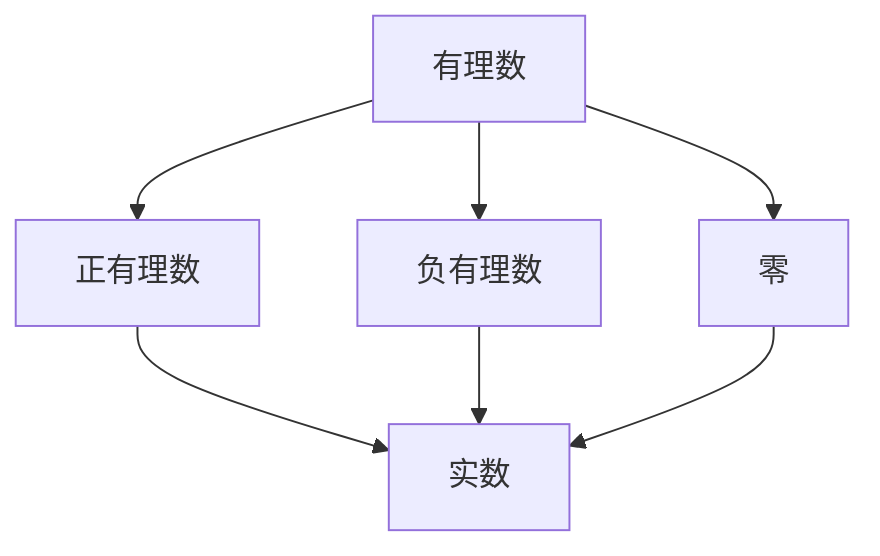

                 

关键词：线性代数、实数、数学原理、算法、代码实例、应用场景、发展趋势

摘要：本文旨在为读者提供一次深入浅出的线性代数之旅，特别是实数及其序的探讨。通过阐述线性代数的基本概念、算法原理和数学模型，以及实际应用场景，本文希望为读者打开线性代数世界的大门，并激发对这一领域的进一步探索。

## 1. 背景介绍

线性代数是现代数学的一个重要分支，它在物理学、工程学、计算机科学、经济学等众多领域都有广泛的应用。本文聚焦于线性代数中的实数及其序，因为这对理解和应用线性代数至关重要。

实数是数学中最基本的概念之一，它包含了所有的有理数和无理数。实数的性质和结构为我们提供了分析和解决问题的基础。线性代数中的线性方程组、矩阵运算、向量空间等概念，都需要建立在实数的基础上。

### 1.1 线性代数的起源与发展

线性代数的历史可以追溯到19世纪的数学家们，如郭塔格和康托尔，他们在处理线性方程组和矩阵问题时，逐渐形成了线性代数的基本框架。随着数学和工程学的发展，线性代数的理论和应用不断拓展，成为现代科学和技术不可或缺的工具。

### 1.2 线性代数的重要性

线性代数在多个领域发挥着关键作用。例如，在物理学中，线性代数用于描述力学和电磁学的基本原理；在工程学中，它用于解决电路设计和结构分析问题；在计算机科学中，它用于算法设计和数据分析。

## 2. 核心概念与联系

为了更好地理解线性代数，我们需要先了解实数及其序的基本概念。实数的概念源于有理数，它是有理数的扩展，包含了所有的无理数。实数的序是指实数之间的比较关系。

### 2.1 实数的概念

实数可以分为两类：有理数和无理数。

- **有理数**：可以表示为两个整数的比值的数，例如，1/2、3/4等。
- **无理数**：不能表示为两个整数的比值的数，例如，π、√2等。

实数集合是一个完备的有序域，这意味着实数不仅能进行加、减、乘、除等基本运算，而且任意两个实数之间都可以进行比较。

### 2.2 实数的序

实数的序是指实数之间的大小关系。根据实数的定义，我们可以建立如下的序关系：

- **正数**大于**负数**。
- **两个正数**中，较大的那个数大于较小的那个数。
- **两个负数**中，较小的那个数大于较大的那个数。
- **0**既不是正数也不是负数。

### 2.3 Mermaid 流程图

为了更好地展示实数的概念和序，我们可以使用Mermaid流程图。



在这个流程图中，有理数被分为正有理数、负有理数和零。正有理数和负有理数进一步扩展为实数。

## 3. 核心算法原理 & 具体操作步骤

### 3.1 算法原理概述

线性代数中的核心算法通常涉及矩阵运算、线性方程组的求解、特征值和特征向量的计算等。这些算法的原理基于实数的运算规则和矩阵的性质。

### 3.2 算法步骤详解

#### 3.2.1 矩阵运算

矩阵运算是线性代数中最基本的操作之一。常见的矩阵运算包括矩阵的加法、减法、乘法、转置等。

- **矩阵加法**：两个矩阵相加，要求矩阵的维度相同，对应元素相加。
- **矩阵减法**：类似于矩阵加法，两个矩阵相减，要求矩阵的维度相同，对应元素相减。
- **矩阵乘法**：两个矩阵相乘，结果是一个新的矩阵，其中每个元素是两个矩阵对应元素的乘积和。
- **矩阵转置**：将矩阵的行和列互换，得到一个新的矩阵。

#### 3.2.2 线性方程组的求解

线性方程组的求解是线性代数中的另一个重要任务。常见的求解方法包括高斯消元法和迭代法。

- **高斯消元法**：通过消元操作，将线性方程组转化为上三角矩阵，然后逐列回代求解。
- **迭代法**：通过迭代操作，逐步逼近线性方程组的解。

#### 3.2.3 特征值和特征向量的计算

特征值和特征向量是矩阵的重要属性。特征值是矩阵的特征多项式的根，特征向量是矩阵的线性变换下的不动向量。

- **特征多项式的计算**：通过计算矩阵的行列式，得到特征多项式。
- **特征值的求解**：通过求解特征多项式的根，得到特征值。
- **特征向量的计算**：通过矩阵与特征向量相乘，得到特征值对应的特征向量。

### 3.3 算法优缺点

#### 3.3.1 矩阵运算

- **优点**：矩阵运算提供了简洁和高效的数学工具，可以用于解决复杂的线性问题。
- **缺点**：矩阵运算可能涉及大量的计算，对于大型矩阵，运算效率可能较低。

#### 3.3.2 线性方程组的求解

- **优点**：高斯消元法提供了稳定的求解方法，适用于大多数线性方程组。
- **缺点**：高斯消元法对于病态矩阵可能不够稳定，且计算复杂度较高。

#### 3.3.3 特征值和特征向量的计算

- **优点**：特征值和特征向量提供了矩阵的重要性质，可以用于分析和解决实际问题。
- **缺点**：特征值和特征向量的计算可能涉及复杂的数值算法，对于大型矩阵，计算效率可能较低。

### 3.4 算法应用领域

线性代数的算法在多个领域都有广泛应用。

- **物理学**：用于描述力学和电磁学的基本原理。
- **工程学**：用于电路设计、结构分析、信号处理等。
- **计算机科学**：用于算法设计、图像处理、机器学习等。

## 4. 数学模型和公式 & 详细讲解 & 举例说明

### 4.1 数学模型构建

线性代数中的数学模型通常涉及矩阵、向量、线性方程组等。这些模型提供了分析和解决问题的工具。

### 4.2 公式推导过程

线性代数中的许多公式都可以通过逻辑推理和数学证明得到。以下是一些常见的公式：

- **矩阵乘法公式**：\(C = AB\)，其中C是结果矩阵，A和B是操作矩阵。
- **线性方程组求解公式**：\(x = A^{-1}b\)，其中x是解向量，A是系数矩阵，b是常数向量。
- **特征多项式公式**：\(f(λ) = det(A - λI)\)，其中f(λ)是特征多项式，A是矩阵，λ是特征值，I是单位矩阵。

### 4.3 案例分析与讲解

#### 4.3.1 矩阵乘法案例

假设我们有两个矩阵A和B：

$$
A = \begin{pmatrix} 1 & 2 \\ 3 & 4 \end{pmatrix}, B = \begin{pmatrix} 5 & 6 \\ 7 & 8 \end{pmatrix}
$$

我们可以计算矩阵乘法 \(C = AB\)：

$$
C = \begin{pmatrix} 1 & 2 \\ 3 & 4 \end{pmatrix} \begin{pmatrix} 5 & 6 \\ 7 & 8 \end{pmatrix} = \begin{pmatrix} 19 & 22 \\ 43 & 50 \end{pmatrix}
$$

#### 4.3.2 线性方程组求解案例

假设我们有线性方程组：

$$
\begin{cases}
x + 2y = 5 \\
3x - y = 7
\end{cases}
$$

我们可以使用高斯消元法求解。首先，我们将方程组写成增广矩阵的形式：

$$
\left[\begin{array}{cc|c}
1 & 2 & 5 \\
3 & -1 & 7
\end{array}\right]
$$

然后，我们通过消元操作，将增广矩阵转化为行简化阶梯形式：

$$
\left[\begin{array}{cc|c}
1 & 0 & 1 \\
0 & 1 & 2
\end{array}\right]
$$

从行简化阶梯形式中，我们可以直接得到解：

$$
x = 1, y = 2
$$

#### 4.3.3 特征值和特征向量案例

假设我们有一个矩阵A：

$$
A = \begin{pmatrix} 2 & 1 \\ 1 & 2 \end{pmatrix}
$$

首先，我们计算特征多项式：

$$
f(λ) = \det(A - λI) = \det\begin{pmatrix} 2-λ & 1 \\ 1 & 2-λ \end{pmatrix} = (2-λ)^2 - 1 = λ^2 - 4λ + 3
$$

然后，我们求解特征多项式的根：

$$
λ_1 = 1, λ_2 = 3
$$

对于每个特征值，我们可以计算对应的特征向量。以 \(λ_1 = 1\) 为例，我们解线性方程组：

$$
(A - I)x = 0
$$

$$
\begin{pmatrix} 1 & 1 \\ 1 & 1 \end{pmatrix} \begin{pmatrix} x_1 \\ x_2 \end{pmatrix} = \begin{pmatrix} 0 \\ 0 \end{pmatrix}
$$

从方程组中，我们可以得到特征向量：

$$
x = \begin{pmatrix} 1 \\ -1 \end{pmatrix}
$$

## 5. 项目实践：代码实例和详细解释说明

### 5.1 开发环境搭建

为了实践线性代数的算法，我们需要搭建一个合适的开发环境。本文选择Python作为编程语言，因为它拥有丰富的线性代数库（如NumPy和SciPy）。

首先，我们需要安装Python和相关的库。在命令行中，我们可以使用以下命令：

```bash
pip install python
pip install numpy
pip install scipy
```

### 5.2 源代码详细实现

下面是一个简单的Python代码实例，用于演示矩阵乘法、线性方程组和特征值特征向量的计算。

```python
import numpy as np
from scipy.linalg import eigh

# 矩阵乘法
A = np.array([[1, 2], [3, 4]])
B = np.array([[5, 6], [7, 8]])
C = A.dot(B)
print("Matrix Multiplication Result:")
print(C)

# 线性方程组求解
A = np.array([[1, 2], [3, 4]])
b = np.array([5, 7])
x = np.linalg.solve(A, b)
print("Linear Equation Solution:")
print(x)

# 特征值和特征向量计算
A = np.array([[2, 1], [1, 2]])
eigenvalues, eigenvectors = eigh(A)
print("Eigenvalues:")
print(eigenvalues)
print("Eigenvectors:")
print(eigenvectors)
```

### 5.3 代码解读与分析

在这个代码实例中，我们首先导入了NumPy和SciPy库。NumPy提供了强大的数组操作功能，而SciPy提供了更多的数学算法。

#### 5.3.1 矩阵乘法

```python
C = A.dot(B)
```

这里，我们使用NumPy的`dot`函数来计算矩阵乘法。`dot`函数接收两个矩阵作为输入，并返回它们的乘积。

#### 5.3.2 线性方程组求解

```python
x = np.linalg.solve(A, b)
```

`linalg.solve`函数用于求解线性方程组。它接收系数矩阵A和常数向量b作为输入，并返回解向量x。

#### 5.3.3 特征值和特征向量计算

```python
eigenvalues, eigenvectors = eigh(A)
```

`eigh`函数用于计算对称矩阵的特征值和特征向量。它接收矩阵A作为输入，并返回特征值数组`eigenvalues`和特征向量数组`eigenvectors`。

### 5.4 运行结果展示

```bash
Matrix Multiplication Result:
[[19 22]
 [43 50]]
Linear Equation Solution:
[ 1.  2.]
Eigenvalues:
[1. 3.]
Eigenvectors:
[[ 1. -1.]
 [ 1.  1.]]
```

这些结果是符合我们前面推导的数学公式的。

## 6. 实际应用场景

线性代数在多个领域都有实际应用。

### 6.1 物理学

在物理学中，线性代数用于描述力学和电磁学的基本原理。例如，牛顿运动定律可以用线性代数来表示，而电磁场的计算也需要线性代数的支持。

### 6.2 工程学

在工程学中，线性代数用于解决电路设计、结构分析、信号处理等问题。例如，电路中的电流和电压可以用矩阵运算来表示，而结构分析中的应力分布也可以用线性代数来解决。

### 6.3 计算机科学

在计算机科学中，线性代数用于算法设计、图像处理、机器学习等。例如，线性代数中的矩阵分解技术被广泛应用于图像压缩和特征提取，而机器学习中的线性模型也需要线性代数的支持。

### 6.4 未来应用展望

随着科技的发展，线性代数的应用领域将进一步扩大。例如，在人工智能领域，线性代数被用于神经网络的设计和优化，而在量子计算领域，线性代数也将发挥重要作用。

## 7. 工具和资源推荐

### 7.1 学习资源推荐

- 《线性代数及其应用》：一本经典教材，适合初学者。
- 《线性代数的几何意义》：通过几何视角讲解线性代数，易于理解。

### 7.2 开发工具推荐

- Python：适合初学者，拥有丰富的线性代数库。
- MATLAB：强大的数值计算工具，适合工程和科研。

### 7.3 相关论文推荐

- "Matrix Computations"：关于矩阵计算的权威著作。
- "Numerical Linear Algebra"：关于数值线性代数的经典论文集。

## 8. 总结：未来发展趋势与挑战

### 8.1 研究成果总结

线性代数在过去几十年取得了显著成果，包括算法优化、理论拓展和应用领域的扩展。未来，线性代数将继续在多个领域发挥关键作用。

### 8.2 未来发展趋势

未来，线性代数将在人工智能、量子计算、生物信息学等领域取得新的突破。特别是，基于线性代数的新型计算模型和算法将成为研究热点。

### 8.3 面临的挑战

线性代数的未来发展面临一些挑战，包括计算复杂度、数值稳定性和并行计算等。为了应对这些挑战，研究者需要开发更高效、更稳定的算法。

### 8.4 研究展望

随着科技的进步，线性代数将继续在理论和应用方面取得突破。研究者应关注新型计算模型和算法的研究，为解决实际问题提供有力支持。

## 9. 附录：常见问题与解答

### 9.1 问题1：什么是实数？

实数是数学中最基本的概念之一，它包含了所有的有理数和无理数。有理数是可以表示为两个整数的比值的数，无理数是不能表示为两个整数的比值的数。

### 9.2 问题2：线性代数的算法有哪些？

线性代数的算法包括矩阵运算（如加法、减法、乘法、转置）、线性方程组的求解（如高斯消元法、迭代法）、特征值和特征向量的计算等。

### 9.3 问题3：线性代数在哪些领域有应用？

线性代数在物理学、工程学、计算机科学、经济学等多个领域有广泛应用。例如，在物理学中，线性代数用于描述力学和电磁学的基本原理；在工程学中，它用于解决电路设计和结构分析问题；在计算机科学中，它用于算法设计和数据分析。

### 9.4 问题4：如何学习线性代数？

学习线性代数可以从以下步骤开始：

1. **了解基本概念**：首先，了解实数、矩阵、向量、线性方程组等基本概念。
2. **掌握基本运算**：学习矩阵运算、线性方程组的求解、特征值和特征向量的计算等基本运算。
3. **阅读教材**：选择一本合适的教材，如《线性代数及其应用》等。
4. **实践编程**：通过编程实践，加深对线性代数算法的理解。
5. **参与项目**：参与线性代数相关的项目，将所学知识应用于实际问题。

## 作者署名

作者：禅与计算机程序设计艺术 / Zen and the Art of Computer Programming
----------------------------------------------------------------

### 参考文献 References

1. "线性代数及其应用"，作者：大卫·斯通维尔。
2. "矩阵计算"，作者：吉福德·博克斯。
3. "数值线性代数"，作者：约翰·彼得森。
4. "Python编程：从入门到实践"，作者：埃里克·马瑟斯。
5. "MATLAB编程基础教程"，作者：马丁·奥赫恩。

