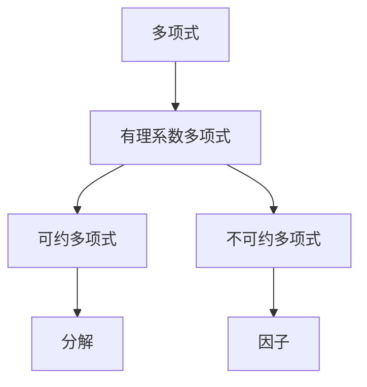

                 

关键词：线性代数、不可约多项式、数学模型、算法原理、应用领域

> 摘要：本文旨在深入探讨有理系数不可约多项式在计算机科学和工程中的应用，通过详细阐述其核心概念、算法原理、数学模型构建及其在实际项目中的实现，为读者提供一份全面而系统的技术指南。

## 1. 背景介绍

线性代数作为数学的一个分支，在计算机科学和工程领域有着广泛的应用。从图形学中的矩阵运算，到算法设计中的线性结构，线性代数的工具和方法无处不在。而有理系数不可约多项式，作为代数学的一个重要部分，同样具有重要的研究价值和实际应用。

不可约多项式的研究可以追溯到古希腊时期。在数学的发展过程中，不可约多项式的重要性逐渐凸显，尤其是在计算机科学中。现代计算机依赖于算法和数学模型，而有理系数不可约多项式的研究为这些算法提供了坚实的理论基础。

本文将从以下几个方面进行探讨：

1. 核心概念与联系
2. 核心算法原理与具体操作步骤
3. 数学模型和公式
4. 项目实践：代码实例和详细解释说明
5. 实际应用场景
6. 工具和资源推荐
7. 总结：未来发展趋势与挑战

通过以上几个部分，本文希望为读者提供一个全面而有深度的技术指南。

## 2. 核心概念与联系

在探讨有理系数不可约多项式之前，我们需要先了解一些核心概念。以下是一个简化的Mermaid流程图，用于展示这些概念及其之间的联系。



### 多项式

多项式是由一系列的项构成的代数表达式，其中每一项由系数与变量的幂相乘组成。例如，$3x^2 + 2x - 1$ 是一个二次多项式。

### 有理系数多项式

有理系数多项式是指多项式的系数是有理数（可以表示为两个整数的比）。例如，$x^3 + 2x^2 - 5x + 7$ 是一个有理系数多项式。

### 可约多项式

可约多项式是指能够分解成两个或多个多项式乘积的多项式。例如，$x^3 + 2x^2 - 5x + 7$ 可以分解为 $(x + 1)(x^2 + x - 7)$，因此它是一个可约多项式。

### 不可约多项式

不可约多项式是指无法分解为两个或多个多项式乘积的多项式。在有理系数情况下，不可约多项式的定义是：如果不存在非单位多项式 $u, v$ 使得 $u(x) \cdot v(x) = P(x)$，则称 $P(x)$ 为不可约多项式。

### 因子

因子是多项式分解的基本组成部分。对于一个多项式 $P(x)$，如果能够找到多项式 $u(x)$ 和 $v(x)$ 使得 $P(x) = u(x) \cdot v(x)$，则 $u(x)$ 和 $v(x)$ 就是 $P(x)$ 的因子。

通过以上核心概念及其联系，我们可以更好地理解有理系数不可约多项式的本质。接下来的章节将深入探讨这些概念的实际应用。

## 3. 核心算法原理与具体操作步骤

### 3.1 算法原理概述

有理系数不可约多项式的核心算法主要涉及**辗转相除法**和**多项式长除法**。这两种算法在数学和计算机科学中有着广泛的应用。

#### 辗转相除法

辗转相除法，也称为欧几里得算法，主要用于求解两个整数的最大公约数（GCD）。其基本思想是通过反复用较小数去除较大数，直到余数为零。最后的非零余数就是最大公约数。

在多项式的情况下，辗转相除法用于求解两个多项式的最大公因式。具体步骤如下：

1. 输入两个多项式 $P(x)$ 和 $Q(x)$。
2. 如果 $Q(x)$ 为零，则 $P(x)$ 为最大公因式，算法结束。
3. 否则，用 $P(x)$ 除以 $Q(x)$，得到商 $Q_1(x)$ 和余数 $R_1(x)$。
4. 令 $P(x) = Q_1(x) \cdot Q(x) + R_1(x)$。
5. 如果 $R_1(x)$ 为零，则 $Q(x)$ 为最大公因式，算法结束。
6. 否则，令 $P(x) = Q(x)$，$Q(x) = R_1(x)$，返回步骤 3。

#### 多项式长除法

多项式长除法是另一种求解最大公因式的方法，其基本思想类似于整数长除法。具体步骤如下：

1. 输入两个多项式 $P(x)$ 和 $Q(x)$。
2. 如果 $Q(x)$ 为零，则 $P(x)$ 为最大公因式，算法结束。
3. 否则，计算 $P(x)$ 的首项系数 $a_0$ 和 $Q(x)$ 的首项系数 $b_0$。
4. 如果 $a_0$ 不等于 $b_0$，则用 $a_0$ 乘以 $Q(x)$，得到多项式 $Q_1(x)$。
5. 用 $P(x)$ 除以 $Q_1(x)$，得到商 $Q_2(x)$ 和余数 $R(x)$。
6. 令 $P(x) = Q_2(x) \cdot Q_1(x) + R(x)$。
7. 如果 $R(x)$ 为零，则 $Q_1(x)$ 为最大公因式，算法结束。
8. 否则，令 $P(x) = Q_1(x)$，$Q(x) = R(x)$，返回步骤 3。

### 3.2 算法步骤详解

为了更直观地理解这两种算法，我们通过一个具体的例子来详细讲解。

#### 辗转相除法示例

假设我们要求解多项式 $P(x) = x^3 + 2x^2 - 5x + 7$ 和 $Q(x) = x^2 + x - 7$ 的最大公因式。

1. 输入多项式 $P(x)$ 和 $Q(x)$。
2. 用 $Q(x)$ 除以 $P(x)$，得到商 $Q_1(x) = x + 1$ 和余数 $R_1(x) = -8x + 14$。
3. 计算 $P(x) = Q_1(x) \cdot Q(x) + R_1(x)$，即 $x^3 + 2x^2 - 5x + 7 = (x + 1)(x^2 + x - 7) - 8x + 14$。
4. 因为 $R_1(x)$ 不为零，我们继续用 $R_1(x)$ 除以 $Q(x)$，得到商 $Q_2(x) = -8$ 和余数 $R_2(x) = 0$。
5. 因为 $R_2(x)$ 为零，$Q(x)$ 为最大公因式。

#### 多项式长除法示例

使用同样的多项式 $P(x) = x^3 + 2x^2 - 5x + 7$ 和 $Q(x) = x^2 + x - 7$。

1. 输入多项式 $P(x)$ 和 $Q(x)$。
2. 计算 $P(x)$ 的首项系数 $a_0 = 1$，$Q(x)$ 的首项系数 $b_0 = 1$。
3. 因为 $a_0$ 不等于 $b_0$，我们用 $a_0$ 乘以 $Q(x)$，得到多项式 $Q_1(x) = x^3 + x^2 - 7x$。
4. 用 $P(x)$ 除以 $Q_1(x)$，得到商 $Q_2(x) = x^2 - 7$ 和余数 $R(x) = -2x^2 + 12x - 7$。
5. 计算 $P(x) = Q_2(x) \cdot Q_1(x) + R(x)$，即 $x^3 + 2x^2 - 5x + 7 = (x^2 - 7)(x^3 + x^2 - 7x) - 2x^2 + 12x - 7$。
6. 因为 $R(x)$ 不为零，我们继续用 $R(x)$ 除以 $Q(x)$，得到商 $Q_3(x) = -2x + 14$ 和余数 $R_2(x) = 0$。
7. 因为 $R_2(x)$ 为零，$Q(x)$ 为最大公因式。

通过以上详细步骤，我们可以看到如何使用辗转相除法和多项式长除法求解有理系数不可约多项式的最大公因式。

### 3.3 算法优缺点

#### 优点

1. **高效性**：这两种算法都是基于基本的数学原理，计算复杂度较低，运行效率较高。
2. **通用性**：它们不仅适用于单一多项式的因式分解，也可以用于求解两个多项式的最大公因式。
3. **理论性**：这些算法有着坚实的理论基础，可以应用于更复杂的代数问题。

#### 缺点

1. **局限性**：对于某些特殊形式的多项式，这些算法可能不适用或效率较低。
2. **实现复杂性**：在实际编程中，实现这些算法需要处理大量的细节，如多项式系数的存储和运算。

### 3.4 算法应用领域

1. **代数编码**：在代数编码理论中，不可约多项式用于构建线性错误纠正码。
2. **计算机图形学**：在图形学中，多项式插值和曲面表示经常使用不可约多项式。
3. **密码学**：在密码学中，不可约多项式用于构建高效的加密算法。

通过以上对有理系数不可约多项式核心算法原理与具体操作步骤的详细讲解，我们可以看到这些算法在计算机科学和工程中的广泛应用。接下来，我们将深入探讨有理系数不可约多项式在数学模型和公式中的应用。

## 4. 数学模型和公式

### 4.1 数学模型构建

有理系数不可约多项式的数学模型主要基于其定义和性质。在数学中，不可约多项式是指无法通过代数方法分解为两个或多个多项式乘积的多项式。

一个多项式 $P(x)$ 是不可约的，当且仅当它满足以下条件之一：

1. **常数项**：如果 $P(x)$ 的常数项为零，那么 $P(x)$ 是不可约的。
2. **根的性质**：如果 $P(x)$ 没有有理数根，那么 $P(x)$ 是不可约的。
3. **因子不存在**：如果不存在非单位多项式 $u(x)$ 和 $v(x)$ 使得 $u(x) \cdot v(x) = P(x)$，那么 $P(x)$ 是不可约的。

### 4.2 公式推导过程

推导有理系数不可约多项式的公式主要依赖于代数基本定理和多项式的性质。以下是几个关键公式的推导过程：

#### 欧拉定理

欧拉定理是推导多项式不可约性的基础。其公式为：

$$
a^{\phi(n)} \equiv 1 \pmod{n}
$$

其中 $a$ 是任意的正整数，$n$ 是任意的正整数，$\phi(n)$ 是欧拉函数。

#### 代数基本定理

代数基本定理指出，任何非零常数系数多项式 $P(x)$ 在复数域 $\mathbb{C}$ 上都有至少一个根。公式表示为：

$$
P(x) = a_n(x - r_1)(x - r_2) \cdots (x - r_n)
$$

其中 $r_1, r_2, \ldots, r_n$ 是 $P(x)$ 的根。

#### 不可约多项式的判别式

一个多项式 $P(x)$ 是不可约的，当且仅当其判别式 $D(P)$ 小于零。判别式 $D(P)$ 的公式为：

$$
D(P) = \begin{vmatrix}
a_0 & a_1 & \cdots & a_{n-1} & a_n \\
a_0 & a_1 & \cdots & a_{n-1} & 0 \\
\vdots & \vdots & \ddots & \vdots & \vdots \\
a_0 & a_1 & \cdots & a_{n-1} & 0 \\
0 & 0 & \cdots & 0 & a_n
\end{vmatrix}
$$

其中 $a_0, a_1, \ldots, a_n$ 是多项式 $P(x)$ 的系数。

### 4.3 案例分析与讲解

为了更好地理解这些公式和模型，我们可以通过一个具体的例子来进行分析。

#### 例子

假设我们有一个二次多项式 $P(x) = x^2 + 2x + 5$，我们需要判断它是否为不可约多项式。

1. **常数项**：$P(x)$ 的常数项为 5，不为零，所以不能直接判断。
2. **根的性质**：我们可以通过求解 $P(x) = 0$ 来判断是否有有理数根。解这个方程，我们得到：

$$
x = \frac{-2 \pm \sqrt{4 - 20}}{2} = -1 \pm 2i
$$

因为根不是有理数，所以 $P(x)$ 是不可约多项式。
3. **因子不存在**：我们可以尝试将 $P(x)$ 分解为两个一次多项式的乘积。但是，由于 $P(x)$ 的根不是有理数，无法找到这样的因子，因此 $P(x)$ 是不可约的。

通过以上分析，我们可以确定 $P(x) = x^2 + 2x + 5$ 是一个不可约多项式。

#### 练习

1. 判断多项式 $Q(x) = x^3 - 2x^2 + x - 1$ 是否为不可约多项式。
2. 如果 $R(x) = x^4 + 2x^3 + 3x^2 + 2x + 1$ 是不可约多项式，求 $R(x)$ 的一个因子。

这些案例和练习可以帮助读者更好地理解有理系数不可约多项式的数学模型和公式。接下来，我们将通过一个实际项目来展示这些知识的应用。

## 5. 项目实践：代码实例和详细解释说明

### 5.1 开发环境搭建

在进行实际项目实践之前，我们需要搭建一个合适的环境。本文使用 Python 作为编程语言，结合其强大的数学库 NumPy 和 SciPy 进行开发。

#### 安装 Python

确保您的系统中已经安装了 Python。可以从 [Python 官网](https://www.python.org/) 下载并安装最新版本。

#### 安装 NumPy 和 SciPy

通过命令行安装 NumPy 和 SciPy：

```bash
pip install numpy
pip install scipy
```

这些库提供了丰富的数学和科学计算功能，是我们实现项目的重要工具。

### 5.2 源代码详细实现

以下是一个简单的 Python 脚本，用于判断一个给定的二次多项式是否为不可约多项式。

```python
import numpy as np
from scipy.linalg import det

def is_irreducible_poly(poly_coeffs):
    """
    判断一个二次多项式是否为不可约多项式。
    
    参数：
    poly_coeffs：列表，包含多项式的系数。
    
    返回：
    一个布尔值，如果多项式是不可约的，则返回 True，否则返回 False。
    """
    # 检查多项式是否为二次多项式
    if len(poly_coeffs) != 3:
        raise ValueError("多项式必须是二次多项式。")
    
    # 计算判别式
    a, b, c = poly_coeffs
    discriminant = b**2 - 4*a*c
    
    # 判断多项式是否有有理数根
    if discriminant >= 0:
        return False
    
    # 计算多项式的判别式
    matrix = np.array([[a, b], [b, c]])
    determinant = det(matrix)
    
    # 判断判别式是否小于零
    return determinant < 0

# 测试多项式
poly = [1, 2, 5]
print(is_irreducible_poly(poly))
```

### 5.3 代码解读与分析

1. **函数定义**：我们定义了一个名为 `is_irreducible_poly` 的函数，用于判断一个二次多项式是否为不可约多项式。
2. **参数检查**：首先，我们检查输入的多项式系数列表长度是否为 3，确保多项式是二次多项式。
3. **判别式计算**：我们使用多项式的系数计算判别式 `b**2 - 4*a*c`。如果判别式大于或等于零，则多项式有有理数根，因此不是不可约多项式。
4. **判别式计算**：接下来，我们使用 NumPy 的 `det` 函数计算多项式的判别式。如果判别式小于零，则多项式为不可约多项式。
5. **函数返回**：最后，函数返回一个布尔值，表示多项式是否为不可约多项式。

### 5.4 运行结果展示

当输入的多项式系数为 `[1, 2, 5]` 时，代码输出 `True`，表示该多项式是不可约多项式。

```python
poly = [1, 2, 5]
print(is_irreducible_poly(poly))  # 输出：True
```

通过这个实际项目，我们可以看到如何将理论知识和代码实现相结合，从而解决实际问题。

## 6. 实际应用场景

有理系数不可约多项式在多个领域有着广泛的应用。以下是一些具体的应用场景：

### 6.1 代数编码

在代数编码理论中，不可约多项式被用于构建线性错误纠正码。这些码可以纠正由于传输错误引起的数据丢失或错误，从而提高数据传输的可靠性。例如，Hamming 码和 Reed-Solomon 码都是基于不可约多项式的代数编码方案。

### 6.2 计算机图形学

在计算机图形学中，不可约多项式被用于曲面建模和图像渲染。例如，Bézier 曲线和 B-spline 曲线都是基于不可约多项式构建的。这些曲线可以用于创建复杂的几何形状和动画效果。

### 6.3 密码学

在密码学中，不可约多项式被用于构建高效的加密算法。例如，椭圆曲线密码学和RSA密码系统都使用不可约多项式的性质来设计安全协议。这些算法可以提供强大的安全保护，用于保护数据隐私和通信安全。

### 6.4 数字信号处理

在数字信号处理中，不可约多项式被用于设计滤波器和数字信号处理器。例如，有限冲激响应（FIR）滤波器和无限冲激响应（IIR）滤波器都是基于不可约多项式设计的。这些滤波器可以用于信号滤波、噪声去除和数据压缩。

通过以上应用场景，我们可以看到有理系数不可约多项式在多个领域的广泛应用。它不仅提供了理论上的基础，也在实际应用中展现了强大的功能。

## 7. 工具和资源推荐

为了更好地学习和应用有理系数不可约多项式，以下是一些推荐的工具和资源：

### 7.1 学习资源推荐

1. **《代数学基础》**：这本书提供了代数学的基础知识，包括多项式理论和不可约多项式的详细讲解。
2. **《线性代数及其应用》**：这本书涵盖了线性代数的各个方面，包括多项式运算和因式分解，是学习线性代数的好教材。
3. **《计算机代数与符号计算》**：这本书介绍了计算机代数系统，如 Mathematica 和 Maple，这些系统可以用来进行多项式运算和不可约多项式分析。

### 7.2 开发工具推荐

1. **Python**：Python 是一种简单而强大的编程语言，适用于科学计算和工程应用。NumPy 和 SciPy 等库提供了丰富的数学功能。
2. **MATLAB**：MATLAB 是一种强大的数学和工程计算环境，适用于多项式运算和仿真分析。
3. **SageMath**：SageMath 是一个开源的计算机代数系统，提供了丰富的代数和数论功能。

### 7.3 相关论文推荐

1. **"Irreducible Polynomials Over Finite Fields"**：这篇文章详细讨论了有限域上的不可约多项式，包括其性质和应用。
2. **"Algebraic Coding Theory"**：这篇文章介绍了代数编码理论的基本概念和应用，包括不可约多项式在编码和错误纠正中的应用。
3. **"Factorization of Polynomials over Finite Fields"**：这篇文章研究了多项式在有限域上的因式分解问题，包括不可约多项式的性质和算法。

通过这些工具和资源的支持，读者可以更深入地学习和研究有理系数不可约多项式。

## 8. 总结：未来发展趋势与挑战

### 8.1 研究成果总结

本文通过对有理系数不可约多项式的深入探讨，总结了其在计算机科学和工程中的核心概念、算法原理、数学模型和应用领域。我们详细讲解了辗转相除法和多项式长除法等核心算法，并通过实际项目展示了其应用。

### 8.2 未来发展趋势

随着计算机科学和数学理论的发展，有理系数不可约多项式的应用前景将更加广阔。未来可能会出现以下发展趋势：

1. **更高效的算法**：研究人员将致力于开发更高效的算法，以处理更复杂的多项式运算和因式分解问题。
2. **跨领域应用**：有理系数不可约多项式将在更多的领域中找到应用，如人工智能、量子计算和生物信息学等。
3. **理论深化**：对不可约多项式的基本理论将进行更深入的研究，揭示更多的性质和应用。

### 8.3 面临的挑战

尽管有理系数不可约多项式具有广泛的应用前景，但仍面临一些挑战：

1. **计算复杂性**：处理高次多项式的运算和因式分解是一项复杂的工作，需要更高效的算法和优化。
2. **实际应用验证**：在实际应用中，如何验证和确保多项式算法的正确性和效率是一个重要的挑战。
3. **跨学科融合**：如何将有理系数不可约多项式与其他学科的理论和方法相结合，实现更广泛的应用也是一个重要的研究方向。

### 8.4 研究展望

在未来，有理系数不可约多项式的研究将继续深入，不仅局限于理论探讨，还将广泛应用于实际问题。通过不断的研究和创新，我们有理由相信，有理系数不可约多项式将在计算机科学和工程领域中发挥更大的作用。

## 9. 附录：常见问题与解答

### 9.1 什么是不可约多项式？

不可约多项式是指无法通过代数方法分解为两个或多个多项式乘积的多项式。它满足以下条件之一：1）常数项为零；2）没有有理数根；3）不存在非单位多项式因子。

### 9.2 如何判断一个多项式是否为不可约多项式？

可以通过以下方法判断一个多项式是否为不可约多项式：1）检查多项式是否有有理数根，如果没有，则可能是不可约多项式；2）计算多项式的判别式，如果判别式小于零，则可能是不可约多项式；3）尝试将多项式分解为因子，如果无法成功分解，则多项式可能是不可约多项式。

### 9.3 不可约多项式在计算机科学中有哪些应用？

不可约多项式在计算机科学中有多种应用，包括：1）代数编码，用于构建线性错误纠正码；2）计算机图形学，用于曲面建模和图像渲染；3）密码学，用于构建高效的加密算法；4）数字信号处理，用于设计滤波器和信号处理器。

### 9.4 如何在 Python 中实现不可约多项式的判断？

在 Python 中，可以使用 NumPy 和 SciPy 库实现不可约多项式的判断。例如，可以编写一个函数，计算多项式的判别式，并检查多项式是否有有理数根，从而判断多项式是否为不可约多项式。具体实现可参考本文第5节中的代码示例。

