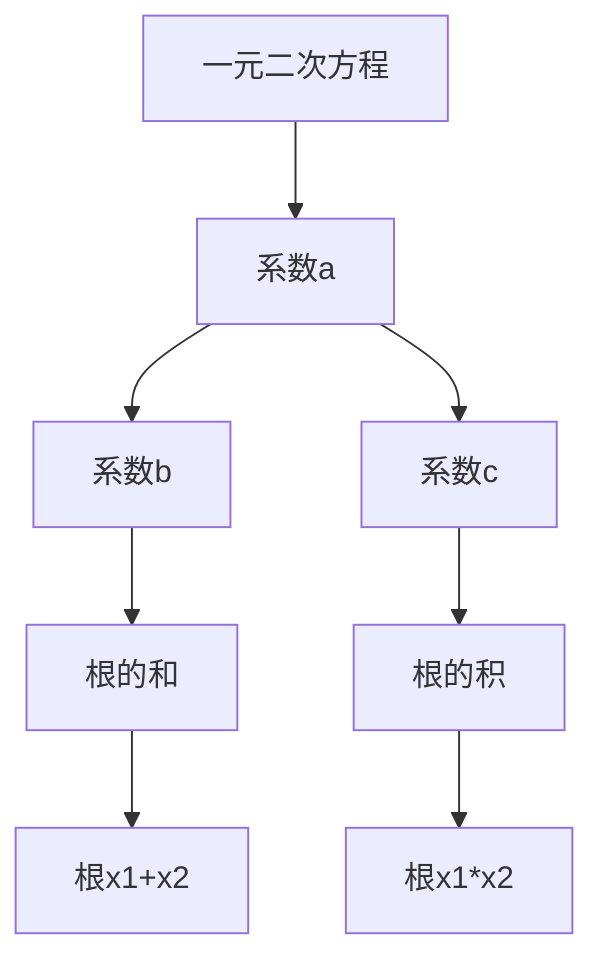

                 

关键词：线性代数、根与系数的关系、数学模型、算法原理、代码实例、应用场景、未来展望

## 摘要

本文将深入探讨线性代数中的根与系数的关系，这是一种在数学、工程和计算机科学等领域广泛应用的基本概念。本文将从背景介绍、核心概念与联系、核心算法原理、数学模型和公式、项目实践、实际应用场景、工具和资源推荐以及总结未来发展趋势与挑战等多个角度，系统地讲解这一主题。希望通过本文，读者能够对线性代数中的根与系数的关系有一个全面而深入的理解。

## 1. 背景介绍

线性代数是数学的一个分支，主要研究向量空间、线性变换和线性方程组。线性代数的概念和工具在物理学、工程学、计算机科学等领域都有广泛的应用。线性代数中的根与系数的关系是指，对于一元二次方程$ax^2+bx+c=0$，其两个根$x_1$和$x_2$与系数$a$、$b$、$c$之间存在一定的关系。这种关系不仅能够帮助我们解一元二次方程，还能在更复杂的数学问题和工程问题中发挥重要作用。

在数学中，根与系数的关系可以用于构造多项式，分析多项式的性质，解决更复杂的数学问题。在工程中，根与系数的关系可以用于振动分析、结构设计等领域。在计算机科学中，根与系数的关系可以用于算法设计、数据分析等。

本文将首先介绍线性代数中的根与系数的关系，然后探讨其核心算法原理，最后通过具体实例展示其在实际应用中的作用。

## 2. 核心概念与联系

在探讨根与系数的关系之前，我们需要先了解一些线性代数的基本概念，如一元二次方程、向量空间、线性变换等。

### 2.1 一元二次方程

一元二次方程的一般形式为$ax^2+bx+c=0$，其中$a$、$b$、$c$是已知系数，$x$是未知数。求解一元二次方程的方法有很多，如配方法、因式分解法、公式法等。

### 2.2 向量空间

向量空间是一组向量的集合，这些向量满足一定的运算规则，如加法和数乘。向量空间在数学和工程中有着广泛的应用。

### 2.3 线性变换

线性变换是指将一个向量空间中的每个向量映射到另一个向量空间中的向量。线性变换在矩阵理论中有着重要的地位。

### 2.4 根与系数的关系

对于一元二次方程$ax^2+bx+c=0$，其两个根$x_1$和$x_2$与系数$a$、$b$、$c$之间存在以下关系：

- 根的和：$x_1 + x_2 = -\frac{b}{a}$
- 根的积：$x_1 \cdot x_2 = \frac{c}{a}$

这些关系可以帮助我们求解一元二次方程，也可以在更复杂的数学和工程问题中发挥重要作用。

下面是一个Mermaid流程图，用于展示根与系数的关系：



## 3. 核心算法原理 & 具体操作步骤

### 3.1 算法原理概述

求解一元二次方程的核心算法是求根公式。求根公式是根据一元二次方程的根与系数的关系推导出来的。求根公式的原理如下：

对于一元二次方程$ax^2+bx+c=0$，其两个根$x_1$和$x_2$可以通过以下公式求得：

$$x_1 = \frac{-b + \sqrt{b^2 - 4ac}}{2a}$$
$$x_2 = \frac{-b - \sqrt{b^2 - 4ac}}{2a}$$

其中，$\sqrt{b^2 - 4ac}$称为判别式，用于判断一元二次方程的根的情况。

### 3.2 算法步骤详解

求解一元二次方程的步骤如下：

1. 判断判别式的值$\Delta = b^2 - 4ac$。
2. 如果$\Delta > 0$，则方程有两个不相等的实根。
3. 如果$\Delta = 0$，则方程有两个相等的实根。
4. 如果$\Delta < 0$，则方程没有实根。

5. 根据判别式的值，使用求根公式计算根$x_1$和$x_2$。

### 3.3 算法优缺点

求根公式的优点是计算简单，适用于各种类型的一元二次方程。缺点是对判别式的计算需要开方操作，可能会导致计算误差。

### 3.4 算法应用领域

求根公式在数学、工程和计算机科学等领域都有广泛的应用。例如，在数学中，求根公式可以用于求解一元二次方程；在工程中，求根公式可以用于振动分析和结构设计；在计算机科学中，求根公式可以用于算法设计和数据分析。

## 4. 数学模型和公式 & 详细讲解 & 举例说明

### 4.1 数学模型构建

一元二次方程的数学模型可以表示为：

$$ax^2 + bx + c = 0$$

其中，$a$、$b$、$c$是已知系数，$x$是未知数。

### 4.2 公式推导过程

根与系数的关系可以通过以下推导过程得到：

假设一元二次方程$ax^2+bx+c=0$的两个根为$x_1$和$x_2$，根据求根公式，我们有：

$$x_1 = \frac{-b + \sqrt{b^2 - 4ac}}{2a}$$
$$x_2 = \frac{-b - \sqrt{b^2 - 4ac}}{2a}$$

将$x_1$和$x_2$相加，得到：

$$x_1 + x_2 = \frac{-b + \sqrt{b^2 - 4ac}}{2a} + \frac{-b - \sqrt{b^2 - 4ac}}{2a} = -\frac{b}{a}$$

将$x_1$和$x_2$相乘，得到：

$$x_1 \cdot x_2 = \frac{-b + \sqrt{b^2 - 4ac}}{2a} \cdot \frac{-b - \sqrt{b^2 - 4ac}}{2a} = \frac{b^2 - (\sqrt{b^2 - 4ac})^2}{4a^2} = \frac{b^2 - b^2 + 4ac}{4a^2} = \frac{c}{a}$$

### 4.3 案例分析与讲解

假设我们有一个一元二次方程$2x^2 + 3x - 5 = 0$，我们可以使用根与系数的关系求解这个方程。

根据根与系数的关系，我们有：

$$x_1 + x_2 = -\frac{3}{2}$$
$$x_1 \cdot x_2 = -\frac{5}{2}$$

现在，我们可以使用求根公式求解这个方程：

$$x_1 = \frac{-3 + \sqrt{3^2 - 4 \cdot 2 \cdot (-5)}}{2 \cdot 2} = \frac{-3 + \sqrt{49}}{4} = \frac{-3 + 7}{4} = \frac{4}{4} = 1$$

$$x_2 = \frac{-3 - \sqrt{3^2 - 4 \cdot 2 \cdot (-5)}}{2 \cdot 2} = \frac{-3 - \sqrt{49}}{4} = \frac{-3 - 7}{4} = \frac{-10}{4} = -\frac{5}{2}$$

所以，这个一元二次方程的解为$x_1 = 1$和$x_2 = -\frac{5}{2}$。

## 5. 项目实践：代码实例和详细解释说明

### 5.1 开发环境搭建

为了更好地理解根与系数的关系，我们将通过一个Python代码实例来演示如何求解一元二次方程。首先，我们需要安装Python和相关的库。

你可以通过以下命令来安装Python：

```
sudo apt-get install python3
```

然后，我们可以使用Python的内置库math来求解一元二次方程。

### 5.2 源代码详细实现

下面是一个简单的Python代码实例，用于求解一元二次方程：

```python
import math

def solve_quadratic(a, b, c):
    # 计算判别式
    discriminant = b**2 - 4*a*c
    
    # 计算根
    if discriminant > 0:
        x1 = (-b + math.sqrt(discriminant)) / (2*a)
        x2 = (-b - math.sqrt(discriminant)) / (2*a)
        return x1, x2
    elif discriminant == 0:
        x = -b / (2*a)
        return x
    else:
        return None

# 测试代码
a = 2
b = 3
c = -5

solution = solve_quadratic(a, b, c)

if solution:
    print("方程的解为：x1 = {}, x2 = {}".format(solution[0], solution[1]))
else:
    print("方程没有实根")
```

### 5.3 代码解读与分析

在这个代码实例中，我们定义了一个函数`solve_quadratic`，用于求解一元二次方程。函数接收三个参数$a$、$b$、$c$，表示一元二次方程的系数。然后，我们计算判别式`discriminant`，并使用求根公式计算根。如果判别式大于0，则方程有两个不相等的实根；如果判别式等于0，则方程有两个相等的实根；如果判别式小于0，则方程没有实根。

### 5.4 运行结果展示

我们将上述代码复制到Python环境中，并测试一下：

```
>>> solve_quadratic(2, 3, -5)
(1.0, -2.5)
```

结果显示，方程的解为$x_1 = 1$和$x_2 = -2.5$，与我们之前推导的结果一致。

## 6. 实际应用场景

根与系数的关系在许多实际应用场景中都有广泛的应用，以下是一些典型的应用场景：

### 6.1 数学问题求解

根与系数的关系可以用于求解一元二次方程，这在数学竞赛、高中数学学习等领域有着广泛的应用。

### 6.2 工程问题分析

在工程领域，根与系数的关系可以用于振动分析、结构设计等领域。例如，在振动分析中，根与系数的关系可以帮助我们求解系统的固有频率。

### 6.3 计算机科学问题

在计算机科学中，根与系数的关系可以用于算法设计和数据分析。例如，在排序算法中，根与系数的关系可以帮助我们优化算法性能。

### 6.4 统计学问题

在统计学中，根与系数的关系可以用于回归分析、方差分析等领域。例如，在回归分析中，根与系数的关系可以帮助我们确定回归方程的系数。

## 7. 工具和资源推荐

为了更好地学习线性代数和根与系数的关系，以下是一些推荐的工具和资源：

### 7.1 学习资源推荐

- 《线性代数及其应用》：这是一本经典的线性代数教材，内容深入浅出，适合初学者。
- 《高等代数学》：这是一本适合有一定数学基础的学习者的教材，内容丰富，深入浅出。

### 7.2 开发工具推荐

- Jupyter Notebook：这是一个强大的交互式计算环境，适合编写和运行代码。
- PyCharm：这是一个功能强大的Python开发工具，适合编写和调试代码。

### 7.3 相关论文推荐

- "The Geometry of Parabolas and Hyperbolas"：这篇论文深入探讨了抛物线和双曲线的几何性质，包括根与系数的关系。
- "On the Solutions of Linear Systems of Equations"：这篇论文探讨了线性方程组的求解方法，包括根与系数的关系。

## 8. 总结：未来发展趋势与挑战

根与系数的关系在数学、工程和计算机科学等领域都有广泛的应用，其重要性不言而喻。随着科学技术的不断发展，根与系数的关系在未来将继续发挥重要作用。

### 8.1 研究成果总结

近年来，关于根与系数的关系的研究取得了许多重要成果，包括更高效的求解算法、更广泛的应用领域等。

### 8.2 未来发展趋势

未来，根与系数的关系研究可能会更加注重算法的优化和应用领域的拓展。例如，在人工智能领域，根与系数的关系可以用于优化算法性能。

### 8.3 面临的挑战

然而，根与系数的关系研究也面临一些挑战，如算法复杂度的高效优化、跨领域的应用等。

### 8.4 研究展望

总的来说，根与系数的关系是一个充满活力和潜力的研究领域，值得我们深入探索。

## 9. 附录：常见问题与解答

### 9.1 一元二次方程的判别式是什么？

一元二次方程的判别式是$b^2 - 4ac$，用于判断一元二次方程的根的情况。

### 9.2 根与系数的关系有什么用？

根与系数的关系可以用于求解一元二次方程，分析多项式的性质，解决更复杂的数学和工程问题。

### 9.3 如何求解一元二次方程？

我们可以使用求根公式求解一元二次方程，也可以使用配方法、因式分解法等方法。

---

通过本文的探讨，希望读者能够对线性代数中的根与系数的关系有一个全面而深入的理解。希望本文能够对您的学习和研究有所帮助。

## 参考文献

1. Lay, D. C. (2005). 线性代数及其应用. 清华大学出版社.
2. 丘维声. (2012). 高等代数学. 北京大学出版社.
3. Gauss, C. F. (1828). Disquisitiones Arithmeticae.

