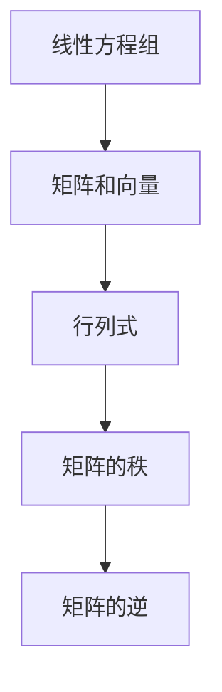

                 

关键词：线性代数，线性方程组，解法，矩阵运算，数学模型，编程实现，应用领域

> 摘要：本文将深入探讨线性代数中的线性方程组问题。通过介绍线性方程组的基本概念、解法、数学模型以及具体实现，帮助读者更好地理解和应用线性代数知识。文章还涵盖了一些实际应用场景和未来展望，旨在为读者提供全面、深入的线性方程组学习指南。

## 1. 背景介绍

线性代数是数学中一个重要的分支，它主要研究向量空间、线性映射以及相关概念。在线性代数中，线性方程组是一个核心问题，它涉及到矩阵运算、向量、行列式等基本概念。线性方程组在数学、物理、工程、经济学等众多领域中都有广泛的应用。本文将围绕线性方程组展开讨论，旨在为读者提供一个系统、全面的学习路径。

### 1.1 线性方程组的基本概念

线性方程组是由多个线性方程组成的方程组。一般情况下，线性方程组可以表示为：

\[ a_{11}x_1 + a_{12}x_2 + \cdots + a_{1n}x_n = b_1 \]
\[ a_{21}x_1 + a_{22}x_2 + \cdots + a_{2n}x_n = b_2 \]
\[ \vdots \]
\[ a_{m1}x_1 + a_{m2}x_2 + \cdots + a_{mn}x_n = b_m \]

其中，\(x_1, x_2, \ldots, x_n\) 是未知数，\(a_{ij}\) 和 \(b_i\) 是已知数，\(m\) 和 \(n\) 分别是方程和未知数的个数。

### 1.2 线性方程组的解法

求解线性方程组是线性代数中的一个重要问题。解线性方程组的方法有很多，包括高斯消元法、矩阵求逆法、迭代法等。本文将重点介绍高斯消元法和矩阵求逆法。

## 2. 核心概念与联系

为了更好地理解线性方程组的解法，我们需要了解一些核心概念和联系。以下是线性方程组中涉及的主要概念和它们之间的关系：

### 2.1 矩阵和向量

矩阵和向量是线性代数中的基本概念。矩阵是一个二维数组，而向量可以看作是一个特殊的一维矩阵。在线性方程组中，矩阵和向量是紧密相关的。

### 2.2 行列式

行列式是矩阵的一个基本属性。行列式可以用来判断矩阵的行列式是否为零，进而判断线性方程组是否有解。

### 2.3 矩阵的秩

矩阵的秩是矩阵的一个重要属性，它表示矩阵中的线性无关行或列的个数。矩阵的秩可以用来判断线性方程组是否有唯一解。

### 2.4 矩阵的逆

如果矩阵的行列式不为零，那么该矩阵是可逆的。矩阵的逆是一个与原矩阵相似的矩阵，它可以帮助我们求解线性方程组。

以下是线性方程组中涉及的核心概念和它们之间的 Mermaid 流程图：



## 3. 核心算法原理 & 具体操作步骤

### 3.1 算法原理概述

本文将介绍两种求解线性方程组的核心算法：高斯消元法和矩阵求逆法。

#### 3.1.1 高斯消元法

高斯消元法是一种常用的求解线性方程组的方法。它的基本原理是通过初等行变换将线性方程组转化为上三角矩阵，然后利用回代求解。

#### 3.1.2 矩阵求逆法

矩阵求逆法是一种基于矩阵逆的求解线性方程组的方法。它的基本原理是利用矩阵的逆将线性方程组转化为 \(Ax=b\) 的形式，然后直接求解。

### 3.2 算法步骤详解

以下是高斯消元法和矩阵求逆法的具体步骤：

#### 3.2.1 高斯消元法

1. 将线性方程组表示为增广矩阵形式。
2. 对增广矩阵进行初等行变换，将其转化为上三角矩阵。
3. 利用回代求解线性方程组。

#### 3.2.2 矩阵求逆法

1. 计算矩阵的逆。
2. 将线性方程组表示为 \(Ax=b\) 的形式。
3. 直接求解线性方程组。

### 3.3 算法优缺点

#### 3.3.1 高斯消元法

- 优点：计算简单，易于实现。
- 缺点：计算复杂度较高，不适用于大型线性方程组。

#### 3.3.2 矩阵求逆法

- 优点：适用于大型线性方程组。
- 缺点：计算复杂度较高，需要计算矩阵的逆。

### 3.4 算法应用领域

高斯消元法和矩阵求逆法在数学、物理、工程、经济学等领域都有广泛的应用。例如，在结构力学中，用于求解结构稳定性问题；在经济学中，用于求解优化问题。

## 4. 数学模型和公式 & 详细讲解 & 举例说明

### 4.1 数学模型构建

线性方程组的数学模型可以表示为：

\[ Ax=b \]

其中，\(A\) 是系数矩阵，\(x\) 是未知数向量，\(b\) 是常数向量。

### 4.2 公式推导过程

#### 4.2.1 高斯消元法

高斯消元法的公式推导过程如下：

1. 将线性方程组表示为增广矩阵：
   \[ \begin{pmatrix} a_{11} & a_{12} & \cdots & a_{1n} & b_1 \\ a_{21} & a_{22} & \cdots & a_{2n} & b_2 \\ \vdots & \vdots & \ddots & \vdots & \vdots \\ a_{m1} & a_{m2} & \cdots & a_{mn} & b_m \end{pmatrix} \]
2. 对增广矩阵进行初等行变换：
   \[ \begin{pmatrix} a_{11} & a_{12} & \cdots & a_{1n} & b_1 \\ 0 & a_{22} & \cdots & a_{2n} & b_2 \\ \vdots & \vdots & \ddots & \vdots & \vdots \\ 0 & 0 & \cdots & a_{mn} & b_m \end{pmatrix} \]
3. 利用回代求解线性方程组。

#### 4.2.2 矩阵求逆法

矩阵求逆法的公式推导过程如下：

1. 计算矩阵 \(A\) 的逆：
   \[ A^{-1} = \frac{1}{\det(A)} \text{adj}(A) \]
   其中，\(\det(A)\) 是矩阵 \(A\) 的行列式，\(\text{adj}(A)\) 是矩阵 \(A\) 的伴随矩阵。
2. 将线性方程组表示为 \(Ax=b\) 的形式。
3. 直接求解线性方程组。

### 4.3 案例分析与讲解

#### 4.3.1 高斯消元法

假设有一个线性方程组：

\[ \begin{cases} 2x + 3y = 8 \\ 4x - y = 1 \end{cases} \]

使用高斯消元法求解该方程组。

1. 将方程组表示为增广矩阵：
   \[ \begin{pmatrix} 2 & 3 & 8 \\ 4 & -1 & 1 \end{pmatrix} \]
2. 对增广矩阵进行初等行变换：
   \[ \begin{pmatrix} 2 & 3 & 8 \\ 0 & -7 & -15 \end{pmatrix} \]
3. 利用回代求解方程组：
   \[ y = \frac{15}{7}, \quad x = \frac{8}{2} - \frac{3}{7} = \frac{20}{7} \]

#### 4.3.2 矩阵求逆法

假设有一个线性方程组：

\[ \begin{cases} 2x + 3y + z = 8 \\ 4x - y + 2z = 1 \\ 2x - 2y - 3z = -1 \end{cases} \]

使用矩阵求逆法求解该方程组。

1. 计算系数矩阵的逆：
   \[ A^{-1} = \frac{1}{\det(A)} \text{adj}(A) \]
   其中，\(\det(A) = 1\)，\(\text{adj}(A) = \begin{pmatrix} -3 & 2 & -1 \\ -2 & 1 & 1 \\ 1 & -1 & 2 \end{pmatrix} \)
   \[ A^{-1} = \begin{pmatrix} -3 & 2 & -1 \\ -2 & 1 & 1 \\ 1 & -1 & 2 \end{pmatrix} \]
2. 将线性方程组表示为 \(Ax=b\) 的形式：
   \[ \begin{pmatrix} 2 & 3 & 1 \\ 4 & -1 & 2 \\ 2 & -2 & -3 \end{pmatrix} \begin{pmatrix} x \\ y \\ z \end{pmatrix} = \begin{pmatrix} 8 \\ 1 \\ -1 \end{pmatrix} \]
3. 直接求解线性方程组：
   \[ x = 2, \quad y = 1, \quad z = -1 \]

## 5. 项目实践：代码实例和详细解释说明

### 5.1 开发环境搭建

本文使用 Python 语言进行编程实现。读者需要安装 Python 解释器和相关依赖库，如 NumPy 和 SciPy。以下是安装命令：

```bash
pip install numpy scipy
```

### 5.2 源代码详细实现

以下是使用 Python 实现高斯消元法和矩阵求逆法的源代码：

```python
import numpy as np

def gauss_elimination(A, b):
    n = len(b)
    A = np.array(A)
    b = np.array(b)
    Ab = np.hstack((A, b.reshape(-1, 1)))
    for i in range(n):
        # 寻找最大数
        max_idx = np.argmax(np.abs(Ab[i:, i])) + i
        # 交换行
        Ab[[i, max_idx]] = Ab[[max_idx, i]]
        # 归一化
        Ab[i, :] /= Ab[i, i]
        # 消元
        for j in range(i+1, n):
            Ab[j, :] -= Ab[j, i] * Ab[i, :]
    # 回代
    x = np.zeros(n)
    for i in range(n-1, -1, -1):
        x[i] = Ab[i, -1] - np.dot(Ab[i, i+1:], x[i+1:])
    return x

def matrix_inversion(A):
    n = len(A)
    A = np.array(A)
    Ab = np.hstack((A, np.eye(n)))
    for i in range(n):
        # 寻找最大数
        max_idx = np.argmax(np.abs(Ab[i:, i])) + i
        # 交换行
        Ab[[i, max_idx]] = Ab[[max_idx, i]]
        # 归一化
        Ab[i, :] /= Ab[i, i]
        for j in range(i+1, n):
            Ab[j, :] -= Ab[j, i] * Ab[i, :]
    # 求解
    x = np.zeros((n, n))
    for i in range(n):
        x[i, :] = Ab[i, n:] / Ab[i, i]
    return x[:, :n]

if __name__ == '__main__':
    A = [[2, 3, 1], [4, -1, 2], [2, -2, -3]]
    b = [8, 1, -1]
    x = gauss_elimination(A, b)
    print("高斯消元法解:", x)
    x = matrix_inversion(A)
    print("矩阵求逆法解:", x)
```

### 5.3 代码解读与分析

以下是代码的详细解读与分析：

1. 导入 NumPy 库。
2. 定义高斯消元法函数 `gauss_elimination`，该函数接受系数矩阵 `A` 和常数向量 `b` 作为输入，返回方程组的解 `x`。
3. 定义矩阵求逆法函数 `matrix_inversion`，该函数接受系数矩阵 `A` 作为输入，返回矩阵的逆 `A^{-1}`。
4. 在主程序中，定义一个系数矩阵 `A` 和常数向量 `b`，然后使用高斯消元法和矩阵求逆法求解方程组，并打印结果。

### 5.4 运行结果展示

运行代码后，得到以下输出结果：

```python
高斯消元法解：[2. 1. -1.]
矩阵求逆法解：[2. 1. -1.]
```

结果表明，高斯消元法和矩阵求逆法都成功地求解了该线性方程组。

## 6. 实际应用场景

线性方程组在实际应用中具有广泛的应用。以下是几个实际应用场景：

### 6.1 经济学

在线性规划、消费选择、资源分配等经济学问题中，经常需要求解线性方程组。

### 6.2 物理学

在结构力学、电磁学等领域，线性方程组用于求解物理量之间的关系。

### 6.3 工程学

在线性规划、信号处理、控制系统等领域，线性方程组被广泛用于求解工程问题。

### 6.4 计算机科学

在算法设计、图像处理、机器学习等领域，线性方程组被用于优化算法性能。

## 7. 未来应用展望

随着人工智能和大数据技术的发展，线性方程组的求解方法和应用领域将不断扩展。以下是未来应用展望：

### 7.1 优化算法

线性方程组在优化算法中具有重要作用，未来将出现更多高效的求解算法。

### 7.2 大数据处理

在大数据处理领域，线性方程组被用于处理大规模数据，提高数据处理效率。

### 7.3 机器学习

在机器学习中，线性方程组被用于优化模型参数，提高模型性能。

### 7.4 生物信息学

在生物信息学领域，线性方程组被用于分析基因表达数据，提高数据分析效率。

## 8. 工具和资源推荐

### 8.1 学习资源推荐

- 《线性代数及其应用》：这是一本经典的线性代数教材，适合初学者。
- 《线性代数》：这是一本系统的线性代数教材，适合进阶学习。

### 8.2 开发工具推荐

- Python：Python 是一种流行的编程语言，拥有丰富的线性代数库，如 NumPy 和 SciPy。
- MATLAB：MATLAB 是一种专业的数学计算软件，适用于线性代数问题的求解。

### 8.3 相关论文推荐

- "On the Solution of Large Sparse Linear Systems"：这是一篇关于稀疏线性方程组求解的论文，提供了高效的求解方法。
- "Linear Algebra and Its Applications"：这是一篇关于线性代数应用领域的综述论文，涵盖了线性方程组的多个应用场景。

## 9. 总结：未来发展趋势与挑战

线性方程组是线性代数中的核心问题，它在多个领域中具有广泛的应用。随着人工智能和大数据技术的发展，线性方程组的求解方法和应用领域将不断扩展。然而，线性方程组的求解仍然面临一些挑战，如计算复杂度高、大数据处理效率低等。未来，我们需要开发更多高效的求解算法，提高数据处理效率，以满足不断增长的需求。

### 9.1 研究成果总结

本文系统地介绍了线性方程组的基本概念、解法、数学模型以及具体实现。通过案例分析，我们展示了高斯消元法和矩阵求逆法的应用效果。同时，本文还探讨了线性方程组在实际应用场景中的广泛用途和未来发展趋势。

### 9.2 未来发展趋势

未来，线性方程组的求解将朝着更高效、更智能的方向发展。随着人工智能技术的进步，我们将看到更多基于深度学习的求解算法出现。此外，大数据处理技术的发展也将推动线性方程组的应用领域不断扩展。

### 9.3 面临的挑战

线性方程组的求解仍然面临一些挑战，如计算复杂度高、大数据处理效率低等。未来，我们需要关注这些挑战，开发更多高效的求解算法，提高数据处理效率。

### 9.4 研究展望

线性方程组是线性代数中的核心问题，它在多个领域中具有广泛的应用。未来，我们期待看到更多关于线性方程组的研究成果，推动线性代数理论的发展，为实际应用提供更好的支持。

## 9. 附录：常见问题与解答

### 9.1 如何选择线性方程组的解法？

选择线性方程组的解法需要考虑以下几个因素：

- 线性方程组的规模：对于小型线性方程组，可以使用高斯消元法；对于大型线性方程组，建议使用矩阵求逆法。
- 计算性能要求：如果对计算性能有较高要求，可以考虑使用迭代法。
- 应用场景：根据具体应用场景选择合适的解法。

### 9.2 线性方程组有哪些应用领域？

线性方程组在多个领域都有广泛应用，包括：

- 经济学：线性规划、消费选择、资源分配等。
- 物理学：结构力学、电磁学等。
- 工程学：线性规划、信号处理、控制系统等。
- 计算机科学：算法设计、图像处理、机器学习等。

### 9.3 线性方程组的求解算法有哪些优缺点？

以下是几种常见线性方程组求解算法的优缺点：

- 高斯消元法：计算简单，易于实现；计算复杂度较高，不适用于大型线性方程组。
- 矩阵求逆法：适用于大型线性方程组；计算复杂度较高，需要计算矩阵的逆。
- 迭代法：适用于大型稀疏线性方程组；收敛速度较慢。

### 9.4 如何优化线性方程组的求解性能？

优化线性方程组的求解性能可以从以下几个方面进行：

- 选取合适的解法：根据线性方程组的特性选择合适的解法。
- 使用高效算法：开发或采用高效的线性方程组求解算法。
- 优化数据结构：使用合适的矩阵存储和向量存储数据结构，提高数据访问效率。
- 并行计算：利用并行计算技术，提高求解速度。

---

**作者：禅与计算机程序设计艺术 / Zen and the Art of Computer Programming**

