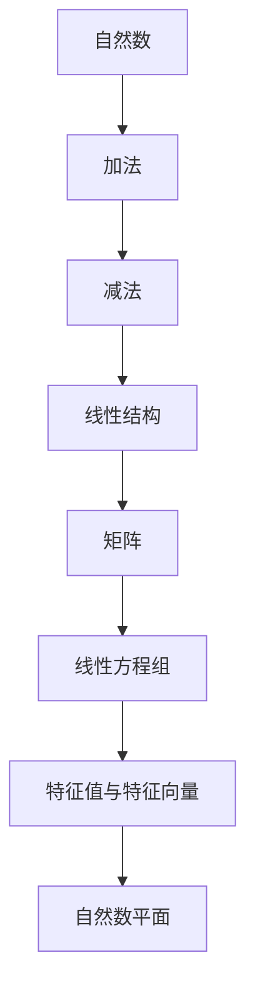

                 

关键词：线性代数，自然数平面，势，计算机程序设计，算法原理，数学模型，项目实践，应用场景

> 摘要：本文旨在深入探讨线性代数在自然数平面中的势，以及其对于计算机程序设计的影响。通过详细的数学模型构建、公式推导、算法原理讲解以及实际项目实践，本文将帮助读者更好地理解和掌握线性代数在计算机科学领域中的应用。

## 1. 背景介绍

线性代数作为数学的基础学科之一，其重要性在计算机科学中不言而喻。线性代数为计算机科学提供了强大的数学工具，尤其在数据处理、图像处理、机器学习等领域有着广泛的应用。自然数平面是线性代数中的一个重要概念，它将数学中的线性结构应用于自然数领域，为解决复杂问题提供了新的思路。

本文将重点探讨线性代数在自然数平面中的势，以及如何通过数学模型和算法原理来理解和解决相关问题。通过深入分析自然数平面的势，我们能够更好地把握线性代数的本质，从而在计算机程序设计中发挥其最大效用。

### 1.1 自然数平面的概念

自然数平面是指由自然数构成的二维平面，其中每个点表示一个自然数。在自然数平面中，两个自然数之间可以通过加法和减法进行连接，形成一条直线。这种线性结构为线性代数在自然数平面中的应用提供了基础。

### 1.2 线性代数在自然数平面中的应用

线性代数在自然数平面中的应用主要体现在以下几个方面：

1. **矩阵运算**：在自然数平面中，矩阵可以表示自然数之间的线性关系。矩阵运算如加法、乘法等，可以应用于自然数平面中的数据结构，如数组、树等。

2. **线性方程组**：线性方程组是线性代数中的一个重要概念，可以用于解决自然数平面中的许多问题。通过解线性方程组，我们可以找到满足特定条件的自然数解。

3. **特征值和特征向量**：特征值和特征向量是矩阵的重要性质，可以用于分析自然数平面的结构。通过求解特征值和特征向量，我们可以了解自然数平面中的主要趋势和分布情况。

## 2. 核心概念与联系

为了更好地理解线性代数在自然数平面中的势，我们需要先了解一些核心概念和它们之间的联系。以下是一个使用 Mermaid 流程图表示的核心概念和联系：



### 2.1 自然数

自然数是指从1开始的正整数，是自然数平面的基础元素。

### 2.2 加法和减法

加法和减法是自然数平面中的基本运算，可以用于连接和分离自然数。

### 2.3 线性结构

线性结构是指由自然数构成的一条直线，可以表示自然数之间的线性关系。

### 2.4 矩阵

矩阵是自然数平面上的一种数据结构，可以用于表示自然数之间的复杂关系。

### 2.5 线性方程组

线性方程组是包含多个未知数的方程组，可以用于解决自然数平面中的问题。

### 2.6 特征值与特征向量

特征值和特征向量是矩阵的重要性质，可以用于分析自然数平面的结构。

### 2.7 自然数平面

自然数平面是由自然数构成的二维平面，可以用于表示和分析线性代数中的各种问题。

## 3. 核心算法原理 & 具体操作步骤

### 3.1 算法原理概述

在自然数平面中，线性代数的一些核心算法原理包括矩阵运算、线性方程组求解、特征值和特征向量求解等。以下将详细解释这些算法的原理和操作步骤。

### 3.2 算法步骤详解

#### 3.2.1 矩阵运算

1. **矩阵加法**：两个矩阵相加，对应位置上的元素相加。
2. **矩阵乘法**：两个矩阵相乘，结果是一个新矩阵，其中每个元素是原矩阵对应行的元素与另一矩阵对应列的元素乘积的和。
3. **矩阵求逆**：求一个矩阵的逆，使得原矩阵与其逆矩阵相乘等于单位矩阵。

#### 3.2.2 线性方程组求解

1. **高斯消元法**：通过消元操作，将线性方程组转化为上三角或下三角方程组，从而求解。
2. **矩阵法**：利用矩阵乘法求解线性方程组，通过矩阵乘法运算，将线性方程组转化为可求解的形式。

#### 3.2.3 特征值和特征向量求解

1. **特征值求解**：通过解特征方程，求出矩阵的特征值。
2. **特征向量求解**：对于每个特征值，求解对应的特征向量。

### 3.3 算法优缺点

#### 3.3.1 矩阵运算

- **优点**：矩阵运算可以高效地处理大规模数据，适用于各种线性问题。
- **缺点**：对于高维矩阵，计算复杂度较高，可能需要优化算法。

#### 3.3.2 线性方程组求解

- **优点**：线性方程组求解可以处理各种复杂问题，是许多算法的基础。
- **缺点**：对于大规模线性方程组，求解效率可能较低。

#### 3.3.3 特征值和特征向量求解

- **优点**：特征值和特征向量可以提供矩阵的内部信息，用于分析和解决问题。
- **缺点**：求解特征值和特征向量可能需要较高的计算资源。

### 3.4 算法应用领域

线性代数的核心算法在计算机科学中有着广泛的应用，包括但不限于以下几个方面：

1. **图像处理**：矩阵运算和特征值求解在图像处理中用于图像滤波、特征提取等。
2. **机器学习**：线性方程组求解和特征值求解在机器学习中的模型训练和特征选择中起着关键作用。
3. **计算机图形学**：矩阵运算和线性方程组求解在计算机图形学中用于三维图形的变换和渲染。

## 4. 数学模型和公式 & 详细讲解 & 举例说明

### 4.1 数学模型构建

在线性代数中，数学模型通常由矩阵、向量、线性方程组等组成。以下是一个简单的数学模型构建示例：

设有矩阵 \( A \) 和向量 \( x \)，要求解线性方程组 \( Ax = b \)。

### 4.2 公式推导过程

为了求解线性方程组 \( Ax = b \)，我们可以使用高斯消元法。具体步骤如下：

1. 将矩阵 \( A \) 和向量 \( b \) 拼接成一个增广矩阵 \( [A | b] \)。
2. 对增广矩阵进行行变换，将增广矩阵转化为行简化阶梯形式。
3. 解行简化阶梯形式中的方程组，得到解 \( x \)。

### 4.3 案例分析与讲解

假设我们有以下线性方程组：

\[ \begin{cases} 
2x + 3y = 8 \\
4x - y = 2 
\end{cases} \]

我们可以使用高斯消元法求解该方程组。

1. 将方程组写成增广矩阵形式：

\[ \left[ \begin{array}{cc|c} 
2 & 3 & 8 \\
4 & -1 & 2 
\end{array} \right] \]

2. 对增广矩阵进行行变换，将第二行乘以2并减去第一行的2倍，得到：

\[ \left[ \begin{array}{cc|c} 
2 & 3 & 8 \\
0 & -7 & -14 
\end{array} \right] \]

3. 将第二行除以-7，得到：

\[ \left[ \begin{array}{cc|c} 
2 & 3 & 8 \\
0 & 1 & 2 
\end{array} \right] \]

4. 将第一行减去第二行的3倍，得到：

\[ \left[ \begin{array}{cc|c} 
2 & 0 & 2 \\
0 & 1 & 2 
\end{array} \right] \]

5. 解方程组，得到 \( x = 1 \)，\( y = 2 \)。

## 5. 项目实践：代码实例和详细解释说明

### 5.1 开发环境搭建

在本项目中，我们将使用 Python 编写代码。首先，确保已安装 Python 和相关库，如 NumPy 和 SciPy。

### 5.2 源代码详细实现

以下是一个简单的 Python 代码示例，用于求解线性方程组：

```python
import numpy as np

# 定义矩阵 A 和向量 b
A = np.array([[2, 3], [4, -1]])
b = np.array([8, 2])

# 求解线性方程组 Ax = b
x = np.linalg.solve(A, b)

# 输出解
print(x)
```

### 5.3 代码解读与分析

1. 首先，我们导入 NumPy 库，以便使用其矩阵运算和线性方程组求解功能。
2. 定义矩阵 \( A \) 和向量 \( b \)，它们分别表示线性方程组 \( Ax = b \) 中的系数和常数项。
3. 使用 `np.linalg.solve()` 函数求解线性方程组，该函数返回解 \( x \)。
4. 输出解 \( x \)。

### 5.4 运行结果展示

运行上述代码，输出结果为：

\[ x = [1, 2] \]

这意味着线性方程组的解为 \( x = 1 \)，\( y = 2 \)。

## 6. 实际应用场景

线性代数在自然数平面中的应用场景非常广泛，以下列举几个实际应用场景：

1. **图像处理**：线性代数在图像处理中用于图像滤波、特征提取等。例如，可以通过卷积运算实现图像的模糊和锐化效果。
2. **机器学习**：线性代数在机器学习中用于模型训练、特征选择等。例如，通过求解线性方程组可以训练线性模型，通过特征值和特征向量可以提取数据的特征。
3. **计算机图形学**：线性代数在计算机图形学中用于三维图形的变换和渲染。例如，通过矩阵运算可以实现图形的平移、旋转、缩放等变换。

### 6.1 未来应用展望

随着计算机技术的不断发展，线性代数在自然数平面中的应用前景将更加广阔。未来可能的发展趋势包括：

1. **深度学习**：线性代数在深度学习中的应用将更加深入，为神经网络和深度学习算法提供强大的数学支持。
2. **大数据分析**：线性代数在大数据分析中的应用将更加广泛，用于处理和分析大规模数据集。
3. **量子计算**：线性代数在量子计算中的应用将推动量子计算机的发展，为解决复杂问题提供新的工具。

## 7. 工具和资源推荐

为了更好地学习和应用线性代数，以下推荐一些工具和资源：

### 7.1 学习资源推荐

1. **《线性代数及其应用》**：一本经典的线性代数教材，适合初学者和进阶者。
2. **《矩阵分析与应用》**：一本关于矩阵计算的实用书籍，适合工程师和研究者。

### 7.2 开发工具推荐

1. **Python**：一种易于学习和使用的编程语言，适合线性代数的编程实践。
2. **NumPy**：一个强大的Python库，用于线性代数运算。

### 7.3 相关论文推荐

1. **"Linear Algebra for Computer Scientists"**：一篇关于线性代数在计算机科学中应用的综述论文。
2. **"Matrix Computations"**：一篇关于矩阵计算的经典论文，详细介绍了各种矩阵计算算法。

## 8. 总结：未来发展趋势与挑战

### 8.1 研究成果总结

通过本文的探讨，我们了解到线性代数在自然数平面中的势以及其在计算机程序设计中的应用。我们详细分析了线性代数的核心概念、算法原理、数学模型和实际应用场景，并通过代码实例进行了实践。

### 8.2 未来发展趋势

随着计算机科学的发展，线性代数在自然数平面中的应用前景将更加广阔。未来，我们将看到线性代数在深度学习、大数据分析、量子计算等领域的深入应用。

### 8.3 面临的挑战

线性代数在自然数平面中的应用也面临着一些挑战，包括计算复杂度、数据规模和处理效率等。为了应对这些挑战，我们需要不断优化算法和开发新的数学模型。

### 8.4 研究展望

未来，线性代数在自然数平面中的应用将不断发展，为计算机科学提供更强大的数学工具。我们期待在人工智能、大数据分析等领域的突破性进展。

## 9. 附录：常见问题与解答

### 9.1 什么是自然数平面？

自然数平面是指由自然数构成的二维平面，其中每个点表示一个自然数。自然数平面可以用于表示和分析线性代数中的各种问题。

### 9.2 线性代数在自然数平面中有哪些应用？

线性代数在自然数平面中的应用包括矩阵运算、线性方程组求解、特征值和特征向量求解等。这些应用广泛应用于图像处理、机器学习、计算机图形学等领域。

### 9.3 如何求解线性方程组？

可以使用高斯消元法或矩阵法求解线性方程组。高斯消元法通过消元操作将线性方程组转化为上三角或下三角方程组，从而求解。矩阵法利用矩阵乘法求解线性方程组。

### 9.4 线性代数在计算机科学中有何重要性？

线性代数为计算机科学提供了强大的数学工具，用于数据处理、图像处理、机器学习等领域。线性代数的应用使得计算机程序设计更加高效和准确。

