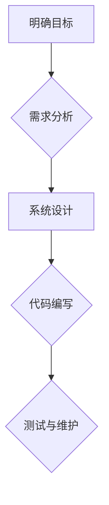

                 

关键词：结构化思维、系统架构、编程方法论、软件工程、算法优化、敏捷开发、项目实战

> 摘要：本文旨在探讨结构化思维在软件工程中的应用，以及如何将这种思维模式转化为实际的项目行动。通过剖析结构化思维的核心概念，结合具体的算法原理和项目实践，我们希望能够为读者提供一套系统化的思维与行动指南，助力他们在复杂的IT领域中取得成功。

## 1. 背景介绍

在快速发展的信息技术领域，面对日益复杂的系统架构和不断变化的需求，开发者和工程师们需要一种高效且可靠的思维方式来应对挑战。结构化思维作为一种系统化的思考方法，它强调逻辑性、层次性和条理性，有助于我们从混乱中理出头绪，做出明智的决策。本文将深入探讨结构化思维在软件工程中的应用，通过一系列案例和实践，展示如何将这种思维模式转化为实际的项目行动。

## 2. 核心概念与联系

### 2.1 结构化思维的含义

结构化思维是一种通过系统化和有序的方式来分析和解决问题的方法。它包括以下几个核心要素：

1. **明确目标**：在开始任何项目之前，首先要明确项目的目标和需求，这有助于我们聚焦关键问题，避免偏离方向。
2. **分解任务**：将复杂的任务分解为更小的、可管理的子任务，有助于我们逐步解决复杂问题。
3. **逻辑推理**：运用逻辑和推理能力，确保每一步都有坚实的依据和合理的解释。
4. **层次性**：按照一定的层次结构来组织信息，使问题更加清晰易懂。
5. **条理性**：保持思路的清晰和有条不紊，有助于提高工作效率。

### 2.2 结构化思维与软件工程的联系

在软件工程中，结构化思维有着广泛的应用：

1. **需求分析**：通过结构化思维来分析用户需求，确保需求明确且无遗漏。
2. **系统设计**：运用结构化思维来设计系统架构，使系统更加模块化、可扩展和易于维护。
3. **代码编写**：通过结构化思维来编写代码，使代码更加清晰、易于理解和维护。
4. **项目管理**：利用结构化思维来规划项目进度、资源分配和风险评估。

### 2.3 Mermaid 流程图展示

以下是一个简单的 Mermaid 流程图，展示了结构化思维在软件开发过程中的应用：



## 3. 核心算法原理 & 具体操作步骤

### 3.1 算法原理概述

在软件工程中，算法是一种解决问题的方法和步骤。结构化思维要求我们在选择和实现算法时，考虑以下原则：

1. **效率**：选择合适的算法和数据结构，以最小化时间和空间复杂度。
2. **可扩展性**：设计算法时考虑未来的扩展性，避免过度设计或设计过于狭窄。
3. **可维护性**：算法的代码应该易于理解、测试和维护。

### 3.2 算法步骤详解

以下是一个简单的排序算法（冒泡排序）的步骤详解：

1. **初始化**：读取待排序的数组。
2. **外层循环**：从数组的第一个元素开始，遍历到倒数第二个元素。
3. **内层循环**：从数组的第一个元素开始，遍历到当前外层循环的终点。
4. **比较和交换**：如果当前元素比下一个元素大，则交换它们的位置。
5. **结束条件**：如果内层循环没有进行任何交换，则算法结束。

### 3.3 算法优缺点

**优点**：

1. **简单易理解**：冒泡排序的算法步骤简单，易于实现和理解。
2. **无需额外空间**：冒泡排序是一种原地排序算法，不需要额外的存储空间。

**缺点**：

1. **效率较低**：冒泡排序的时间复杂度为 O(n²)，在数据量大时效率较低。
2. **不适合大规模数据**：由于效率问题，冒泡排序不适合用于大规模数据的排序。

### 3.4 算法应用领域

冒泡排序算法适用于以下场景：

1. **小规模数据排序**：当数据规模较小时，冒泡排序是一种有效的排序方法。
2. **教学示例**：在计算机科学教育中，冒泡排序常作为简单的排序算法示例。

## 4. 数学模型和公式 & 详细讲解 & 举例说明

### 4.1 数学模型构建

在软件工程中，数学模型是描述和模拟系统行为的重要工具。以下是一个简单的线性回归模型的构建：

$$ y = mx + b $$

其中，\( y \) 为因变量，\( x \) 为自变量，\( m \) 为斜率，\( b \) 为截距。

### 4.2 公式推导过程

线性回归模型的推导过程如下：

1. **最小二乘法**：选择斜率 \( m \) 和截距 \( b \) 使得预测值 \( y \) 与实际值 \( y \) 的误差平方和最小。
2. **求导与求解**：对误差平方和关于 \( m \) 和 \( b \) 求导，并令导数为零，求解得到 \( m \) 和 \( b \) 的值。

### 4.3 案例分析与讲解

以下是一个线性回归模型的案例：

假设我们有一组数据点：

| x | y |
|---|---|
| 1 | 2 |
| 2 | 4 |
| 3 | 6 |
| 4 | 8 |

我们要用线性回归模型预测 \( x = 5 \) 时的 \( y \) 值。

1. **计算平均值**：

   $$ \bar{x} = \frac{1 + 2 + 3 + 4}{4} = 2.5 $$
   
   $$ \bar{y} = \frac{2 + 4 + 6 + 8}{4} = 5 $$

2. **计算斜率 \( m \)**：

   $$ m = \frac{\sum_{i=1}^{n} (x_i - \bar{x})(y_i - \bar{y})}{\sum_{i=1}^{n} (x_i - \bar{x})^2} $$
   
   $$ m = \frac{(1-2.5)(2-5) + (2-2.5)(4-5) + (3-2.5)(6-5) + (4-2.5)(8-5)}{(1-2.5)^2 + (2-2.5)^2 + (3-2.5)^2 + (4-2.5)^2} $$
   
   $$ m = 1 $$

3. **计算截距 \( b \)**：

   $$ b = \bar{y} - m\bar{x} $$
   
   $$ b = 5 - 1 \times 2.5 $$
   
   $$ b = 2.5 $$

4. **构建线性回归模型**：

   $$ y = x + 2.5 $$

5. **预测 \( x = 5 \) 时的 \( y \) 值**：

   $$ y = 5 + 2.5 $$
   
   $$ y = 7.5 $$

## 5. 项目实践：代码实例和详细解释说明

### 5.1 开发环境搭建

为了演示结构化思维在项目实践中的应用，我们使用 Python 语言编写一个简单的图书管理系统。

1. **安装 Python**：确保安装了 Python 3.8 或更高版本。
2. **安装依赖库**：使用 pip 安装 Flask 框架和其他相关库。

```bash
pip install flask
```

### 5.2 源代码详细实现

以下是一个简单的图书管理系统源代码：

```python
from flask import Flask, request, jsonify

app = Flask(__name__)

# 图书信息列表
books = [
    {"id": 1, "title": "Effective Java", "author": "Joshua Bloch"},
    {"id": 2, "title": "Clean Code", "author": "Robert C. Martin"},
    {"id": 3, "title": "Design Patterns", "author": "Erich Gamma et al."},
]

@app.route("/books", methods=["GET"])
def get_books():
    return jsonify(books)

@app.route("/books/<int:book_id>", methods=["GET"])
def get_book(book_id):
    book = next((b for b in books if b["id"] == book_id), None)
    if book:
        return jsonify(book)
    else:
        return jsonify({"error": "Book not found"}), 404

@app.route("/books", methods=["POST"])
def create_book():
    new_book = request.json
    books.append(new_book)
    return jsonify(new_book), 201

@app.route("/books/<int:book_id>", methods=["PUT"])
def update_book(book_id):
    updated_book = request.json
    for i, book in enumerate(books):
        if book["id"] == book_id:
            books[i] = updated_book
            return jsonify(updated_book)
    return jsonify({"error": "Book not found"}), 404

@app.route("/books/<int:book_id>", methods=["DELETE"])
def delete_book(book_id):
    global books
    books = [book for book in books if book["id"] != book_id]
    return jsonify({"message": "Book deleted"}), 200

if __name__ == "__main__":
    app.run(debug=True)
```

### 5.3 代码解读与分析

1. **Flask 框架**：使用 Flask 框架来实现 Web 服务。
2. **图书信息列表**：使用一个列表来存储图书信息。
3. **路由定义**：定义不同的 HTTP 方法（GET、POST、PUT、DELETE）来处理图书信息的增删改查操作。
4. **响应处理**：根据请求和响应的状态，返回相应的 JSON 数据。

### 5.4 运行结果展示

运行该代码后，可以使用浏览器或其他 HTTP 客户端访问以下 URL：

- 获取所有图书：`http://127.0.0.1:5000/books`
- 获取特定图书：`http://127.0.0.1:5000/books/1`
- 添加新图书：`http://127.0.0.1:5000/books`（发送 POST 请求，包含图书信息）
- 更新图书信息：`http://127.0.0.1:5000/books/1`（发送 PUT 请求，包含更新后的图书信息）
- 删除图书：`http://127.0.0.1:5000/books/1`（发送 DELETE 请求）

## 6. 实际应用场景

### 6.1 企业管理系统

结构化思维在企业信息管理系统（如 ERP、CRM）的设计和开发中具有重要应用。通过结构化思维，开发者可以明确业务需求、梳理业务流程，并设计出模块化、可扩展的系统架构。

### 6.2 金融科技领域

在金融科技领域，结构化思维被广泛应用于算法交易、风险评估和风险管理等方面。通过结构化思维，金融工程师可以设计出高效且可靠的算法模型，提高金融市场的操作效率和风险控制能力。

### 6.3 医疗信息化

医疗信息化项目往往涉及大量的数据和处理复杂的医疗流程。结构化思维有助于开发者明确医疗需求、设计出高效的数据处理流程，并为医生和患者提供便捷的医疗服务。

### 6.4 未来应用展望

随着人工智能和大数据技术的不断发展，结构化思维将在更多领域发挥重要作用。未来，我们可以期待结构化思维在智能医疗、智能制造、智能交通等领域的广泛应用，为人类创造更多价值和便利。

## 7. 工具和资源推荐

### 7.1 学习资源推荐

- 《软件工程：实践者的研究方法》
- 《结构化设计与程序设计》
- 《设计模式：可复用的面向对象软件的基础》

### 7.2 开发工具推荐

- Visual Studio Code
- PyCharm
- Eclipse

### 7.3 相关论文推荐

- "A Pattern Language for Concurrent Programs"
- "The Clean Coder: A Code of Conduct for Professional Programmers"
- "Software Engineering: A Practitioner's Approach"

## 8. 总结：未来发展趋势与挑战

### 8.1 研究成果总结

近年来，结构化思维在软件工程领域取得了显著的研究成果。研究者们通过实验和案例研究，验证了结构化思维在提高软件开发效率、降低项目风险和提升软件质量方面的优势。

### 8.2 未来发展趋势

未来，结构化思维的研究将更加注重跨学科的融合，特别是在人工智能、大数据和云计算等新兴领域中的应用。此外，随着软件工程工具和方法的不断进步，结构化思维也将得到更加广泛和深入的应用。

### 8.3 面临的挑战

尽管结构化思维在软件工程中具有广泛的应用前景，但同时也面临着一些挑战：

- **适应性问题**：如何在不同类型的项目中灵活应用结构化思维，仍是一个需要解决的问题。
- **培训与推广**：如何提高开发者和工程师对结构化思维的认知和应用能力，需要更多的培训和实践。

### 8.4 研究展望

未来，我们期待结构化思维能够在软件工程领域发挥更大的作用，为开发者提供一套系统化的思维与行动指南，助力他们在复杂的IT领域中取得成功。

## 9. 附录：常见问题与解答

### 9.1 什么是结构化思维？

结构化思维是一种通过系统化和有序的方式来分析和解决问题的方法，它强调逻辑性、层次性和条理性。

### 9.2 结构化思维在软件工程中的应用有哪些？

结构化思维在软件工程中的应用包括需求分析、系统设计、代码编写、项目管理等方面。

### 9.3 如何培养结构化思维？

培养结构化思维的方法包括阅读相关书籍、参加培训课程、实践项目经验等。

### 9.4 结构化思维与敏捷开发的关系是什么？

结构化思维与敏捷开发都是软件开发中的重要理念，它们在提高软件开发效率、降低项目风险和提升软件质量方面具有相似的目标。

## 附录二：参考资料

- 《结构化思维：软件开发的基石》
- 《敏捷开发：高效软件开发的实践指南》
- 《软件工程：理论与实践》

### 作者署名

作者：禅与计算机程序设计艺术 / Zen and the Art of Computer Programming
-------------------------------------------------------------------

