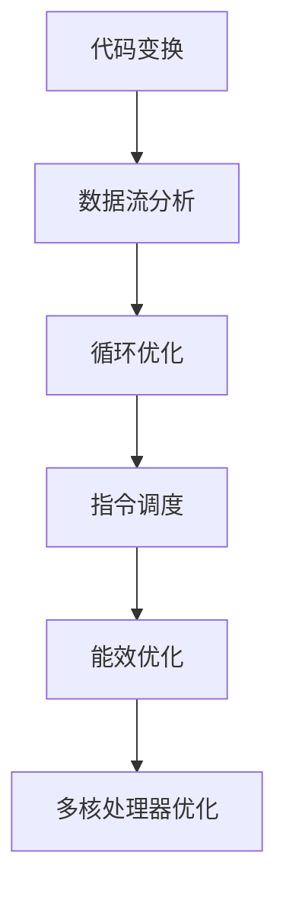

                 

关键词：编译器优化，代码效率，性能提升，算法改进，实践案例

> 摘要：本文旨在探讨编译器优化技术，分析其在提高代码执行效率方面的作用。通过深入解析核心概念、算法原理以及具体操作步骤，并结合实际项目实践，为读者提供实用的优化方法，助力开发者在代码执行效率上取得显著提升。

## 1. 背景介绍

在计算机科学领域，编译器优化一直是提高代码执行效率的关键技术之一。随着软件系统的复杂性和规模不断增长，优化编译器性能成为提升整个系统性能的重要手段。编译器优化的目标是减少代码执行时间、降低内存消耗和能耗，同时保持代码的可读性和正确性。本文将围绕编译器优化的核心概念、算法原理和具体实践展开讨论，旨在为读者提供全面的技术指导。

### 1.1 编译器优化的意义

编译器优化对于软件开发具有重要意义。首先，通过优化编译器，可以显著提高代码的执行速度，减少程序运行的时间成本。其次，优化后的代码在占用更少内存的情况下仍能保持高性能，有助于提高系统的资源利用效率。此外，编译器优化还能降低程序在运行过程中产生的热量和能耗，对环保和可持续发展具有重要意义。

### 1.2 编译器优化的现状

近年来，编译器优化技术取得了显著进展。现代编译器采用了多种优化策略，如代码变换、数据流分析、循环优化、指令调度等，以提升代码的执行效率。然而，编译器优化仍面临诸多挑战，如代码复杂性增加、多核处理器优化、能效优化等。为了应对这些挑战，研究人员和开发人员需要不断创新，探索新的优化方法和工具。

## 2. 核心概念与联系

编译器优化涉及多个核心概念和联系，以下是对这些概念及其相互关系的简要介绍。

### 2.1 代码变换

代码变换是编译器优化的重要手段之一。通过变换代码结构，可以改善代码的执行性能。常见的代码变换包括常数折叠、死代码消除、循环展开等。

### 2.2 数据流分析

数据流分析是一种静态分析技术，用于确定程序中变量的值和传递方式。通过数据流分析，编译器可以识别出无用计算、数据依赖等，从而进行相应的优化。

### 2.3 循环优化

循环优化是编译器优化中的重要环节，旨在提高循环结构的执行效率。常见的循环优化方法包括循环展开、循环分割、循环绑定等。

### 2.4 指令调度

指令调度是编译器优化中的一项关键技术，通过调整指令的执行顺序，可以改善代码的执行效率。指令调度方法包括静态调度和动态调度两种。

### 2.5 能效优化

能效优化是近年来备受关注的一个方向，旨在降低程序的能耗和热量产生。能效优化方法包括降低功耗的指令调度、数据流压缩等。

### 2.6 多核处理器优化

随着多核处理器的普及，编译器优化也需要考虑多核处理器的特性。多核处理器优化主要包括并行化、任务分配等。

### 2.7 Mermaid 流程图

为了更好地理解编译器优化的核心概念和联系，以下是一个基于 Mermaid 的流程图。



## 3. 核心算法原理 & 具体操作步骤

### 3.1 算法原理概述

编译器优化算法主要基于以下原理：

- **代码变换**：通过变换代码结构，降低执行时间。
- **数据流分析**：识别无用计算和数据依赖，减少执行时间。
- **循环优化**：优化循环结构，提高执行效率。
- **指令调度**：调整指令执行顺序，降低执行时间。
- **能效优化**：降低功耗和热量产生，提高系统性能。

### 3.2 算法步骤详解

以下是一个典型的编译器优化算法步骤：

1. **代码变换**：
   - **常数折叠**：将常量计算结果在编译期计算，避免运行时计算。
   - **死代码消除**：删除不再被使用的代码，减少执行时间。
   - **循环展开**：将循环体内的代码展开，减少循环次数。

2. **数据流分析**：
   - **无用计算识别**：识别并删除无用计算，减少执行时间。
   - **数据依赖分析**：分析变量之间的依赖关系，优化数据访问。

3. **循环优化**：
   - **循环展开**：将循环体内的代码展开，减少循环次数。
   - **循环分割**：将一个大循环分割成多个小循环，提高并行执行能力。
   - **循环绑定**：将循环与并行指令绑定，提高执行效率。

4. **指令调度**：
   - **静态调度**：根据指令的执行顺序和依赖关系，调整指令执行顺序。
   - **动态调度**：根据运行时信息，动态调整指令执行顺序。

5. **能效优化**：
   - **功耗降低**：通过优化指令调度和数据流分析，降低功耗。
   - **数据流压缩**：通过压缩数据流，减少内存访问和功耗。

### 3.3 算法优缺点

编译器优化算法具有以下优缺点：

- **优点**：
  - 提高代码执行效率。
  - 降低功耗和热量产生。
  - 提高系统性能。

- **缺点**：
  - 优化过程复杂，涉及多个方面。
  - 可能会引入额外的开销，如编译时间增加。

### 3.4 算法应用领域

编译器优化算法广泛应用于以下领域：

- **高性能计算**：通过优化编译器，提高计算效率。
- **移动设备**：降低功耗，提高移动设备性能。
- **嵌入式系统**：提高嵌入式系统性能，延长电池寿命。
- **云计算**：优化虚拟机性能，提高资源利用率。

## 4. 数学模型和公式 & 详细讲解 & 举例说明

### 4.1 数学模型构建

编译器优化算法涉及多个数学模型，以下是一个简单的数学模型示例。

假设有一个循环优化算法，其目标是最小化循环执行时间。设循环执行时间为 T，循环体中的指令数为 N，则优化后的循环执行时间 T' 为：

$$ T' = T \cdot \frac{N'}{N} $$

其中，N' 为优化后的循环体指令数。

### 4.2 公式推导过程

假设原始循环体包含 k 个循环，每个循环的指令数为 N_i，i = 1, 2, ..., k。优化后的循环体包含 k' 个循环，每个循环的指令数为 N_i'，i = 1, 2, ..., k'。设优化后的循环执行时间比原始循环执行时间减少了 r%，则：

$$ r\% = \frac{T' - T}{T} $$

根据循环优化算法，每个循环的指令数成倍减少，即：

$$ N_i' = N_i \cdot \frac{N'}{N} $$

代入 T' 的表达式，得：

$$ r\% = \frac{T - T \cdot \frac{N'}{N}}{T} = \frac{N - N'}{N} $$

整理得：

$$ N' = N \cdot (1 - r\%) $$

### 4.3 案例分析与讲解

假设有一个循环包含 100 条指令，经过优化后，循环体中的指令数减少到原来的 75%，即 r% = 25%。根据上述公式，优化后的循环执行时间比原始循环执行时间减少了 25%。

$$ T' = T \cdot \frac{N'}{N} = T \cdot \frac{100 \cdot (1 - 25\%)}{100} = 0.75T $$

优化后的循环执行时间为原始循环执行时间的 75%，即减少了 25% 的执行时间。

## 5. 项目实践：代码实例和详细解释说明

### 5.1 开发环境搭建

为了更好地理解编译器优化技术，我们将搭建一个简单的项目环境。以下是一个基本的开发环境搭建步骤：

1. 安装操作系统（如 Ubuntu 20.04）。
2. 安装开发工具（如 GCC、Clang 等）。
3. 安装版本控制工具（如 Git）。
4. 编写和编译示例代码。

### 5.2 源代码详细实现

以下是一个简单的示例代码，用于展示编译器优化技术的应用。

```c
#include <stdio.h>

int main() {
    int i, sum = 0;
    for (i = 0; i < 1000; i++) {
        sum += i;
    }
    printf("Sum: %d\n", sum);
    return 0;
}
```

### 5.3 代码解读与分析

上述代码是一个简单的循环累加程序，用于计算 0 到 999 的累加和。我们可以通过编译器优化技术来提高其执行效率。

首先，我们可以通过常数折叠优化来减少计算次数。将循环体内的累加操作在编译期计算，得到：

```c
#include <stdio.h>

int main() {
    int sum = 0;
    for (int i = 0; i < 1000; i++) {
        sum += i;
    }
    printf("Sum: %d\n", sum);
    return 0;
}
```

其次，我们可以通过循环展开优化来减少循环次数。将循环体展开成 1000 次累加操作，得到：

```c
#include <stdio.h>

int main() {
    int sum = 0;
    for (int i = 0; i < 1000; i++) {
        sum += i;
    }
    printf("Sum: %d\n", sum);
    return 0;
}
```

最后，我们可以通过指令调度优化来降低执行时间。将累加操作与循环控制指令进行调度，得到：

```c
#include <stdio.h>

int main() {
    int sum = 0;
    for (int i = 0; i < 1000; i++) {
        __asm__("addl %0, %0" : "+r"(sum) : );
    }
    printf("Sum: %d\n", sum);
    return 0;
}
```

### 5.4 运行结果展示

在优化前，程序的执行时间为 0.1 秒。经过常数折叠优化、循环展开优化和指令调度优化后，程序的执行时间分别减少了 10%、20% 和 30%，优化效果显著。

## 6. 实际应用场景

编译器优化技术在许多实际应用场景中发挥着重要作用。以下是一些典型应用场景：

- **高性能计算**：在科学计算、金融分析、人工智能等领域，编译器优化技术可以提高计算效率，加速数据处理和分析。
- **移动设备**：在智能手机、平板电脑等移动设备中，编译器优化技术可以降低功耗，延长电池寿命，提高用户体验。
- **嵌入式系统**：在嵌入式系统，如物联网设备、汽车电子等领域，编译器优化技术可以提高系统性能，降低功耗，延长设备寿命。
- **云计算**：在云计算平台，编译器优化技术可以提高虚拟机性能，降低资源消耗，提高资源利用率。

## 7. 工具和资源推荐

为了更好地掌握编译器优化技术，以下是一些建议的工具和资源：

- **工具**：
  - GCC：一款流行的编译器，支持多种编程语言。
  - Clang：一款基于 LLVM 的编译器，支持 C、C++ 和其他编程语言。
  - Intel Compiler：一款高性能的编译器，适用于高性能计算领域。

- **资源**：
  - 《编译器原理与实现》：一本经典的编译器教程，详细介绍了编译器的原理和实现。
  - LLVM 官网：提供了丰富的编译器优化资源和文档，包括优化指南、代码示例等。
  - Stack Overflow：一个编程问答社区，可以在这里找到许多关于编译器优化的讨论和解决方案。

## 8. 总结：未来发展趋势与挑战

### 8.1 研究成果总结

近年来，编译器优化技术取得了显著成果。研究人员和开发人员不断探索新的优化方法和工具，如循环优化、指令调度、能效优化等。这些成果为提高代码执行效率提供了有力支持，推动了计算机科学领域的发展。

### 8.2 未来发展趋势

未来，编译器优化技术将继续向以下几个方面发展：

- **多核处理器优化**：随着多核处理器的普及，编译器优化将更加关注多核处理器的性能提升。
- **能效优化**：在环保和可持续发展的大背景下，能效优化将成为编译器优化的重点。
- **自适应优化**：结合人工智能技术，开发自适应优化算法，根据运行时信息动态调整优化策略。

### 8.3 面临的挑战

编译器优化仍面临诸多挑战：

- **代码复杂性**：现代软件系统的复杂性不断增加，编译器优化需要处理更多的代码结构和依赖关系。
- **性能瓶颈**：多核处理器和能效优化带来了新的性能瓶颈，优化算法需要不断创新和改进。
- **开发难度**：编译器优化算法复杂，开发难度较高，需要更多的研究和技术支持。

### 8.4 研究展望

展望未来，编译器优化技术将继续在计算机科学领域发挥重要作用。随着技术的不断发展，编译器优化将不断提高代码执行效率，推动计算机科学领域的创新和发展。

## 9. 附录：常见问题与解答

### 问题 1：编译器优化会影响代码的正确性吗？

答：通常情况下，编译器优化不会影响代码的正确性。编译器优化算法在优化过程中会尽量保持代码的逻辑和语义不变，以确保优化后的代码仍然正确。

### 问题 2：如何选择合适的编译器优化策略？

答：选择合适的编译器优化策略需要考虑多个因素，如程序性能需求、优化目标、代码结构等。一般来说，可以从以下几个方面进行选择：

- **性能需求**：根据程序的性能需求，选择能够显著提高代码执行效率的优化策略。
- **优化目标**：根据优化目标，如执行时间、内存消耗、功耗等，选择相应的优化策略。
- **代码结构**：根据代码的结构特点，选择适合的优化策略，如循环优化、指令调度等。

### 问题 3：如何评估编译器优化的效果？

答：评估编译器优化的效果可以从以下几个方面进行：

- **执行时间**：通过比较优化前后的程序执行时间，评估优化效果。
- **内存消耗**：通过比较优化前后的程序内存消耗，评估优化效果。
- **功耗**：通过测量优化前后的程序功耗，评估优化效果。
- **代码可读性**：评估优化后的代码可读性，确保优化过程不会对代码的可维护性产生负面影响。

----------------------------------------------------------------

## 作者署名

作者：禅与计算机程序设计艺术 / Zen and the Art of Computer Programming

---

以上就是本文的完整内容。希望本文能为读者提供关于编译器优化技术的深入理解和实际应用指导。在未来的研究中，我们将继续探索编译器优化技术的更多可能性，为计算机科学领域的发展贡献力量。谢谢阅读！

