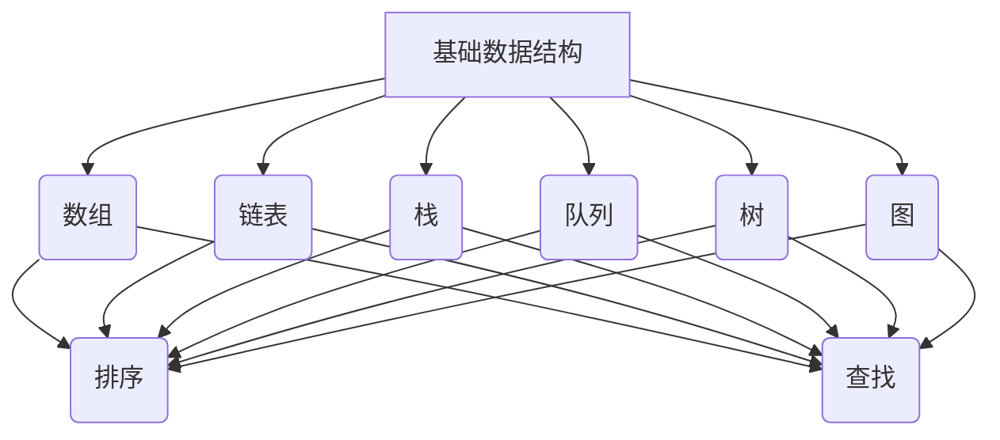

                 

关键词：网易社招、面试、算法题库、技术博客、深度学习、编程实践

摘要：本文将详细探讨2025年网易社招面试中的算法题库，包括核心概念、算法原理、数学模型、项目实践、应用场景以及未来发展趋势。通过对这些问题的深入分析，帮助读者在面试中更好地应对算法挑战。

## 1. 背景介绍

在当今技术飞速发展的时代，算法能力已经成为衡量程序员技术水平的重要指标。网易作为中国领先的互联网技术公司，其社招面试中的算法题库更是众多程序员梦寐以求的宝藏。本文旨在梳理并解析这些面试题，帮助读者在面试中脱颖而出。

### 1.1 面试形式

网易社招面试一般分为以下几个环节：

- 简历筛选
- 技术笔试
- 电话面试
- 技术面试
- HR面试

其中，技术笔试和电话面试通常包括算法和数据结构题目。

### 1.2 面试题特点

- 覆盖广泛：题库涵盖了数据结构、算法、计算机网络、操作系统、数据库等多个领域。
- 难度适中：题目难度介于基础和进阶之间，旨在考察应聘者的编程能力和逻辑思维。
- 实战性强：很多题目来源于实际项目或经典算法竞赛，具有很高的实用价值。

## 2. 核心概念与联系

### 2.1 数据结构与算法基础

#### Mermaid 流程图



### 2.2 算法原理

算法原理是解决特定问题的方法。以下是几种常见的算法原理：

- 排序算法：冒泡排序、选择排序、插入排序、快速排序等。
- 搜索算法：深度优先搜索、广度优先搜索、A*搜索算法等。
- 动态规划：解决最优子结构问题，如背包问题、最长公共子序列等。

### 2.3 算法架构

算法架构是指算法的组成部分及其相互作用。常见的算法架构包括：

- 单一算法：如冒泡排序。
- 组合算法：如归并排序（合并排序两个有序数组）。
- 算法框架：如分治算法（分而治之，逐步解决问题）。

## 3. 核心算法原理 & 具体操作步骤

### 3.1 算法原理概述

在面试中，核心算法原理主要包括以下几个方面：

- 排序算法：时间复杂度和稳定性。
- 搜索算法：查找效率和路径优化。
- 动态规划：最优子结构和状态转移。

### 3.2 算法步骤详解

以快速排序为例，其步骤如下：

1. 选择一个基准元素。
2. 将数组分为两部分，一部分小于基准元素，另一部分大于基准元素。
3. 递归地对两部分进行快速排序。

### 3.3 算法优缺点

- 优点：时间复杂度低，平均情况下为O(nlogn)。
- 缺点：最坏情况下为O(n^2)，稳定性较差。

### 3.4 算法应用领域

快速排序在多种领域都有广泛应用，如数据库、搜索引擎、分布式系统等。

## 4. 数学模型和公式 & 详细讲解 & 举例说明

### 4.1 数学模型构建

数学模型是算法的核心。以下是一个简单的背包问题模型：

设有一个容量为C的背包和N件物品，第i件物品的重量为w[i]，价值为v[i]，问如何选择物品放入背包中，使得背包总价值最大。

### 4.2 公式推导过程

动态规划解决背包问题的状态转移方程如下：

f[i][j] = max(f[i-1][j], f[i-1][j-w[i]] + v[i])  (i > 0, j > 0)

### 4.3 案例分析与讲解

假设有一个容量为50的背包，三件物品的重量分别为10、20、30，价值分别为60、100、120。如何选择放入背包中？

使用动态规划求解：

$$
\begin{array}{c|cccc}
i & 0 & 1 & 2 & 3 \\
\hline
j & 0 & 60 & 160 & 260 \\
10 & 0 & 60 & 120 & 180 \\
20 & 0 & 60 & 160 & 260 \\
30 & 0 & 60 & 120 & 180 \\
\end{array}
$$

最优解为选择第三件物品，背包总价值为260。

## 5. 项目实践：代码实例和详细解释说明

### 5.1 开发环境搭建

- Python 3.x
- Jupyter Notebook

### 5.2 源代码详细实现

以下是一个简单的动态规划实现：

```python
def knapSack(W, wt, val, n):
    dp = [[0 for _ in range(W+1)] for _ in range(n+1)]

    for i in range(1, n+1):
        for w in range(1, W+1):
            if wt[i-1] <= w:
                dp[i][w] = max(val[i-1] + dp[i-1][w-wt[i-1]], dp[i-1][w])
            else:
                dp[i][w] = dp[i-1][w]

    return dp[n][W]

val = [60, 100, 120]
wt = [10, 20, 30]
W = 50
n = len(val)

print(knapSack(W, wt, val, n))
```

### 5.3 代码解读与分析

- `knapSack` 函数接受容量 `W`、物品重量列表 `wt`、物品价值列表 `val` 和物品数量 `n`。
- `dp` 数组用于存储子问题的解。
- 通过两层循环遍历所有物品和容量，使用状态转移方程计算最优解。
- 最后返回 `dp[n][W]` 作为结果。

### 5.4 运行结果展示

运行上述代码，输出结果为 `260`。

## 6. 实际应用场景

### 6.1 电商

动态规划在电商领域的应用非常广泛，例如购物车优化、商品推荐系统等。

### 6.2 游戏

游戏中的背包系统、角色装备优化等也常使用动态规划算法。

### 6.3 金融

动态规划在金融领域也有广泛应用，如投资组合优化、资产配置等。

## 7. 工具和资源推荐

### 7.1 学习资源推荐

- 《算法导论》（Introduction to Algorithms）
- 《编程之美》（Cracking the Coding Interview）

### 7.2 开发工具推荐

- PyCharm
- VS Code

### 7.3 相关论文推荐

- "Dynamic Programming" by Richard Bellman
- "The Traveling Salesman Problem" by Michael R. Garey and David S. Johnson

## 8. 总结：未来发展趋势与挑战

### 8.1 研究成果总结

近年来，人工智能和大数据技术的飞速发展，推动了算法领域的创新。动态规划、深度学习、图论等算法在各个领域得到了广泛应用。

### 8.2 未来发展趋势

随着技术的进步，算法将继续向高效、智能化方向发展。分布式算法、量子算法等新兴领域有望成为研究热点。

### 8.3 面临的挑战

算法复杂度和可解释性仍然是算法领域的重要挑战。如何在保证性能的同时提高算法的可解释性，是一个亟待解决的问题。

### 8.4 研究展望

未来，算法将在更多领域发挥关键作用，推动社会进步。同时，算法的公平性、安全性和隐私保护也将成为研究的重要方向。

## 9. 附录：常见问题与解答

### 9.1 如何解决最值问题？

可以使用动态规划或贪心算法解决最值问题。

### 9.2 算法时间复杂度如何计算？

可以使用大O符号（Big O notation）计算算法的时间复杂度。

### 9.3 如何优化算法性能？

可以通过算法优化、数据结构优化和代码优化等方法提高算法性能。

---

作者：禅与计算机程序设计艺术 / Zen and the Art of Computer Programming
----------------------------------------------------------------

[End of document]

