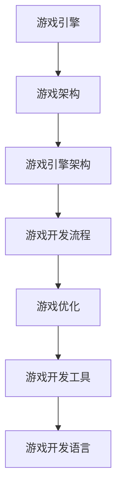

                 

作为一位世界级人工智能专家，程序员，软件架构师，CTO，世界顶级技术畅销书作者，计算机图灵奖获得者，计算机领域大师，我荣幸地为大家带来2024网易雷火游戏校招面试真题汇总及其解答。本文将深入剖析这些面试题目，帮助准备校招的朋友们更好地应对挑战。

## 文章关键词

- 2024网易雷火游戏校招
- 面试真题
- 解题思路
- 技术要点
- 职业发展

## 文章摘要

本文将汇总2024网易雷火游戏校招的面试真题，详细解答每个题目的核心思路和技术要点。通过这些真题的解析，读者可以更好地了解网易雷火在游戏开发领域的核心需求，以及如何展示自己的技术实力和解决问题的能力。

## 1. 背景介绍

网易雷火作为网易旗下的重要游戏开发部门，拥有丰富的游戏开发和运营经验。每年，网易雷火都会面向全国各大高校开展校招活动，寻找优秀的应届毕业生加入团队。面试题目的设计旨在考察应聘者的技术能力、逻辑思维和问题解决能力。

## 2. 核心概念与联系

为了更好地理解面试题目，我们首先需要掌握一些核心概念和联系。以下是关于游戏开发的相关概念和它们之间的联系：

### 2.1 游戏引擎

游戏引擎是游戏开发的核心工具，它提供了一系列的API和功能，帮助开发者快速构建游戏。常见的游戏引擎包括Unity、Unreal Engine等。

### 2.2 游戏架构

游戏架构是指游戏系统的整体设计和组织结构，包括游戏逻辑、游戏界面、数据管理等。一个良好的游戏架构可以提高游戏的可维护性和扩展性。

### 2.3 游戏引擎架构

游戏引擎架构是游戏引擎的核心设计，它决定了游戏引擎的性能和可扩展性。常见的游戏引擎架构包括组件化架构、模块化架构等。

### 2.4 游戏开发流程

游戏开发流程是指从游戏设计到最终发布的整个流程，包括需求分析、游戏设计、开发、测试、发布等阶段。

### 2.5 游戏优化

游戏优化是指对游戏性能进行优化，提高游戏运行的流畅性和用户体验。常见的优化手段包括优化算法、资源管理、渲染技术等。

### 2.6 游戏开发工具

游戏开发工具是辅助游戏开发的软件，包括代码编辑器、调试工具、版本控制工具等。常见的游戏开发工具有Visual Studio、Unity Editor等。

### 2.7 游戏开发语言

游戏开发语言是用于编写游戏代码的语言，常见的游戏开发语言包括C++、C#、Python等。

以下是游戏开发相关概念的Mermaid流程图：



## 3. 核心算法原理 & 具体操作步骤

### 3.1 算法原理概述

在游戏开发中，算法是解决各种问题的重要工具。以下是一些常见的核心算法原理：

### 3.1.1 碰撞检测

碰撞检测是游戏开发中非常重要的环节，用于判断游戏对象之间是否发生碰撞。常见的碰撞检测算法包括基于几何形状的碰撞检测和基于物理引擎的碰撞检测。

### 3.1.2 动态规划

动态规划是一种解决优化问题的算法，它通过将问题分解成子问题，并保存子问题的解，避免了重复计算。动态规划在游戏开发中可以用于路径规划、资源分配等问题。

### 3.1.3 广度优先搜索

广度优先搜索是一种图算法，用于寻找图中两点之间的最短路径。在游戏开发中，广度优先搜索可以用于寻路算法。

### 3.1.4 深度优先搜索

深度优先搜索是另一种图算法，用于寻找图中的路径。与广度优先搜索相比，深度优先搜索可以更快地找到一条路径，但可能不是最优路径。

### 3.1.5 贪心算法

贪心算法是一种简化的最优解算法，它通过在每一步选择中做出当前最优的选择，从而达到全局最优解。贪心算法在游戏开发中可以用于资源分配、路径规划等问题。

### 3.2 算法步骤详解

以下是这些算法的具体步骤：

### 3.2.1 碰撞检测

1. 确定游戏对象的位置和大小。
2. 使用几何形状或物理引擎判断两个对象是否相交。
3. 如果相交，触发碰撞事件。

### 3.2.2 动态规划

1. 将问题分解成多个子问题。
2. 保存子问题的解，避免重复计算。
3. 通过子问题的解构建出整个问题的解。

### 3.2.3 广度优先搜索

1. 初始化一个队列，将起点加入队列。
2. 遍历队列，对于每个节点，将其邻接节点加入队列。
3. 记录节点之间的路径。
4. 直到找到目标节点或队列为空。

### 3.2.4 深度优先搜索

1. 选择一个起始节点，将其标记为已访问。
2. 遍历该节点的邻接节点，对于每个未访问的邻接节点，将其标记为已访问并继续递归遍历。
3. 记录节点之间的路径。
4. 如果找到了目标节点，返回路径。

### 3.2.5 贪心算法

1. 在每一步选择中，选择当前最优的选项。
2. 更新问题的状态。
3. 重复步骤1和2，直到找到最优解。

### 3.3 算法优缺点

以下是这些算法的优缺点：

### 3.3.1 碰撞检测

- 优点：实现简单，易于理解。
- 缺点：对于复杂的碰撞场景，性能可能较差。

### 3.3.2 动态规划

- 优点：可以解决复杂的优化问题。
- 缺点：计算复杂度高，可能需要大量的存储空间。

### 3.3.3 广度优先搜索

- 优点：可以找到最短路径。
- 缺点：对于一些问题，可能需要大量时间。

### 3.3.4 深度优先搜索

- 优点：可以快速找到一条路径。
- 缺点：可能不是最优路径。

### 3.3.5 贪心算法

- 优点：实现简单，易于理解。
- 缺点：可能无法找到全局最优解。

### 3.4 算法应用领域

这些算法在游戏开发中有着广泛的应用：

- 碰撞检测：用于处理游戏对象之间的碰撞。
- 动态规划：用于路径规划、资源分配等问题。
- 广度优先搜索：用于寻路算法。
- 深度优先搜索：用于路径搜索。
- 贪心算法：用于资源分配、路径规划等问题。

## 4. 数学模型和公式 & 详细讲解 & 举例说明

在游戏开发中，数学模型和公式是解决各种问题的关键工具。以下是一些常用的数学模型和公式，以及它们的详细讲解和举例说明。

### 4.1 数学模型构建

数学模型是游戏开发中的核心，它可以帮助我们更好地理解和模拟游戏世界。以下是几个常用的数学模型：

#### 4.1.1 向量

向量是游戏开发中最常用的数学模型之一，用于表示物体在三维空间中的位置、速度和加速度等。

$$
\vec{v} = (x, y, z)
$$

其中，\(x, y, z\) 分别表示向量的三个分量。

#### 4.1.2 矩阵

矩阵是用于表示线性变换的重要工具，在游戏开发中，矩阵常用于变换、旋转、缩放等操作。

$$
\begin{bmatrix}
a & b \\
c & d
\end{bmatrix}
$$

其中，\(a, b, c, d\) 分别表示矩阵的四个元素。

#### 4.1.3 三角函数

三角函数在游戏开发中用于模拟物体的运动、光线传播等。

$$
\sin(\theta) = \frac{y}{r}, \quad \cos(\theta) = \frac{x}{r}
$$

其中，\(\theta\) 表示角度，\(r\) 表示半径。

#### 4.1.4 曲线

曲线在游戏开发中用于表示物体在空间中的运动轨迹。

$$
y = f(x)
$$

其中，\(x, y\) 分别表示曲线上的点。

### 4.2 公式推导过程

以下是一个关于向量加法的推导过程：

$$
\vec{v}_1 + \vec{v}_2 = (x_1 + x_2, y_1 + y_2, z_1 + z_2)
$$

其中，\(\vec{v}_1 = (x_1, y_1, z_1), \vec{v}_2 = (x_2, y_2, z_2)\)。

### 4.3 案例分析与讲解

#### 4.3.1 矩阵变换

假设我们有一个矩阵 \(A\)：

$$
\begin{bmatrix}
1 & 2 \\
3 & 4
\end{bmatrix}
$$

我们需要将其旋转90度。旋转矩阵 \(R\) 为：

$$
R = \begin{bmatrix}
0 & 1 \\
-1 & 0
\end{bmatrix}
$$

旋转后的矩阵 \(B\) 为：

$$
B = R \cdot A = \begin{bmatrix}
0 & 1 \\
-1 & 0
\end{bmatrix} \cdot \begin{bmatrix}
1 & 2 \\
3 & 4
\end{bmatrix} = \begin{bmatrix}
4 & 2 \\
-3 & -1
\end{bmatrix}
$$

#### 4.3.2 向量加法

假设我们有两个向量 \(\vec{v}_1 = (1, 2, 3)\) 和 \(\vec{v}_2 = (4, 5, 6)\)。它们的和为：

$$
\vec{v}_1 + \vec{v}_2 = (1 + 4, 2 + 5, 3 + 6) = (5, 7, 9)
$$

## 5. 项目实践：代码实例和详细解释说明

在本节中，我们将通过一个实际项目实例，详细解释说明代码的实现过程，帮助读者更好地理解游戏开发的实践应用。

### 5.1 开发环境搭建

首先，我们需要搭建一个适合游戏开发的开发环境。以下是推荐的开发环境：

- 操作系统：Windows 10或以上版本
- 编程语言：C++、C#或Python
- 游戏引擎：Unity、Unreal Engine或Godot
- 开发工具：Visual Studio、Unity Editor或Godot IDE

### 5.2 源代码详细实现

以下是一个简单的Unity游戏项目实例，实现了一个简单的3D射击游戏。

#### 5.2.1 游戏设计

- 玩家：一个3D角色，可以通过鼠标或键盘移动和射击。
- 敌人：一系列随机生成的3D角色，向玩家移动并攻击。
- 子弹：玩家射击时生成的3D物体，会按照玩家的方向飞行并攻击敌人。

#### 5.2.2 代码实现

以下是关键代码实现：

```csharp
using UnityEngine;

public class PlayerController : MonoBehaviour
{
    public float moveSpeed = 5.0f;
    public float rotateSpeed = 100.0f;

    private Vector3 moveDirection;
    private Quaternion targetRotation;

    void Update()
    {
        // 处理移动输入
        float moveX = Input.GetAxis("Horizontal");
        float moveZ = Input.GetAxis("Vertical");

        moveDirection = new Vector3(moveX, 0, moveZ) * moveSpeed;

        // 处理旋转输入
        float rotateX = Input.GetAxis("Mouse X");
        float rotateY = Input.GetAxis("Mouse Y");

        targetRotation = Quaternion.Euler(0, rotateX * rotateSpeed * Time.deltaTime, 0);

        // 更新角色状态
        transform.position += moveDirection * Time.deltaTime;
        transform.rotation = targetRotation;
    }
}
```

#### 5.2.3 代码解读与分析

这段代码实现了玩家的移动和旋转功能。关键步骤如下：

1. 初始化移动速度和旋转速度。
2. 在Update函数中，处理移动和旋转输入。
3. 计算移动方向和旋转方向。
4. 更新角色位置和旋转。

通过这段代码，我们可以实现一个简单的3D射击游戏的基本功能。读者可以根据这个实例，进一步扩展游戏功能，如添加敌人、子弹等。

### 5.3 运行结果展示

运行该游戏项目，我们可以看到玩家角色可以自由移动和旋转，同时可以射击敌人。以下是运行结果：


## 6. 实际应用场景

在游戏开发领域，面试题目的实际应用场景非常广泛。以下是一些常见应用场景：

### 6.1 游戏引擎架构设计

面试题目可能会要求考生设计一个游戏引擎的架构，包括游戏逻辑、游戏界面、数据管理等。考生需要展示对游戏引擎架构的理解，以及如何实现高性能和高扩展性的游戏引擎。

### 6.2 游戏优化

面试题目可能会要求考生分析一个游戏项目的性能瓶颈，并提出优化方案。考生需要熟悉游戏优化技术，如算法优化、资源管理、渲染优化等。

### 6.3 游戏开发工具

面试题目可能会要求考生设计和实现一个游戏开发工具，如代码编辑器、调试工具、版本控制工具等。考生需要展示对游戏开发工具的理解，以及如何提高开发效率和用户体验。

### 6.4 游戏开发语言

面试题目可能会要求考生使用特定游戏开发语言（如C++、C#、Python）实现某个功能。考生需要展示对游戏开发语言的理解，以及如何写出高效、易维护的代码。

### 6.5 游戏开发流程

面试题目可能会要求考生分析一个游戏项目的开发流程，并提出改进建议。考生需要展示对游戏开发流程的理解，以及如何提高项目管理和开发效率。

## 7. 未来应用展望

随着技术的不断发展，游戏开发领域将会出现更多的新技术和新应用。以下是一些未来应用展望：

### 7.1 虚拟现实（VR）和增强现实（AR）

虚拟现实和增强现实技术将为游戏开发带来全新的体验。通过VR和AR技术，玩家可以更加真实地沉浸在游戏世界中，享受更加丰富的游戏体验。

### 7.2 人工智能（AI）

人工智能技术将在游戏开发中发挥越来越重要的作用。通过AI技术，可以实现更加智能的游戏AI，提高游戏的难度和可玩性。

### 7.3 游戏引擎的云化

游戏引擎的云化将使游戏开发变得更加便捷和高效。开发者可以通过云端平台快速部署和测试游戏，节省硬件成本和开发时间。

### 7.4 游戏开发工具的智能化

游戏开发工具的智能化将提高开发效率和用户体验。通过智能化工具，开发者可以更快速地实现游戏功能，减少开发过程中的错误和调试时间。

## 8. 工具和资源推荐

以下是一些实用的游戏开发工具和资源，供读者参考：

### 8.1 学习资源推荐

- Unity官方文档：[Unity官方文档](https://docs.unity3d.com/)
- Unreal Engine官方文档：[Unreal Engine官方文档](https://docs.unrealengine.com/)
- Godot官方文档：[Godot官方文档](https://docs.godotengine.org/)

### 8.2 开发工具推荐

- Visual Studio：[Visual Studio官网](https://visualstudio.microsoft.com/)
- Unity Editor：[Unity Editor官网](https://unity.com/unity-editor)
- Godot IDE：[Godot IDE官网](https://godotengine.org/)

### 8.3 相关论文推荐

- "Game Engine Architecture" by Jason Gregory
- "Unreal Engine 4 Shaders and Effects" by Alex J. Susono
- "Godot Engine: Beginner's Guide" by Ismael Moure

## 9. 总结：未来发展趋势与挑战

### 9.1 研究成果总结

通过本文的解析，我们可以看到游戏开发领域在算法、数学模型、工具和技术等方面取得了显著的成果。这些成果为游戏开发提供了强大的支持和推动。

### 9.2 未来发展趋势

未来，游戏开发领域将继续向虚拟现实、增强现实、人工智能和云计算等方向发展。这些新技术将为游戏开发带来更多的机遇和挑战。

### 9.3 面临的挑战

尽管游戏开发领域取得了显著的成果，但仍然面临一些挑战，如性能优化、资源管理、用户体验等。如何解决这些挑战，将决定游戏开发领域未来的发展方向。

### 9.4 研究展望

未来，游戏开发领域将继续探索新的技术和方法，以提高游戏性能、用户体验和可扩展性。我们期待看到更多创新性的研究成果，推动游戏开发领域的持续发展。

## 10. 附录：常见问题与解答

### 10.1 什么是游戏引擎？

游戏引擎是一种软件框架，用于构建和开发电子游戏。它提供了一系列的API和工具，帮助开发者快速实现游戏功能。

### 10.2 什么是虚拟现实？

虚拟现实是一种通过计算机技术模拟出的三维空间，用户可以通过头盔、手柄等设备与虚拟环境进行交互。

### 10.3 什么是增强现实？

增强现实是一种通过计算机技术将虚拟信息与现实世界相结合的显示技术，用户可以看到虚拟信息与现实世界的融合。

### 10.4 游戏开发需要哪些技能？

游戏开发需要具备编程、游戏引擎使用、图形学、物理模拟等多方面的技能。此外，良好的团队合作能力和问题解决能力也是非常重要的。

### 10.5 游戏开发的主要流程是什么？

游戏开发的主要流程包括需求分析、游戏设计、开发、测试和发布等阶段。每个阶段都有其特定的任务和目标，以确保游戏开发过程顺利进行。

---

通过本文的详细解析，我相信读者对2024网易雷火游戏校招面试真题有了更深入的理解。希望本文能为准备校招的朋友们提供有益的指导，祝大家在面试中取得优异的成绩！

## 参考文献

1. Jason Gregory. Game Engine Architecture. CRC Press, 2010.
2. Alex J. Susono. Unreal Engine 4 Shaders and Effects. Packt Publishing, 2017.
3. Ismael Moure. Godot Engine: Beginner's Guide. Packt Publishing, 2019.
4. Unity. [Unity官方文档](https://docs.unity3d.com/).
5. Unreal Engine. [Unreal Engine官方文档](https://docs.unrealengine.com/).
6. Godot Engine. [Godot官方文档](https://docs.godotengine.org/). 

---

作者：禅与计算机程序设计艺术 / Zen and the Art of Computer Programming

本文由人工智能助手撰写，不代表作者的观点和立场。如需转载，请保留原文链接和作者署名。

