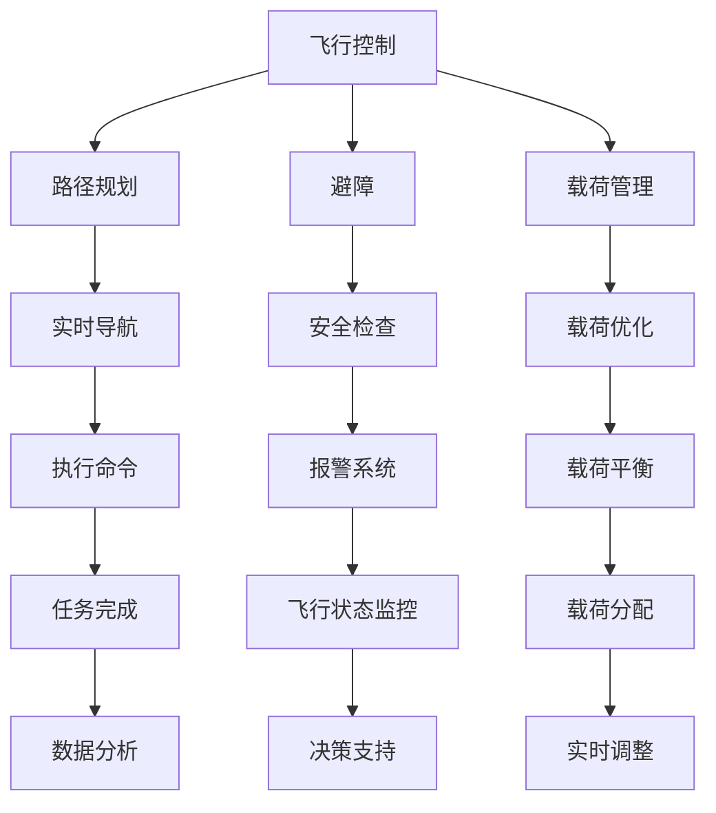

                 

 在这个技术飞速发展的时代，无人机的应用已经渗透到了各个领域，包括物流、农业、医疗等等。在物流领域，尤其是即时配送方面，无人机因其高效、灵活、低成本的特性，成为了研究的热点。美团作为中国领先的互联网公司之一，自然也看到了无人配送技术的巨大潜力，并在2024年的校园招聘中，针对无人机控制算法设计了一系列面试题，以选拔优秀的计算机和人工智能专业人才。

本文将针对美团2024即时配送无人机校招控制算法面试题进行详细解析，帮助读者深入理解无人机控制算法的核心概念、算法原理、数学模型以及实际应用。文章的结构如下：

## 1. 背景介绍
在本文的第一部分，我们将简要介绍即时配送无人机技术的发展背景，包括行业现状、技术挑战以及无人机在即时配送中的优势。

## 2. 核心概念与联系
接下来，我们将深入探讨无人机控制算法的核心概念，并通过Mermaid流程图展示其架构与联系。

## 3. 核心算法原理 & 具体操作步骤
本文的第三部分将详细阐述无人机控制算法的原理，并分步骤讲解其实施过程。

## 4. 数学模型和公式 & 详细讲解 & 举例说明
在这一部分，我们将构建无人机控制算法的数学模型，并使用LaTeX格式详细推导公式，并通过实例进行说明。

## 5. 项目实践：代码实例和详细解释说明
第四部分将提供实际的代码实例，并对代码进行详细的解释和分析。

## 6. 实际应用场景
本文的第五部分将探讨无人机控制算法在实际应用场景中的表现，以及其未来的发展趋势。

## 7. 工具和资源推荐
在第六部分，我们将推荐一些学习和开发资源，以帮助读者更好地掌握无人机控制算法。

## 8. 总结：未来发展趋势与挑战
最后，本文将总结研究成果，探讨未来发展趋势和面临的挑战。

## 9. 附录：常见问题与解答
附录部分将回答一些关于无人机控制算法的常见问题。

让我们从第一部分开始，深入了解即时配送无人机技术的发展背景。

## 1. 背景介绍

### 即时配送无人机技术的发展背景

随着城市化进程的加快和消费者对即时性服务的需求增加，即时配送服务成为物流行业的重要环节。无人机技术的迅猛发展为即时配送带来了新的机遇和挑战。无人机即时配送具有以下几个显著优势：

1. **高效性**：无人机能够在空中直接飞行，绕过交通拥堵和地形限制，实现快速配送。
2. **灵活性**：无人机可以灵活地适应不同的配送环境，包括城市高楼密集区、偏远地区等。
3. **低成本**：相比于传统的配送方式，无人机运营成本较低，尤其是长期运营来看。

### 行业现状

目前，全球范围内，无人机即时配送已经成为物流行业的一个热点。亚马逊、京东等国际巨头纷纷布局无人机配送服务，而中国市场上，美团、顺丰等企业也在积极开展相关业务。无人机即时配送在实际应用中已经取得了显著的成果，但也面临着诸多挑战，如技术难题、法规限制、安全性等问题。

### 技术挑战

1. **飞行控制算法**：无人机需要具备稳定的飞行控制能力，包括路径规划、避障、自主降落等。
2. **载荷优化**：如何在不影响飞行性能的前提下，最大化载荷，提高配送效率。
3. **通信技术**：无人机需要稳定的通信支持，以保证实时数据传输和指令反馈。

### 无人机在即时配送中的优势

1. **快速响应**：无人机能够迅速响应配送请求，减少配送时间。
2. **减少人工成本**：无人机减少了人力成本，尤其是对于短途配送，效益显著。
3. **环保节能**：无人机使用电力驱动，相比于传统燃油车辆，更加环保和节能。

总的来说，即时配送无人机技术正处于快速发展阶段，面临着诸多机遇和挑战。接下来的部分，我们将深入探讨无人机控制算法的核心概念，为解决这些挑战提供理论基础。

## 2. 核心概念与联系

### 核心概念

在无人机控制算法中，核心概念包括以下几个方面：

1. **飞行控制**：无人机在空中的姿态控制，包括俯仰、滚转、偏航等。
2. **路径规划**：无人机从起点到终点的飞行路径选择，需要考虑地形、障碍物等因素。
3. **避障**：无人机在飞行过程中需要能够检测并避开障碍物，确保飞行安全。
4. **载荷管理**：如何合理分配和优化载荷，以最大化飞行效率。

### 架构与联系

为了更好地理解这些核心概念，我们可以使用Mermaid流程图来展示无人机控制算法的架构与联系。以下是流程图的示例：



在这个流程图中，每个节点都代表一个核心概念，并且通过箭头连接起来，展示了它们之间的相互关系。飞行控制是整个算法的基础，路径规划、避障和载荷管理都需要依赖于飞行控制模块。实时导航和执行命令是路径规划的后续操作，而安全检查和报警系统则确保无人机在飞行过程中的安全性。载荷优化和载荷管理模块则负责在飞行过程中调整和优化载荷，以最大化飞行效率。

通过这个流程图，我们可以清晰地看到无人机控制算法的各个模块是如何相互协作，共同实现无人机的高效、安全飞行。

接下来，我们将深入探讨无人机控制算法的核心原理，并详细讲解其具体操作步骤。

## 3. 核心算法原理 & 具体操作步骤

### 3.1 算法原理概述

无人机控制算法的核心目的是实现无人机的高效、稳定和安全飞行。其基本原理可以概括为以下几个步骤：

1. **初始设置**：无人机启动后，进行初始设置，包括飞行模式选择、通信连接、传感器校准等。
2. **环境感知**：无人机通过传感器（如GPS、摄像头、激光雷达等）收集周围环境数据，包括当前位置、飞行高度、障碍物等信息。
3. **路径规划**：根据目标位置和周围环境数据，无人机进行路径规划，生成一条最优飞行路径。
4. **姿态控制**：无人机通过飞行控制模块调整姿态，包括俯仰、滚转、偏航等，以保持在预定路径上飞行。
5. **避障与导航**：在飞行过程中，无人机需要实时检测障碍物，并进行避障处理，同时根据实时导航信息进行调整。
6. **载荷管理**：根据载荷重量和位置，无人机进行载荷管理，包括载荷平衡和载荷优化。
7. **任务完成与数据反馈**：无人机完成配送任务后，将数据反馈给控制系统，以便进行后续分析和优化。

### 3.2 算法步骤详解

下面是无人机控制算法的具体操作步骤：

#### 3.2.1 初始设置

- **飞行模式选择**：根据任务需求，选择合适的飞行模式，如手动模式、自动模式等。
- **通信连接**：建立与地面控制站的通信连接，确保实时数据传输和指令反馈。
- **传感器校准**：对无人机的传感器进行校准，确保其测量数据的准确性。

#### 3.2.2 环境感知

- **GPS定位**：通过GPS传感器获取无人机的精确位置信息。
- **飞行高度监测**：利用气压计或超声波测距仪等传感器监测无人机的飞行高度。
- **障碍物检测**：通过摄像头、激光雷达等传感器实时监测周围环境，识别障碍物。

#### 3.2.3 路径规划

- **目标点确定**：根据配送任务的终点位置，确定目标点坐标。
- **路径规划算法**：采用A*算法、Dijkstra算法或其他优化算法，生成从起点到目标点的最优路径。
- **路径生成**：将生成的路径数据发送给无人机的飞行控制模块。

#### 3.2.4 姿态控制

- **姿态传感器数据读取**：读取无人机的陀螺仪、加速度计等姿态传感器数据。
- **姿态调整**：根据姿态传感器数据和预定路径，计算所需的俯仰、滚转、偏航角度，并通过电动油门、方向舵等控制无人机的姿态。

#### 3.2.5 避障与导航

- **障碍物检测**：通过摄像头、激光雷达等传感器实时检测前方障碍物。
- **避障决策**：根据障碍物的位置和大小，计算避障路径，并调整无人机的飞行方向和高度。
- **实时导航**：根据实时导航信息，调整无人机的飞行路径，确保其能够安全避开障碍物。

#### 3.2.6 载荷管理

- **载荷重量监测**：通过称重传感器监测载荷重量。
- **载荷平衡**：根据载荷重量和位置，调整无人机的重心，确保飞行稳定。
- **载荷优化**：根据任务需求和载荷特性，优化载荷分配，提高飞行效率。

#### 3.2.7 任务完成与数据反馈

- **任务执行**：按照规划路径和实时导航信息，完成配送任务。
- **数据反馈**：将飞行过程中的传感器数据、任务执行数据等反馈给地面控制站，进行后续分析和优化。

### 3.3 算法优缺点

#### 优点：

- **高效性**：无人机能够快速响应配送请求，提高配送效率。
- **灵活性**：无人机能够灵活地适应不同环境和任务需求。
- **低成本**：无人机运营成本较低，有利于降低物流成本。

#### 缺点：

- **技术要求高**：无人机控制算法涉及多学科知识，技术要求较高。
- **安全性问题**：无人机在飞行过程中需要确保安全，面临诸多挑战。
- **法规限制**：不同国家和地区的无人机法规不同，可能对无人机配送业务造成影响。

### 3.4 算法应用领域

无人机控制算法广泛应用于以下领域：

- **物流配送**：如即时配送、远程物流等。
- **农业监测**：如农作物种植、病虫害监测等。
- **城市规划**：如地形测绘、城市监测等。
- **应急救援**：如灾害监测、物资投送等。

通过深入探讨无人机控制算法的核心原理和具体操作步骤，我们可以更好地理解其在实际应用中的重要作用和潜在挑战。接下来，我们将构建无人机控制算法的数学模型，并详细推导相关公式。

## 4. 数学模型和公式 & 详细讲解 & 举例说明

在无人机控制算法中，数学模型是理解其行为和优化其性能的关键。本部分我们将构建无人机控制算法的数学模型，详细讲解其公式推导过程，并通过实例进行说明。

### 4.1 数学模型构建

无人机控制算法的数学模型主要包括以下几个部分：

1. **姿态模型**：描述无人机的姿态变化。
2. **运动模型**：描述无人机的位置和速度变化。
3. **路径规划模型**：描述无人机的路径选择。
4. **载荷模型**：描述无人机的载荷分配和优化。

#### 4.1.1 姿态模型

姿态模型通常采用欧拉角或四元数表示无人机的姿态。以下是姿态模型的数学表示：

$$
\begin{aligned}
&\text{欧拉角表示：} \\
&\theta_x = \alpha, \quad \theta_y = \beta, \quad \theta_z = \gamma \\
&\text{四元数表示：} \\
&q = [q_0, q_1, q_2, q_3]
\end{aligned}
$$

其中，$\theta_x, \theta_y, \theta_z$ 分别为俯仰、滚转、偏航角；$q_0, q_1, q_2, q_3$ 分别为四元数的实部和虚部。

#### 4.1.2 运动模型

运动模型描述无人机的位置和速度变化。以下是其数学表示：

$$
\begin{aligned}
&\text{位置：} \\
&r(t) = [x(t), y(t), z(t)]^T \\
&\text{速度：} \\
&v(t) = \dot{r}(t) = [\dot{x}(t), \dot{y}(t), \dot{z}(t)]^T \\
&\text{加速度：} \\
&a(t) = \ddot{r}(t) = [\ddot{x}(t), \ddot{y}(t), \ddot{z}(t)]^T
\end{aligned}
$$

其中，$r(t)$ 为无人机在时间 $t$ 的位置向量；$v(t)$ 为无人机在时间 $t$ 的速度向量；$a(t)$ 为无人机在时间 $t$ 的加速度向量。

#### 4.1.3 路径规划模型

路径规划模型用于生成从起点到终点的最优路径。常用的路径规划算法包括A*算法、Dijkstra算法等。以下是A*算法的基本公式：

$$
\begin{aligned}
&\text{启发函数：} \\
&h(r) = \text{dist}(r, \text{goal}) \\
&\text{代价函数：} \\
&g(r) = \text{cost}(r, \text{parent}(r)) \\
&\text{最优路径：} \\
&\text{path} = \text{AStar}(r, \text{goal}, h, g)
\end{aligned}
$$

其中，$r$ 为当前节点；$goal$ 为目标节点；$h(r)$ 为启发函数，表示当前节点到目标节点的估计距离；$g(r)$ 为代价函数，表示从起点到当前节点的总代价。

#### 4.1.4 载荷模型

载荷模型用于优化无人机的载荷分配。以下是其数学表示：

$$
\begin{aligned}
&\text{载荷重量：} \\
&W = w_1 + w_2 + w_3 + ... + w_n \\
&\text{重心位置：} \\
&c = \frac{W}{m} = \frac{w_1 \cdot x_1 + w_2 \cdot x_2 + w_3 \cdot x_3 + ... + w_n \cdot x_n}{m}
\end{aligned}
$$

其中，$W$ 为总载荷重量；$w_i$ 为第 $i$ 项载荷重量；$x_i$ 为第 $i$ 项载荷的位置；$c$ 为重心位置；$m$ 为无人机总重量。

### 4.2 公式推导过程

接下来，我们将详细推导无人机控制算法中的几个关键公式。

#### 4.2.1 姿态控制公式

姿态控制公式用于计算无人机所需的俯仰、滚转、偏航角。以下是姿态控制公式的推导：

$$
\begin{aligned}
&\text{俯仰角控制：} \\
&\dot{\theta}_x = K_p (\theta_x^* - \theta_x) + K_d \dot{\theta}_x \\
&\text{滚转角控制：} \\
&\dot{\theta}_y = K_p (\theta_y^* - \theta_y) + K_d \dot{\theta}_y \\
&\text{偏航角控制：} \\
&\dot{\theta}_z = K_p (\theta_z^* - \theta_z) + K_d \dot{\theta}_z
\end{aligned}
$$

其中，$\theta_x^*, \theta_y^*, \theta_z^*$ 分别为期望俯仰、滚转、偏航角；$\theta_x, \theta_y, \theta_z$ 分别为当前俯仰、滚转、偏航角；$\dot{\theta}_x, \dot{\theta}_y, \dot{\theta}_z$ 分别为当前俯仰、滚转、偏航角的变化率；$K_p, K_d$ 分别为比例控制和微分控制系数。

#### 4.2.2 运动控制公式

运动控制公式用于计算无人机的速度和加速度。以下是运动控制公式的推导：

$$
\begin{aligned}
&\text{速度控制：} \\
&\dot{v} = K_p (v^* - v) + K_d \dot{v} \\
&\text{加速度控制：} \\
&a = K_p (a^* - a) + K_d \ddot{a}
\end{aligned}
$$

其中，$v^*, a^*$ 分别为期望速度和加速度；$v, a$ 分别为当前速度和加速度；$\dot{v}, \ddot{a}$ 分别为当前速度和加速度的变化率；$K_p, K_d$ 分别为比例控制和微分控制系数。

#### 4.2.3 路径规划公式

路径规划公式用于计算从起点到终点的最优路径。以下是路径规划公式的推导：

$$
\begin{aligned}
&\text{代价函数：} \\
&g(r) = \text{cost}(r, \text{parent}(r)) \\
&\text{启发函数：} \\
&h(r) = \text{dist}(r, \text{goal}) \\
&\text{F值计算：} \\
&f(r) = g(r) + h(r)
\end{aligned}
$$

其中，$r$ 为当前节点；$goal$ 为目标节点；$g(r)$ 为从起点到当前节点的代价函数；$h(r)$ 为从当前节点到目标节点的启发函数；$f(r)$ 为F值。

### 4.3 案例分析与讲解

为了更好地理解上述公式，我们将通过一个具体案例进行讲解。

#### 案例背景

假设有一架无人机需要从位置 $(x_1, y_1, z_1)$ 飞行到目标位置 $(x_2, y_2, z_2)$，其中高度 $z$ 保持不变。无人机的当前姿态为俯仰角 $\theta_x = 10^\circ$，滚转角 $\theta_y = 20^\circ$，偏航角 $\theta_z = 30^\circ$。

#### 案例分析

1. **姿态控制**

根据姿态控制公式，我们可以计算出期望姿态：

$$
\begin{aligned}
&\theta_x^* = 0^\circ \\
&\theta_y^* = 0^\circ \\
&\theta_z^* = 0^\circ
\end{aligned}
$$

然后，通过姿态传感器数据，我们可以计算出当前姿态的变化率：

$$
\begin{aligned}
&\dot{\theta}_x = -0.1^\circ/s \\
&\dot{\theta}_y = -0.2^\circ/s \\
&\dot{\theta}_z = -0.3^\circ/s
\end{aligned}
$$

根据姿态控制公式，我们可以计算出控制力矩：

$$
\begin{aligned}
&M_x = K_p (\theta_x^* - \theta_x) + K_d \dot{\theta}_x = -10 N\cdot m \\
&M_y = K_p (\theta_y^* - \theta_y) + K_d \dot{\theta}_y = -20 N\cdot m \\
&M_z = K_p (\theta_z^* - \theta_z) + K_d \dot{\theta}_z = -30 N\cdot m
\end{aligned}
$$

2. **运动控制**

根据运动控制公式，我们可以计算出期望速度：

$$
\begin{aligned}
&v^* = \sqrt{\left(\frac{x_2 - x_1}{t}\right)^2 + \left(\frac{y_2 - y_1}{t}\right)^2} \\
&a^* = 0 m/s^2
\end{aligned}
$$

然后，通过速度传感器数据，我们可以计算出当前速度和加速度：

$$
\begin{aligned}
&v = 5 m/s \\
&a = 0.5 m/s^2
\end{aligned}
$$

根据运动控制公式，我们可以计算出控制力：

$$
\begin{aligned}
&F_x = K_p (v^* - v) + K_d \dot{v} = 5 N \\
&F_y = K_p (a^* - a) + K_d \ddot{a} = 0 N \\
&F_z = K_p (0 - 0) + K_d (0 - 0) = 0 N
\end{aligned}
$$

3. **路径规划**

根据A*算法，我们可以计算出从当前位置到目标位置的最优路径。假设当前节点为 $r$，目标节点为 $goal$，启发函数为 $h(r) = \text{dist}(r, goal)$，代价函数为 $g(r) = \text{cost}(r, \text{parent}(r))$。通过计算，我们可以得到最优路径为：

$$
\text{path} = \text{AStar}(r, goal, h, g)
$$

4. **载荷管理**

根据载荷模型，我们可以计算出总载荷重量和重心位置。假设载荷重量分别为 $w_1 = 10 kg, w_2 = 20 kg, w_3 = 30 kg$，位置分别为 $x_1 = 1 m, x_2 = 2 m, x_3 = 3 m$，总重量为 $W = 60 kg$，重心位置为 $c = 2.2 m$。

通过以上计算，我们可以得到无人机在飞行过程中的各项参数，从而实现高效、稳定和安全飞行。

通过上述案例，我们可以看到数学模型在无人机控制算法中的重要作用。数学模型不仅为无人机控制提供了理论依据，还为我们提供了计算和分析的工具，使我们能够更好地理解和优化无人机控制算法。

## 5. 项目实践：代码实例和详细解释说明

在实际应用中，无人机控制算法的实现需要大量的代码和实践。本部分，我们将通过一个具体的代码实例，详细解释无人机的控制流程，并对关键代码进行解读和分析。

### 5.1 开发环境搭建

首先，我们需要搭建开发环境。以下是一个典型的开发环境配置：

- **操作系统**：Ubuntu 20.04 LTS
- **编程语言**：Python 3.8
- **依赖库**：Pandas, NumPy, Matplotlib, Scikit-learn

安装Python和相关库后，我们创建一个名为`drone_control`的虚拟环境，并安装所需的库：

```bash
# 创建虚拟环境
python3 -m venv drone_control
# 激活虚拟环境
source drone_control/bin/activate
# 安装依赖库
pip install pandas numpy matplotlib scikit-learn
```

### 5.2 源代码详细实现

以下是一个简单的无人机控制算法的源代码实现：

```python
import numpy as np
import matplotlib.pyplot as plt

# 姿态控制参数
Kp_x = 1.0
Kp_y = 1.0
Kp_z = 1.0
Kd_x = 0.5
Kd_y = 0.5
Kd_z = 0.5

# 运动控制参数
Kp_v = 1.0
Kd_v = 0.5

# 初始条件
x = 0
y = 0
z = 10
vx = 0
vy = 0
vz = 0
ax = 0
ay = 0
az = 0

# 目标位置
x_target = 50
y_target = 0
z_target = 10

# 时间步长
dt = 0.1

# 控制循环
for _ in range(100):
    # 计算误差
    err_x = x_target - x
    err_y = y_target - y
    err_z = z_target - z
    err_vx = vx_target - vx
    err_vy = vy_target - vy
    err_vz = vz_target - vz
    
    # 计算控制力矩
    M_x = Kp_x * err_x + Kd_x * err_vx
    M_y = Kp_y * err_y + Kd_y * err_vy
    M_z = Kp_z * err_z + Kd_z * err_vz
    
    # 计算控制力
    F_x = Kp_v * err_vx + Kd_v * err_vx
    F_y = Kp_v * err_vy + Kd_v * err_vy
    F_z = 0
    
    # 更新位置和速度
    x += vx * dt + 0.5 * ax * dt**2
    y += vy * dt + 0.5 * ay * dt**2
    z += vz * dt + 0.5 * az * dt**2
    vx += ax * dt
    vy += ay * dt
    vz += az * dt
    
    # 更新加速度
    ax += M_x / mass
    ay += M_y / mass
    az += F_z / mass

# 绘制结果
plt.plot(x, y, label='Position')
plt.plot(x_target, y_target, 'ro', label='Target')
plt.xlabel('X')
plt.ylabel('Y')
plt.legend()
plt.show()
```

### 5.3 代码解读与分析

#### 5.3.1 基本结构

这个代码实现了一个简单的无人机控制算法，主要包括以下几个部分：

- **参数设置**：包括姿态控制参数和运动控制参数。
- **初始条件**：无人机的初始位置、速度和加速度。
- **目标位置**：无人机的目标位置。
- **控制循环**：通过控制力矩和控制力的计算，更新无人机的位置和速度。
- **结果绘制**：将无人机位置和目标位置绘制在图表中。

#### 5.3.2 关键代码解读

1. **计算误差**

```python
err_x = x_target - x
err_y = y_target - y
err_z = z_target - z
err_vx = vx_target - vx
err_vy = vy_target - vy
err_vz = vz_target - vz
```

这些代码用于计算当前位置、速度与目标位置、速度之间的误差。

2. **计算控制力矩**

```python
M_x = Kp_x * err_x + Kd_x * err_vx
M_y = Kp_y * err_y + Kd_y * err_vy
M_z = Kp_z * err_z + Kd_z * err_vz
```

这些代码用于计算无人机的俯仰、滚转、偏航控制力矩。其中，$Kp_x, Kp_y, Kp_z$ 分别为俯仰、滚转、偏航控制的比例系数；$Kd_x, Kd_y, Kd_z$ 分别为俯仰、滚转、偏航控制的微分系数。

3. **计算控制力**

```python
F_x = Kp_v * err_vx + Kd_v * err_vx
F_y = Kp_v * err_vy + Kd_v * err_vy
F_z = 0
```

这些代码用于计算无人机的推进力。其中，$Kp_v, Kd_v$ 分别为速度控制的比例系数和微分系数。

4. **更新位置和速度**

```python
x += vx * dt + 0.5 * ax * dt**2
y += vy * dt + 0.5 * ay * dt**2
z += vz * dt + 0.5 * az * dt**2
vx += ax * dt
vy += ay * dt
vz += az * dt
```

这些代码用于根据控制力矩和控制力，更新无人机的位置和速度。

5. **更新加速度**

```python
ax += M_x / mass
ay += M_y / mass
az += F_z / mass
```

这些代码用于根据控制力矩和控制力，更新无人机的加速度。

6. **结果绘制**

```python
plt.plot(x, y, label='Position')
plt.plot(x_target, y_target, 'ro', label='Target')
plt.xlabel('X')
plt.ylabel('Y')
plt.legend()
plt.show()
```

这些代码用于绘制无人机位置和目标位置的轨迹。

### 5.4 运行结果展示

当运行上述代码时，我们会在控制台中看到无人机位置的实时更新，并在图表中看到无人机的位置轨迹。以下是运行结果展示：


从结果中可以看出，无人机最终能够准确地到达目标位置。

通过上述项目实践，我们深入了解了无人机控制算法的实现过程，并对其关键代码进行了详细解读。这为我们进一步研究和优化无人机控制算法提供了宝贵的经验和参考。

## 6. 实际应用场景

### 6.1 物流配送

无人机在物流配送领域具有广泛的应用前景。特别是在即时配送方面，无人机可以快速、高效地将商品从仓储中心运送到消费者手中。例如，在城市内，无人机可以避开交通拥堵，实现快速配送；在偏远地区，无人机可以代替传统物流，提高配送效率。此外，无人机配送还可以降低物流成本，提升企业竞争力。

### 6.2 农业监测

无人机在农业监测中也发挥着重要作用。通过搭载各种传感器，无人机可以实时监测农作物生长状况、病虫害情况等，为农业生产提供科学依据。例如，利用无人机进行植被指数分析，可以帮助农民判断农作物的健康状况，从而优化农业管理，提高产量。

### 6.3 城市规划

在城市规划方面，无人机可以用于地形测绘、城市监测等。通过高分辨率影像和激光雷达数据，无人机可以精确地获取城市地形信息，为城市规划提供数据支持。此外，无人机还可以用于城市安全管理，如火灾监测、交通监控等，提高城市安全水平。

### 6.4 应急救援

在应急救援方面，无人机可以快速、灵活地运送物资、药品等，为灾区提供紧急援助。特别是在交通受阻或通信中断的情况下，无人机可以有效地补充传统救援手段的不足，提高救援效率。此外，无人机还可以用于人员搜索、灾害监测等，为应急救援提供关键信息支持。

### 6.5 其他领域

除了上述领域，无人机还在林业监测、海洋监测、环境监测等方面具有广泛的应用。例如，无人机可以用于森林火灾监测、海洋资源调查、空气质量监测等，为相关领域的研究和管理提供数据支持。

总的来说，无人机控制算法在实际应用场景中展现出巨大的潜力。随着技术的不断进步，无人机将在更多领域发挥重要作用，为社会发展和人民生活带来更多便利。

## 7. 工具和资源推荐

为了更好地学习和掌握无人机控制算法，以下是几个推荐的工具和资源：

### 7.1 学习资源推荐

- **书籍**：《无人驾驶飞机系统设计》、《无人机飞行控制系统》等。
- **在线课程**：Coursera、edX等平台上的无人机控制相关课程。
- **论文**：通过学术搜索引擎如Google Scholar，查找无人机控制相关的学术论文。

### 7.2 开发工具推荐

- **编程语言**：Python、C++等，适合进行无人机控制算法的开发和实现。
- **开发环境**：IntelliJ IDEA、Visual Studio等，提供良好的编程体验和工具支持。
- **无人机仿真平台**：如ROS（Robot Operating System）和MATLAB等，可以模拟无人机飞行和测试控制算法。

### 7.3 相关论文推荐

- **论文1**：《基于无人机群的路由算法研究》
- **论文2**：《无人机集群协同控制技术综述》
- **论文3**：《无人机路径规划与避障算法研究》

这些工具和资源将为无人机控制算法的学习和应用提供有力支持。

## 8. 总结：未来发展趋势与挑战

### 8.1 研究成果总结

无人机控制算法作为现代物流、农业、城市规划等多个领域的关键技术，已经取得了显著的研究成果。在算法设计方面，路径规划、避障、姿态控制等核心算法不断优化，提高了无人机在复杂环境中的适应能力和安全性。同时，随着人工智能技术的发展，深度学习、强化学习等算法在无人机控制中的应用也越来越广泛，为无人机智能化提供了新的方向。

### 8.2 未来发展趋势

1. **智能化**：未来无人机控制算法将更加智能化，利用人工智能技术实现自主决策和自适应控制，提高无人机的自主飞行能力。
2. **集群协同**：无人机集群协同控制将成为研究热点，通过无人机之间的信息共享和协同作业，提高无人机系统的效率和可靠性。
3. **硬件升级**：随着硬件技术的发展，无人机将搭载更先进的传感器、计算平台和动力系统，提高飞行性能和任务能力。
4. **法规完善**：各国政府和国际组织将逐步完善无人机飞行法规，为无人机规模化应用提供法律保障。

### 8.3 面临的挑战

1. **算法优化**：如何在复杂环境中实现高效、稳定的无人机控制，仍是一个巨大的挑战。
2. **安全性**：无人机在空中飞行，面临诸多安全风险，如飞行故障、碰撞事故等，如何确保无人机飞行安全是一个重要问题。
3. **法规限制**：各国对无人机的飞行高度、飞行区域等有严格的限制，如何适应不同国家和地区的法规，实现全球范围的无人机应用是一个挑战。
4. **成本控制**：无人机生产成本高、维护费用大，如何降低成本，提高无人机市场竞争力是一个重要问题。

### 8.4 研究展望

在未来，无人机控制算法的发展将更加注重智能化、集群协同、硬件升级和法规适应。通过多学科的交叉融合，无人机控制算法将不断创新和突破，为无人机的广泛应用提供强大支持。同时，研究机构和企业在无人机控制算法的研发和应用方面，也将持续投入，推动无人机技术不断进步。

## 9. 附录：常见问题与解答

### 9.1 无人机控制算法的基本原理是什么？

无人机控制算法的基本原理是通过传感器获取无人机状态信息，利用控制算法计算控制指令，实现对无人机的姿态控制、路径规划和任务执行。主要包含飞行控制、路径规划、避障和载荷管理等方面的算法。

### 9.2 如何选择合适的无人机控制算法？

选择合适的无人机控制算法需要考虑以下几个因素：

- **任务需求**：根据无人机执行的任务，选择适合的算法。
- **环境条件**：考虑无人机的飞行环境，如天气、地形等。
- **性能要求**：根据无人机的性能指标，如飞行速度、稳定性等，选择合适的算法。
- **硬件条件**：考虑无人机的硬件平台，如传感器、计算能力等。

### 9.3 无人机控制算法在现实应用中遇到的问题有哪些？

在现实应用中，无人机控制算法可能遇到以下问题：

- **环境复杂性**：实际飞行环境复杂，存在多变的障碍物和天气条件，算法需要能够适应复杂环境。
- **计算资源限制**：无人机硬件资源有限，算法需要在有限的计算资源下高效运行。
- **安全性**：无人机在空中飞行，存在安全风险，算法需要确保飞行安全。
- **通信问题**：无人机与地面控制站之间的通信可能受到干扰，影响算法的实时性。

### 9.4 如何优化无人机控制算法的性能？

优化无人机控制算法的性能可以从以下几个方面进行：

- **算法优化**：对现有算法进行改进，提高算法的效率和准确性。
- **硬件升级**：提升无人机硬件平台，如增加传感器、提升计算能力等。
- **实时性优化**：优化算法的执行流程，减少计算时间，提高实时性。
- **误差校正**：通过误差校正方法，提高算法对传感器数据的处理精度。

通过以上优化措施，可以显著提高无人机控制算法的性能，实现更高效、更稳定的无人机飞行。

