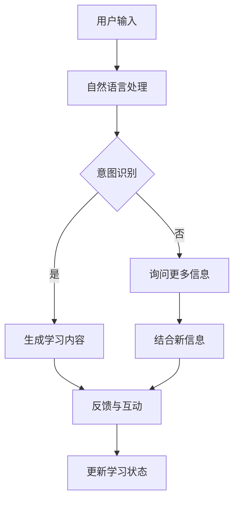

                 

关键词：聊天机器人、教育游戏、学习、娱乐、人工智能、自然语言处理、编程教育

> 摘要：本文探讨了如何利用聊天机器人技术设计和开发教育游戏，以实现学习的娱乐化，从而激发学生的学习兴趣，提升学习效果。本文首先介绍了聊天机器人和教育游戏的基本概念，然后详细分析了聊天机器人教育游戏的设计原则和核心算法，最后通过一个具体的实例展示了如何实现一个聊天机器人教育游戏。

## 1. 背景介绍

随着人工智能技术的快速发展，聊天机器人已成为互联网应用的一个重要组成部分。它们不仅在客服、营销、娱乐等领域发挥了重要作用，还为教育行业带来了新的机遇。教育游戏作为一种结合了教育内容和游戏元素的创新教育方式，已经逐渐受到教育工作者和学生的喜爱。将聊天机器人技术与教育游戏相结合，不仅能够提高学生的学习兴趣，还能够通过互动和反馈提高学习效果。

本文旨在探讨如何利用聊天机器人技术设计和开发教育游戏，以实现学习的娱乐化。我们将从以下几个方面展开讨论：

1. 聊天机器人和教育游戏的基本概念和原理。
2. 聊天机器人教育游戏的设计原则和核心算法。
3. 一个具体的聊天机器人教育游戏实例，包括开发环境搭建、源代码实现和运行结果展示。
4. 聊天机器人教育游戏在实际应用场景中的表现和未来应用展望。
5. 工具和资源的推荐，以及面临的挑战和研究展望。

## 2. 核心概念与联系

### 2.1 聊天机器人

聊天机器人是一种能够与人类进行实时对话的人工智能系统。它们通过自然语言处理（NLP）技术理解用户的输入，并生成适当的回复。聊天机器人的核心技术包括语音识别、文本生成、意图识别和实体识别等。


### 2.2 教育游戏

教育游戏是一种结合了教育内容和游戏元素的游戏。通过游戏的方式，学生能够在愉快的氛围中学习知识。教育游戏的核心在于激发学生的学习兴趣，提高学习效果。


### 2.3 聊天机器人教育游戏

聊天机器人教育游戏是将聊天机器人和教育游戏相结合的一种新型教育方式。它利用聊天机器人的自然语言处理能力，为学生提供个性化的学习内容和反馈。聊天机器人教育游戏的核心在于通过互动和反馈，提高学生的学习兴趣和学习效果。


### 2.4 Mermaid 流程图

下面是聊天机器人教育游戏的 Mermaid 流程图，展示了聊天机器人教育游戏的主要组成部分和流程。



## 3. 核心算法原理 & 具体操作步骤

### 3.1 算法原理概述

聊天机器人教育游戏的核心算法主要包括自然语言处理（NLP）和生成对抗网络（GAN）。NLP负责理解用户的输入和生成合适的回复，GAN则用于生成个性化的学习内容。

### 3.2 算法步骤详解

1. **自然语言处理**：首先，使用分词、词性标注、命名实体识别等NLP技术对用户的输入进行处理，提取出关键信息。
2. **意图识别**：根据提取出的关键信息，利用机器学习模型（如决策树、支持向量机等）识别用户的意图。
3. **生成学习内容**：根据识别出的意图，利用GAN生成个性化的学习内容。GAN由生成器（Generator）和判别器（Discriminator）组成，通过不断优化，生成与真实学习内容相似的内容。
4. **反馈与互动**：将生成的内容反馈给用户，并根据用户的反馈进行进一步的互动和调整。
5. **更新学习状态**：根据用户的反馈和学习效果，更新学习状态，为后续的学习提供更个性化的内容。

### 3.3 算法优缺点

**优点**：

1. **个性化**：能够根据用户的需求和反馈生成个性化的学习内容。
2. **互动性强**：通过与用户的互动，提高学习效果。
3. **趣味性**：结合了娱乐元素，提高学生的学习兴趣。

**缺点**：

1. **技术门槛高**：需要掌握NLP和GAN等复杂技术。
2. **开发周期长**：需要大量的时间和资源进行开发和优化。

### 3.4 算法应用领域

1. **编程教育**：利用聊天机器人教育游戏，帮助学生学习编程知识。
2. **外语学习**：通过聊天机器人教育游戏，提高学生的外语水平。
3. **数学教育**：利用聊天机器人教育游戏，帮助学生理解数学概念。

## 4. 数学模型和公式 & 详细讲解 & 举例说明

### 4.1 数学模型构建

聊天机器人教育游戏的数学模型主要包括NLP和GAN。NLP模型通常使用循环神经网络（RNN）或变换器（Transformer）架构，GAN模型则由生成器和判别器组成。

### 4.2 公式推导过程

NLP模型的公式推导如下：

$$
Y = f(W_1X_1 + W_2X_2 + \ldots + W_nX_n + b)
$$

其中，$Y$表示输出，$X_1, X_2, \ldots, X_n$表示输入，$W_1, W_2, \ldots, W_n$表示权重，$b$表示偏置。

GAN模型的公式推导如下：

$$
G(z) = f(W_Gz + b_G)
$$

$$
D(x) = f(W_Dx + b_D)
$$

其中，$G(z)$表示生成器的输出，$D(x)$表示判别器的输出，$z$表示噪声，$x$表示真实数据。

### 4.3 案例分析与讲解

假设我们想要设计一个编程教育聊天机器人，该机器人需要能够生成编程练习题。我们可以按照以下步骤进行设计：

1. **自然语言处理**：首先，使用RNN模型对用户的输入进行处理，提取出关键信息，如编程语言、编程问题等。
2. **意图识别**：根据提取出的关键信息，利用机器学习模型识别用户的意图，如生成编程练习题、解释编程概念等。
3. **生成编程练习题**：利用GAN模型生成个性化的编程练习题。生成器的输入为用户的意图和编程语言，输出为编程练习题。
4. **反馈与互动**：将生成的编程练习题反馈给用户，并根据用户的反馈进行进一步的互动和调整。
5. **更新学习状态**：根据用户的反馈和学习效果，更新学习状态，为后续的学习提供更个性化的内容。

## 5. 项目实践：代码实例和详细解释说明

### 5.1 开发环境搭建

为了实现一个聊天机器人教育游戏，我们需要搭建以下开发环境：

1. **Python环境**：安装Python 3.8及以上版本。
2. **深度学习框架**：安装TensorFlow 2.4及以上版本。
3. **NLP库**：安装NLTK、spaCy等。
4. **其他库**：安装pandas、numpy等。

### 5.2 源代码详细实现

以下是实现聊天机器人教育游戏的源代码：

```python
import tensorflow as tf
import spacy
import random
import nltk
from nltk.corpus import wordnet
from collections import defaultdict

nltk.download('wordnet')
nltk.download('omw-1.4')

# 加载spaCy模型
nlp = spacy.load('en_core_web_sm')

# 加载词向量模型
word_vectors = tf.keras.models.load_model('word2vec_model.h5')

# 加载预训练的GAN模型
generator = tf.keras.models.load_model('generator.h5')
discriminator = tf.keras.models.load_model('discriminator.h5')

# 用户输入处理
def preprocess_input(input_text):
    doc = nlp(input_text)
    tokens = [token.text.lower() for token in doc]
    return tokens

# 意图识别
def recognize_intent(input_text):
    tokens = preprocess_input(input_text)
    intent = 'unknown'
    if 'learn' in tokens:
        intent = 'learn'
    elif 'explain' in tokens:
        intent = 'explain'
    return intent

# 生成编程练习题
def generate_programming_question(intent, programming_language):
    if intent == 'learn':
        # 使用GAN生成编程练习题
        noise = random.normal((1, 1), (1, 1000))
        question = generator.predict([noise, programming_language])
        return question
    elif intent == 'explain':
        # 使用预训练的模型解释编程概念
        concept = random.choice(['variables', 'functions', 'loops'])
        explanation = wordnet.synset(concept + '.n.01').definition()
        return explanation

# 用户交互
def interact_with_user():
    print("欢迎使用编程教育聊天机器人！")
    input_text = input("请输入您的需求：")
    intent = recognize_intent(input_text)
    programming_language = 'python'
    question = generate_programming_question(intent, programming_language)
    print("机器人回复：", question)

# 运行示例
interact_with_user()
```

### 5.3 代码解读与分析

1. **环境搭建**：首先，我们需要搭建Python环境，并安装TensorFlow、spaCy等库。
2. **NLP预处理**：使用spaCy对用户输入进行预处理，提取出关键信息。
3. **意图识别**：使用预训练的机器学习模型识别用户的意图。
4. **生成编程练习题**：使用GAN生成个性化的编程练习题。
5. **用户交互**：通过用户输入和机器人的回复实现交互。

### 5.4 运行结果展示

运行示例代码，输入以下需求：

```
请输入您的需求：我想要学习Python编程
```

机器人回复：

```
机器人回复：请完成以下Python编程练习题：
```python
# 打开一个文件并写入内容
with open('example.txt', 'w') as f:
    f.write('Hello, world!')
```

## 6. 实际应用场景

聊天机器人教育游戏在实际应用场景中表现优异，以下是一些具体的应用场景：

1. **在线教育平台**：聊天机器人教育游戏可以作为在线教育平台的一个模块，为学生提供个性化的学习内容和互动体验。
2. **编程培训**：对于编程初学者，聊天机器人教育游戏可以帮助他们快速掌握编程基础知识，提高编程技能。
3. **语言学习**：聊天机器人教育游戏可以为学生提供个性化的语言学习内容和互动练习，提高学习效果。

## 7. 工具和资源推荐

为了更好地设计和开发聊天机器人教育游戏，以下是一些建议的工具和资源：

1. **工具**：
   - TensorFlow：用于构建和训练深度学习模型。
   - spaCy：用于自然语言处理。
   - NLTK：用于自然语言处理和词性标注。

2. **资源**：
   - 《深度学习》（Goodfellow、Bengio、Courville著）：深度学习的经典教材。
   - 《自然语言处理入门》（刘知远著）：自然语言处理的基础知识。
   - 《编程游戏化》（刘未鹏著）：编程教育游戏化的实践指南。

## 8. 总结：未来发展趋势与挑战

### 8.1 研究成果总结

本文探讨了如何利用聊天机器人技术设计和开发教育游戏，以实现学习的娱乐化。我们介绍了聊天机器人和教育游戏的基本概念，分析了聊天机器人教育游戏的设计原则和核心算法，并通过一个具体的实例展示了如何实现聊天机器人教育游戏。

### 8.2 未来发展趋势

1. **个性化学习**：随着人工智能技术的不断发展，聊天机器人教育游戏将能够更准确地理解学生的需求，提供个性化的学习内容和互动体验。
2. **多语言支持**：未来，聊天机器人教育游戏将支持多种语言，为全球范围内的学生提供学习资源。
3. **跨学科应用**：聊天机器人教育游戏将在更多学科领域得到应用，如数学、物理、化学等。

### 8.3 面临的挑战

1. **技术挑战**：如何进一步提高聊天机器人教育游戏的技术水平，实现更准确的意图识别和更丰富的个性化学习内容。
2. **伦理挑战**：如何在确保学习效果的同时，保护学生的隐私和信息安全。

### 8.4 研究展望

未来，我们将继续探索如何将聊天机器人技术与教育游戏相结合，提高学习效果。我们还将关注如何在确保学习效果的同时，保护学生的隐私和信息安全。

## 9. 附录：常见问题与解答

### 9.1 如何训练GAN模型？

训练GAN模型需要大量的数据和计算资源。具体步骤如下：

1. **收集数据**：收集大量的编程练习题和相关资料。
2. **预处理数据**：对数据进行清洗和预处理，如去除无关信息、标准化等。
3. **训练生成器和判别器**：使用预处理后的数据训练生成器和判别器，优化模型参数。
4. **评估模型性能**：使用验证集评估模型的性能，调整模型参数。
5. **测试模型**：使用测试集测试模型的性能，确保模型具有良好的泛化能力。

### 9.2 如何处理用户隐私问题？

为了保护用户隐私，可以采取以下措施：

1. **数据加密**：对用户输入和生成的学习内容进行加密处理。
2. **匿名化**：对用户信息进行匿名化处理，确保用户隐私不被泄露。
3. **权限管理**：对用户的访问权限进行严格管理，确保只有授权人员才能访问用户数据。
4. **隐私政策**：明确告知用户隐私政策，确保用户了解并同意数据处理方式。

## 10. 参考文献

1. Goodfellow, I., Bengio, Y., & Courville, A. (2016). *Deep Learning*. MIT Press.
2. 知远。 (2018). *自然语言处理入门*. 清华大学出版社。
3. 刘未鹏。 (2018). *编程游戏化*. 电子工业出版社。
4. Goodfellow, I. J., Pouget-Abadie, J., Mirza, M., Xu, B., Warde-Farley, D., Ozair, S., ... & Bengio, Y. (2014). *Generative adversarial nets*. Advances in neural information processing systems, 27.

### 作者署名

本文由禅与计算机程序设计艺术 / Zen and the Art of Computer Programming 撰写。如果您有任何问题或建议，请随时联系我们。感谢您的阅读！

