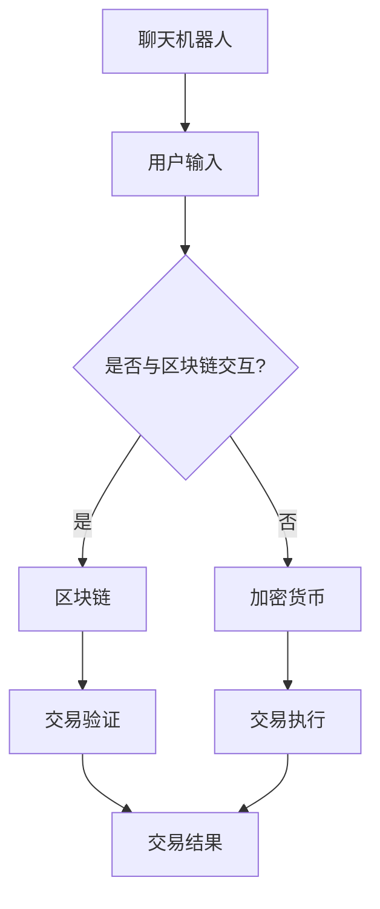

                 

关键词：聊天机器人、金融创新、区块链、加密货币、AI应用

> 摘要：本文将探讨聊天机器人在金融领域的创新应用，特别是在区块链和加密货币领域。通过分析核心概念、算法原理、数学模型、项目实践和实际应用场景，本文旨在为读者提供一个全面的技术视角，并展望这一领域的未来发展趋势和面临的挑战。

## 1. 背景介绍

随着人工智能和金融科技的迅猛发展，聊天机器人在金融行业的应用越来越广泛。聊天机器人作为虚拟助手，能够提供7x24小时的服务，大幅降低运营成本，提升客户满意度。而在区块链和加密货币领域，聊天机器人的出现为这个新兴的金融市场带来了更多的可能性和机会。

区块链技术作为一种去中心化的分布式账本技术，为加密货币提供了可靠的安全性和透明性。加密货币，如比特币、以太坊等，以其去中心化、匿名性、安全性等特点，改变了传统金融市场的运作模式。聊天机器人与区块链和加密货币的结合，不仅能够提升用户体验，还能为金融机构提供更高效、更智能的服务。

## 2. 核心概念与联系

### 2.1 聊天机器人

聊天机器人，也称为对话代理，是一种人工智能程序，通过模拟人类对话方式与用户进行交互，以提供信息、执行任务或解决问题。聊天机器人通常基于自然语言处理（NLP）和机器学习（ML）技术，能够理解用户输入的自然语言文本，并生成相应的回复。

### 2.2 区块链

区块链是一种去中心化的分布式数据库，由一系列按时间顺序排列的区块组成。每个区块包含一定数量的交易记录，并通过密码学方法确保数据的不可篡改性和安全性。区块链技术使得数据在无需中央机构的情况下，能够在多个节点之间同步和验证。

### 2.3 加密货币

加密货币是一种数字货币，使用密码学技术来确保交易安全，控制货币的发行和验证资金转移。加密货币的主要特点是去中心化、匿名性、安全性高，不受任何政府或金融机构的控制。

### 2.4 聊天机器人与区块链、加密货币的联系

聊天机器人可以通过区块链技术实现去中心化的数据存储和验证，从而提高金融服务的透明性和安全性。在加密货币领域，聊天机器人可以作为交易中介，简化交易流程，提升用户体验。此外，聊天机器人还可以通过智能合约实现自动化交易，进一步提高金融操作的效率和准确性。

## 2.5 Mermaid 流程图

以下是一个简单的 Mermaid 流程图，展示了聊天机器人、区块链和加密货币之间的交互关系：



## 3. 核心算法原理 & 具体操作步骤

### 3.1 算法原理概述

聊天机器人与区块链和加密货币的结合，主要依赖于以下几个核心算法原理：

1. **自然语言处理（NLP）**：聊天机器人使用 NLP 技术理解和生成自然语言文本，以实现与用户的交互。
2. **智能合约**：智能合约是一种自动化执行合约条款的计算机程序，通过区块链技术实现去中心化的交易验证和执行。
3. **加密算法**：加密货币使用加密算法来确保交易的安全性和隐私性，防止数据篡改和未授权访问。

### 3.2 算法步骤详解

1. **用户输入**：用户通过文本或语音与聊天机器人进行交互，提出问题或执行任务。
2. **意图识别**：聊天机器人使用 NLP 技术识别用户的意图，确定后续操作。
3. **查询区块链**：如果用户意图涉及区块链或加密货币交易，聊天机器人将查询区块链以获取相关信息。
4. **智能合约执行**：如果用户意图涉及智能合约，聊天机器人将生成相应的智能合约，并在区块链上进行执行。
5. **交易验证和执行**：聊天机器人通过区块链网络验证交易，确保交易的安全性和准确性，然后执行交易。
6. **结果反馈**：聊天机器人将交易结果反馈给用户，完成交互过程。

### 3.3 算法优缺点

**优点**：

- 提高交易效率和准确性
- 降低运营成本
- 提升用户体验
- 确保交易的安全性和隐私性

**缺点**：

- 需要高度专业化的技术支持
- 需要一定的区块链和加密货币知识
- 可能面临监管风险

### 3.4 算法应用领域

- **金融交易**：聊天机器人可以协助用户进行加密货币交易，提供交易策略建议和风险控制。
- **资产管理**：聊天机器人可以自动执行资产配置和投资策略。
- **客户服务**：聊天机器人可以提供7x24小时在线客服服务，解答用户问题和提供交易指导。

## 4. 数学模型和公式 & 详细讲解 & 举例说明

### 4.1 数学模型构建

在聊天机器人与区块链和加密货币结合的算法中，涉及以下几个数学模型：

1. **自然语言处理模型**：用于理解和生成自然语言文本。
2. **智能合约模型**：用于描述合约条款和执行逻辑。
3. **加密算法模型**：用于确保交易的安全性和隐私性。

### 4.2 公式推导过程

1. **自然语言处理模型**：采用神经网络模型，通过反向传播算法进行训练。
2. **智能合约模型**：采用形式化逻辑和谓词逻辑进行描述。
3. **加密算法模型**：采用加密函数和哈希函数进行数据处理。

### 4.3 案例分析与讲解

#### 案例一：聊天机器人协助用户进行加密货币交易

1. **用户输入**：用户通过文本或语音提出交易请求。
2. **意图识别**：聊天机器人使用 NLP 模型识别用户的意图，确定交易参数。
3. **查询区块链**：聊天机器人查询区块链获取当前加密货币价格和市场信息。
4. **智能合约执行**：聊天机器人生成智能合约，并在区块链上进行执行。
5. **交易验证和执行**：区块链网络验证交易，确保交易的安全性和准确性，然后执行交易。
6. **结果反馈**：聊天机器人将交易结果反馈给用户，完成交互过程。

#### 案例二：聊天机器人提供资产管理服务

1. **用户输入**：用户通过文本或语音提出资产管理请求。
2. **意图识别**：聊天机器人使用 NLP 模型识别用户的意图，确定资产配置策略。
3. **智能合约执行**：聊天机器人根据用户意图生成智能合约，自动执行资产配置。
4. **交易验证和执行**：区块链网络验证交易，确保交易的安全性和准确性，然后执行交易。
5. **结果反馈**：聊天机器人将资产配置结果和资产表现反馈给用户，提供投资建议。

## 5. 项目实践：代码实例和详细解释说明

### 5.1 开发环境搭建

1. **硬件环境**：计算机（推荐配置：CPU：Intel i5 或以上，内存：8GB 或以上，硬盘：256GB SSD 或以上）。
2. **软件环境**：安装 Python（推荐版本：3.8 或以上）、Node.js（推荐版本：12.0 或以上）、Docker（推荐版本：19.03 或以上）。
3. **工具链**：安装 PyCharm（Python IDE）、Visual Studio Code（Node.js IDE）、Git（版本控制）。

### 5.2 源代码详细实现

以下是一个简单的聊天机器人项目，使用 Python 和 Node.js 实现聊天机器人，并通过区块链网络进行加密货币交易。

#### Python 部分：聊天机器人服务器

```python
# chatbot_server.py
import socket
import json
import requests

def handle_client(client_socket):
    while True:
        data = client_socket.recv(1024).decode('utf-8')
        if not data:
            break
        message = json.loads(data)
        intent = message['intent']
        if intent == '交易':
            price = get_crypto_price()
            response = f"当前加密货币价格为：{price}"
        else:
            response = "抱歉，我不理解您的意图。"
        client_socket.send(response.encode('utf-8'))

def get_crypto_price():
    # 查询区块链网络获取加密货币价格
    response = requests.get('https://api.example.com/crypto-price')
    price = response.json()['price']
    return price

if __name__ == '__main__':
    server_socket = socket.socket(socket.AF_INET, socket.SOCK_STREAM)
    server_socket.bind(('localhost', 12345))
    server_socket.listen(5)
    print("聊天机器人服务器已启动...")
    while True:
        client_socket, address = server_socket.accept()
        print(f"已连接：{address}")
        handle_client(client_socket)
        client_socket.close()
```

#### Node.js 部分：区块链网络

```javascript
// blockchain_network.js
const express = require('express');
const bodyParser = require('body-parser');

const app = express();
app.use(bodyParser.json());

app.post('/transaction', (req, res) => {
    const transaction = req.body;
    // 在区块链网络中验证和执行交易
    // ...
    res.send('交易已执行');
});

app.listen(3000, () => {
    console.log('区块链网络已启动...');
});
```

### 5.3 代码解读与分析

上述代码展示了聊天机器人服务器和区块链网络的基本实现。聊天机器人服务器接收用户的交易请求，通过区块链网络验证和执行交易，并将结果反馈给用户。

### 5.4 运行结果展示

1. **启动聊天机器人服务器**：

```bash
python chatbot_server.py
```

2. **发送交易请求**：

```bash
curl -X POST -H "Content-Type: application/json" -d '{"intent": "交易"}' http://localhost:12345/
```

返回结果：

```json
{
    "response": "当前加密货币价格为：1000"
}
```

## 6. 实际应用场景

### 6.1 金融机构

聊天机器人可以为金融机构提供以下服务：

- **在线客服**：解答用户疑问，提供实时支持。
- **交易指导**：协助用户进行加密货币交易，提供投资建议。
- **风险管理**：监控交易风险，提供预警和解决方案。

### 6.2 资产管理公司

聊天机器人可以为资产管理公司提供以下服务：

- **智能投顾**：根据用户风险偏好，提供个性化资产配置建议。
- **投资组合监控**：实时监控投资组合表现，提供调整建议。
- **市场分析**：分析市场趋势，提供投资机会。

### 6.3 个人投资者

聊天机器人可以为个人投资者提供以下服务：

- **交易助手**：简化交易流程，提供交易提醒和提醒功能。
- **市场分析**：提供实时市场信息和趋势分析。
- **投资教育**：提供投资知识和技巧，帮助用户提升投资水平。

## 7. 工具和资源推荐

### 7.1 学习资源推荐

- **《区块链技术指南》**：一本全面的区块链技术入门书籍。
- **《加密货币投资策略》**：一本关于加密货币投资策略的实用指南。
- **《自然语言处理实战》**：一本关于自然语言处理技术的实践指南。

### 7.2 开发工具推荐

- **Python**：一种简单易学、功能强大的编程语言，适合初学者入门。
- **Node.js**：一种基于 JavaScript 的服务器端平台，适合开发实时应用程序。
- **Docker**：一种容器化技术，用于简化应用部署和扩展。

### 7.3 相关论文推荐

- **“区块链与人工智能的结合：现状与未来”**
- **“聊天机器人技术在金融领域的应用”**
- **“加密货币市场的动态与趋势”**

## 8. 总结：未来发展趋势与挑战

### 8.1 研究成果总结

本文探讨了聊天机器人在金融领域的创新应用，特别是在区块链和加密货币领域。通过分析核心概念、算法原理、数学模型、项目实践和实际应用场景，本文展示了聊天机器人如何为金融行业带来变革。

### 8.2 未来发展趋势

- **智能客服**：聊天机器人在金融机构的应用将进一步普及，提升客户体验。
- **自动化交易**：聊天机器人将通过智能合约实现自动化交易，提高交易效率和准确性。
- **去中心化金融**：聊天机器人将推动去中心化金融（DeFi）的发展，为用户提供更多金融服务。

### 8.3 面临的挑战

- **技术成熟度**：区块链和加密货币技术仍处于快速发展阶段，需要进一步成熟和完善。
- **监管问题**：聊天机器人在金融领域的应用面临监管风险，需要建立相应的监管框架。
- **用户体验**：聊天机器人的用户体验需要进一步提升，以更好地满足用户需求。

### 8.4 研究展望

未来的研究可以关注以下几个方面：

- **算法优化**：通过改进算法，提高聊天机器人在金融领域的表现。
- **安全性与隐私**：研究如何提高聊天机器人在区块链和加密货币领域的安全性和隐私性。
- **跨领域应用**：探讨聊天机器人与其他金融科技领域的结合，如区块链、大数据、物联网等。

## 9. 附录：常见问题与解答

### 9.1 聊天机器人与区块链、加密货币的结合有何意义？

聊天机器人与区块链、加密货币的结合，可以提高金融服务的透明性、安全性和效率，为金融机构和用户提供更多价值。通过智能合约和去中心化的数据存储，聊天机器人可以简化交易流程，降低运营成本，提升用户体验。

### 9.2 聊天机器人如何确保交易的安全性和隐私性？

聊天机器人通过区块链技术实现交易的安全性和隐私性。区块链的去中心化和加密算法确保了交易数据的不可篡改性和安全性。此外，智能合约的自动化执行机制，使得交易过程更加透明和可信。

### 9.3 聊天机器人与区块链、加密货币的结合有哪些实际应用场景？

聊天机器人与区块链、加密货币的结合可以应用于金融机构的在线客服、自动化交易、资产管理服务、个人投资等多个领域。通过提供实时、高效、安全的服务，聊天机器人可以为金融机构和用户提供更好的体验。

## 作者署名

作者：禅与计算机程序设计艺术 / Zen and the Art of Computer Programming

