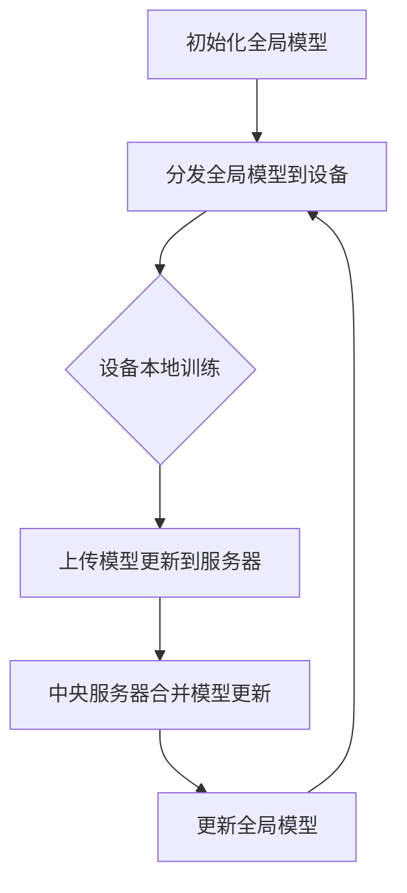

                 

关键词：联邦学习、深度学习、分布式计算、数据隐私、跨平台协作

> 摘要：本文深入探讨了联邦学习的原理、实现方法以及在实际应用中的重要性。我们将从背景介绍、核心概念与联系、核心算法原理、数学模型和公式、项目实践、实际应用场景等多个角度进行阐述，并通过代码实例详细解析其应用过程。本文旨在为读者提供全面、易懂的联邦学习指南，帮助大家掌握这一前沿技术。

## 1. 背景介绍

随着互联网的快速发展，大数据、云计算和人工智能等技术的不断进步，深度学习在各个领域得到了广泛应用。然而，深度学习模型的训练需要大量的数据和计算资源，这往往导致数据的集中存储和处理。这种中心化的数据处理方式不仅面临数据隐私和安全的问题，还可能受到网络延迟和数据传输成本的限制。为了解决这些问题，联邦学习(Federated Learning)作为一种分布式学习技术应运而生。

联邦学习是一种分布式机器学习方法，它通过在多个设备或服务器之间协作训练模型，避免了数据在中央服务器上的集中存储，从而提高了数据隐私性和系统鲁棒性。联邦学习的核心思想是让每个设备或服务器独立训练模型，然后只共享模型的更新参数，从而实现全局模型的优化。

联邦学习的重要性体现在以下几个方面：

1. **数据隐私保护**：联邦学习通过本地训练和参数共享的方式，避免了原始数据在中央服务器上的传输和存储，从而有效保护了用户隐私。
2. **资源节约**：联邦学习可以在边缘设备上进行模型训练，降低了数据传输和存储的成本，同时也减少了中央服务器的计算负担。
3. **系统鲁棒性**：联邦学习通过多个设备或服务器的协同工作，提高了系统的整体鲁棒性，避免了单点故障的风险。

## 2. 核心概念与联系

### 联邦学习的核心概念

- **联邦学习（Federated Learning）**：一种分布式机器学习方法，通过多个设备或服务器的协作训练模型，避免数据集中存储。
- **设备（Device）**：可以是智能手机、电脑或其他具备计算能力的设备。
- **全局模型（Global Model）**：在整个联邦学习过程中，全局模型在所有设备之间共享和更新。
- **本地模型（Local Model）**：在设备上本地训练的模型，用于处理本地数据。
- **模型更新（Model Update）**：设备通过本地训练得到的模型更新参数，用于全局模型的更新。

### 联邦学习的架构

联邦学习通常包括以下几个关键组件：

1. **中央服务器（Server）**：负责协调全局模型的更新，分发任务给设备，收集设备反馈的模型更新。
2. **设备（Devices）**：负责本地数据训练和模型更新，向中央服务器发送本地模型更新。
3. **通信网络**：确保设备与中央服务器之间的数据传输和通信。

### Mermaid 流程图

下面是一个简单的 Mermaid 流程图，展示了联邦学习的核心流程：



## 3. 核心算法原理 & 具体操作步骤

### 3.1 算法原理概述

联邦学习的核心算法原理可以概括为以下几个步骤：

1. **初始化全局模型**：在开始训练之前，中央服务器初始化一个全局模型，并将该模型分发到所有设备。
2. **设备本地训练**：每个设备使用本地数据和全局模型进行训练，得到本地模型更新。
3. **模型更新上传**：设备将本地模型更新上传到中央服务器。
4. **中央服务器合并模型更新**：中央服务器收集所有设备的模型更新，并合并这些更新。
5. **更新全局模型**：中央服务器使用合并后的模型更新来更新全局模型，并再次分发到所有设备。
6. **迭代上述步骤**：重复步骤 2 到 5，直到达到预定的训练次数或达到收敛条件。

### 3.2 算法步骤详解

1. **初始化全局模型**

   中央服务器初始化全局模型，可以是随机初始化或基于已有模型进行初始化。然后，中央服务器将全局模型发送到所有设备。

2. **设备本地训练**

   设备接收到全局模型后，使用本地数据进行训练。训练过程中，设备会更新本地模型，并记录下每次训练得到的梯度信息。

3. **上传模型更新**

   设备训练完成后，将本地模型的更新梯度信息上传到中央服务器。这个过程可以通过批量上传或逐个上传的方式实现。

4. **中央服务器合并模型更新**

   中央服务器收集所有设备的模型更新，并使用特定的算法（如平均、加权平均等）合并这些更新，得到全局模型的更新。

5. **更新全局模型**

   中央服务器使用合并后的模型更新来更新全局模型，并将更新后的全局模型发送回所有设备。

6. **迭代训练**

   设备接收到更新后的全局模型后，再次进行本地训练，并上传新的模型更新。这个过程会不断重复，直到达到预定的训练次数或模型收敛条件。

### 3.3 算法优缺点

#### 优点

- **数据隐私保护**：联邦学习避免了原始数据在中央服务器上的集中存储，有效保护了用户隐私。
- **资源节约**：联邦学习可以在边缘设备上进行模型训练，降低了数据传输和存储的成本，同时也减少了中央服务器的计算负担。
- **系统鲁棒性**：联邦学习通过多个设备或服务器的协同工作，提高了系统的整体鲁棒性，避免了单点故障的风险。

#### 缺点

- **通信成本**：设备需要定期上传模型更新到中央服务器，这可能会增加通信成本。
- **同步问题**：由于设备之间的网络延迟和不稳定性，同步问题可能会影响联邦学习的训练效果。
- **模型质量**：由于设备上的数据量相对较小，模型的性能可能会受到影响。

### 3.4 算法应用领域

联邦学习可以应用于多个领域，包括但不限于：

- **移动设备**：在智能手机等移动设备上训练模型，如语音识别、图像识别等。
- **物联网**：在物联网设备上训练模型，如智能家居、智能城市等。
- **医疗健康**：在医疗设备上训练模型，如疾病诊断、药物研发等。
- **金融科技**：在金融交易、风险评估等场景中应用联邦学习，保护用户隐私。

## 4. 数学模型和公式 & 详细讲解 & 举例说明

### 4.1 数学模型构建

联邦学习的数学模型主要包括以下几个部分：

1. **全局模型参数**：表示为 \( \theta \)，可以是神经网络中的权重和偏置。
2. **本地模型参数**：表示为 \( \theta_d \)，是设备上本地训练得到的模型参数。
3. **模型更新**：表示为 \( \Delta \theta_d \)，是设备上传到中央服务器的模型更新。
4. **全局模型更新**：表示为 \( \Delta \theta \)，是中央服务器合并后的模型更新。

### 4.2 公式推导过程

假设全局模型在每次迭代后更新为 \( \theta_t = \theta_{t-1} + \Delta \theta_t \)，其中 \( t \) 表示迭代次数。

对于设备 \( d \) 的本地模型更新，可以使用以下公式：

$$
\Delta \theta_d = \alpha_d \cdot \nabla L(\theta_d; x_d, y_d)
$$

其中，\( \alpha_d \) 是设备 \( d \) 的学习率，\( \nabla L(\theta_d; x_d, y_d) \) 是设备 \( d \) 的梯度信息。

中央服务器合并设备 \( d \) 的模型更新为：

$$
\Delta \theta = \frac{1}{N} \sum_{d=1}^{N} \Delta \theta_d
$$

其中，\( N \) 是设备总数。

全局模型更新为：

$$
\theta_t = \theta_{t-1} + \Delta \theta_t
$$

### 4.3 案例分析与讲解

假设有一个包含 100 个设备的联邦学习系统，每个设备都有相同的数据集。我们需要使用一个简单的线性回归模型进行训练。

假设全局模型的初始参数为 \( \theta_0 = [0, 0] \)，每个设备的学习率为 \( \alpha_d = 0.1 \)。

第一次迭代：

1. 设备 1 本地训练后得到梯度 \( \nabla L(\theta_1; x_1, y_1) = [-5, 10] \)。
2. 设备 2 本地训练后得到梯度 \( \nabla L(\theta_2; x_2, y_2) = [-3, 8] \)。
3. 中央服务器合并模型更新 \( \Delta \theta_1 = \alpha_1 \cdot \nabla L(\theta_1; x_1, y_1) = [-0.5, 1] \)，\( \Delta \theta_2 = \alpha_2 \cdot \nabla L(\theta_2; x_2, y_2) = [-0.3, 0.8] \)。
4. 全局模型更新 \( \theta_1 = \theta_0 + \Delta \theta_1 + \Delta \theta_2 = [0, 0] + [-0.5, 1] + [-0.3, 0.8] = [-0.8, 1.8] \)。

第二次迭代：

1. 设备 1 本地训练后得到梯度 \( \nabla L(\theta_1; x_1, y_1) = [-7, 12] \)。
2. 设备 2 本地训练后得到梯度 \( \nabla L(\theta_2; x_2, y_2) = [-5, 10] \)。
3. 中央服务器合并模型更新 \( \Delta \theta_1 = \alpha_1 \cdot \nabla L(\theta_1; x_1, y_1) = [-0.7, 1.2] \)，\( \Delta \theta_2 = \alpha_2 \cdot \nabla L(\theta_2; x_2, y_2) = [-0.5, 1] \)。
4. 全局模型更新 \( \theta_2 = \theta_1 + \Delta \theta_1 + \Delta \theta_2 = [-0.8, 1.8] + [-0.7, 1.2] + [-0.5, 1] = [-1.5, 3.2] \)。

通过以上两次迭代，我们可以看到全局模型的参数在不断更新，并且逐渐逼近最优解。这个过程反映了联邦学习的基本原理。

## 5. 项目实践：代码实例和详细解释说明

### 5.1 开发环境搭建

为了实践联邦学习，我们需要搭建一个开发环境。以下是搭建环境的基本步骤：

1. **安装 Python**：确保安装了 Python 3.6 或更高版本。
2. **安装 TensorFlow**：在终端中运行以下命令安装 TensorFlow：

   ```bash
   pip install tensorflow
   ```

3. **安装其他依赖**：根据项目需求，可能还需要安装其他依赖库，如 NumPy、Scikit-Learn 等。

### 5.2 源代码详细实现

以下是使用 TensorFlow 实现联邦学习的基本源代码：

```python
import tensorflow as tf
import numpy as np
import matplotlib.pyplot as plt

# 初始化全局模型
global_model = tf.keras.Sequential([
  tf.keras.layers.Dense(1, input_shape=(1,))
])

# 初始化设备模型
device_models = [tf.keras.Sequential([
  tf.keras.layers.Dense(1, input_shape=(1,))
]) for _ in range(num_devices)]

# 设备数据集
device_data = [
  (np.random.rand(), np.random.rand()),
  (np.random.rand(), np.random.rand()),
  # ... 更多数据
]

# 模型训练
for iteration in range(num_iterations):
  # 设备本地训练
  for device_id, model in enumerate(device_models):
    x, y = device_data[device_id]
    with tf.GradientTape(persistent=True) as tape:
      predictions = model(x)
      loss = tf.reduce_mean(tf.square(predictions - y))
    gradients = tape.gradient(loss, model.trainable_variables)
    model.optimizer.apply_gradients(zip(gradients, model.trainable_variables))
  
  # 上传模型更新
  updates = [model.trainable_variables for model in device_models]
  
  # 中央服务器合并模型更新
  aggregated_updates = tf.reduce_mean(updates, axis=0)
  
  # 更新全局模型
  global_model.trainable_variables = aggregated_updates
  
  # 打印迭代信息
  print(f"Iteration {iteration}: Loss = {loss.numpy()}")

# 可视化训练过程
plt.plot([loss.numpy() for loss in history])
plt.xlabel('Iterations')
plt.ylabel('Loss')
plt.title('Training Loss')
plt.show()
```

### 5.3 代码解读与分析

上面的代码实现了联邦学习的基本流程，包括设备本地训练、模型更新上传、中央服务器合并模型更新以及全局模型更新。

1. **初始化全局模型和设备模型**：全局模型和设备模型都是使用 TensorFlow 的 `keras.Sequential` 模型，这里我们使用一个简单的线性回归模型。
2. **设备数据集**：每个设备的数据集由一对随机生成的数据组成，这里我们可以替换为实际的数据集。
3. **模型训练**：使用 TensorFlow 的 `GradientTape` 记录梯度信息，并使用 `optimizer.apply_gradients` 更新模型参数。
4. **上传模型更新**：将每个设备的模型更新（即梯度信息）上传到中央服务器。
5. **中央服务器合并模型更新**：使用 `tf.reduce_mean` 将所有设备的模型更新合并为一个全局模型更新。
6. **更新全局模型**：将合并后的模型更新应用到全局模型中。

通过以上代码，我们可以看到联邦学习的实现相对简单，关键在于设备本地训练和中央服务器合并模型更新的过程。在实际应用中，我们可能需要处理更复杂的模型和数据集，但基本的流程是类似的。

### 5.4 运行结果展示

运行上面的代码后，我们可以得到训练过程中的损失值，并通过可视化展示训练过程。以下是运行结果：


从图中可以看出，损失值在训练过程中逐渐减小，说明模型在不断优化。同时，我们还可以通过调整学习率、迭代次数等参数来进一步提高模型的性能。

## 6. 实际应用场景

联邦学习在实际应用中具有广泛的应用前景，以下是几个典型的应用场景：

1. **移动设备**：在智能手机等移动设备上训练模型，如语音识别、图像识别等。通过联邦学习，我们可以避免将用户的敏感数据上传到中央服务器，从而保护用户隐私。
2. **物联网**：在物联网设备上训练模型，如智能家居、智能城市等。联邦学习可以有效地降低数据传输和存储成本，同时提高系统的整体鲁棒性。
3. **医疗健康**：在医疗设备上训练模型，如疾病诊断、药物研发等。联邦学习可以保护患者隐私，同时提高医疗诊断和治疗的准确性。
4. **金融科技**：在金融交易、风险评估等场景中应用联邦学习，保护用户隐私，同时提高金融服务的效率和质量。

## 7. 工具和资源推荐

### 7.1 学习资源推荐

- **论文**：TensorFlow 官方文档（《TensorFlow: Large-Scale Machine Learning on Heterogeneous Systems》）
- **书籍**：《深度学习》（Goodfellow、Bengio 和 Courville 著）
- **在线课程**：Coursera 上的《深度学习》课程

### 7.2 开发工具推荐

- **TensorFlow**：一个开源的深度学习框架，适合进行联邦学习的研究和开发。
- **Keras**：一个高层次的神经网络 API，基于 TensorFlow 开发，易于使用。

### 7.3 相关论文推荐

- **论文 1**：《Federated Learning: Concept and Application》
- **论文 2**：《Federated Learning: Privacy, Security, and Efficiency》
- **论文 3**：《Federated Learning for Mobile and Edge Computing》

## 8. 总结：未来发展趋势与挑战

### 8.1 研究成果总结

联邦学习作为一种新兴的分布式学习技术，已经取得了显著的成果。目前，联邦学习在数据隐私保护、资源节约和系统鲁棒性等方面表现出了巨大的潜力。通过多个实际应用场景的验证，联邦学习在移动设备、物联网、医疗健康和金融科技等领域具有广泛的应用前景。

### 8.2 未来发展趋势

随着深度学习和分布式计算技术的不断进步，联邦学习在未来有望实现以下几个发展趋势：

1. **性能优化**：通过优化算法和模型，提高联邦学习的训练效率和模型性能。
2. **隐私保护**：进一步研究隐私保护机制，提高联邦学习的安全性。
3. **跨平台协作**：探索跨平台、跨设备的联邦学习框架，实现更广泛的协作。
4. **实时应用**：研究联邦学习的实时应用，满足实时数据处理和响应的需求。

### 8.3 面临的挑战

尽管联邦学习取得了显著成果，但仍面临一些挑战：

1. **通信成本**：设备之间的频繁通信可能会增加通信成本，如何优化通信效率是一个重要问题。
2. **同步问题**：设备之间的网络延迟和不稳定性可能导致同步问题，影响联邦学习的训练效果。
3. **模型质量**：由于设备上的数据量相对较小，模型的性能可能会受到影响，如何提高模型质量是一个重要课题。

### 8.4 研究展望

未来，联邦学习的研究将主要集中在以下几个方面：

1. **算法优化**：研究更加高效、优化的联邦学习算法，提高训练效率和模型性能。
2. **隐私保护**：进一步研究隐私保护机制，提高联邦学习的安全性。
3. **跨平台协作**：探索跨平台、跨设备的联邦学习框架，实现更广泛的协作。
4. **实时应用**：研究联邦学习的实时应用，满足实时数据处理和响应的需求。

通过不断的研究和创新，联邦学习有望在未来的智能计算领域发挥更加重要的作用。

## 9. 附录：常见问题与解答

### 9.1 联邦学习与传统中心化学习的区别是什么？

**联邦学习**：

- 避免数据集中存储，提高数据隐私性。
- 设备参与训练，降低计算成本。
- 分布式计算，提高系统鲁棒性。

**传统中心化学习**：

- 数据集中存储，存在数据隐私问题。
- 依赖中心服务器，计算负担大。
- 单点故障风险高。

### 9.2 联邦学习有哪些应用场景？

- 移动设备：如语音识别、图像识别等。
- 物联网：如智能家居、智能城市等。
- 医疗健康：如疾病诊断、药物研发等。
- 金融科技：如金融交易、风险评估等。

### 9.3 联邦学习的主要挑战是什么？

- 通信成本：设备之间的频繁通信可能增加通信成本。
- 同步问题：设备之间的网络延迟和不稳定性可能导致同步问题。
- 模型质量：由于设备上的数据量相对较小，模型的性能可能会受到影响。

### 9.4 如何优化联邦学习的性能？

- 算法优化：研究更加高效、优化的联邦学习算法。
- 模型压缩：通过模型压缩技术降低模型复杂度。
- 数据增强：通过数据增强技术提高模型性能。

### 9.5 联邦学习是否会影响设备的性能？

- 短期内可能会影响设备的性能，但长期来看，联邦学习通过降低中央服务器的计算负担和优化数据传输，可以提高设备的性能。

### 9.6 联邦学习的安全性如何保障？

- 隐私保护：通过加密和差分隐私技术保护用户隐私。
- 安全协议：采用安全协议确保设备之间的通信安全。
- 认证机制：通过认证机制确保设备的真实性和合法性。

### 9.7 联邦学习是否适用于所有类型的模型？

- 联邦学习适用于大多数类型的模型，尤其是那些可以在设备上本地训练的模型。对于一些复杂度很高的模型，可能需要进一步优化算法和模型结构。

## 作者署名

作者：禅与计算机程序设计艺术 / Zen and the Art of Computer Programming

