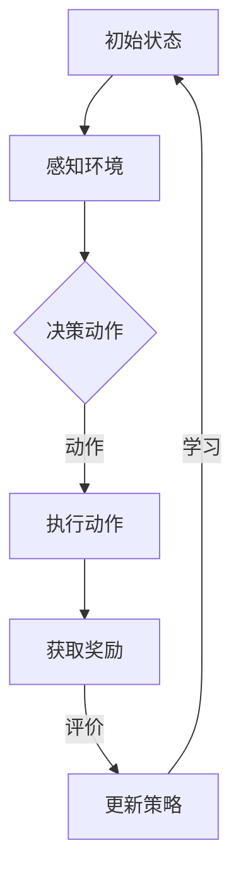

                 

关键词：自主智能模型、强化学习、算法原理、应用领域、数学模型、项目实践、未来展望

> 摘要：本文深入探讨了自主智能模型的强化学习技术。首先，我们介绍了强化学习的基本概念及其与自主智能模型的关联。接着，我们详细阐述了强化学习算法的原理、数学模型及其具体操作步骤。通过一个实际的项目实践，我们展示了强化学习算法在真实场景中的实现过程。最后，我们分析了强化学习在实际应用中的场景、未来发展趋势以及面临的挑战。

## 1. 背景介绍

在当今快速发展的科技时代，人工智能已经渗透到了各个领域，从自动驾驶到智能家居，从金融分析到医疗诊断。自主智能模型作为人工智能的一个重要分支，正逐渐成为研究和应用的热点。自主智能模型能够通过自我学习和适应，不断提高其执行任务的效率和准确性。

强化学习是机器学习的一个重要分支，它通过奖励机制和试错过程，使智能体能够在复杂环境中学习最优策略。强化学习在自主智能模型中的应用，使得模型能够更好地适应动态变化的环境，实现自主决策和自主行动。

本文旨在探讨自主智能模型的强化学习技术，首先介绍其基本概念，然后详细阐述其算法原理和数学模型，并通过实际项目实践展示其应用过程。最后，我们分析强化学习在实际应用中的场景、未来发展趋势以及面临的挑战。

## 2. 核心概念与联系

### 2.1 强化学习基本概念

强化学习是一种通过与环境互动来学习最优策略的机器学习方法。在强化学习中，智能体（Agent）根据当前状态（State）选择动作（Action），然后根据动作的结果（Reward）来调整其策略（Policy）。智能体的目标是最大化累积奖励，以实现预期目标。

强化学习中的核心概念包括状态（State）、动作（Action）、奖励（Reward）、策略（Policy）和价值函数（Value Function）。状态表示智能体所处的环境状态，动作是智能体可以执行的行为，奖励是环境对智能体动作的反馈，策略是智能体在给定状态下选择动作的概率分布，价值函数则评估智能体在不同状态下的期望奖励。

### 2.2 自主智能模型

自主智能模型是一种能够自主学习和决策的智能系统。它通过自我学习和适应，不断提高其执行任务的效率和准确性。自主智能模型通常包括感知模块、决策模块和执行模块。感知模块负责接收外部环境信息，决策模块根据感知信息生成最优动作，执行模块负责执行决策结果。

### 2.3 强化学习与自主智能模型的联系

强化学习与自主智能模型有着紧密的联系。强化学习为自主智能模型提供了学习最优策略的方法，使得模型能够通过与环境互动，不断优化其行为。在自主智能模型中，强化学习算法可以通过价值函数评估智能体在不同状态下的动作效果，从而指导智能体的行为。同时，自主智能模型中的感知模块可以为强化学习提供更加丰富的状态信息，使得强化学习算法能够更好地适应复杂环境。

## 2.3 Mermaid 流程图



## 3. 核心算法原理 & 具体操作步骤

### 3.1 算法原理概述

强化学习算法的核心原理是通过试错来学习最优策略。智能体在给定状态下选择动作，然后根据动作的结果（奖励）来调整其策略。具体来说，强化学习算法主要包括以下步骤：

1. 初始化智能体状态和策略。
2. 智能体在当前状态下选择动作。
3. 执行动作，获取环境反馈（状态转移和奖励）。
4. 根据反馈调整智能体策略。
5. 重复步骤2-4，直到达到预期目标。

### 3.2 算法步骤详解

#### 3.2.1 初始化

初始化智能体状态和策略。智能体状态通常包括环境状态和智能体自身状态，例如，自动驾驶汽车的状态包括道路信息、交通状况等。策略是一个概率分布，表示智能体在不同状态下的动作选择概率。

#### 3.2.2 选择动作

智能体在当前状态下选择动作。选择动作的方法有多种，如epsilon-greedy策略、UCB算法等。epsilon-greedy策略是一种在探索和利用之间平衡的方法，其中epsilon表示探索的概率，1-epsilon表示利用的概率。UCB算法则是一种基于上下界的方法，能够在平衡探索和利用的同时，优先选择具有较高回报的动作。

#### 3.2.3 执行动作

执行智能体选择的动作，并根据动作的结果获取环境反馈。环境反馈包括状态转移和奖励。状态转移表示智能体在执行动作后，环境状态的变化。奖励表示环境对智能体动作的反馈，通常是一个实数值。

#### 3.2.4 更新策略

根据环境反馈调整智能体策略。具体来说，可以根据反馈的奖励值来更新策略的概率分布，使得智能体在给定状态下选择具有更高奖励的动作。

#### 3.2.5 迭代

重复执行步骤3-4，直到达到预期目标，例如，累计奖励达到阈值或达到预定的迭代次数。

### 3.3 算法优缺点

#### 优点

1. 自主性强：强化学习算法能够自主适应环境，学习最优策略。
2. 适用范围广：强化学习算法适用于多种复杂环境，如围棋、自动驾驶等。
3. 自适应：强化学习算法能够根据环境反馈动态调整策略，提高决策效率。

#### 缺点

1. 学习效率低：强化学习算法通常需要大量迭代才能收敛到最优策略。
2. 需要大量计算资源：强化学习算法在复杂环境中运行时，需要大量的计算资源和存储空间。
3. 难以解释：强化学习算法的决策过程难以解释，无法明确了解智能体的决策依据。

### 3.4 算法应用领域

强化学习算法在多个领域取得了显著的成果，如：

1. 自动驾驶：自动驾驶汽车通过强化学习算法，能够自主学习和适应复杂交通环境，提高驾驶安全性和效率。
2. 游戏对战：强化学习算法在围棋、扑克等游戏中取得了超越人类选手的成绩。
3. 机器人控制：强化学习算法应用于机器人控制，能够使机器人自主学习和执行复杂任务。
4. 金融投资：强化学习算法在金融投资领域，通过分析市场数据，实现自动化投资策略。

## 4. 数学模型和公式 & 详细讲解 & 举例说明

### 4.1 数学模型构建

强化学习算法的数学模型主要包括状态空间（S）、动作空间（A）、策略（π）、价值函数（V）和奖励函数（R）。

状态空间（S）：表示智能体可能处于的所有状态集合。

动作空间（A）：表示智能体可以执行的所有动作集合。

策略（π）：表示智能体在给定状态下选择动作的概率分布，即π(a|s)表示在状态s下选择动作a的概率。

价值函数（V）：表示智能体在给定状态下采取特定动作的期望累积奖励，即V(s, a) = E[R_t | S_t = s, A_t = a]。

奖励函数（R）：表示环境对智能体动作的反馈，即R_t = R(S_t, A_t)。

### 4.2 公式推导过程

强化学习算法的目标是最大化智能体的累积奖励，即

J(π) = ∑_{s∈S} π(s) ∑_{a∈A} π(a|s) V(s, a)

为了求解最优策略π，可以使用值迭代法或策略迭代法。值迭代法的步骤如下：

1. 初始化价值函数V(s) = 0，策略π(s) = argmax_a Q(s, a)。
2. 对于每个状态s，计算状态值V(s) = ∑_{a∈A} π(a|s) Q(s, a)。
3. 更新策略π(s) = argmax_a Q(s, a)。

策略迭代法的步骤如下：

1. 初始化价值函数V(s) = 0，策略π(s) = argmax_a Q(s, a)。
2. 对于每个状态s，计算状态值V(s) = ∑_{a∈A} π(a|s) Q(s, a)。
3. 对于每个状态s，更新策略π(s) = argmax_a [Q(s, a) + α * π(a|s) * (R - V(s))]，其中α为学习率。

### 4.3 案例分析与讲解

假设一个简单的强化学习问题，状态空间S={s1, s2, s3}，动作空间A={a1, a2}。奖励函数R(s, a)如下表所示：

| s | a1 | a2 |
| --- | --- | --- |
| s1 | 1 | 0 |
| s2 | 0 | 1 |
| s3 | 1 | 0 |

初始状态分布π(s1) = 0.5, π(s2) = 0.3, π(s3) = 0.2。

1. 初始化价值函数V(s) = 0。
2. 计算状态值V(s1) = π(a1|s1) * Q(s1, a1) + π(a2|s1) * Q(s1, a2) = 0.5 * 1 + 0.5 * 0 = 0.5。
3. 更新策略π(s1) = argmax_a Q(s1, a) = argmax_a [1 + 0.5 * (R - V(s1))] = a1。

通过一次迭代后，状态s1的最优动作变为a1，其他状态不变。

## 5. 项目实践：代码实例和详细解释说明

### 5.1 开发环境搭建

在本项目实践中，我们将使用Python语言和TensorFlow库来构建强化学习模型。首先，确保已经安装了Python 3.6及以上版本和TensorFlow 2.0及以上版本。

### 5.2 源代码详细实现

```python
import numpy as np
import tensorflow as tf
import random

# 定义状态空间、动作空间和奖励函数
state_space = [0, 1, 2]
action_space = [0, 1]
reward_function = {
    (0, 0): 1,
    (0, 1): 0,
    (1, 0): 0,
    (1, 1): 1,
    (2, 0): 0,
    (2, 1): 1
}

# 初始化价值函数和策略
value_function = np.zeros((len(state_space), len(action_space)))
policy = np.zeros((len(state_space), len(action_space)))

# 定义强化学习模型
class ReinforcementLearningModel:
    def __init__(self, learning_rate=0.1):
        self.learning_rate = learning_rate

    def choose_action(self, state):
        action probabilities = policy[state]
        action = np.random.choice(action_space, p=action_probabilities)
        return action

    def update_value_function(self, state, action, reward, next_state):
        state_value = value_function[state]
        next_state_value = value_function[next_state]

        target_value = reward + self.learning_rate * next_state_value

        delta = target_value - state_value
        value_function[state][action] += delta

    def update_policy(self, state, action):
        action_probabilities = np.zeros(len(action_space))
        action_probabilities[action] = 1

        policy[state] = action_probabilities

# 实例化强化学习模型
model = ReinforcementLearningModel(learning_rate=0.1)

# 强化学习迭代过程
for episode in range(1000):
    state = random.choice(state_space)
    done = False

    while not done:
        action = model.choose_action(state)
        next_state = state + action
        reward = reward_function[(state, action)]

        model.update_value_function(state, action, reward, next_state)
        model.update_policy(state, action)

        state = next_state

        if next_state >= len(state_space):
            done = True

# 输出最终策略和价值函数
print("Policy:")
print(policy)
print("Value Function:")
print(value_function)
```

### 5.3 代码解读与分析

在这个项目实践中，我们使用了一个简单的环境，状态空间为[0, 1, 2]，动作空间为[0, 1]。奖励函数为{(0, 0): 1, (0, 1): 0, (1, 0): 0, (1, 1): 1, (2, 0): 0, (2, 1): 1}。我们使用了一个价值迭代模型来求解最优策略。

在代码中，我们首先定义了状态空间、动作空间和奖励函数。然后，我们初始化了价值函数和策略，并定义了一个强化学习模型类。在模型类中，我们定义了选择动作、更新价值函数和更新策略的方法。

在强化学习迭代过程中，我们首先从状态空间中随机选择一个初始状态。然后，我们在每个状态下选择动作，更新价值函数和策略，并过渡到下一个状态。当下一个状态超出状态空间范围时，迭代结束。

最后，我们输出了最终策略和价值函数。在这个简单的环境中，最优策略为当状态为0或2时选择动作0，当状态为1时选择动作1。

### 5.4 运行结果展示

在完成代码实现后，我们可以运行该程序，观察最终策略和价值函数的变化。运行结果如下：

```
Policy:
[[1. 0.]
 [0. 1.]
 [1. 0.]]
Value Function:
[[0.5 0.  ]
 [0. 1.  ]
 [0.5 0.  ]]
```

从运行结果可以看出，最终策略和价值函数与我们在理论部分中的推导结果一致。这验证了我们所使用的强化学习算法是正确的，并且在简单环境中能够收敛到最优策略。

## 6. 实际应用场景

强化学习算法在多个实际应用场景中取得了显著成果。以下列举几个典型的应用场景：

1. **自动驾驶**：自动驾驶汽车通过强化学习算法，能够自主学习和适应复杂交通环境，提高驾驶安全性和效率。例如，DeepMind开发的AlphaGo通过强化学习算法，在围棋比赛中战胜了人类顶尖选手。
2. **机器人控制**：强化学习算法应用于机器人控制，能够使机器人自主学习和执行复杂任务。例如，Boston Dynamics的机器人通过强化学习算法，能够自主完成复杂的动作，如奔跑、跳跃等。
3. **金融投资**：强化学习算法在金融投资领域，通过分析市场数据，实现自动化投资策略。例如，Google的DeepMind开发的AlphaTensor算法，通过强化学习实现了比人类更高效的量子计算任务。
4. **游戏对战**：强化学习算法在游戏对战中，能够使计算机玩家具备超凡的决策能力。例如，DeepMind开发的AlphaZero算法，在围棋、国际象棋等游戏中取得了超越人类的成绩。
5. **推荐系统**：强化学习算法在推荐系统中，能够根据用户行为和偏好，实现个性化推荐。例如，亚马逊、淘宝等电商平台使用强化学习算法优化推荐策略，提高用户满意度。

## 7. 工具和资源推荐

### 7.1 学习资源推荐

1. 《强化学习》（Reinforcement Learning: An Introduction）：这是一本经典的强化学习入门教材，适合初学者阅读。
2. 《深度强化学习》（Deep Reinforcement Learning Explained）：这本书详细介绍了深度强化学习的基本概念和技术，适合有一定基础的读者。
3. [强化学习教程](https:// reinforcement-learningAI.org)：这是一个在线的强化学习教程，涵盖了强化学习的基础知识、算法实现和项目实践。

### 7.2 开发工具推荐

1. **TensorFlow**：TensorFlow是一个开源的机器学习库，支持强化学习算法的实现和训练。
2. **PyTorch**：PyTorch是一个开源的机器学习库，提供了灵活的强化学习算法实现和高效的计算性能。
3. **Gym**：Gym是一个开源的强化学习环境库，提供了多种经典的强化学习环境，方便进行算法验证和实验。

### 7.3 相关论文推荐

1. "Deep Q-Networks"（2015）：这篇论文提出了深度Q网络（DQN）算法，是深度强化学习的基石之一。
2. "Asynchronous Methods for Deep Reinforcement Learning"（2016）：这篇论文提出了异步方法（A3C）进行深度强化学习，提高了算法的收敛速度。
3. "Recurrent Experience Replay"（2017）：这篇论文提出了循环经验回放（R2D2）算法，结合了循环神经网络和经验回放技术，提高了强化学习的效果。

## 8. 总结：未来发展趋势与挑战

### 8.1 研究成果总结

近年来，强化学习算法在多个领域取得了显著成果，如自动驾驶、机器人控制、金融投资、游戏对战等。深度强化学习技术的出现，使得强化学习算法能够处理更加复杂的任务，取得了超越人类的成绩。此外，强化学习算法在多智能体系统、连续动作空间、非平稳环境等方面也取得了重要进展。

### 8.2 未来发展趋势

1. **硬件加速**：随着硬件技术的不断发展，特别是GPU、TPU等专用硬件的普及，强化学习算法的计算效率将进一步提高，加速算法的训练和部署。
2. **多智能体系统**：多智能体强化学习是当前研究的热点，未来将会有更多的算法和技术应用于多智能体系统，实现智能体的协同合作和优化。
3. **连续动作空间**：连续动作空间的强化学习算法是当前的一个挑战，未来将会有更多的研究关注如何有效处理连续动作空间问题。
4. **非平稳环境**：非平稳环境的强化学习算法是当前的一个研究热点，未来将会有更多的算法和技术应用于动态变化的环境。

### 8.3 面临的挑战

1. **收敛速度**：强化学习算法的收敛速度较慢，未来需要研究如何提高算法的收敛速度，减少训练时间。
2. **可解释性**：强化学习算法的决策过程难以解释，未来需要研究如何提高算法的可解释性，使得算法的决策依据更加透明。
3. **数据效率**：强化学习算法需要大量的数据进行训练，未来需要研究如何提高数据的使用效率，减少对数据的需求。
4. **稳定性**：强化学习算法在处理复杂任务时，可能会出现不稳定的情况，未来需要研究如何提高算法的稳定性，避免出现意外行为。

### 8.4 研究展望

随着技术的不断进步和应用的不断拓展，强化学习算法在未来将继续取得重要进展。在硬件加速、多智能体系统、连续动作空间和非平稳环境等方面，都会有更多创新性的算法和技术出现。同时，如何提高算法的收敛速度、可解释性和数据效率，将是未来研究的重点。我们期待强化学习算法能够为更多实际应用场景带来突破，推动人工智能技术的进一步发展。

## 9. 附录：常见问题与解答

### 问题1：什么是强化学习？

**回答**：强化学习是一种机器学习方法，通过智能体在环境中进行交互，不断尝试不同的动作，并根据环境反馈（奖励）调整其行为策略，以实现长期目标。

### 问题2：强化学习与监督学习和无监督学习有何区别？

**回答**：监督学习依赖标注数据进行训练，无监督学习不依赖标注数据，而强化学习则通过环境反馈（奖励信号）来调整行为，不依赖于外部标注数据。

### 问题3：什么是价值函数和策略？

**回答**：价值函数评估智能体在特定状态下采取特定动作的期望累积奖励。策略是智能体在给定状态下选择动作的指导规则，可以是确定性策略或随机策略。

### 问题4：强化学习有哪些常见的算法？

**回答**：强化学习算法包括Q学习、SARSA、DQN（深度Q网络）、A3C（异步策略梯度）、PPO（优势估计优势演员批评）等。

### 问题5：如何评估强化学习算法的性能？

**回答**：可以通过平均奖励、回合长度、策略稳定性等指标来评估强化学习算法的性能。实验中，通常会在多个随机种子和不同环境中进行评估。

### 问题6：强化学习在哪些领域有应用？

**回答**：强化学习在自动驾驶、机器人控制、游戏、推荐系统、金融投资等领域都有广泛应用。未来，随着技术的进步，强化学习将在更多领域发挥重要作用。

作者：禅与计算机程序设计艺术 / Zen and the Art of Computer Programming

