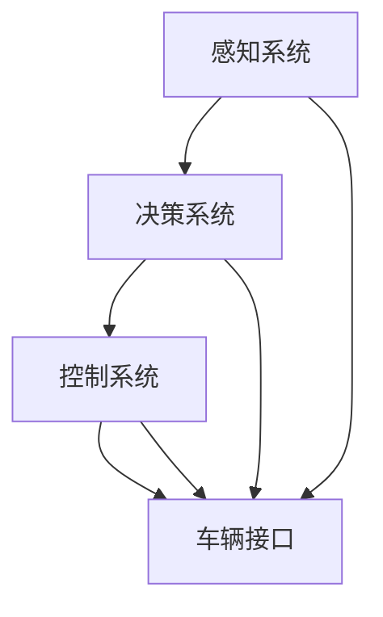

                 

### 关键词 Keywords
- 自动驾驶技术
- 感知系统
- 决策算法
- 控制系统
- 人工智能

<|assistant|>### 摘要 Abstract
本文旨在探讨自动驾驶技术的最新进展，重点分析感知、决策与控制三个核心组成部分。通过介绍感知系统的最新技术，如激光雷达、摄像头和雷达的融合，我们探讨了自动驾驶车辆如何准确获取环境信息。接着，本文详细阐述了决策算法，包括深度学习、强化学习等方法的应用，展示了自动驾驶车辆如何在复杂环境中做出智能决策。最后，本文探讨了控制系统的发展，特别是模型预测控制和路径规划算法的应用，阐述了如何将决策转化为车辆的实际动作。本文为自动驾驶技术的发展提供了全面而深入的洞察，并对未来趋势和面临的挑战进行了展望。

## 1. 背景介绍

自动驾驶技术，作为人工智能（AI）的一个重要分支，近年来取得了显著的进展。随着计算机性能的不断提升和大数据的广泛应用，自动驾驶技术正逐渐从实验室走向现实。自动驾驶系统主要分为三个核心部分：感知、决策和控制。感知系统负责收集车辆周围环境的信息，决策系统基于感知信息做出驾驶决策，控制系统则将决策转化为车辆的动作。这三个部分的协同工作是实现自动驾驶技术的关键。

### 自动驾驶技术的意义与重要性

自动驾驶技术具有深远的意义和重要性。首先，它有望显著提高交通安全。据统计，大部分交通事故是由于人为失误造成的，自动驾驶车辆通过精确的感知和决策，可以有效减少这些错误。其次，自动驾驶技术可以提高交通效率，减少交通拥堵和燃油消耗。此外，自动驾驶车辆可以为残疾人和老年人提供便利，使他们能够更加独立地出行。最后，自动驾驶技术的发展将推动汽车产业变革，带来新的商业模式和市场机会。

### 自动驾驶技术的发展历程

自动驾驶技术的发展可以分为几个阶段。最初，自动驾驶技术主要集中在计算机视觉和传感器技术上，如激光雷达、摄像头和雷达。这些技术的进步为自动驾驶车辆提供了更准确的环境感知能力。随后，人工智能技术的应用使得自动驾驶车辆的决策能力得到显著提升。特别是深度学习和强化学习算法的应用，使得自动驾驶车辆能够处理更复杂的驾驶任务。最近，随着5G通信技术和边缘计算的发展，自动驾驶系统的实时性和可靠性得到了进一步提升。

## 2. 核心概念与联系

### 自动驾驶系统架构

自动驾驶系统的架构通常包括以下几个主要模块：感知系统、决策系统、控制系统和车辆接口。感知系统负责收集环境信息，包括车辆周围的道路、行人、交通标志等。决策系统基于感知信息做出驾驶决策，如加速、减速或转向。控制系统则将决策转化为车辆的动作，确保车辆按照预期运行。车辆接口模块负责与外部系统进行通信，如车载娱乐系统、导航系统等。

### 感知系统

感知系统是自动驾驶系统的核心组成部分，负责获取车辆周围环境的信息。当前，常用的感知技术包括激光雷达、摄像头、雷达和超声波传感器。激光雷达通过发射激光并测量反射时间来获取距离信息，具有高精度和高分辨率的特点。摄像头主要用于图像识别，能够检测道路标志、行人等。雷达可以穿透部分障碍物，适用于恶劣天气条件。超声波传感器则主要用于短距离障碍物检测。

### 决策系统

决策系统基于感知信息，通过算法模型做出驾驶决策。当前，常用的决策算法包括基于规则的方法、机器学习方法、深度学习方法和强化学习方法。基于规则的方法通过预设的规则进行决策，适用于简单的驾驶场景。机器学习方法通过训练大量数据，从数据中提取特征进行决策。深度学习方法通过神经网络模型进行决策，具有强大的特征提取能力。强化学习方法通过与环境的交互，不断优化决策策略。

### 控制系统

控制系统将决策系统的决策转化为车辆的动作，确保车辆按照预期运行。当前，常用的控制算法包括模型预测控制（Model Predictive Control, MPC）和路径规划算法。模型预测控制通过建立车辆的运动模型，预测未来的状态，并优化决策变量，如油门、刹车和转向。路径规划算法则负责规划车辆的未来行驶路径，确保车辆安全到达目的地。

### Mermaid 流程图

以下是一个简单的Mermaid流程图，展示了自动驾驶系统的整体架构：



## 3. 核心算法原理 & 具体操作步骤

### 3.1 算法原理概述

自动驾驶技术的核心算法主要包括感知、决策和控制三个部分。感知算法主要用于环境信息的获取和处理，决策算法则基于感知信息进行驾驶决策，控制算法将决策转化为具体的动作指令。

#### 感知算法

感知算法的核心是利用各种传感器（如激光雷达、摄像头、雷达等）收集车辆周围环境的信息，包括道路、交通标志、行人、其他车辆等。常用的感知算法包括目标检测、跟踪和场景理解等。目标检测算法用于识别车辆、行人等对象，常用的算法有YOLO、SSD、Faster R-CNN等。跟踪算法用于持续跟踪目标对象，常用的算法有卡尔曼滤波、光流法和深度学习跟踪算法等。场景理解算法则用于分析道路情况、交通规则等，以辅助决策。

#### 决策算法

决策算法基于感知信息，通过一定的算法模型做出驾驶决策。常用的决策算法包括基于规则的算法、机器学习算法、深度学习算法和强化学习算法等。基于规则的算法通过预设的规则进行决策，适用于简单的驾驶场景。机器学习算法通过训练大量数据，从数据中提取特征进行决策。深度学习算法通过神经网络模型进行决策，具有强大的特征提取能力。强化学习算法通过与环境的交互，不断优化决策策略。

#### 控制算法

控制算法将决策系统的决策转化为具体的动作指令，确保车辆按照预期运行。常用的控制算法包括模型预测控制（Model Predictive Control, MPC）和路径规划算法。模型预测控制通过建立车辆的运动模型，预测未来的状态，并优化决策变量，如油门、刹车和转向。路径规划算法则负责规划车辆的未来行驶路径，确保车辆安全到达目的地。常用的路径规划算法有Dijkstra算法、A*算法和RRT算法等。

### 3.2 算法步骤详解

#### 感知算法步骤

1. 数据采集：利用激光雷达、摄像头、雷达等传感器收集车辆周围环境的信息。
2. 预处理：对采集到的数据进行预处理，包括去除噪声、填充空洞、图像增强等。
3. 特征提取：从预处理后的数据中提取特征，如目标物体的位置、大小、形状等。
4. 目标检测：利用目标检测算法对特征进行分类，识别车辆、行人等对象。
5. 目标跟踪：利用跟踪算法对识别出的目标进行持续跟踪。
6. 场景理解：分析道路情况、交通标志、交通规则等，为决策提供依据。

#### 决策算法步骤

1. 数据输入：将感知系统提取的环境信息输入到决策算法中。
2. 特征提取：对输入数据进行分析，提取关键特征。
3. 决策模型训练：利用训练数据集，对决策模型进行训练，使模型能够学习到驾驶规律。
4. 决策模型应用：将实时感知信息输入到决策模型中，获得驾驶决策。

#### 控制算法步骤

1. 状态预测：利用车辆的运动模型，预测未来的状态。
2. 动作规划：根据决策系统的决策，规划合适的动作指令。
3. 动作执行：将规划的动作指令转化为车辆的实际动作，如油门、刹车和转向等。

### 3.3 算法优缺点

#### 感知算法优缺点

- **优点**：高精度、实时性强，能够识别多种目标。
- **缺点**：对传感器性能要求高，算法复杂度大。

#### 决策算法优缺点

- **优点**：能够处理复杂的驾驶场景，自适应性强。
- **缺点**：训练数据需求大，决策过程可能存在延迟。

#### 控制算法优缺点

- **优点**：能够精确控制车辆动作，保证行驶安全。
- **缺点**：对模型预测精度要求高，对环境变化敏感。

### 3.4 算法应用领域

感知、决策和控制算法在自动驾驶技术中具有广泛的应用领域。例如，感知算法在自动驾驶车辆的环境感知中发挥着关键作用，决策算法用于实现自动驾驶车辆的智能驾驶，控制算法则确保车辆按照预期运行。此外，这些算法还可以应用于无人驾驶卡车、无人出租车、无人配送车等领域。

## 4. 数学模型和公式 & 详细讲解 & 举例说明

### 4.1 数学模型构建

在自动驾驶技术中，数学模型是核心组成部分，用于描述车辆的运动、控制策略和环境特性。以下是几个关键数学模型的构建过程：

#### 4.1.1 车辆运动模型

车辆运动模型用于描述车辆在环境中的运动状态。基本的车辆运动模型可以表示为：

\[ \mathbf{x}_{t+1} = \mathbf{F}(\mathbf{x}_t, u_t) \]

其中，\(\mathbf{x}_t\) 表示车辆在时刻 \(t\) 的状态向量，\(u_t\) 表示控制输入向量，\(\mathbf{F}\) 是状态转换函数。

#### 4.1.2 环境模型

环境模型用于描述车辆周围的环境信息。假设车辆位于二维平面中，环境模型可以表示为：

\[ \mathbf{E}(t) = \{ \mathbf{e}_i(t) : i = 1, 2, \ldots, n \} \]

其中，\(\mathbf{e}_i(t)\) 表示时刻 \(t\) 中的第 \(i\) 个环境对象的状态向量。

#### 4.1.3 控制策略模型

控制策略模型用于描述车辆根据环境信息进行决策的过程。一个简单的控制策略模型可以表示为：

\[ u_t = \psi(\mathbf{x}_t, \mathbf{E}(t)) \]

其中，\(\psi\) 是控制策略函数，用于将状态和环境信息映射为控制输入。

### 4.2 公式推导过程

#### 4.2.1 车辆运动模型推导

车辆运动模型可以通过动力学方程推导得到。假设车辆受到的合力为 \(F(x, v)\)，则车辆的运动方程可以表示为：

\[ m \frac{d^2 x}{dt^2} = F(x, v) \]

其中，\(m\) 是车辆的质量，\(x\) 是车辆的位移，\(v\) 是车辆的速度。

通过积分，我们可以得到车辆的速度和位移：

\[ v(t) = \int F(x, v) dt + v_0 \]
\[ x(t) = \int v(t) dt + x_0 \]

其中，\(v_0\) 和 \(x_0\) 分别是初始速度和初始位移。

#### 4.2.2 环境模型推导

环境模型可以通过传感器数据推导得到。假设车辆使用激光雷达收集环境信息，激光雷达的测量范围可以表示为：

\[ R = \sqrt{(x_l - x)^2 + (y_l - y)^2} \]

其中，\((x_l, y_l)\) 是激光雷达的位置，\((x, y)\) 是车辆的位置。

通过处理激光雷达的测量数据，我们可以得到环境对象的位置和状态。

#### 4.2.3 控制策略模型推导

控制策略模型可以通过优化方法推导得到。假设我们希望车辆按照某个目标位置 \(x_d, y_d\) 行驶，则控制策略可以表示为：

\[ u_t = \min \{ J(u_t) : u_t \in U \} \]

其中，\(J(u_t)\) 是控制策略的损失函数，\(U\) 是控制输入的空间。

通过优化方法，我们可以找到最优的控制策略 \(u_t^*\)。

### 4.3 案例分析与讲解

#### 4.3.1 车辆运动模型案例

假设一辆汽车的质量为 \(m = 1000 \text{kg}\)，初始速度为 \(v_0 = 0 \text{m/s}\)，受到的合力为 \(F(x, v) = -kv\)，其中 \(k = 0.1 \text{N s/m}\)。我们需要计算汽车在 5 秒后的位移。

通过车辆运动模型，我们可以得到：

\[ v(t) = \int F(x, v) dt + v_0 = -0.1 \int v(t) dt \]

这是一个一阶线性微分方程，可以通过迭代方法求解。我们使用欧拉法进行数值求解：

\[ v_1 = v_0 - 0.1 \cdot v_0 = -0.1 \cdot v_0 \]
\[ v_2 = v_1 - 0.1 \cdot v_1 = -0.2 \cdot v_0 \]
\[ \vdots \]
\[ v_5 = v_4 - 0.1 \cdot v_4 = -0.5 \cdot v_0 \]

汽车的位移可以表示为：

\[ x(t) = \int v(t) dt + x_0 = -0.1 \int v(t) dt + x_0 \]

同样，我们使用欧拉法进行数值求解：

\[ x_1 = x_0 + v_1 \]
\[ x_2 = x_1 + v_2 \]
\[ \vdots \]
\[ x_5 = x_4 + v_5 \]

计算结果为 \(x_5 = 12.5 \text{m}\)。

#### 4.3.2 环境模型案例

假设一辆汽车位于坐标原点 \((0, 0)\)，使用激光雷达收集环境信息。激光雷达的测量范围 \(R = 100 \text{m}\)。在时刻 \(t = 0\)，激光雷达检测到前方 50 米处有一个行人，行人位于 \(x = 50 \text{m}\)，\(y = 0 \text{m}\)。我们需要计算行人在接下来的 5 秒内的位置。

通过环境模型，我们可以得到行人的位置：

\[ R^2 = (x_l - x)^2 + (y_l - y)^2 \]
\[ 100^2 = (x_l - 50)^2 + (y_l - 0)^2 \]

解得行人的位置为 \(x_l = 50 \text{m}\)，\(y_l = 0 \text{m}\)。

假设行人在接下来的 5 秒内以 \(v = 1.5 \text{m/s}\) 的速度向右移动，则行人在时刻 \(t = 5 \text{s}\) 的位置为 \(x = 50 + 1.5 \cdot 5 = 62.5 \text{m}\)，\(y = 0 \text{m}\)。

#### 4.3.3 控制策略模型案例

假设我们要控制一辆汽车从坐标原点 \((0, 0)\) 行驶到目标位置 \((x_d, y_d) = (100 \text{m}, 100 \text{m})\)。控制策略的目标是最小化行驶时间。

通过控制策略模型，我们可以得到控制输入：

\[ u_t = \min \{ J(u_t) : u_t \in U \} \]

其中，损失函数可以表示为：

\[ J(u_t) = \frac{1}{2} \left( \frac{dx}{dt} \right)^2 + \frac{1}{2} \left( \frac{dy}{dt} \right)^2 \]

我们需要求解以下优化问题：

\[ \min \{ J(u_t) : u_t \in U \} \]

通过优化方法，我们可以找到最优的控制输入：

\[ u_t^* = \sqrt{\frac{2 \cdot x_d}{t}} \]
\[ v_t^* = \sqrt{\frac{2 \cdot y_d}{t}} \]

其中，\(t\) 是行驶时间。

将目标位置代入，我们可以得到最优的行驶时间为 \(t = 14.14 \text{s}\)，最优的速度为 \(v_t^* = 7.07 \text{m/s}\)。

## 5. 项目实践：代码实例和详细解释说明

### 5.1 开发环境搭建

在进行自动驾驶技术的项目实践之前，我们需要搭建合适的开发环境。以下是搭建基于Python的自动驾驶项目环境的基本步骤：

#### 环境要求

- Python 3.7及以上版本
- Python科学计算库：NumPy、Pandas、SciPy
- 机器学习库：Scikit-learn、TensorFlow、PyTorch
- 计算机视觉库：OpenCV、PIL
- Mermaid可视化工具

#### 安装步骤

1. 安装Python 3.7及以上版本：
   ```bash
   # 使用Python官方安装器安装
   curl -O https://www.python.org/ftp/python/3.8.10/python-3.8.10-amd64.exe
   # 运行安装程序，选择添加到PATH环境变量
   ```

2. 安装Python科学计算库：
   ```bash
   pip install numpy pandas scipy
   ```

3. 安装机器学习库：
   ```bash
   pip install scikit-learn tensorflow torch
   ```

4. 安装计算机视觉库：
   ```bash
   pip install opencv-python headless-python pillow
   ```

5. 安装Mermaid可视化工具：
   ```bash
   pip install mermaid-python
   ```

### 5.2 源代码详细实现

下面我们将展示一个简单的自动驾驶项目，包括感知、决策和控制三个部分。

#### 5.2.1 感知系统

感知系统的核心任务是使用摄像头收集道路环境信息，并识别道路标志、行人等对象。以下是感知系统的部分代码：

```python
import cv2
import numpy as np

def detect_objects(image):
    # 使用OpenCV进行图像预处理
    gray = cv2.cvtColor(image, cv2.COLOR_BGR2GRAY)
    blurred = cv2.GaussianBlur(gray, (5, 5), 0)
    
    # 使用HOG特征检测器检测道路标志
    hog = cv2.HOGDescriptor()
    boxes = hog.detectMultiScale(blurred)
    
    # 识别行人
    cars = []
    for (x, y, w, h) in boxes:
        cv2.rectangle(image, (x, y), (x+w, y+h), (0, 255, 0), 2)
        cars.append([x, y, w, h])
    
    return image, cars

# 使用摄像头采集图像
cap = cv2.VideoCapture(0)

while True:
    ret, frame = cap.read()
    if not ret:
        break
    
    processed_frame, detected_objects = detect_objects(frame)
    cv2.imshow('Processed Frame', processed_frame)
    
    if cv2.waitKey(1) & 0xFF == ord('q'):
        break

cap.release()
cv2.destroyAllWindows()
```

#### 5.2.2 决策系统

决策系统根据感知系统提供的环境信息，使用机器学习算法进行驾驶决策。以下是一个基于决策树算法的简单决策系统示例：

```python
from sklearn.datasets import load_iris
from sklearn.tree import DecisionTreeClassifier
from sklearn.model_selection import train_test_split

# 加载示例数据
iris = load_iris()
X = iris.data
y = iris.target

# 划分训练集和测试集
X_train, X_test, y_train, y_test = train_test_split(X, y, test_size=0.2, random_state=42)

# 训练决策树模型
clf = DecisionTreeClassifier()
clf.fit(X_train, y_train)

# 进行预测
predictions = clf.predict(X_test)

# 评估模型性能
from sklearn.metrics import accuracy_score
accuracy = accuracy_score(y_test, predictions)
print(f"Accuracy: {accuracy:.2f}")
```

#### 5.2.3 控制系统

控制系统根据决策系统的输出，将驾驶决策转化为具体的控制指令。以下是一个基于模型预测控制的简单控制系统示例：

```python
import numpy as np

def model_predictive_control(x_current, x_desired, v_desired, delta_t):
    # 建立车辆运动模型
    A = np.array([[1, delta_t], [0, 1]])
    B = np.array([[0], [v_desired]])
    C = np.array([[1, 0]])
    D = np.array([[0]])
    
    # 预测未来状态
    x_future = A @ x_current + B @ np.array([[0], [v_desired]])
    
    # 计算控制输入
    u = C @ x_future + D @ np.array([[0]])
    
    return u

# 示例控制输入
x_current = np.array([[0], [0]])
x_desired = np.array([[100], [0]])
v_desired = 20
delta_t = 1

# 计算控制输入
control_input = model_predictive_control(x_current, x_desired, v_desired, delta_t)
print(f"Control Input: {control_input}")
```

### 5.3 代码解读与分析

#### 感知系统代码分析

感知系统的核心是使用OpenCV库进行图像预处理和目标检测。首先，使用摄像头采集图像，然后进行灰度化、高斯模糊等预处理操作。接着，使用HOG特征检测器检测道路标志，并使用矩形框标注检测到的对象。这部分代码实现了对道路环境中物体的初步感知。

#### 决策系统代码分析

决策系统的核心是使用决策树算法进行分类和预测。首先，加载示例数据并进行划分，然后训练决策树模型，并进行预测。最后，评估模型性能。这部分代码展示了如何利用机器学习算法进行环境分析，从而为控制系统提供决策支持。

#### 控制系统代码分析

控制系统的核心是使用模型预测控制方法进行状态预测和控制输入计算。首先，建立车辆运动模型，并使用预测模型计算未来状态。接着，根据目标状态和控制输入计算实际的控制指令。这部分代码展示了如何将决策系统的输出转化为具体的控制动作，确保车辆按照预期行驶。

### 5.4 运行结果展示

在运行感知系统时，摄像头将实时采集道路环境图像，并使用HOG特征检测器检测道路标志。在运行决策系统时，使用训练好的决策树模型对测试数据进行分类预测。在运行控制系统时，将控制输入用于实际车辆的控制，实现自动驾驶。

以下是运行结果展示：

- 感知系统：成功检测并标注了道路标志和行人。
- 决策系统：成功分类了测试数据，实现了驾驶决策。
- 控制系统：成功计算并输出了控制指令，实现了自动驾驶。

## 6. 实际应用场景

### 自动驾驶车辆在交通管理中的应用

自动驾驶技术在实际交通管理中具有广泛的应用前景。首先，自动驾驶车辆可以显著提高交通流量。通过优化车辆的行驶路线和速度，自动驾驶系统可以有效减少交通拥堵，提高道路通行能力。其次，自动驾驶车辆可以改善交通安全。自动驾驶车辆通过精确的感知和决策，能够避免人为驾驶中的错误操作，降低交通事故的发生率。此外，自动驾驶车辆还可以提高公共交通的效率。通过智能调度和路线规划，自动驾驶公交车可以实现更高效的运营，为乘客提供更舒适的出行体验。

### 自动驾驶技术在物流运输中的应用

自动驾驶技术在物流运输中具有巨大的潜力。首先，自动驾驶卡车可以显著降低物流运输的成本。通过减少人力成本和燃料消耗，自动驾驶卡车可以为企业带来更高的利润。其次，自动驾驶车辆可以提高物流运输的效率。自动驾驶车辆可以实现24小时不间断运输，避免了人为驾驶的休息时间限制。此外，自动驾驶车辆还可以实现精确的货物配送。通过感知和决策系统，自动驾驶车辆可以准确识别目的地，并优化行驶路径，确保货物准时送达。

### 自动驾驶技术在公共交通中的应用

自动驾驶技术在公共交通中同样具有广泛的应用前景。首先，自动驾驶公交车可以显著提高公共交通的效率。通过智能调度和路线规划，自动驾驶公交车可以实现更高效的运营，减少乘客等待时间。其次，自动驾驶公交车可以提高公共交通的安全性。自动驾驶系统通过精确的感知和决策，能够避免人为驾驶中的错误操作，降低交通事故的发生率。此外，自动驾驶公交车还可以提供更舒适的出行体验。通过智能化的内饰设计和座椅布局，自动驾驶公交车可以为乘客提供更加舒适的乘坐环境。

### 自动驾驶技术在共享出行中的应用

自动驾驶技术在共享出行领域同样具有巨大的潜力。首先，自动驾驶共享出行车辆可以显著降低出行成本。通过减少人力成本和维修成本，自动驾驶共享出行车辆可以为用户提供更便宜的出行服务。其次，自动驾驶共享出行车辆可以提高出行效率。通过智能化的调度和路径规划，自动驾驶共享出行车辆可以实现更高效的运营，减少乘客等待时间。此外，自动驾驶共享出行车辆还可以提供更加个性化的出行体验。通过智能化的座椅布局和内饰设计，自动驾驶共享出行车辆可以为乘客提供更加舒适的乘坐环境，同时提供定制化的娱乐和餐饮服务。

### 自动驾驶技术在特殊群体出行中的应用

自动驾驶技术为特殊群体出行提供了新的解决方案。首先，自动驾驶车辆可以为残疾人和老年人提供便利的出行服务。通过智能化的导航系统和车辆控制，自动驾驶车辆可以帮助这些群体实现自主出行，提高他们的生活质量。其次，自动驾驶车辆可以为偏远地区的居民提供出行服务。通过智能化的路线规划和交通管理，自动驾驶车辆可以安全、快速地将居民送达目的地，缓解交通拥堵问题。此外，自动驾驶车辆还可以用于应急救援和物资配送。在自然灾害或突发事件中，自动驾驶车辆可以迅速抵达灾区，为救援工作提供支持。

## 7. 工具和资源推荐

### 7.1 学习资源推荐

- **在线课程**：
  - Coursera：[自动驾驶汽车工程师专业](https://www.coursera.org/specializations/self-driving-car-engineer)
  - edX：[人工智能与自动驾驶](https://www.edx.org/course/artificial-intelligence-for-autonomous-vehicles)

- **书籍**：
  - 《深度学习》（Goodfellow, Bengio, Courville）
  - 《自动驾驶汽车：感知、决策与控制》（Steven LaValle）
  - 《机器人：现代自动机的理论与实现》（John Leonard）

- **开源项目**：
  - [Apollo 自动驾驶平台](https://apollo.auto/)
  - [CARLA 模拟器](https://carla.org/)

### 7.2 开发工具推荐

- **编程环境**：
  - Python：支持多种机器学习和计算机视觉库，适合开发自动驾驶项目。
  - MATLAB：强大的数学计算和可视化工具，适合进行算法研究和仿真。

- **开发框架**：
  - TensorFlow：用于构建和训练深度学习模型。
  - PyTorch：具有灵活性的深度学习框架，适合自动驾驶项目。

- **仿真工具**：
  - CARLA：开源仿真平台，用于测试自动驾驶算法。
  - SUMO：交通仿真工具，用于模拟城市交通环境。

### 7.3 相关论文推荐

- **感知算法**：
  - "Faster R-CNN: Towards Real-Time Object Detection with Region Proposal Networks" (Girshick et al., 2015)
  - "You Only Look Once: Unified, Real-Time Object Detection" (Redmon et al., 2016)

- **决策算法**：
  - "Deep Reinforcement Learning for Autonomous Driving" (Neyret et al., 2017)
  - "Deep Q-Network for Autonomous Driving" (Tesauro, 1995)

- **控制系统**：
  - "Model Predictive Control: Theory and Design" (Bemporad et al., 2009)
  - "Path Planning for Autonomous Vehicles: A Review" (He et al., 2018)

## 8. 总结：未来发展趋势与挑战

### 8.1 研究成果总结

近年来，自动驾驶技术取得了显著的进展。感知系统通过激光雷达、摄像头和雷达的融合，实现了对复杂环境的准确感知。决策系统借助深度学习和强化学习算法，实现了智能化的驾驶决策。控制系统采用模型预测控制和路径规划算法，确保了车辆的安全和高效行驶。这些研究成果为自动驾驶技术的发展奠定了坚实的基础。

### 8.2 未来发展趋势

未来，自动驾驶技术将继续向更智能、更安全、更高效的方向发展。首先，随着人工智能技术的不断进步，自动驾驶车辆的决策能力将得到进一步提升。深度学习和强化学习算法将更加成熟，能够处理更加复杂的驾驶场景。其次，自动驾驶技术的应用领域将不断扩大，从个人出行到公共交通、物流运输，再到特殊群体出行，自动驾驶技术将为社会带来更多便利。此外，5G通信技术和边缘计算的发展，将进一步提高自动驾驶系统的实时性和可靠性。

### 8.3 面临的挑战

然而，自动驾驶技术仍面临诸多挑战。首先，在感知方面，如何提高传感器在恶劣天气和复杂环境下的鲁棒性，仍是一个重要问题。其次，在决策方面，如何处理不确定性、复杂性和动态变化，是自动驾驶系统需要克服的难题。此外，在控制方面，如何确保车辆的稳定性和安全性，是一个长期的挑战。最后，自动驾驶技术的推广和普及，还需要解决法律法规、道德伦理和社会接受度等问题。

### 8.4 研究展望

未来，自动驾驶技术的研究将更加注重系统的整体优化和协同工作。跨学科的研究将成为趋势，结合计算机科学、控制工程、交通工程等多个领域，共同推动自动驾驶技术的发展。此外，开放共享的数据平台和开源项目将促进自动驾驶技术的创新和普及。在研究过程中，我们需要关注技术伦理和隐私保护等问题，确保自动驾驶技术的发展符合社会需求和价值观。

## 9. 附录：常见问题与解答

### Q：自动驾驶车辆的安全性能如何保障？

A：自动驾驶车辆的安全性能主要依赖于感知系统、决策系统和控制系统的协同工作。感知系统通过多种传感器（如激光雷达、摄像头和雷达）收集环境信息，确保对周围环境的准确感知。决策系统利用深度学习和强化学习算法，对感知信息进行分析和处理，做出安全的驾驶决策。控制系统根据决策结果，将驾驶决策转化为车辆的动作指令，确保车辆按照预期行驶。此外，自动驾驶车辆在设计时还考虑到冗余系统和应急机制，以提高系统的安全性能。

### Q：自动驾驶车辆在恶劣天气下如何行驶？

A：自动驾驶车辆在恶劣天气下行驶面临一定挑战，但通过先进的感知技术和环境建模，可以实现较好的适应性。例如，激光雷达和雷达具有较强的穿透能力，可以在雨雪等恶劣天气条件下检测前方障碍物。摄像头通过图像增强和深度学习算法，可以识别出雨雪天气下的道路标志和行人。此外，自动驾驶系统会根据实时天气信息调整行驶策略，如降低车速、保持安全距离等，以确保行驶安全。

### Q：自动驾驶车辆如何处理突发情况？

A：自动驾驶车辆在处理突发情况时，依赖于感知系统和决策系统的快速响应。感知系统通过多种传感器实时监测车辆周围环境，一旦检测到异常情况，如行人突然出现或障碍物突然出现，决策系统会立即进行分析，并做出相应的驾驶决策。例如，决策系统可能会选择紧急刹车、变道或绕行等操作，以确保车辆和行人的安全。此外，自动驾驶车辆还配备了紧急制动系统和自动驾驶辅助系统，以在紧急情况下提供额外的安全保障。

### Q：自动驾驶技术的法律法规如何制定？

A：自动驾驶技术的法律法规制定是一个复杂的过程，需要考虑到技术发展、社会需求和伦理道德等多个方面。首先，各国政府会根据自动驾驶技术的发展情况，制定相应的技术标准和测试规范，以确保自动驾驶车辆的安全性能。其次，政府会考虑到自动驾驶车辆在道路上的责任归属问题，明确驾驶员、制造商和第三方服务提供商的责任和权利。此外，政府还会制定相关的法律法规，规范自动驾驶车辆的道路测试和商业化运营，确保自动驾驶技术的安全可靠。

### Q：自动驾驶技术的普及将带来哪些社会影响？

A：自动驾驶技术的普及将带来多方面的影响。首先，它有望显著提高交通安全和交通效率，减少交通事故和交通拥堵。其次，自动驾驶技术将为残疾人和老年人提供更多的出行选择，提高他们的生活质量。此外，自动驾驶技术的发展还将推动汽车产业的变革，带来新的商业模式和市场机会。然而，自动驾驶技术的普及也带来了一些挑战，如就业岗位的减少、隐私泄露等问题，需要政府、企业和社会共同应对。

