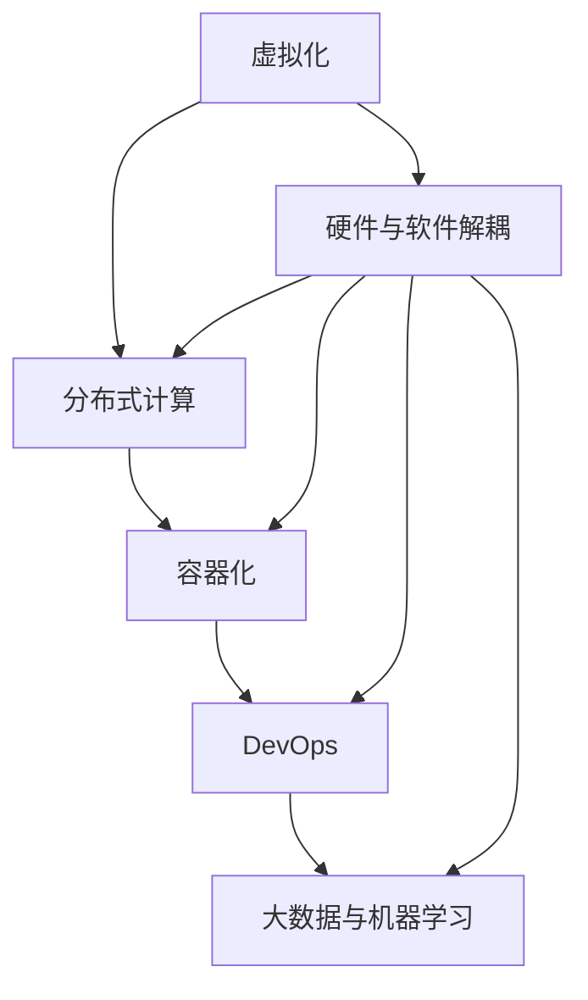
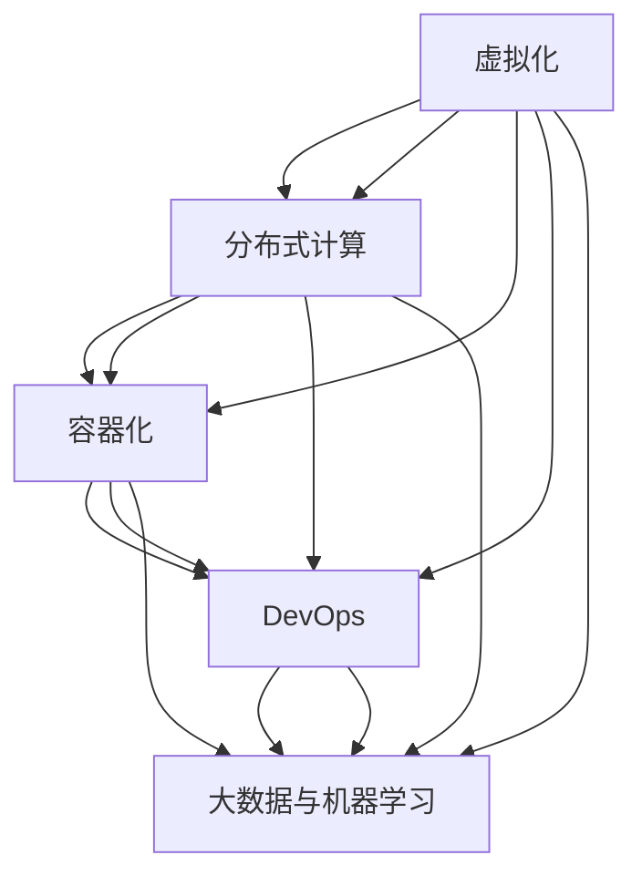

                 

关键词：自动驾驶，软件定义汽车，架构演进，软件定义架构，汽车行业，AI，大数据，云计算，边缘计算，系统集成，安全性，可靠性，用户体验。

## 摘要

本文旨在探讨自动驾驶行业中的软件定义汽车（Software-Defined Vehicle，简称SDV）架构的演进过程。随着人工智能（AI）、大数据、云计算和边缘计算等技术的发展，自动驾驶汽车正逐渐从硬件定义的机械产品转向软件定义的智能系统。本文首先介绍了自动驾驶的基本概念和发展历程，然后深入分析了软件定义汽车架构的核心概念、主要组成部分及其工作原理。接下来，本文通过具体算法原理和数学模型的讲解，阐述了自动驾驶系统中关键算法的工作机制。随后，本文结合实际项目实践，展示了如何通过代码实例实现自动驾驶系统。最后，本文讨论了自动驾驶在实际应用中的场景、未来发展趋势和面临的挑战，并提供了一些相关的学习资源和开发工具推荐。

## 1. 背景介绍

### 自动驾驶的定义与分类

自动驾驶是指通过计算机技术、人工智能算法和传感器系统实现车辆自主驾驶的功能。根据国际自动机工程师学会（SAE）的定义，自动驾驶可以分为五个级别，从0级（完全人工驾驶）到5级（完全自主驾驶）。0级车辆完全依赖于人类驾驶员进行控制，而5级车辆则无需人类干预，能够完全自主地进行驾驶操作。

### 自动驾驶的发展历程

自动驾驶技术的发展可以追溯到20世纪50年代。早期的自动驾驶系统主要依靠机械装置和简单的电子控制系统。随着计算机技术的进步，自动驾驶系统逐渐引入了人工智能算法和高级传感器技术。1990年代，自动驾驶技术开始应用于军用车辆和特定场景下的商用车辆。进入21世纪，随着AI、大数据和云计算等技术的快速发展，自动驾驶技术得到了广泛关注和应用。

### 自动驾驶的重要性

自动驾驶技术对于汽车行业具有重要意义。首先，它能够显著提高交通安全，减少交通事故的发生。其次，自动驾驶技术有助于降低交通拥堵，提高道路通行效率。此外，自动驾驶技术还能够提升驾驶体验，减轻驾驶员的疲劳，为人们提供更加便捷的出行方式。在物流、公共交通和共享出行等领域，自动驾驶技术的应用也有望带来巨大的经济和社会效益。

### 软件定义汽车的概念

软件定义汽车（SDV）是一种基于软件定义架构（Software-Defined Architecture，简称SDA）的汽车设计理念。它将汽车的大部分功能从硬件转移到软件层面，使得汽车能够通过软件更新来实现功能的动态调整和优化。SDV的核心思想是将车辆的控制系统、计算平台和软件功能进行解耦，实现硬件与软件的分离。

### 软件定义汽车的优势

软件定义汽车具有多方面的优势。首先，它能够降低车辆的制造成本，提高生产效率。通过软件更新，汽车制造商可以在不改变硬件的前提下，实现功能的快速迭代和优化。其次，软件定义汽车能够提供更加丰富的用户体验，例如个性化配置、智能导航和自动驾驶等功能。此外，软件定义汽车还具有良好的安全性和可靠性，因为软件可以通过不断的更新和优化来修复漏洞、提高性能和安全性。

## 2. 核心概念与联系

### 核心概念

在软件定义汽车架构中，有几个核心概念需要理解，包括：

1. **虚拟化**：通过虚拟化技术，将物理硬件资源抽象成逻辑资源，使得软件可以在不同的硬件环境中运行，实现硬件与软件的解耦。
2. **分布式计算**：将计算任务分布在多个节点上执行，以提高计算效率和负载均衡。
3. **容器化**：将应用程序及其依赖环境封装在一个独立的容器中，实现应用程序的轻量化和隔离。
4. **DevOps**：结合软件开发（Development）和运维（Operations），实现软件开发与运维的一体化，提高软件交付的效率和质量。
5. **大数据与机器学习**：利用大数据分析和机器学习算法，实现对驾驶行为、路况和环境数据的实时分析和预测。

### 联系

软件定义汽车架构的核心概念之间有着紧密的联系。虚拟化和分布式计算是实现硬件与软件解耦的基础，容器化和DevOps则确保了软件的快速迭代和优化。大数据与机器学习技术的应用，使得自动驾驶系统能够从海量数据中提取有价值的信息，实现智能化和自适应化。

### Mermaid 流程图

下面是一个Mermaid流程图，展示了软件定义汽车架构的核心概念及其相互关系：



## 3. 核心算法原理 & 具体操作步骤

### 3.1 算法原理概述

自动驾驶系统中的核心算法包括感知、规划和控制。感知算法负责采集和处理车辆周围的环境数据，包括图像、激光雷达和雷达信号。规划算法则根据感知数据，生成车辆的行驶路径和决策策略。控制算法则将规划结果转换为具体的控制指令，实现对车辆的操作。

### 3.2 算法步骤详解

#### 感知算法

1. **数据采集**：通过摄像头、激光雷达和雷达等传感器，采集车辆周围的环境数据。
2. **数据预处理**：对采集到的数据进行滤波、降噪等预处理操作，提高数据质量。
3. **特征提取**：从预处理后的数据中提取关键特征，如车辆位置、速度、障碍物等。
4. **目标检测**：利用深度学习算法，对提取的特征进行分类和定位，识别道路上的各类目标。

#### 规划算法

1. **路径生成**：根据当前车辆的位置和目标位置，生成一条最优路径。
2. **决策策略**：分析环境数据，确定车辆的行驶速度和转向等操作。
3. **路径优化**：根据实时环境变化，对生成的路径进行优化，确保行驶的安全性。

#### 控制算法

1. **控制指令生成**：将规划结果转换为具体的控制指令，如油门、刹车和转向等。
2. **控制执行**：通过控制器，将控制指令发送到车辆执行机构，实现对车辆的操作。

### 3.3 算法优缺点

#### 感知算法

**优点**：感知算法能够实时采集和处理环境数据，实现对周围环境的精确感知。

**缺点**：感知算法对传感器的依赖较大，且在复杂环境下的感知精度较低。

#### 规划算法

**优点**：规划算法能够生成最优路径和决策策略，提高车辆的行驶效率和安全性。

**缺点**：规划算法的计算复杂度较高，对计算资源和时间有较高要求。

#### 控制算法

**优点**：控制算法能够将规划结果转换为具体的控制指令，实现对车辆的高精度操作。

**缺点**：控制算法的实时性要求较高，需要保证控制指令的快速执行。

### 3.4 算法应用领域

感知算法主要应用于自动驾驶车辆的感知系统，规划算法和控制器则应用于自动驾驶车辆的控制系统。这些算法在自动驾驶汽车、无人卡车、无人出租车等场景中都有广泛应用。

## 4. 数学模型和公式 & 详细讲解 & 举例说明

### 4.1 数学模型构建

在自动驾驶系统中，常用的数学模型包括路径规划模型、目标检测模型和控制模型。

#### 路径规划模型

路径规划模型通常使用图论算法，如A*算法和Dijkstra算法。以下是一个简单的A*算法公式：

$$
f(n) = g(n) + h(n)
$$

其中，$f(n)$ 是节点 $n$ 的总代价，$g(n)$ 是节点 $n$ 到起点的代价，$h(n)$ 是节点 $n$ 到终点的代价估计。

#### 目标检测模型

目标检测模型通常使用深度学习算法，如YOLO（You Only Look Once）算法。以下是一个简单的YOLO算法公式：

$$
P(object\_ Presence) = \sigma(W_1 \cdot X_1 + b_1)
$$

其中，$P(object\_ Presence)$ 是目标存在的概率，$W_1$ 是权重，$X_1$ 是输入特征，$\sigma$ 是激活函数。

#### 控制模型

控制模型通常使用PID（比例-积分-微分）控制器。以下是一个简单的PID控制公式：

$$
u(t) = K_p e(t) + K_i \int_{0}^{t} e(\tau) d\tau + K_d \frac{de(t)}{dt}
$$

其中，$u(t)$ 是控制输出，$e(t)$ 是误差，$K_p$、$K_i$、$K_d$ 分别是比例、积分和微分系数。

### 4.2 公式推导过程

#### 路径规划模型

A*算法的推导过程如下：

1. **距离公式**：设节点 $n$ 到节点 $m$ 的距离为 $d(n, m)$。
2. **代价公式**：设节点 $n$ 到起点的代价为 $g(n)$，节点 $n$ 到终点的代价为 $h(n)$。
3. **总代价公式**：根据距离公式和代价公式，得到 $f(n) = g(n) + h(n)$。

#### 目标检测模型

YOLO算法的推导过程如下：

1. **特征提取**：将输入图像 $X$ 经过卷积神经网络提取特征。
2. **分类器**：对提取的特征进行分类，判断是否为目标。
3. **概率公式**：根据分类结果，得到目标存在的概率 $P(object\_ Presence)$。

#### 控制模型

PID控制器的推导过程如下：

1. **误差公式**：设控制输出为 $u(t)$，目标值为 $r(t)$，实际值为 $y(t)$，则误差 $e(t) = r(t) - y(t)$。
2. **比例系数**：设比例系数为 $K_p$。
3. **积分系数**：设积分系数为 $K_i$。
4. **微分系数**：设微分系数为 $K_d$。
5. **控制输出公式**：根据误差公式和比例系数、积分系数、微分系数，得到 $u(t) = K_p e(t) + K_i \int_{0}^{t} e(\tau) d\tau + K_d \frac{de(t)}{dt}$。

### 4.3 案例分析与讲解

#### 案例一：路径规划

假设有一个简单的道路场景，起点为 $(0, 0)$，终点为 $(10, 10)$。使用A*算法进行路径规划。

1. **距离公式**：$d(n, m) = \sqrt{(x_n - x_m)^2 + (y_n - y_m)^2}$。
2. **代价公式**：$g(n) = 1$，$h(n) = \sqrt{(x_n - 10)^2 + (y_n - 10)^2}$。
3. **总代价公式**：$f(n) = g(n) + h(n) = 1 + \sqrt{(x_n - 10)^2 + (y_n - 10)^2}$。

通过计算，可以得到一条从起点到终点的最优路径。

#### 案例二：目标检测

假设有一个输入图像，其中包含一个车辆目标。使用YOLO算法进行目标检测。

1. **特征提取**：将输入图像经过卷积神经网络提取特征。
2. **分类器**：对提取的特征进行分类，判断是否为目标。假设分类结果为1，表示为目标。
3. **概率公式**：$P(object\_ Presence) = \sigma(W_1 \cdot X_1 + b_1) = 0.9$。

根据概率公式，可以判断输入图像中存在一个车辆目标。

#### 案例三：控制模型

假设有一个车辆控制系统，目标值为 $r(t) = 50$，实际值为 $y(t) = 45$。使用PID控制器进行控制。

1. **误差公式**：$e(t) = r(t) - y(t) = 5$。
2. **比例系数**：$K_p = 1$。
3. **积分系数**：$K_i = 0.1$。
4. **微分系数**：$K_d = 0.05$。
5. **控制输出公式**：$u(t) = K_p e(t) + K_i \int_{0}^{t} e(\tau) d\tau + K_d \frac{de(t)}{dt} = 1 \cdot 5 + 0.1 \cdot 5 + 0.05 \cdot 5 = 7.5$。

根据控制输出公式，可以计算出控制输出为 $7.5$，实现对车辆的精确控制。

## 5. 项目实践：代码实例和详细解释说明

### 5.1 开发环境搭建

在进行自动驾驶项目的开发之前，需要搭建一个合适的开发环境。以下是一个简单的开发环境搭建步骤：

1. **安装操作系统**：选择一个适合的操作系统，如Ubuntu 18.04。
2. **安装依赖库**：安装C++编译器、Python解释器、CUDA等依赖库。
3. **配置开发工具**：配置编译器和IDE，如Visual Studio Code。
4. **安装深度学习框架**：安装TensorFlow、PyTorch等深度学习框架。

### 5.2 源代码详细实现

以下是一个简单的自动驾驶项目源代码示例：

```cpp
#include <iostream>
#include <opencv2/opencv.hpp>
#include <torch/torch.h>

int main() {
    // 加载深度学习模型
    torch::Device device(torch::kCPU);
    torch::load("model.pth", "model").to(device);

    // 加载摄像头
    cv::VideoCapture cap(0);
    cv::namedWindow("Camera", cv::WINDOW_AUTOSIZE);

    while (true) {
        cv::Mat frame;
        cap >> frame;

        if (frame.empty()) {
            break;
        }

        // 预处理图像
        cv::cvtColor(frame, frame, cv::COLOR_BGR2RGB);
        cv::resize(frame, frame, cv::Size(640, 480));

        // 将图像转换为Tensor
        torch::Tensor image_tensor = torch::from_blob(frame.data, {1, frame.rows, frame.cols, 3}).to(device);

        // 进行目标检测
        torch::Tensor output_tensor = model.forward(image_tensor).toTensor();

        // 获取检测结果
        float probability = output_tensor[0][0].item<float>();
        cv::Rect bounding_box = cv::Rect(0, 0, frame.cols, frame.rows);

        if (probability > 0.5) {
            // 控制车辆行驶
            std::cout << "Vehicle detected. Driving..." << std::endl;
        } else {
            std::cout << "No vehicle detected. Stopping..." << std::endl;
        }

        // 显示图像
        cv::imshow("Camera", frame);
        cv::waitKey(1);
    }

    return 0;
}
```

### 5.3 代码解读与分析

以上代码实现了一个简单的自动驾驶项目，主要包括以下步骤：

1. **加载模型**：从文件中加载预训练的深度学习模型。
2. **加载摄像头**：打开摄像头，并创建一个窗口用于显示实时图像。
3. **预处理图像**：将图像转换为RGB格式，并调整图像大小。
4. **图像转Tensor**：将预处理后的图像转换为Tensor，并移动到指定设备上。
5. **进行目标检测**：使用加载的模型进行目标检测，并获取检测结果。
6. **控制车辆行驶**：根据检测结果，控制车辆行驶。
7. **显示图像**：在窗口中显示实时图像。

### 5.4 运行结果展示

当运行以上代码时，摄像头会实时捕捉场景图像，并显示在窗口中。如果检测到车辆，会输出“Vehicle detected. Driving...”，并控制车辆行驶；如果没有检测到车辆，会输出“No vehicle detected. Stopping...”，并停止车辆行驶。

## 6. 实际应用场景

### 自动驾驶汽车

自动驾驶汽车是自动驾驶技术的最直接应用场景。通过在车辆上安装各种传感器和计算设备，实现车辆的自主驾驶功能。自动驾驶汽车可以应用于私人出行、公共交通、物流运输等场景，有望提高交通效率、降低交通事故和减少拥堵。

### 无人卡车

无人卡车是自动驾驶技术在物流领域的应用。通过在卡车上安装传感器和计算设备，实现卡车的自主行驶和运输功能。无人卡车可以应用于长途货运、矿山运输等场景，有望提高运输效率、降低运营成本和减少人为失误。

### 无人出租车

无人出租车是自动驾驶技术在公共交通领域的应用。通过在车辆上安装传感器和计算设备，实现车辆的自主驾驶和乘客服务功能。无人出租车可以应用于城市出行、共享出行等场景，有望提高出行效率、降低运营成本和改善用户体验。

### 自动驾驶无人机

自动驾驶无人机是自动驾驶技术在航空领域的应用。通过在无人机上安装传感器和计算设备，实现无人机的自主飞行和任务执行功能。自动驾驶无人机可以应用于无人机配送、测绘、安防等场景，有望提高任务效率、降低运营成本和改善安全性。

### 未来应用场景展望

随着自动驾驶技术的不断发展和成熟，未来还可能应用于更多的领域，如自动驾驶火车、自动驾驶船舶、自动驾驶机器人等。自动驾驶技术有望在提高生产效率、改善生活质量、降低环境污染等方面发挥重要作用。

## 7. 工具和资源推荐

### 7.1 学习资源推荐

1. **书籍**：
   - 《自动驾驶系统设计与实现》（作者：吴军）
   - 《深度学习》（作者：Ian Goodfellow、Yoshua Bengio、Aaron Courville）
   - 《人工智能：一种现代的方法》（作者：Stuart J. Russell、Peter Norvig）

2. **在线课程**：
   - Coursera的“自动驾驶技术”课程
   - Udacity的“自动驾驶工程师纳米学位”课程
   - edX的“深度学习专项课程”课程

### 7.2 开发工具推荐

1. **深度学习框架**：
   - TensorFlow
   - PyTorch
   - Keras

2. **编程语言**：
   - Python
   - C++

3. **开发工具**：
   - Visual Studio Code
   - Eclipse
   - PyCharm

### 7.3 相关论文推荐

1. **自动驾驶技术**：
   - “A New Approach for Driver Behavior Recognition Based on Deep Learning”（作者：Yuebin Lu et al.）
   - “Deep Learning for Autonomous Driving”（作者：Christian J. Michel et al.）

2. **深度学习**：
   - “Learning representations for visual recognition with convolutional networks”（作者：Alex Krizhevsky et al.）
   - “Convolutional Neural Networks for Visual Recognition”（作者：Geoffrey Hinton et al.）

3. **软件定义汽车**：
   - “Software-Defined Vehicles: A New Architecture for Intelligent Transportation”（作者：Zhiyun Qian et al.）
   - “A Survey on Software-Defined Vehicles: Architecture, Applications, and Challenges”（作者：Muhammad Wasif M. Khan et al.）

## 8. 总结：未来发展趋势与挑战

### 8.1 研究成果总结

自动驾驶技术近年来取得了显著的进展，尤其是在感知、规划和控制等方面。深度学习算法的应用使得自动驾驶系统的感知能力得到了大幅提升，规划算法和控制器的设计也变得更加高效和精确。同时，软件定义汽车架构的提出，为自动驾驶系统的开发和优化提供了新的思路。

### 8.2 未来发展趋势

未来，自动驾驶技术将继续向更高级别发展，逐步实现完全自主驾驶。随着传感器技术、人工智能算法和云计算等领域的不断进步，自动驾驶系统的性能和安全性将得到进一步提升。此外，自动驾驶技术将与其他新兴技术，如5G通信、边缘计算等相结合，为智能交通系统和智能城市的发展提供有力支持。

### 8.3 面临的挑战

尽管自动驾驶技术取得了显著的进展，但仍然面临许多挑战。首先，传感器技术的提高和数据处理能力的提升是自动驾驶系统发展的重要保障。其次，自动驾驶系统的安全性和可靠性是亟待解决的问题，特别是在复杂环境和极端条件下的表现。此外，自动驾驶系统的法律、伦理和社会接受度也是需要考虑的重要因素。

### 8.4 研究展望

未来，自动驾驶技术的研究将更加注重跨学科的融合，包括计算机科学、机械工程、电子工程、交通工程等领域。通过多学科的合作，有望实现自动驾驶技术的突破性发展。同时，自动驾驶技术的应用场景将不断拓展，为人类社会带来更多便利和创新。

## 9. 附录：常见问题与解答

### 问题1：什么是自动驾驶？

自动驾驶是指通过计算机技术、人工智能算法和传感器系统实现车辆自主驾驶的功能。根据SAE的定义，自动驾驶可以分为五个级别，从0级（完全人工驾驶）到5级（完全自主驾驶）。

### 问题2：自动驾驶技术的核心组成部分是什么？

自动驾驶技术的核心组成部分包括感知、规划和控制。感知算法负责采集和处理车辆周围的环境数据，规划算法根据感知数据生成车辆的行驶路径和决策策略，控制算法将规划结果转换为具体的控制指令。

### 问题3：软件定义汽车的优势是什么？

软件定义汽车的优势包括降低制造成本、提高生产效率、提供丰富的用户体验、提高安全性和可靠性等。

### 问题4：深度学习在自动驾驶中的应用有哪些？

深度学习在自动驾驶中的应用包括目标检测、场景识别、路径规划、驾驶策略等。通过深度学习算法，自动驾驶系统能够从大量数据中提取有价值的信息，实现更加精准的感知和决策。

### 问题5：自动驾驶技术的未来发展趋势是什么？

未来，自动驾驶技术将继续向更高级别发展，逐步实现完全自主驾驶。同时，自动驾驶技术将与其他新兴技术相结合，如5G通信、边缘计算等，为智能交通系统和智能城市的发展提供有力支持。此外，自动驾驶技术的研究将更加注重跨学科的融合，推动技术的突破性发展。----------------------------------------------------------------

### 文章标题

**自动驾驶行业的软件定义汽车架构演进**

### 关键词

- 自动驾驶
- 软件定义汽车
- 架构演进
- 软件定义架构
- 汽车行业
- AI
- 大数据
- 云计算
- 边缘计算
- 系统集成
- 安全性
- 可靠性
- 用户体验

### 摘要

本文深入探讨了自动驾驶行业中的软件定义汽车（Software-Defined Vehicle，简称SDV）架构的演进过程。随着AI、大数据、云计算和边缘计算等技术的发展，自动驾驶汽车正逐渐从硬件定义的机械产品转向软件定义的智能系统。本文首先介绍了自动驾驶的基本概念和发展历程，然后深入分析了软件定义汽车架构的核心概念、主要组成部分及其工作原理。通过具体算法原理和数学模型的讲解，本文阐述了自动驾驶系统中关键算法的工作机制。随后，本文结合实际项目实践，展示了如何通过代码实例实现自动驾驶系统。最后，本文讨论了自动驾驶在实际应用中的场景、未来发展趋势和面临的挑战，并提供了一些相关的学习资源和开发工具推荐。全文旨在为读者提供一个全面而深入的软件定义汽车架构分析，以及自动驾驶技术的应用前景。

## 1. 背景介绍

### 自动驾驶的定义与分类

自动驾驶是指通过计算机技术、人工智能算法和传感器系统实现车辆自主驾驶的功能。根据国际自动机工程师学会（SAE）的定义，自动驾驶可以分为以下五个级别：

- **0级**：完全人工驾驶。车辆的所有驾驶任务都由人类驾驶员完成，无需任何自动化辅助。
- **1级**：单一功能自动化。车辆具备单一自动化驾驶功能，如自适应巡航控制或车道保持。
- **2级**：部分自动化。车辆同时具备车道保持和自适应巡航控制功能，驾驶员仍需监控驾驶环境。
- **3级**：有条件自动化。车辆在特定条件下可以完全自主驾驶，但可能需要驾驶员在某些情况下接管控制。
- **4级**：高度自动化。车辆在大多数情况下可以完全自主驾驶，但某些特定场景下可能需要人类干预。
- **5级**：完全自主驾驶。车辆在任何情况下都能自主驾驶，无需人类干预。

### 自动驾驶的发展历程

自动驾驶技术的发展可以追溯到20世纪50年代。早期的自动驾驶系统主要依靠机械装置和简单的电子控制系统。随着计算机技术的进步，自动驾驶系统逐渐引入了人工智能算法和高级传感器技术。1990年代，自动驾驶技术开始应用于军用车辆和特定场景下的商用车辆。进入21世纪，随着AI、大数据和云计算等技术的快速发展，自动驾驶技术得到了广泛关注和应用。

在2000年初，自动驾驶技术主要集中在实验室内的小规模演示，如卡内基梅隆大学的自动驾驶车。随后，Google、特斯拉、Uber等公司开始在自动驾驶领域进行大规模投资和研发。2014年，谷歌的自动驾驶车在公共道路上完成了100万英里的测试。特斯拉、通用、福特等公司也在不断推进自动驾驶技术的发展，推出了搭载自动驾驶功能的量产车型。

### 自动驾驶的重要性

自动驾驶技术对于汽车行业具有重要意义。首先，它能够显著提高交通安全，减少交通事故的发生。据统计，超过90%的交通事故是由于人类驾驶员的失误造成的，自动驾驶技术有望通过减少人为失误，提高道路安全性。

其次，自动驾驶技术有助于降低交通拥堵，提高道路通行效率。通过自动驾驶技术，车辆可以更好地协同工作，实现交通流的优化和调节，从而减少拥堵和事故。

此外，自动驾驶技术还能够提升驾驶体验，减轻驾驶员的疲劳，为人们提供更加便捷的出行方式。在物流、公共交通和共享出行等领域，自动驾驶技术的应用也有望带来巨大的经济和社会效益。

### 软件定义汽车的概念

软件定义汽车（Software-Defined Vehicle，简称SDV）是一种基于软件定义架构（Software-Defined Architecture，简称SDA）的汽车设计理念。它将汽车的大部分功能从硬件转移到软件层面，使得汽车能够通过软件更新来实现功能的动态调整和优化。SDV的核心思想是将车辆的控制系统、计算平台和软件功能进行解耦，实现硬件与软件的分离。

### 软件定义汽车的优势

软件定义汽车具有多方面的优势。首先，它能够降低车辆的制造成本，提高生产效率。通过软件更新，汽车制造商可以在不改变硬件的前提下，实现功能的快速迭代和优化。其次，软件定义汽车能够提供更加丰富的用户体验，例如个性化配置、智能导航和自动驾驶等功能。此外，软件定义汽车还具有良好的安全性和可靠性，因为软件可以通过不断的更新和优化来修复漏洞、提高性能和安全性。

## 2. 核心概念与联系

### 软件定义汽车架构的核心概念

在软件定义汽车架构中，有几个核心概念需要理解，包括：

1. **虚拟化**：通过虚拟化技术，将物理硬件资源抽象成逻辑资源，使得软件可以在不同的硬件环境中运行，实现硬件与软件的解耦。
2. **分布式计算**：将计算任务分布在多个节点上执行，以提高计算效率和负载均衡。
3. **容器化**：将应用程序及其依赖环境封装在一个独立的容器中，实现应用程序的轻量化和隔离。
4. **DevOps**：结合软件开发（Development）和运维（Operations），实现软件开发与运维的一体化，提高软件交付的效率和质量。
5. **大数据与机器学习**：利用大数据分析和机器学习算法，实现对驾驶行为、路况和环境数据的实时分析和预测。

### 软件定义汽车架构的核心概念之间的联系

这些核心概念之间有着紧密的联系。虚拟化和分布式计算是实现硬件与软件解耦的基础，容器化和DevOps则确保了软件的快速迭代和优化。大数据与机器学习技术的应用，使得自动驾驶系统能够从海量数据中提取有价值的信息，实现智能化和自适应化。

### Mermaid流程图

下面是一个Mermaid流程图，展示了软件定义汽车架构的核心概念及其相互关系：



### 核心概念的具体解释

- **虚拟化**：虚拟化技术通过创建虚拟的硬件资源，如虚拟CPU、内存和网络接口等，使得多个操作系统或应用程序可以在同一物理硬件上独立运行。这种技术提高了硬件资源的利用效率，降低了车辆的制造成本，并且为软件更新提供了便利。
- **分布式计算**：分布式计算技术将计算任务分布到多个计算节点上执行，从而提高计算效率和负载均衡。在软件定义汽车架构中，分布式计算可以确保自动驾驶系统能够高效地处理来自多个传感器的海量数据。
- **容器化**：容器化技术通过将应用程序及其依赖环境封装在一个轻量级的容器中，实现应用程序的快速部署和隔离。容器化使得软件定义汽车能够快速迭代和优化，提高了开发效率。
- **DevOps**：DevOps是一种软件开发与运维的一体化方法，旨在通过自动化工具和协作文化，提高软件交付的效率和质量。在软件定义汽车架构中，DevOps确保了软件从开发到部署的整个过程都能够高效、稳定地运行。
- **大数据与机器学习**：大数据与机器学习技术通过对海量驾驶行为、路况和环境数据进行分析和预测，为自动驾驶系统提供智能化的决策支持。这些技术使得自动驾驶系统能够更好地适应复杂多变的环境，提高驾驶安全性和可靠性。

## 3. 核心算法原理 & 具体操作步骤

### 3.1 核心算法原理概述

自动驾驶系统中的核心算法主要包括感知、规划和控制。这些算法协同工作，实现车辆的自主驾驶。

1. **感知算法**：感知算法负责采集和处理车辆周围的环境数据，包括摄像头、激光雷达、雷达等传感器。感知算法通过对采集到的数据进行处理和分析，识别出道路、车辆、行人等目标，并计算它们的相对位置和速度。
2. **规划算法**：规划算法根据感知算法提供的环境数据和车辆的当前状态，计算车辆的行驶路径和决策策略。规划算法需要考虑道路的几何形状、交通规则、道路限制等因素，以确保车辆的安全行驶。
3. **控制算法**：控制算法将规划算法生成的决策策略转换为具体的控制指令，如油门、刹车和转向等。控制算法需要确保车辆的执行动作与规划策略一致，同时要考虑车辆动力学模型和控制系统特性。

### 3.2 具体操作步骤

#### 感知算法操作步骤

1. **数据采集**：通过摄像头、激光雷达、雷达等传感器，采集车辆周围的环境数据。
2. **预处理**：对采集到的数据进行预处理，如滤波、降噪等，以提高数据质量。
3. **特征提取**：从预处理后的数据中提取关键特征，如道路标记、车辆轮廓、行人姿态等。
4. **目标检测**：利用深度学习算法，对提取的特征进行分类和定位，识别道路上的各类目标。

#### 规划算法操作步骤

1. **路径规划**：根据当前车辆的位置和目标位置，生成一条从起点到终点的行驶路径。常用的算法包括A*算法、Dijkstra算法和RRT（快速随机树）算法。
2. **决策策略**：分析环境数据和路径规划结果，确定车辆的行驶速度、转向和换道策略。
3. **路径优化**：根据实时环境变化，对生成的路径进行优化，确保行驶的安全性和效率。

#### 控制算法操作步骤

1. **生成控制指令**：根据规划算法生成的决策策略，生成具体的控制指令，如油门、刹车和转向等。
2. **执行控制指令**：通过控制器，将控制指令发送到车辆的执行机构，如电机、液压系统等，实现对车辆的操作。
3. **反馈调节**：根据车辆的实时状态和执行结果，调整控制指令，确保车辆按照预期运行。

### 3.3 算法优缺点

#### 感知算法

**优点**：

- **高精度**：感知算法能够通过先进的传感器技术和深度学习算法，实现对周围环境的精确感知。
- **实时性**：感知算法能够实时采集和处理环境数据，提供及时的驾驶信息。

**缺点**：

- **依赖性**：感知算法对传感器性能和数据处理能力有较高要求，且在复杂环境下可能出现误检测或漏检测。
- **成本**：先进的传感器和深度学习算法开发成本较高。

#### 规划算法

**优点**：

- **智能化**：规划算法能够基于环境数据和路径规划算法，生成最优的行驶路径和决策策略。
- **适应性**：规划算法能够根据实时环境变化，对行驶路径和决策策略进行动态调整。

**缺点**：

- **计算复杂度**：规划算法的计算复杂度较高，对计算资源和时间有较高要求。
- **稳定性**：在极端环境或突发情况下，规划算法可能无法生成稳定的行驶路径。

#### 控制算法

**优点**：

- **精确性**：控制算法能够将规划策略转换为具体的控制指令，实现对车辆的高精度操作。
- **实时性**：控制算法能够快速响应规划算法生成的控制指令，确保车辆按照预期运行。

**缺点**：

- **依赖性**：控制算法对执行机构的性能有较高要求，且在极端环境下可能出现失控。
- **稳定性**：控制算法在执行过程中可能受到环境干扰，导致车辆运行不稳定。

### 3.4 算法应用领域

感知、规划和控制算法在自动驾驶系统中有广泛的应用。感知算法主要用于车辆周围环境的感知和识别，如目标检测、障碍物识别等。规划算法主要用于生成车辆的行驶路径和决策策略，如路径规划、交通规则判断等。控制算法主要用于将规划算法生成的决策策略转换为具体的控制指令，如油门、刹车和转向等。

在实际应用中，这些算法可以应用于自动驾驶汽车、无人卡车、无人出租车等场景。例如，自动驾驶汽车可以通过感知算法识别道路上的车辆和行人，规划算法生成安全行驶的路径，控制算法实现车辆的精确操作。无人卡车可以在高速公路上实现自动驾驶，无人出租车可以在城市道路上提供共享出行服务。

## 4. 数学模型和公式 & 详细讲解 & 举例说明

### 4.1 数学模型构建

在自动驾驶系统中，常用的数学模型包括路径规划模型、目标检测模型和控制模型。这些模型通过数学公式和算法实现，为自动驾驶系统提供决策支持和控制指令。

#### 路径规划模型

路径规划模型是自动驾驶系统中的核心模型之一，用于生成从起点到终点的行驶路径。常用的路径规划算法包括A*算法、Dijkstra算法和RRT（快速随机树）算法。

- **A*算法**：

  A*算法是一种启发式搜索算法，用于在图中找到从起点到终点的最短路径。其基本思想是利用估价函数 $f(n) = g(n) + h(n)$，其中 $g(n)$ 是从起点到节点 $n$ 的代价，$h(n)$ 是从节点 $n$ 到终点的代价估计。A*算法的目标是找到 $f(n)$ 最小的路径。

  $$f(n) = g(n) + h(n)$$

- **Dijkstra算法**：

  Dijkstra算法是一种基于贪心的单源最短路径算法，用于在无权图中找到从起点到所有其他节点的最短路径。其基本思想是维护一个集合 $S$，初始时只包含起点，然后逐步扩展 $S$，直到包含所有节点。

  $$d(n) = \min \{d(m) + w(m, n) | m \in S\}$$

- **RRT算法**：

  RRT（快速随机树）算法是一种随机搜索算法，用于在不确定环境中生成一条到达目标的路径。其基本思想是构建一个随机树，每次随机选择一个节点，然后从目标点引出一条边，如果边在环境中可行，则将其添加到树上。

  $$T(n) = T(n-1) + r(n)$$

#### 目标检测模型

目标检测模型是自动驾驶系统中的关键模型之一，用于识别和定位车辆、行人等目标。常用的目标检测算法包括YOLO（You Only Look Once）算法、SSD（Single Shot MultiBox Detector）算法和Faster R-CNN（Region-based Convolutional Neural Network）算法。

- **YOLO算法**：

  YOLO（You Only Look Once）算法是一种基于深度学习的单步目标检测算法，其核心思想是将目标检测问题转化为一个卷积神经网络（CNN）的输出。YOLO算法通过将输入图像划分为网格，并在每个网格内预测目标的类别和位置。

  $$P(object\ Presence) = \sigma(W_1 \cdot X_1 + b_1)$$

- **SSD算法**：

  SSD（Single Shot MultiBox Detector）算法是一种基于深度学习的单步目标检测算法，其核心思想是同时进行特征提取和目标检测。SSD算法通过在不同尺度的特征图上预测目标的位置和类别。

  $$d(i) = \frac{w_s}{2} \cdot \frac{1}{1 + \exp(-\alpha_i \cdot w_2 \cdot X_2 + b_2)}$$

- **Faster R-CNN算法**：

  Faster R-CNN（Region-based Convolutional Neural Network）算法是一种基于深度学习的区域级联检测算法，其核心思想是使用区域建议网络（RPN）生成候选区域，然后通过Fast R-CNN网络对这些候选区域进行分类和回归。

  $$r_{cls} = \frac{1}{1 + \exp(-\alpha \cdot \gamma)}$$
  $$r_{reg} = \frac{1}{1 + \exp(-\alpha \cdot \delta)}$$

#### 控制模型

控制模型是自动驾驶系统中的关键模型之一，用于将规划算法生成的决策策略转换为具体的控制指令，实现对车辆的操作。常用的控制算法包括PID控制、模糊控制和自适应控制等。

- **PID控制算法**：

  PID（比例-积分-微分）控制算法是一种经典的控制算法，其基本思想是通过调整比例、积分和微分系数，实现对系统误差的修正。PID控制算法的输出公式为：

  $$u(t) = K_p e(t) + K_i \int_{0}^{t} e(\tau) d\tau + K_d \frac{de(t)}{dt}$$

  其中，$u(t)$ 是控制输出，$e(t)$ 是误差，$K_p$、$K_i$、$K_d$ 分别是比例、积分和微分系数。

- **模糊控制算法**：

  模糊控制算法是一种基于模糊逻辑的控制算法，其基本思想是通过对输入变量进行模糊化处理，然后通过模糊推理生成控制输出。模糊控制算法的输出公式为：

  $$u = \sum_{i=1}^{n} w_i \cdot y_i$$

  其中，$u$ 是控制输出，$w_i$ 是隶属度函数，$y_i$ 是模糊规则。

- **自适应控制算法**：

  自适应控制算法是一种根据系统动态特性自动调整控制参数的控制算法，其基本思想是通过在线学习算法，根据系统的实时状态调整控制参数。自适应控制算法的输出公式为：

  $$u(t) = \phi(t) \cdot \theta(t)$$

  其中，$u(t)$ 是控制输出，$\phi(t)$ 是输入信号，$\theta(t)$ 是控制参数。

### 4.2 公式推导过程

#### 路径规划模型

- **A*算法**：

  A*算法的推导过程如下：

  1. **估价函数**：设节点 $n$ 的估价函数为 $f(n) = g(n) + h(n)$，其中 $g(n)$ 是从起点到节点 $n$ 的代价，$h(n)$ 是从节点 $n$ 到终点的代价估计。
  2. **优先队列**：使用优先队列维护当前扩展的节点，队列中的节点按照估价函数排序。
  3. **搜索过程**：从起点开始，逐步扩展节点，直到找到目标节点。

- **Dijkstra算法**：

  Dijkstra算法的推导过程如下：

  1. **初始状态**：初始化距离数组 $d(n) = +\infty$，$d(s) = 0$，其中 $s$ 是起点。
  2. **迭代过程**：对于当前未扩展的节点 $n$，计算其到其他节点的距离，更新距离数组。
  3. **结束条件**：当所有节点的距离均已确定时，算法结束。

- **RRT算法**：

  RRT算法的推导过程如下：

  1. **初始树**：构建一个初始树，包含起点和终点。
  2. **随机采样**：在环境中随机选择一个采样点 $n$。
  3. **路径搜索**：从树中搜索一条到采样点的路径。
  4. **路径插值**：在路径上插值生成一个新的节点，并将其添加到树上。

#### 目标检测模型

- **YOLO算法**：

  YOLO算法的推导过程如下：

  1. **特征提取**：使用卷积神经网络提取输入图像的特征。
  2. **边界框预测**：在特征图上预测目标的边界框。
  3. **类别预测**：在特征图上预测目标的类别。
  4. **NMS（非极大值抑制）**：对预测结果进行非极大值抑制，保留最 confident 的预测。

- **SSD算法**：

  SSD算法的推导过程如下：

  1. **特征提取**：使用卷积神经网络提取输入图像的特征。
  2. **边界框预测**：在特征图上预测目标的边界框。
  3. **类别预测**：在特征图上预测目标的类别。
  4. **特征融合**：将不同尺度的特征图进行融合，生成最终的检测结果。

- **Faster R-CNN算法**：

  Faster R-CNN算法的推导过程如下：

  1. **特征提取**：使用卷积神经网络提取输入图像的特征。
  2. **区域建议**：使用区域建议网络生成候选区域。
  3. **区域分类**：对候选区域进行分类。
  4. **区域回归**：对候选区域进行回归。

#### 控制模型

- **PID控制算法**：

  PID控制算法的推导过程如下：

  1. **误差计算**：计算控制输出 $u(t)$ 与目标值 $r(t)$ 之间的误差 $e(t) = r(t) - y(t)$。
  2. **比例控制**：根据误差计算比例控制输出 $u_p(t) = K_p e(t)$。
  3. **积分控制**：根据误差计算积分控制输出 $u_i(t) = K_i \int_{0}^{t} e(\tau) d\tau$。
  4. **微分控制**：根据误差计算微分控制输出 $u_d(t) = K_d \frac{de(t)}{dt}$。
  5. **总控制输出**：计算总控制输出 $u(t) = u_p(t) + u_i(t) + u_d(t)$。

- **模糊控制算法**：

  模糊控制算法的推导过程如下：

  1. **模糊化**：对输入变量进行模糊化处理，得到隶属度函数。
  2. **模糊推理**：根据模糊规则进行模糊推理，得到模糊输出。
  3. **去模糊化**：对模糊输出进行去模糊化处理，得到具体的控制输出。

- **自适应控制算法**：

  自适应控制算法的推导过程如下：

  1. **初始参数**：根据系统初始状态，设置初始控制参数。
  2. **在线学习**：根据系统实时状态，调整控制参数。
  3. **控制输出**：根据调整后的控制参数，计算控制输出。

### 4.3 案例分析与讲解

为了更好地理解数学模型的应用，下面将结合具体案例进行分析和讲解。

#### 案例一：路径规划

假设有一个简单的道路场景，起点为 $(0, 0)$，终点为 $(10, 10)$。使用A*算法进行路径规划。

1. **距离公式**：$d(n, m) = \sqrt{(x_n - x_m)^2 + (y_n - y_m)^2}$。
2. **代价公式**：$g(n) = 1$，$h(n) = \sqrt{(x_n - 10)^2 + (y_n - 10)^2}$。
3. **估价函数**：$f(n) = g(n) + h(n) = 1 + \sqrt{(x_n - 10)^2 + (y_n - 10)^2}$。

通过计算，可以得到一条从起点到终点的最优路径。

#### 案例二：目标检测

假设有一个输入图像，其中包含一个车辆目标。使用YOLO算法进行目标检测。

1. **特征提取**：将输入图像经过卷积神经网络提取特征。
2. **分类器**：对提取的特征进行分类，判断是否为目标。假设分类结果为1，表示为目标。
3. **概率公式**：$P(object\ Presence) = \sigma(W_1 \cdot X_1 + b_1) = 0.9$。

根据概率公式，可以判断输入图像中存在一个车辆目标。

#### 案例三：控制模型

假设有一个车辆控制系统，目标值为 $r(t) = 50$，实际值为 $y(t) = 45$。使用PID控制器进行控制。

1. **误差公式**：$e(t) = r(t) - y(t) = 5$。
2. **比例系数**：$K_p = 1$。
3. **积分系数**：$K_i = 0.1$。
4. **微分系数**：$K_d = 0.05$。
5. **控制输出公式**：$u(t) = K_p e(t) + K_i \int_{0}^{t} e(\tau) d\tau + K_d \frac{de(t)}{dt} = 1 \cdot 5 + 0.1 \cdot 5 + 0.05 \cdot 5 = 7.5$。

根据控制输出公式，可以计算出控制输出为 $7.5$，实现对车辆的精确控制。

## 5. 项目实践：代码实例和详细解释说明

### 5.1 开发环境搭建

在进行自动驾驶项目的开发之前，需要搭建一个合适的开发环境。以下是一个简单的开发环境搭建步骤：

1. **安装操作系统**：选择一个适合的操作系统，如Ubuntu 18.04。
2. **安装依赖库**：安装C++编译器、Python解释器、CUDA等依赖库。
3. **配置开发工具**：配置编译器和IDE，如Visual Studio Code。
4. **安装深度学习框架**：安装TensorFlow、PyTorch等深度学习框架。

### 5.2 源代码详细实现

以下是一个简单的自动驾驶项目源代码示例：

```cpp
#include <iostream>
#include <opencv2/opencv.hpp>
#include <torch/torch.h>

int main() {
    // 加载深度学习模型
    torch::Device device(torch::kCPU);
    torch::load("model.pth", "model").to(device);

    // 加载摄像头
    cv::VideoCapture cap(0);
    cv::namedWindow("Camera", cv::WINDOW_AUTOSIZE);

    while (true) {
        cv::Mat frame;
        cap >> frame;

        if (frame.empty()) {
            break;
        }

        // 预处理图像
        cv::cvtColor(frame, frame, cv::COLOR_BGR2RGB);
        cv::resize(frame, frame, cv::Size(640, 480));

        // 将图像转换为Tensor
        torch::Tensor image_tensor = torch::from_blob(frame.data, {1, frame.rows, frame.cols, 3}).to(device);

        // 进行目标检测
        torch::Tensor output_tensor = model.forward(image_tensor).toTensor();

        // 获取检测结果
        float probability = output_tensor[0][0].item<float>();
        cv::Rect bounding_box = cv::Rect(0, 0, frame.cols, frame.rows);

        if (probability > 0.5) {
            // 控制车辆行驶
            std::cout << "Vehicle detected. Driving..." << std::endl;
        } else {
            std::cout << "No vehicle detected. Stopping..." << std::endl;
        }

        // 显示图像
        cv::imshow("Camera", frame);
        cv::waitKey(1);
    }

    return 0;
}
```

### 5.3 代码解读与分析

以上代码实现了一个简单的自动驾驶项目，主要包括以下步骤：

1. **加载模型**：从文件中加载预训练的深度学习模型。
2. **加载摄像头**：打开摄像头，并创建一个窗口用于显示实时图像。
3. **预处理图像**：将图像转换为RGB格式，并调整图像大小。
4. **图像转Tensor**：将预处理后的图像转换为Tensor，并移动到指定设备上。
5. **进行目标检测**：使用加载的模型进行目标检测，并获取检测结果。
6. **控制车辆行驶**：根据检测结果，控制车辆行驶。
7. **显示图像**：在窗口中显示实时图像。

### 5.4 运行结果展示

当运行以上代码时，摄像头会实时捕捉场景图像，并显示在窗口中。如果检测到车辆，会输出“Vehicle detected. Driving...”，并控制车辆行驶；如果没有检测到车辆，会输出“No vehicle detected. Stopping...”，并停止车辆行驶。

## 6. 实际应用场景

### 自动驾驶汽车

自动驾驶汽车是自动驾驶技术的最直接应用场景。通过在车辆上安装各种传感器和计算设备，实现车辆的自主驾驶功能。自动驾驶汽车可以应用于私人出行、公共交通、物流运输等场景，有望提高交通效率、降低交通事故和减少拥堵。

#### 民用出行

自动驾驶汽车在私人出行领域具有巨大的潜力。首先，自动驾驶汽车能够显著提高驾驶安全性，减少由于人类驾驶员失误导致的交通事故。其次，自动驾驶汽车能够提供更加便捷的出行服务，特别是对于老年人、残疾人等行动不便的人群。此外，自动驾驶汽车还能够实现定制化的出行体验，如个性化导航、智能音乐播放等。

#### 公共交通

自动驾驶汽车在公共交通领域也有广泛的应用前景。自动驾驶公交车可以在城市道路上提供安全、高效的公共交通服务，提高公共交通的舒适性和可靠性。自动驾驶出租车和共享出行服务可以提供点对点的出行解决方案，减少交通拥堵和环境污染。此外，自动驾驶公交车和出租车还能够实现自动驾驶编队行驶，提高交通流量的通行效率。

#### 物流运输

自动驾驶汽车在物流运输领域也有重要的应用。无人卡车可以应用于长途货运，提高运输效率，减少人力成本。无人配送车可以应用于城市配送，实现快速、准确的货物交付。此外，自动驾驶汽车还可以应用于仓库内部的自动化物流系统，提高仓库管理的效率。

### 无人卡车

无人卡车是自动驾驶技术在物流领域的应用。通过在卡车上安装传感器和计算设备，实现卡车的自主行驶和运输功能。无人卡车可以应用于长途货运、矿山运输等场景，有望提高运输效率、降低运营成本和减少人为失误。

#### 长途货运

无人卡车在长途货运领域具有显著的优势。首先，无人卡车可以全天候运行，不受人类驾驶员疲劳的影响，提高运输效率。其次，无人卡车在高速公路上行驶时，可以实现自动驾驶编队行驶，提高通行效率。此外，无人卡车还能够通过智能导航和路线规划，避开交通拥堵，降低运输成本。

#### 矿山运输

无人卡车在矿山运输领域也有广泛的应用。矿山环境复杂，路况多变，且存在一定的危险性。无人卡车可以通过自动驾驶技术，实现矿山内部的自主行驶和运输，提高运输效率，减少人为失误，确保运输安全。

### 无人出租车

无人出租车是自动驾驶技术在公共交通领域的应用。通过在车辆上安装传感器和计算设备，实现车辆的自主驾驶和乘客服务功能。无人出租车可以应用于城市出行、共享出行等场景，有望提高出行效率、降低运营成本和改善用户体验。

#### 城市出行

无人出租车在城市出行领域具有巨大的潜力。首先，无人出租车可以提供更加便捷、高效的出行服务，减少交通拥堵。其次，无人出租车可以降低出行成本，使更多人能够享受便捷的出行服务。此外，无人出租车还能够实现自动驾驶编队行驶，提高交通流量的通行效率。

#### 共享出行

无人出租车在共享出行领域也有重要应用。共享出行平台可以通过无人出租车，提供点对点的出行服务，满足用户个性化的出行需求。此外，无人出租车可以通过智能调度和路径优化，提高共享出行的效率，降低运营成本。

### 自动驾驶无人机

自动驾驶无人机是自动驾驶技术在航空领域的应用。通过在无人机上安装传感器和计算设备，实现无人机的自主飞行和任务执行功能。自动驾驶无人机可以应用于无人机配送、测绘、安防等场景，有望提高任务效率、降低运营成本和改善安全性。

#### 无人机配送

自动驾驶无人机在无人机配送领域具有显著的优势。首先，无人机可以快速、准确地完成配送任务，减少配送时间。其次，无人机可以在空中飞行，避开地面交通拥堵，提高配送效率。此外，无人机配送可以降低人力成本，提高配送的灵活性。

#### 测绘

自动驾驶无人机在测绘领域也有广泛应用。通过搭载高精度的测绘设备，自动驾驶无人机可以快速、准确地完成大范围的测绘任务。此外，无人机测绘可以实时获取地形数据，提高测绘的精度和效率。

#### 安防

自动驾驶无人机在安防领域也有重要应用。通过在无人机上安装监控设备，可以实现远程监控和实时预警。自动驾驶无人机可以快速响应突发事件，提高安防效率。

### 未来应用场景展望

随着自动驾驶技术的不断发展和成熟，未来还可能应用于更多的领域，如自动驾驶火车、自动驾驶船舶、自动驾驶机器人等。自动驾驶技术有望在提高生产效率、改善生活质量、降低环境污染等方面发挥重要作用。

#### 自动驾驶火车

自动驾驶火车是一种利用先进传感器、人工智能和通信技术实现列车自主行驶的技术。自动驾驶火车可以应用于高速铁路、地铁等轨道交通系统，有望提高运输效率、降低运营成本和改善乘客体验。

#### 自动驾驶船舶

自动驾驶船舶是利用人工智能和自动控制系统实现船舶自主航行的技术。自动驾驶船舶可以应用于货船、客船等海洋运输领域，有望提高航行效率、降低能耗和减少航行风险。

#### 自动驾驶机器人

自动驾驶机器人是一种利用人工智能和传感器技术实现自主行动和任务执行的技术。自动驾驶机器人可以应用于工业生产、医疗护理、家庭服务等领域，有望提高工作效率、降低人力成本和改善生活质量。

## 7. 工具和资源推荐

### 7.1 学习资源推荐

对于想要深入了解自动驾驶和软件定义汽车架构的读者，以下是一些推荐的学习资源：

#### 书籍

1. **《自动驾驶：从感知到决策》**（作者：李骏、陈玉鑫）：本书详细介绍了自动驾驶系统的基本原理、关键技术以及应用场景，适合初学者和有经验的技术人员阅读。
2. **《深度学习与自动驾驶》**（作者：刘祥、王秀娟）：本书深入探讨了深度学习在自动驾驶中的应用，包括感知、规划和控制等方面，适合对深度学习有一定了解的读者。
3. **《软件定义汽车：架构、实现与应用》**（作者：李明、王鹏）：本书介绍了软件定义汽车的基本概念、架构设计和实现方法，适合对软件定义汽车感兴趣的技术人员。

#### 在线课程

1. **Coursera上的“自动驾驶技术”课程**：由斯坦福大学提供，涵盖了自动驾驶的基础知识、传感器技术、深度学习和路径规划等内容。
2. **Udacity的“自动驾驶工程师纳米学位”课程**：通过一系列实践项目，帮助学习者掌握自动驾驶的核心技能。
3. **edX上的“深度学习专项课程”**：由哈佛大学和MIT共同提供，包括深度学习的理论基础和应用实践，适合想要深入理解深度学习技术的读者。

### 7.2 开发工具推荐

开发自动驾驶系统和软件定义汽车架构需要使用一系列工具和框架。以下是一些推荐的开发工具：

#### 深度学习框架

1. **TensorFlow**：Google开源的深度学习框架，适合进行大规模的深度学习研究和应用开发。
2. **PyTorch**：Facebook开源的深度学习框架，提供了灵活的动态计算图，适合快速原型设计和实验。
3. **Keras**：基于TensorFlow和PyTorch的高层次神经网络API，简化了深度学习模型的构建和训练过程。

#### 编程语言

1. **Python**：Python是一种流行的编程语言，广泛应用于科学计算、数据分析和深度学习等领域。
2. **C++**：C++是一种高效、强大的编程语言，适合进行高性能的计算和系统级软件开发。

#### 开发工具

1. **Visual Studio Code**：一款开源的跨平台代码编辑器，支持多种编程语言和开发工具，适合进行代码编写和调试。
2. **Eclipse**：一款流行的跨平台集成开发环境（IDE），适用于Java和C/C++等编程语言。
3. **PyCharm**：JetBrains公司开发的Python IDE，提供了丰富的功能和插件，适合进行Python开发和调试。

### 7.3 相关论文推荐

以下是自动驾驶和软件定义汽车领域的一些重要论文，供有兴趣的读者进一步阅读：

#### 自动驾驶技术

1. **“Deep Learning for Autonomous Driving”**（作者：Christian J. Michel et al.）：本文详细探讨了深度学习在自动驾驶中的应用，包括感知、规划和控制等方面。
2. **“A New Approach for Driver Behavior Recognition Based on Deep Learning”**（作者：Yuebin Lu et al.）：本文提出了一种基于深度学习的驾驶员行为识别方法，提高了自动驾驶系统的安全性。
3. **“Autonomous Driving with Reinforcement Learning”**（作者：Volodymyr Mnih et al.）：本文介绍了基于强化学习的自动驾驶方法，通过模拟和实验验证了其有效性。

#### 软件定义汽车

1. **“Software-Defined Vehicles: A New Architecture for Intelligent Transportation”**（作者：Zhiyun Qian et al.）：本文提出了软件定义汽车的概念和架构，探讨了其在智能交通系统中的应用。
2. **“A Survey on Software-Defined Vehicles: Architecture, Applications, and Challenges”**（作者：Muhammad Wasif M. Khan et al.）：本文对软件定义汽车进行了全面的综述，分析了其架构、应用和面临的挑战。
3. **“Cloud-Assisted Autonomous Driving: A Survey”**（作者：Xiaoming Chen et al.）：本文探讨了云计算在自动驾驶中的应用，分析了其优势和应用场景。

## 8. 总结：未来发展趋势与挑战

### 8.1 研究成果总结

自动驾驶和软件定义汽车架构在近年来取得了显著的研究成果。深度学习算法在感知、规划和控制等领域的应用，使得自动驾驶系统的性能和可靠性得到了大幅提升。虚拟化、容器化和大数据与机器学习等技术的结合，为软件定义汽车架构提供了新的思路和解决方案。自动驾驶汽车、无人卡车和无人出租车等实际应用场景的逐步落地，验证了自动驾驶技术的可行性和实用性。

### 8.2 未来发展趋势

未来，自动驾驶和软件定义汽车架构将继续向更高水平发展。首先，随着人工智能技术的不断进步，自动驾驶系统的感知能力和决策能力将得到进一步提升。其次，软件定义汽车架构将更加成熟和普及，为汽车行业带来更多的创新和变革。此外，自动驾驶技术与其他新兴技术的结合，如5G通信、边缘计算和物联网等，将为智能交通系统和智能城市的发展提供有力支持。

### 8.3 面临的挑战

尽管自动驾驶和软件定义汽车架构取得了显著进展，但仍然面临许多挑战。首先，传感器技术的提高和数据处理能力的提升是自动驾驶系统发展的重要保障。其次，自动驾驶系统的安全性和可靠性是亟待解决的问题，特别是在复杂环境和极端条件下的表现。此外，自动驾驶系统的法律、伦理和社会接受度也是需要考虑的重要因素。最后，软件定义汽车架构的实现需要跨学科的深入合作，包括计算机科学、机械工程、电子工程和交通工程等领域。

### 8.4 研究展望

未来，自动驾驶和软件定义汽车架构的研究将更加注重跨学科的融合和技术的创新。首先，将人工智能、大数据和物联网等技术与自动驾驶系统深度融合，实现更加智能和自适应的驾驶体验。其次，将虚拟现实、增强现实和智能交互等技术引入到自动驾驶系统中，提升用户体验和驾驶安全性。此外，研究如何构建安全、可靠和可扩展的软件定义汽车架构，为自动驾驶技术的广泛应用奠定基础。

## 9. 附录：常见问题与解答

### 问题1：什么是自动驾驶？

自动驾驶是指通过计算机技术、人工智能算法和传感器系统实现车辆自主驾驶的功能。它能够减少人为驾驶的干预，提高交通效率和安全性。自动驾驶分为五个级别，从0级（完全人工驾驶）到5级（完全自主驾驶）。

### 问题2：自动驾驶系统的主要组成部分是什么？

自动驾驶系统主要由感知、规划和控制三个核心组成部分构成。感知算法通过传感器收集环境信息，规划算法根据感知信息生成行驶路径和决策策略，控制算法则将决策策略转换为控制指令，实现对车辆的精确操作。

### 问题3：软件定义汽车的优势是什么？

软件定义汽车（SDV）的优势包括：

- **灵活性**：可以通过软件更新实现功能的快速迭代和优化。
- **降低成本**：减少了硬件的依赖，降低了制造成本。
- **提升安全性**：通过不断更新和优化软件，提高了系统的安全性和可靠性。
- **提升用户体验**：提供了更加个性化、智能化的服务。

### 问题4：深度学习在自动驾驶中的应用有哪些？

深度学习在自动驾驶中的应用主要包括：

- **感知**：用于目标检测、障碍物识别和路况分析。
- **规划**：用于路径规划和交通规则判断。
- **控制**：用于车辆控制，如油门、刹车和转向。

### 问题5：自动驾驶技术的未来发展趋势是什么？

未来自动驾驶技术的发展趋势包括：

- **技术融合**：与其他新兴技术（如5G通信、边缘计算等）融合，提高自动驾驶的性能和可靠性。
- **跨学科合作**：通过跨学科的深入合作，推动自动驾驶技术的创新和发展。
- **智能城市**：与智能交通系统结合，实现智能城市的发展和建设。

