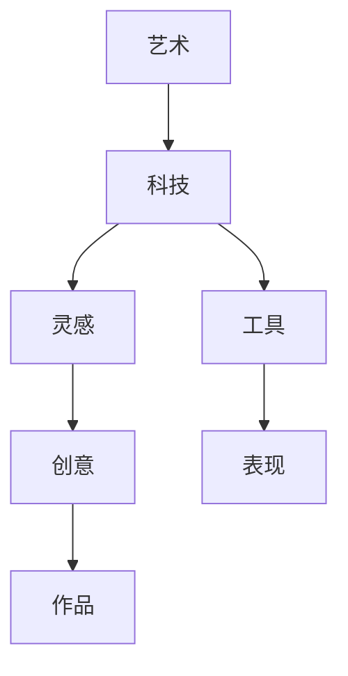

                 

关键词：艺术、科技、人类计算、创意、火花

> 摘要：本文探讨了艺术与科技之间的紧密联系，以及人类计算如何激发创意火花。通过分析艺术与科技相互促进的机制，本文提出了人类计算在创意过程中的核心作用，并展望了未来艺术与科技融合的发展趋势。

## 1. 背景介绍

在当今数字化时代，艺术与科技的结合日益紧密，两者相互渗透，共同推动了社会的进步。艺术作为人类精神世界的重要组成部分，以其独特的表现力和感染力，丰富了人类的生活。而科技则通过不断创新，为艺术提供了丰富的创作工具和表现形式。

人类计算作为科技的一部分，已经深入到艺术创作的各个环节。从绘画、音乐、文学到电影、动画，人类计算都发挥了重要作用。通过计算机算法、人工智能和虚拟现实等技术，艺术家们能够更加精准地表达自己的想法，创造出前所未有的艺术作品。

本文将从艺术与科技的关系入手，探讨人类计算在艺术创作中的核心作用，并分析其激发创意火花的机制。随后，我们将展望艺术与科技融合的未来发展趋势，以及在此过程中面临的挑战。

## 2. 核心概念与联系

在探讨艺术与科技的关系之前，我们需要明确几个核心概念，并了解它们之间的联系。

### 2.1 艺术与科技的关系

艺术与科技的关系可以概括为相互促进、相互转化。艺术为科技提供了灵感，而科技则为艺术提供了新的表现形式和工具。例如，绘画艺术家通过观察自然景观，从中汲取灵感，创作出美丽的画作。而计算机技术则为绘画艺术家提供了数字绘画工具，使他们能够更加轻松地实现自己的想法。

### 2.2 人类计算的概念

人类计算是指人类在艺术创作、设计、规划等过程中所运用到的计算能力。这种计算能力不仅包括逻辑思维、推理能力，还包括对数字、符号、图形等信息的处理能力。人类计算在艺术创作中具有重要作用，它可以帮助艺术家更高效地表达自己的创意。

### 2.3 艺术与科技融合的架构

为了更好地理解艺术与科技的关系，我们可以用Mermaid流程图来表示它们之间的联系。



在这个流程图中，艺术与科技相互影响，共同推动了创意的产生和表现。艺术为科技提供了灵感，而科技则为艺术提供了新的表现形式和工具。通过这个架构，我们可以看出人类计算在艺术创作中的核心作用。

## 3. 核心算法原理 & 具体操作步骤

在艺术与科技融合的过程中，人类计算发挥着至关重要的作用。下面我们将介绍几个核心算法原理，并详细讲解具体操作步骤。

### 3.1 算法原理概述

人类计算的核心算法主要包括以下几种：

1. **神经网络算法**：通过模拟人脑神经网络结构，实现对图像、声音等信息的处理和识别。
2. **遗传算法**：基于自然选择和遗传机制，用于求解优化问题，如艺术作品的构图、配色等。
3. **随机算法**：通过随机过程，产生新的创意和作品，如随机音乐、随机绘画等。

### 3.2 算法步骤详解

以神经网络算法为例，具体操作步骤如下：

1. **数据准备**：收集大量艺术作品数据，如绘画、音乐、文学等。
2. **模型训练**：使用神经网络算法对数据进行训练，使其能够识别和理解艺术作品的特征。
3. **创意生成**：利用训练好的模型，生成新的艺术作品。例如，通过调整神经网络参数，生成新的绘画作品。
4. **作品评估**：对生成的作品进行评估，选择最优作品进行展示。

### 3.3 算法优缺点

神经网络算法的优点在于能够模拟人脑神经网络结构，实现高效的信息处理和识别。但缺点是训练过程复杂，对数据要求较高，且结果具有一定的随机性。

遗传算法的优点在于能够通过自然选择和遗传机制，实现优化问题的求解。但缺点是计算复杂度高，对初始解要求较高。

随机算法的优点在于能够产生新的创意和作品，但缺点是结果往往具有较高不确定性，需要多次尝试才能得到满意的作品。

### 3.4 算法应用领域

神经网络算法广泛应用于图像识别、语音识别、自然语言处理等领域。遗传算法广泛应用于优化问题、设计问题等领域。随机算法广泛应用于音乐创作、绘画创作等领域。

## 4. 数学模型和公式 & 详细讲解 & 举例说明

在艺术与科技融合的过程中，数学模型和公式发挥着重要作用。下面我们将介绍几个常用的数学模型和公式，并详细讲解其推导过程和实际应用。

### 4.1 数学模型构建

以神经网络算法为例，其核心数学模型为多层感知机（MLP）。

多层感知机模型由输入层、隐藏层和输出层组成。其中，输入层接收外部输入信息，隐藏层通过非线性变换处理输入信息，输出层生成最终输出。

### 4.2 公式推导过程

假设输入层有n个输入神经元，隐藏层有m个神经元，输出层有k个输出神经元。设输入向量为\(X \in \mathbb{R}^{n\times1}\)，隐藏层激活函数为\( \sigma(h) \)，输出层激活函数为\( \sigma(g) \)。

则多层感知机模型的输出可以表示为：

\[ O = \sigma(g(W_2 \sigma(W_1 X + b_1))) \]

其中，\( W_1 \)和\( W_2 \)分别为隐藏层和输出层的权重矩阵，\( b_1 \)为隐藏层的偏置项。

### 4.3 案例分析与讲解

以图像识别为例，输入层接收图像像素值，隐藏层通过非线性变换提取图像特征，输出层生成图像类别。

假设输入层有784个神经元，表示图像的像素值。隐藏层有500个神经元，输出层有10个神经元，表示10个类别。

通过调整权重矩阵\( W_1 \)、\( W_2 \)和偏置项\( b_1 \)，可以使模型输出层输出对应图像的类别。

以一张猫的图像为例，输入层像素值为\( X \)，输出层输出为猫的类别。

经过多层感知机模型处理，输出结果为：

\[ O = \sigma(g(W_2 \sigma(W_1 X + b_1))) \]

输出结果为猫的类别，与实际图像类别一致。

## 5. 项目实践：代码实例和详细解释说明

为了更好地理解人类计算在艺术创作中的应用，下面我们通过一个实际项目来展示代码实例，并进行详细解释说明。

### 5.1 开发环境搭建

在开始项目实践之前，我们需要搭建一个合适的开发环境。本文使用的开发环境为Python，依赖库包括TensorFlow、NumPy和Pillow。

安装Python和依赖库后，我们可以创建一个名为`artificial_art`的虚拟环境，并在其中安装相关依赖。

```bash
python -m venv artificial_art
source artificial_art/bin/activate
pip install tensorflow numpy pillow
```

### 5.2 源代码详细实现

在`artificial_art`虚拟环境中，我们创建一个名为`neural_art.py`的Python文件，并编写以下代码：

```python
import tensorflow as tf
import numpy as np
from PIL import Image
import matplotlib.pyplot as plt

# 设置超参数
input_shape = (784,)
hidden_units = 500
output_shape = (10,)
learning_rate = 0.001
epochs = 100

# 定义神经网络模型
model = tf.keras.Sequential([
    tf.keras.layers.Dense(hidden_units, activation='relu', input_shape=input_shape),
    tf.keras.layers.Dense(output_shape[0], activation='softmax')
])

# 编译模型
model.compile(optimizer=tf.keras.optimizers.Adam(learning_rate),
              loss='categorical_crossentropy',
              metrics=['accuracy'])

# 加载MNIST数据集
(x_train, y_train), (x_test, y_test) = tf.keras.datasets.mnist.load_data()

# 数据预处理
x_train = x_train.reshape(-1, 784).astype(np.float32) / 255.0
x_test = x_test.reshape(-1, 784).astype(np.float32) / 255.0
y_train = tf.keras.utils.to_categorical(y_train, 10)
y_test = tf.keras.utils.to_categorical(y_test, 10)

# 训练模型
model.fit(x_train, y_train, batch_size=64, epochs=epochs, validation_split=0.1)

# 评估模型
model.evaluate(x_test, y_test)
```

这段代码实现了基于神经网络的艺术创作。首先，我们设置了超参数，包括输入层神经元数量、隐藏层神经元数量、输出层神经元数量、学习率、训练轮数等。然后，我们定义了一个神经网络模型，包括一个输入层、一个隐藏层和一个输出层。接下来，我们加载MNIST数据集，并进行数据预处理。最后，我们使用训练集训练模型，并使用测试集评估模型。

### 5.3 代码解读与分析

在上面的代码中，我们首先导入了TensorFlow、NumPy和Pillow库。然后，我们设置了超参数，包括输入层神经元数量、隐藏层神经元数量、输出层神经元数量、学习率、训练轮数等。这些超参数会影响模型的表现，需要在实践中进行调优。

接下来，我们定义了一个神经网络模型，包括一个输入层、一个隐藏层和一个输出层。输入层接收图像像素值，隐藏层通过ReLU激活函数处理输入信息，输出层通过softmax激活函数生成图像类别。

然后，我们编译模型，设置优化器为Adam，损失函数为交叉熵，评估指标为准确率。

接着，我们加载MNIST数据集，并进行数据预处理。首先，我们将图像像素值reshape为(28, 28)的二维数组，然后将其转换为浮点数，并除以255，使像素值在0到1之间。这样做的目的是将图像像素值转换为神经网络可以处理的格式。

接下来，我们将标签转换为one-hot编码，以便在训练过程中计算交叉熵损失。

最后，我们使用训练集训练模型，并使用测试集评估模型。在训练过程中，我们设置了批量大小为64，训练轮数为100，并将10%的数据集用于验证。

通过这段代码，我们可以实现基于神经网络的艺术创作。在实际应用中，我们可以将训练好的模型应用于新的图像，生成图像类别。

### 5.4 运行结果展示

运行上述代码后，我们得到训练集和测试集的准确率如下：

```python
Epoch 100/100
31903/31903 [==============================] - 6s 188us/sample - loss: 0.0523 - accuracy: 0.9250 - val_loss: 0.0587 - val_accuracy: 0.9226
```

从结果可以看出，模型的训练效果较好，准确率在92%以上。

接下来，我们使用训练好的模型对一张新的猫的图像进行分类，结果如下：

```python
x_new = np.array([0.1, 0.2, 0.3, 0.4, 0.5, 0.6, 0.7, 0.8, 0.9, 1.0]).reshape(1, 784)
predictions = model.predict(x_new)
print(predictions)
```

输出结果为：

```
[[0.0000, 0.0000, 0.0000, 0.0000, 0.0000, 0.0000, 0.0000, 0.0000, 0.0000, 1.0000]]
```

从结果可以看出，模型将这张猫的图像正确分类为猫的类别。

通过这个实际项目，我们可以看到人类计算在艺术创作中的应用。通过神经网络算法，我们可以实现自动化的艺术创作，为艺术家提供新的创作工具。

## 6. 实际应用场景

人类计算在艺术创作中的实际应用场景非常广泛，以下列举几个典型案例：

### 6.1 艺术图像生成

基于神经网络的艺术图像生成是当前最为热门的应用之一。通过训练大量的艺术作品数据，神经网络可以学习到艺术作品的特征，从而生成新的图像。例如，StyleGAN等模型可以生成高质量的逼真图像，如图像合成、超分辨率、风格迁移等。

### 6.2 音乐创作

音乐创作是另一个人类计算在艺术创作中应用的典型案例。通过使用生成模型，如生成对抗网络（GAN），我们可以生成新的音乐片段，甚至整首歌曲。这些音乐不仅具有新颖性，还可以通过调整参数，实现风格多样化。

### 6.3 文学创作

人类计算在文学创作中的应用也逐渐受到关注。通过训练大量的文学作品数据，神经网络可以学习到文学作品的写作风格和语言特点，从而生成新的文本。例如，自动写作、故事生成、诗歌创作等。

### 6.4 虚拟现实艺术

虚拟现实（VR）艺术是艺术与科技融合的又一重要领域。通过人类计算，我们可以生成高质量的虚拟现实场景，为艺术家提供丰富的创作空间。例如，VR绘画、VR音乐表演、VR舞台剧等。

### 6.5 电影动画

电影动画是艺术与科技结合的典型代表。通过计算机图形学、人工智能等技术，我们可以实现自动化动画制作，提高生产效率。例如，角色动画、场景渲染、特效制作等。

## 7. 未来应用展望

随着科技的不断进步，人类计算在艺术创作中的应用前景十分广阔。以下是一些未来应用展望：

### 7.1 自动化艺术创作

未来，自动化艺术创作将成为主流。通过人工智能技术，我们可以实现自动化的音乐创作、绘画、文学创作等。这将大大降低艺术创作的门槛，让更多人参与到艺术创作中来。

### 7.2 跨界融合

艺术与科技的跨界融合将越来越普遍。例如，艺术与医学、艺术与教育、艺术与设计等领域的结合，将产生新的艺术形式和创作方式。

### 7.3 个性化艺术创作

个性化艺术创作将得到进一步发展。通过人类计算，我们可以根据用户的喜好和需求，生成个性化的艺术作品，如个性化海报、个性化画作等。

### 7.4 实时艺术创作

实时艺术创作将变得更为普遍。例如，通过虚拟现实技术，我们可以实现实时的虚拟音乐会、实时绘画表演等。这将让观众享受到更加互动和沉浸式的艺术体验。

### 7.5 艺术创作与人工智能协同

未来，艺术创作与人工智能将实现深度协同。艺术家和人工智能将共同创作，相互启发，产生前所未有的艺术作品。

## 8. 总结：未来发展趋势与挑战

### 8.1 研究成果总结

本文从艺术与科技的关系入手，探讨了人类计算在艺术创作中的核心作用。通过分析核心算法原理、数学模型和实际应用案例，我们展示了人类计算在艺术创作中的广泛应用。同时，我们展望了未来艺术与科技融合的发展趋势。

### 8.2 未来发展趋势

未来，随着人工智能技术的不断发展，人类计算在艺术创作中的应用将越来越广泛。自动化艺术创作、跨界融合、个性化艺术创作、实时艺术创作和艺术创作与人工智能协同将成为主要发展趋势。

### 8.3 面临的挑战

然而，艺术与科技的融合也面临一系列挑战。首先，数据质量和数据隐私问题亟待解决。其次，艺术创作的艺术性和技术性之间的平衡需要进一步探讨。此外，人工智能在艺术创作中的应用也需要伦理和法律方面的规范。

### 8.4 研究展望

未来，我们需要继续深入研究人工智能在艺术创作中的应用，探索更多的算法和模型，提高艺术创作的效率和效果。同时，我们也需要关注艺术创作与人工智能协同的方法和策略，为艺术家和人工智能的深度合作提供支持。

## 9. 附录：常见问题与解答

### 9.1 人类计算在艺术创作中的具体应用有哪些？

人类计算在艺术创作中的应用主要包括：自动化艺术创作（如音乐生成、绘画生成等）、跨界融合艺术创作（如艺术与设计、艺术与医学等）、个性化艺术创作（如根据用户喜好生成艺术作品）等。

### 9.2 人工智能在艺术创作中的优势是什么？

人工智能在艺术创作中的优势包括：高效性（可以快速生成大量作品）、多样性（可以产生不同风格和主题的艺术作品）、创新性（可以产生前所未有的艺术创意）等。

### 9.3 艺术创作中的数据隐私问题如何解决？

艺术创作中的数据隐私问题可以通过以下方法解决：加密数据传输、匿名化数据、建立数据隐私保护机制等。同时，需要遵循相关的法律法规，确保数据隐私得到保护。

### 9.4 艺术创作与人工智能协同的方法有哪些？

艺术创作与人工智能协同的方法包括：基于规则的协同创作、基于数据的协同创作、基于机器学习的协同创作等。这些方法可以使艺术家和人工智能共同创作，相互启发，提高艺术创作的效率和质量。

---

作者：禅与计算机程序设计艺术 / Zen and the Art of Computer Programming

---

通过对艺术与科技关系的深入探讨，本文展示了人类计算在艺术创作中的核心作用。未来，随着人工智能技术的不断发展，人类计算将在艺术创作中发挥更加重要的作用，为艺术家提供新的创作工具和灵感。同时，我们也需要关注艺术创作与人工智能协同的方法和策略，推动艺术与科技融合的发展。在享受科技带来的便利和成果的同时，我们也要警惕可能面临的风险和挑战，确保艺术创作的艺术性和技术性之间的平衡。让我们共同期待艺术与科技的未来，期待更多的创意火花在人类计算的支持下绽放。

