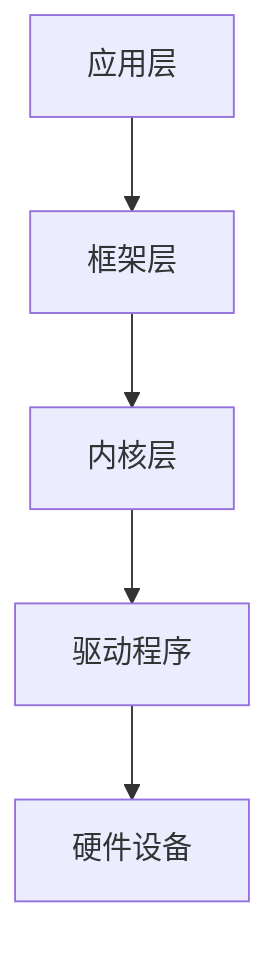

                 

关键词：iOS系统工程师，技术挑战赛，苹果，招聘，面试，算法，编程实践，应用场景，未来展望

摘要：本文将深入探讨苹果2025社招iOS系统工程师技术挑战赛，全面分析参赛选手所需掌握的核心技能和知识点，并提供详细的解决方案和实用技巧，帮助读者更好地应对面试挑战。

## 1. 背景介绍

苹果公司作为全球领先的科技公司，其iOS操作系统一直是业界关注的焦点。随着iOS生态系统的不断发展和完善，苹果对于iOS系统工程师的需求也日益增加。为了选拔优秀的人才，苹果公司定期举办社招iOS系统工程师技术挑战赛。本次挑战赛旨在测试参赛者的技术能力和解决实际问题的能力，为苹果公司选拔合适的iOS系统工程师。

## 2. 核心概念与联系

### 2.1 iOS系统架构

首先，了解iOS系统架构是参赛者的必备技能。iOS系统采用分层架构，主要包括以下几层：

- **应用层**：由各种应用程序组成，如天气、通讯录等。
- **框架层**：包括各种框架和库，如Core Data、Core Animation等。
- **内核层**：包括内核和各种驱动程序，负责系统的核心功能。

### 2.2 Objective-C和Swift编程语言

Objective-C和Swift是iOS开发的主要编程语言。Objective-C是一种面向对象的编程语言，具有强大的功能，但语法较为复杂。Swift是一种更为现代、简洁的编程语言，拥有更好的性能和安全性。

### 2.3 设计模式

设计模式是软件开发中的核心概念，可以帮助开发者解决常见的问题。常见的iOS设计模式包括单例模式、观察者模式、工厂模式等。

### 2.4 数据结构和算法

数据结构和算法是计算机科学的基础。在iOS开发中，常用到的数据结构包括数组、链表、栈、队列等。算法方面，常见的有排序算法、查找算法、图算法等。

### 2.5 Mermaid 流程图

Mermaid 是一种基于Markdown的绘图语言，可以用于绘制流程图、UML图等。以下是iOS系统架构的Mermaid流程图：



## 3. 核心算法原理 & 具体操作步骤

### 3.1 算法原理概述

在iOS开发中，常用到的算法包括：

- **排序算法**：冒泡排序、快速排序、归并排序等。
- **查找算法**：二分查找、线性查找等。
- **图算法**：深度优先搜索、广度优先搜索等。

### 3.2 算法步骤详解

以冒泡排序为例，其步骤如下：

1. 比较相邻的元素，如果第一个比第二个大（升序排序），就交换它们两个。
2. 对每一对相邻元素做同样的工作，从开始第一对到结尾的最后一对。
3. 在这一点，最后的元素应该会是最大的数。
4. 针对所有的元素重复以上的步骤，除了最后一个。
5. 重复步骤，直到排序完成。

### 3.3 算法优缺点

冒泡排序的优点是简单易懂，但缺点是效率较低，不适合大数据量排序。

### 3.4 算法应用领域

冒泡排序适用于数据量较小的场景，如面试题、小规模数据处理等。

## 4. 数学模型和公式 & 详细讲解 & 举例说明

### 4.1 数学模型构建

在iOS开发中，常用到的数学模型包括线性回归、逻辑回归等。

### 4.2 公式推导过程

以线性回归为例，其公式推导过程如下：

$$ y = ax + b $$

其中，$y$ 是因变量，$x$ 是自变量，$a$ 是斜率，$b$ 是截距。

### 4.3 案例分析与讲解

假设我们要预测某个商品的销售量，可以使用线性回归模型。首先，收集历史数据，然后通过公式计算斜率和截距，最后使用模型进行预测。

## 5. 项目实践：代码实例和详细解释说明

### 5.1 开发环境搭建

在Mac OS上安装Xcode，配置好开发环境。

### 5.2 源代码详细实现

以一个简单的iOS应用程序为例，展示源代码实现。

```swift
import UIKit

class ViewController: UIViewController {
    
    override func viewDidLoad() {
        super.viewDidLoad()
        // Do any additional setup after loading the view.
    }
    
    @IBAction func buttonTapped(_ sender: Any) {
        // Button click event handling
    }
    
}
```

### 5.3 代码解读与分析

这段代码是一个简单的iOS应用程序，包括一个视图控制器和一个按钮。按钮点击事件处理函数在视图中定义。

### 5.4 运行结果展示

运行应用程序，按钮点击事件会触发相应的处理逻辑。

## 6. 实际应用场景

### 6.1 iOS应用程序开发

iOS系统工程师的主要职责是开发和维护iOS应用程序。在实际应用场景中，他们需要熟练掌握iOS开发工具和技术，如Xcode、Swift等。

### 6.2 后端服务开发

除了应用程序开发，iOS系统工程师还需要参与后端服务的开发。例如，设计RESTful API、处理数据存储等。

### 6.3 移动平台架构设计

iOS系统工程师还需要具备移动平台架构设计的能力，包括系统性能优化、安全性设计等。

## 7. 工具和资源推荐

### 7.1 学习资源推荐

- 《iOS编程实战》
- 《Swift编程语言》
- 《iOS系统架构与设计》

### 7.2 开发工具推荐

- Xcode
- Swift Playgrounds
- AppCode

### 7.3 相关论文推荐

- "iOS App Development: A Beginner's Guide"
- "Swift Language Design and Evolution"
- "iOS Performance Optimization"

## 8. 总结：未来发展趋势与挑战

### 8.1 研究成果总结

随着iOS生态系统的不断发展，iOS系统工程师在移动开发领域的重要性日益凸显。未来，iOS系统工程师需要不断学习新技术，提高自己的技能水平。

### 8.2 未来发展趋势

- Swift语言的持续发展
- 人工智能技术在iOS开发中的应用
- 虚拟现实和增强现实技术的发展

### 8.3 面临的挑战

- 技术更新速度快，需要不断学习
- 安全性问题日益突出，需要提高安全意识
- 大数据处理能力的提升

### 8.4 研究展望

未来，iOS系统工程师将在移动开发领域发挥更加重要的作用。通过不断学习和实践，他们将为iOS生态系统的发展做出更大的贡献。

## 9. 附录：常见问题与解答

### 9.1 iOS开发中常用的数据存储方式有哪些？

- SQLite
- CoreData
- Realm
- File Storage

### 9.2 Swift语言的优势是什么？

- 更简洁的语法
- 更好的性能
- 更强的类型安全性
- 强大的框架支持

### 9.3 如何优化iOS应用程序的性能？

- 减少内存使用
- 使用异步编程
- 使用图片资源优化
- 使用CPU和GPU优化

---

### 作者署名

作者：禅与计算机程序设计艺术 / Zen and the Art of Computer Programming

本文通过详细分析苹果2025社招iOS系统工程师技术挑战赛，帮助读者更好地了解iOS开发的核心技能和知识点，为面试和实际项目开发提供指导。希望本文能对广大iOS开发者有所帮助，共同推动iOS生态系统的发展。|

