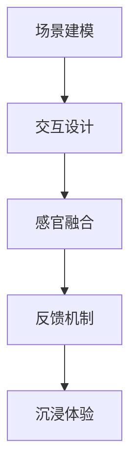

                 

关键词：虚拟现实（VR），沉浸式体验，设计，交互，技术，应用，未来展望

> 摘要：本文旨在深入探讨虚拟现实（VR）技术及其在沉浸式体验设计中的应用。通过对VR技术的背景介绍、核心概念、算法原理、数学模型以及实际应用场景的详细分析，本文旨在为读者提供一个全面而深入的视角，了解VR技术的现状、潜力与挑战。

## 1. 背景介绍

虚拟现实（VR）技术，自上世纪80年代起便逐渐进入人们的视野。VR技术的核心在于通过计算机生成一个模拟的三维环境，使用户能够在这个环境中进行沉浸式的交互。随着时间的推移，VR技术经历了从初期的实验性系统到如今高度发展的技术的演变。

近年来，随着硬件性能的提升、显示技术的进步以及算法的优化，VR技术已经在许多领域得到了应用，包括游戏、医疗、教育、建筑和军事等。尤其是在游戏领域，VR技术为玩家带来了前所未有的沉浸式体验，极大地提升了游戏的趣味性和参与感。

## 2. 核心概念与联系

虚拟现实技术的核心概念包括场景建模、交互设计、感官融合和反馈机制。这些概念相互作用，共同构成了一个完整的沉浸式体验系统。

### 2.1 场景建模

场景建模是VR技术的基石。它包括对现实世界的三维建模，以及将虚拟对象和环境进行动态模拟。场景建模的过程通常涉及以下步骤：

1. **三维建模**：使用三维建模软件（如Blender、Maya）创建虚拟对象和场景。
2. **纹理贴图**：为模型添加纹理，使其看起来更加真实。
3. **光照模拟**：根据场景中的光源位置和强度，模拟光线反射和折射。

### 2.2 交互设计

交互设计是VR技术的另一个关键方面。它决定了用户如何与虚拟环境进行互动。常见的交互方式包括：

1. **手部追踪**：通过手部追踪技术（如Leap Motion），用户可以使用手部动作来操控虚拟对象。
2. **控制器**：使用游戏手柄或其他控制器，用户可以通过按钮和摇杆来控制虚拟环境。
3. **语音识别**：通过语音指令来操控虚拟环境，实现更加自然的交互方式。

### 2.3 感官融合

感官融合是指通过视觉、听觉和触觉等多种感官刺激，增强用户的沉浸感。感官融合的实现通常包括：

1. **立体显示**：通过立体显示技术，如虚拟现实头戴显示器（如Oculus Rift、HTC Vive），用户可以看到三维立体的虚拟环境。
2. **立体声音效**：通过立体声音效，用户可以感受到虚拟环境中的声音位置和距离，增强沉浸感。
3. **触觉反馈**：通过触觉反馈设备（如VR手套），用户可以感受到虚拟对象的不同质地和形状。

### 2.4 反馈机制

反馈机制是确保用户在虚拟环境中的体验真实和流畅的关键。它包括：

1. **运动追踪**：实时追踪用户的头部和身体运动，确保虚拟环境的视觉和听觉反馈与用户的动作保持一致。
2. **延迟控制**：通过优化网络和计算性能，减少延迟，确保用户在虚拟环境中的动作和反应能够即时反馈。
3. **物理模拟**：通过物理引擎模拟虚拟环境中的物理现象，如碰撞、弹跳等，增强用户的沉浸感。


**图 2-1 VR技术架构**

### 2.5 Mermaid流程图



## 3. 核心算法原理 & 具体操作步骤

### 3.1 算法原理概述

VR技术的核心算法主要包括场景渲染算法、交互算法和感官融合算法。这些算法共同作用，实现了虚拟环境的构建和用户的沉浸式体验。

### 3.2 算法步骤详解

#### 3.2.1 场景渲染算法

场景渲染算法是VR技术的核心，它负责生成用户在虚拟环境中看到的图像。场景渲染算法的步骤如下：

1. **三维建模**：使用三维建模软件创建场景中的所有对象。
2. **纹理映射**：为场景中的对象添加纹理，使其看起来更加真实。
3. **光照计算**：根据场景中的光源位置和强度，计算场景中的光照效果。
4. **渲染输出**：将计算得到的图像输出到显示设备。

#### 3.2.2 交互算法

交互算法决定了用户如何与虚拟环境进行互动。交互算法的步骤如下：

1. **手部追踪**：使用手部追踪技术，实时追踪用户的手部动作。
2. **控制器交互**：通过控制器接收用户的输入，并将其转换为虚拟环境中的动作。
3. **语音识别**：通过语音识别技术，将用户的语音指令转换为虚拟环境中的动作。

#### 3.2.3 感官融合算法

感官融合算法通过视觉、听觉和触觉等多种感官刺激，增强用户的沉浸感。感官融合算法的步骤如下：

1. **立体显示**：使用立体显示技术，生成三维立体的图像。
2. **立体声音效**：使用立体声音效，生成空间位置和距离感。
3. **触觉反馈**：使用触觉反馈设备，模拟虚拟对象的不同质地和形状。

### 3.3 算法优缺点

#### 3.3.1 场景渲染算法

**优点**：能够生成高度真实的虚拟环境，提升用户体验。

**缺点**：计算资源需求高，渲染速度慢，可能造成用户体验的不流畅。

#### 3.3.2 交互算法

**优点**：提供了多种交互方式，增强用户的沉浸感。

**缺点**：需要准确的手部追踪和控制器交互，对硬件设备要求较高。

#### 3.3.3 感官融合算法

**优点**：通过多种感官刺激，增强用户的沉浸感。

**缺点**：感官融合效果受硬件设备和算法优化程度的影响较大。

### 3.4 算法应用领域

VR技术的核心算法在多个领域得到了广泛应用，包括：

1. **游戏**：通过高度真实的场景渲染和交互算法，提供沉浸式的游戏体验。
2. **医疗**：用于模拟手术过程、心理治疗等，提供沉浸式的学习和治疗环境。
3. **教育**：通过虚拟实验室和虚拟课堂，提供沉浸式的学习体验。
4. **建筑**：用于建筑可视化、设计评审等，提供沉浸式的项目演示环境。
5. **军事**：用于模拟战斗场景、训练士兵等，提供沉浸式的训练环境。

## 4. 数学模型和公式 & 详细讲解 & 举例说明

### 4.1 数学模型构建

VR技术的数学模型主要包括场景建模、交互算法和感官融合算法。以下是一个简化的场景建模的数学模型：

```latex
\text{场景建模} = f(\text{三维建模}, \text{纹理映射}, \text{光照计算})
```

### 4.2 公式推导过程

#### 4.2.1 三维建模

三维建模的公式通常涉及向量运算和几何计算。以下是一个简化的三维建模公式：

```latex
P = f(\text{顶点集合}, \text{边集合}, \text{面集合})
```

其中，P 表示三维模型，由顶点集合、边集合和面集合构成。

#### 4.2.2 纹理映射

纹理映射的公式涉及图像处理和几何变换。以下是一个简化的纹理映射公式：

```latex
I' = f(I, P, T)
```

其中，I' 表示纹理映射后的图像，I 表示原始图像，P 表示三维模型，T 表示纹理坐标。

#### 4.2.3 光照计算

光照计算的公式涉及向量运算和几何计算。以下是一个简化的光照计算公式：

```latex
L = f(\text{光源位置}, \text{光源强度}, \text{物体表面法向量})
```

其中，L 表示光照强度，由光源位置、光源强度和物体表面法向量决定。

### 4.3 案例分析与讲解

#### 4.3.1 场景建模

假设我们需要创建一个简单的三维立方体。我们可以使用以下公式：

```latex
P = f(\{V_1, V_2, V_3, V_4\}, \{\{V_1, V_2\}, \{V_2, V_3\}, \{V_3, V_4\}, \{V_4, V_1\}\}, \{\{V_1, V_2, V_3\}, \{V_2, V_3, V_4\}\})
```

其中，V1、V2、V3、V4 分别代表立方体的四个顶点，\{\} 表示边集合，\{\} 表示面集合。

#### 4.3.2 纹理映射

假设我们需要将一张图像映射到立方体的表面。我们可以使用以下公式：

```latex
I' = f(I, P, T)
```

其中，I 表示原始图像，P 表示立方体的顶点集合，T 表示纹理坐标。纹理坐标可以通过顶点的坐标计算得到。

#### 4.3.3 光照计算

假设我们需要计算立方体的光照强度。我们可以使用以下公式：

```latex
L = f(\text{光源位置}, \text{光源强度}, \text{物体表面法向量})
```

其中，光源位置、光源强度和物体表面法向量可以通过场景中的光源设置和物体表面的几何信息计算得到。

## 5. 项目实践：代码实例和详细解释说明

### 5.1 开发环境搭建

为了实现一个简单的VR应用，我们需要搭建一个开发环境。以下是搭建过程：

1. **安装Unity引擎**：Unity是一个强大的游戏开发平台，支持VR应用的开发。下载并安装Unity引擎。
2. **安装VR插件**：在Unity的Asset Store中，安装适合VR开发的插件，如Oculus Integration、HTC Vive Integration等。
3. **创建项目**：在Unity中创建一个新的项目，选择VR应用模板。
4. **设置虚拟现实设备**：在Unity的Project窗口中，添加虚拟现实设备插件，如Oculus Rift或HTC Vive。

### 5.2 源代码详细实现

以下是实现一个简单的VR应用的基本源代码：

```csharp
using UnityEngine;

public class VRApp : MonoBehaviour
{
    public GameObject VRObject; // 虚拟对象

    // Start is called before the first frame update
    void Start()
    {
        // 初始化虚拟对象
        VRObject.transform.position = new Vector3(0, 1, 0); // 设置虚拟对象的位置
    }

    // Update is called once per frame
    void Update()
    {
        // 根据用户输入更新虚拟对象的位置
        float moveSpeed = 0.1f; // 移动速度
        if (Input.GetKey(KeyCode.W))
        {
            VRObject.transform.position += Vector3.forward * moveSpeed;
        }
        if (Input.GetKey(KeyCode.S))
        {
            VRObject.transform.position -= Vector3.forward * moveSpeed;
        }
        if (Input.GetKey(KeyCode.A))
        {
            VRObject.transform.position -= Vector3.right * moveSpeed;
        }
        if (Input.GetKey(KeyCode.D))
        {
            VRObject.transform.position += Vector3.right * moveSpeed;
        }
    }
}
```

### 5.3 代码解读与分析

以上代码实现了一个简单的VR应用，用户可以通过键盘上的W、S、A、D键来控制虚拟对象的前进、后退、左移和右移。以下是代码的详细解读：

1. **初始化虚拟对象**：在Start()方法中，设置虚拟对象的位置。
2. **更新虚拟对象位置**：在Update()方法中，根据用户输入更新虚拟对象的位置。这里使用了Vector3类型的变量来表示位置和移动方向。

### 5.4 运行结果展示

运行以上代码，在VR设备上可以看到一个简单的虚拟对象，用户可以通过键盘上的W、S、A、D键来控制虚拟对象的前进、后退、左移和右移。这只是一个简单的示例，实际应用中，VR应用的复杂度和功能会更加丰富。

## 6. 实际应用场景

虚拟现实技术在实际应用中展现出了巨大的潜力，以下是一些常见的应用场景：

1. **游戏**：VR游戏通过高度真实的场景渲染和交互算法，为玩家提供了前所未有的沉浸式体验。例如，《半衰期：爱莉克斯》（Half-Life: Alyx）是一款备受好评的VR游戏，其沉浸式的剧情和交互设计深受玩家喜爱。

2. **医疗**：VR技术在医疗领域有着广泛的应用，包括手术模拟、心理治疗和康复训练等。例如， surgeons可以使用VR技术进行手术前的模拟练习，从而提高手术的成功率和安全性。

3. **教育**：VR技术可以创建虚拟实验室和虚拟课堂，为学生提供沉浸式的学习体验。例如，学生可以在虚拟实验室中进行化学实验，而不必担心实验安全问题和资源限制。

4. **建筑**：VR技术可以用于建筑可视化、设计评审和客户演示。建筑师和客户可以在虚拟环境中体验建筑的设计和布局，从而更好地进行沟通和决策。

5. **军事**：VR技术可以用于模拟战斗场景、训练士兵和战术规划。例如，士兵可以通过VR设备进行模拟战斗训练，从而提高实战能力。

## 7. 工具和资源推荐

为了更好地了解和开发虚拟现实技术，以下是一些推荐的工具和资源：

1. **Unity**：Unity是一个功能强大的游戏开发平台，支持VR应用的开发。其丰富的插件和资源库，使得开发者可以轻松地创建高质量的VR应用。
2. **Unreal Engine**：Unreal Engine是另一个流行的游戏开发引擎，支持VR应用的开发。其高度优化的渲染引擎和强大的物理引擎，为开发者提供了强大的开发工具。
3. **Oculus Integration**：Oculus Integration是Unity的一个VR插件，支持Oculus Rift和Oculus Quest等VR设备的开发。它提供了丰富的VR功能，如手部追踪、控制器交互等。
4. **HTC Vive Integration**：HTC Vive Integration是Unity的一个VR插件，支持HTC Vive和HTC Vive Pro等VR设备的开发。它提供了类似Oculus Integration的功能，同时支持更高级的物理模拟和触觉反馈。
5. **学习资源**：在线课程、教程和文档是学习VR技术的重要资源。例如，Udemy、Coursera和edX等平台提供了丰富的VR相关课程，从基础概念到高级应用都有涉及。

## 8. 总结：未来发展趋势与挑战

虚拟现实技术正在迅速发展，未来几年，我们可以预见以下发展趋势：

1. **硬件性能提升**：随着硬件技术的进步，VR设备的性能将得到显著提升，包括更高的分辨率、更低的延迟和更自然的交互。
2. **内容丰富多样**：随着技术的成熟，VR内容将变得更加丰富多样，涵盖游戏、教育、医疗、建筑等各个领域。
3. **应用场景拓展**：VR技术的应用场景将进一步拓展，除了传统的游戏、教育、医疗等领域，还将涉及娱乐、艺术、设计等新兴领域。
4. **商业模式创新**：随着VR技术的普及，新的商业模式将不断涌现，包括VR体验店、VR社交平台等。

然而，VR技术也面临着一些挑战：

1. **成本问题**：高端VR设备的成本仍然较高，限制了其普及率。如何降低成本，使得更多用户能够负担得起VR设备，是VR技术发展的重要挑战。
2. **用户体验优化**：尽管VR技术已经取得了一定的进展，但用户体验仍有待优化。如何提高沉浸感、降低延迟、增强交互性，是VR技术发展的重要课题。
3. **隐私和安全**：VR技术的普及也带来了一些隐私和安全问题。如何保护用户的隐私，确保用户在VR环境中的安全，是VR技术发展的重要挑战。

## 9. 附录：常见问题与解答

### Q1：什么是虚拟现实（VR）技术？
A1：虚拟现实（VR）技术是一种通过计算机生成一个模拟的三维环境，使用户能够在这个环境中进行沉浸式交互的技术。

### Q2：VR技术的核心概念是什么？
A2：VR技术的核心概念包括场景建模、交互设计、感官融合和反馈机制。

### Q3：VR技术有哪些应用场景？
A3：VR技术的应用场景包括游戏、医疗、教育、建筑、军事等领域。

### Q4：如何搭建VR开发环境？
A4：搭建VR开发环境通常需要以下步骤：安装Unity引擎、安装VR插件、创建项目、设置虚拟现实设备。

### Q5：VR技术未来发展趋势是什么？
A5：VR技术未来的发展趋势包括硬件性能提升、内容丰富多样、应用场景拓展和商业模式创新。

### Q6：VR技术面临哪些挑战？
A6：VR技术面临的挑战包括成本问题、用户体验优化和隐私和安全问题。

### Q7：有哪些推荐的VR开发工具和资源？
A7：推荐的VR开发工具和资源包括Unity、Unreal Engine、Oculus Integration、HTC Vive Integration等。
----------------------------------------------------------------

**作者：禅与计算机程序设计艺术 / Zen and the Art of Computer Programming**

