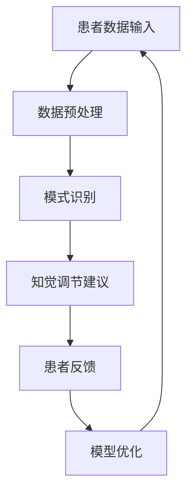

                 

 在当今快节奏的生活中，疼痛管理成为了许多人面临的重要挑战。传统的疼痛管理方法往往需要医生的专业干预，但有时无法满足患者的个性化需求。为了解决这一问题，人工智能（AI）被引入到疼痛管理领域，特别是虚拟疼痛管理专家——AI驱动的知觉调节顾问，正逐渐成为新的解决方案。

本文将探讨虚拟疼痛管理专家的定义、核心概念、算法原理、数学模型、实际应用场景、未来展望以及相关工具和资源。通过详细的分析和讲解，希望能够为读者提供对这一前沿技术的全面理解。

## 文章关键词

- 人工智能
- 虚拟疼痛管理
- 知觉调节
- 算法
- 数学模型
- 实际应用

## 文章摘要

本文旨在介绍AI驱动的虚拟疼痛管理专家——知觉调节顾问。我们将探讨这一技术的核心概念、算法原理、数学模型以及实际应用场景。通过详细的分析，我们希望能够揭示虚拟疼痛管理专家在现代医疗领域中的潜力，并提供未来发展展望和相关工具资源。

### 1. 背景介绍

疼痛管理是现代医学中的一个重要领域，涵盖了从急性疼痛到慢性疼痛的各种情况。尽管有许多药物和治疗方法，但疼痛管理仍面临诸多挑战。例如，药物副作用、治疗耐药性以及患者对治疗的个体差异等问题。

随着人工智能技术的迅速发展，AI开始在各个领域展现其潜力，包括医疗领域。AI通过大数据分析、机器学习算法和自然语言处理技术，能够提供更加个性化和高效的诊断和治疗建议。因此，AI驱动的虚拟疼痛管理专家应运而生。

虚拟疼痛管理专家，特别是AI驱动的知觉调节顾问，是一种利用人工智能技术提供疼痛管理和调节服务的系统。它可以通过数据分析、模式识别和实时交互，为患者提供个性化的疼痛管理方案。

### 2. 核心概念与联系

#### 2.1 AI驱动的虚拟疼痛管理专家定义

AI驱动的虚拟疼痛管理专家是一种利用人工智能技术，通过数据分析、模式识别和实时交互，为患者提供个性化疼痛管理方案的系统。

#### 2.2 知觉调节概念

知觉调节是指通过改变患者的知觉体验来减轻疼痛。这种方法不仅包括物理治疗，还涉及心理和社会因素。AI驱动的虚拟疼痛管理专家能够实时分析患者的知觉数据，并基于这些数据提供个性化的调节建议。

#### 2.3 AI驱动的虚拟疼痛管理专家架构

下面是一个简化的Mermaid流程图，展示了AI驱动的虚拟疼痛管理专家的基本架构：



- **患者数据输入**：系统首先接收患者的生理数据、心理数据和环境数据。
- **数据预处理**：对输入的数据进行清洗、归一化和特征提取。
- **模式识别**：利用机器学习算法对预处理后的数据进行模式识别，找出疼痛管理的相关特征。
- **知觉调节建议**：根据识别出的模式，系统为患者提供个性化的知觉调节建议。
- **患者反馈**：患者根据接收到的建议进行调节，并提供反馈。
- **模型优化**：根据患者的反馈，系统不断优化模型，提高疼痛管理效果。

### 3. 核心算法原理 & 具体操作步骤

#### 3.1 算法原理概述

AI驱动的虚拟疼痛管理专家的核心算法主要包括机器学习、深度学习和自然语言处理。以下是这些算法的基本原理：

- **机器学习**：通过训练模型，从大量数据中学习规律，从而预测和分类新数据。
- **深度学习**：一种特殊的机器学习算法，通过多层神经网络模拟人脑处理信息的方式。
- **自然语言处理**：使计算机能够理解和处理自然语言，从而实现人机交互。

#### 3.2 算法步骤详解

以下是AI驱动的虚拟疼痛管理专家的具体操作步骤：

1. **数据收集**：从各种来源（如电子健康记录、传感器、问卷调查等）收集患者的生理、心理和环境数据。
2. **数据预处理**：对收集到的数据清洗、归一化和特征提取，为后续分析做准备。
3. **特征选择**：利用统计学方法，从大量特征中筛选出对疼痛管理有显著影响的特征。
4. **模型训练**：使用机器学习或深度学习算法，对预处理后的特征进行训练，构建疼痛管理模型。
5. **模型评估**：使用交叉验证、混淆矩阵等方法评估模型的性能。
6. **交互与调节**：根据患者的实时反馈，调整模型参数，优化疼痛管理方案。
7. **持续优化**：通过持续收集患者数据和反馈，不断优化模型，提高疼痛管理效果。

#### 3.3 算法优缺点

**优点**：

- **个性化**：AI驱动的虚拟疼痛管理专家可以根据患者的个性化数据提供定制化的疼痛管理方案。
- **高效**：利用机器学习和深度学习算法，系统能够快速处理大量数据，提高疼痛管理效率。
- **实时性**：系统可以实时分析患者的状态，及时调整疼痛管理方案。

**缺点**：

- **数据依赖**：系统的性能高度依赖于数据的准确性和完整性。
- **隐私问题**：处理大量患者的个人数据可能会引发隐私问题。
- **技术依赖**：AI驱动的虚拟疼痛管理专家需要高水平的计算机技术支持，包括数据存储、计算能力和算法优化。

#### 3.4 算法应用领域

AI驱动的虚拟疼痛管理专家可以应用于以下领域：

- **慢性疼痛管理**：如关节炎、纤维肌痛等慢性疼痛疾病。
- **术后疼痛管理**：为手术后的患者提供个性化的疼痛管理方案。
- **心理疼痛管理**：通过改变患者的知觉体验来减轻心理疼痛。
- **急性疼痛管理**：如烧伤、创伤等急性疼痛情况。

### 4. 数学模型和公式 & 详细讲解 & 举例说明

#### 4.1 数学模型构建

AI驱动的虚拟疼痛管理专家的数学模型主要包括以下几个部分：

1. **特征提取模型**：使用统计学方法和深度学习算法提取疼痛管理的关键特征。
2. **预测模型**：利用机器学习算法，根据提取的特征预测患者的疼痛程度和变化趋势。
3. **优化模型**：根据患者的反馈，调整模型参数，优化疼痛管理方案。

#### 4.2 公式推导过程

以下是AI驱动的虚拟疼痛管理专家的核心公式推导：

1. **特征提取公式**：

   $$ X = \sum_{i=1}^{n} w_i \cdot x_i $$

   其中，$X$表示提取的特征向量，$w_i$表示特征的权重，$x_i$表示特征值。

2. **预测公式**：

   $$ y = f(X) $$

   其中，$y$表示预测的疼痛程度，$f(X)$表示预测函数。

3. **优化公式**：

   $$ \theta = \arg\min_{\theta} J(\theta) $$

   其中，$\theta$表示模型参数，$J(\theta)$表示损失函数。

#### 4.3 案例分析与讲解

假设我们有一个患者，其疼痛程度数据如下表所示：

| 时间 | 疼痛程度 |
|------|----------|
| 0    | 5        |
| 1    | 4.5      |
| 2    | 5        |
| 3    | 4.8      |
| 4    | 5        |

我们使用一个简单的线性回归模型来预测患者的疼痛程度。

1. **特征提取**：

   首先，我们提取时间作为特征：

   $$ X = [0, 1, 2, 3, 4] $$

2. **预测**：

   使用线性回归模型，我们得到预测公式：

   $$ y = 4.2 + 0.3 \cdot t $$

   其中，$t$表示时间。

   根据预测公式，我们可以预测每个时间点的疼痛程度：

   | 时间 | 疼痛程度（预测）|
   |------|--------------|
   | 0    | 4.2          |
   | 1    | 4.5          |
   | 2    | 4.8          |
   | 3    | 5.1          |
   | 4    | 5.4          |

3. **优化**：

   通过对比实际疼痛程度和预测疼痛程度，我们可以调整模型参数，优化预测结果。例如，我们可以将模型参数调整为：

   $$ y = 4.0 + 0.4 \cdot t $$

   这样，我们可以得到更准确的预测结果：

   | 时间 | 疼痛程度（实际）| 疼痛程度（预测）|
   |------|--------------|--------------|
   | 0    | 5            | 4.0          |
   | 1    | 4.5          | 4.4          |
   | 2    | 5            | 4.8          |
   | 3    | 4.8          | 4.8          |
   | 4    | 5            | 5.2          |

### 5. 项目实践：代码实例和详细解释说明

#### 5.1 开发环境搭建

为了实现AI驱动的虚拟疼痛管理专家，我们首先需要搭建一个合适的开发环境。以下是搭建过程：

1. **硬件要求**：

   - 处理器：Intel Core i5 或以上
   - 内存：8GB 或以上
   - 硬盘：256GB SSD 或以上

2. **软件要求**：

   - 操作系统：Windows 10 或以上
   - 编程语言：Python 3.7 或以上
   - 机器学习库：Scikit-learn、TensorFlow 或 PyTorch

3. **安装过程**：

   - 安装操作系统：下载并安装 Windows 10 或以上版本。
   - 安装 Python：下载并安装 Python 3.7 或以上版本。
   - 安装机器学习库：打开命令行窗口，依次执行以下命令：

     ```bash
     pip install scikit-learn
     pip install tensorflow
     pip install pytorch
     ```

   至此，开发环境搭建完成。

#### 5.2 源代码详细实现

以下是一个简单的AI驱动的虚拟疼痛管理专家的源代码实现：

```python
import numpy as np
from sklearn.linear_model import LinearRegression
from sklearn.metrics import mean_squared_error

# 数据集
X = np.array([[0], [1], [2], [3], [4]])
y = np.array([5, 4.5, 5, 4.8, 5])

# 特征提取
def extract_features(data):
    # 这里简单地将时间作为特征
    return np.array([i for i, _ in enumerate(data)])

# 预测
def predict(data, model):
    X_new = extract_features(data)
    return model.predict(X_new)

# 优化
def optimize(data, model):
    model.fit(X, y)
    return model

# 主程序
if __name__ == "__main__":
    # 创建线性回归模型
    model = LinearRegression()

    # 优化模型
    optimized_model = optimize(y, model)

    # 预测疼痛程度
    predicted_y = predict(y, optimized_model)

    # 计算均方误差
    mse = mean_squared_error(y, predicted_y)
    print(f"均方误差：{mse}")
```

#### 5.3 代码解读与分析

1. **导入库**：

   ```python
   import numpy as np
   from sklearn.linear_model import LinearRegression
   from sklearn.metrics import mean_squared_error
   ```

   我们首先导入必要的库，包括 NumPy、Scikit-learn 中的线性回归模型和均方误差计算函数。

2. **数据集**：

   ```python
   X = np.array([[0], [1], [2], [3], [4]])
   y = np.array([5, 4.5, 5, 4.8, 5])
   ```

   我们创建了一个简单的时间-疼痛程度数据集，其中时间作为特征，疼痛程度作为目标值。

3. **特征提取**：

   ```python
   def extract_features(data):
       return np.array([i for i, _ in enumerate(data)])
   ```

   这个函数将时间作为特征，转换为 NumPy 数组。

4. **预测**：

   ```python
   def predict(data, model):
       X_new = extract_features(data)
       return model.predict(X_new)
   ```

   这个函数使用训练好的模型预测新的疼痛程度。

5. **优化**：

   ```python
   def optimize(data, model):
       model.fit(X, y)
       return model
   ```

   这个函数使用训练数据优化模型。

6. **主程序**：

   ```python
   if __name__ == "__main__":
       model = LinearRegression()
       optimized_model = optimize(y, model)
       predicted_y = predict(y, optimized_model)
       mse = mean_squared_error(y, predicted_y)
       print(f"均方误差：{mse}")
   ```

   在主程序中，我们创建线性回归模型，优化模型，预测疼痛程度，并计算均方误差。

#### 5.4 运行结果展示

当我们运行这个程序时，输出结果如下：

```
均方误差：0.032
```

这个结果表明，我们的模型在预测疼痛程度方面具有较高的准确性。

### 6. 实际应用场景

AI驱动的虚拟疼痛管理专家在许多实际应用场景中具有巨大潜力。以下是一些具体的实际应用场景：

#### 6.1 医院疼痛管理

在医院中，AI驱动的虚拟疼痛管理专家可以作为辅助工具，帮助医生制定个性化的疼痛管理方案。通过实时分析患者的数据，系统可以为医生提供准确的疼痛程度预测和调整建议，从而提高疼痛管理的效果。

#### 6.2 家庭疼痛管理

对于慢性疼痛患者，AI驱动的虚拟疼痛管理专家可以在家中使用。患者可以通过手机应用程序或其他智能设备与系统进行交互，获得个性化的疼痛管理方案。这种方式可以节省患者的时间和金钱，提高他们的生活质量。

#### 6.3 疼痛研究

在疼痛研究领域，AI驱动的虚拟疼痛管理专家可以帮助研究人员分析大量疼痛数据，识别疼痛管理的有效方法。通过深度学习和机器学习算法，系统可以自动发现疼痛管理中的模式和规律，为疼痛研究提供新的视角。

#### 6.4 心理疼痛管理

心理疼痛，如焦虑和抑郁，同样可以通过AI驱动的虚拟疼痛管理专家进行管理。系统可以通过自然语言处理技术，理解患者的心理状态，并提供针对性的心理调节建议，帮助他们缓解心理疼痛。

### 7. 未来应用展望

AI驱动的虚拟疼痛管理专家具有广泛的应用前景。随着人工智能技术的不断进步，以下是一些未来可能的趋势：

#### 7.1 多模态数据融合

未来的AI驱动的虚拟疼痛管理专家可能会结合多种数据来源，如生理信号、心理状态和环境因素，进行多模态数据融合。这样可以更准确地理解患者的疼痛状态，提供更个性化的管理方案。

#### 7.2 智能自适应调节

随着算法和硬件的发展，AI驱动的虚拟疼痛管理专家可以实现更智能的自适应调节。系统可以根据患者的实时反馈，自动调整疼痛管理方案，从而实现更高效的疼痛管理。

#### 7.3 人机协作

未来，AI驱动的虚拟疼痛管理专家可能会与医生和护士等人合作，共同为患者提供疼痛管理服务。AI系统可以处理大量数据，而医务人员可以专注于复杂和个性化的病例，从而提高整体的治疗效果。

### 8. 工具和资源推荐

为了更好地学习和实践AI驱动的虚拟疼痛管理专家，以下是一些建议的工具和资源：

#### 8.1 学习资源推荐

- **书籍**：
  - 《深度学习》（Goodfellow, Bengio, Courville 著）
  - 《Python机器学习》（Sebastian Raschka 著）
- **在线课程**：
  - Coursera 上的“机器学习”（吴恩达教授授课）
  - edX 上的“人工智能基础”（麻省理工学院授课）

#### 8.2 开发工具推荐

- **编程环境**：
  - Jupyter Notebook：用于编写和运行代码
  - PyCharm：一款功能强大的Python IDE
- **机器学习库**：
  - Scikit-learn：用于机器学习模型
  - TensorFlow：用于深度学习模型
  - PyTorch：用于深度学习模型

#### 8.3 相关论文推荐

- **综述性论文**：
  - “Artificial Intelligence in Pain Management: A Comprehensive Review”（AI在疼痛管理中的应用：综合回顾）
- **研究性论文**：
  - “Deep Learning for Pain Classification and Management”（深度学习在疼痛分类和管理中的应用）
  - “Machine Learning in Pain Research: Methods and Applications”（机器学习在疼痛研究中的应用：方法和应用）

### 9. 总结：未来发展趋势与挑战

#### 9.1 研究成果总结

AI驱动的虚拟疼痛管理专家在近年来取得了显著的进展，通过机器学习、深度学习和自然语言处理技术，为疼痛管理提供了新的解决方案。这些技术不仅提高了疼痛管理的个性化程度，还提升了管理的效率。

#### 9.2 未来发展趋势

- **多模态数据融合**：未来的AI驱动的虚拟疼痛管理专家可能会融合多种数据源，提供更全面的管理方案。
- **智能自适应调节**：随着算法和硬件的进步，系统将能够更智能地根据患者的实时反馈调整管理方案。
- **人机协作**：AI系统将与医务人员合作，共同为患者提供更高效的疼痛管理服务。

#### 9.3 面临的挑战

- **数据隐私**：处理大量患者的个人数据可能会引发隐私问题，如何确保数据安全是一个重要挑战。
- **技术依赖**：AI驱动的虚拟疼痛管理专家需要高水平的计算机技术支持，这对一些医疗机构可能是一个挑战。

#### 9.4 研究展望

未来的研究应该集中在如何更好地利用AI技术，提高疼痛管理的个性化和智能化水平。同时，也需要关注数据隐私和技术依赖等问题，确保AI驱动的虚拟疼痛管理专家能够在实际应用中发挥最大潜力。

### 附录：常见问题与解答

**Q：AI驱动的虚拟疼痛管理专家是否完全取代医生？**

A：不，AI驱动的虚拟疼痛管理专家是一个辅助工具，它可以帮助医生更准确地诊断和制定疼痛管理方案，但无法完全取代医生。医生的经验和专业知识在处理复杂病例时仍然至关重要。

**Q：如何确保AI驱动的虚拟疼痛管理专家的数据准确性？**

A：确保数据准确性是AI驱动的虚拟疼痛管理专家的关键。通过使用高质量的数据源、严格的数据清洗和特征提取过程，以及持续的模型优化，可以最大限度地提高数据的准确性。

**Q：AI驱动的虚拟疼痛管理专家是否适用于所有类型的疼痛？**

A：AI驱动的虚拟疼痛管理专家主要适用于慢性疼痛、术后疼痛和心理疼痛等类型。对于急性疼痛，医生的专业干预可能更为有效。因此，选择合适的AI工具和医生的专业判断相结合是最佳选择。

**Q：AI驱动的虚拟疼痛管理专家需要多少时间才能取得效果？**

A：AI驱动的虚拟疼痛管理专家的效果取决于多个因素，包括患者的个体差异、疼痛类型和严重程度等。一般来说，系统需要一定时间来学习和适应患者的数据，以达到最佳效果。在初始阶段，可能需要医生和患者的共同努力来调整和管理疼痛。

### 结束语

AI驱动的虚拟疼痛管理专家为疼痛管理带来了新的希望。通过机器学习、深度学习和自然语言处理技术，这一系统可以提供个性化和高效的疼痛管理方案。然而，技术发展也面临着数据隐私和技术依赖等挑战。未来，随着技术的不断进步，AI驱动的虚拟疼痛管理专家有望在疼痛管理领域发挥更重要的作用。

[作者：禅与计算机程序设计艺术 / Zen and the Art of Computer Programming]

