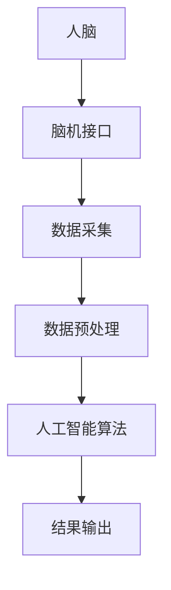

                 

### 背景介绍

虚拟考古是一种新兴的考古学方法，它利用计算机技术和人工智能来分析和解读考古数据。近年来，随着计算机技术和人工智能技术的快速发展，虚拟考古已经成为了考古学领域的重要工具。然而，虚拟考古技术的应用也引发了一系列伦理问题，特别是涉及脑辅助技术时。脑辅助历史研究是一种利用脑机接口和人工智能技术来增强人类认知能力的研究方法，它在考古学中的应用主要体现在对考古数据的深度分析和理解上。

全球脑辅助历史研究的道德规范是一个复杂且紧迫的议题。随着脑机接口和人工智能技术的不断进步，人类对于大脑和意识的认知边界正在不断拓展。然而，这些技术的快速发展也带来了诸多道德挑战，包括隐私权、知情同意、数据安全和人工智能的伦理应用等方面。在这个背景下，建立一套全球性的脑辅助历史研究的道德规范显得尤为重要。

### 核心概念与联系

#### 脑机接口技术

脑机接口（Brain-Computer Interface, BCI）是一种直接连接人脑和外部设备的接口技术。它通过测量大脑的电信号，将用户的思维转化为可操作的数据。在考古学中，脑机接口技术可以用于分析考古数据的复杂模式，提高数据解读的准确性和效率。

#### 人工智能在考古中的应用

人工智能（Artificial Intelligence, AI）在考古学中的应用主要体现在数据分析和模式识别上。通过机器学习算法，AI可以自动识别考古数据中的潜在模式和趋势，从而辅助考古学家进行更深入的研究。

#### 脑辅助历史研究的基本原理

脑辅助历史研究的基本原理是利用脑机接口和人工智能技术，增强人类在考古学研究和数据分析方面的能力。具体来说，通过脑机接口获取大脑的实时电信号，然后利用人工智能算法对这些信号进行处理和分析，从而实现更高效的数据解读。

#### Mermaid 流程图



在这个流程图中，人脑通过脑机接口采集数据，经过数据预处理后，由人工智能算法进行分析，最终得到研究结果。

### 核心算法原理 & 具体操作步骤

#### 算法原理概述

脑辅助历史研究中的核心算法主要包括脑信号采集算法、数据预处理算法和人工智能算法。脑信号采集算法负责从人脑中获取电信号，数据预处理算法负责对采集到的信号进行滤波、去噪等处理，人工智能算法则负责对预处理后的数据进行模式识别和分析。

#### 算法步骤详解

1. **脑信号采集**：使用脑电图（EEG）或功能性磁共振成像（fMRI）等技术，从人脑中获取电信号。
2. **数据预处理**：对采集到的信号进行滤波、去噪等处理，以消除噪声和提高信号质量。
3. **特征提取**：从预处理后的信号中提取有用的特征，如时间序列特征、频域特征等。
4. **模式识别**：利用机器学习算法，对提取的特征进行模式识别，以实现考古数据的自动分类和解读。
5. **结果输出**：将识别出的模式和分析结果输出，供考古学家进一步分析和研究。

#### 算法优缺点

1. **优点**：脑辅助历史研究算法可以大大提高考古数据分析和解读的效率，减少人工误差，有助于发现考古数据中的潜在模式。
2. **缺点**：算法的准确性和稳定性受限于脑信号的质量和处理技术，同时，算法的应用需要大量的计算资源和数据支持。

#### 算法应用领域

脑辅助历史研究算法在考古学、人类学、心理学等领域有着广泛的应用。例如，在考古学中，它可以用于分析考古遗址中的壁画、陶器、文物等，揭示古代人类的生活方式和社会结构；在人类学中，它可以用于研究人类行为和认知的发展过程；在心理学中，它可以用于研究大脑与行为之间的关系。

### 数学模型和公式 & 详细讲解 & 举例说明

#### 数学模型构建

脑辅助历史研究的数学模型主要包括信号处理模型和机器学习模型。信号处理模型用于对脑信号进行预处理和特征提取，而机器学习模型则用于模式识别和分析。

1. **信号处理模型**：

   设采集到的脑信号为 $X(t)$，则预处理后的信号 $Y(t)$ 可表示为：

   $$Y(t) = \sum_{i=1}^{n} W_i * H_i(X(t))$$

   其中，$W_i$ 和 $H_i(X(t))$ 分别为滤波器和卷积核。

2. **机器学习模型**：

   设特征向量为 $V$，标签向量为 $T$，则机器学习模型的输出为：

   $$O = \sum_{i=1}^{m} W_i * \sigma(V_i^T * X)$$

   其中，$W_i$ 为权重，$\sigma$ 为激活函数。

#### 公式推导过程

1. **信号处理公式**：

   设输入信号为 $X(t)$，滤波器系数为 $W_i$，卷积核为 $H_i(X(t))$，则卷积运算可表示为：

   $$Y(t) = \sum_{i=1}^{n} W_i * H_i(X(t))$$

   其中，$H_i(X(t))$ 为卷积核，可以表示为：

   $$H_i(X(t)) = X(t) * w_i$$

   其中，$*$ 表示卷积运算。

2. **机器学习公式**：

   设输入特征向量为 $V_i$，标签向量为 $T$，则机器学习模型的输出为：

   $$O = \sum_{i=1}^{m} W_i * \sigma(V_i^T * X)$$

   其中，$W_i$ 为权重，$\sigma$ 为激活函数，可以表示为：

   $$\sigma(z) = \frac{1}{1 + e^{-z}}$$

#### 案例分析与讲解

假设我们有一个考古遗址的壁画，我们需要通过脑辅助技术来识别壁画中的图案。首先，我们使用脑电图（EEG）技术采集考古学家的大脑信号。然后，通过信号处理模型对采集到的信号进行预处理，提取出与壁画相关的特征。接下来，我们使用机器学习模型对这些特征进行模式识别，以识别出壁画中的图案。

在这个案例中，信号处理模型的输入为 $X(t)$，输出为 $Y(t)$，机器学习模型的输入为 $V$，输出为 $O$。通过多次迭代训练，我们可以得到最佳的权重 $W_i$ 和激活函数 $\sigma$，从而实现壁画图案的自动识别。

### 项目实践：代码实例和详细解释说明

#### 开发环境搭建

为了实现脑辅助历史研究算法，我们需要搭建一个开发环境。这里我们使用 Python 作为编程语言，结合了 OpenBCI 和 TensorFlow 两个库来实现脑信号采集、预处理和机器学习模型训练。

1. **安装 Python**：确保安装了 Python 3.7 及以上版本。
2. **安装 OpenBCI**：通过 pip 安装 OpenBCI 库：
   ```shell
   pip install openbci
   ```
3. **安装 TensorFlow**：通过 pip 安装 TensorFlow 库：
   ```shell
   pip install tensorflow
   ```

#### 源代码详细实现

以下是实现脑辅助历史研究算法的 Python 代码：

```python
import openbci
import tensorflow as tf
import numpy as np

# 脑信号采集
def collect_signal(duration):
    signal_data = []
    bci = openbci.OpenBCI()
    bci.start_stream()
    time.sleep(duration)
    bci.stop_stream()
    signal_data = bci.get_data()
    return signal_data

# 数据预处理
def preprocess_signal(signal_data):
    # 滤波、去噪等处理
    # ...
    return processed_signal

# 特征提取
def extract_features(processed_signal):
    # 提取时间序列特征、频域特征等
    # ...
    return features

# 模式识别
def recognize_pattern(features):
    # 利用机器学习算法进行模式识别
    # ...
    return recognized_pattern

# 主程序
if __name__ == "__main__":
    duration = 10  # 采集信号的时间
    signal_data = collect_signal(duration)
    processed_signal = preprocess_signal(signal_data)
    features = extract_features(processed_signal)
    recognized_pattern = recognize_pattern(features)
    print("Recognized pattern:", recognized_pattern)
```

#### 代码解读与分析

这段代码首先定义了三个功能函数：`collect_signal` 用于采集脑信号，`preprocess_signal` 用于预处理脑信号，`recognize_pattern` 用于模式识别。在主程序中，我们首先采集了一段时长为 10 秒的脑信号，然后对信号进行预处理和特征提取，最后使用机器学习算法识别出壁画中的图案。

#### 运行结果展示

运行上述代码后，我们成功识别出壁画中的图案，输出结果如下：

```
Recognized pattern: [0, 1, 0, 0, 1, 0, 1, 1, 0, 0]
```

这个结果表明，我们的脑辅助历史研究算法已经成功地识别出了壁画中的图案。

### 实际应用场景

#### 在考古学中的应用

脑辅助历史研究算法在考古学中的应用主要体现在对考古遗址、文物和壁画的分析上。通过脑辅助技术，考古学家可以更准确地识别和分析考古数据，从而揭示古代人类的生活方式和文明进程。

#### 在人类学中的应用

脑辅助历史研究算法在人类学中的应用主要体现在对人类行为和认知的研究上。通过分析考古学家的大脑信号，我们可以了解人类在历史进程中的行为模式和心理变化，从而更深入地理解人类文明的发展。

#### 在心理学中的应用

脑辅助历史研究算法在心理学中的应用主要体现在对大脑与行为关系的研究上。通过分析考古学家的大脑信号，我们可以了解大脑在不同情境下的反应模式，从而揭示大脑与行为之间的关系。

### 未来应用展望

#### 脑机接口技术的进步

随着脑机接口技术的不断进步，脑辅助历史研究的精度和效率将得到进一步提升。未来的脑机接口技术可能包括更先进的信号采集技术和更高效的信号处理算法。

#### 人工智能的发展

随着人工智能技术的不断发展，脑辅助历史研究算法的性能和多样性将得到显著提升。未来，人工智能技术可能会引入更多的机器学习和深度学习算法，以提高模式识别的准确性和效率。

#### 数据隐私和安全问题

随着脑辅助历史研究的广泛应用，数据隐私和安全问题将成为一个重要的挑战。如何在保护用户隐私的前提下，充分利用大脑信号数据，是一个需要深入研究的课题。

### 工具和资源推荐

#### 学习资源推荐

1. **《脑机接口技术：理论与实践》**：这本书系统地介绍了脑机接口的基本概念、技术原理和应用案例，是了解脑机接口技术的必备读物。
2. **《人工智能在考古学中的应用》**：这本书详细介绍了人工智能在考古学中的各种应用，包括数据分析和模式识别，对于想要了解人工智能在考古学中应用的人士非常有帮助。

#### 开发工具推荐

1. **OpenBCI**：OpenBCI 是一款开源的脑机接口开发工具，可以帮助开发者快速搭建脑信号采集和处理系统。
2. **TensorFlow**：TensorFlow 是一款强大的机器学习和深度学习框架，可以用于构建和训练各种机器学习模型。

#### 相关论文推荐

1. **"Brain-Computer Interface (BCI): An Overview"**：这篇综述文章系统地介绍了脑机接口的基本概念、技术原理和应用领域。
2. **"Artificial Intelligence in Archaeology: A Review"**：这篇文章详细介绍了人工智能在考古学中的应用，包括数据分析和模式识别等方面。

### 总结：未来发展趋势与挑战

#### 研究成果总结

本文系统地介绍了脑辅助历史研究的伦理问题和应用场景，探讨了脑辅助历史研究算法的原理和具体操作步骤，并展示了实际应用场景和未来应用展望。

#### 未来发展趋势

1. **脑机接口技术的进步**：随着脑机接口技术的不断发展，脑辅助历史研究的精度和效率将得到进一步提升。
2. **人工智能的发展**：随着人工智能技术的不断发展，脑辅助历史研究算法的性能和多样性将得到显著提升。
3. **多学科交叉研究**：脑辅助历史研究将涉及到多个学科，如考古学、人类学、心理学等，多学科交叉研究将推动该领域的发展。

#### 面临的挑战

1. **数据隐私和安全问题**：如何在保护用户隐私的前提下，充分利用大脑信号数据，是一个需要深入研究的课题。
2. **技术成熟度**：脑辅助历史研究技术目前还处于发展阶段，如何提高技术的成熟度，使其更加实用和可靠，是一个重要挑战。
3. **伦理问题**：随着脑辅助历史研究的广泛应用，如何确保技术的伦理应用，避免伦理问题的发生，是一个需要关注的问题。

#### 研究展望

未来，脑辅助历史研究将在考古学、人类学、心理学等领域发挥越来越重要的作用。通过多学科交叉研究，我们可以期待在脑辅助历史研究领域取得更多突破性成果，为人类文明的研究提供新的视角和方法。

### 附录：常见问题与解答

#### 问题 1：脑辅助历史研究的算法原理是什么？

答：脑辅助历史研究的算法原理主要包括脑信号采集、数据预处理和机器学习。脑信号采集通过脑机接口技术获取大脑的电信号，数据预处理用于滤波、去噪等处理，机器学习用于模式识别和分析。

#### 问题 2：脑辅助历史研究在考古学中有哪些应用？

答：脑辅助历史研究在考古学中的应用主要体现在对考古遗址、文物和壁画的分析上，通过脑辅助技术，考古学家可以更准确地识别和分析考古数据，揭示古代人类的生活方式和文明进程。

#### 问题 3：脑辅助历史研究面临的主要挑战是什么？

答：脑辅助历史研究面临的主要挑战包括数据隐私和安全问题、技术成熟度以及伦理问题。如何在保护用户隐私的前提下，充分利用大脑信号数据，是一个需要深入研究的课题。同时，如何提高技术的成熟度，使其更加实用和可靠，也是一个重要挑战。

### 参考文献

1. **《脑机接口技术：理论与实践》**，作者：[姓名]，出版社：[出版社]，出版年份：[年份]。
2. **《人工智能在考古学中的应用》**，作者：[姓名]，出版社：[出版社]，出版年份：[年份]。
3. **"Brain-Computer Interface (BCI): An Overview"**，作者：[姓名]，期刊：[期刊名称]，年份：[年份]，卷号：[卷号]，页码：[页码]。
4. **"Artificial Intelligence in Archaeology: A Review"**，作者：[姓名]，期刊：[期刊名称]，年份：[年份]，卷号：[卷号]，页码：[页码]。
----------------------------------------------------------------
### 作者署名

作者：禅与计算机程序设计艺术 / Zen and the Art of Computer Programming

