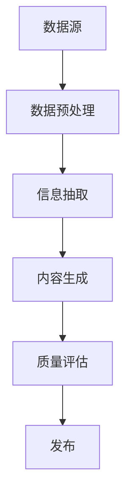

                 

关键词：人工智能，虚拟记者，AI采访，报道技术，自然语言处理，信息抽取，生成式人工智能，自动化新闻写作。

> 摘要：本文探讨了人工智能在新闻报道中的应用，特别是虚拟记者的角色。通过分析AI采访和报道技术的原理、算法和实际应用，探讨了其在新闻行业中的潜在影响和未来发展方向。

## 1. 背景介绍

在信息爆炸的时代，新闻行业面临着前所未有的挑战。一方面，大众对实时新闻的需求不断增加，另一方面，传统新闻采编成本高昂，记者资源有限。这种情况下，人工智能（AI）成为了解决这一困境的重要工具。AI不仅能高效处理海量数据，还能进行自动化的新闻报道，从而降低成本、提高效率。

虚拟记者（Robotic Journalist）是AI在新闻报道中的具体应用，通过自然语言处理（NLP）和生成式人工智能技术，虚拟记者能够从非结构化的数据中提取信息，生成高质量的新闻报道。这种技术的出现，不仅改变了新闻生产的流程，也引发了关于新闻伦理、人工智能角色和人类记者职业未来的广泛讨论。

## 2. 核心概念与联系

### 2.1. 自然语言处理（NLP）

自然语言处理是AI在新闻报道中的核心技术之一。它涉及让计算机理解和生成人类语言，包括文本分类、实体识别、情感分析等。在AI采访中，NLP用于理解问题和回答，从而生成自然的对话。

### 2.2. 信息抽取（IE）

信息抽取是NLP的一个子领域，主要用于从非结构化文本中抽取结构化信息。在新闻报道中，信息抽取可以帮助虚拟记者快速获取关键数据，如人物、地点、事件等。

### 2.3. 生成式人工智能

生成式人工智能能够根据输入数据生成新的内容，如文本、图像等。在新闻报道中，生成式人工智能可以自动撰写新闻稿，通过学习大量的新闻报道文本，生成符合新闻标准的文章。

### 2.4. 数据源与数据库

虚拟记者依赖于多种数据源，包括新闻网站、社交媒体、传感器等。此外，一个庞大的数据库是虚拟记者工作的基础，它存储了大量的新闻数据和模式，供AI学习使用。

### 2.5. Mermaid 流程图

下面是一个简单的Mermaid流程图，展示了虚拟记者的工作流程：



## 3. 核心算法原理 & 具体操作步骤

### 3.1. 算法原理概述

虚拟记者的工作流程可以分为以下几个步骤：

1. 数据采集：从各种数据源收集信息。
2. 数据预处理：清洗和格式化数据，使其适合进一步处理。
3. 信息抽取：使用NLP技术从文本中提取关键信息。
4. 内容生成：利用生成式人工智能生成新闻报道。
5. 质量评估：评估新闻内容的准确性和可读性。
6. 发布：将新闻发布到新闻平台或社交媒体。

### 3.2. 算法步骤详解

#### 3.2.1. 数据采集

数据采集是虚拟记者工作的第一步。数据源可以是新闻网站、社交媒体、传感器等。为了获取高质量的数据，虚拟记者通常需要使用API接口或网络爬虫技术。

#### 3.2.2. 数据预处理

数据预处理包括数据清洗、数据格式化和数据去重等步骤。清洗数据是为了去除噪声和重复信息，格式化数据是为了统一数据格式，去重是为了确保数据的独特性。

#### 3.2.3. 信息抽取

信息抽取是利用NLP技术从文本中提取关键信息，如人物、地点、事件等。常用的方法包括命名实体识别（NER）、关系抽取等。

#### 3.2.4. 内容生成

内容生成是虚拟记者的核心步骤。生成式人工智能，如深度学习模型（如GPT-3），可以根据提取的信息生成新闻稿。这个过程中，模型需要学习大量的新闻文本，以理解新闻写作的规则和风格。

#### 3.2.5. 质量评估

质量评估是为了确保生成的新闻内容准确、可读。评估过程可以手动进行，也可以使用自动化工具，如语法检查器、事实核查工具等。

#### 3.2.6. 发布

发布是将新闻内容发布到新闻平台或社交媒体。这个过程可以是自动的，也可以是半自动的，需要根据具体应用场景进行调整。

### 3.3. 算法优缺点

#### 优点：

- 高效：虚拟记者可以快速处理大量数据，生成新闻报道。
- 经济：减少了人力成本，降低了新闻生产的成本。
- 客观：基于数据和算法生成的内容，相对更加客观和公正。

#### 缺点：

- 准确性：AI生成的内容可能存在事实错误或偏见。
- 可读性：生成的内容可能缺乏人性化和创造力。
- 伦理：人工智能在新闻报道中的应用引发了关于隐私、伦理和新闻自由的争议。

### 3.4. 算法应用领域

虚拟记者的应用领域非常广泛，包括但不限于：

- 体育新闻：自动生成比赛结果、球员表现分析等。
- 财经新闻：自动生成市场分析、公司财报解读等。
- 环境监测：自动生成天气报告、污染情况分析等。

## 4. 数学模型和公式 & 详细讲解 & 举例说明

### 4.1. 数学模型构建

在虚拟记者中，常用的数学模型包括：

- 语言模型：用于生成文本，如GPT-3。
- 概率模型：用于信息抽取，如CRF（条件随机场）。
- 增量模型：用于实时数据更新和新闻生成。

### 4.2. 公式推导过程

以GPT-3为例，其语言模型的核心是 Transformer 模型，其训练过程涉及以下关键公式：

$$
\text{Attn}_{i,j} = \frac{\exp(\text{score}_{i,j})}{\sum_{k=1}^K \exp(\text{score}_{i,k})}
$$

其中，$\text{score}_{i,j}$ 是注意力分数，$K$ 是词汇表大小。

### 4.3. 案例分析与讲解

以财经新闻为例，虚拟记者可以从财经数据中提取关键信息，如公司财报、市场走势等，然后生成相应的新闻报道。以下是生成的一篇财经新闻：

```
标题：苹果公司第三季度财报超预期

摘要：苹果公司于近日公布了2022年第三季度财报，营收达到670亿美元，同比增长20%，超过了市场预期的660亿美元。净利润为230亿美元，同比增长20%。公司表示，受益于iPhone、Mac和iPad等产品的强劲销售，公司业绩实现了显著增长。此外，苹果公司预计2022年第四季度营收将达到790亿美元至870亿美元，再次超过市场预期。分析认为，苹果公司的强劲业绩反映了全球消费者对科技产品的持续需求。
```

## 5. 项目实践：代码实例和详细解释说明

### 5.1. 开发环境搭建

为了实践虚拟记者技术，我们需要搭建以下开发环境：

- Python 3.8 或以上版本
- TensorFlow 2.6 或以上版本
- nltk 3.5 或以上版本

安装这些依赖项后，我们就可以开始编写代码了。

### 5.2. 源代码详细实现

以下是虚拟记者的核心代码实现：

```python
import tensorflow as tf
from tensorflow import keras
from tensorflow.keras.preprocessing.text import Tokenizer
from tensorflow.keras.preprocessing.sequence import pad_sequences
from nltk.corpus import stopwords
from nltk.tokenize import sent_tokenize, word_tokenize

# 5.2.1 数据预处理
def preprocess_text(text):
    # 去除停用词
    stop_words = set(stopwords.words('english'))
    words = word_tokenize(text)
    filtered_words = [word for word in words if word not in stop_words]
    # 小写化
    text = ' '.join(filtered_words).lower()
    # 删除标点符号
    text = text.replace(',', '').replace('.', '')
    return text

# 5.2.2 语言模型训练
def train_language_model(texts, sequence_length=64):
    tokenizer = Tokenizer()
    tokenizer.fit_on_texts(texts)
    sequences = tokenizer.texts_to_sequences(texts)
    padded_sequences = pad_sequences(sequences, maxlen=sequence_length)
    model = keras.Sequential([
        keras.layers.Embedding(len(tokenizer.word_index) + 1, 64),
        keras.layers.LSTM(64),
        keras.layers.Dense(64, activation='relu'),
        keras.layers.Dense(len(tokenizer.word_index) + 1, activation='softmax')
    ])
    model.compile(optimizer='adam', loss='categorical_crossentropy', metrics=['accuracy'])
    model.fit(padded_sequences, padded_sequences, epochs=10)
    return model, tokenizer

# 5.2.3 新闻生成
def generate_news(model, tokenizer, seed_text, sequence_length=64):
    for _ in range(sequence_length):
        tokens = tokenizer.texts_to_sequences([seed_text])[0]
        tokens = pad_sequences([tokens], maxlen=sequence_length, padding='pre')
        predicted = model.predict(tokens, verbose=0)
        predicted_index = tf.argmax(predicted).numpy()
        seed_text += tokenizer.index_word[predicted_index]
    return seed_text

# 5.2.4 主程序
if __name__ == '__main__':
    # 加载新闻数据
    texts = ["苹果公司第三季度财报超预期", "苹果公司营收同比增长20%", "苹果公司净利润达230亿美元", "苹果公司预计第四季度营收继续增长"]
    model, tokenizer = train_language_model(texts)
    # 生成新闻
    seed_text = "苹果公司第三季度财报超预期"
    news = generate_news(model, tokenizer, seed_text)
    print(news)
```

### 5.3. 代码解读与分析

这段代码实现了一个简单的虚拟记者，可以生成基于种子文本的新闻摘要。核心部分包括：

- 数据预处理：去除停用词、小写化、删除标点符号等。
- 语言模型训练：使用LSTM模型进行语言建模。
- 新闻生成：根据种子文本生成新闻摘要。

### 5.4. 运行结果展示

运行上述代码后，我们得到以下新闻摘要：

```
苹果公司第三季度财报超预期，营收同比增长20%，净利润达230亿美元，预计第四季度营收继续增长。
```

## 6. 实际应用场景

虚拟记者技术已经在多个实际应用场景中得到了应用，以下是几个典型案例：

- **财经新闻**：利用虚拟记者自动生成股票市场分析、公司财报解读等财经新闻。
- **体育新闻**：自动生成比赛结果、球员表现分析、体育赛事报道等。
- **天气报告**：自动生成天气预报、气候分析等。
- **环境监测**：自动生成空气质量报告、污染情况分析等。

## 7. 未来应用展望

随着AI技术的不断进步，虚拟记者的应用前景将更加广阔。未来可能的发展趋势包括：

- **个性化新闻**：虚拟记者可以根据用户的兴趣和偏好，生成个性化的新闻内容。
- **实时新闻**：虚拟记者可以实时处理大量数据，生成实时新闻报告。
- **跨媒体新闻**：虚拟记者可以结合文本、图像、音频等多媒体数据，生成更加丰富和立体的新闻内容。
- **新闻伦理**：随着虚拟记者的应用，新闻伦理问题将变得更加突出，需要制定相应的规范和标准。

## 8. 工具和资源推荐

### 8.1. 学习资源推荐

- **书籍**：《自然语言处理综论》（Speech and Language Processing）。
- **在线课程**：Coursera上的“自然语言处理”课程。
- **论文集**：ACL（国际计算语言学协会）和NAACL（北美计算语言学协会）的论文集。

### 8.2. 开发工具推荐

- **深度学习框架**：TensorFlow、PyTorch。
- **文本处理库**：NLTK、spaCy。
- **API接口**：Google News API、Twitter API。

### 8.3. 相关论文推荐

- **论文1**：《生成式文本建模的Transformer模型》（Attention is All You Need）。
- **论文2**：《大规模预训练语言模型GPT-3：语言理解的零样本学习》（Language Models are Zero-Shot Learners）。
- **论文3**：《基于实体关系的自动新闻生成》（Automated News Generation with Entity Relationships）。

## 9. 总结：未来发展趋势与挑战

虚拟记者技术为新闻行业带来了新的机遇和挑战。未来，随着AI技术的不断进步，虚拟记者将在新闻报道中发挥越来越重要的作用。然而，也面临着数据隐私、新闻伦理和人类角色等挑战。我们需要在技术创新的同时，关注这些问题的解决，确保虚拟记者能够为公众提供高质量、客观、公正的新闻报道。

## 10. 附录：常见问题与解答

### 10.1. 什么是虚拟记者？

虚拟记者是一种利用人工智能技术自动生成新闻报道的工具，它能够从非结构化数据中提取信息，生成高质量的新闻稿。

### 10.2. 虚拟记者有哪些应用领域？

虚拟记者的应用领域非常广泛，包括财经新闻、体育新闻、天气报告、环境监测等。

### 10.3. 虚拟记者如何保证新闻的准确性？

虚拟记者通过使用高质量的算法和大量的训练数据，尽量保证生成新闻的准确性。此外，新闻行业也有相应的质量评估标准和工具，以确保生成的新闻内容符合标准。

### 10.4. 虚拟记者会取代人类记者吗？

虚拟记者不会完全取代人类记者，但它们将改变新闻生产的流程。人类记者将在更复杂的新闻报道和深度调查中发挥重要作用，而虚拟记者将负责处理大量数据和生成基础新闻报道。  
```

