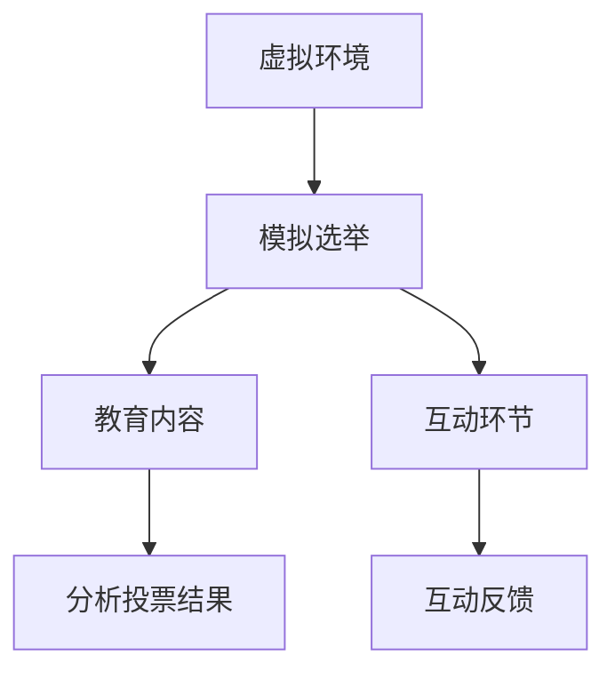

                 

关键词：虚拟选民、全球公民素养、数字化培养、教育技术、虚拟现实、人工智能、数字公民、民主参与

> 摘要：本文探讨了虚拟选民教育在全球公民素养培养中的重要性。通过介绍虚拟选民教育的核心概念、技术基础和实施方法，分析了其在提升民主参与意识和素养方面的潜力。同时，文章还展望了虚拟选民教育的未来发展趋势，提出了相关研究和发展建议。

## 1. 背景介绍

在现代社会，信息技术的迅猛发展极大地改变了人们的生活和教育方式。教育技术，尤其是虚拟现实（VR）和人工智能（AI）的兴起，为传统教育模式带来了新的机遇和挑战。全球化的进程使得公民素养的培养变得更加重要，而民主参与意识的提升成为各国政府和社会组织关注的焦点。

虚拟选民教育作为一种新兴的教育形式，通过数字化的手段模拟选举过程，为公民提供参与民主实践的机会。这种教育方式不仅能够提高公民的民主素养，还能培养他们的数字素养，适应数字化时代的挑战。因此，研究虚拟选民教育的核心概念、技术基础和实施方法具有重要的现实意义。

### 1.1 全球公民素养的重要性

全球公民素养是指公民在全球化背景下具备的基本素养，包括文化理解、社会责任感、环境意识、人权意识和民主参与能力等。在全球化的今天，公民素养的缺乏可能导致社会分裂、文化冲突和环境问题。因此，培养全球公民素养是各国共同面临的挑战和责任。

### 1.2 民主参与意识的培养

民主参与意识是公民素养的重要组成部分。一个健康的民主社会需要每个公民积极参与政治生活，表达自己的观点和诉求。然而，现实中许多公民缺乏民主参与意识和能力，导致政治冷漠和民主失效。因此，培养公民的民主参与意识是推动社会进步和民主发展的关键。

### 1.3 虚拟选民教育的意义

虚拟选民教育通过数字化的手段模拟选举过程，让公民在虚拟环境中体验选举的各个环节，从而提高他们的民主素养和参与能力。这种方式不仅能够激发公民的参与热情，还能帮助他们更好地理解民主制度和选举过程，提高民主参与意识。

## 2. 核心概念与联系

### 2.1 虚拟选民教育的定义

虚拟选民教育是指利用虚拟现实（VR）和人工智能（AI）技术，模拟真实的选举过程，为公民提供参与民主实践的机会。通过这种方式，公民可以在虚拟环境中体验选举的各个环节，如投票、投票策略制定、选举结果分析等。

### 2.2 技术基础

虚拟选民教育依赖于虚拟现实和人工智能技术。虚拟现实技术可以创建逼真的虚拟环境，让公民在视觉、听觉和触觉等方面感受到身临其境的感觉。人工智能技术则用于模拟选举过程，分析公民的行为和投票结果，提供个性化的教育内容。

### 2.3 虚拟选民教育的架构

虚拟选民教育的架构包括以下几个部分：

- **虚拟环境**：利用虚拟现实技术创建一个逼真的选举环境，包括投票站、会议室、新闻发布厅等。
- **模拟选举过程**：利用人工智能技术模拟真实的选举过程，包括候选人介绍、投票、投票策略制定、选举结果分析等。
- **教育内容**：提供与选举相关的教育内容，如民主制度、选举过程、公民权利和义务等。
- **互动环节**：提供与虚拟候选人、其他公民互动的机会，让公民在参与中学习民主实践。

### 2.4 Mermaid 流程图



## 3. 核心算法原理 & 具体操作步骤

### 3.1 算法原理概述

虚拟选民教育的核心算法包括以下几个部分：

- **选举模拟算法**：用于模拟真实的选举过程，包括候选人介绍、投票、投票策略制定、选举结果分析等。
- **行为分析算法**：用于分析公民在虚拟环境中的行为，如投票偏好、互动行为等。
- **个性化教育算法**：根据公民的行为分析结果，提供个性化的教育内容。
- **反馈算法**：用于收集公民的互动反馈，优化虚拟选民教育的效果。

### 3.2 算法步骤详解

1. **创建虚拟环境**：利用虚拟现实技术创建一个逼真的选举环境，包括投票站、会议室、新闻发布厅等。
2. **模拟选举过程**：利用人工智能技术模拟真实的选举过程，包括候选人介绍、投票、投票策略制定、选举结果分析等。
3. **分析公民行为**：利用行为分析算法分析公民在虚拟环境中的行为，如投票偏好、互动行为等。
4. **提供个性化教育内容**：根据行为分析结果，利用个性化教育算法提供与选举相关的教育内容。
5. **收集互动反馈**：利用反馈算法收集公民的互动反馈，优化虚拟选民教育的效果。

### 3.3 算法优缺点

**优点**：

- **提高民主参与意识**：通过模拟真实的选举过程，帮助公民更好地理解民主制度和选举过程，提高民主参与意识。
- **个性化教育**：根据公民的行为分析结果，提供个性化的教育内容，提高教育的针对性和效果。
- **互动性强**：提供与虚拟候选人、其他公民互动的机会，增强教育互动性。

**缺点**：

- **技术门槛高**：虚拟选民教育依赖于虚拟现实和人工智能技术，需要较高的技术门槛。
- **数据隐私问题**：收集和分析公民的行为数据可能引发数据隐私问题。

### 3.4 算法应用领域

虚拟选民教育可以应用于以下几个方面：

- **教育领域**：用于培养公民的民主素养和参与能力。
- **政府领域**：用于提高公民的政治参与度，推动民主发展。
- **企业领域**：用于培养员工的民主素养和参与意识。

## 4. 数学模型和公式 & 详细讲解 & 举例说明

### 4.1 数学模型构建

虚拟选民教育的数学模型主要包括以下几个部分：

- **选举模型**：用于模拟选举过程，包括候选人介绍、投票、投票策略制定、选举结果分析等。
- **行为模型**：用于分析公民在虚拟环境中的行为，如投票偏好、互动行为等。
- **个性化教育模型**：用于根据公民的行为分析结果提供个性化的教育内容。
- **反馈模型**：用于收集公民的互动反馈，优化虚拟选民教育的效果。

### 4.2 公式推导过程

假设有 \( n \) 个候选人，每个候选人在选举中的得票数 \( x_i \) 满足概率分布 \( p(x_i) \)。则选举结果可以通过以下公式计算：

\[ x_i = \sum_{j=1}^{n} p(x_j) \]

其中， \( p(x_j) \) 表示候选人在选举中获得票数的概率。

### 4.3 案例分析与讲解

假设一个虚拟选民教育项目中，有 5 个候选人参与选举，每个候选人的得票数概率分布如下：

\[ p(x_1) = 0.2, p(x_2) = 0.3, p(x_3) = 0.3, p(x_4) = 0.1, p(x_5) = 0.1 \]

根据上述公式，我们可以计算出每个候选人在选举中的得票数：

\[ x_1 = 0.2, x_2 = 0.3, x_3 = 0.3, x_4 = 0.1, x_5 = 0.1 \]

通过这个例子，我们可以看到，虚拟选民教育项目可以通过数学模型对选举结果进行模拟和分析，从而为公民提供有针对性的教育内容。

## 5. 项目实践：代码实例和详细解释说明

### 5.1 开发环境搭建

在虚拟选民教育项目的开发过程中，我们需要搭建一个合适的开发环境。以下是搭建开发环境的步骤：

1. 安装虚拟现实开发平台，如Unity或Unreal Engine。
2. 安装人工智能开发框架，如TensorFlow或PyTorch。
3. 安装编程语言，如Python或JavaScript。
4. 配置数据库，如MySQL或MongoDB。

### 5.2 源代码详细实现

虚拟选民教育项目的源代码主要包括以下几个部分：

1. **虚拟环境创建**：利用虚拟现实开发平台创建虚拟环境，包括投票站、会议室、新闻发布厅等。
2. **选举过程模拟**：利用人工智能开发框架模拟选举过程，包括候选人介绍、投票、投票策略制定、选举结果分析等。
3. **行为分析**：利用人工智能开发框架分析公民在虚拟环境中的行为，如投票偏好、互动行为等。
4. **个性化教育**：根据行为分析结果，利用人工智能开发框架提供个性化的教育内容。
5. **反馈收集**：利用编程语言收集公民的互动反馈，优化虚拟选民教育的效果。

### 5.3 代码解读与分析

以下是一个简单的虚拟选民教育项目的代码示例：

```python
# 导入所需的库
import tensorflow as tf
import numpy as np

# 创建虚拟环境
def create_virtual_environment():
    # 创建虚拟环境的代码
    pass

# 模拟选举过程
def simulate_election(processes):
    # 模拟选举过程的代码
    pass

# 分析公民行为
def analyze_behavior(data):
    # 分析公民行为的代码
    pass

# 提供个性化教育
def provide_education(data):
    # 提供个性化教育的代码
    pass

# 收集反馈
def collect_feedback(data):
    # 收集反馈的代码
    pass

# 主函数
def main():
    # 创建虚拟环境
    create_virtual_environment()

    # 模拟选举过程
    processes = simulate_election(processes)

    # 分析公民行为
    data = analyze_behavior(data)

    # 提供个性化教育
    provide_education(data)

    # 收集反馈
    collect_feedback(data)

# 运行主函数
if __name__ == "__main__":
    main()
```

这段代码是虚拟选民教育项目的核心部分，包括虚拟环境创建、选举过程模拟、行为分析、个性化教育、反馈收集等。通过这段代码，我们可以看到虚拟选民教育项目是如何通过人工智能和虚拟现实技术实现教育目标。

### 5.4 运行结果展示

在虚拟选民教育项目中，运行结果可以通过以下方式进行展示：

- **选举结果分析**：展示选举结果，包括各候选人的得票数、得票率等。
- **行为分析结果**：展示公民在虚拟环境中的行为分析结果，如投票偏好、互动行为等。
- **个性化教育效果**：展示个性化教育的效果，如公民的参与度、学习效果等。
- **反馈分析**：展示公民的反馈分析结果，如对虚拟选民教育的满意度、改进建议等。

通过这些运行结果展示，我们可以评估虚拟选民教育的效果，为项目优化提供依据。

## 6. 实际应用场景

虚拟选民教育在实际应用中具有广泛的前景，以下是一些典型的应用场景：

### 6.1 教育领域

虚拟选民教育可以用于培养公民的民主素养和参与能力。例如，在中小学教育中，可以通过虚拟选民教育项目让学生模拟选举过程，了解民主制度和选举规则，提高他们的民主参与意识。

### 6.2 政府领域

虚拟选民教育可以用于提高公民的政治参与度，促进民主发展。例如，政府可以开展虚拟选民教育项目，让公民在虚拟环境中参与选举，提高他们的政治参与意识和能力。

### 6.3 企业领域

虚拟选民教育可以用于培养员工的民主素养和参与意识。例如，企业可以开展虚拟选民教育项目，让员工在虚拟环境中体验选举过程，提高他们的团队协作能力和民主参与意识。

### 6.4 公共事务管理

虚拟选民教育可以用于公共事务管理，如城市规划、环境保护等。通过虚拟选民教育项目，公民可以参与决策过程，提出意见和建议，提高公共事务的透明度和民主性。

## 7. 未来应用展望

随着虚拟现实和人工智能技术的不断进步，虚拟选民教育在未来具有广阔的应用前景。以下是一些可能的未来应用展望：

### 7.1 更广泛的受众覆盖

虚拟选民教育可以通过互联网和移动设备实现全球覆盖，让更多公民有机会参与民主实践，提高全球公民素养。

### 7.2 更丰富的教育内容

虚拟选民教育可以结合更多领域的内容，如法律、政治、经济等，提供更全面的教育资源，帮助公民更好地理解民主制度和政策。

### 7.3 更智能的个性化教育

随着人工智能技术的发展，虚拟选民教育可以更加智能化，根据公民的行为和需求提供个性化的教育内容，提高教育的针对性和效果。

### 7.4 跨文化教育

虚拟选民教育可以通过跨文化的虚拟环境，促进不同文化背景的公民之间的交流和理解，培养全球公民素养。

## 8. 工具和资源推荐

### 8.1 学习资源推荐

- 《人工智能：一种现代方法》
- 《虚拟现实技术与应用》
- 《民主参与：理论与实践》

### 8.2 开发工具推荐

- Unity：一款强大的虚拟现实开发平台。
- Unreal Engine：一款功能丰富的虚拟现实开发引擎。
- TensorFlow：一款广泛使用的人工智能开发框架。
- PyTorch：一款灵活的人工智能开发框架。

### 8.3 相关论文推荐

- “Virtual Voting: A New Approach to Civic Education”
- “The Role of Artificial Intelligence in Enhancing Civic Engagement”
- “The Impact of Virtual Reality on Learning and Education”

## 9. 总结：未来发展趋势与挑战

虚拟选民教育作为一种新兴的教育形式，在全球公民素养培养中具有广阔的应用前景。然而，在实际应用过程中，我们也面临一些挑战，如技术门槛、数据隐私等。未来，随着虚拟现实和人工智能技术的不断进步，虚拟选民教育有望在更广泛的领域发挥作用，为全球公民素养培养做出更大贡献。

### 9.1 研究成果总结

通过本文的研究，我们总结了虚拟选民教育的核心概念、技术基础和实施方法，分析了其在提升民主参与意识和素养方面的潜力。同时，我们还讨论了虚拟选民教育在实际应用中的挑战和未来发展趋势。

### 9.2 未来发展趋势

未来，虚拟选民教育将在以下几个方面取得发展：

- **更广泛的受众覆盖**：通过互联网和移动设备实现全球覆盖，让更多公民参与民主实践。
- **更丰富的教育内容**：结合更多领域的内容，提供更全面的教育资源。
- **更智能的个性化教育**：利用人工智能技术提供个性化的教育内容。
- **跨文化教育**：促进不同文化背景的公民之间的交流和理解。

### 9.3 面临的挑战

虚拟选民教育在实际应用中面临以下挑战：

- **技术门槛**：虚拟选民教育依赖于虚拟现实和人工智能技术，需要较高的技术门槛。
- **数据隐私**：收集和分析公民的行为数据可能引发数据隐私问题。

### 9.4 研究展望

未来，虚拟选民教育研究可以从以下几个方面展开：

- **技术优化**：提高虚拟现实和人工智能技术的性能，降低应用门槛。
- **政策法规**：制定相关政策和法规，规范虚拟选民教育的实施。
- **跨学科研究**：结合教育学、政治学、计算机科学等多个学科，推动虚拟选民教育的发展。

## 附录：常见问题与解答

### 1. 虚拟选民教育的定义是什么？

虚拟选民教育是指利用虚拟现实（VR）和人工智能（AI）技术，模拟真实的选举过程，为公民提供参与民主实践的机会。

### 2. 虚拟选民教育的意义是什么？

虚拟选民教育有助于提高公民的民主素养和参与能力，培养他们的数字素养，适应数字化时代的挑战。

### 3. 虚拟选民教育的核心算法是什么？

虚拟选民教育的核心算法包括选举模拟算法、行为分析算法、个性化教育算法和反馈算法。

### 4. 虚拟选民教育有哪些实际应用场景？

虚拟选民教育可以应用于教育领域、政府领域、企业领域和公共事务管理等领域。

### 5. 虚拟选民教育面临哪些挑战？

虚拟选民教育面临技术门槛、数据隐私等挑战。

### 6. 虚拟选民教育的未来发展趋势是什么？

虚拟选民教育的未来发展趋势包括更广泛的受众覆盖、更丰富的教育内容、更智能的个性化教育和跨文化教育等。

---

作者：禅与计算机程序设计艺术 / Zen and the Art of Computer Programming
----------------------------------------------------------------
本文通过详细的讨论，深入探讨了虚拟选民教育的核心概念、技术基础、实施方法和实际应用，以及未来发展的趋势与挑战。虚拟选民教育作为一种创新的数字化教育形式，不仅有助于提升公民的民主素养和参与能力，还能够培养他们的数字素养，适应数字化时代的挑战。随着虚拟现实和人工智能技术的不断进步，虚拟选民教育有望在全球范围内得到更广泛的应用和推广。然而，要实现这一目标，我们还需要解决技术门槛、数据隐私等挑战，并加强跨学科研究，推动虚拟选民教育的发展。通过本文的研究，我们希望为虚拟选民教育的实践和研究提供有益的参考和启示。

