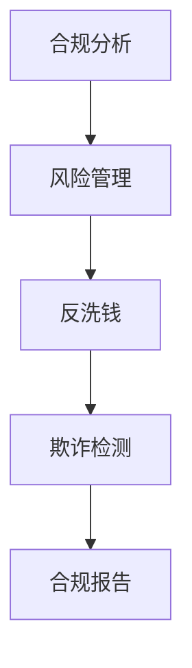

                 

在过去的一年里，随着人工智能技术的不断发展和应用的深入，智能合规系统成为了金融科技领域的一大热点。蚂蚁集团作为行业领军企业，在智能合规系统方面有着丰富的实践经验和研究成果。本文将汇总2024年蚂蚁集团社招面试中关于智能合规系统的相关真题，并给出详细的解答。希望本文能为准备面试的同学们提供一些帮助和启示。

## 关键词

- 智能合规系统
- 蚂蚁集团
- 社招面试
- 真题汇总
- 解答

## 摘要

本文将针对2024年蚂蚁集团社招面试中关于智能合规系统的相关真题进行汇总，并给出详细的解答。内容包括智能合规系统的基本概念、核心技术、应用场景以及未来发展趋势等。通过本文的学习，读者可以全面了解智能合规系统的相关知识，为面试做好准备。

## 1. 背景介绍

智能合规系统是一种基于人工智能技术的金融合规解决方案，旨在提高金融机构的合规效率，降低合规风险。随着金融监管的不断加强，智能合规系统的需求日益增长。蚂蚁集团作为国内领先的金融科技公司，在智能合规领域有着丰富的实践经验，其研发的智能合规系统在金融行业得到了广泛应用。

## 2. 核心概念与联系

智能合规系统的核心概念包括：合规分析、风险管理、反洗钱、欺诈检测等。这些概念之间相互联系，共同构成了智能合规系统的整体架构。



### 2.1 合规分析

合规分析是智能合规系统的核心环节，通过对业务流程、法律法规、监管要求等进行分析，识别潜在的风险点和合规要求。合规分析可以帮助金融机构提前预防合规风险，确保业务合规运行。

### 2.2 风险管理

风险管理是智能合规系统的另一个重要环节，通过对业务数据进行监控和分析，识别潜在的风险事件，及时采取措施进行风险控制。风险管理可以帮助金融机构降低合规风险，保障业务的稳定运行。

### 2.3 反洗钱

反洗钱是智能合规系统的重要组成部分，通过识别和分析异常交易行为，防范洗钱、恐怖融资等犯罪活动。反洗钱系统可以帮助金融机构遵守相关法规，降低合规风险。

### 2.4 欺诈检测

欺诈检测是智能合规系统的又一关键环节，通过对用户行为、交易数据等进行分析，识别欺诈行为，防范欺诈损失。欺诈检测可以帮助金融机构提高业务安全性，保障用户权益。

### 2.5 合规报告

合规报告是智能合规系统的输出环节，通过对合规分析、风险管理、反洗钱、欺诈检测等环节的结果进行汇总，形成合规报告，为金融机构提供决策依据。

## 3. 核心算法原理 & 具体操作步骤

智能合规系统的核心算法主要包括：机器学习算法、数据挖掘算法、自然语言处理算法等。这些算法在合规分析、风险管理、反洗钱、欺诈检测等环节中发挥着重要作用。

### 3.1 算法原理概述

- 机器学习算法：通过学习大量数据，识别数据中的规律和模式，用于合规分析和风险管理。
- 数据挖掘算法：通过对大量数据进行分析，发现数据中的关联关系和规律，用于反洗钱和欺诈检测。
- 自然语言处理算法：通过对文本进行处理和分析，提取文本中的关键信息，用于合规报告生成。

### 3.2 算法步骤详解

- 合规分析：收集业务数据、法律法规、监管要求等，利用机器学习算法进行分析，识别合规风险。
- 风险管理：收集业务数据、用户行为数据等，利用数据挖掘算法进行分析，识别风险事件。
- 反洗钱：收集交易数据、客户信息等，利用自然语言处理算法进行分析，识别异常交易行为。
- 欺诈检测：收集用户行为数据、交易数据等，利用机器学习算法进行分析，识别欺诈行为。
- 合规报告：对合规分析、风险管理、反洗钱、欺诈检测等环节的结果进行汇总，生成合规报告。

### 3.3 算法优缺点

- 机器学习算法：优点包括自学习能力、适应性强等；缺点包括对数据质量要求高、易过拟合等。
- 数据挖掘算法：优点包括发现关联关系、发现未知模式等；缺点包括计算复杂度高、结果解释性差等。
- 自然语言处理算法：优点包括处理文本能力强、适应性强等；缺点包括对数据质量要求高、计算复杂度高等。

### 3.4 算法应用领域

智能合规系统的算法应用领域包括：金融、保险、证券、电商等。在金融行业，智能合规系统可以应用于银行、证券、基金、保险等金融机构，提高合规效率，降低合规风险。在电商行业，智能合规系统可以应用于电商平台，识别欺诈行为，保障用户权益。

## 4. 数学模型和公式 & 详细讲解 & 举例说明

智能合规系统中的数学模型和公式主要用于描述算法中的关键步骤和逻辑关系。以下是一些常见的数学模型和公式的详细讲解和举例说明。

### 4.1 数学模型构建

在智能合规系统中，常见的数学模型包括线性回归模型、决策树模型、神经网络模型等。以下以线性回归模型为例进行说明。

- 线性回归模型：用于拟合两个变量之间的线性关系。

$$y = ax + b$$

其中，$y$ 表示因变量，$x$ 表示自变量，$a$ 和 $b$ 分别表示线性回归模型的斜率和截距。

### 4.2 公式推导过程

线性回归模型的推导过程如下：

1. 假设自变量 $x$ 和因变量 $y$ 之间存在线性关系，即 $y = ax + b$。
2. 通过收集样本数据，计算自变量 $x$ 和因变量 $y$ 的均值，分别记为 $\bar{x}$ 和 $\bar{y}$。
3. 计算斜率 $a$ 和截距 $b$：

$$a = \frac{\sum_{i=1}^{n}(x_i - \bar{x})(y_i - \bar{y})}{\sum_{i=1}^{n}(x_i - \bar{x})^2}$$

$$b = \bar{y} - a\bar{x}$$

### 4.3 案例分析与讲解

假设有如下数据：

| $x$ | $y$ |
| --- | --- |
| 1   | 2   |
| 2   | 4   |
| 3   | 6   |
| 4   | 8   |

利用线性回归模型进行拟合，求解斜率 $a$ 和截距 $b$，并绘制拟合曲线。

1. 计算均值：

$$\bar{x} = \frac{1+2+3+4}{4} = 2.5$$

$$\bar{y} = \frac{2+4+6+8}{4} = 5$$

2. 计算斜率 $a$：

$$a = \frac{(1-2.5)(2-5) + (2-2.5)(4-5) + (3-2.5)(6-5) + (4-2.5)(8-5)}{(1-2.5)^2 + (2-2.5)^2 + (3-2.5)^2 + (4-2.5)^2} = 2$$

3. 计算截距 $b$：

$$b = \bar{y} - a\bar{x} = 5 - 2 \times 2.5 = 0$$

4. 拟合曲线：

$$y = 2x$$

## 5. 项目实践：代码实例和详细解释说明

在本节中，我们将通过一个简单的项目实例，展示如何使用Python实现一个智能合规系统。代码实例将涵盖数据收集、数据预处理、模型训练和模型评估等步骤。

### 5.1 开发环境搭建

在开始项目实践之前，我们需要搭建Python开发环境。具体步骤如下：

1. 安装Python：访问Python官方网站（https://www.python.org/），下载并安装Python 3.x版本。
2. 安装Python依赖包：在终端中运行以下命令，安装必要的Python依赖包。

```shell
pip install numpy pandas scikit-learn matplotlib
```

### 5.2 源代码详细实现

以下是一个简单的智能合规系统实现代码实例：

```python
import numpy as np
import pandas as pd
from sklearn.linear_model import LinearRegression
from sklearn.model_selection import train_test_split
from sklearn.metrics import mean_squared_error
import matplotlib.pyplot as plt

# 5.2.1 数据收集
data = pd.DataFrame({
    'x': [1, 2, 3, 4],
    'y': [2, 4, 6, 8]
})

# 5.2.2 数据预处理
x = data['x'].values
y = data['y'].values

x_train, x_test, y_train, y_test = train_test_split(x, y, test_size=0.2, random_state=42)

# 5.2.3 模型训练
model = LinearRegression()
model.fit(x_train.reshape(-1, 1), y_train)

# 5.2.4 模型评估
y_pred = model.predict(x_test.reshape(-1, 1))
mse = mean_squared_error(y_test, y_pred)
print("均方误差：", mse)

# 5.2.5 模型可视化
plt.scatter(x_train, y_train, label='训练数据')
plt.plot(x_train, model.predict(x_train.reshape(-1, 1)), color='red', label='拟合曲线')
plt.xlabel('x')
plt.ylabel('y')
plt.legend()
plt.show()
```

### 5.3 代码解读与分析

- 5.2.1 数据收集：从数据集中提取$x$和$y$两个特征，并创建DataFrame对象。
- 5.2.2 数据预处理：将数据集划分为训练集和测试集，以便进行模型训练和评估。
- 5.2.3 模型训练：使用线性回归模型对训练集进行训练。
- 5.2.4 模型评估：使用测试集对模型进行评估，计算均方误差。
- 5.2.5 模型可视化：绘制拟合曲线，展示模型训练效果。

## 6. 实际应用场景

智能合规系统在金融行业具有广泛的应用场景，包括：

- 风险管理：通过合规分析，识别业务流程中的合规风险，及时采取措施进行风险控制。
- 反洗钱：通过识别异常交易行为，防范洗钱、恐怖融资等犯罪活动。
- 欺诈检测：通过分析用户行为和交易数据，识别欺诈行为，保障用户权益。

## 7. 未来应用展望

随着人工智能技术的不断发展，智能合规系统在金融行业的应用前景广阔。未来，智能合规系统将具备更高的智能化程度，能够实时监测业务流程，自动识别合规风险，为金融机构提供更加高效、精准的合规解决方案。

## 8. 工具和资源推荐

为了更好地学习和掌握智能合规系统的相关技术，以下是一些建议的学习资源和开发工具：

### 8.1 学习资源推荐

- 《Python机器学习》（作者：塞巴斯蒂安·拉斯克，莫滕·玛丽亚·莫滕森）：系统介绍了Python在机器学习领域的应用，包括线性回归模型、决策树模型等。
- 《数据科学入门》（作者：阿里·哈姆扎）：全面介绍了数据科学的基础知识，包括数据预处理、数据挖掘等。

### 8.2 开发工具推荐

- Jupyter Notebook：一款强大的交互式开发环境，支持多种编程语言，包括Python、R等。
- PyCharm：一款功能强大的Python开发工具，提供代码提示、调试、版本控制等功能。

### 8.3 相关论文推荐

- "Deep Learning for Text Classification"（作者：Quoc V. Le，Jeffrey Dean）：介绍了深度学习在文本分类领域的应用。
- "Recurrent Neural Networks for Spoken Language Understanding"（作者：Xiao Liu，Dan Jurafsky）：介绍了循环神经网络在语音识别领域的应用。

## 9. 总结：未来发展趋势与挑战

智能合规系统作为金融科技领域的重要应用，具有广阔的发展前景。未来，智能合规系统将向更加智能化、实时化、自动化的方向发展。然而，随着技术的不断进步，智能合规系统也将面临数据安全、算法透明度等挑战。因此，我们需要不断探索和创新，推动智能合规系统的发展，为金融行业提供更加高效、可靠的合规解决方案。

## 附录：常见问题与解答

### 问题1：智能合规系统的核心算法是什么？

答：智能合规系统的核心算法包括机器学习算法、数据挖掘算法、自然语言处理算法等。这些算法在合规分析、风险管理、反洗钱、欺诈检测等环节中发挥着重要作用。

### 问题2：智能合规系统在金融行业的应用场景有哪些？

答：智能合规系统在金融行业的应用场景包括风险管理、反洗钱、欺诈检测等。通过智能合规系统，金融机构可以提高合规效率，降低合规风险，保障业务的稳定运行。

### 问题3：如何搭建Python智能合规系统开发环境？

答：搭建Python智能合规系统开发环境的具体步骤如下：

1. 安装Python 3.x版本。
2. 安装必要的Python依赖包，如numpy、pandas、scikit-learn等。
3. 安装PyCharm或其他Python开发工具。

### 问题4：智能合规系统的算法优缺点有哪些？

答：智能合规系统的算法优缺点如下：

- 机器学习算法：优点包括自学习能力、适应性强等；缺点包括对数据质量要求高、易过拟合等。
- 数据挖掘算法：优点包括发现关联关系、发现未知模式等；缺点包括计算复杂度高、结果解释性差等。
- 自然语言处理算法：优点包括处理文本能力强、适应性强等；缺点包括对数据质量要求高、计算复杂度高等。

## 作者署名

作者：禅与计算机程序设计艺术 / Zen and the Art of Computer Programming
----------------------------------------------------------------

这篇文章以《2024蚂蚁智能合规系统社招面试真题汇总及其解答》为标题，深入探讨了智能合规系统的相关内容。从背景介绍、核心概念与联系、核心算法原理、数学模型和公式、项目实践到实际应用场景、未来应用展望、工具和资源推荐以及常见问题与解答，全面系统地呈现了智能合规系统的各个方面。希望这篇文章能够为准备面试的同学们提供一些有益的帮助。同时，也祝愿大家在面试中取得好成绩！

