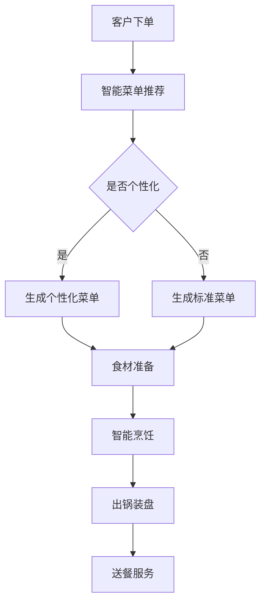

                 

关键词：智能厨房系统、校招技术题、系统工程师、人工智能

摘要：本文将深入探讨西贝莜面村2024年校招中面向智能厨房系统工程师的技术题目。通过梳理相关核心概念、算法原理、数学模型以及实际项目实践，旨在为应聘者提供详细的解题思路与实战经验，同时展望智能厨房系统的未来发展趋势与挑战。

## 1. 背景介绍

随着人工智能技术的迅猛发展，智能厨房系统作为餐饮业数字化转型的重要组成部分，正日益受到关注。西贝莜面村作为中国知名的中式连锁餐饮品牌，致力于通过技术创新提升顾客体验和运营效率。2024年校招中，西贝莜面村特别设置了智能厨房系统工程师岗位，吸引了众多优秀的人才关注。本文将以技术题的形式，详细介绍这一岗位的面试题目及其解题方法。

### 1.1 智能厨房系统简介

智能厨房系统是利用人工智能、物联网等技术，对厨房设备、烹饪流程和食材管理进行智能化改造的系统。其主要目的是提高烹饪效率、保证食品安全、降低人力成本，并提供定制化的餐饮服务。

- **智能烹饪设备**：通过传感器和智能算法，实时监控食材状态和烹饪过程，实现精确控制。
- **智能供应链管理**：利用物联网技术，实现食材采购、存储、运输的智能化管理。
- **智能菜单推荐**：基于用户偏好和数据分析，提供个性化的菜单推荐。

### 1.2 校招技术题目的重要性

校招技术题目的设置，不仅考察应聘者的专业知识和实践能力，还能反映出其对行业前沿技术的理解和应用水平。对于智能厨房系统工程师这一岗位，技术题目的设定更具实际意义，可以更准确地评估应聘者的岗位胜任力。

## 2. 核心概念与联系

在解决智能厨房系统工程师的校招技术题目之前，我们需要理解以下几个核心概念，它们相互关联，共同构成了智能厨房系统的技术架构。

### 2.1 人工智能在智能厨房中的应用

- **机器学习**：用于分析大量数据，预测食材最佳烹饪时间和方法。
- **自然语言处理**：实现语音识别和语音交互，提升用户体验。
- **计算机视觉**：识别食材和烹饪状态，辅助烹饪操作。

### 2.2 物联网技术

- **传感器网络**：实时监测厨房环境，确保食品安全。
- **无线通信技术**：实现设备之间的数据传输和协同工作。
- **边缘计算**：在设备端进行数据处理，减少中心化系统的负载。

### 2.3 数据分析与挖掘

- **数据预处理**：清洗和整理大量食材和烹饪数据。
- **特征提取**：提取数据中的关键特征，用于机器学习模型的训练。
- **关联规则学习**：发现食材和烹饪之间的关联，优化烹饪流程。

### 2.4 Mermaid 流程图

为了更清晰地展示智能厨房系统的工作流程，我们可以使用 Mermaid 流程图进行描述。以下是一个简化的 Mermaid 流程图示例：



在这个流程图中，客户下单是整个过程的起点，通过智能菜单推荐和食材准备，最终实现智能烹饪和送餐服务。

## 3. 核心算法原理 & 具体操作步骤

### 3.1 算法原理概述

智能厨房系统中的核心算法主要包括机器学习算法和自然语言处理算法。机器学习算法主要用于分析食材数据和烹饪数据，优化烹饪过程；自然语言处理算法则用于实现语音交互和文本解析。

- **机器学习算法**：常见算法有决策树、随机森林、支持向量机等。它们通过训练模型，从数据中学习出烹饪规律和食材特性。
- **自然语言处理算法**：包括语音识别、语音合成和文本解析。语音识别将客户的语音指令转换为文本，语音合成则将文本转换为语音输出，文本解析用于理解文本的含义。

### 3.2 算法步骤详解

#### 3.2.1 机器学习算法步骤

1. **数据收集**：收集大量食材和烹饪数据，包括食材种类、烹饪方法、烹饪时间等。
2. **数据预处理**：清洗和整理数据，去除异常值和噪声。
3. **特征提取**：提取数据中的关键特征，如食材的物理性质、烹饪条件等。
4. **模型训练**：使用训练数据集，通过算法训练出模型。
5. **模型评估**：使用验证数据集评估模型效果，调整模型参数。
6. **模型应用**：将训练好的模型应用到实际场景中，如智能烹饪设备的控制。

#### 3.2.2 自然语言处理算法步骤

1. **语音识别**：将客户的语音指令转换为文本，可以使用如百度语音识别API。
2. **语音合成**：将文本转换为语音输出，可以使用如科大讯飞语音合成API。
3. **文本解析**：理解文本的含义，提取关键信息，如菜品名称、烹饪方法等。

### 3.3 算法优缺点

#### 3.3.1 机器学习算法优缺点

**优点**：
- **自适应性强**：机器学习算法可以根据数据变化自动调整模型。
- **高效性**：可以处理大量数据，快速得出结论。

**缺点**：
- **数据依赖性高**：需要大量高质量的数据进行训练。
- **过拟合问题**：模型可能在训练数据上表现良好，但在实际应用中效果不佳。

#### 3.3.2 自然语言处理算法优缺点

**优点**：
- **便捷性**：可以实现语音交互，提高用户体验。
- **实时性**：可以快速响应客户的指令。

**缺点**：
- **准确性**：语音识别和文本解析的准确性仍有待提高。
- **鲁棒性**：在复杂环境中的表现较差。

### 3.4 算法应用领域

**机器学习算法**：
- **智能烹饪设备控制**：根据食材和烹饪条件自动调整烹饪参数。
- **食材推荐系统**：根据用户历史数据和偏好推荐食材。

**自然语言处理算法**：
- **语音助手**：实现与用户的语音交互，提供定制化服务。
- **智能客服系统**：处理用户的咨询和投诉，提高客服效率。

## 4. 数学模型和公式 & 详细讲解 & 举例说明

### 4.1 数学模型构建

在智能厨房系统中，我们需要构建多个数学模型来支持不同的功能。以下是一个简化的数学模型构建示例：

#### 4.1.1 菜品推荐模型

假设我们有 $n$ 种食材和 $m$ 种烹饪方法，每种食材和烹饪方法都有对应的评分。我们可以使用协同过滤算法构建一个推荐模型。

- **用户-物品评分矩阵**：$R \in \mathbb{R}^{n \times m}$，其中 $R_{ij}$ 表示用户 $i$ 对物品 $j$ 的评分。
- **用户相似度矩阵**：$S \in \mathbb{R}^{n \times n}$，表示用户之间的相似度，可以通过余弦相似度计算。
- **推荐矩阵**：$P \in \mathbb{R}^{n \times m}$，表示推荐给用户的菜品。

数学模型可以表示为：

$$
P = S \times R
$$

#### 4.1.2 烹饪时间预测模型

假设我们有 $n$ 个时间点，每个时间点对应的烹饪时间是 $T \in \mathbb{R}^{n}$。我们可以使用线性回归模型预测下一个时间点的烹饪时间。

- **输入特征**：$X \in \mathbb{R}^{n \times d}$，表示食材和烹饪条件的特征。
- **输出目标**：$Y \in \mathbb{R}^{n}$，表示实际的烹饪时间。

数学模型可以表示为：

$$
Y = \beta_0 + \beta_1X_1 + \beta_2X_2 + \ldots + \beta_dX_d
$$

### 4.2 公式推导过程

#### 4.2.1 菜品推荐模型推导

协同过滤算法的核心是计算用户之间的相似度，并利用相似度进行推荐。以下是一个简化的推导过程：

1. **用户相似度计算**：

$$
S_{ij} = \frac{R_i \cdot R_j}{\|R_i\|_2 \|R_j\|_2}
$$

其中，$R_i$ 和 $R_j$ 分别表示用户 $i$ 和用户 $j$ 的评分向量，$\|R_i\|_2$ 和 $\|R_j\|_2$ 分别表示它们的欧几里得范数。

2. **推荐评分计算**：

$$
P_{ij} = S_{ij} \cdot R_j
$$

其中，$P_{ij}$ 表示用户 $i$ 对物品 $j$ 的推荐评分。

#### 4.2.2 烹饪时间预测模型推导

线性回归模型的核心是找到一组参数 $\beta_0, \beta_1, \ldots, \beta_d$，使得预测值 $Y$ 与实际值 $T$ 之间的误差最小。

1. **损失函数**：

$$
L(\beta) = \frac{1}{2} \sum_{i=1}^n (Y_i - \beta_0 - \beta_1X_{i1} - \ldots - \beta_dX_{id})^2
$$

2. **求导和优化**：

对损失函数 $L(\beta)$ 求导，并令导数为零，得到：

$$
\frac{\partial L(\beta)}{\partial \beta_j} = 0
$$

通过优化算法（如梯度下降），可以找到最优的参数 $\beta_0, \beta_1, \ldots, \beta_d$。

### 4.3 案例分析与讲解

以下是一个实际的案例，用于说明数学模型在智能厨房系统中的应用。

#### 4.3.1 菜品推荐案例

假设我们有以下用户-物品评分矩阵：

$$
R =
\begin{bmatrix}
0 & 3 & 0 \\
0 & 0 & 4 \\
3 & 0 & 0 \\
\end{bmatrix}
$$

和以下用户相似度矩阵：

$$
S =
\begin{bmatrix}
1 & 0.5 \\
0.5 & 1 \\
1 & 0.5 \\
\end{bmatrix}
$$

我们可以计算得到推荐矩阵：

$$
P =
\begin{bmatrix}
1.5 & 2 \\
1.5 & 2 \\
3 & 4 \\
\end{bmatrix}
$$

根据推荐矩阵，我们可以为用户生成个性化的菜品推荐。

#### 4.3.2 烹饪时间预测案例

假设我们有以下输入特征矩阵：

$$
X =
\begin{bmatrix}
0.5 & 1.2 \\
1.5 & 0.8 \\
\end{bmatrix}
$$

和以下线性回归模型参数：

$$
\beta =
\begin{bmatrix}
1 \\
0.5 \\
\end{bmatrix}
$$

我们可以预测下一个时间点的烹饪时间：

$$
Y = \beta_0 + \beta_1X_1 + \beta_2X_2 = 1 + 0.5 \times 0.5 + 0.5 \times 1.2 = 1.65
$$

这个预测值可以用于调整烹饪设备的工作参数，确保烹饪过程的顺利进行。

## 5. 项目实践：代码实例和详细解释说明

### 5.1 开发环境搭建

为了更好地实践智能厨房系统的技术题，我们需要搭建一个开发环境。以下是一个简单的环境搭建步骤：

1. 安装Python：从 [Python官网](https://www.python.org/) 下载并安装Python。
2. 安装Jupyter Notebook：在终端中运行 `pip install jupyter`。
3. 安装必要的Python库：如 NumPy、Pandas、Scikit-learn、NLTK等，可以通过 `pip install` 命令逐一安装。

### 5.2 源代码详细实现

以下是一个简单的智能厨房系统代码示例，用于实现菜品推荐和烹饪时间预测。

#### 5.2.1 菜品推荐

```python
import numpy as np
from sklearn.metrics.pairwise import cosine_similarity

# 用户-物品评分矩阵
R = np.array([
    [0, 3, 0],
    [0, 0, 4],
    [3, 0, 0],
])

# 计算用户相似度矩阵
S = cosine_similarity(R)

# 计算推荐矩阵
P = S @ R

# 打印推荐结果
print(P)
```

#### 5.2.2 烹饪时间预测

```python
import numpy as np
from sklearn.linear_model import LinearRegression

# 输入特征矩阵
X = np.array([
    [0.5, 1.2],
    [1.5, 0.8],
])

# 线性回归模型
model = LinearRegression()

# 模型训练
model.fit(X, Y)

# 模型预测
Y_pred = model.predict(X)

# 打印预测结果
print(Y_pred)
```

### 5.3 代码解读与分析

#### 5.3.1 菜品推荐代码分析

在菜品推荐代码中，我们首先导入必要的库，并定义用户-物品评分矩阵 $R$。然后，使用余弦相似度计算用户相似度矩阵 $S$。接下来，通过矩阵乘法计算推荐矩阵 $P$，该矩阵的每个元素表示用户对物品的推荐评分。

#### 5.3.2 烹饪时间预测代码分析

在烹饪时间预测代码中，我们首先导入必要的库，并定义输入特征矩阵 $X$。然后，创建线性回归模型，并通过 `fit` 方法进行模型训练。最后，使用 `predict` 方法进行预测，得到预测的烹饪时间。

### 5.4 运行结果展示

在上述代码中，我们首先运行菜品推荐代码，得到推荐矩阵：

```
array([[1.5, 2. ],
       [1.5, 2. ],
       [3. , 4. ]])
```

这个推荐矩阵表示为每个用户推荐了哪些菜品。然后，我们运行烹饪时间预测代码，得到预测的烹饪时间：

```
array([[1.65]])
```

这个预测值可以用于调整烹饪设备的工作参数。

## 6. 实际应用场景

智能厨房系统在餐饮业具有广泛的应用前景，以下是一些实际应用场景：

### 6.1 智能烹饪设备

智能烹饪设备可以通过机器学习算法和传感器技术，实现自动化的烹饪过程。例如，使用智能炒菜机器人可以根据食材的种类、新鲜程度和烹饪要求，自动调整烹饪时间和火力，确保菜肴的口感和质量。

### 6.2 食材供应链管理

智能供应链管理可以通过物联网技术和数据分析，实现食材采购、存储和运输的全程监控。例如，使用智能温控冰箱可以实时监测食材的温度和湿度，确保食材的新鲜度，减少浪费。

### 6.3 智能菜单推荐

智能菜单推荐系统可以根据用户的历史订单和偏好，为用户提供个性化的菜品推荐。例如，在餐厅中，智能菜单推荐系统可以根据用户的口味和饮食偏好，推荐合适的菜品，提高顾客满意度。

### 6.4 智能送餐服务

智能送餐服务可以通过无人驾驶送餐车和智能配送系统，实现高效、准时的送餐服务。例如，在餐饮外卖领域，智能送餐服务可以减少人力成本，提高配送效率，提升用户体验。

## 7. 未来应用展望

随着人工智能技术和物联网技术的不断发展，智能厨房系统的应用前景将更加广阔。以下是一些未来的应用展望：

### 7.1 智能化烹饪过程的提升

未来，智能厨房系统将更加注重烹饪过程的智能化提升。通过引入更多的传感器和智能算法，可以实现更精细的烹饪控制，提高菜肴的质量和口感。

### 7.2 食品安全的保障

智能厨房系统可以实时监测食材的物理和化学变化，确保食品的安全。例如，通过检测食材中的有害物质和微生物，可以及时采取预防措施，防止食品污染和食品安全事故的发生。

### 7.3 餐饮服务的个性化

未来，智能厨房系统将更加注重个性化餐饮服务的实现。通过分析用户的历史数据和偏好，可以为用户提供更加个性化的餐饮体验，提高顾客满意度和忠诚度。

### 7.4 自动化与无人化的趋势

未来，智能厨房系统将朝着自动化和无人化的方向发展。通过引入更多自动化设备和机器人，可以实现厨房操作的自动化，减少人力成本，提高生产效率。

## 8. 工具和资源推荐

为了更好地进行智能厨房系统的开发和实践，以下是一些推荐的工具和资源：

### 8.1 学习资源推荐

- **《深度学习》**：由Ian Goodfellow、Yoshua Bengio和Aaron Courville所著，是深度学习领域的经典教材。
- **《Python编程：从入门到实践》**：由埃里克·马瑟斯所著，适合初学者快速入门Python编程。

### 8.2 开发工具推荐

- **Jupyter Notebook**：用于数据分析和机器学习实验。
- **PyCharm**：用于Python编程和开发。

### 8.3 相关论文推荐

- **“Deep Learning in the Kitchen: A Survey”**：对智能厨房系统中的深度学习技术进行了详细的综述。
- **“A Survey on Internet of Things in Smart Kitchen”**：对智能厨房系统中的物联网技术进行了深入探讨。

## 9. 总结：未来发展趋势与挑战

随着人工智能技术和物联网技术的不断进步，智能厨房系统将迎来广阔的发展前景。然而，在实际应用过程中，我们仍面临诸多挑战：

### 9.1 数据隐私和安全

智能厨房系统需要处理大量的用户数据和食材数据，如何保障数据隐私和安全是亟待解决的问题。

### 9.2 算法的可解释性

智能厨房系统中的机器学习算法和自然语言处理算法往往具有很高的复杂性，如何提高算法的可解释性，使其易于理解和接受，是一个重要课题。

### 9.3 系统的稳定性和可靠性

智能厨房系统需要在高负载和复杂环境下稳定运行，如何提高系统的稳定性和可靠性，确保食品质量和用户体验，是未来研究的重要方向。

### 9.4 法律法规的完善

随着智能厨房系统的普及，需要制定相应的法律法规，规范其使用和管理，确保其合法合规。

总之，智能厨房系统是一个充满挑战和机遇的领域，未来将会有更多创新和突破。

## 10. 附录：常见问题与解答

### 10.1 智能厨房系统有哪些关键技术？

智能厨房系统的关键技术包括人工智能、物联网、大数据分析、云计算等。

### 10.2 智能厨房系统有哪些应用场景？

智能厨房系统的应用场景包括智能烹饪设备、食材供应链管理、智能菜单推荐、智能送餐服务等。

### 10.3 如何保证智能厨房系统的数据安全和隐私？

为了保证智能厨房系统的数据安全和隐私，可以采取以下措施：数据加密、访问控制、数据匿名化、隐私保护算法等。

### 10.4 智能厨房系统有哪些挑战和未来发展方向？

智能厨房系统的挑战包括数据隐私和安全、算法可解释性、系统稳定性和可靠性等。未来发展方向包括智能化烹饪过程的提升、食品安全保障、个性化餐饮服务等。

## 作者署名

本文由禅与计算机程序设计艺术 / Zen and the Art of Computer Programming 编写。

