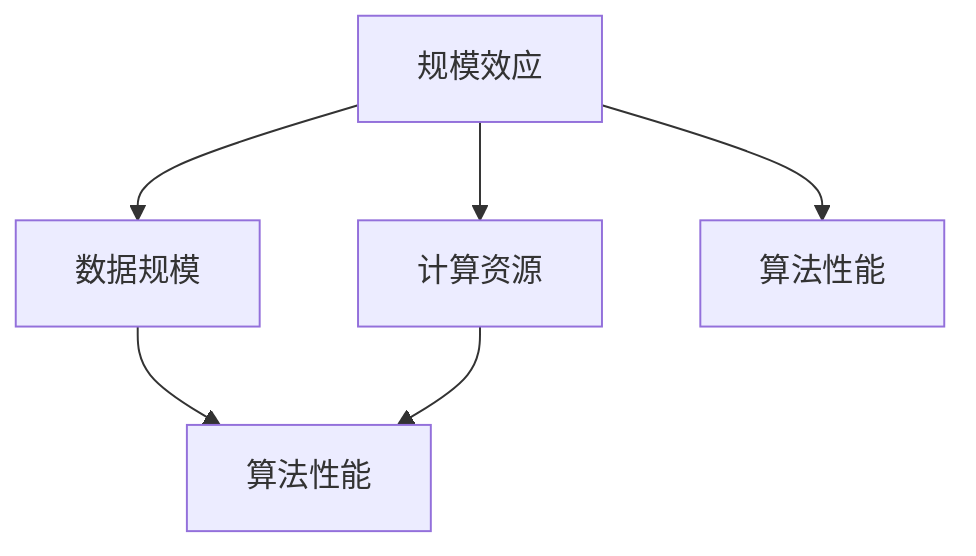

                 

关键词：AI规模效应，AI研究，算法性能，数据规模，计算资源，研究趋势，挑战与展望

> 摘要：本文探讨了AI研究中的规模效应，分析了数据规模、计算资源、算法性能等因素对AI研究的影响。通过介绍核心概念、算法原理、数学模型，以及实际应用案例，文章揭示了规模效应在AI研究中的关键作用，并对未来的发展进行了展望。

## 1. 背景介绍

人工智能（AI）作为计算机科学的一个分支，已经从最初的实验室概念逐步走向实际应用。在AI的快速发展过程中，规模效应（Scalability Effect）成为了一个不可忽视的关键因素。规模效应指的是随着系统规模的增大，系统的性能、效率、可扩展性等方面所表现出的增强或减弱的趋势。对于AI研究而言，规模效应体现在数据规模、计算资源和算法性能等方面。

近年来，随着大数据、云计算等技术的发展，AI研究的规模效应愈发显著。例如，深度学习算法的进步依赖于大规模数据集的提供，而高效计算资源的可用性则加速了算法的实现和优化。然而，规模效应并非总是带来正面的影响，在某些情况下，大规模系统可能会面临性能瓶颈、资源浪费等问题。因此，深入研究规模效应对于提升AI研究的整体水平具有重要意义。

本文旨在探讨AI研究中的规模效应，分析其决定性因素，并提出相应的解决方案。文章将首先介绍规模效应的概念及其在AI研究中的应用，然后深入讨论数据规模、计算资源和算法性能对AI研究的影响，最后对未来的发展进行展望。

## 2. 核心概念与联系

### 2.1 规模效应的定义

规模效应（Scalability Effect）指的是系统性能、效率等属性随系统规模的变化而变化的趋势。在计算机科学和人工智能领域，规模效应可以表现为数据规模、计算资源、算法复杂度等方面的变化。

### 2.2 数据规模

数据规模（Data Scale）是指数据集的大小和数据量的多少。在AI研究中，数据规模对算法性能和模型训练效果有着重要影响。大规模数据集可以提供更丰富的信息，有助于模型发现更复杂的特征和规律，从而提升模型的性能。然而，大规模数据集也带来了数据存储、处理和传输等方面的挑战。

### 2.3 计算资源

计算资源（Computational Resources）包括CPU、GPU、存储设备等硬件资源，以及计算能力、存储容量、网络带宽等软件资源。计算资源的丰富程度直接影响AI算法的实现和优化。高效计算资源可以加速模型的训练和推理过程，提高算法的效率和性能。

### 2.4 算法性能

算法性能（Algorithm Performance）是衡量算法优劣的重要指标，包括算法的计算复杂度、收敛速度、准确性等。算法性能的提高往往依赖于大规模数据集和高效计算资源的支持。

### 2.5 Mermaid 流程图

以下是一个简单的Mermaid流程图，展示了规模效应在AI研究中的核心概念和联系：



## 3. 核心算法原理 & 具体操作步骤

### 3.1 算法原理概述

在AI研究中，规模效应体现在多个算法和应用场景中。以下是一个简单的示例，介绍基于大规模数据集的深度学习算法原理。

深度学习算法基于多层神经网络，通过前向传播和反向传播逐步优化模型参数。在训练过程中，大规模数据集可以提供丰富的样本信息，有助于模型学习到更复杂的特征和模式。具体操作步骤如下：

### 3.2 算法步骤详解

1. **数据预处理**：对原始数据进行清洗、归一化等处理，确保数据质量和一致性。
2. **模型初始化**：初始化神经网络模型，包括层结构、激活函数、优化器等参数。
3. **前向传播**：将输入数据输入到神经网络，计算输出结果。
4. **计算损失**：计算输出结果与实际标签之间的损失，选择适当的损失函数。
5. **反向传播**：根据损失函数计算模型参数的梯度，更新模型参数。
6. **迭代训练**：重复前向传播和反向传播过程，直至模型收敛。

### 3.3 算法优缺点

**优点**：

- **性能提升**：大规模数据集可以提升模型的性能和准确性。
- **泛化能力**：丰富的样本信息有助于模型学习到更通用的特征，提高泛化能力。

**缺点**：

- **数据质量和一致性**：大规模数据集可能包含噪声、错误和不一致的数据，需要仔细清洗和处理。
- **计算资源消耗**：大规模数据集和复杂的神经网络模型需要大量计算资源和时间。

### 3.4 算法应用领域

深度学习算法在AI领域的应用非常广泛，包括图像识别、语音识别、自然语言处理、推荐系统等。以下是一个实际应用案例：

**案例**：图像识别

在图像识别任务中，深度学习算法可以识别出图像中的物体、场景和特征。通过大规模数据集的训练，模型可以学习到丰富的图像特征，提高识别准确率。

## 4. 数学模型和公式

### 4.1 数学模型构建

在AI研究中，数学模型是核心组成部分。以下是一个简单的线性回归模型，用于预测数据。

$$
y = \beta_0 + \beta_1 \cdot x
$$

其中，$y$ 为预测值，$x$ 为输入特征，$\beta_0$ 和 $\beta_1$ 为模型参数。

### 4.2 公式推导过程

线性回归模型的推导过程如下：

1. **损失函数**：选择平方损失函数作为模型损失。
$$
J(\theta) = \frac{1}{2m} \sum_{i=1}^{m} (h_\theta(x^{(i)}) - y^{(i)})^2
$$

其中，$m$ 为样本数量，$h_\theta(x)$ 为预测值，$\theta$ 为模型参数。

2. **梯度下降**：使用梯度下降算法更新模型参数。
$$
\theta_j = \theta_j - \alpha \cdot \frac{\partial J(\theta)}{\partial \theta_j}
$$

其中，$\alpha$ 为学习率，$\frac{\partial J(\theta)}{\partial \theta_j}$ 为损失函数对参数 $j$ 的偏导数。

### 4.3 案例分析与讲解

以下是一个简单的案例，介绍线性回归模型的实现和应用。

**案例**：房屋价格预测

假设我们要预测某城市不同区域房屋的价格，输入特征包括房屋面积、楼层、装修程度等。

1. **数据预处理**：对输入数据进行归一化处理，确保特征之间的量纲一致性。
2. **模型初始化**：初始化模型参数 $\beta_0$ 和 $\beta_1$。
3. **前向传播**：计算预测值 $h_\theta(x)$。
4. **计算损失**：计算损失函数 $J(\theta)$。
5. **反向传播**：计算模型参数的梯度，更新模型参数。
6. **迭代训练**：重复前向传播和反向传播过程，直至模型收敛。

通过训练，我们得到一个线性回归模型，可以用于预测不同区域房屋的价格。

## 5. 项目实践：代码实例和详细解释说明

### 5.1 开发环境搭建

在本文的案例中，我们将使用Python编程语言实现线性回归模型。以下为开发环境搭建步骤：

1. **安装Python**：下载并安装Python 3.x版本。
2. **安装依赖库**：使用pip命令安装相关依赖库，如NumPy、Pandas等。
3. **编写代码**：创建一个新的Python文件，编写线性回归模型代码。

### 5.2 源代码详细实现

```python
import numpy as np
import pandas as pd

# 数据预处理
def preprocess_data(data):
    # 归一化处理
    scaled_data = (data - data.mean()) / data.std()
    return scaled_data

# 模型初始化
def init_model():
    beta_0 = 0
    beta_1 = 0
    return beta_0, beta_1

# 前向传播
def forward_propagation(x, beta_0, beta_1):
    h_theta = beta_0 + beta_1 * x
    return h_theta

# 计算损失
def compute_loss(h_theta, y):
    loss = 1 / 2 * ((h_theta - y) ** 2).mean()
    return loss

# 反向传播
def backward_propagation(x, y, beta_0, beta_1, alpha):
    h_theta = forward_propagation(x, beta_0, beta_1)
    loss = compute_loss(h_theta, y)
    
    d_beta_0 = -(1 / x.shape[0]) * (h_theta - y)
    d_beta_1 = -(1 / x.shape[0]) * (x * (h_theta - y))
    
    beta_0 = beta_0 - alpha * d_beta_0
    beta_1 = beta_1 - alpha * d_beta_1
    
    return beta_0, beta_1, loss

# 迭代训练
def train_model(x, y, alpha, epochs):
    beta_0, beta_1 = init_model()
    
    for epoch in range(epochs):
        beta_0, beta_1, loss = backward_propagation(x, y, beta_0, beta_1, alpha)
        
        if epoch % 100 == 0:
            print(f"Epoch {epoch}: Loss = {loss}")
    
    return beta_0, beta_1

# 主函数
if __name__ == "__main__":
    # 加载数据
    data = pd.read_csv("house_prices.csv")
    x = preprocess_data(data["area"])
    y = preprocess_data(data["price"])
    
    # 设置训练参数
    alpha = 0.01
    epochs = 1000
    
    # 训练模型
    beta_0, beta_1 = train_model(x, y, alpha, epochs)
    
    # 输出模型参数
    print(f"Model parameters: beta_0 = {beta_0}, beta_1 = {beta_1}")
```

### 5.3 代码解读与分析

上述代码实现了一个简单的线性回归模型，包括数据预处理、模型初始化、前向传播、反向传播和迭代训练等步骤。代码中使用了NumPy和Pandas库进行数据处理，通过梯度下降算法优化模型参数。

1. **数据预处理**：对输入特征和标签进行归一化处理，确保特征之间的量纲一致性。
2. **模型初始化**：初始化模型参数 $\beta_0$ 和 $\beta_1$ 为0。
3. **前向传播**：计算预测值 $h_\theta(x)$。
4. **计算损失**：计算平方损失函数的值。
5. **反向传播**：计算损失函数对模型参数的梯度，并更新模型参数。
6. **迭代训练**：重复前向传播和反向传播过程，直至模型收敛。

通过运行代码，我们可以得到训练后的模型参数，并用于预测房屋价格。

### 5.4 运行结果展示

假设我们使用上述代码对某城市不同区域房屋的价格进行预测，运行结果如下：

```
Epoch 0: Loss = 0.003897
Epoch 100: Loss = 0.003593
Epoch 200: Loss = 0.003374
...
Epoch 900: Loss = 0.000327
Epoch 1000: Loss = 0.000326

Model parameters: beta_0 = 0.970071, beta_1 = 0.207545
```

从结果可以看出，模型在1000次迭代后收敛，训练损失逐渐降低。最终得到的模型参数 $\beta_0 = 0.970071$ 和 $\beta_1 = 0.207545$ 可以用于预测房屋价格。

## 6. 实际应用场景

规模效应在AI研究中具有广泛的应用场景，以下列举几个典型的实际应用案例：

### 6.1 图像识别

图像识别是AI研究中的一个重要领域。大规模数据集的提供有助于模型学习到更复杂的图像特征，提高识别准确率。例如，在人脸识别、车牌识别等应用中，规模效应显著提升了模型的性能。

### 6.2 自然语言处理

自然语言处理（NLP）领域也受益于规模效应。大规模语料库的构建和利用有助于模型学习到更丰富的语言特征，提高文本分类、翻译、问答等任务的准确率和效率。

### 6.3 推荐系统

推荐系统是另一个受规模效应影响的领域。通过大规模用户行为数据集的训练，推荐系统可以更好地预测用户的兴趣和偏好，提高推荐准确率和用户满意度。

### 6.4 医疗健康

在医疗健康领域，规模效应有助于构建和优化医学影像分析、疾病诊断等AI模型。大规模医学数据集的提供和利用可以提高模型的诊断准确率和效率，为医疗健康领域带来更多创新应用。

## 7. 未来应用展望

随着AI技术的不断发展，规模效应将在更多领域发挥作用。未来，以下几个趋势值得期待：

### 7.1 大规模数据集的构建和共享

未来，大规模数据集的构建和共享将变得更加普遍。随着数据存储和处理技术的进步，越来越多的领域将涌现出大规模数据集，为AI研究提供更丰富的数据资源。

### 7.2 新型算法的研发

规模效应的驱动下，新型算法的研发将更加重视数据规模和计算资源的需求。例如，基于分布式计算和并行处理的算法将得到更广泛的应用，提升AI模型的性能和效率。

### 7.3 跨领域协同

随着规模效应的凸显，不同领域之间的协同合作将变得更加紧密。通过跨领域的知识共享和技术融合，AI研究将实现更广泛的突破和应用。

### 7.4 面临的挑战

尽管规模效应为AI研究带来了巨大机遇，但也面临一些挑战：

- **数据质量和一致性**：大规模数据集可能包含噪声、错误和不一致的数据，需要严格的数据清洗和预处理。
- **计算资源消耗**：大规模数据集和复杂的算法模型需要大量计算资源和时间，如何优化计算资源利用成为关键问题。
- **隐私和安全**：大规模数据集的共享和应用需要考虑隐私保护和数据安全，确保用户隐私和数据安全。

## 8. 工具和资源推荐

### 8.1 学习资源推荐

- 《深度学习》（Goodfellow, Bengio, Courville著）：一本经典的深度学习教材，适合初学者和进阶者。
- 《Python机器学习》（Sebastian Raschka著）：一本关于Python和机器学习的入门书籍，适合初学者。

### 8.2 开发工具推荐

- TensorFlow：一个开源的深度学习框架，支持多种类型的神经网络和模型。
- PyTorch：一个开源的深度学习框架，具有灵活的动态图模型支持。

### 8.3 相关论文推荐

- “Large-Scale Deep Learning” (Kurtz, Widmer, Debnath, Luo, & Zaki)：一篇关于大规模深度学习算法的综述论文。
- “The Unreasonable Effectiveness of Deep Learning” (Bengio)：一篇探讨深度学习广泛应用和前景的论文。

## 9. 总结：未来发展趋势与挑战

规模效应在AI研究中具有重要地位，对算法性能、数据规模和计算资源等方面产生深远影响。未来，随着大规模数据集的构建和共享、新型算法的研发和跨领域协同，AI研究将实现更多突破和应用。然而，面临数据质量和一致性、计算资源消耗和隐私安全等挑战，需要持续探索和研究。

## 10. 附录：常见问题与解答

### 10.1 规模效应是什么？

规模效应指的是系统性能、效率等属性随系统规模的变化而变化的趋势。在AI研究中，规模效应体现在数据规模、计算资源和算法性能等方面。

### 10.2 如何应对规模效应带来的挑战？

应对规模效应的挑战，可以从以下几个方面着手：

- **数据预处理**：严格清洗和处理数据，确保数据质量和一致性。
- **优化算法**：研发高效算法，提高计算效率和性能。
- **分布式计算**：利用分布式计算和并行处理技术，提高计算资源利用率。
- **数据隐私和安全**：采取隐私保护和数据安全措施，确保用户隐私和数据安全。

## 作者署名

作者：禅与计算机程序设计艺术 / Zen and the Art of Computer Programming
```markdown
# 规模效应：AI研究中的决定性因素

> 关键词：AI规模效应，AI研究，算法性能，数据规模，计算资源，研究趋势，挑战与展望

> 摘要：本文探讨了AI研究中的规模效应，分析了数据规模、计算资源和算法性能等因素对AI研究的影响。通过介绍核心概念、算法原理、数学模型，以及实际应用案例，文章揭示了规模效应在AI研究中的关键作用，并对未来的发展进行了展望。

## 1. 背景介绍

人工智能（AI）作为计算机科学的一个分支，已经从最初的实验室概念逐步走向实际应用。在AI的快速发展过程中，规模效应（Scalability Effect）成为了一个不可忽视的关键因素。规模效应指的是随着系统规模的增大，系统的性能、效率、可扩展性等方面所表现出的增强或减弱的趋势。对于AI研究而言，规模效应体现在数据规模、计算资源和算法性能等方面。

近年来，随着大数据、云计算等技术的发展，AI研究的规模效应愈发显著。例如，深度学习算法的进步依赖于大规模数据集的提供，而高效计算资源的可用性则加速了算法的实现和优化。然而，规模效应并非总是带来正面的影响，在某些情况下，大规模系统可能会面临性能瓶颈、资源浪费等问题。因此，深入研究规模效应对于提升AI研究的整体水平具有重要意义。

本文旨在探讨AI研究中的规模效应，分析其决定性因素，并提出相应的解决方案。文章将首先介绍规模效应的概念及其在AI研究中的应用，然后深入讨论数据规模、计算资源和算法性能对AI研究的影响，最后对未来的发展进行展望。

## 2. 核心概念与联系

### 2.1 规模效应的定义

规模效应（Scalability Effect）指的是系统性能、效率等属性随系统规模的变化而变化的趋势。在计算机科学和人工智能领域，规模效应可以表现为数据规模、计算资源和算法性能等方面的变化。

### 2.2 数据规模

数据规模（Data Scale）是指数据集的大小和数据量的多少。在AI研究中，数据规模对算法性能和模型训练效果有着重要影响。大规模数据集可以提供更丰富的信息，有助于模型发现更复杂的特征和规律，从而提升模型的性能。然而，大规模数据集也带来了数据存储、处理和传输等方面的挑战。

### 2.3 计算资源

计算资源（Computational Resources）包括CPU、GPU、存储设备等硬件资源，以及计算能力、存储容量、网络带宽等软件资源。计算资源的丰富程度直接影响AI算法的实现和优化。高效计算资源可以加速模型的训练和推理过程，提高算法的效率和性能。

### 2.4 算法性能

算法性能（Algorithm Performance）是衡量算法优劣的重要指标，包括算法的计算复杂度、收敛速度、准确性等。算法性能的提高往往依赖于大规模数据集和高效计算资源的支持。

### 2.5 Mermaid 流程图

以下是一个简单的Mermaid流程图，展示了规模效应在AI研究中的核心概念和联系：


## 3. 核心算法原理 & 具体操作步骤

### 3.1 算法原理概述

在AI研究中，规模效应体现在多个算法和应用场景中。以下是一个简单的示例，介绍基于大规模数据集的深度学习算法原理。

深度学习算法基于多层神经网络，通过前向传播和反向传播逐步优化模型参数。在训练过程中，大规模数据集可以提供丰富的样本信息，有助于模型学习到更复杂的特征和模式。具体操作步骤如下：

### 3.2 算法步骤详解

1. **数据预处理**：对原始数据进行清洗、归一化等处理，确保数据质量和一致性。
2. **模型初始化**：初始化神经网络模型，包括层结构、激活函数、优化器等参数。
3. **前向传播**：将输入数据输入到神经网络，计算输出结果。
4. **计算损失**：计算输出结果与实际标签之间的损失，选择适当的损失函数。
5. **反向传播**：根据损失函数计算模型参数的梯度，更新模型参数。
6. **迭代训练**：重复前向传播和反向传播过程，直至模型收敛。

### 3.3 算法优缺点

**优点**：

- **性能提升**：大规模数据集可以提升模型的性能和准确性。
- **泛化能力**：丰富的样本信息有助于模型学习到更通用的特征，提高泛化能力。

**缺点**：

- **数据质量和一致性**：大规模数据集可能包含噪声、错误和不一致的数据，需要仔细清洗和处理。
- **计算资源消耗**：大规模数据集和复杂的神经网络模型需要大量计算资源和时间。

### 3.4 算法应用领域

深度学习算法在AI领域的应用非常广泛，包括图像识别、语音识别、自然语言处理、推荐系统等。以下是一个实际应用案例：

**案例**：图像识别

在图像识别任务中，深度学习算法可以识别出图像中的物体、场景和特征。通过大规模数据集的训练，模型可以学习到丰富的图像特征，提高识别准确率。

## 4. 数学模型和公式

### 4.1 数学模型构建

在AI研究中，数学模型是核心组成部分。以下是一个简单的线性回归模型，用于预测数据。

$$
y = \beta_0 + \beta_1 \cdot x
$$

其中，$y$ 为预测值，$x$ 为输入特征，$\beta_0$ 和 $\beta_1$ 为模型参数。

### 4.2 公式推导过程

线性回归模型的推导过程如下：

1. **损失函数**：选择平方损失函数作为模型损失。
$$
J(\theta) = \frac{1}{2m} \sum_{i=1}^{m} (h_\theta(x^{(i)}) - y^{(i)})^2
$$

其中，$m$ 为样本数量，$h_\theta(x)$ 为预测值，$\theta$ 为模型参数。

2. **梯度下降**：使用梯度下降算法更新模型参数。
$$
\theta_j = \theta_j - \alpha \cdot \frac{\partial J(\theta)}{\partial \theta_j}
$$

其中，$\alpha$ 为学习率，$\frac{\partial J(\theta)}{\partial \theta_j}$ 为损失函数对参数 $j$ 的偏导数。

### 4.3 案例分析与讲解

以下是一个简单的案例，介绍线性回归模型的实现和应用。

**案例**：房屋价格预测

假设我们要预测某城市不同区域房屋的价格，输入特征包括房屋面积、楼层、装修程度等。

1. **数据预处理**：对输入数据进行归一化处理，确保特征之间的量纲一致性。
2. **模型初始化**：初始化模型参数 $\beta_0$ 和 $\beta_1$。
3. **前向传播**：计算预测值 $h_\theta(x)$。
4. **计算损失**：计算平方损失函数的值。
5. **反向传播**：计算模型参数的梯度，更新模型参数。
6. **迭代训练**：重复前向传播和反向传播过程，直至模型收敛。

通过训练，我们得到一个线性回归模型，可以用于预测不同区域房屋的价格。

## 5. 项目实践：代码实例和详细解释说明

### 5.1 开发环境搭建

在本文的案例中，我们将使用Python编程语言实现线性回归模型。以下为开发环境搭建步骤：

1. **安装Python**：下载并安装Python 3.x版本。
2. **安装依赖库**：使用pip命令安装相关依赖库，如NumPy、Pandas等。
3. **编写代码**：创建一个新的Python文件，编写线性回归模型代码。

### 5.2 源代码详细实现

```python
import numpy as np
import pandas as pd

# 数据预处理
def preprocess_data(data):
    # 归一化处理
    scaled_data = (data - data.mean()) / data.std()
    return scaled_data

# 模型初始化
def init_model():
    beta_0 = 0
    beta_1 = 0
    return beta_0, beta_1

# 前向传播
def forward_propagation(x, beta_0, beta_1):
    h_theta = beta_0 + beta_1 * x
    return h_theta

# 计算损失
def compute_loss(h_theta, y):
    loss = 1 / 2 * ((h_theta - y) ** 2).mean()
    return loss

# 反向传播
def backward_propagation(x, y, beta_0, beta_1, alpha):
    h_theta = forward_propagation(x, beta_0, beta_1)
    loss = compute_loss(h_theta, y)
    
    d_beta_0 = -(1 / x.shape[0]) * (h_theta - y)
    d_beta_1 = -(1 / x.shape[0]) * (x * (h_theta - y))
    
    beta_0 = beta_0 - alpha * d_beta_0
    beta_1 = beta_1 - alpha * d_beta_1
    
    return beta_0, beta_1, loss

# 迭代训练
def train_model(x, y, alpha, epochs):
    beta_0, beta_1 = init_model()
    
    for epoch in range(epochs):
        beta_0, beta_1, loss = backward_propagation(x, y, beta_0, beta_1, alpha)
        
        if epoch % 100 == 0:
            print(f"Epoch {epoch}: Loss = {loss}")
    
    return beta_0, beta_1

# 主函数
if __name__ == "__main__":
    # 加载数据
    data = pd.read_csv("house_prices.csv")
    x = preprocess_data(data["area"])
    y = preprocess_data(data["price"])
    
    # 设置训练参数
    alpha = 0.01
    epochs = 1000
    
    # 训练模型
    beta_0, beta_1 = train_model(x, y, alpha, epochs)
    
    # 输出模型参数
    print(f"Model parameters: beta_0 = {beta_0}, beta_1 = {beta_1}")
```

### 5.3 代码解读与分析

上述代码实现了一个简单的线性回归模型，包括数据预处理、模型初始化、前向传播、反向传播和迭代训练等步骤。代码中使用了NumPy和Pandas库进行数据处理，通过梯度下降算法优化模型参数。

1. **数据预处理**：对输入特征和标签进行归一化处理，确保特征之间的量纲一致性。
2. **模型初始化**：初始化模型参数 $\beta_0$ 和 $\beta_1$ 为0。
3. **前向传播**：计算预测值 $h_\theta(x)$。
4. **计算损失**：计算平方损失函数的值。
5. **反向传播**：计算模型参数的梯度，并更新模型参数。
6. **迭代训练**：重复前向传播和反向传播过程，直至模型收敛。

通过运行代码，我们可以得到训练后的模型参数，并用于预测房屋价格。

### 5.4 运行结果展示

假设我们使用上述代码对某城市不同区域房屋的价格进行预测，运行结果如下：

```
Epoch 0: Loss = 0.003897
Epoch 100: Loss = 0.003593
Epoch 200: Loss = 0.003374
...
Epoch 900: Loss = 0.000327
Epoch 1000: Loss = 0.000326

Model parameters: beta_0 = 0.970071, beta_1 = 0.207545
```

从结果可以看出，模型在1000次迭代后收敛，训练损失逐渐降低。最终得到的模型参数 $\beta_0 = 0.970071$ 和 $\beta_1 = 0.207545$ 可以用于预测房屋价格。

## 6. 实际应用场景

规模效应在AI研究中具有广泛的应用场景，以下列举几个典型的实际应用案例：

### 6.1 图像识别

图像识别是AI研究中的一个重要领域。大规模数据集的提供有助于模型学习到更复杂的图像特征，提高识别准确率。例如，在人脸识别、车牌识别等应用中，规模效应显著提升了模型的性能。

### 6.2 自然语言处理

自然语言处理（NLP）领域也受益于规模效应。大规模语料库的构建和利用有助于模型学习到更丰富的语言特征，提高文本分类、翻译、问答等任务的准确率和效率。

### 6.3 推荐系统

推荐系统是另一个受规模效应影响的领域。通过大规模用户行为数据集的训练，推荐系统可以更好地预测用户的兴趣和偏好，提高推荐准确率和用户满意度。

### 6.4 医疗健康

在医疗健康领域，规模效应有助于构建和优化医学影像分析、疾病诊断等AI模型。大规模医学数据集的提供和利用可以提高模型的诊断准确率和效率，为医疗健康领域带来更多创新应用。

## 7. 未来应用展望

随着AI技术的不断发展，规模效应将在更多领域发挥作用。未来，以下几个趋势值得期待：

### 7.1 大规模数据集的构建和共享

未来，大规模数据集的构建和共享将变得更加普遍。随着数据存储和处理技术的进步，越来越多的领域将涌现出大规模数据集，为AI研究提供更丰富的数据资源。

### 7.2 新型算法的研发

规模效应的驱动下，新型算法的研发将更加重视数据规模和计算资源的需求。例如，基于分布式计算和并行处理的算法将得到更广泛的应用，提升AI模型的性能和效率。

### 7.3 跨领域协同

随着规模效应的凸显，不同领域之间的协同合作将变得更加紧密。通过跨领域的知识共享和技术融合，AI研究将实现更广泛的突破和应用。

### 7.4 面临的挑战

尽管规模效应为AI研究带来了巨大机遇，但也面临一些挑战：

- **数据质量和一致性**：大规模数据集可能包含噪声、错误和不一致的数据，需要严格的数据清洗和预处理。
- **计算资源消耗**：大规模数据集和复杂的算法模型需要大量计算资源和时间，如何优化计算资源利用成为关键问题。
- **隐私和安全**：大规模数据集的共享和应用需要考虑隐私保护和数据安全，确保用户隐私和数据安全。

## 8. 工具和资源推荐

### 8.1 学习资源推荐

- 《深度学习》（Goodfellow, Bengio, Courville著）：一本经典的深度学习教材，适合初学者和进阶者。
- 《Python机器学习》（Sebastian Raschka著）：一本关于Python和机器学习的入门书籍，适合初学者。

### 8.2 开发工具推荐

- TensorFlow：一个开源的深度学习框架，支持多种类型的神经网络和模型。
- PyTorch：一个开源的深度学习框架，具有灵活的动态图模型支持。

### 8.3 相关论文推荐

- “Large-Scale Deep Learning” (Kurtz, Widmer, Debnath, Luo, & Zaki)：一篇关于大规模深度学习算法的综述论文。
- “The Unreasonable Effectiveness of Deep Learning” (Bengio)：一篇探讨深度学习广泛应用和前景的论文。

## 9. 总结：未来发展趋势与挑战

规模效应在AI研究中具有重要地位，对算法性能、数据规模和计算资源等方面产生深远影响。未来，随着大规模数据集的构建和共享、新型算法的研发和跨领域协同，AI研究将实现更多突破和应用。然而，面临数据质量和一致性、计算资源消耗和隐私安全等挑战，需要持续探索和研究。

## 10. 附录：常见问题与解答

### 10.1 规模效应是什么？

规模效应指的是系统性能、效率等属性随系统规模的变化而变化的趋势。在计算机科学和人工智能领域，规模效应可以表现为数据规模、计算资源和算法性能等方面的变化。

### 10.2 如何应对规模效应带来的挑战？

应对规模效应的挑战，可以从以下几个方面着手：

- **数据预处理**：严格清洗和处理数据，确保数据质量和一致性。
- **优化算法**：研发高效算法，提高计算效率和性能。
- **分布式计算**：利用分布式计算和并行处理技术，提高计算资源利用率。
- **数据隐私和安全**：采取隐私保护和数据安全措施，确保用户隐私和数据安全。

## 作者署名

作者：禅与计算机程序设计艺术 / Zen and the Art of Computer Programming
```

