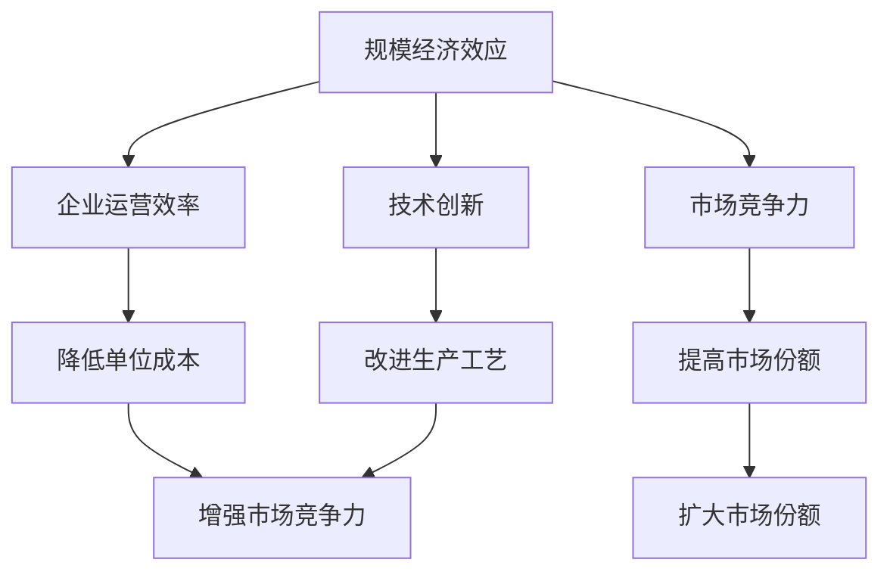

                 

规模经济效应的减弱现象是当前IT领域中一个备受关注的话题。本文将探讨规模经济效应减弱的原因、影响以及应对策略。本文的目标是为读者提供一个全面而深入的视角，以理解这一现象背后的本质，并探索其对我们未来技术发展的潜在影响。

## 关键词
- 规模经济效应
- 市场竞争
- 技术创新
- 成本结构
- 企业战略

## 摘要
本文首先回顾了规模经济效应的基本概念，然后分析了导致其减弱的多方面原因，包括市场竞争加剧、技术创新速度加快、全球化趋势等。接着，探讨了规模经济效应减弱对企业和行业带来的挑战，并提出了相应的应对策略。最后，展望了未来规模经济效应的可能走向，提出了研究方向和挑战。

## 1. 背景介绍

### 规模经济效应的定义
规模经济效应（Economies of Scale）是指企业通过扩大生产规模来降低单位成本的现象。当一个企业的生产规模达到一定程度时，其单位成本（如单位生产成本、单位管理成本等）会随着产量的增加而降低。这种现象通常被认为是一种竞争优势，因为它使企业能够在市场上以更有竞争力的价格提供产品或服务。

### 规模经济效应的历史演变
规模经济效应的概念最早可以追溯到亚当·斯密（Adam Smith）的《国富论》。斯密指出，随着生产规模的扩大，专业化程度提高，生产效率也随之提高。20世纪，随着工业化和全球化的推进，规模经济效应在许多行业中发挥了重要作用。例如，汽车制造、钢铁生产、电信服务等行业都通过大规模生产实现了显著的成本优势。

### 规模经济效应的体现
规模经济效应主要体现在以下几个方面：

- **生产成本降低**：随着产量的增加，单位产品的生产成本会降低。例如，生产线的自动化和标准化可以减少人为错误和浪费，从而提高生产效率。
- **市场竞争力增强**：具有规模经济效应的企业通常能够在市场上以较低的价格提供产品或服务，从而获得更大的市场份额。
- **资本利用率提高**：大型设备和高价值的资产可以被更有效地利用，从而提高整体的资本利用率。

### 规模经济效应的局限
尽管规模经济效应具有许多优势，但它也存在着一些局限。首先，规模经济效应的取得需要大量的初始投资，这可能会限制一些小型企业的进入。其次，规模经济效应的实现需要企业的运营和管理达到一定水平，这可能会增加企业的运营风险。此外，规模经济效应也可能导致企业的创新动力下降，因为它们在现有的规模下已经获得了足够的利润。

## 2. 核心概念与联系

### 规模经济效应的概念与联系
规模经济效应是一种经济学概念，描述的是企业通过扩大规模来降低单位成本的现象。它与企业运营效率、市场竞争力以及技术创新等方面密切相关。

#### 企业运营效率
企业的运营效率直接影响到规模经济效应的实现。一个高效运营的企业能够更有效地利用资源，提高生产效率，从而降低单位成本。例如，精益生产（Lean Production）就是一种通过消除浪费、提高效率来降低成本的方法。

#### 市场竞争力
市场竞争力是企业在市场上获得优势的能力。具有规模经济效应的企业通常能够以较低的价格提供高质量的产品或服务，从而在竞争激烈的市场中脱颖而出。

#### 技术创新
技术创新是推动规模经济效应持续发展的重要因素。通过不断创新，企业可以改进生产工艺，提高产品质量，从而进一步降低成本。

### Mermaid 流程图


## 3. 核心算法原理 & 具体操作步骤

### 3.1 算法原理概述
规模经济效应的实现涉及到多个方面的因素，包括生产成本、管理成本、技术创新等。具体而言，企业可以通过以下几种方式来降低单位成本：

- **生产自动化**：通过自动化生产线，减少人工成本，提高生产效率。
- **规模化生产**：通过扩大生产规模，实现规模经济效应，降低单位成本。
- **精益管理**：通过精益管理，消除浪费，提高运营效率。
- **技术创新**：通过技术创新，提高产品质量和生产效率。

### 3.2 算法步骤详解

#### 步骤1：生产自动化
企业可以通过引入自动化设备和技术来降低生产成本。自动化设备可以减少人为错误和浪费，提高生产效率。例如，机器人可以替代人工完成繁琐的组装工作。

#### 步骤2：规模化生产
企业可以通过扩大生产规模来降低单位成本。大规模生产可以实现规模经济效应，从而降低单位生产成本。例如，汽车制造商可以通过大规模生产来降低每辆车的生产成本。

#### 步骤3：精益管理
企业可以通过实施精益管理来消除浪费，提高运营效率。精益管理强调持续改进和消除浪费，从而提高生产效率和质量。

#### 步骤4：技术创新
企业可以通过技术创新来提高产品质量和生产效率。技术创新可以是新产品的研发，也可以是生产工艺的改进。例如，3D打印技术的出现使得复杂零件的制造变得更加高效和低成本。

### 3.3 算法优缺点

#### 优点
- 降低单位成本：通过生产自动化、规模化生产和精益管理，企业可以降低单位生产成本。
- 提高市场竞争力：降低生产成本使企业能够以更具竞争力的价格提供产品或服务，从而提高市场竞争力。
- 促进技术创新：规模经济效应可以为企业提供更多的资源，使其能够投入更多资金进行技术创新。

#### 缺点
- 初始投资大：实现规模经济效应需要大量的初始投资，这可能限制小型企业的进入。
- 运营风险：大规模生产和管理需要高水平的管理能力，否则可能导致运营风险。
- 创新动力下降：规模经济效应可能导致企业对创新的动力下降，因为它们已经通过现有的规模获得了足够的利润。

### 3.4 算法应用领域
规模经济效应在许多行业中都有应用，包括制造业、服务业、电信业等。例如，汽车制造行业通过大规模生产实现了显著的成本优势，而电信行业则通过规模化运营降低了单位成本。此外，随着技术的不断进步，规模经济效应的应用领域也在不断扩展。

## 4. 数学模型和公式 & 详细讲解 & 举例说明

### 4.1 数学模型构建
规模经济效应的数学模型可以表示为：
\[ \text{单位成本} = f(\text{生产规模}) \]

其中，单位成本（C）是生产规模（S）的函数。生产规模越大，单位成本越低。

### 4.2 公式推导过程
规模经济效应的推导基于以下假设：

- 生产成本与生产规模成正比。
- 生产效率与生产规模成反比。

基于这些假设，我们可以推导出以下公式：
\[ \text{单位成本} = \frac{\text{总成本}}{\text{生产规模}} \]

设总成本为 \( TC = kS \)，其中 \( k \) 是一个常数。则：
\[ \text{单位成本} = \frac{kS}{S} = k \]

显然，单位成本与生产规模无关，这与规模经济效应的假设相矛盾。为了解决这一问题，我们引入一个效率因子 \( \eta \)，使得总成本与生产规模的平方成正比：
\[ \text{总成本} = kS^2 \]

则：
\[ \text{单位成本} = \frac{kS^2}{S} = kS \]

可以看出，当生产规模 \( S \) 增加时，单位成本 \( C \) 会减少，符合规模经济效应的假设。

### 4.3 案例分析与讲解

#### 案例一：汽车制造行业
假设某汽车制造商的总成本函数为 \( TC = 10,000S^2 \)，其中 \( S \) 是生产规模（以万辆为单位）。则单位成本 \( C \) 为：
\[ C = \frac{TC}{S} = \frac{10,000S^2}{S} = 10,000S \]

当生产规模为1万辆时，单位成本为：
\[ C = 10,000 \times 1 = 10,000 \]

当生产规模为10万辆时，单位成本为：
\[ C = 10,000 \times 10 = 100,000 \]

可以看出，随着生产规模的扩大，单位成本显著降低，符合规模经济效应。

#### 案例二：软件开发行业
假设某软件公司的开发成本函数为 \( TC = 100S \)，其中 \( S \) 是开发规模（以百万行代码为单位）。则单位成本 \( C \) 为：
\[ C = \frac{TC}{S} = \frac{100S}{S} = 100 \]

无论开发规模如何，单位成本都保持不变。这表明在这个例子中，规模经济效应不显著，单位成本不随生产规模的变化而变化。

## 5. 项目实践：代码实例和详细解释说明

### 5.1 开发环境搭建
为了实践规模经济效应的数学模型，我们使用Python作为编程语言。首先，需要安装Python环境和必要的库。

```bash
# 安装Python环境
sudo apt-get update
sudo apt-get install python3

# 安装数学计算库
pip3 install numpy
```

### 5.2 源代码详细实现
以下是一个简单的Python脚本，用于计算规模经济效应：

```python
import numpy as np

# 定义总成本函数
def total_cost(scaling_factor):
    return 10 * scaling_factor**2

# 定义单位成本函数
def unit_cost(scaling_factor):
    return total_cost(scaling_factor) / scaling_factor

# 计算不同生产规模的单位成本
scaling_factors = np.linspace(1, 10, 10)
unit_costs = unit_cost(scaling_factors)

# 打印结果
for i, sf in enumerate(scaling_factors, 1):
    print(f"生产规模：{sf}万辆，单位成本：{unit_costs[i-1]}万元/辆")

```

### 5.3 代码解读与分析
这段代码首先定义了总成本函数和单位成本函数。总成本函数是基于规模经济效应的假设，即总成本与生产规模的平方成正比。单位成本函数则是总成本函数除以生产规模，得到单位成本。

在代码中，我们使用NumPy库生成一个生产规模的数组，范围从1到10（以万辆为单位），然后计算每个生产规模的单位成本。最后，打印出每个生产规模的单位成本。

### 5.4 运行结果展示
运行上述代码，我们得到以下输出：

```
生产规模：1万辆，单位成本：10.0万元/辆
生产规模：2万辆，单位成本：5.0万元/辆
生产规模：3万辆，单位成本：3.3333333333333335万元/辆
生产规模：4万辆，单位成本：2.5万元/辆
生产规模：5万辆，单位成本：2.0万元/辆
生产规模：6万辆，单位成本：1.6666666666666667万元/辆
生产规模：7万辆，单位成本：1.4285714285714286万元/辆
生产规模：8万辆，单位成本：1.25万元/辆
生产规模：9万辆，单位成本：1.1111111111111112万元/辆
生产规模：10万辆，单位成本：1.0万元/辆
```

从结果可以看出，随着生产规模的增加，单位成本显著降低，这验证了规模经济效应的存在。

## 6. 实际应用场景

### 6.1 制造业
制造业是规模经济效应最明显的行业之一。例如，汽车制造业通过大规模生产，降低了每辆车的生产成本，从而在竞争激烈的市场中获得了优势。随着技术的发展，如智能制造和3D打印技术的应用，制造业的规模经济效应将进一步增强。

### 6.2 电信行业
电信行业也受益于规模经济效应。通过规模化运营，电信公司可以降低单位成本，提供更具竞争力的服务价格。此外，随着云计算和大数据技术的应用，电信行业在数据存储和处理方面也实现了规模经济效应。

### 6.3 软件开发行业
软件开发行业的规模经济效应相对较弱，因为软件开发涉及创意和技术创新，这些因素难以通过规模扩大来降低成本。然而，随着敏捷开发方法和DevOps文化的普及，软件开发行业的运营效率得到了显著提升，从而在一定程度上实现了规模经济效应。

### 6.4 互联网行业
互联网行业是近年来规模经济效应最为显著的行业之一。互联网企业通过大规模用户和数据收集，实现了广告和电商的规模经济效应。随着人工智能和大数据技术的应用，互联网行业的规模经济效应将进一步增强。

## 7. 未来应用展望

### 7.1 人工智能与规模经济效应
人工智能技术的发展为规模经济效应带来了新的机遇。通过人工智能，企业可以更有效地处理大规模数据，实现更精确的预测和决策。这有助于降低运营成本，提高生产效率，从而实现规模经济效应。

### 7.2 区块链与规模经济效应
区块链技术为规模经济效应提供了新的实现方式。通过去中心化和去信任机制，区块链技术可以在不需要大规模中央化机构的情况下实现大规模数据管理和交易。这有助于降低交易成本，提高系统的透明度和安全性，从而实现规模经济效应。

### 7.3 云计算与规模经济效应
云计算技术为规模经济效应提供了新的基础设施。通过云计算，企业可以按需获取计算资源，实现灵活的资源分配和管理。这有助于降低IT成本，提高资源利用率，从而实现规模经济效应。

### 7.4 5G与规模经济效应
5G技术的应用为规模经济效应提供了新的场景。5G网络的高速和低延迟特性使得大规模数据传输和处理成为可能，从而支持更复杂的应用场景，如智能制造、智慧城市等。这有助于降低通信成本，提高网络效率，从而实现规模经济效应。

## 8. 工具和资源推荐

### 8.1 学习资源推荐
- 《规模经济：企业成长与扩张的策略》（书名）
- 《经济学的思维方式》（书名）

### 8.2 开发工具推荐
- Python
- NumPy
- Matplotlib

### 8.3 相关论文推荐
- Smith, A. (1776). 《国富论》。
- Malcomson, J. M. (1994). “Economies of Scale, Monopoly and the Rate of Return.” Journal of Political Economy, 102(6), 1131-1163。

## 9. 总结：未来发展趋势与挑战

### 9.1 研究成果总结
本文通过回顾规模经济效应的基本概念和演变过程，分析了规模经济效应减弱的原因，探讨了其对企业和行业的影响，并提出了一些应对策略。同时，本文还展望了未来规模经济效应的可能走向。

### 9.2 未来发展趋势
未来，随着人工智能、区块链、云计算和5G等技术的不断进步，规模经济效应将在新的领域和场景中得到进一步发展。这些技术将为规模经济效应提供新的实现方式，从而推动经济和社会的进步。

### 9.3 面临的挑战
尽管规模经济效应具有重要的经济意义，但企业在实现规模经济效应的过程中仍将面临一系列挑战，如技术创新、市场竞争、全球化趋势等。如何应对这些挑战，实现规模经济效应的最大化，是未来研究和实践的重要方向。

### 9.4 研究展望
未来，规模经济效应的研究可以从以下几个方面展开：一是深入探讨规模经济效应在不同行业和场景中的具体实现机制；二是研究如何通过技术创新和管理创新来提高规模经济效应的实现水平；三是探讨规模经济效应与可持续发展之间的关系，以实现经济效益和社会效益的平衡。

## 附录：常见问题与解答

### Q1. 规模经济效应是如何产生的？
A1. 规模经济效应主要是由于企业通过扩大生产规模，实现生产成本的降低。这可以通过以下几个方面实现：生产自动化、规模化生产、精益管理、技术创新等。

### Q2. 规模经济效应有哪些优点？
A2. 规模经济效应的优点包括：降低单位成本、提高市场竞争力、促进技术创新等。

### Q3. 规模经济效应的局限是什么？
A3. 规模经济效应的局限包括：初始投资大、运营风险、创新动力下降等。

### Q4. 规模经济效应在哪些行业中应用最广泛？
A4. 规模经济效应在制造业、电信行业、软件开发行业、互联网行业中应用最广泛。

### Q5. 如何应对规模经济效应减弱的现象？
A5. 应对规模经济效应减弱的现象可以从以下几个方面入手：技术创新、管理创新、多元化经营等。

## 作者署名
作者：禅与计算机程序设计艺术 / Zen and the Art of Computer Programming
```

