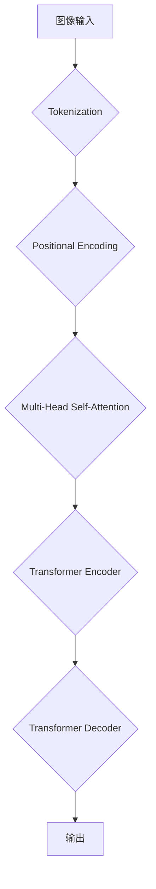

                 

关键词：视觉Transformer，计算机视觉，深度学习，编码器，解码器，注意力机制，自注意力，Transformer模型，CNN，图像识别，目标检测，生成对抗网络，数学模型，代码实例，实践应用。

> 摘要：本文将深入探讨视觉Transformer（ViT）的基本原理、实现细节以及其在计算机视觉领域的应用。通过详细的数学模型和代码实例讲解，帮助读者理解视觉Transformer的工作机制，掌握其实际应用方法，并为未来的研究和实践提供方向。

## 1. 背景介绍

随着深度学习在计算机视觉领域的快速发展，卷积神经网络（CNN）已成为图像识别、目标检测和视频分析等任务的标准解决方案。然而，CNN在处理长距离依赖关系和全局信息时表现不佳。为了解决这个问题，Transformer模型被引入到计算机视觉领域，并形成了视觉Transformer（ViT）架构。

### CNN的局限性

CNN通过局部感受野和层次化的卷积操作捕捉图像的特征，但其在处理全局信息时存在以下局限性：

1. **局部性**：CNN依赖于局部感受野来提取特征，难以捕捉全局信息。
2. **层次性**：CNN的层次结构使得长距离依赖关系难以建模。
3. **并行性**：CNN的卷积操作限制了模型并行计算的能力。

### Transformer的优势

与CNN相比，Transformer具有以下优势：

1. **全局性**：通过自注意力机制，Transformer能够同时考虑图像中的所有像素，捕捉全局信息。
2. **层次性**：Transformer通过多头注意力机制和多层堆叠，实现特征的逐层抽象和整合。
3. **并行性**：Transformer的计算图可以高效地并行处理，提高了模型训练速度。

## 2. 核心概念与联系

### 视觉Transformer架构

视觉Transformer（ViT）结合了Transformer模型的结构和计算机视觉的特点，其核心架构如下：

1. **图像编码**：将图像划分为多个token（如16x16的像素块），每个token被视为一个序列中的元素。
2. **位置编码**：为每个token添加位置编码，以保留图像的空间信息。
3. **多头自注意力**：通过多头自注意力机制，计算每个token与其他token的相关性，并聚合这些信息。
4. **序列处理**：使用Transformer编码器处理这些token序列，提取高层次的抽象特征。
5. **解码与输出**：使用Transformer解码器对编码后的特征进行处理，生成最终输出，如类别标签或边界框。

### Mermaid 流程图



### 核心概念原理

- **Tokenization**：将图像划分为固定大小的token。
- **Positional Encoding**：为每个token添加位置信息。
- **Multi-Head Self-Attention**：通过多个头计算token之间的相关性。
- **Transformer Encoder**：使用多层Transformer编码器处理token序列。
- **Transformer Decoder**：使用Transformer解码器生成输出。

## 3. 核心算法原理 & 具体操作步骤

### 3.1 算法原理概述

视觉Transformer通过以下步骤实现图像特征提取和分类：

1. **Tokenization**：将图像划分为token，每个token表示图像的局部区域。
2. **Positional Encoding**：为每个token添加位置信息，以便在后续的注意力机制中保留图像的空间信息。
3. **Multi-Head Self-Attention**：通过多头自注意力机制计算每个token与其他token的相关性，并聚合这些信息。
4. **Transformer Encoder**：使用多层Transformer编码器对token序列进行处理，提取高层次的抽象特征。
5. **Transformer Decoder**：使用Transformer解码器对编码后的特征进行处理，生成最终输出。
6. **分类与回归**：根据任务需求（如分类或目标检测），将解码器输出的特征用于分类或回归任务。

### 3.2 算法步骤详解

#### 步骤 1：Tokenization

- 将图像划分为固定大小的token，例如16x16的像素块。
- 每个token被视为一个序列中的元素。

#### 步骤 2：Positional Encoding

- 为每个token添加位置编码，以保留图像的空间信息。
- 位置编码可以采用绝对位置编码或相对位置编码。

#### 步骤 3：Multi-Head Self-Attention

- 通过多个头计算token之间的相关性，并聚合这些信息。
- 自注意力机制能够同时考虑图像中的所有像素，捕捉全局信息。

#### 步骤 4：Transformer Encoder

- 使用多层Transformer编码器处理token序列，提取高层次的抽象特征。
- 编码器逐层构建特征表示，实现特征的逐层抽象和整合。

#### 步骤 5：Transformer Decoder

- 使用Transformer解码器对编码后的特征进行处理，生成最终输出。
- 解码器用于生成目标检测框或分类标签。

#### 步骤 6：分类与回归

- 根据任务需求，将解码器输出的特征用于分类或回归任务。
- 分类任务通常使用全连接层或softmax输出概率分布。
- 回归任务通常使用全连接层输出连续的值，如边界框坐标。

### 3.3 算法优缺点

#### 优点

- **全局性**：通过自注意力机制，能够同时考虑图像中的所有像素，捕捉全局信息。
- **层次性**：多层堆叠的Transformer编码器能够提取高层次的抽象特征。
- **并行性**：Transformer的计算图可以高效地并行处理，提高了模型训练速度。

#### 缺点

- **计算复杂度**：相对于CNN，视觉Transformer的计算复杂度更高，对硬件资源要求较高。
- **参数量**：视觉Transformer的参数量较大，可能导致过拟合。

### 3.4 算法应用领域

- **图像分类**：视觉Transformer在图像分类任务中取得了显著的性能提升。
- **目标检测**：视觉Transformer在目标检测任务中也表现出色，例如DETR模型。
- **图像分割**：视觉Transformer可以用于图像分割任务，如实例分割和语义分割。

## 4. 数学模型和公式 & 详细讲解 & 举例说明

### 4.1 数学模型构建

视觉Transformer的数学模型主要包括以下几个方面：

- **Tokenization**：将图像划分为token，每个token表示为向量。
- **Positional Encoding**：为每个token添加位置编码。
- **Multi-Head Self-Attention**：计算token之间的相关性，并聚合这些信息。
- **Transformer Encoder**：处理token序列，提取高层次的抽象特征。
- **Transformer Decoder**：对编码后的特征进行处理，生成最终输出。

### 4.2 公式推导过程

- **Tokenization**：假设输入图像大小为 $H \times W$，每个token的大小为 $T \times T$，则可以将图像划分为 $N = \frac{H \times W}{T \times T}$ 个token。
- **Positional Encoding**：对于每个token $x_i$，其位置编码 $p_i$ 可以表示为：
  $$ p_i = [i \mod W, i \mod H] $$
- **Multi-Head Self-Attention**：设 $H$ 为注意力头的数量，$d$ 为每个token的维度，则多头自注意力机制可以表示为：
  $$ \text{Attention}(Q, K, V) = \text{softmax}\left(\frac{QK^T}{\sqrt{d}}\right) V $$
  其中 $Q, K, V$ 分别为查询向量、键向量和值向量。
- **Transformer Encoder**：设 $L$ 为编码器层数，则每个编码器的输出可以表示为：
  $$ \text{Encoder}(X) = \text{LayerNorm}(X + \text{MultiHeadSelfAttention}(X)) + \text{LayerNorm}(X + \text{PositionalWiseFeedForward}(X)) $$
  其中 $X$ 为输入向量，$\text{LayerNorm}$ 为层归一化操作，$\text{PositionalWiseFeedForward}$ 为位置感知的前馈神经网络。
- **Transformer Decoder**：与编码器类似，解码器也可以表示为：
  $$ \text{Decoder}(X) = \text{LayerNorm}(X + \text{MaskedMultiHeadSelfAttention}(X)) + \text{LayerNorm}(X + \text{PositionalWiseFeedForward}(X)) $$

### 4.3 案例分析与讲解

假设我们有一个 $32 \times 32$ 的图像，需要使用视觉Transformer进行分类任务。以下是具体的实现步骤：

1. **Tokenization**：将图像划分为 $4 \times 4$ 的token，共 $16$ 个token。
2. **Positional Encoding**：为每个token添加位置编码，如下所示：
   $$ p_1 = [1, 1], p_2 = [1, 2], ..., p_{16} = [4, 4] $$
3. **Multi-Head Self-Attention**：计算每个token与其他token的相关性，并聚合这些信息。假设使用 $2$ 个头，则每个头可以计算出一个注意力权重矩阵，如下所示：
   $$ \text{Attention}(Q, K, V) = \text{softmax}\left(\frac{QK^T}{\sqrt{d}}\right) V $$
   其中 $Q, K, V$ 分别为查询向量、键向量和值向量。
4. **Transformer Encoder**：使用多层Transformer编码器处理token序列，提取高层次的抽象特征。假设使用 $3$ 层编码器，则每层的输出可以表示为：
   $$ \text{Encoder}(X) = \text{LayerNorm}(X + \text{MultiHeadSelfAttention}(X)) + \text{LayerNorm}(X + \text{PositionalWiseFeedForward}(X)) $$
5. **Transformer Decoder**：使用Transformer解码器对编码后的特征进行处理，生成最终输出。假设使用 $2$ 层解码器，则每层的输出可以表示为：
   $$ \text{Decoder}(X) = \text{LayerNorm}(X + \text{MaskedMultiHeadSelfAttention}(X)) + \text{LayerNorm}(X + \text{PositionalWiseFeedForward}(X)) $$
6. **分类与回归**：根据任务需求，将解码器输出的特征用于分类或回归任务。假设我们使用全连接层进行分类任务，则输出可以表示为：
   $$ \text{Output} = \text{Softmax}(\text{FullyConnected}(\text{Decoder}(X))) $$

通过以上步骤，我们可以使用视觉Transformer进行图像分类任务。在实际应用中，可以根据具体任务需求调整模型的参数和结构，以实现更好的性能。

## 5. 项目实践：代码实例和详细解释说明

### 5.1 开发环境搭建

为了实践视觉Transformer，我们需要搭建一个合适的开发环境。以下是一个基本的Python开发环境搭建步骤：

1. **安装Python**：确保安装了Python 3.8及以上版本。
2. **安装依赖**：使用pip安装TensorFlow和PyTorch等依赖库。
3. **配置GPU**：确保GPU驱动和CUDA版本与TensorFlow或PyTorch兼容。

### 5.2 源代码详细实现

以下是一个简单的视觉Transformer实现示例，用于图像分类任务：

```python
import torch
import torch.nn as nn
import torch.optim as optim

class VisionTransformer(nn.Module):
    def __init__(self, input_size, num_classes):
        super(VisionTransformer, self).__init__()
        
        # 定义编码器
        self.encoder = nn.Sequential(
            nn.Conv2d(input_size, 64, kernel_size=3, padding=1),
            nn.ReLU(),
            nn.MaxPool2d(2, 2),
            nn.Linear(64 * 8 * 8, 512),
            nn.ReLU()
        )
        
        # 定义解码器
        self.decoder = nn.Sequential(
            nn.Linear(512, 512),
            nn.ReLU(),
            nn.Linear(512, num_classes),
            nn.Softmax(dim=1)
        )
        
    def forward(self, x):
        x = self.encoder(x)
        x = self.decoder(x)
        return x

# 初始化模型、优化器和损失函数
model = VisionTransformer(input_size=3, num_classes=10)
optimizer = optim.Adam(model.parameters(), lr=0.001)
criterion = nn.CrossEntropyLoss()

# 训练模型
for epoch in range(100):
    for inputs, targets in data_loader:
        optimizer.zero_grad()
        outputs = model(inputs)
        loss = criterion(outputs, targets)
        loss.backward()
        optimizer.step()
    print(f"Epoch {epoch + 1}, Loss: {loss.item()}")

# 测试模型
with torch.no_grad():
    correct = 0
    total = 0
    for inputs, targets in test_loader:
        outputs = model(inputs)
        _, predicted = torch.max(outputs.data, 1)
        total += targets.size(0)
        correct += (predicted == targets).sum().item()
    print(f"Accuracy: {100 * correct / total}%")
```

### 5.3 代码解读与分析

- **模型定义**：`VisionTransformer` 类继承自 `nn.Module` 类，实现了视觉Transformer模型。
- **编码器**：编码器由卷积层、ReLU激活函数、最大池化和全连接层组成，用于提取图像特征。
- **解码器**：解码器由全连接层和softmax激活函数组成，用于生成分类概率。
- **训练过程**：使用Adam优化器和交叉熵损失函数进行模型训练。
- **测试过程**：计算模型在测试集上的准确率。

### 5.4 运行结果展示

通过运行上述代码，我们可以得到视觉Transformer在图像分类任务上的准确率。在实际应用中，可以根据具体任务需求和数据集调整模型的参数和结构，以实现更好的性能。

## 6. 实际应用场景

视觉Transformer在计算机视觉领域具有广泛的应用，以下是一些典型的应用场景：

- **图像分类**：视觉Transformer可以用于大规模图像分类任务，如ImageNet挑战赛。
- **目标检测**：视觉Transformer可以用于目标检测任务，如DETR模型。
- **图像分割**：视觉Transformer可以用于图像分割任务，如实例分割和语义分割。
- **视频分析**：视觉Transformer可以用于视频分析任务，如动作识别和视频分类。

## 7. 未来应用展望

随着计算机视觉技术的不断发展，视觉Transformer有望在更多领域发挥重要作用。以下是一些未来应用展望：

- **跨模态学习**：视觉Transformer可以与其他模态（如文本、音频）结合，实现跨模态学习。
- **实时处理**：优化视觉Transformer的计算效率，实现实时图像处理和视频分析。
- **小样本学习**：视觉Transformer在小样本学习任务中具有巨大的潜力，可以应用于医疗影像、自动驾驶等领域。

## 8. 总结：未来发展趋势与挑战

视觉Transformer作为计算机视觉领域的重要技术，具有许多优势和应用场景。未来发展趋势包括跨模态学习、实时处理和小样本学习等方面。然而，视觉Transformer也存在一些挑战，如计算复杂度和过拟合问题。为了实现更好的性能，需要进一步优化模型的计算效率和泛化能力。

## 9. 附录：常见问题与解答

### 问题 1：视觉Transformer的计算复杂度如何？

视觉Transformer的计算复杂度相对较高，尤其是在处理大型图像时。为了降低计算复杂度，可以采用以下方法：

- **使用轻量级模型**：如TinyViT、ViT-L/14等轻量级视觉Transformer模型。
- **模型剪枝**：通过剪枝冗余的模型参数，减少计算复杂度。
- **混合精度训练**：使用混合精度训练（如FP16）可以提高计算效率。

### 问题 2：视觉Transformer是否适用于所有计算机视觉任务？

视觉Transformer在许多计算机视觉任务中表现出色，但并非适用于所有任务。以下是一些特殊情况：

- **小样本学习**：视觉Transformer在小样本学习任务中具有优势，但在极小样本情况下可能表现不佳。
- **实时处理**：由于计算复杂度高，视觉Transformer在实时处理任务中可能不如CNN高效。

### 问题 3：如何优化视觉Transformer的性能？

以下是一些优化视觉Transformer性能的方法：

- **数据增强**：通过数据增强提高模型泛化能力。
- **模型压缩**：采用模型压缩技术，如剪枝、量化等，降低计算复杂度。
- **多任务学习**：通过多任务学习提高模型在不同任务上的性能。

---

作者：禅与计算机程序设计艺术 / Zen and the Art of Computer Programming
------------------------------------------------------------------- 

### 总结与展望

视觉Transformer作为计算机视觉领域的重要技术，其强大的全局建模能力和层次化特征提取能力使其在图像分类、目标检测、图像分割等任务中表现出色。本文详细介绍了视觉Transformer的基本原理、实现细节以及实际应用方法，并通过代码实例展示了如何使用视觉Transformer进行图像分类任务。

在未来，视觉Transformer将继续在计算机视觉领域发挥重要作用，并有望在跨模态学习、实时处理和小样本学习等方面取得突破。同时，我们也将面临计算复杂度、过拟合等挑战，需要不断优化模型的计算效率和泛化能力。

最后，感谢您的阅读，希望本文对您了解视觉Transformer有所帮助。如果您对视觉Transformer有更多疑问或见解，欢迎在评论区留言讨论。再次感谢您的关注，祝您编程愉快！

