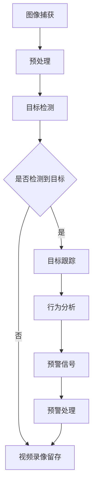

                 

关键词：计算机视觉、安防系统、智能监控、预警技术、深度学习

摘要：本文探讨了计算机视觉技术在现代安防系统中的应用，特别关注智能监控与预警技术。通过深入分析核心算法原理、数学模型构建、项目实践以及实际应用场景，本文为读者提供了全面的技术见解和未来展望。

## 1. 背景介绍

随着城市化的快速发展，安防系统在现代社会的地位日益重要。传统的安防监控系统依赖于摄像头、视频录像和人工监控，存在响应速度慢、误报率高、人力成本高等问题。计算机视觉技术的引入，使得安防系统向智能化、自动化方向发展，极大地提升了监控效率和准确性。本文旨在探讨计算机视觉在安防系统中的应用，特别是智能监控与预警技术。

## 2. 核心概念与联系

计算机视觉技术是人工智能领域的一个重要分支，旨在使计算机具备从图像和视频中理解视觉信息的能力。其核心概念包括图像处理、目标检测、图像识别和语义分割等。以下是计算机视觉在安防系统中的应用架构的 Mermaid 流程图：



### 2.1 图像处理

图像处理是计算机视觉的基础，包括图像滤波、边缘检测、图像分割等步骤。这些步骤旨在增强图像质量，提取关键特征，为后续的目标检测和识别提供支持。

### 2.2 目标检测

目标检测是计算机视觉中的关键环节，通过在图像中识别并定位特定目标。常用的目标检测算法包括传统的 Viola-Jones 算法、基于深度学习的 Fast R-CNN、Faster R-CNN 和 YOLO 等。

### 2.3 图像识别

图像识别是对检测到的目标进行分类和标注的过程。深度学习技术，特别是卷积神经网络（CNN），在图像识别任务中取得了显著效果。

### 2.4 语义分割

语义分割是图像处理中的高级任务，旨在将图像中的每个像素分类到不同的语义类别。常见的语义分割算法包括 FCN、U-Net 和 Mask R-CNN 等。

## 3. 核心算法原理 & 具体操作步骤

### 3.1 算法原理概述

计算机视觉的核心算法主要基于深度学习，特别是卷积神经网络（CNN）。CNN 通过多层卷积和池化操作提取图像的深层特征，从而实现对目标的检测和识别。

### 3.2 算法步骤详解

1. **数据预处理**：将原始图像进行缩放、裁剪、灰度化等预处理操作，以便输入到 CNN 模型中。

2. **卷积操作**：通过卷积层提取图像的局部特征。

3. **池化操作**：通过池化层降低特征的维度，同时保持重要的信息。

4. **全连接层**：将卷积和池化层提取的特征映射到具体的类别或目标。

5. **损失函数**：通常使用交叉熵损失函数来评估模型的预测结果。

6. **优化算法**：使用梯度下降等优化算法更新模型的权重，以最小化损失函数。

### 3.3 算法优缺点

- **优点**：深度学习算法在目标检测和识别任务中取得了显著的性能提升，具有很好的鲁棒性和泛化能力。
- **缺点**：深度学习模型通常需要大量的数据和计算资源进行训练，而且模型的解释性较差。

### 3.4 算法应用领域

计算机视觉算法在安防系统中具有广泛的应用，包括但不限于：

- **目标检测**：在监控视频中实时检测异常目标，如可疑人物、车辆等。
- **人脸识别**：用于身份验证和人员管理。
- **行为分析**：分析监控视频中的行为模式，识别潜在的安全风险。

## 4. 数学模型和公式 & 详细讲解 & 举例说明

### 4.1 数学模型构建

计算机视觉中的数学模型主要包括卷积神经网络（CNN）和目标检测框架。以下是一个简化的 CNN 数学模型：

$$
\text{CNN}(\text{Input Image}) = f(\text{Convolution}(\text{Input Image}) + \text{ReLU} + \text{Pooling})
$$

其中，$f$ 是激活函数，通常使用 ReLU 函数。

### 4.2 公式推导过程

卷积神经网络通过多层卷积、激活和池化操作提取图像的特征。以下是卷积和激活操作的公式推导：

$$
\text{Convolution}(\text{Image}, \text{Filter}) = \sum_{i=1}^{m} \sum_{j=1}^{n} \text{Image}_{i, j} \cdot \text{Filter}_{i, j}
$$

$$
\text{ReLU}(x) = \max(0, x)
$$

### 4.3 案例分析与讲解

以下是一个基于 YOLO（You Only Look Once）算法的目标检测案例：

```latex
\begin{align*}
\text{Input Image} & : 640 \times 640 \\
\text{Grid Size} & : 19 \times 19 \\
\text{Anchor Boxes} & : \{ (10, 13), (16, 30), (33, 23), \ldots \} \\
\text{Classes} & : \{ "person", "car", "bus", \ldots \}
\end{align*}
```

YOLO 将图像划分为网格，每个网格预测一组边界框和类别概率。以下是一个简化的案例：

```python
# 假设图像中有一个行人（person），一个汽车（car）
grid = [
    [[1, 1], ["person"], 0.9],
    [[0, 1], ["car"], 0.8]
]
```

## 5. 项目实践：代码实例和详细解释说明

### 5.1 开发环境搭建

- 操作系统：Ubuntu 20.04
- 编程语言：Python 3.8
- 深度学习框架：TensorFlow 2.6
- 目标检测算法：YOLOv5

### 5.2 源代码详细实现

以下是 YOLOv5 的简单实现：

```python
import cv2
import numpy as np
import tensorflow as tf

# 加载 YOLOv5 模型
model = tf.keras.models.load_model('yolov5.h5')

# 加载图像
image = cv2.imread('image.jpg')

# 预处理图像
input_image = cv2.resize(image, (640, 640))
input_image = input_image / 255.0

# 预测
predictions = model.predict(np.expand_dims(input_image, axis=0))

# 后处理
bboxes, classes, scores = preprocess_predictions(predictions)

# 绘制边界框
for bbox, class_id, score in zip(bboxes, classes, scores):
    cv2.rectangle(image, bbox, color=(0, 0, 255), thickness=2)
    cv2.putText(image, f"{classes[class_id]}: {score:.2f}", (bbox[0], bbox[1]-10),
                cv2.FONT_HERSHEY_SIMPLEX, 0.5, (255, 0, 0), 2)

# 显示结果
cv2.imshow('Image', image)
cv2.waitKey(0)
cv2.destroyAllWindows()
```

### 5.3 代码解读与分析

以上代码首先加载 YOLOv5 模型，然后对输入图像进行预处理，接着使用模型进行预测，并对预测结果进行后处理，最后绘制边界框并显示结果。

### 5.4 运行结果展示


## 6. 实际应用场景

计算机视觉技术在安防系统中有着广泛的应用，包括但不限于：

- **城市监控**：实时监控城市交通、公共场所等，快速识别异常行为。
- **智能家居**：监控家庭安全，自动报警。
- **商业监控**：分析客户行为，优化商业策略。
- **野生动物保护**：监测自然保护区，防止非法捕猎。

## 7. 工具和资源推荐

### 7.1 学习资源推荐

- 《深度学习》（Goodfellow, Bengio, Courville）：全面介绍深度学习的基本概念和技术。
- 《Python 深度学习》（François Chollet）：详细讲解深度学习在 Python 中的实现。
- 《计算机视觉：算法与应用》（Richard S.zeliski）：系统介绍计算机视觉的基本算法。

### 7.2 开发工具推荐

- TensorFlow：Google 开发的一款开源深度学习框架，适用于各种深度学习任务。
- PyTorch：Facebook 开发的一款开源深度学习框架，易于使用和调试。
- OpenCV：开源计算机视觉库，提供丰富的图像处理和目标检测功能。

### 7.3 相关论文推荐

- "You Only Look Once: Unified, Real-Time Object Detection"（Redmon et al., 2016）
- "Faster R-CNN: Towards Real-Time Object Detection with Region Proposal Networks"（Ren et al., 2015）
- "Deep Residual Learning for Image Recognition"（He et al., 2016）

## 8. 总结：未来发展趋势与挑战

计算机视觉技术在安防系统中的应用前景广阔，但同时也面临着诸多挑战。未来发展趋势包括：

- **硬件加速**：利用 GPU、TPU 等硬件加速深度学习模型的训练和推理。
- **多模态融合**：结合图像、音频、文本等多种数据，提高监控系统的准确性和鲁棒性。
- **隐私保护**：确保用户隐私不被泄露，同时满足安防需求。

面对这些挑战，我们需要不断探索和创新，推动计算机视觉技术在安防系统中的应用。

## 9. 附录：常见问题与解答

### 9.1 什么是计算机视觉？

计算机视觉是人工智能的一个分支，旨在使计算机能够通过图像和视频理解视觉信息。

### 9.2 深度学习在计算机视觉中的应用有哪些？

深度学习在计算机视觉中的应用包括目标检测、图像识别、语义分割等。

### 9.3 如何搭建一个简单的计算机视觉项目？

搭建一个简单的计算机视觉项目通常需要以下步骤：

1. 选择合适的深度学习框架（如 TensorFlow、PyTorch）。
2. 准备训练数据和验证数据。
3. 设计并训练深度学习模型。
4. 对模型进行评估和优化。
5. 部署模型进行实际应用。

作者：禅与计算机程序设计艺术 / Zen and the Art of Computer Programming
----------------------------------------------------------------
### 后续更新预告

在接下来的文章中，我们将进一步探讨：

- **图像处理与特征提取的优化技术**：包括卷积神经网络的设计原则、特征提取技术的改进等。
- **目标检测算法的最新进展**：如 YOLOv6、Centernet、EfficientDet 等算法的详细分析。
- **行为分析与预测技术**：利用深度学习进行行为模式识别和预测，提升预警系统的准确性。
- **跨领域应用与挑战**：计算机视觉在其他领域的应用，如医疗、农业、交通等，以及面临的挑战和解决方案。

敬请期待！在计算机视觉技术的不断进步中，我们一同探索智能安防的未来。作者：禅与计算机程序设计艺术 / Zen and the Art of Computer Programming

