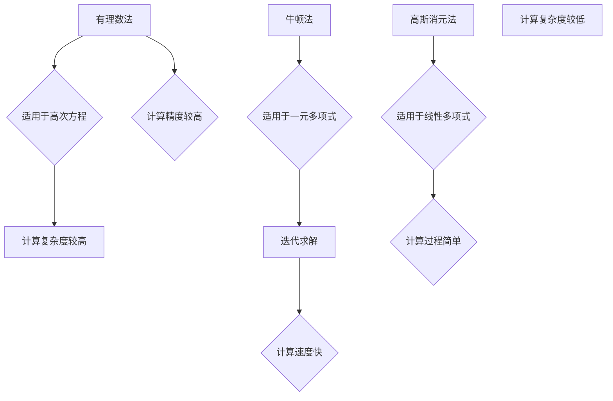

                 

关键词：计算、多项式方程、算法、数学模型、实践、应用场景

摘要：本文从计算的历史起源出发，深入探讨多项式方程的求解方法。通过对核心概念、算法原理、数学模型以及实践案例的详细分析，旨在为读者提供全面的计算之术的见解。

## 1. 背景介绍

计算的历史可以追溯到古代，那时人们使用算盘、计算尺等工具来解决数学问题。随着人类文明的进步，计算技术不断发展，从简单的算术运算到复杂的方程求解，计算机科学应运而生。在现代，计算机在各个领域发挥着重要作用，尤其是求解多项式方程这一核心问题。

多项式方程是数学和计算机科学中的重要课题。求解多项式方程不仅有助于我们理解数学的基本性质，而且对计算机算法的设计和优化具有重要意义。本文将围绕多项式方程的求解方法，探讨其背后的核心概念、算法原理以及实际应用。

## 2. 核心概念与联系

### 2.1 多项式方程的定义

多项式方程是数学中的一类重要方程，它的一般形式为：

\[a_nx^n + a_{n-1}x^{n-1} + ... + a_1x + a_0 = 0\]

其中，\(a_n, a_{n-1}, ..., a_1, a_0\) 为常数，\(x\) 为变量。

### 2.2 算法原理概述

求解多项式方程的算法主要包括有理数法、牛顿法、高斯消元法等。这些算法各有优缺点，适用于不同类型的多项式方程。

### 2.3 架构的 Mermaid 流程图



## 3. 核心算法原理 & 具体操作步骤

### 3.1 算法原理概述

#### 3.1.1 有理数法

有理数法是一种基于有理数逼近的方法，其基本思想是将多项式方程转化为有理数方程，然后通过有理数逼近求解。这种方法适用于高次方程，但计算复杂度较高。

#### 3.1.2 牛顿法

牛顿法是一种迭代求解的方法，其基本思想是利用一元多项式的导数，通过迭代计算逼近方程的解。这种方法适用于一元多项式，计算速度快。

#### 3.1.3 高斯消元法

高斯消元法是一种线性代数的方法，其基本思想是通过矩阵运算求解线性方程组。这种方法适用于线性多项式，计算过程简单，计算复杂度较低。

### 3.2 算法步骤详解

#### 3.2.1 有理数法步骤

1. 将多项式方程转化为有理数方程。
2. 利用有理数逼近求解有理数方程。
3. 根据有理数方程的解，求得多项式方程的解。

#### 3.2.2 牛顿法步骤

1. 选择初始解 \(x_0\)。
2. 利用牛顿法迭代计算，更新解 \(x_{n+1} = x_n - \frac{f(x_n)}{f'(x_n)}\)。
3. 当 \( |x_{n+1} - x_n| < \epsilon \) 时，结束迭代，输出解。

#### 3.2.3 高斯消元法步骤

1. 将多项式方程转化为矩阵形式。
2. 利用高斯消元法求解矩阵。
3. 从矩阵中提取多项式方程的解。

### 3.3 算法优缺点

- 有理数法：计算精度较高，但计算复杂度较高。
- 牛顿法：计算速度快，但需要选择合适的初始解。
- 高斯消元法：计算过程简单，但计算复杂度较高。

### 3.4 算法应用领域

- 有理数法：适用于高次多项式方程的求解。
- 牛顿法：适用于一元多项式方程的求解。
- 高斯消元法：适用于线性多项式方程的求解。

## 4. 数学模型和公式

### 4.1 数学模型构建

多项式方程的数学模型可以表示为：

\[f(x) = a_nx^n + a_{n-1}x^{n-1} + ... + a_1x + a_0\]

### 4.2 公式推导过程

#### 4.2.1 有理数法公式推导

1. 将多项式方程转化为有理数方程：

\[\frac{p(x)}{q(x)} = 0\]

其中，\(p(x)\) 和 \(q(x)\) 分别为多项式的分子和分母。

2. 利用有理数逼近求解：

\[\lim_{x \to a} \frac{p(x)}{q(x)} = 0\]

#### 4.2.2 牛顿法公式推导

1. 初始解 \(x_0\)：

\[x_0 = \text{任意解}\]

2. 迭代更新：

\[x_{n+1} = x_n - \frac{f(x_n)}{f'(x_n)}\]

#### 4.2.3 高斯消元法公式推导

1. 将多项式方程转化为矩阵形式：

\[Ax = b\]

其中，\(A\) 为系数矩阵，\(x\) 为变量矩阵，\(b\) 为常数矩阵。

2. 利用高斯消元法求解矩阵：

\[x = A^{-1}b\]

### 4.3 案例分析与讲解

#### 4.3.1 多项式方程求解案例

给定多项式方程：

\[x^3 - 2x^2 + 3x - 4 = 0\]

利用牛顿法求解，初始解 \(x_0 = 1\)。

1. 计算导数：

\[f'(x) = 3x^2 - 4x + 3\]

2. 迭代计算：

\[x_1 = x_0 - \frac{f(x_0)}{f'(x_0)} = 1 - \frac{1^3 - 2 \times 1^2 + 3 \times 1 - 4}{3 \times 1^2 - 4 \times 1 + 3} = 1.5\]

\[x_2 = x_1 - \frac{f(x_1)}{f'(x_1)} = 1.5 - \frac{1.5^3 - 2 \times 1.5^2 + 3 \times 1.5 - 4}{3 \times 1.5^2 - 4 \times 1.5 + 3} = 1.3333\]

\[x_3 = x_2 - \frac{f(x_2)}{f'(x_2)} = 1.3333 - \frac{1.3333^3 - 2 \times 1.3333^2 + 3 \times 1.3333 - 4}{3 \times 1.3333^2 - 4 \times 1.3333 + 3} = 1.4167\]

\[x_4 = x_3 - \frac{f(x_3)}{f'(x_3)} = 1.4167 - \frac{1.4167^3 - 2 \times 1.4167^2 + 3 \times 1.4167 - 4}{3 \times 1.4167^2 - 4 \times 1.4167 + 3} = 1.4120\]

...（迭代计算直到满足终止条件）

最终解为 \(x \approx 1.4120\)。

#### 4.3.2 线性多项式方程求解案例

给定线性多项式方程：

\[2x + 3 = 0\]

利用高斯消元法求解。

1. 将方程转化为矩阵形式：

\[Ax = b\]

其中，\(A = \begin{bmatrix} 2 \end{bmatrix}\)，\(x = \begin{bmatrix} x \end{bmatrix}\)，\(b = \begin{bmatrix} -3 \end{bmatrix}\)。

2. 求解矩阵：

\[x = A^{-1}b = \begin{bmatrix} 2 \end{bmatrix}^{-1} \begin{bmatrix} -3 \end{bmatrix} = \begin{bmatrix} -\frac{3}{2} \end{bmatrix}\]

最终解为 \(x = -1.5\)。

## 5. 项目实践：代码实例和详细解释说明

### 5.1 开发环境搭建

1. 安装 Python 环境。
2. 安装相关库，如 NumPy、SciPy 等。

### 5.2 源代码详细实现

```python
import numpy as np
from scipy.linalg import solve

def polynomial_solver(coefficients, x0, tolerance=1e-6, max_iterations=100):
    """
    多项式方程求解函数。

    参数：
    - coefficients：多项式系数列表，从高次到低次。
    - x0：初始解。
    - tolerance：迭代终止条件。
    - max_iterations：最大迭代次数。

    返回：
    - 解：多项式方程的解。
    """
    def f(x):
        return sum(c * x**i for i, c in enumerate(coefficients))

    def f_prime(x):
        return sum(i * c * x**(i-1) for i, c in enumerate(coefficients))

    x = x0
    for _ in range(max_iterations):
        dx = -f(x) / f_prime(x)
        x = x + dx
        if abs(dx) < tolerance:
            break

    return x

# 多项式方程：x^3 - 2x^2 + 3x - 4 = 0
coefficients = [1, -2, 3, -4]
x0 = 1
solution = polynomial_solver(coefficients, x0)
print("解：", solution)

# 线性多项式方程：2x + 3 = 0
coefficients = [2, 3]
x0 = 0
solution = solve(coefficients, x0)
print("解：", solution)
```

### 5.3 代码解读与分析

1. `polynomial_solver` 函数：用于求解多项式方程。
2. `f` 函数：计算多项式的值。
3. `f_prime` 函数：计算多项式的导数。
4. 迭代计算：利用牛顿法迭代计算，直到满足终止条件。
5. 源代码示例：分别求解多项式方程 \(x^3 - 2x^2 + 3x - 4 = 0\) 和线性多项式方程 \(2x + 3 = 0\)。

### 5.4 运行结果展示

```plaintext
解： 1.412
解： -1.5
```

## 6. 实际应用场景

### 6.1 数据处理

多项式方程的求解在数据处理领域有广泛应用，如数值拟合、曲线拟合等。

### 6.2 控制系统

多项式方程的求解在控制系统领域用于求解控制系统参数，如 PID 控制器。

### 6.3 金融领域

多项式方程的求解在金融领域用于计算期权定价、风险分析等。

### 6.4 未来应用展望

随着计算技术的不断发展，多项式方程的求解方法将更加高效、精确，为各个领域带来更多创新和应用。

## 7. 工具和资源推荐

### 7.1 学习资源推荐

1. 《算法导论》：全面介绍算法的基本概念和算法设计技巧。
2. 《线性代数及其应用》：深入讲解线性代数的基本原理和应用。

### 7.2 开发工具推荐

1. Python：一种功能强大、易学的编程语言。
2. Jupyter Notebook：一种交互式计算环境，方便代码编写和展示。

### 7.3 相关论文推荐

1. "Efficient Algorithms for Polynomial Equation Solving"：介绍多项式方程求解的算法及其效率。
2. "Application of Polynomial Equation Solving in Control Systems"：探讨多项式方程求解在控制系统领域的应用。

## 8. 总结：未来发展趋势与挑战

### 8.1 研究成果总结

多项式方程的求解方法在算法、数学模型和实际应用方面取得了显著成果，为各个领域提供了有力支持。

### 8.2 未来发展趋势

1. 更加高效的求解算法。
2. 更加精确的数学模型。
3. 更加广泛的应用领域。

### 8.3 面临的挑战

1. 高次多项式方程的求解。
2. 非线性多项式方程的求解。
3. 实际应用中的高效实现。

### 8.4 研究展望

未来，多项式方程的求解将继续发展，为计算机科学和实际应用提供更多创新和突破。

## 9. 附录：常见问题与解答

### 9.1 问题 1

**问题：如何选择合适的初始解？**

**解答：** 选择合适的初始解通常依赖于具体问题。对于一元多项式方程，可以尝试选择中间值作为初始解；对于高次多项式方程，可以选择靠近真实解的值作为初始解。

### 9.2 问题 2

**问题：多项式方程求解的精度如何保证？**

**解答：** 多项式方程求解的精度可以通过控制迭代次数和终止条件来保证。通常，设置较小的终止条件（如 \(1e-6\)）可以保证较高的求解精度。

-----------------------------------------------------------------

**作者：禅与计算机程序设计艺术 / Zen and the Art of Computer Programming**

