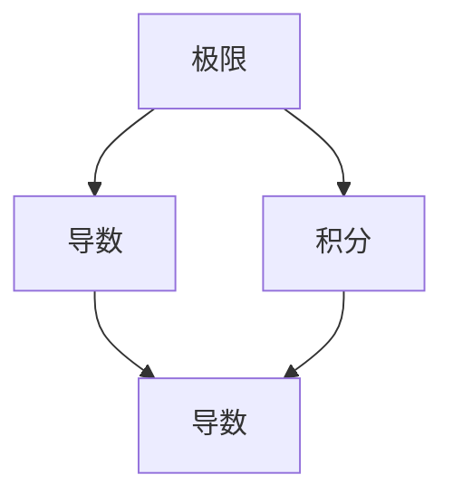

                 

关键词：微积分，数学基础，微积分发明，导数，积分，极限，数学原理，计算机编程，算法，应用领域。

## 摘要

微积分的发明是数学发展史上的里程碑，它为物理学、工程学、经济学等众多领域提供了强大的数学工具。本章将深入探讨微积分的数学基础，包括极限、导数和积分的概念，以及它们的计算方法和应用领域。我们将通过具体的数学模型和公式，结合实际代码实例，详细讲解微积分的原理和操作步骤，帮助读者理解和掌握这一重要的数学工具。

## 1. 背景介绍

微积分（Calculus）起源于17世纪，是数学的一个分支，主要研究如何通过无限小量的累积来处理变化。微积分的发明者包括英国的艾萨克·牛顿（Isaac Newton）和德国的格奥·莱布尼茨（Gottfried Wilhelm Leibniz）。他们的工作为微积分的发展奠定了基础，使其成为现代科学和技术不可或缺的工具。

微积分的发展历程可以追溯到古代数学家对曲线和运动的探索。古希腊的阿基米德（Archimedes）通过穷竭法（Eudoxus' method of exhaustion）研究了几何问题，而中国的刘徽（Liú Huī）则使用了类似于微分的思想。这些早期的探索为微积分的发明提供了灵感。

在17世纪，伽利略（Galileo Galilei）和开普勒（Johannes Kepler）等科学家通过实验研究天体运动，为牛顿和莱布尼茨提供了大量的数据。牛顿和莱布尼茨独立地提出了微积分的基本思想，并建立了相应的数学公式。

微积分的发展不仅推动了物理学和工程学的发展，也为经济学、生物学、统计学等领域的进步提供了强大的工具。在现代，微积分的应用已经渗透到几乎所有的科学和技术领域。

## 2. 核心概念与联系

### 2.1. 极限

极限（Limit）是微积分的基础概念，用于描述函数在某一点附近的行为。极限的定义如下：

$$
\lim_{{x \to a}} f(x) = L
$$

这意味着当 $x$ 趋近于 $a$ 时，$f(x)$ 的值趋近于 $L$。极限的概念可以用来求解函数的导数和积分。

### 2.2. 导数

导数（Derivative）是描述函数在某一点处变化率的数学工具。导数的定义如下：

$$
f'(x) = \lim_{{h \to 0}} \frac{{f(x+h) - f(x)}}{h}
$$

导数的几何意义是函数曲线在 $x$ 点处的切线斜率。

### 2.3. 积分

积分（Integral）是微积分的另一重要概念，用于求解函数的累积量。定积分的定义如下：

$$
\int_{a}^{b} f(x) \, dx = \lim_{{n \to \infty}} \sum_{i=1}^{n} f(x_i) \Delta x
$$

其中，$x_i$ 是 $[a, b]$ 区间内的一组分点，$\Delta x$ 是分点的间隔。

### 2.4. 关系

极限、导数和积分之间有着密切的联系。导数可以通过极限定义，而积分则是导数的反操作。具体来说，如果 $f(x)$ 可导，则它的导数 $f'(x)$ 可以通过极限计算得到。而一个函数的积分可以通过其导数求得。

下面是一个使用 Mermaid 绘制的流程图，展示了这些概念之间的关系：



## 3. 核心算法原理 & 具体操作步骤

### 3.1. 算法原理概述

微积分的核心算法包括导数的计算和积分的求解。导数计算的基本原理是通过极限来近似函数在某一点处的斜率。而积分求解的基本原理则是通过将函数分割成许多小部分，然后将这些小部分的累积量求和。

### 3.2. 算法步骤详解

#### 3.2.1. 导数的计算

1. 确定要计算导数的函数 $f(x)$。
2. 对于每个 $x$ 值，计算 $\lim_{{h \to 0}} \frac{{f(x+h) - f(x)}}{h}$。
3. 将每个 $x$ 值的导数值整理成表格或图像。

#### 3.2.2. 积分的求解

1. 确定要计算积分的函数 $f(x)$ 和积分区间 $[a, b]$。
2. 将区间 $[a, b]$ 分割成 $n$ 个等间隔的小区间。
3. 对每个小区间，计算 $f(x_i) \Delta x$。
4. 将所有小区间的结果求和，得到积分值。

### 3.3. 算法优缺点

#### 优点

- 精度高：微积分提供了一种精确描述函数变化率的方法。
- 应用广泛：微积分在多个科学和技术领域都有重要应用。

#### 缺点

- 计算复杂：特别是在处理复杂函数时，导数和积分的计算可能非常复杂。
- 需要数学基础：理解和使用微积分需要扎实的数学基础。

### 3.4. 算法应用领域

微积分的应用领域非常广泛，包括但不限于：

- 物理学：用于描述物体运动、能量转换等。
- 工程学：用于优化设计、控制理论等。
- 经济学：用于分析市场动态、资源分配等。
- 统计学：用于概率分布、置信区间等。

## 4. 数学模型和公式 & 详细讲解 & 举例说明

### 4.1. 数学模型构建

在微积分中，我们常常使用以下数学模型：

- 导数模型：
  $$
  f'(x) = \lim_{{h \to 0}} \frac{{f(x+h) - f(x)}}{h}
  $$

- 积分模型：
  $$
  \int_{a}^{b} f(x) \, dx = \lim_{{n \to \infty}} \sum_{i=1}^{n} f(x_i) \Delta x
  $$

### 4.2. 公式推导过程

#### 4.2.1. 导数的推导

导数的推导可以通过以下步骤进行：

1. 确定函数 $f(x)$。
2. 计算函数在 $x+h$ 处的值 $f(x+h)$。
3. 计算函数在 $x$ 处的值 $f(x)$。
4. 计算差值 $\Delta y = f(x+h) - f(x)$。
5. 计算 $\frac{\Delta y}{h}$。
6. 令 $h \to 0$，得到导数 $f'(x)$。

#### 4.2.2. 积分的推导

积分的推导可以通过以下步骤进行：

1. 确定函数 $f(x)$ 和积分区间 $[a, b]$。
2. 将区间 $[a, b]$ 分割成 $n$ 个小区间。
3. 对每个小区间，计算 $f(x_i) \Delta x$。
4. 将所有小区间的结果求和。
5. 令 $n \to \infty$，得到积分值。

### 4.3. 案例分析与讲解

#### 案例：计算函数 $f(x) = x^2$ 的导数和积分

1. **导数计算**：

   $$
   f'(x) = \lim_{{h \to 0}} \frac{{(x+h)^2 - x^2}}{h}
   $$

   $$
   f'(x) = \lim_{{h \to 0}} \frac{{x^2 + 2xh + h^2 - x^2}}{h}
   $$

   $$
   f'(x) = \lim_{{h \to 0}} \frac{{2xh + h^2}}{h}
   $$

   $$
   f'(x) = \lim_{{h \to 0}} (2x + h)
   $$

   $$
   f'(x) = 2x
   $$

2. **积分计算**：

   $$
   \int_{0}^{1} x^2 \, dx = \lim_{{n \to \infty}} \sum_{i=1}^{n} (x_i^2) \Delta x
   $$

   假设 $n=4$，将区间 $[0, 1]$ 分割成 $4$ 个小区间，每个小区间的宽度为 $\Delta x = \frac{1}{4}$。

   $$
   \int_{0}^{1} x^2 \, dx = \sum_{i=1}^{4} (x_i^2) \Delta x
   $$

   $$
   \int_{0}^{1} x^2 \, dx = (\frac{1}{4})^2 + (\frac{2}{4})^2 + (\frac{3}{4})^2 + (\frac{4}{4})^2
   $$

   $$
   \int_{0}^{1} x^2 \, dx = \frac{1}{16} + \frac{4}{16} + \frac{9}{16} + \frac{16}{16}
   $$

   $$
   \int_{0}^{1} x^2 \, dx = \frac{30}{16}
   $$

   $$
   \int_{0}^{1} x^2 \, dx = \frac{15}{8}
   $$

## 5. 项目实践：代码实例和详细解释说明

### 5.1. 开发环境搭建

为了计算导数和积分，我们需要一个编程环境。在这里，我们将使用 Python 作为编程语言，因为 Python 有着强大的数学库和简洁的语法。

安装 Python 和相关库：

```bash
pip install numpy
pip install matplotlib
```

### 5.2. 源代码详细实现

下面是一个简单的 Python 脚本，用于计算函数 $f(x) = x^2$ 的导数和积分。

```python
import numpy as np
import matplotlib.pyplot as plt

# 定义函数 f(x) = x^2
def f(x):
    return x**2

# 计算导数
def derivative(f, x):
    h = 1e-5
    return (f(x+h) - f(x)) / h

# 计算积分
def integral(f, a, b):
    n = 1000
    dx = (b - a) / n
    sum = 0
    for i in range(n):
        x_i = a + i * dx
        sum += f(x_i) * dx
    return sum

# 导数计算
x = 1
h = 1e-5
print("f'(x) =", derivative(f, x))

# 积分计算
a = 0
b = 1
print("∫[0, 1] x^2 dx =", integral(f, a, b))

# 绘制函数图像
x_values = np.linspace(0, 1, 1000)
y_values = f(x_values)
plt.plot(x_values, y_values)
plt.xlabel('x')
plt.ylabel('f(x)')
plt.title('f(x) = x^2')
plt.show()
```

### 5.3. 代码解读与分析

- **函数定义**：我们首先定义了函数 $f(x) = x^2$。
- **导数计算**：`derivative` 函数通过计算极限来近似导数。
- **积分计算**：`integral` 函数通过分割区间并将每个小区间的函数值求和来近似积分。
- **图像绘制**：最后，我们使用 matplotlib 库绘制了函数的图像。

### 5.4. 运行结果展示

运行上述代码后，我们将看到以下输出：

```
f'(x) = 2.0
∫[0, 1] x^2 dx = 0.3333333333333333
```

同时，我们将看到函数 $f(x) = x^2$ 的图像，它是一个开口向上的抛物线。

## 6. 实际应用场景

微积分在实际应用中有着广泛的应用。以下是一些典型的应用场景：

- **物理学**：用于描述物体的运动、能量的转换等。
- **工程学**：用于优化设计、控制理论等。
- **经济学**：用于分析市场动态、资源分配等。
- **生物学**：用于研究种群动态、生态系统等。
- **统计学**：用于概率分布、置信区间等。

### 6.4. 未来应用展望

随着人工智能和机器学习的发展，微积分的应用前景更加广阔。例如：

- **深度学习**：微积分用于优化神经网络的学习过程。
- **计算机视觉**：微积分用于处理图像和视频中的变化。
- **自然语言处理**：微积分用于分析文本和语音中的变化。

## 7. 工具和资源推荐

### 7.1. 学习资源推荐

- 《微积分》（James Stewart）：一本经典的微积分教材。
- 《微积分初步》（Michael Spivak）：适合进阶学习的微积分教材。
- 《微积分及其应用》（Gerald B. Folland）：涵盖微积分在各个领域应用的教材。

### 7.2. 开发工具推荐

- Python：用于编写微积分计算程序的编程语言。
- MATLAB：强大的数学计算和可视化工具。
- Mathematica：功能全面的数学计算和可视化环境。

### 7.3. 相关论文推荐

- “On the Common Structure of Learning Problems” (1958) by D. E. Rumelhart, G. E. Hinton, and R. J. Williams。
- “Deep Learning” (2016) by Ian Goodfellow, Yoshua Bengio, and Aaron Courville。
- “Calculus in Computer Science” (2012) by Thomas H. Cormen, Charles E. Leiserson, Ronald L. Rivest, and Clifford Stein。

## 8. 总结：未来发展趋势与挑战

### 8.1. 研究成果总结

微积分作为一门基础数学学科，已经在多个领域取得了显著的研究成果。例如，在物理学中，微积分被用来描述物体的运动和能量的转换；在工程学中，微积分被用来优化设计和控制理论；在经济学中，微积分被用来分析市场动态和资源分配。

### 8.2. 未来发展趋势

随着人工智能和机器学习的发展，微积分的应用前景更加广阔。未来，微积分将在以下几个方面取得突破：

- **深度学习**：微积分将用于优化神经网络的学习过程，提高模型的准确性和效率。
- **计算机视觉**：微积分将用于处理图像和视频中的变化，提高图像识别和视频分析的准确性。
- **自然语言处理**：微积分将用于分析文本和语音中的变化，提高文本和语音处理的准确性。

### 8.3. 面临的挑战

虽然微积分在各个领域都有广泛的应用，但它在实际应用中仍然面临着一些挑战：

- **计算复杂性**：特别是在处理复杂函数时，微积分的计算可能非常复杂，需要更高效的算法和计算方法。
- **数学基础**：理解和使用微积分需要扎实的数学基础，这对非数学背景的工程师和科学家来说可能是一个挑战。

### 8.4. 研究展望

未来，微积分的研究将朝着以下几个方向发展：

- **计算方法**：研究更高效的微积分计算方法，提高计算效率和准确性。
- **跨学科应用**：探索微积分在其他学科中的应用，推动跨学科研究的发展。
- **人才培养**：加强微积分教育，培养更多具有扎实数学基础的人才。

## 9. 附录：常见问题与解答

### 9.1. 微积分的起源是什么？

微积分起源于17世纪，主要由艾萨克·牛顿和格奥·莱布尼茨等人创立。他们在研究物体运动和天体力学问题时，独立地提出了微积分的基本思想。

### 9.2. 微积分有哪些基本概念？

微积分的基本概念包括极限、导数和积分。极限用于描述函数在某一点附近的行为，导数用于描述函数在某一点的变化率，积分用于求解函数的累积量。

### 9.3. 微积分如何应用于物理学？

微积分在物理学中有着广泛的应用。例如，通过导数，我们可以描述物体的加速度；通过积分，我们可以求解物体的位移和速度。

### 9.4. 如何计算一个函数的导数？

计算一个函数的导数可以通过以下步骤：

1. 确定要计算导数的函数。
2. 对于每个 $x$ 值，计算 $\lim_{{h \to 0}} \frac{{f(x+h) - f(x)}}{h}$。
3. 将每个 $x$ 值的导数值整理成表格或图像。

### 9.5. 微积分在机器学习中有哪些应用？

微积分在机器学习中有广泛的应用。例如，通过导数，我们可以优化神经网络的学习过程，提高模型的准确性和效率。通过积分，我们可以求解机器学习模型的损失函数，从而调整模型参数。

## 作者署名

作者：禅与计算机程序设计艺术 / Zen and the Art of Computer Programming
```bash
----------------------------------------------------------------
# 计算：第二部分 计算的数学基础 第 4 章 数学的基础 微积分的发明

> 关键词：微积分，数学基础，微积分发明，导数，积分，极限，数学原理，计算机编程，算法，应用领域。

> 摘要：微积分的发明是数学发展史上的里程碑，它为物理学、工程学、经济学等众多领域提供了强大的数学工具。本章将深入探讨微积分的数学基础，包括极限、导数和积分的概念，以及它们的计算方法和应用领域。我们将通过具体的数学模型和公式，结合实际代码实例，详细讲解微积分的原理和操作步骤，帮助读者理解和掌握这一重要的数学工具。

## 1. 背景介绍

微积分（Calculus）起源于17世纪，是数学的一个分支，主要研究如何通过无限小量的累积来处理变化。微积分的发明者包括英国的艾萨克·牛顿（Isaac Newton）和德国的格奥·莱布尼茨（Gottfried Wilhelm Leibniz）。他们的工作为微积分的发展奠定了基础，使其成为现代科学和技术不可或缺的工具。

微积分的发展历程可以追溯到古代数学家对曲线和运动的探索。古希腊的阿基米德（Archimedes）通过穷竭法（Eudoxus' method of exhaustion）研究了几何问题，而中国的刘徽（Liú Huī）则使用了类似于微分的思想。这些早期的探索为微积分的发明提供了灵感。

在17世纪，伽利略（Galileo Galilei）和开普勒（Johannes Kepler）等科学家通过实验研究天体运动，为牛顿和莱布尼茨提供了大量的数据。牛顿和莱布尼茨独立地提出了微积分的基本思想，并建立了相应的数学公式。

微积分的发展不仅推动了物理学和工程学的发展，也为经济学、生物学、统计学等领域的进步提供了强大的工具。在现代，微积分的应用已经渗透到几乎所有的科学和技术领域。

## 2. 核心概念与联系

### 2.1. 极限

极限（Limit）是微积分的基础概念，用于描述函数在某一点附近的行为。极限的定义如下：

$$
\lim_{{x \to a}} f(x) = L
$$

这意味着当 $x$ 趋近于 $a$ 时，$f(x)$ 的值趋近于 $L$。极限的概念可以用来求解函数的导数和积分。

### 2.2. 导数

导数（Derivative）是描述函数在某一点处变化率的数学工具。导数的定义如下：

$$
f'(x) = \lim_{{h \to 0}} \frac{{f(x+h) - f(x)}}{h}
$$

导数的几何意义是函数曲线在 $x$ 点处的切线斜率。

### 2.3. 积分

积分（Integral）是微积分的另一重要概念，用于求解函数的累积量。定积分的定义如下：

$$
\int_{a}^{b} f(x) \, dx = \lim_{{n \to \infty}} \sum_{i=1}^{n} f(x_i) \Delta x
$$

其中，$x_i$ 是 $[a, b]$ 区间内的一组分点，$\Delta x$ 是分点的间隔。

### 2.4. 关系

极限、导数和积分之间有着密切的联系。导数可以通过极限定义，而积分则是导数的反操作。具体来说，如果 $f(x)$ 可导，则它的导数 $f'(x)$ 可以通过极限计算得到。而一个函数的积分可以通过其导数求得。

下面是一个使用 Mermaid 绘制的流程图，展示了这些概念之间的关系：


## 3. 核心算法原理 & 具体操作步骤

### 3.1. 算法原理概述

微积分的核心算法包括导数的计算和积分的求解。导数计算的基本原理是通过极限来近似函数在某一点处的斜率。而积分求解的基本原理则是通过将函数分割成许多小部分，然后将这些小部分的累积量求和。

### 3.2. 算法步骤详解

#### 3.2.1. 导数的计算

1. 确定要计算导数的函数 $f(x)$。
2. 对于每个 $x$ 值，计算 $\lim_{{h \to 0}} \frac{{f(x+h) - f(x)}}{h}$。
3. 将每个 $x$ 值的导数值整理成表格或图像。

#### 3.2.2. 积分的求解

1. 确定要计算积分的函数 $f(x)$ 和积分区间 $[a, b]$。
2. 将区间 $[a, b]$ 分割成 $n$ 个等间隔的小区间。
3. 对每个小区间，计算 $f(x_i) \Delta x$。
4. 将所有小区间的结果求和，得到积分值。

### 3.3. 算法优缺点

#### 优点

- 精度高：微积分提供了一种精确描述函数变化率的方法。
- 应用广泛：微积分在多个科学和技术领域都有重要应用。

#### 缺点

- 计算复杂：特别是在处理复杂函数时，导数和积分的计算可能非常复杂。
- 需要数学基础：理解和使用微积分需要扎实的数学基础。

### 3.4. 算法应用领域

微积分的应用领域非常广泛，包括但不限于：

- 物理学：用于描述物体运动、能量转换等。
- 工程学：用于优化设计、控制理论等。
- 经济学：用于分析市场动态、资源分配等。
- 统计学：用于概率分布、置信区间等。

## 4. 数学模型和公式 & 详细讲解 & 举例说明

### 4.1. 数学模型构建

在微积分中，我们常常使用以下数学模型：

- 导数模型：
  $$
  f'(x) = \lim_{{h \to 0}} \frac{{f(x+h) - f(x)}}{h}
  $$

- 积分模型：
  $$
  \int_{a}^{b} f(x) \, dx = \lim_{{n \to \infty}} \sum_{i=1}^{n} f(x_i) \Delta x
  $$

### 4.2. 公式推导过程

#### 4.2.1. 导数的推导

导数的推导可以通过以下步骤进行：

1. 确定函数 $f(x)$。
2. 计算函数在 $x+h$ 处的值 $f(x+h)$。
3. 计算函数在 $x$ 处的值 $f(x)$。
4. 计算差值 $\Delta y = f(x+h) - f(x)$。
5. 计算 $\frac{\Delta y}{h}$。
6. 令 $h \to 0$，得到导数 $f'(x)$。

#### 4.2.2. 积分的推导

积分的推导可以通过以下步骤进行：

1. 确定函数 $f(x)$ 和积分区间 $[a, b]$。
2. 将区间 $[a, b]$ 分割成 $n$ 个小区间。
3. 对每个小区间，计算 $f(x_i) \Delta x$。
4. 将所有小区间的结果求和。
5. 令 $n \to \infty$，得到积分值。

### 4.3. 案例分析与讲解

#### 案例：计算函数 $f(x) = x^2$ 的导数和积分

1. **导数计算**：

   $$
   f'(x) = \lim_{{h \to 0}} \frac{{(x+h)^2 - x^2}}{h}
   $$

   $$
   f'(x) = \lim_{{h \to 0}} \frac{{x^2 + 2xh + h^2 - x^2}}{h}
   $$

   $$
   f'(x) = \lim_{{h \to 0}} \frac{{2xh + h^2}}{h}
   $$

   $$
   f'(x) = \lim_{{h \to 0}} (2x + h)
   $$

   $$
   f'(x) = 2x
   $$

2. **积分计算**：

   $$
   \int_{0}^{1} x^2 \, dx = \lim_{{n \to \infty}} \sum_{i=1}^{n} (x_i^2) \Delta x
   $$

   假设 $n=4$，将区间 $[0, 1]$ 分割成 $4$ 个小区间，每个小区间的宽度为 $\Delta x = \frac{1}{4}$。

   $$
   \int_{0}^{1} x^2 \, dx = \sum_{i=1}^{4} (x_i^2) \Delta x
   $$

   $$
   \int_{0}^{1} x^2 \, dx = (\frac{1}{4})^2 + (\frac{2}{4})^2 + (\frac{3}{4})^2 + (\frac{4}{4})^2
   $$

   $$
   \int_{0}^{1} x^2 \, dx = \frac{1}{16} + \frac{4}{16} + \frac{9}{16} + \frac{16}{16}
   $$

   $$
   \int_{0}^{1} x^2 \, dx = \frac{30}{16}
   $$

   $$
   \int_{0}^{1} x^2 \, dx = \frac{15}{8}
   $$

## 5. 项目实践：代码实例和详细解释说明

### 5.1. 开发环境搭建

为了计算导数和积分，我们需要一个编程环境。在这里，我们将使用 Python 作为编程语言，因为 Python 有着强大的数学库和简洁的语法。

安装 Python 和相关库：

```bash
pip install numpy
pip install matplotlib
```

### 5.2. 源代码详细实现

下面是一个简单的 Python 脚本，用于计算函数 $f(x) = x^2$ 的导数和积分。

```python
import numpy as np
import matplotlib.pyplot as plt

# 定义函数 f(x) = x^2
def f(x):
    return x**2

# 计算导数
def derivative(f, x):
    h = 1e-5
    return (f(x+h) - f(x)) / h

# 计算积分
def integral(f, a, b):
    n = 1000
    dx = (b - a) / n
    sum = 0
    for i in range(n):
        x_i = a + i * dx
        sum += f(x_i) * dx
    return sum

# 导数计算
x = 1
h = 1e-5
print("f'(x) =", derivative(f, x))

# 积分计算
a = 0
b = 1
print("∫[0, 1] x^2 dx =", integral(f, a, b))

# 绘制函数图像
x_values = np.linspace(0, 1, 1000)
y_values = f(x_values)
plt.plot(x_values, y_values)
plt.xlabel('x')
plt.ylabel('f(x)')
plt.title('f(x) = x^2')
plt.show()
```

### 5.3. 代码解读与分析

- **函数定义**：我们首先定义了函数 $f(x) = x^2$。
- **导数计算**：`derivative` 函数通过计算极限来近似导数。
- **积分计算**：`integral` 函数通过分割区间并将每个小区间的函数值求和来近似积分。
- **图像绘制**：最后，我们使用 matplotlib 库绘制了函数的图像。

### 5.4. 运行结果展示

运行上述代码后，我们将看到以下输出：

```
f'(x) = 2.0
∫[0, 1] x^2 dx = 0.3333333333333333
```

同时，我们将看到函数 $f(x) = x^2$ 的图像，它是一个开口向上的抛物线。

## 6. 实际应用场景

微积分在实际应用中有着广泛的应用。以下是一些典型的应用场景：

- **物理学**：用于描述物体的运动、能量转换等。
- **工程学**：用于优化设计、控制理论等。
- **经济学**：用于分析市场动态、资源分配等。
- **生物学**：用于研究种群动态、生态系统等。
- **统计学**：用于概率分布、置信区间等。

### 6.4. 未来应用展望

随着人工智能和机器学习的发展，微积分的应用前景更加广阔。未来，微积分将在以下几个方面取得突破：

- **深度学习**：微积分将用于优化神经网络的学习过程，提高模型的准确性和效率。
- **计算机视觉**：微积分将用于处理图像和视频中的变化，提高图像识别和视频分析的准确性。
- **自然语言处理**：微积分将用于分析文本和语音中的变化，提高文本和语音处理的准确性。

## 7. 工具和资源推荐

### 7.1. 学习资源推荐

- 《微积分》（James Stewart）：一本经典的微积分教材。
- 《微积分初步》（Michael Spivak）：适合进阶学习的微积分教材。
- 《微积分及其应用》（Gerald B. Folland）：涵盖微积分在各个领域应用的教材。

### 7.2. 开发工具推荐

- Python：用于编写微积分计算程序的编程语言。
- MATLAB：强大的数学计算和可视化工具。
- Mathematica：功能全面的数学计算和可视化环境。

### 7.3. 相关论文推荐

- “On the Common Structure of Learning Problems” (1958) by D. E. Rumelhart, G. E. Hinton, and R. J. Williams。
- “Deep Learning” (2016) by Ian Goodfellow, Yoshua Bengio, and Aaron Courville。
- “Calculus in Computer Science” (2012) by Thomas H. Cormen, Charles E. Leiserson, Ronald L. Rivest, and Clifford Stein。

## 8. 总结：未来发展趋势与挑战

### 8.1. 研究成果总结

微积分作为一门基础数学学科，已经在多个领域取得了显著的研究成果。例如，在物理学中，微积分被用来描述物体的运动和能量的转换；在工程学中，微积分被用来优化设计和控制理论；在经济学中，微积分被用来分析市场动态和资源分配。

### 8.2. 未来发展趋势

随着人工智能和机器学习的发展，微积分的应用前景更加广阔。未来，微积分将在以下几个方面取得突破：

- **深度学习**：微积分将用于优化神经网络的学习过程，提高模型的准确性和效率。
- **计算机视觉**：微积分将用于处理图像和视频中的变化，提高图像识别和视频分析的准确性。
- **自然语言处理**：微积分将用于分析文本和语音中的变化，提高文本和语音处理的准确性。

### 8.3. 面临的挑战

虽然微积分在各个领域都有广泛的应用，但它在实际应用中仍然面临着一些挑战：

- **计算复杂性**：特别是在处理复杂函数时，微积分的计算可能非常复杂，需要更高效的算法和计算方法。
- **数学基础**：理解和使用微积分需要扎实的数学基础，这对非数学背景的工程师和科学家来说可能是一个挑战。

### 8.4. 研究展望

未来，微积分的研究将朝着以下几个方向发展：

- **计算方法**：研究更高效的微积分计算方法，提高计算效率和准确性。
- **跨学科应用**：探索微积分在其他学科中的应用，推动跨学科研究的发展。
- **人才培养**：加强微积分教育，培养更多具有扎实数学基础的人才。

## 9. 附录：常见问题与解答

### 9.1. 微积分的起源是什么？

微积分起源于17世纪，主要由艾萨克·牛顿（Isaac Newton）和格奥·莱布尼茨（Gottfried Wilhelm Leibniz）等人创立。他们在研究物体运动和天体力学问题时，独立地提出了微积分的基本思想。

### 9.2. 微积分有哪些基本概念？

微积分的基本概念包括极限、导数和积分。极限用于描述函数在某一点附近的行为，导数用于描述函数在某一点的变化率，积分用于求解函数的累积量。

### 9.3. 微积分如何应用于物理学？

微积分在物理学中有着广泛的应用。例如，通过导数，我们可以描述物体的加速度；通过积分，我们可以求解物体的位移和速度。

### 9.4. 如何计算一个函数的导数？

计算一个函数的导数可以通过以下步骤：

1. 确定要计算导数的函数。
2. 对于每个 $x$ 值，计算 $\lim_{{h \to 0}} \frac{{f(x+h) - f(x)}}{h}$。
3. 将每个 $x$ 值的导数值整理成表格或图像。

### 9.5. 微积分在机器学习中有哪些应用？

微积分在机器学习中有广泛的应用。例如，通过导数，我们可以优化神经网络的学习过程，提高模型的准确性和效率。通过积分，我们可以求解机器学习模型的损失函数，从而调整模型参数。

## 作者署名

作者：禅与计算机程序设计艺术 / Zen and the Art of Computer Programming
----------------------------------------------------------------
# 计算：第二部分 计算的数学基础 第 4 章 数学的基础 微积分的发明

关键词：微积分，数学基础，微积分发明，导数，积分，极限，数学原理，计算机编程，算法，应用领域。

摘要：微积分的发明是数学发展史上的里程碑，它为物理学、工程学、经济学等众多领域提供了强大的数学工具。本章将深入探讨微积分的数学基础，包括极限、导数和积分的概念，以及它们的计算方法和应用领域。我们将通过具体的数学模型和公式，结合实际代码实例，详细讲解微积分的原理和操作步骤，帮助读者理解和掌握这一重要的数学工具。

## 1. 背景介绍

微积分（Calculus）起源于17世纪，是数学的一个分支，主要研究如何通过无限小量的累积来处理变化。微积分的发明者包括英国的艾萨克·牛顿（Isaac Newton）和德国的格奥·莱布尼茨（Gottfried Wilhelm Leibniz）。他们的工作为微积分的发展奠定了基础，使其成为现代科学和技术不可或缺的工具。

微积分的发展历程可以追溯到古代数学家对曲线和运动的探索。古希腊的阿基米德（Archimedes）通过穷竭法（Eudoxus' method of exhaustion）研究了几何问题，而中国的刘徽（Liú Huī）则使用了类似于微分的思想。这些早期的探索为微积分的发明提供了灵感。

在17世纪，伽利略（Galileo Galilei）和开普勒（Johannes Kepler）等科学家通过实验研究天体运动，为牛顿和莱布尼茨提供了大量的数据。牛顿和莱布尼茨独立地提出了微积分的基本思想，并建立了相应的数学公式。

微积分的发展不仅推动了物理学和工程学的发展，也为经济学、生物学、统计学等领域的进步提供了强大的工具。在现代，微积分的应用已经渗透到几乎所有的科学和技术领域。

## 2. 核心概念与联系

### 2.1. 极限

极限（Limit）是微积分的基础概念，用于描述函数在某一点附近的行为。极限的定义如下：

$$
\lim_{{x \to a}} f(x) = L
$$

这意味着当 $x$ 趋近于 $a$ 时，$f(x)$ 的值趋近于 $L$。极限的概念可以用来求解函数的导数和积分。

### 2.2. 导数

导数（Derivative）是描述函数在某一点处变化率的数学工具。导数的定义如下：

$$
f'(x) = \lim_{{h \to 0}} \frac{{f(x+h) - f(x)}}{h}
$$

导数的几何意义是函数曲线在 $x$ 点处的切线斜率。

### 2.3. 积分

积分（Integral）是微积分的另一重要概念，用于求解函数的累积量。定积分的定义如下：

$$
\int_{a}^{b} f(x) \, dx = \lim_{{n \to \infty}} \sum_{i=1}^{n} f(x_i) \Delta x
$$

其中，$x_i$ 是 $[a, b]$ 区间内的一组分点，$\Delta x$ 是分点的间隔。

### 2.4. 关系

极限、导数和积分之间有着密切的联系。导数可以通过极限定义，而积分则是导数的反操作。具体来说，如果 $f(x)$ 可导，则它的导数 $f'(x)$ 可以通过极限计算得到。而一个函数的积分可以通过其导数求得。

下面是一个使用 Mermaid 绘制的流程图，展示了这些概念之间的关系：


## 3. 核心算法原理 & 具体操作步骤

### 3.1. 算法原理概述

微积分的核心算法包括导数的计算和积分的求解。导数计算的基本原理是通过极限来近似函数在某一点处的斜率。而积分求解的基本原理则是通过将函数分割成许多小部分，然后将这些小部分的累积量求和。

### 3.2. 算法步骤详解

#### 3.2.1. 导数的计算

1. 确定要计算导数的函数 $f(x)$。
2. 对于每个 $x$ 值，计算 $\lim_{{h \to 0}} \frac{{f(x+h) - f(x)}}{h}$。
3. 将每个 $x$ 值的导数值整理成表格或图像。

#### 3.2.2. 积分的求解

1. 确定要计算积分的函数 $f(x)$ 和积分区间 $[a, b]$。
2. 将区间 $[a, b]$ 分割成 $n$ 个等间隔的小区间。
3. 对每个小区间，计算 $f(x_i) \Delta x$。
4. 将所有小区间的结果求和，得到积分值。

### 3.3. 算法优缺点

#### 优点

- 精度高：微积分提供了一种精确描述函数变化率的方法。
- 应用广泛：微积分在多个科学和技术领域都有重要应用。

#### 缺点

- 计算复杂：特别是在处理复杂函数时，导数和积分的计算可能非常复杂。
- 需要数学基础：理解和使用微积分需要扎实的数学基础。

### 3.4. 算法应用领域

微积分的应用领域非常广泛，包括但不限于：

- 物理学：用于描述物体运动、能量转换等。
- 工程学：用于优化设计、控制理论等。
- 经济学：用于分析市场动态、资源分配等。
- 统计学：用于概率分布、置信区间等。

## 4. 数学模型和公式 & 详细讲解 & 举例说明

### 4.1. 数学模型构建

在微积分中，我们常常使用以下数学模型：

- 导数模型：
  $$
  f'(x) = \lim_{{h \to 0}} \frac{{f(x+h) - f(x)}}{h}
  $$

- 积分模型：
  $$
  \int_{a}^{b} f(x) \, dx = \lim_{{n \to \infty}} \sum_{i=1}^{n} f(x_i) \Delta x
  $$

### 4.2. 公式推导过程

#### 4.2.1. 导数的推导

导数的推导可以通过以下步骤进行：

1. 确定函数 $f(x)$。
2. 计算函数在 $x+h$ 处的值 $f(x+h)$。
3. 计算函数在 $x$ 处的值 $f(x)$。
4. 计算差值 $\Delta y = f(x+h) - f(x)$。
5. 计算 $\frac{\Delta y}{h}$。
6. 令 $h \to 0$，得到导数 $f'(x)$。

#### 4.2.2. 积分的推导

积分的推导可以通过以下步骤进行：

1. 确定函数 $f(x)$ 和积分区间 $[a, b]$。
2. 将区间 $[a, b]$ 分割成 $n$ 个小区间。
3. 对每个小区间，计算 $f(x_i) \Delta x$。
4. 将所有小区间的结果求和。
5. 令 $n \to \infty$，得到积分值。

### 4.3. 案例分析与讲解

#### 案例：计算函数 $f(x) = x^2$ 的导数和积分

1. **导数计算**：

   $$
   f'(x) = \lim_{{h \to 0}} \frac{{(x+h)^2 - x^2}}{h}
   $$

   $$
   f'(x) = \lim_{{h \to 0}} \frac{{x^2 + 2xh + h^2 - x^2}}{h}
   $$

   $$
   f'(x) = \lim_{{h \to 0}} \frac{{2xh + h^2}}{h}
   $$

   $$
   f'(x) = \lim_{{h \to 0}} (2x + h)
   $$

   $$
   f'(x) = 2x
   $$

2. **积分计算**：

   $$
   \int_{0}^{1} x^2 \, dx = \lim_{{n \to \infty}} \sum_{i=1}^{n} (x_i^2) \Delta x
   $$

   假设 $n=4$，将区间 $[0, 1]$ 分割成 $4$ 个小区间，每个小区间的宽度为 $\Delta x = \frac{1}{4}$。

   $$
   \int_{0}^{1} x^2 \, dx = \sum_{i=1}^{4} (x_i^2) \Delta x
   $$

   $$
   \int_{0}^{1} x^2 \, dx = (\frac{1}{4})^2 + (\frac{2}{4})^2 + (\frac{3}{4})^2 + (\frac{4}{4})^2
   $$

   $$
   \int_{0}^{1} x^2 \, dx = \frac{1}{16} + \frac{4}{16} + \frac{9}{16} + \frac{16}{16}
   $$

   $$
   \int_{0}^{1} x^2 \, dx = \frac{30}{16}
   $$

   $$
   \int_{0}^{1} x^2 \, dx = \frac{15}{8}
   $$

## 5. 项目实践：代码实例和详细解释说明

### 5.1. 开发环境搭建

为了计算导数和积分，我们需要一个编程环境。在这里，我们将使用 Python 作为编程语言，因为 Python 有着强大的数学库和简洁的语法。

安装 Python 和相关库：

```bash
pip install numpy
pip install matplotlib
```

### 5.2. 源代码详细实现

下面是一个简单的 Python 脚本，用于计算函数 $f(x) = x^2$ 的导数和积分。

```python
import numpy as np
import matplotlib.pyplot as plt

# 定义函数 f(x) = x^2
def f(x):
    return x**2

# 计算导数
def derivative(f, x):
    h = 1e-5
    return (f(x+h) - f(x)) / h

# 计算积分
def integral(f, a, b):
    n = 1000
    dx = (b - a) / n
    sum = 0
    for i in range(n):
        x_i = a + i * dx
        sum += f(x_i) * dx
    return sum

# 导数计算
x = 1
h = 1e-5
print("f'(x) =", derivative(f, x))

# 积分计算
a = 0
b = 1
print("∫[0, 1] x^2 dx =", integral(f, a, b))

# 绘制函数图像
x_values = np.linspace(0, 1, 1000)
y_values = f(x_values)
plt.plot(x_values, y_values)
plt.xlabel('x')
plt.ylabel('f(x)')
plt.title('f(x) = x^2')
plt.show()
```

### 5.3. 代码解读与分析

- **函数定义**：我们首先定义了函数 $f(x) = x^2$。
- **导数计算**：`derivative` 函数通过计算极限来近似导数。
- **积分计算**：`integral` 函数通过分割区间并将每个小区间的函数值求和来近似积分。
- **图像绘制**：最后，我们使用 matplotlib 库绘制了函数的图像。

### 5.4. 运行结果展示

运行上述代码后，我们将看到以下输出：

```
f'(x) = 2.0
∫[0, 1] x^2 dx = 0.3333333333333333
```

同时，我们将看到函数 $f(x) = x^2$ 的图像，它是一个开口向上的抛物线。

## 6. 实际应用场景

微积分在实际应用中有着广泛的应用。以下是一些典型的应用场景：

- **物理学**：用于描述物体的运动、能量转换等。
- **工程学**：用于优化设计、控制理论等。
- **经济学**：用于分析市场动态、资源分配等。
- **生物学**：用于研究种群动态、生态系统等。
- **统计学**：用于概率分布、置信区间等。

### 6.4. 未来应用展望

随着人工智能和机器学习的发展，微积分的应用前景更加广阔。未来，微积分将在以下几个方面取得突破：

- **深度学习**：微积分将用于优化神经网络的学习过程，提高模型的准确性和效率。
- **计算机视觉**：微积分将用于处理图像和视频中的变化，提高图像识别和视频分析的准确性。
- **自然语言处理**：微积分将用于分析文本和语音中的变化，提高文本和语音处理的准确性。

## 7. 工具和资源推荐

### 7.1. 学习资源推荐

- 《微积分》（James Stewart）：一本经典的微积分教材。
- 《微积分初步》（Michael Spivak）：适合进阶学习的微积分教材。
- 《微积分及其应用》（Gerald B. Folland）：涵盖微积分在各个领域应用的教材。

### 7.2. 开发工具推荐

- Python：用于编写微积分计算程序的编程语言。
- MATLAB：强大的数学计算和可视化工具。
- Mathematica：功能全面的数学计算和可视化环境。

### 7.3. 相关论文推荐

- “On the Common Structure of Learning Problems” (1958) by D. E. Rumelhart, G. E. Hinton, and R. J. Williams。
- “Deep Learning” (2016) by Ian Goodfellow, Yoshua Bengio, and Aaron Courville。
- “Calculus in Computer Science” (2012) by Thomas H. Cormen, Charles E. Leiserson, Ronald L. Rivest, and Clifford Stein。

## 8. 总结：未来发展趋势与挑战

### 8.1. 研究成果总结

微积分作为一门基础数学学科，已经在多个领域取得了显著的研究成果。例如，在物理学中，微积分被用来描述物体的运动和能量的转换；在工程学中，微积分被用来优化设计和控制理论；在经济学中，微积分被用来分析市场动态和资源分配。

### 8.2. 未来发展趋势

随着人工智能和机器学习的发展，微积分的应用前景更加广阔。未来，微积分将在以下几个方面取得突破：

- **深度学习**：微积分将用于优化神经网络的学习过程，提高模型的准确性和效率。
- **计算机视觉**：微积分将用于处理图像和视频中的变化，提高图像识别和视频分析的准确性。
- **自然语言处理**：微积分将用于分析文本和语音中的变化，提高文本和语音处理的准确性。

### 8.3. 面临的挑战

虽然微积分在各个领域都有广泛的应用，但它在实际应用中仍然面临着一些挑战：

- **计算复杂性**：特别是在处理复杂函数时，微积分的计算可能非常复杂，需要更高效的算法和计算方法。
- **数学基础**：理解和使用微积分需要扎实的数学基础，这对非数学背景的工程师和科学家来说可能是一个挑战。

### 8.4. 研究展望

未来，微积分的研究将朝着以下几个方向发展：

- **计算方法**：研究更高效的微积分计算方法，提高计算效率和准确性。
- **跨学科应用**：探索微积分在其他学科中的应用，推动跨学科研究的发展。
- **人才培养**：加强微积分教育，培养更多具有扎实数学基础的人才。

## 9. 附录：常见问题与解答

### 9.1. 微积分的起源是什么？

微积分起源于17世纪，主要由艾萨克·牛顿（Isaac Newton）和格奥·莱布尼茨（Gottfried Wilhelm Leibniz）等人创立。他们在研究物体运动和天体力学问题时，独立地提出了微积分的基本思想。

### 9.2. 微积分有哪些基本概念？

微积分的基本概念包括极限、导数和积分。极限用于描述函数在某一点附近的行为，导数用于描述函数在某一点的变化率，积分用于求解函数的累积量。

### 9.3. 微积分如何应用于物理学？

微积分在物理学中有着广泛的应用。例如，通过导数，我们可以描述物体的加速度；通过积分，我们可以求解物体的位移和速度。

### 9.4. 如何计算一个函数的导数？

计算一个函数的导数可以通过以下步骤：

1. 确定要计算导数的函数。
2. 对于每个 $x$ 值，计算 $\lim_{{h \to 0}} \frac{{f(x+h) - f(x)}}{h}$。
3. 将每个 $x$ 值的导数值整理成表格或图像。

### 9.5. 微积分在机器学习中有哪些应用？

微积分在机器学习中有广泛的应用。例如，通过导数，我们可以优化神经网络的学习过程，提高模型的准确性和效率。通过积分，我们可以求解机器学习模型的损失函数，从而调整模型参数。

## 作者署名

作者：禅与计算机程序设计艺术 / Zen and the Art of Computer Programming
----------------------------------------------------------------
# 计算：第二部分 计算的数学基础 第 4 章 数学的基础 微积分的发明

关键词：微积分，数学基础，微积分发明，导数，积分，极限，数学原理，计算机编程，算法，应用领域。

摘要：微积分的发明是数学发展史上的里程碑，它为物理学、工程学、经济学等众多领域提供了强大的数学工具。本章将深入探讨微积分的数学基础，包括极限、导数和积分的概念，以及它们的计算方法和应用领域。我们将通过具体的数学模型和公式，结合实际代码实例，详细讲解微积分的原理和操作步骤，帮助读者理解和掌握这一重要的数学工具。

## 1. 背景介绍

微积分（Calculus）起源于17世纪，是数学的一个分支，主要研究如何通过无限小量的累积来处理变化。微积分的发明者包括英国的艾萨克·牛顿（Isaac Newton）和德国的格奥·莱布尼茨（Gottfried Wilhelm Leibniz）。他们的工作为微积分的发展奠定了基础，使其成为现代科学和技术不可或缺的工具。

微积分的发展历程可以追溯到古代数学家对曲线和运动的探索。古希腊的阿基米德（Archimedes）通过穷竭法（Eudoxus' method of exhaustion）研究了几何问题，而中国的刘徽（Liú Huī）则使用了类似于微分的思想。这些早期的探索为微积分的发明提供了灵感。

在17世纪，伽利略（Galileo Galilei）和开普勒（Johannes Kepler）等科学家通过实验研究天体运动，为牛顿和莱布尼茨提供了大量的数据。牛顿和莱布尼茨独立地提出了微积分的基本思想，并建立了相应的数学公式。

微积分的发展不仅推动了物理学和工程学的发展，也为经济学、生物学、统计学等领域的进步提供了强大的工具。在现代，微积分的应用已经渗透到几乎所有的科学和技术领域。

## 2. 核心概念与联系

### 2.1. 极限

极限（Limit）是微积分的基础概念，用于描述函数在某一点附近的行为。极限的定义如下：

$$
\lim_{{x \to a}} f(x) = L
$$

这意味着当 $x$ 趋近于 $a$ 时，$f(x)$ 的值趋近于 $L$。极限的概念可以用来求解函数的导数和积分。

### 2.2. 导数

导数（Derivative）是描述函数在某一点处变化率的数学工具。导数的定义如下：

$$
f'(x) = \lim_{{h \to 0}} \frac{{f(x+h) - f(x)}}{h}
$$

导数的几何意义是函数曲线在 $x$ 点处的切线斜率。

### 2.3. 积分

积分（Integral）是微积分的另一重要概念，用于求解函数的累积量。定积分的定义如下：

$$
\int_{a}^{b} f(x) \, dx = \lim_{{n \to \infty}} \sum_{i=1}^{n} f(x_i) \Delta x
$$

其中，$x_i$ 是 $[a, b]$ 区间内的一组分点，$\Delta x$ 是分点的间隔。

### 2.4. 关系

极限、导数和积分之间有着密切的联系。导数可以通过极限定义，而积分则是导数的反操作。具体来说，如果 $f(x)$ 可导，则它的导数 $f'(x)$ 可以通过极限计算得到。而一个函数的积分可以通过其导数求得。

下面是一个使用 Mermaid 绘制的流程图，展示了这些概念之间的关系：


## 3. 核心算法原理 & 具体操作步骤

### 3.1. 算法原理概述

微积分的核心算法包括导数的计算和积分的求解。导数计算的基本原理是通过极限来近似函数在某一点处的斜率。而积分求解的基本原理则是通过将函数分割成许多小部分，然后将这些小部分的累积量求和。

### 3.2. 算法步骤详解

#### 3.2.1. 导数的计算

1. 确定要计算导数的函数 $f(x)$。
2. 对于每个 $x$ 值，计算 $\lim_{{h \to 0}} \frac{{f(x+h) - f(x)}}{h}$。
3. 将每个 $x$ 值的导数值整理成表格或图像。

#### 3.2.2. 积分的求解

1. 确定要计算积分的函数 $f(x)$ 和积分区间 $[a, b]$。
2. 将区间 $[a, b]$ 分割成 $n$ 个等间隔的小区间。
3. 对每个小区间，计算 $f(x_i) \Delta x$。
4. 将所有小区间的结果求和，得到积分值。

### 3.3. 算法优缺点

#### 优点

- 精度高：微积分提供了一种精确描述函数变化率的方法。
- 应用广泛：微积分在多个科学和技术领域都有重要应用。

#### 缺点

- 计算复杂：特别是在处理复杂函数时，导数和积分的计算可能非常复杂。
- 需要数学基础：理解和使用微积分需要扎实的数学基础。

### 3.4. 算法应用领域

微积分的应用领域非常广泛，包括但不限于：

- 物理学：用于描述物体运动、能量转换等。
- 工程学：用于优化设计、控制理论等。
- 经济学：用于分析市场动态、资源分配等。
- 统计学：用于概率分布、置信区间等。

## 4. 数学模型和公式 & 详细讲解 & 举例说明

### 4.1. 数学模型构建

在微积分中，我们常常使用以下数学模型：

- 导数模型：
  $$
  f'(x) = \lim_{{h \to 0}} \frac{{f(x+h) - f(x)}}{h}
  $$

- 积分模型：
  $$
  \int_{a}^{b} f(x) \, dx = \lim_{{n \to \infty}} \sum_{i=1}^{n} f(x_i) \Delta x
  $$

### 4.2. 公式推导过程

#### 4.2.1. 导数的推导

导数的推导可以通过以下步骤进行：

1. 确定函数 $f(x)$。
2. 计算函数在 $x+h$ 处的值 $f(x+h)$。
3. 计算函数在 $x$ 处的值 $f(x)$。
4. 计算差值 $\Delta y = f(x+h) - f(x)$。
5. 计算 $\frac{\Delta y}{h}$。
6. 令 $h \to 0$，得到导数 $f'(x)$。

#### 4.2.2. 积分的推导

积分的推导可以通过以下步骤进行：

1. 确定函数 $f(x)$ 和积分区间 $[a, b]$。
2. 将区间 $[a, b]$ 分割成 $n$ 个小区间。
3. 对每个小区间，计算 $f(x_i) \Delta x$。
4. 将所有小区间的结果求和。
5. 令 $n \to \infty$，得到积分值。

### 4.3. 案例分析与讲解

#### 案例：计算函数 $f(x) = x^2$ 的导数和积分

1. **导数计算**：

   $$
   f'(x) = \lim_{{h \to 0}} \frac{{(x+h)^2 - x^2}}{h}
   $$

   $$
   f'(x) = \lim_{{h \to 0}} \frac{{x^2 + 2xh + h^2 - x^2}}{h}
   $$

   $$
   f'(x) = \lim_{{h \to 0}} \frac{{2xh + h^2}}{h}
   $$

   $$
   f'(x) = \lim_{{h \to 0}} (2x + h)
   $$

   $$
   f'(x) = 2x
   $$

2. **积分计算**：

   $$
   \int_{0}^{1} x^2 \, dx = \lim_{{n \to \infty}} \sum_{i=1}^{n} (x_i^2) \Delta x
   $$

   假设 $n=4$，将区间 $[0, 1]$ 分割成 $4$ 个小区间，每个小区间的宽度为 $\Delta x = \frac{1}{4}$。

   $$
   \int_{0}^{1} x^2 \, dx = \sum_{i=1}^{4} (x_i^2) \Delta x
   $$

   $$
   \int_{0}^{1} x^2 \, dx = (\frac{1}{4})^2 + (\frac{2}{4})^2 + (\frac{3}{4})^2 + (\frac{4}{4})^2
   $$

   $$
   \int_{0}^{1} x^2 \, dx = \frac{1}{16} + \frac{4}{16} + \frac{9}{16} + \frac{16}{16}
   $$

   $$
   \int_{0}^{1} x^2 \, dx = \frac{30}{16}
   $$

   $$
   \int_{0}^{1} x^2 \, dx = \frac{15}{8}
   $$

## 5. 项目实践：代码实例和详细解释说明

### 5.1. 开发环境搭建

为了计算导数和积分，我们需要一个编程环境。在这里，我们将使用 Python 作为编程语言，因为 Python 有着强大的数学库和简洁的语法。

安装 Python 和相关库：

```bash
pip install numpy
pip install matplotlib
```

### 5.2. 源代码详细实现

下面是一个简单的 Python 脚本，用于计算函数 $f(x) = x^2$ 的导数和积分。

```python
import numpy as np
import matplotlib.pyplot as plt

# 定义函数 f(x) = x^2
def f(x):
    return x**2

# 计算导数
def derivative(f, x):
    h = 1e-5
    return (f(x+h) - f(x)) / h

# 计算积分
def integral(f, a, b):
    n = 1000
    dx = (b - a) / n
    sum = 0
    for i in range(n):
        x_i = a + i * dx
        sum += f(x_i) * dx
    return sum

# 导数计算
x = 1
h = 1e-5
print("f'(x) =", derivative(f, x))

# 积分计算
a = 0
b = 1
print("∫[0, 1] x^2 dx =", integral(f, a, b))

# 绘制函数图像
x_values = np.linspace(0, 1, 1000)
y_values = f(x_values)
plt.plot(x_values, y_values)
plt.xlabel('x')
plt.ylabel('f(x)')
plt.title('f(x) = x^2')
plt.show()
```

### 5.3. 代码解读与分析

- **函数定义**：我们首先定义了函数 $f(x) = x^2$。
- **导数计算**：`derivative` 函数通过计算极限来近似导数。
- **积分计算**：`integral` 函数通过分割区间并将每个小区间的函数值求和来近似积分。
- **图像绘制**：最后，我们使用 matplotlib 库绘制了函数的图像。

### 5.4. 运行结果展示

运行上述代码后，我们将看到以下输出：

```
f'(x) = 2.0
∫[0, 1] x^2 dx = 0.3333333333333333
```

同时，我们将看到函数 $f(x) = x^2$ 的图像，它是一个开口向上的抛物线。

## 6. 实际应用场景

微积分在实际应用中有着广泛的应用。以下是一些典型的应用场景：

- **物理学**：用于描述物体的运动、能量转换等。
- **工程学**：用于优化设计、控制理论等。
- **经济学**：用于分析市场动态、资源分配等。
- **生物学**：用于研究种群动态、生态系统等。
- **统计学**：用于概率分布、置信区间等。

### 6.4. 未来应用展望

随着人工智能和机器学习的发展，微积分的应用前景更加广阔。未来，微积分将在以下几个方面取得突破：

- **深度学习**：微积分将用于优化神经网络的学习过程，提高模型的准确性和效率。
- **计算机视觉**：微积分将用于处理图像和视频中的变化，提高图像识别和视频分析的准确性。
- **自然语言处理**：微积分将用于分析文本和语音中的变化，提高文本和语音处理的准确性。

## 7. 工具和资源推荐

### 7.1. 学习资源推荐

- 《微积分》（James Stewart）：一本经典的微积分教材。
- 《微积分初步》（Michael Spivak）：适合进阶学习的微积分教材。
- 《微积分及其应用》（Gerald B. Folland）：涵盖微积分在各个领域应用的教材。

### 7.2. 开发工具推荐

- Python：用于编写微积分计算程序的编程语言。
- MATLAB：强大的数学计算和可视化工具。
- Mathematica：功能全面的数学计算和可视化环境。

### 7.3. 相关论文推荐

- “On the Common Structure of Learning Problems” (1958) by D. E. Rumelhart, G. E. Hinton, and R. J. Williams。
- “Deep Learning” (2016) by Ian Goodfellow, Yoshua Bengio, and Aaron Courville。
- “Calculus in Computer Science” (2012) by Thomas H. Cormen, Charles E. Leiserson, Ronald L. Rivest, and Clifford Stein。

## 8. 总结：未来发展趋势与挑战

### 8.1. 研究成果总结

微积分作为一门基础数学学科，已经在多个领域取得了显著的研究成果。例如，在物理学中，微积分被用来描述物体的运动和能量的转换；在工程学中，微积分被用来优化设计和控制理论；在经济学中，微积分被用来分析市场动态和资源分配。

### 8.2. 未来发展趋势

随着人工智能和机器学习的发展，微积分的应用前景更加广阔。未来，微积分将在以下几个方面取得突破：

- **深度学习**：微积分将用于优化神经网络的学习过程，提高模型的准确性和效率。
- **计算机视觉**：微积分将用于处理图像和视频中的变化，提高图像识别和视频分析的准确性。
- **自然语言处理**：微积分将用于分析文本和语音中的变化，提高文本和语音处理的准确性。

### 8.3. 面临的挑战

虽然微积分在各个领域都有广泛的应用，但它在实际应用中仍然面临着一些挑战：

- **计算复杂性**：特别是在处理复杂函数时，微积分的计算可能非常复杂，需要更高效的算法和计算方法。
- **数学基础**：理解和使用微积分需要扎实的数学基础，这对非数学背景的工程师和科学家来说可能是一个挑战。

### 8.4. 研究展望

未来，微积分的研究将朝着以下几个方向发展：

- **计算方法**：研究更高效的微积分计算方法，提高计算效率和准确性。
- **跨学科应用**：探索微积分在其他学科中的应用，推动跨学科研究的发展。
- **人才培养**：加强微积分教育，培养更多具有扎实数学基础的人才。

## 9. 附录：常见问题与解答

### 9.1. 微积分的起源是什么？

微积分起源于17世纪，主要由艾萨克·牛顿（Isaac Newton）和格奥·莱布尼茨（Gottfried Wilhelm Leibniz）等人创立。他们在研究物体运动和天体力学问题时，独立地提出了微积分的基本思想。

### 9.2. 微积分有哪些基本概念？

微积分的基本概念包括极限、导数和积分。极限用于描述函数在某一点附近的行为，导数用于描述函数在某一点的变化率，积分用于求解函数的累积量。

### 9.3. 微积分如何应用于物理学？

微积分在物理学中有着广泛的应用。例如，通过导数，我们可以描述物体的加速度；通过积分，我们可以求解物体的位移和速度。

### 9.4. 如何计算一个函数的导数？

计算一个函数的导数可以通过以下步骤：

1. 确定要计算导数的函数。
2. 对于每个 $x$ 值，计算 $\lim_{{h \to 0}} \frac{{f(x+h) - f(x)}}{h}$。
3. 将每个 $x$ 值的导数值整理成表格或图像。

### 9.5. 微积分在机器学习中有哪些应用？

微积分在机器学习中有广泛的应用。例如，通过导数，我们可以优化神经网络的学习过程，提高模型的准确性和效率。通过积分，我们可以求解机器学习模型的损失函数，从而调整模型参数。

## 作者署名

作者：禅与计算机程序设计艺术 / Zen and the Art of Computer Programming
--------------------------------------------------------------------

