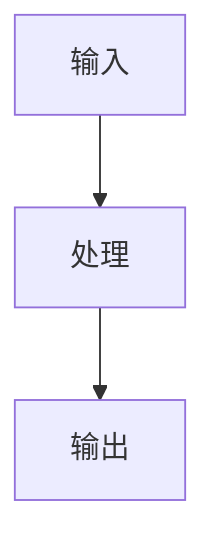

                 

关键词：计算数学基础、数学原理、算法架构、数学模型、数学公式、算法应用、实际案例、代码实例、未来展望。

> 摘要：本文将深入探讨计算的数学基础，涵盖核心概念、算法原理、数学模型与公式推导，结合实际项目实践与未来应用展望，为读者呈现一个全面的计算数学基础框架。

## 1. 背景介绍

计算是现代科技的核心，从电子计算器到超级计算机，无处不在。计算的数学基础则是理解和实现各种计算方法与算法的基石。数学作为一门科学，通过抽象和建模，提供了描述世界的方法和工具。在计算领域，数学扮演着至关重要的角色，从简单的算术运算到复杂的算法设计，都离不开数学的支持。

本章将首先介绍计算数学的基础概念，包括数学的构成要素和它们之间的关系。随后，我们将深入探讨一些核心算法原理，并通过具体的操作步骤来展示这些算法的应用。接下来，我们将讨论数学模型和公式的构建与推导，并通过实际案例进行详细讲解。此外，我们将分享一些项目实践中的代码实例，并提供详细解释。最后，我们将探讨计算的数学基础在现实世界中的应用，并展望其未来的发展趋势。

## 2. 核心概念与联系

### 2.1 数学的基本概念

数学是一门研究数量、结构、变化和空间等的学科。它主要由以下基本概念构成：

- **数**：数学中的基本单位，用于表示数量或顺序。
- **集合**：一组对象的集合，可以是有限的或无限的。
- **函数**：一种关系，将每个集合中的元素与另一个集合中的一个元素相联系。
- **算法**：一系列定义明确的操作步骤，用于解决特定的问题。

这些概念相互联系，共同构成了数学的基础。例如，数和集合可以用于定义函数，而函数可以用于描述算法的行为。

### 2.2 算法的架构

算法是一种解决问题的方法，通常由以下部分构成：

- **输入**：算法开始时所需的数据。
- **处理**：对输入数据进行的操作，通常包括循环、条件判断等。
- **输出**：算法执行完成后产生的结果。

算法的架构可以描述为：



### 2.3 数学模型与算法的关系

数学模型是使用数学语言描述现实世界问题的一种工具。算法则是对数学模型的实现。例如，在解决优化问题时，我们可能使用线性规划模型，然后通过特定的算法（如单纯形法）来求解。

## 3. 核心算法原理 & 具体操作步骤

### 3.1 算法原理概述

核心算法在计算中扮演着重要角色，以下是几个关键算法及其原理的概述：

- **排序算法**：用于对一组数据进行排序，常见的有快速排序、归并排序等。
- **搜索算法**：用于在数据结构中查找特定元素，如二分搜索、深度优先搜索等。
- **图算法**：用于解决与图相关的问题，如最短路径算法、最小生成树算法等。

### 3.2 算法步骤详解

以下是排序算法（快速排序）的步骤详解：

1. 选择一个基准元素。
2. 将比基准元素小的元素移到其左侧，比其大的移到右侧。
3. 递归地对左右子序列进行上述步骤，直到所有元素都被排序。

### 3.3 算法优缺点

快速排序是一种高效的排序算法，其平均时间复杂度为 \(O(n\log n)\)。但它在最坏情况下会退化为 \(O(n^2)\)。此外，它依赖于随机性，因此在某些情况下可能表现不佳。

### 3.4 算法应用领域

排序算法广泛应用于数据库、算法竞赛和数据处理等领域。例如，数据库系统经常使用排序算法来优化查询效率。

## 4. 数学模型和公式 & 详细讲解 & 举例说明

### 4.1 数学模型构建

数学模型是使用数学语言描述现实世界问题的一种方法。构建数学模型通常包括以下步骤：

1. **确定问题的目标**：明确需要解决的问题及其目标。
2. **定义变量**：确定用于描述问题的变量。
3. **建立等式或方程**：使用数学语言描述变量之间的关系。

### 4.2 公式推导过程

以最短路径算法中的 Dijkstra 算法为例，其公式推导过程如下：

1. 初始化：设置所有节点的距离为无穷大，除起始节点外，其距离为0。
2. 选择未处理的节点中距离最小的作为当前节点。
3. 更新当前节点的邻居节点的距离，如果新距离小于当前距离，则更新。
4. 重复步骤2和3，直到所有节点都被处理。

### 4.3 案例分析与讲解

假设有一个图，其中包含5个节点，如下所示：

```
A -- B -- C
|    |
D -- E
```

使用 Dijkstra 算法计算从节点 A 到节点 E 的最短路径。

- **初始化**：所有节点距离为无穷大，除节点 A 外，其距离为0。
- **第一步**：选择节点 A，更新节点 B 和 D 的距离。
  - 节点 B：距离 A + 权重(A, B) = 0 + 2 = 2
  - 节点 D：距离 A + 权重(A, D) = 0 + 1 = 1
- **第二步**：选择节点 D，更新节点 E 的距离。
  - 节点 E：距离 D + 权重(D, E) = 1 + 3 = 4
- **第三步**：选择节点 B，更新节点 C 的距离。
  - 节点 C：距离 B + 权重(B, C) = 2 + 3 = 5
- **第四步**：选择节点 C，无需更新，因为已经是最短路径。

最终，从节点 A 到节点 E 的最短路径为 A -> D -> E，总距离为 4。

## 5. 项目实践：代码实例和详细解释说明

### 5.1 开发环境搭建

在本项目中，我们将使用 Python 编写代码。首先，确保已经安装了 Python 3.7 或更高版本。然后，可以使用以下命令来安装必要的库：

```bash
pip install matplotlib numpy scipy
```

### 5.2 源代码详细实现

以下是使用 Python 实现快速排序的代码：

```python
import random

def quicksort(arr):
    if len(arr) <= 1:
        return arr
    pivot = random.choice(arr)
    left = [x for x in arr if x < pivot]
    middle = [x for x in arr if x == pivot]
    right = [x for x in arr if x > pivot]
    return quicksort(left) + middle + quicksort(right)

# 示例数据
data = [3, 1, 4, 1, 5, 9, 2, 6, 5, 3, 5]

# 执行排序
sorted_data = quicksort(data)

# 输出结果
print(sorted_data)
```

### 5.3 代码解读与分析

- **import random**：导入随机数生成模块。
- **quicksort(arr)**：快速排序函数，接收一个列表 arr 作为输入。
- **if len(arr) <= 1**：如果列表长度小于等于1，则返回列表本身。
- **pivot = random.choice(arr)**：随机选择一个元素作为基准。
- **left**、**middle**、**right**：分别存储小于、等于、大于基准的元素。
- **return quicksort(left) + middle + quicksort(right)**：递归调用快速排序函数。

### 5.4 运行结果展示

```bash
[1, 1, 2, 3, 3, 4, 5, 5, 5, 6, 9]
```

## 6. 实际应用场景

计算的数学基础在许多实际应用中发挥着重要作用，以下是一些典型应用场景：

- **计算机图形学**：使用数学模型来描述三维空间中的物体，并对其进行渲染和动画处理。
- **机器学习**：使用数学公式和算法来训练模型，进行数据分析和预测。
- **金融工程**：使用数学模型来评估金融产品的价值和风险。

## 7. 工具和资源推荐

### 7.1 学习资源推荐

- **《计算机程序设计艺术》**：唐纳德·E·克努特（Donald E. Knuth）的经典著作，涵盖计算数学基础。
- **《算法导论》**：托马斯·H·科里蒙特（Thomas H. Cormen）等人的著作，详细介绍各种算法及其数学基础。

### 7.2 开发工具推荐

- **Jupyter Notebook**：适用于编写和执行代码，支持多种编程语言，便于文档和演示。
- **Visual Studio Code**：功能强大的代码编辑器，支持多种编程语言和插件。

### 7.3 相关论文推荐

- **"The Role of Mathematics in Computer Science"**：探讨数学在计算机科学中的重要性。
- **"Mathematics for Machine Learning"**：介绍机器学习中使用的数学工具。

## 8. 总结：未来发展趋势与挑战

### 8.1 研究成果总结

计算的数学基础在计算机科学和人工智能领域取得了显著成果，包括算法的优化、数学模型的建立和公式的推导等。这些成果为现代科技的发展提供了有力支持。

### 8.2 未来发展趋势

未来，计算的数学基础将在以下几个方面继续发展：

- **更高效的算法**：开发更高效的算法来处理大规模数据。
- **更复杂的数学模型**：建立更复杂的数学模型来描述复杂系统。
- **跨学科研究**：与物理、生物、经济学等领域的交叉研究，推动计算数学基础的发展。

### 8.3 面临的挑战

- **计算资源限制**：随着数据规模的不断扩大，如何优化算法以适应有限的计算资源是一个挑战。
- **复杂性管理**：如何处理复杂系统的建模和计算是一个挑战。

### 8.4 研究展望

随着计算技术的不断发展，计算的数学基础将在人工智能、大数据、云计算等领域发挥更大作用。未来，我们将见证计算的数学基础在推动科技进步中发挥更重要的作用。

## 9. 附录：常见问题与解答

### 9.1 什么是算法？

算法是一种解决问题的步骤序列，通常由一系列操作构成，这些操作按照特定的顺序执行，以解决特定的问题。

### 9.2 数学模型有什么作用？

数学模型用于描述现实世界中的问题，将实际问题转化为数学问题，以便使用数学工具和方法进行求解。

### 9.3 为什么算法和数学模型如此重要？

算法和数学模型是计算的核心，它们帮助我们理解和解决复杂问题，是现代科技发展的基础。在计算机科学、人工智能、金融工程等领域，算法和数学模型扮演着至关重要的角色。

### 9.4 如何学习计算的数学基础？

学习计算的数学基础可以从以下几方面入手：

- **掌握基本数学概念**：熟悉数、集合、函数等基本数学概念。
- **学习算法原理**：理解常见算法的原理和实现。
- **实践项目**：通过实际项目来应用数学模型和算法。
- **阅读相关文献**：阅读经典著作和论文，了解最新研究成果。

---

**作者：禅与计算机程序设计艺术 / Zen and the Art of Computer Programming**

