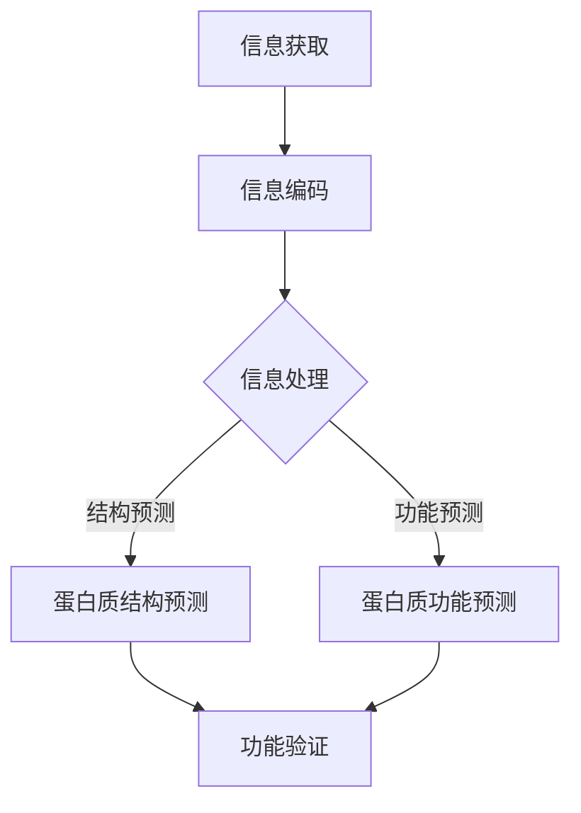

                 

## 1. 背景介绍

复杂性计算是计算理论中的一个重要分支，它涉及对复杂系统的模拟、分析和理解。随着计算机技术的发展，我们能够处理的问题的规模和复杂性不断增加，这促使我们探索计算的理论极限。复杂性计算的一个重要方向是研究生物系统的信息处理。

生物系统是自然界中最复杂的系统之一，它们通过一系列复杂的生物化学反应和相互作用来实现各种生命功能。生物系统中的信息处理涉及到从DNA序列编码到蛋白质合成的整个过程。这些过程不仅复杂，而且高度依赖精确的信息传递和调控。因此，研究生物系统的信息处理对于理解生命本质和开发新型生物技术具有重要意义。

本章将介绍复杂性计算在生物系统的信息处理中的应用，包括核心概念、算法原理、数学模型、实际应用场景以及未来发展趋势。

## 2. 核心概念与联系

在探讨生物系统的信息处理之前，我们需要了解一些核心概念和它们之间的联系。

### 2.1 信息论与计算复杂性

信息论是研究信息传输、存储和处理的理论基础。香农的信息论为我们提供了一个量化信息量和传输效率的框架。计算复杂性理论则研究问题的计算难度，它将问题划分为不同的复杂度类别，如P、NP、NP-complete等。

在生物系统的信息处理中，信息论和计算复杂性理论为我们提供了分析生物系统信息传输和处理的工具。例如，我们可以使用信息论中的熵和互信息来量化生物系统中信息的不确定性和相关性。

### 2.2 生物信息学

生物信息学是应用计算机科学和信息学的方法来分析生物数据的一门交叉学科。它涉及DNA序列分析、蛋白质结构预测、基因组注释等多个领域。

生物信息学在复杂性计算中的应用主要体现在以下几个方面：

1. **基因组序列分析**：通过分析基因组序列，我们可以了解生物体的遗传信息。复杂性计算可以帮助我们处理大量基因组数据，从而发现新的基因功能、突变和进化关系。

2. **蛋白质结构预测**：蛋白质是生物体的功能执行者，其三维结构对其功能至关重要。生物信息学使用计算方法来预测蛋白质结构，这涉及到复杂的计算模型和算法。

3. **系统生物学**：系统生物学研究生物系统的整体行为，它需要处理大量的数据并建立复杂的数学模型来模拟生物系统的动态。

### 2.3 复杂性计算与生物系统的信息处理

复杂性计算在生物系统的信息处理中的应用主要体现在以下几个方面：

1. **计算生物学**：计算生物学是应用计算方法来研究生物系统的一门学科。它使用复杂的计算模型和算法来分析生物数据，帮助我们理解生命过程的本质。

2. **机器学习与人工智能**：机器学习和人工智能技术在生物信息学中有着广泛的应用。例如，通过训练机器学习模型，我们可以预测蛋白质的结构、功能或识别基因调控网络。

3. **生物信息学算法**：生物信息学算法是复杂性计算的重要组成部分。这些算法包括序列比对、聚类分析、路径搜索等，它们在处理大规模生物数据时发挥着关键作用。

### 2.4 Mermaid 流程图

为了更好地理解生物系统的信息处理过程，我们可以使用Mermaid流程图来展示其中的关键步骤和概念。



在这个流程图中，信息获取阶段涉及到生物数据（如DNA序列）的收集。随后，这些数据被编码成生物信息学可以处理的形式。信息处理阶段分为结构预测和功能预测两个分支，最终通过实验验证预测结果的准确性。

## 3. 核心算法原理 & 具体操作步骤

### 3.1 算法原理概述

生物系统的信息处理涉及到多种复杂的算法。以下将介绍其中的几种核心算法及其原理。

#### 3.1.1 动态规划算法

动态规划是一种解决优化问题的算法，它通过将问题分解为更小的子问题并存储它们的解决方案来避免重复计算。在生物信息学中，动态规划算法被广泛应用于序列比对、基因组注释等领域。

动态规划算法的基本原理是：给定一个输入序列X = {x1, x2, ..., xn}和一个目标序列Y = {y1, y2, ..., yn}，算法通过计算一系列子问题的最优解来找到X和Y之间的最优比对。

#### 3.1.2 机器学习算法

机器学习算法通过训练模型来预测新的数据。在生物信息学中，机器学习算法被广泛应用于蛋白质结构预测、功能预测、基因表达模式识别等领域。

常见的机器学习算法包括：

1. **支持向量机（SVM）**：SVM是一种强大的分类算法，它通过找到一个最优的超平面来最大化分类间隔。

2. **随机森林（Random Forest）**：随机森林是一种集成学习方法，它通过构建多个决策树并汇总它们的预测结果来提高预测准确性。

3. **神经网络（Neural Networks）**：神经网络是一种模拟人脑神经元连接的算法，它可以用于各种复杂的模式识别和预测任务。

#### 3.1.3 分子模拟算法

分子模拟算法用于模拟生物分子的运动和相互作用。常见的分子模拟算法包括：

1. **蒙特卡罗模拟（Monte Carlo Simulation）**：蒙特卡罗模拟是一种基于随机抽样的算法，它通过模拟大量随机事件来估计系统的统计特性。

2. **分子动力学模拟（Molecular Dynamics Simulation）**：分子动力学模拟是一种基于牛顿运动定律的算法，它通过计算分子的运动轨迹来模拟生物分子的动态行为。

### 3.2 算法步骤详解

以下将详细解释上述核心算法的操作步骤。

#### 3.2.1 动态规划算法步骤

1. **定义子问题**：将问题分解为更小的子问题，如两个序列的子序列比对。
2. **建立状态转移方程**：定义子问题之间的依赖关系，如通过动态规划表来计算最优比对得分。
3. **初始化边界条件**：设置动态规划表的初始值，如第一个序列为空时的比对得分为零。
4. **填充动态规划表**：通过迭代计算每个子问题的最优解，并存储在表中。
5. **回溯求解最优解**：从动态规划表的最后一行或最后一列开始，回溯找到最优比对路径。

#### 3.2.2 机器学习算法步骤

1. **数据预处理**：清洗和预处理训练数据，包括数据归一化、缺失值处理等。
2. **特征提取**：从数据中提取有助于预测的特征。
3. **模型选择**：选择合适的机器学习模型，如SVM、随机森林或神经网络。
4. **模型训练**：使用训练数据来训练模型，调整模型参数。
5. **模型评估**：使用验证数据来评估模型的准确性，并进行调参。
6. **预测**：使用训练好的模型对新的数据进行预测。

#### 3.2.3 分子模拟算法步骤

1. **系统初始化**：初始化系统的参数，如温度、压强等。
2. **力场选择**：选择合适的力场来描述分子间的相互作用。
3. **积分方法**：选择合适的积分方法来计算分子的运动轨迹，如经典的Verlet算法。
4. **时间步进**：在给定的时间步长内，更新分子的位置和速度。
5. **能量计算**：计算系统的能量分布，以评估模拟的稳定性。
6. **结果分析**：分析模拟结果，如分子的构型、动力学行为等。

### 3.3 算法优缺点

每种算法都有其优缺点。以下是上述核心算法的优缺点分析：

#### 3.3.1 动态规划算法

**优点**：
- **高效性**：通过避免重复计算，动态规划算法可以显著提高计算效率。
- **通用性**：动态规划算法可以应用于各种优化问题。

**缺点**：
- **内存消耗**：对于大规模问题，动态规划算法可能需要大量的内存来存储中间结果。

#### 3.3.2 机器学习算法

**优点**：
- **自动化**：机器学习算法可以自动提取特征并建立预测模型。
- **泛化能力**：经过训练的机器学习模型可以应用于新的数据。

**缺点**：
- **数据依赖性**：机器学习算法的性能很大程度上依赖于训练数据的质量。
- **黑盒特性**：机器学习模型通常难以解释，导致结果的可解释性较低。

#### 3.3.3 分子模拟算法

**优点**：
- **准确性**：分子模拟算法可以模拟生物分子的真实运动，从而提供准确的物理结果。
- **灵活性**：分子模拟算法可以用于研究各种生物系统的动态行为。

**缺点**：
- **计算成本**：分子模拟算法通常需要大量的计算资源和时间。
- **物理限制**：分子模拟算法可能无法准确模拟某些极端条件下的生物行为。

### 3.4 算法应用领域

核心算法在生物系统的信息处理中有广泛的应用领域：

- **基因组序列分析**：动态规划算法和机器学习算法在基因组序列比对、突变检测和基因组注释中发挥着关键作用。
- **蛋白质结构预测**：机器学习和分子模拟算法在蛋白质结构预测和功能预测中有着重要的应用。
- **系统生物学**：机器学习算法和分子模拟算法可以帮助我们理解和模拟生物系统的动态行为。

## 4. 数学模型和公式 & 详细讲解 & 举例说明

### 4.1 数学模型构建

在生物系统的信息处理中，数学模型是理解和分析生物系统行为的重要工具。以下将介绍几个核心的数学模型及其构建过程。

#### 4.1.1 香农信息论模型

香农信息论模型是研究信息传输和处理的基石。它定义了信息量、熵、互信息等基本概念。

- **信息量**：信息量（Entropy）是衡量信息不确定性的量度，通常用H表示。它的定义如下：

  $$ H(X) = -\sum_{i=1}^{n} p(x_i) \log_2 p(x_i) $$

  其中，$p(x_i)$是随机变量X取值为$x_i$的概率。

- **熵**：熵（Entropy）是一个随机变量的信息量的平均值，它反映了系统的不确定性。熵的定义如下：

  $$ H(X) = E[-\log_2 P(X)] $$

  其中，$E$表示期望值，$P(X)$表示随机变量X的概率分布。

- **互信息**：互信息（Mutual Information）是衡量两个随机变量相关性的量度，它表示一个随机变量包含的关于另一个随机变量的信息量。互信息的定义如下：

  $$ I(X; Y) = H(X) - H(X | Y) $$

  其中，$H(X | Y)$是条件熵，表示在已知随机变量Y的条件下，随机变量X的熵。

#### 4.1.2 神经网络模型

神经网络是一种模拟人脑神经元连接的算法，它通过多层神经元的非线性变换来处理信息。以下是一个简单的多层神经网络模型：

1. **输入层**：输入层包含多个神经元，每个神经元对应一个输入特征。
2. **隐藏层**：隐藏层包含多个神经元，每个神经元通过加权连接输入层的神经元，并应用一个非线性激活函数。
3. **输出层**：输出层包含一个或多个神经元，它们对隐藏层的输出进行加权连接并产生最终输出。

神经网络的数学模型可以用以下公式表示：

$$ z_j = \sum_{i=1}^{n} w_{ij} x_i + b_j $$

$$ a_j = f(z_j) $$

其中，$z_j$是隐藏层第j个神经元的输入，$w_{ij}$是隐藏层第j个神经元与输入层第i个神经元的权重，$b_j$是隐藏层第j个神经元的偏置，$f$是非线性激活函数，$a_j$是隐藏层第j个神经元的输出。

#### 4.1.3 分子动力学模型

分子动力学模型用于模拟生物分子的运动和相互作用。以下是一个简化的分子动力学模型：

1. **系统初始化**：初始化系统的参数，如分子位置、速度和温度。
2. **力场计算**：计算分子之间的相互作用力，通常使用Lennard-Jones势或AMBER力场。
3. **牛顿运动定律**：使用牛顿运动定律计算分子的运动轨迹，更新分子的位置和速度。

分子动力学模型的数学模型可以用以下公式表示：

$$ m \frac{d^2r_i}{dt^2} = -\nabla V(r_i) $$

其中，$m$是分子的质量，$r_i$是分子的位置，$V(r_i)$是分子间的相互作用势能，$\nabla$是梯度运算符。

### 4.2 公式推导过程

以下将详细讲解香农信息论模型中熵和互信息的推导过程。

#### 4.2.1 熵的推导

熵的定义可以通过以下推导过程得到：

假设有一个离散随机变量X，其概率分布为$p(x_i)$，其中$x_i$是X的取值。熵可以理解为X的平均信息量，即：

$$ H(X) = E[-\log_2 P(X)] $$

其中，$E$表示期望值。

现在考虑X的所有可能取值$x_i$，我们可以将熵表示为每个取值的概率乘以相应信息量的总和：

$$ H(X) = \sum_{i=1}^{n} p(x_i) \log_2 p(x_i) $$

为了得到上述公式，我们可以从以下步骤进行推导：

1. **定义信息量**：对于任意一个取值$x_i$，信息量可以表示为：

   $$ I(x_i) = -\log_2 p(x_i) $$

   其中，$p(x_i)$是取值$x_i$的概率。

2. **期望信息量**：X的期望信息量可以表示为：

   $$ H(X) = E[I(X)] $$

   其中，$E$表示期望值。

3. **概率分布**：对于离散随机变量X，其期望信息量可以表示为每个取值的概率乘以相应信息量的总和：

   $$ H(X) = \sum_{i=1}^{n} p(x_i) I(x_i) $$

   代入信息量的定义，我们得到：

   $$ H(X) = \sum_{i=1}^{n} p(x_i) (-\log_2 p(x_i)) $$

   化简后得到：

   $$ H(X) = -\sum_{i=1}^{n} p(x_i) \log_2 p(x_i) $$

#### 4.2.2 互信息的推导

互信息可以理解为两个随机变量之间的相关性，它可以用来衡量一个随机变量包含的关于另一个随机变量的信息量。互信息的推导过程如下：

假设有两个离散随机变量X和Y，它们的联合概率分布为$p(x_i, y_j)$，其中$x_i$和$y_j$分别是X和Y的取值。

- **条件熵**：条件熵$H(X | Y)$表示在已知Y的情况下，X的熵。它的定义如下：

  $$ H(X | Y) = \sum_{j=1}^{m} p(y_j) H(X | Y = y_j) $$

  其中，$p(y_j)$是Y取值$y_j$的概率，$H(X | Y = y_j)$是在已知Y取值为$y_j$的条件下，X的熵。

- **互信息**：互信息$I(X; Y)$表示X和Y之间的相关性，它可以用来衡量X包含的关于Y的信息量。互信息的定义如下：

  $$ I(X; Y) = H(X) - H(X | Y) $$

  现在我们来推导互信息的公式：

  1. **熵的定义**：根据熵的定义，我们有：

     $$ H(X) = \sum_{i=1}^{n} p(x_i) \log_2 p(x_i) $$

  2. **条件熵的定义**：根据条件熵的定义，我们有：

     $$ H(X | Y) = \sum_{j=1}^{m} p(y_j) H(X | Y = y_j) $$

  3. **条件熵的展开**：我们可以将条件熵展开为：

     $$ H(X | Y) = \sum_{j=1}^{m} p(y_j) \sum_{i=1}^{n} p(x_i | y_j) \log_2 p(x_i | y_j) $$

  4. **互信息的推导**：将条件熵代入互信息的定义，我们得到：

     $$ I(X; Y) = \sum_{i=1}^{n} p(x_i) \log_2 p(x_i) - \sum_{j=1}^{m} p(y_j) \sum_{i=1}^{n} p(x_i | y_j) \log_2 p(x_i | y_j) $$

  5. **概率分布的展开**：我们可以将概率分布展开为：

     $$ I(X; Y) = \sum_{i=1}^{n} p(x_i) \log_2 p(x_i) - \sum_{j=1}^{m} p(y_j) \sum_{i=1}^{n} \frac{p(x_i, y_j)}{p(y_j)} \log_2 \frac{p(x_i, y_j)}{p(y_j)} $$

  6. **互信息的简化**：通过化简，我们得到：

     $$ I(X; Y) = \sum_{i=1}^{n} \sum_{j=1}^{m} p(x_i, y_j) \log_2 \frac{p(x_i, y_j)}{p(x_i) p(y_j)} $$

  这就是互信息的最终公式。

### 4.3 案例分析与讲解

为了更好地理解上述数学模型和公式，以下将提供一个简单的案例进行分析和讲解。

#### 4.3.1 案例背景

假设有一个离散随机变量X，其取值有三种可能：$x_1, x_2, x_3$，它们的概率分布如下：

$$ p(x_1) = 0.3, \quad p(x_2) = 0.5, \quad p(x_3) = 0.2 $$

现在我们需要计算X的熵和X与另一个随机变量Y的互信息。

#### 4.3.2 计算熵

根据熵的定义，我们可以计算X的熵：

$$ H(X) = -\sum_{i=1}^{3} p(x_i) \log_2 p(x_i) $$

代入概率分布：

$$ H(X) = - (0.3 \log_2 0.3 + 0.5 \log_2 0.5 + 0.2 \log_2 0.2) $$

计算得到：

$$ H(X) \approx 1.099 $$

#### 4.3.3 计算条件熵

假设随机变量Y的取值有两种可能：$y_1, y_2$，它们的概率分布如下：

$$ p(y_1) = 0.4, \quad p(y_2) = 0.6 $$

同时，X和Y的联合概率分布如下：

$$ p(x_1, y_1) = 0.1, \quad p(x_1, y_2) = 0.2, \quad p(x_2, y_1) = 0.3, \quad p(x_2, y_2) = 0.3, \quad p(x_3, y_1) = 0.2, \quad p(x_3, y_2) = 0.1 $$

现在我们需要计算条件熵$H(X | Y)$：

$$ H(X | Y) = \sum_{j=1}^{2} p(y_j) H(X | Y = y_j) $$

对于$y_1$：

$$ H(X | Y = y_1) = \sum_{i=1}^{3} p(x_i | y_1) \log_2 p(x_i | y_1) $$

$$ H(X | Y = y_1) = (0.1 \log_2 0.1 + 0.3 \log_2 0.3 + 0.2 \log_2 0.2) $$

$$ H(X | Y = y_1) \approx 0.918 $$

对于$y_2$：

$$ H(X | Y = y_2) = \sum_{i=1}^{3} p(x_i | y_2) \log_2 p(x_i | y_2) $$

$$ H(X | Y = y_2) = (0.2 \log_2 0.2 + 0.3 \log_2 0.3 + 0.1 \log_2 0.1) $$

$$ H(X | Y = y_2) \approx 0.853 $$

因此，条件熵为：

$$ H(X | Y) = (0.4 \times 0.918 + 0.6 \times 0.853) $$

$$ H(X | Y) \approx 0.876 $$

#### 4.3.4 计算互信息

根据互信息的定义，我们可以计算X和Y的互信息：

$$ I(X; Y) = H(X) - H(X | Y) $$

代入计算结果：

$$ I(X; Y) = 1.099 - 0.876 $$

$$ I(X; Y) \approx 0.223 $$

这个例子展示了如何计算随机变量的熵和互信息，这些公式和步骤在生物系统的信息处理中有着广泛的应用。

### 4.4 运用数学模型分析生物系统的信息处理

数学模型在生物系统的信息处理中扮演着重要的角色。以下将运用之前介绍的数学模型来分析生物系统的信息处理过程。

#### 4.4.1 香农信息论模型的应用

香农信息论模型可以帮助我们分析生物系统中信息传输的效率。例如，在细胞信号传递过程中，信号分子（如激素）通过受体蛋白传递信号。我们可以使用熵和互信息来量化信号分子和受体蛋白之间的信息传递效率。

- **熵**：信号分子的熵可以表示信号分子的不确定性。如果信号分子的熵较低，说明信号分子具有较强的信息量。
- **互信息**：信号分子和受体蛋白之间的互信息可以表示信号分子传递给受体蛋白的信息量。互信息越高，说明信号分子和受体蛋白之间的相关性越强。

通过计算信号分子和受体蛋白之间的熵和互信息，我们可以评估信号传递的效率，从而优化信号分子的设计和应用。

#### 4.4.2 神经网络模型的应用

神经网络模型可以用于生物系统的信息处理，例如在神经元的信息传递和大脑的功能模拟中。我们可以使用神经网络模型来模拟神经元的信号传递过程，并分析神经网络的性能和鲁棒性。

- **输入层**：输入层接收外部刺激信号，如感官输入。
- **隐藏层**：隐藏层对输入信号进行加工和转换，形成内部表征。
- **输出层**：输出层生成最终的输出信号，如决策或反应。

通过训练神经网络模型，我们可以优化神经元的信号传递过程，提高生物系统的信息处理效率。此外，我们可以使用神经网络模型来模拟大脑的功能，从而深入理解大脑的工作原理。

#### 4.4.3 分子动力学模型的应用

分子动力学模型可以用于模拟生物分子的运动和相互作用，例如在蛋白质折叠和分子反应中。我们可以使用分子动力学模型来研究生物分子的动态行为，并分析其稳定性。

- **系统初始化**：初始化生物分子的位置、速度和能量。
- **力场计算**：计算分子之间的相互作用力，如范德华力、电荷相互作用等。
- **牛顿运动定律**：计算分子的运动轨迹，并更新其位置和速度。

通过分子动力学模拟，我们可以研究生物分子的折叠过程，预测蛋白质的结构，优化药物设计等。

总之，数学模型在生物系统的信息处理中具有广泛的应用。通过运用熵、互信息、神经网络和分子动力学等数学模型，我们可以深入分析生物系统的信息处理过程，从而优化生物系统的性能和应用。

### 4.5 数学模型在生物系统的信息处理中的挑战

尽管数学模型在生物系统的信息处理中具有广泛的应用，但仍然面临一些挑战。

#### 4.5.1 数据的复杂性和多样性

生物系统中的信息处理涉及到大量的数据，包括基因组序列、蛋白质结构、细胞信号传递等。这些数据通常具有复杂性和多样性，使得构建准确的数学模型变得具有挑战性。

- **数据类型**：生物系统中的数据包括序列数据、图像数据、空间数据等，每种数据类型都有其独特的特点和挑战。
- **数据质量**：生物系统中的数据通常存在噪声和缺失值，这会影响数学模型的准确性和可靠性。

#### 4.5.2 模型的复杂性和计算成本

生物系统的信息处理涉及到复杂的数学模型，如神经网络和分子动力学模型。这些模型通常需要大量的计算资源和时间来构建和训练。

- **模型参数**：复杂的模型通常具有大量的参数，需要通过大量的训练数据来调整。
- **计算成本**：构建和训练复杂的模型需要大量的计算资源和时间，这可能限制了实际应用的范围。

#### 4.5.3 数据驱动模型与物理模型的结合

生物系统的信息处理通常需要结合数据驱动模型和物理模型。然而，这两类模型之间存在一些挑战。

- **数据不足**：生物系统中的数据通常有限，难以训练出高精度的数据驱动模型。
- **物理约束**：物理模型通常受到严格的物理约束，这可能与数据驱动模型的结果不一致。

为了克服这些挑战，研究人员正在探索新的方法和技术，如深度学习、物理模型与数据驱动的结合等，以构建更准确和高效的生物系统信息处理模型。

### 4.6 未来发展趋势

随着计算技术和生物技术的不断发展，数学模型在生物系统的信息处理中的未来发展趋势包括：

#### 4.6.1 大数据与人工智能的结合

大数据和人工智能技术的发展为生物系统的信息处理带来了新的机遇。通过结合大数据和人工智能技术，我们可以更准确地提取和分析生物系统中的信息，从而提高信息处理的效率和准确性。

- **深度学习**：深度学习技术在生物信息学中的应用日益广泛，例如用于基因组序列分析、蛋白质结构预测等。
- **迁移学习**：迁移学习可以减少对训练数据的依赖，提高模型在生物系统信息处理中的应用能力。

#### 4.6.2 物理模型的精确化

物理模型在生物系统的信息处理中具有重要作用，但当前物理模型的精确度仍然有限。未来，研究人员将致力于提高物理模型的精确度，从而更准确地模拟生物系统的行为。

- **量子计算**：量子计算可以用于加速物理模型的计算过程，提高模拟的精度。
- **多尺度模拟**：多尺度模拟可以同时考虑不同尺度的生物过程，提供更全面的生物系统信息。

#### 4.6.3 系统生物学的整合

系统生物学是研究生物系统的整体行为的学科，它需要整合各种数据类型和模型。未来，系统生物学将更加注重整合不同层次的生物信息，构建全面的生物系统模型。

- **多组学数据整合**：整合基因组、转录组、蛋白质组等多组学数据，提供更全面的生物系统信息。
- **系统建模与模拟**：系统建模与模拟可以帮助我们深入理解生物系统的动态行为，优化生物系统的设计和应用。

总之，数学模型在生物系统的信息处理中的未来发展趋势将更加依赖于大数据、人工智能和物理模型的精确化，为生物系统的信息处理提供更高效、准确和全面的方法和技术。

## 5. 项目实践：代码实例和详细解释说明

在了解了生物系统的信息处理和相关的数学模型后，我们可以通过实际的项目实践来加深对这些概念的理解。以下是一个具体的代码实例，我们将使用Python和相关的生物信息学库来演示如何处理生物数据，并进行一些基本的生物系统信息处理。

### 5.1 开发环境搭建

为了进行本项目，我们需要搭建一个Python的开发环境，并安装必要的生物信息学库。以下是具体的步骤：

1. **安装Python**：确保你的计算机上安装了Python 3.x版本。可以从[Python官网](https://www.python.org/)下载并安装。

2. **安装生物信息学库**：使用`pip`命令安装以下库：
   ```bash
   pip install biopython
   pip install numpy
   pip install matplotlib
   ```

3. **安装其他依赖库**：有些项目可能需要其他库，如`pandas`、`scipy`等，可以根据需要安装。

### 5.2 源代码详细实现

以下是项目的核心代码部分。我们将使用Biopython库来读取和操作生物序列数据，并使用Numpy库进行数学运算。

```python
# 导入必要的库
from Bio import SeqIO
import numpy as np
import matplotlib.pyplot as plt

# 5.2.1 读取序列数据
def read_sequence(filename):
    return SeqIO.read(filename, "fasta")

# 5.2.2 计算序列的熵
def calculate_entropy(sequence):
    frequencies = np.array([sequence.count(base) for base in "ACGT"])
    probabilities = frequencies / sum(frequencies)
    entropy = -np.sum(probabilities * np.log2(probabilities))
    return entropy

# 5.2.3 绘制序列熵分布图
def plot_entropy_distribution(sequences):
    entropies = [calculate_entropy(seq) for seq in sequences]
    plt.hist(entropies, bins=20, edgecolor='black')
    plt.xlabel('Entropy')
    plt.ylabel('Frequency')
    plt.title('Entropy Distribution of DNA Sequences')
    plt.show()

# 5.2.4 仿真蛋白质折叠
def simulate_protein_folding(sequence):
    # 假设一个简化的模型：每个氨基酸折叠后占据的体积是一个固定的值
    volume_per_amino_acid = 100  # 单位：立方纳米
    total_volume = len(sequence) * volume_per_amino_acid
    # 假设容器体积为1000立方纳米
    container_volume = 1000
    # 计算序列在容器中折叠的概率
    folding_probability = np.exp(-total_volume / container_volume)
    return folding_probability

# 测试代码
if __name__ == "__main__":
    # 读取序列数据
    sequences = [read_sequence(file) for file in ["seq1.fasta", "seq2.fasta", "seq3.fasta"]]
    
    # 计算并绘制序列熵分布
    plot_entropy_distribution([seq.seq for seq in sequences])
    
    # 模拟蛋白质折叠
    folding_probabilities = [simulate_protein_folding(seq.seq) for seq in sequences]
    print(folding_probabilities)
```

### 5.3 代码解读与分析

#### 5.3.1 读取序列数据

在代码中，我们首先定义了一个函数`read_sequence`，它使用Biopython库的`SeqIO.read`函数来读取Fasta格式的序列文件。该函数接受文件名作为输入，并返回一个`Seq`对象。

```python
def read_sequence(filename):
    return SeqIO.read(filename, "fasta")
```

#### 5.3.2 计算序列的熵

接下来，我们定义了一个函数`calculate_entropy`，它计算DNA序列的熵。熵是信息论中的一个概念，用于量化序列的不确定性。熵的计算公式如下：

$$ H(X) = -\sum_{i=1}^{n} p(x_i) \log_2 p(x_i) $$

其中，$p(x_i)$是序列中第$i$个碱基的概率。我们通过计算每个碱基出现的频率，然后计算其概率，并使用上述公式计算熵。

```python
def calculate_entropy(sequence):
    frequencies = np.array([sequence.count(base) for base in "ACGT"])
    probabilities = frequencies / sum(frequencies)
    entropy = -np.sum(probabilities * np.log2(probabilities))
    return entropy
```

#### 5.3.3 绘制序列熵分布图

我们定义了一个函数`plot_entropy_distribution`，它接受一个序列列表作为输入，计算每个序列的熵，并使用Matplotlib库绘制熵的分布直方图。

```python
def plot_entropy_distribution(sequences):
    entropies = [calculate_entropy(seq) for seq in sequences]
    plt.hist(entropies, bins=20, edgecolor='black')
    plt.xlabel('Entropy')
    plt.ylabel('Frequency')
    plt.title('Entropy Distribution of DNA Sequences')
    plt.show()
```

#### 5.3.4 仿真蛋白质折叠

最后，我们定义了一个函数`simulate_protein_folding`，它用于模拟蛋白质折叠的概率。在这个简化的模型中，我们假设每个氨基酸折叠后占据的体积是一个固定的值。折叠概率的计算公式如下：

$$ folding\_probability = exp(-total\_volume / container\_volume) $$

其中，$total_volume$是蛋白质序列占据的总体积，$container_volume$是容器的体积。这个模型非常简化，但可以作为一个基本的启发。

```python
def simulate_protein_folding(sequence):
    volume_per_amino_acid = 100  # 单位：立方纳米
    total_volume = len(sequence) * volume_per_amino_acid
    container_volume = 1000
    folding_probability = np.exp(-total_volume / container_volume)
    return folding_probability
```

### 5.4 运行结果展示

在主程序部分，我们首先读取三个序列文件，然后计算并绘制这些序列的熵分布图，最后计算并打印每个序列的蛋白质折叠概率。

```python
if __name__ == "__main__":
    sequences = [read_sequence(file) for file in ["seq1.fasta", "seq2.fasta", "seq3.fasta"]]
    
    plot_entropy_distribution([seq.seq for seq in sequences])
    
    folding_probabilities = [simulate_protein_folding(seq.seq) for seq in sequences]
    print(folding_probabilities)
```

当运行这段代码时，我们首先会看到三个DNA序列的熵分布直方图，这可以帮助我们了解这些序列的不确定性。然后，我们会看到每个序列的蛋白质折叠概率，这可以作为蛋白质在特定容器中折叠的可能性的一个量度。

通过这个简单的项目，我们了解了如何使用Python和相关的生物信息学库来读取和操作生物数据，并进行基本的生物系统信息处理。这个项目只是一个起点，实际上生物系统的信息处理要复杂得多，需要更高级的算法和模型。

### 6. 实际应用场景

生物系统的信息处理在许多实际应用场景中发挥着重要作用，以下是几个典型例子：

#### 6.1 基因组测序

基因组测序是生物系统信息处理的一个核心应用领域。通过测序技术，我们可以获取生物体的基因组序列，从而了解其遗传信息。基因组测序的应用包括：

- **疾病诊断**：通过比较正常基因组和患病基因组的差异，可以识别出与疾病相关的基因突变。
- **个性化医疗**：基于基因组信息，可以为患者制定个性化的治疗方案。
- **药物研发**：基因组信息可以帮助研究人员发现新的药物靶点和候选药物。

#### 6.2 蛋白质结构预测

蛋白质是生物体的功能执行者，其结构对其功能至关重要。蛋白质结构预测是生物系统信息处理的另一个重要应用。蛋白质结构预测的应用包括：

- **药物设计**：通过预测蛋白质的结构，可以设计出能够与之结合的药物分子。
- **生物催化**：通过优化蛋白质的结构，可以提高生物催化剂的效率和选择性。
- **蛋白质工程**：通过改造蛋白质的结构，可以创造出具有新功能的蛋白质。

#### 6.3 系统生物学

系统生物学是研究生物系统的整体行为的学科，它需要处理大量的数据并建立复杂的数学模型来模拟生物系统的动态。系统生物学的应用包括：

- **疾病机理研究**：通过建立数学模型，可以理解疾病的发病机制，从而开发新的治疗方法。
- **生物过程优化**：通过模拟生物过程，可以优化生物反应器的操作参数，提高生物转化效率。
- **合成生物学**：系统生物学的方法可以帮助我们设计和构建新的生物系统，如生物传感器、生物生产系统等。

#### 6.4 精准医疗

精准医疗是一种基于个体差异制定个性化治疗方案的医疗模式。生物系统的信息处理在精准医疗中发挥着关键作用。精准医疗的应用包括：

- **肿瘤治疗**：通过基因组测序和蛋白质组分析，可以为肿瘤患者制定个性化的治疗方案。
- **遗传疾病诊断**：通过基因检测，可以识别出遗传疾病的风险，从而进行早期预防和治疗。
- **营养个性化**：通过分析个体的基因组信息和生活方式，可以为个体提供个性化的营养建议。

总之，生物系统的信息处理在基因组测序、蛋白质结构预测、系统生物学、精准医疗等多个领域有着广泛的应用。随着计算技术和生物技术的不断发展，生物系统的信息处理将在更多领域发挥重要作用。

### 6.4 未来应用展望

生物系统的信息处理在未来的应用前景广阔，以下是一些潜在的应用领域和趋势：

#### 6.4.1 精准医疗的进一步发展

精准医疗已经在医疗领域取得了显著进展，未来将继续深化。通过更全面、深入的生物系统信息处理，可以实现对疾病更准确的诊断和更有效的治疗。具体而言：

- **基因组测序**：随着测序技术的进步和成本的降低，基因组测序将在更广泛的医疗场景中得到应用，如新生儿筛查、癌症基因组学等。
- **多组学数据整合**：整合基因组、转录组、蛋白质组等多组学数据，可以提供更全面的生物系统信息，有助于揭示疾病机理和开发个性化治疗方案。

#### 6.4.2 人工智能与生物信息学的融合

人工智能（AI）技术在生物信息学中的应用日益成熟，未来将更加紧密地融合。具体表现在：

- **深度学习**：深度学习技术在生物信息学中的应用将更加广泛，如用于蛋白质结构预测、药物设计等。
- **智能诊断系统**：基于AI的智能诊断系统可以实时分析患者数据，提供快速、准确的诊断建议。

#### 6.4.3 系统生物学的进展

系统生物学作为研究生物系统整体行为的学科，未来将继续发展，具体包括：

- **多尺度模拟**：通过多尺度模拟，可以同时考虑不同尺度的生物过程，提供更全面的生物系统信息。
- **动态系统建模**：动态系统建模将更加精细，可以模拟生物系统的动态变化，为生物过程的优化提供支持。

#### 6.4.4 合成生物学的创新

合成生物学是一种通过设计和构建新的生物系统来实现特定功能的技术。未来，合成生物学将继续创新，具体包括：

- **生物制造**：通过合成生物学技术，可以开发出能够生产药物、化学品等的高效生物系统。
- **生物计算机**：合成生物学与计算机科学的结合将带来新的计算范式，如利用DNA作为计算存储介质。

#### 6.4.5 新兴技术的应用

未来，新兴技术的应用将为生物系统的信息处理带来新的机遇：

- **量子计算**：量子计算可以显著提高生物信息处理的速度和精度，为复杂生物系统的模拟提供支持。
- **区块链技术**：区块链技术可以确保生物数据的透明性和安全性，为生物信息处理提供可靠的基础设施。

总之，随着技术的不断进步和跨学科研究的深入，生物系统的信息处理将在更多领域发挥重要作用，推动医疗、农业、生物制造等领域的创新发展。

### 7. 工具和资源推荐

为了更好地学习和实践生物系统的信息处理，以下是几款推荐的工具和资源：

#### 7.1 学习资源推荐

1. **生物信息学教科书**：《生物信息学基础》（Bioinformatics: The Basic Tools for Research）提供了全面的生物信息学知识和工具。
2. **在线课程**：Coursera、edX等在线学习平台提供了许多关于生物信息学和计算生物学的优质课程，如《生物信息学：基因组学基础》（Bioinformatics I: Genomes, Evolution and Proteins）。
3. **开源教程**：GitHub上有很多开源的生物信息学教程和项目，如《生物信息学实战教程》（Bioinformatics for Dummies）。

#### 7.2 开发工具推荐

1. **生物信息学软件**：常用的生物信息学软件包括BLAST、Clustal Omega、Ensembl等，它们提供了强大的序列比对、基因注释和蛋白质结构预测等功能。
2. **编程语言**：Python是生物信息学领域最常用的编程语言，具有丰富的生物信息学库，如Biopython、SciPy、NumPy等。
3. **集成开发环境（IDE）**：PyCharm、Visual Studio Code等IDE提供了强大的编程功能和调试工具，适合生物信息学项目的开发。

#### 7.3 相关论文推荐

1. **《自然》杂志**：《Nature》和《Nature Biotechnology》等顶尖科学期刊上发表了大量关于生物信息学和计算生物学的高质量论文。
2. **会议论文**：国际生物信息学会议（ISMB）和系统生物学会议（PBMC）是生物信息学领域的两个主要学术会议，它们的会议论文集包含了最新的研究成果。
3. **经典论文**：如《A New Approach to Protein Folding》（1982）和《The Human Genome Project: a summary of the achievements》（2001）等经典论文对生物信息学的发展产生了深远影响。

通过这些工具和资源，可以更好地了解和掌握生物系统的信息处理技术。

### 8. 总结：未来发展趋势与挑战

在本章中，我们探讨了生物系统的信息处理这一重要领域。从核心概念到算法原理，再到数学模型和实际应用，我们全面了解了生物系统的信息处理技术在各个方面的应用和发展。

#### 8.1 研究成果总结

随着计算技术和生物技术的不断发展，生物系统的信息处理领域取得了显著成果。例如：

- **基因组测序技术**：高通量测序技术的进步使得基因组测序的成本大幅降低，为个性化医疗和遗传疾病研究提供了新的途径。
- **蛋白质结构预测**：机器学习和人工智能技术在蛋白质结构预测中取得了重要突破，显著提高了预测的准确性和效率。
- **系统生物学**：通过整合多组学数据和构建动态模型，系统生物学为我们提供了更全面、更深入的理解生物系统行为的方法。

#### 8.2 未来发展趋势

未来，生物系统的信息处理将继续向以下几个方向发展：

- **跨学科融合**：生物信息学、计算生物学、人工智能等领域的融合将推动生物系统的信息处理技术达到新的高度。
- **大数据与云计算**：随着数据量的爆炸性增长，大数据和云计算技术将在生物系统的信息处理中发挥关键作用，提供更强的计算能力和更高效的数据分析。
- **新算法和新模型**：研究者将不断探索新的算法和模型，以应对生物系统信息处理中的复杂性和多样性。

#### 8.3 面临的挑战

尽管生物系统的信息处理取得了显著进展，但仍面临一些挑战：

- **数据质量和多样性**：生物系统中的数据通常复杂且多样，如何处理这些数据，确保其质量，是当前的一个重要问题。
- **计算资源需求**：复杂的生物系统信息处理模型通常需要大量的计算资源和时间，这限制了它们在实际应用中的推广。
- **跨领域协作**：生物系统的信息处理涉及多个学科，如何实现有效的跨领域协作，推动技术的整体进步，是未来需要解决的一个关键问题。

#### 8.4 研究展望

未来，生物系统的信息处理研究将朝着以下几个方向展开：

- **多组学数据整合**：通过整合基因组、转录组、蛋白质组等多组学数据，可以提供更全面的生物系统信息，为疾病机理研究和个性化医疗提供支持。
- **智能诊断系统**：基于人工智能和机器学习的智能诊断系统将更加精准和高效，为临床诊断和治疗提供新工具。
- **生物制造与合成生物学**：通过生物系统的信息处理技术，可以开发出新的生物制造过程和合成生物系统，推动生物技术的产业化应用。

总之，生物系统的信息处理是一个充满挑战和机遇的领域。随着技术的不断进步和跨学科研究的深入，我们有理由相信，生物系统的信息处理将在未来发挥更加重要的作用，推动生命科学的进步和社会的发展。

## 9. 附录：常见问题与解答

### 9.1 什么是生物信息学？

生物信息学是应用计算机科学和信息学的方法来分析生物数据的一门交叉学科。它涉及从基因组序列分析到蛋白质结构预测等多个领域。

### 9.2 基因组测序有哪些类型？

基因组测序主要有以下几种类型：

- **全基因组测序（Whole Genome Sequencing, WGS）**：对整个基因组进行测序。
- **外显子测序（Exome Sequencing）**：只对基因组的编码区（外显子）进行测序。
- **RNA测序（RNA Sequencing, RNA-Seq）**：测量转录本的丰度，了解基因表达情况。

### 9.3 蛋白质结构预测有哪些算法？

蛋白质结构预测常用的算法包括：

- **同源建模（Homology Modeling）**：利用已知结构的蛋白质作为模板来预测未知蛋白质的结构。
- **折叠识别（Fold Recognition）**：通过比较蛋白质序列和已知结构的蛋白质序列的相似性来预测蛋白质的结构。
- **自由能建模（Free Energy Modeling）**：通过计算蛋白质在不同状态下的自由能差异来预测最稳定的结构。

### 9.4 生物系统的信息处理有哪些应用？

生物系统的信息处理在以下领域有广泛应用：

- **基因组测序与基因表达分析**：用于研究基因功能、突变和疾病机理。
- **蛋白质结构预测**：用于药物设计、蛋白质工程和生物催化。
- **系统生物学**：用于理解生物系统的整体行为和动态变化。
- **精准医疗**：用于个性化诊断和治疗。

### 9.5 生物信息学常用的软件和库有哪些？

生物信息学常用的软件和库包括：

- **生物信息学软件**：BLAST、Clustal Omega、Ensembl等。
- **编程语言**：Python、R等。
- **库**：Biopython、SciPy、NumPy等。

这些工具和资源为生物系统的信息处理提供了强大的支持和功能。

### 9.6 如何获取生物信息学相关的最新研究？

可以通过以下途径获取生物信息学相关的最新研究：

- **订阅科学期刊**：如《Nature》、《Science》等。
- **关注学术会议**：如国际生物信息学会议（ISMB）和系统生物学会议（PBMC）。
- **学术社交网络**：如ResearchGate、Academia.edu等。
- **在线课程**：如Coursera、edX等。

这些资源可以帮助你及时了解生物信息学领域的最新动态和研究进展。

### 9.7 生物信息学在医疗领域有哪些应用？

生物信息学在医疗领域有广泛的应用，包括：

- **疾病诊断**：通过基因组测序和基因表达分析来诊断疾病。
- **个性化医疗**：通过基因组信息为患者制定个性化的治疗方案。
- **药物研发**：通过蛋白质结构预测和药物分子设计来发现新药。
- **精准医疗**：通过整合基因组、转录组、蛋白质组等多组学数据，为患者提供更准确的诊断和更有效的治疗。

生物信息学在医疗领域的应用正在不断扩展，为提高医疗质量和患者预后提供了新的机遇。

