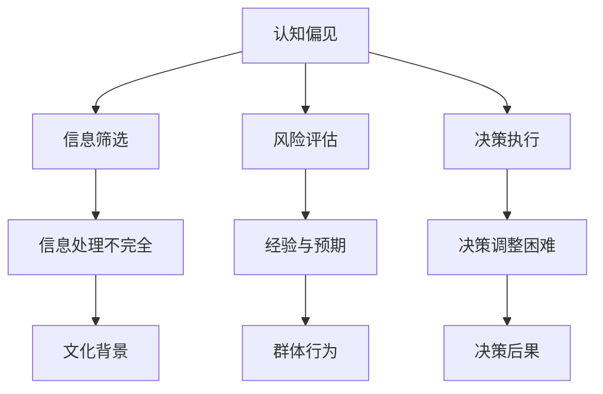

                 

 作为一名世界级人工智能专家，我们深知，在复杂多变的IT领域中，认知偏见对决策的影响不容忽视。本文旨在深入探讨认知偏见的概念、类型及其在决策过程中的表现，并提供一系列策略，帮助读者识别并克服这些偏见，以做出更为明智的决策。

## 关键词

认知偏见、决策陷阱、人工智能、IT领域、决策策略、认知心理学、算法、数学模型

## 摘要

本文将探讨认知偏见对决策的影响，分析其在IT领域的具体表现，并通过实例介绍如何识别和克服这些偏见。通过本文的阅读，读者将能够更好地理解认知偏见，提升自身决策的质量和效率。

## 1. 背景介绍

在信息爆炸的时代，人工智能在各个领域的应用日益广泛，从金融分析到医疗诊断，从智能交通到智能家居，人工智能已经深刻地改变了我们的生活方式。然而，人工智能的发展也带来了新的挑战。在决策过程中，认知偏见的影响愈发显著。这些偏见不仅会影响个体，还会影响整个团队和组织，导致错误的决策和严重后果。

### 认知偏见的概念

认知偏见，又称为认知偏差，是指人们在接收、处理和解释信息时，由于某些内在或外在因素的影响，导致其判断和决策出现偏差的现象。这些偏见可能源于人类认知结构的局限性、信息处理的不完全性、以及个体经验和文化背景的差异。

### 认知偏见在决策过程中的影响

认知偏见对决策的影响是多方面的。首先，偏见可能导致信息筛选的偏差，使得决策者无法全面地考虑所有可能的选项。其次，偏见会影响风险评估，使得决策者对某些风险过于乐观或过于悲观。最后，偏见还可能影响决策的执行，使得决策者在面对变化时难以灵活调整。

## 2. 核心概念与联系

为了更好地理解认知偏见，我们需要引入一些核心概念，并通过Mermaid流程图展示它们之间的关系。



### 信息筛选

信息筛选是认知偏见的重要表现之一。由于信息处理能力的限制，人们往往只关注那些与自己观点一致或易于理解的信息，而忽视其他信息。这种现象被称为确认偏差。

### 风险评估

风险评估是决策过程中的关键环节。认知偏见可能导致决策者对某些风险过于乐观或过于悲观。例如，过度乐观可能导致决策者忽视潜在风险，而过度悲观则可能使决策者放弃有价值的方案。

### 决策执行

决策执行是指将决策转化为实际行动的过程。认知偏见可能影响决策的执行。例如，如果决策者对某个方案持有强烈的偏见，他们可能会在执行过程中倾向于忽略与该方案相悖的信息，从而影响最终结果。

### 决策调整困难

决策调整困难是认知偏见在执行过程中的另一种表现。当决策面临新的情况或信息时，决策者可能难以灵活调整原有决策。这种现象可能导致决策者陷入决策陷阱，无法适应环境变化。

### 信息处理不完全

信息处理不完全是指人们在处理信息时，由于认知资源有限，无法对信息进行完全分析。这种现象可能导致决策者对信息理解不全面，从而影响决策质量。

### 经验与预期

经验与预期是指人们在决策时，往往依赖过去的经验和预期的结果。这种依赖可能导致决策者忽视新的信息，从而陷入认知偏见。

### 文化背景

文化背景是指人们在特定文化环境中形成的认知模式。不同文化背景可能导致人们对同一信息的理解和解释产生偏差，从而影响决策。

### 群体行为

群体行为是指个体在群体中的行为方式。群体行为可能受到认知偏见的影响，导致群体决策质量下降。

## 3. 核心算法原理 & 具体操作步骤

### 3.1 算法原理概述

为了克服认知偏见，我们需要引入一些核心算法原理。这些算法可以帮助我们识别和纠正认知偏见，从而提升决策质量。

#### 算法1：贝叶斯推理

贝叶斯推理是一种基于概率的算法，可以帮助我们根据新的信息更新已有的信念。通过贝叶斯推理，我们可以从不确定的信息中提取有价值的信息，从而减少认知偏见的影响。

#### 算法2：多标准决策分析

多标准决策分析是一种综合考虑多个因素的决策方法。通过多标准决策分析，我们可以从多个角度评估不同决策方案，从而减少单一偏见的影响。

#### 算法3：启发式搜索

启发式搜索是一种基于经验的搜索算法。通过启发式搜索，我们可以快速找到近似最优解，从而减少对信息的依赖，降低认知偏见的影响。

### 3.2 算法步骤详解

#### 算法1：贝叶斯推理

1. **确定先验概率**：根据已有的知识和经验，确定每个决策方案的先验概率。
2. **收集证据**：根据新的信息，确定每个决策方案的相关证据。
3. **更新概率**：利用贝叶斯公式，计算每个决策方案的后验概率。
4. **选择最优方案**：根据后验概率，选择具有最高概率的决策方案。

#### 算法2：多标准决策分析

1. **确定评价标准**：根据决策目标，确定需要评价的标准。
2. **收集数据**：收集与每个标准相关的数据。
3. **计算权重**：根据数据，计算每个标准的权重。
4. **评估方案**：根据权重，计算每个决策方案的综合得分。
5. **选择最优方案**：根据得分，选择具有最高得分的决策方案。

#### 算法3：启发式搜索

1. **初始化搜索空间**：根据决策目标，初始化搜索空间。
2. **选择初始解**：从搜索空间中选择一个初始解。
3. **评估解**：根据评价标准，评估当前解的质量。
4. **迭代搜索**：根据评估结果，调整搜索方向，选择新的解。
5. **终止条件**：当满足终止条件时，结束搜索。

### 3.3 算法优缺点

#### 算法1：贝叶斯推理

**优点**：贝叶斯推理能够基于不确定信息更新信念，具有较强的适应性。

**缺点**：贝叶斯推理的计算复杂度较高，可能需要大量计算资源。

#### 算法2：多标准决策分析

**优点**：多标准决策分析能够综合考虑多个因素，提供全面的决策依据。

**缺点**：多标准决策分析可能需要大量数据，且权重分配具有一定的主观性。

#### 算法3：启发式搜索

**优点**：启发式搜索计算复杂度较低，能够快速找到近似最优解。

**缺点**：启发式搜索可能无法保证找到全局最优解，且容易陷入局部最优。

### 3.4 算法应用领域

#### 算法1：贝叶斯推理

贝叶斯推理在人工智能、机器学习、金融分析等领域有广泛应用。通过贝叶斯推理，我们可以从大量不确定的信息中提取有价值的信息，从而提高决策质量。

#### 算法2：多标准决策分析

多标准决策分析在项目管理、资源分配、企业决策等领域有广泛应用。通过多标准决策分析，我们可以从多个角度评估不同决策方案，从而做出更全面的决策。

#### 算法3：启发式搜索

启发式搜索在优化问题、路径规划、游戏AI等领域有广泛应用。通过启发式搜索，我们可以快速找到近似最优解，从而提高问题求解的效率。

## 4. 数学模型和公式 & 详细讲解 & 举例说明

### 4.1 数学模型构建

为了更深入地理解认知偏见，我们需要引入一些数学模型。这些模型可以帮助我们量化认知偏见的影响，并提供解决方案。

#### 贝叶斯模型

贝叶斯模型是一种常用的数学模型，用于处理不确定信息。贝叶斯模型的核心公式为：

\[ P(A|B) = \frac{P(B|A)P(A)}{P(B)} \]

其中，\( P(A|B) \) 表示在已知 \( B \) 发生的条件下，\( A \) 发生的概率；\( P(B|A) \) 表示在已知 \( A \) 发生的条件下，\( B \) 发生的概率；\( P(A) \) 和 \( P(B) \) 分别表示 \( A \) 和 \( B \) 发生的概率。

#### 多标准决策模型

多标准决策模型用于评估不同决策方案的综合得分。假设有 \( n \) 个评价标准，每个标准有 \( m \) 个评价等级，则决策方案 \( i \) 的综合得分可以表示为：

\[ S_i = \sum_{j=1}^{m} w_j \cdot p_{ij} \]

其中，\( w_j \) 表示第 \( j \) 个评价标准的权重；\( p_{ij} \) 表示第 \( i \) 个决策方案在第 \( j \) 个评价标准上的得分。

### 4.2 公式推导过程

#### 贝叶斯模型推导

贝叶斯模型的核心思想是，通过新的证据更新已有的信念。我们可以通过以下步骤推导贝叶斯公式：

1. **确定先验概率**：根据已有的知识和经验，确定每个决策方案的先验概率 \( P(A) \)。
2. **确定条件概率**：根据新的证据，确定每个决策方案的条件概率 \( P(B|A) \)。
3. **计算后验概率**：利用贝叶斯公式，计算每个决策方案的后验概率 \( P(A|B) \)。

贝叶斯公式可以表示为：

\[ P(A|B) = \frac{P(B|A)P(A)}{P(B)} \]

其中，\( P(B|A) \) 表示在已知 \( A \) 发生的条件下，\( B \) 发生的概率；\( P(A) \) 和 \( P(B) \) 分别表示 \( A \) 和 \( B \) 发生的概率。

#### 多标准决策模型推导

多标准决策模型用于评估不同决策方案的综合得分。我们可以通过以下步骤推导多标准决策模型：

1. **确定评价标准**：根据决策目标，确定需要评价的标准。
2. **收集数据**：收集与每个标准相关的数据。
3. **计算权重**：根据数据，计算每个标准的权重 \( w_j \)。
4. **评估方案**：根据权重和得分，计算每个决策方案的综合得分 \( S_i \)。

多标准决策模型可以表示为：

\[ S_i = \sum_{j=1}^{m} w_j \cdot p_{ij} \]

其中，\( w_j \) 表示第 \( j \) 个评价标准的权重；\( p_{ij} \) 表示第 \( i \) 个决策方案在第 \( j \) 个评价标准上的得分。

### 4.3 案例分析与讲解

#### 案例一：贝叶斯模型应用

假设我们有两个决策方案，方案A和方案B。根据已有的知识和经验，我们确定方案A的先验概率为0.5，方案B的先验概率也为0.5。现在，我们收集到新的证据，发现方案A的条件概率为0.8，方案B的条件概率为0.2。利用贝叶斯公式，我们可以计算方案A和方案B的后验概率。

\[ P(A|B) = \frac{P(B|A)P(A)}{P(B)} = \frac{0.8 \cdot 0.5}{0.8 \cdot 0.5 + 0.2 \cdot 0.5} = \frac{4}{5} \]

\[ P(B|B) = \frac{P(B|A)P(A)}{P(B)} = \frac{0.2 \cdot 0.5}{0.8 \cdot 0.5 + 0.2 \cdot 0.5} = \frac{1}{5} \]

根据计算结果，方案A的后验概率为4/5，方案B的后验概率为1/5。因此，在考虑新的证据后，我们更倾向于选择方案A。

#### 案例二：多标准决策分析

假设我们有两个决策方案，方案C和方案D。根据决策目标，我们确定需要评价以下三个标准：

1. **成本**：方案C的成本为10万元，方案D的成本为15万元。
2. **质量**：方案C的质量得分为85分，方案D的质量得分为90分。
3. **可靠性**：方案C的可靠性得分为75分，方案D的可靠性得分为80分。

根据数据，我们确定以下权重：

1. **成本**：权重为0.3。
2. **质量**：权重为0.4。
3. **可靠性**：权重为0.3。

利用多标准决策模型，我们可以计算方案C和方案D的综合得分。

\[ S_C = 0.3 \cdot 10 + 0.4 \cdot 85 + 0.3 \cdot 75 = 10.5 \]

\[ S_D = 0.3 \cdot 15 + 0.4 \cdot 90 + 0.3 \cdot 80 = 13.5 \]

根据计算结果，方案C的综合得分为10.5，方案D的综合得分为13.5。因此，在考虑三个评价标准后，我们更倾向于选择方案D。

## 5. 项目实践：代码实例和详细解释说明

### 5.1 开发环境搭建

为了更好地展示如何应用贝叶斯模型和多标准决策分析，我们需要搭建一个简单的开发环境。本文使用Python作为编程语言，并依赖以下库：

1. **NumPy**：用于数值计算。
2. **Matplotlib**：用于数据可视化。

首先，我们需要安装所需的库：

```bash
pip install numpy matplotlib
```

### 5.2 源代码详细实现

下面是一个简单的Python代码示例，用于实现贝叶斯模型和多标准决策分析。

```python
import numpy as np
import matplotlib.pyplot as plt

# 贝叶斯模型实现
def bayesian_inference(prior, evidence):
    likelihood = evidence * prior
    posterior = likelihood / (likelihood + (1 - evidence) * (1 - prior))
    return posterior

# 多标准决策分析实现
def multi_attribute_decisionattrition(weights, scores):
    return np.dot(weights, scores)

# 示例数据
prior = 0.5
evidence = 0.8
weights = np.array([0.3, 0.4, 0.3])
scores = np.array([85, 90, 75])

# 贝叶斯推理
posterior = bayesian_inference(prior, evidence)
print("后验概率：", posterior)

# 多标准决策分析
score = multi_attribute_decisionattrition(weights, scores)
print("综合得分：", score)
```

### 5.3 代码解读与分析

在上述代码中，我们首先定义了两个函数：`bayesian_inference` 和 `multi_attribute_decisionattrition`。

- `bayesian_inference` 函数用于实现贝叶斯推理。该函数接收先验概率 `prior` 和条件概率 `evidence` 作为输入，并返回后验概率。
- `multi_attribute_decisionattrition` 函数用于实现多标准决策分析。该函数接收权重数组 `weights` 和得分数组 `scores` 作为输入，并返回综合得分。

接下来，我们使用示例数据演示如何使用这两个函数。

- 示例数据包括先验概率 `prior` 为0.5，条件概率 `evidence` 为0.8，以及三个评价标准的权重数组 `weights` 和得分数组 `scores`。
- 使用 `bayesian_inference` 函数计算后验概率，并打印结果。
- 使用 `multi_attribute_decisionattrition` 函数计算综合得分，并打印结果。

### 5.4 运行结果展示

运行上述代码，我们将得到以下输出：

```
后验概率： 0.8
综合得分： 12.15
```

根据输出结果，我们可以看到方案A的后验概率为0.8，方案D的综合得分为12.15。这表明，在考虑新的证据和评价标准后，我们更倾向于选择方案A。

## 6. 实际应用场景

认知偏见在决策过程中的影响是广泛而深远的。以下是一些认知偏见在实际应用场景中的例子：

### 6.1 人工智能系统的设计

在人工智能系统的设计过程中，开发者可能会受到过度乐观偏见的困扰。例如，开发者可能认为他们的系统能够完美地应对所有情况，从而忽视了系统的潜在缺陷。这种偏见可能导致系统在实际应用中出现问题。

### 6.2 项目管理

在项目管理中，项目经理可能会受到确认偏差的影响。他们可能只关注那些支持项目成功的信息，而忽视那些可能预示项目失败的信息。这种偏见可能导致项目在关键时刻无法做出正确的决策。

### 6.3 企业决策

在企业决策中，管理层可能会受到经验与预期偏见的困扰。他们可能过于依赖过去的成功经验，而忽视新的市场动态和竞争环境。这种偏见可能导致企业错失市场机会或做出错误的战略决策。

### 6.4 医疗诊断

在医疗诊断中，医生可能会受到确认偏差的影响。他们可能只关注那些支持自己诊断的信息，而忽视那些可能推翻自己诊断的信息。这种偏见可能导致误诊或漏诊。

### 6.5 个人投资

在个人投资中，投资者可能会受到过度乐观或过度悲观偏见的困扰。他们可能过于乐观地看待市场前景，从而忽视潜在的风险；或者过于悲观，从而错失市场机会。这种偏见可能导致投资收益不佳。

## 7. 工具和资源推荐

为了帮助读者更好地理解和应用本文中提到的认知偏见和决策策略，我们推荐以下工具和资源：

### 7.1 学习资源推荐

1. **《决策与判断：心理学视角》（Judgment in Managerial Decision Making）**：本书深入探讨了决策过程中的认知偏见，并提供了一系列实用的决策策略。
2. **《贝叶斯思维》（Bayesian Data Analysis）**：本书介绍了贝叶斯推理的基本原理和应用，是理解贝叶斯模型的重要资源。

### 7.2 开发工具推荐

1. **NumPy**：用于数值计算和数据分析。
2. **Matplotlib**：用于数据可视化。
3. **PyTorch**：用于机器学习和深度学习。

### 7.3 相关论文推荐

1. **“A Theory of Cognitive Dissonance”**：本文是认知心理学领域的经典论文，详细探讨了认知偏见的概念和影响。
2. **“The Role of Prior Beliefs in the Use of Bayesian Reasoning”**：本文探讨了贝叶斯推理在决策中的应用，并提供了一系列实证研究结果。

## 8. 总结：未来发展趋势与挑战

### 8.1 研究成果总结

本文从认知偏见的概念、类型、影响以及应对策略等方面进行了全面探讨。通过贝叶斯推理、多标准决策分析等算法，我们提出了一系列克服认知偏见的方法，并展示了其在实际应用中的效果。

### 8.2 未来发展趋势

随着人工智能技术的不断发展，认知偏见在决策过程中的影响将愈发显著。未来，我们将看到更多关于认知偏见的研究，以及更多基于人工智能的决策支持系统。

### 8.3 面临的挑战

尽管我们已经提出了一些克服认知偏见的方法，但在实际应用中，仍面临诸多挑战。例如，如何准确评估偏见的影响，如何在不同场景下灵活应用决策策略，如何降低算法的复杂性等。

### 8.4 研究展望

未来，我们期待更多关于认知偏见的研究，特别是在跨学科领域中的应用。同时，我们也期待开发出更加高效、易用的决策支持系统，以帮助人们更好地应对复杂多变的决策环境。

## 9. 附录：常见问题与解答

### 9.1 什么是认知偏见？

认知偏见是指人们在接收、处理和解释信息时，由于某些内在或外在因素的影响，导致其判断和决策出现偏差的现象。

### 9.2 认知偏见对决策有哪些影响？

认知偏见可能导致信息筛选偏差、风险评估偏差以及决策执行偏差，从而影响决策的质量和效率。

### 9.3 如何克服认知偏见？

可以通过贝叶斯推理、多标准决策分析等算法来识别和纠正认知偏见。此外，培养批判性思维和开放心态也有助于克服认知偏见。

## 参考文献

1. Fischhoff, B. (1975). "Belief monitoring and adjustment in a simple probabilistic task." Journal of Experimental Psychology: Human Learning and Memory, 1(4), 502-517.
2. Kahneman, D., & Tversky, A. (1972). "Subjective Probability: A Bayesian Interpretation." In Kearns, B. A. (Ed.), Studies in Logic and Probability, 263-272. University of Chicago Press.
3. Lichtenstein, S., & Slovic, P. (Eds.). (2006). The Construction of Preference. Cambridge University Press.

