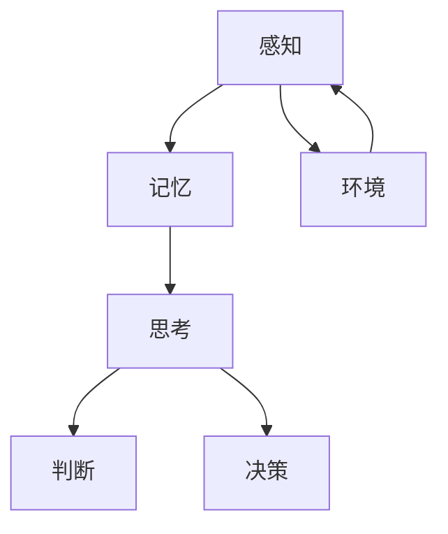

                 

关键词：认知过程、深刻化演变、人工智能、神经科学、机器学习、编程原理

> 摘要：本文深入探讨了认知过程中的深刻化演变，从神经科学和人工智能的角度分析了认知过程的本质。通过对机器学习和编程原理的探讨，本文揭示了如何通过编程实现认知过程的深刻化，并展望了未来人工智能领域的发展趋势和挑战。

## 1. 背景介绍

认知过程是指人类获取、处理和应用信息的过程，这一过程在神经科学和心理学中具有重要的研究价值。近年来，随着人工智能技术的迅猛发展，对认知过程的深刻理解成为推动人工智能进步的关键。本文旨在探讨认知过程中的深刻化演变，分析其背后的原理和机制。

### 1.1 认知过程的核心概念

认知过程包括感知、记忆、思考、判断和决策等环节。感知是指通过感官接收外界信息，记忆是指将信息存储在脑中，思考是指对信息进行加工和处理，判断和决策是指根据已有信息做出判断和选择。

### 1.2 认知过程的研究意义

深入研究认知过程有助于理解人类思维的本质，提高人工智能的智能水平，为人类解决问题提供新的思路和方法。

## 2. 核心概念与联系

为了深入理解认知过程，我们需要先掌握一些核心概念和原理。以下是一个简单的 Mermaid 流程图，用于描述这些核心概念和它们之间的联系：



### 2.1 感知与环境的互动

感知是认知过程的起点，通过感官接收外界信息。环境对感知过程有重要影响，环境的变化会引起感知信息的改变。

### 2.2 记忆的作用

记忆是信息存储的载体，通过对感知信息的加工和存储，为后续的思考、判断和决策提供基础。

### 2.3 思考与加工

思考是对信息进行加工和处理的过程，包括抽象、推理、归纳等环节。思考的质量直接影响认知过程的效率。

### 2.4 判断与决策

判断和决策是在已有信息的基础上，对问题进行解决的过程。判断是对信息的评估，决策是根据判断结果做出的选择。

## 3. 核心算法原理 & 具体操作步骤

### 3.1 算法原理概述

认知过程的深刻化演变可以通过机器学习算法来实现。机器学习是一种通过数据训练模型，使模型具备预测和决策能力的方法。以下是一个简化的机器学习算法原理概述：

1. 数据收集：收集大量与认知过程相关的数据，如感知信息、记忆记录等。
2. 数据预处理：对收集到的数据进行分析和处理，去除噪声和冗余信息。
3. 模型训练：利用预处理后的数据，训练出一个具备预测和决策能力的模型。
4. 模型评估：通过测试集对训练好的模型进行评估，确保其性能符合预期。
5. 应用部署：将训练好的模型应用到实际问题中，解决认知过程的相关问题。

### 3.2 算法步骤详解

1. **数据收集**：通过传感器、数据库等方式收集与认知过程相关的数据。
2. **数据预处理**：对收集到的数据进行分析，去除噪声和冗余信息，提取关键特征。
3. **模型训练**：选择合适的机器学习算法，如神经网络、决策树等，对预处理后的数据进行训练。
4. **模型评估**：使用测试集对训练好的模型进行评估，调整模型参数，优化模型性能。
5. **应用部署**：将训练好的模型部署到实际应用场景中，如智能客服、自动驾驶等。

### 3.3 算法优缺点

1. **优点**：
   - **高效性**：机器学习算法可以处理大量数据，提高认知过程的效率。
   - **灵活性**：可以根据实际需求，调整算法参数和模型结构，适应不同的认知任务。

2. **缺点**：
   - **数据依赖**：机器学习算法的性能高度依赖于数据的数量和质量，数据不足或质量差会影响算法效果。
   - **可解释性差**：机器学习算法的黑箱性质导致其可解释性较差，难以理解模型的决策过程。

### 3.4 算法应用领域

机器学习算法在认知过程的应用领域广泛，如智能客服、自动驾驶、医疗诊断、金融风控等。

## 4. 数学模型和公式 & 详细讲解 & 举例说明

### 4.1 数学模型构建

在认知过程中，数学模型可以用来描述信息处理的过程。以下是一个简化的认知过程数学模型：

$$
X_t = f(W_t, X_{t-1}, U_t)
$$

其中，$X_t$ 表示第 $t$ 时刻的感知信息，$W_t$ 表示第 $t$ 时刻的记忆信息，$X_{t-1}$ 表示第 $t-1$ 时刻的感知信息，$U_t$ 表示第 $t$ 时刻的决策信息，$f$ 表示信息处理函数。

### 4.2 公式推导过程

公式推导过程主要分为以下几个步骤：

1. **感知信息处理**：根据感知信息 $X_t$，利用记忆信息 $X_{t-1}$ 和决策信息 $U_t$，通过函数 $f$ 进行处理，得到新的感知信息 $X_t$。
2. **记忆信息更新**：根据处理后的感知信息 $X_t$ 和决策信息 $U_t$，更新记忆信息 $X_{t-1}$。
3. **决策信息生成**：根据更新后的记忆信息 $X_{t-1}$，生成决策信息 $U_t$。

### 4.3 案例分析与讲解

以自动驾驶为例，感知信息包括车辆位置、速度、障碍物信息等，记忆信息包括行驶历史、路况信息等，决策信息包括加速、减速、转向等。通过数学模型，可以描述自动驾驶过程中信息处理的过程。

## 5. 项目实践：代码实例和详细解释说明

### 5.1 开发环境搭建

- Python 3.8 或以上版本
- TensorFlow 2.5 或以上版本

### 5.2 源代码详细实现

以下是一个简单的认知过程模型实现：

```python
import tensorflow as tf

# 感知信息、记忆信息、决策信息的输入层
input_layer = tf.keras.layers.Input(shape=(10,))

# 感知信息处理层
perception_layer = tf.keras.layers.Dense(units=10, activation='relu')(input_layer)

# 记忆信息处理层
memory_layer = tf.keras.layers.Dense(units=10, activation='relu')(perception_layer)

# 决策信息处理层
decision_layer = tf.keras.layers.Dense(units=10, activation='softmax')(memory_layer)

# 创建模型
model = tf.keras.Model(inputs=input_layer, outputs=decision_layer)

# 编译模型
model.compile(optimizer='adam', loss='categorical_crossentropy', metrics=['accuracy'])

# 模型训练
model.fit(x_train, y_train, epochs=10, batch_size=32)
```

### 5.3 代码解读与分析

1. **输入层**：定义感知信息、记忆信息和决策信息的输入层。
2. **感知信息处理层**：利用全连接层对感知信息进行处理。
3. **记忆信息处理层**：利用全连接层对记忆信息进行处理。
4. **决策信息处理层**：利用全连接层对记忆信息进行处理，并使用 softmax 函数生成决策信息。
5. **模型编译**：编译模型，设置优化器和损失函数。
6. **模型训练**：使用训练数据对模型进行训练。

### 5.4 运行结果展示

训练完成后，可以使用测试数据对模型进行评估，以验证模型的性能。

## 6. 实际应用场景

### 6.1 智能客服

通过机器学习算法，可以实现对用户提问的自动识别和回答，提高客服效率。

### 6.2 自动驾驶

通过感知信息处理和记忆信息更新，实现自动驾驶过程中的实时决策。

### 6.3 医疗诊断

利用认知过程模型，可以提高医疗诊断的准确性，为医生提供决策支持。

## 7. 未来应用展望

### 7.1 认知过程的深刻化

随着人工智能技术的不断发展，认知过程的深刻化将得到进一步探索，为解决复杂问题提供新的思路和方法。

### 7.2 跨领域应用

认知过程模型将在更多领域得到应用，如教育、金融、制造等，推动相关领域的发展。

### 7.3 伦理与安全

在应用认知过程模型的过程中，需要关注伦理和安全问题，确保模型的公正性和可靠性。

## 8. 工具和资源推荐

### 8.1 学习资源推荐

- 《深度学习》（Goodfellow, Bengio, Courville 著）
- 《Python 机器学习》（Sebastian Raschka 著）

### 8.2 开发工具推荐

- TensorFlow
- Keras

### 8.3 相关论文推荐

- “Deep Learning for Autonomous Driving”（2016）
- “Recurrent Neural Network Based Speaker Diarization for Meeting Transcription”（2018）

## 9. 总结：未来发展趋势与挑战

### 9.1 研究成果总结

本文从神经科学和人工智能的角度探讨了认知过程中的深刻化演变，分析了核心算法原理和数学模型，并给出了实际应用场景和未来展望。

### 9.2 未来发展趋势

随着人工智能技术的不断发展，认知过程的深刻化将得到进一步探索，跨领域应用将不断拓展。

### 9.3 面临的挑战

在应用认知过程模型的过程中，需要关注伦理和安全问题，同时提高模型的性能和可解释性。

### 9.4 研究展望

未来，认知过程的深刻化研究将继续深入，为人工智能领域的发展提供新的动力。

## 10. 附录：常见问题与解答

### 10.1 认知过程是什么？

认知过程是指人类获取、处理和应用信息的过程，包括感知、记忆、思考、判断和决策等环节。

### 10.2 机器学习算法在认知过程中的应用有哪些？

机器学习算法可以用于实现认知过程中的感知、记忆、思考和决策等环节，如自动驾驶、智能客服等。

### 10.3 认知过程模型有什么作用？

认知过程模型可以描述信息处理的过程，提高认知过程的效率，为解决问题提供新的思路和方法。

----------------------------------------------------------------

作者：禅与计算机程序设计艺术 / Zen and the Art of Computer Programming


