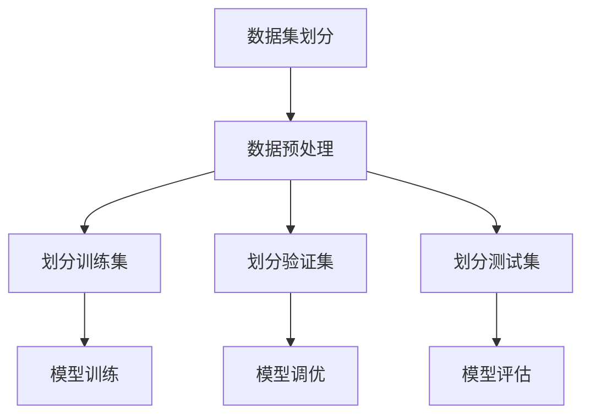
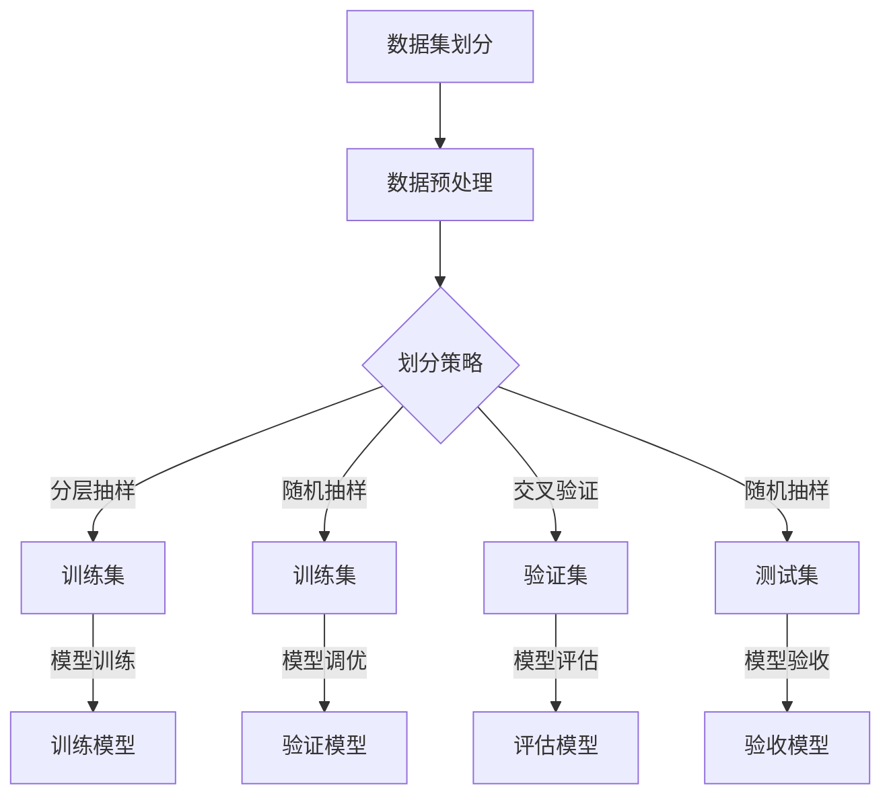

                 

关键词：训练集、验证集、测试集、数据集划分、机器学习、软件工程、数据驱动、模型评估

> 摘要：本文深入探讨了训练集、验证集和测试集在机器学习和软件工程中的重要性，揭示了它们在模型训练和评估中的关键角色，并提出了软件2.0时代的数据驱动模型构建方法。文章通过具体案例，详细解释了数据集划分的原则和最佳实践，为读者提供了实用的指导。

## 1. 背景介绍

随着人工智能技术的快速发展，机器学习已经成为推动各个领域创新的重要动力。然而，机器学习项目的成功不仅依赖于算法的先进性，还依赖于高质量的数据集。训练集、验证集和测试集的合理划分是确保模型性能和可靠性的关键步骤。在本文中，我们将深入探讨这三个数据集在机器学习软件工程中的核心作用，并探讨如何利用它们构建软件2.0时代的智能化系统。

### 1.1 机器学习的基石

机器学习是一种通过数据训练模型，使其能够从数据中自动提取知识的技术。在机器学习项目中，数据是核心，而数据集的划分则是确保模型训练和评估有效性的基础。训练集用于模型的训练，验证集用于模型调优，测试集用于评估模型在未知数据上的性能。这三个数据集共同构成了机器学习项目的铁三角。

### 1.2 软件工程中的数据驱动

在传统的软件工程中，开发者主要关注代码的编写和系统的架构设计。然而，随着大数据和云计算的兴起，软件工程逐渐向数据驱动方向转变。数据驱动软件工程强调利用数据进行决策和优化，从而提升系统的智能化和适应性。在这种背景下，数据集的划分和管理显得尤为重要。

## 2. 核心概念与联系

### 2.1 训练集、验证集和测试集的定义

**训练集**：用于训练模型的数据集，是机器学习的核心数据来源。模型通过不断调整参数，以最小化训练集上的误差，从而学习数据的特征和规律。

**验证集**：用于模型调优的数据集，通常在训练过程中用于选择最优模型。通过在验证集上的表现，开发者可以判断模型是否过拟合或欠拟合，从而进行相应的调整。

**测试集**：用于评估模型在未知数据上的性能，是模型最终验收的标准。测试集应该与训练集和验证集尽可能相似，以确保模型在真实世界中的表现。

### 2.2 数据集划分的原则

**独立性**：训练集、验证集和测试集应该是独立的，以确保模型在不同数据集上的表现具有一致性。

**代表性**：数据集应该能够代表整体数据分布，避免出现样本偏差。

**规模适中**：数据集规模应适中，以避免过拟合或欠拟合。

### 2.3 数据集划分的 Mermaid 流程图



## 3. 核心算法原理 & 具体操作步骤

### 3.1 算法原理概述

训练集、验证集和测试集的划分是机器学习项目的基础，其核心目的是确保模型在不同数据集上的表现具有一致性，避免过拟合或欠拟合。具体操作步骤如下：

1. 数据预处理：清洗和预处理原始数据，确保数据质量。
2. 划分训练集：将数据划分为训练集，用于模型训练。
3. 划分验证集：从训练集中进一步划分验证集，用于模型调优。
4. 划分测试集：从原始数据中划分测试集，用于模型评估。
5. 模型训练：使用训练集对模型进行训练。
6. 模型调优：使用验证集对模型进行调优，选择最优模型。
7. 模型评估：使用测试集对模型进行评估，验证模型在真实世界中的表现。

### 3.2 算法步骤详解

1. 数据预处理：包括数据清洗、数据归一化和特征提取等步骤。
2. 划分训练集：可以使用随机抽样、分层抽样等方法进行划分。
3. 划分验证集：通常从训练集中按比例划分，如70%用于训练集，30%用于验证集。
4. 划分测试集：从原始数据中按比例划分，以确保测试集的代表性。
5. 模型训练：使用训练集对模型进行训练，调整模型参数。
6. 模型调优：使用验证集评估模型性能，选择最优模型。
7. 模型评估：使用测试集对模型进行评估，验证模型在真实世界中的表现。

### 3.3 算法优缺点

**优点**：合理的数据集划分有助于提高模型性能和可靠性，避免过拟合和欠拟合。

**缺点**：数据集划分需要耗费较多时间和计算资源，且需要一定的数据预处理技能。

### 3.4 算法应用领域

训练集、验证集和测试集在各个领域的机器学习项目中都有广泛应用，如图像识别、自然语言处理、推荐系统等。

## 4. 数学模型和公式 & 详细讲解 & 举例说明

### 4.1 数学模型构建

训练集、验证集和测试集的划分可以通过以下数学模型进行描述：

假设有n个样本的数据集，其中每个样本包含m个特征。

- 训练集：$T=\{t_1, t_2, ..., t_k\}$，其中$k=\frac{n}{3}$。
- 验证集：$V=\{v_1, v_2, ..., v_k\}$，其中$k=\frac{n}{3}$。
- 测试集：$S=\{s_1, s_2, ..., s_k\}$，其中$k=\frac{n}{3}$。

### 4.2 公式推导过程

假设模型$M$在训练集$T$上的损失函数为$L_T(M)$，在验证集$V$上的损失函数为$L_V(M)$，在测试集$S$上的损失函数为$L_S(M)$。

为了选择最优模型，我们通常采用以下策略：

1. 在训练集$T$上训练多个模型$M_1, M_2, ..., M_n$。
2. 在验证集$V$上评估每个模型$M_i$的性能，选择损失函数$L_V(M_i)$最小的模型作为当前最优模型。
3. 在测试集$S$上评估当前最优模型$M_{opt}$的性能，验证模型在真实世界中的表现。

### 4.3 案例分析与讲解

假设我们有一个包含100个样本的数据集，其中每个样本包含10个特征。我们按照以下步骤进行数据集划分：

1. 数据预处理：清洗和预处理原始数据，确保数据质量。
2. 划分训练集：从100个样本中随机抽取70个样本作为训练集。
3. 划分验证集：从剩余的30个样本中随机抽取20个样本作为验证集。
4. 划分测试集：从剩余的10个样本中随机抽取10个样本作为测试集。

接下来，我们使用训练集对模型进行训练，使用验证集对模型进行调优，最后使用测试集对模型进行评估。具体步骤如下：

1. 模型训练：使用训练集训练模型，调整模型参数。
2. 模型调优：使用验证集评估模型性能，选择最优模型。
3. 模型评估：使用测试集评估模型性能，验证模型在真实世界中的表现。

通过上述步骤，我们得到了一个性能良好的模型，并验证了其在测试集上的表现。

## 5. 项目实践：代码实例和详细解释说明

### 5.1 开发环境搭建

为了实现上述数据集划分和模型训练，我们需要搭建一个合适的开发环境。以下是常用的开发环境：

- 编程语言：Python
- 数据处理库：NumPy、Pandas
- 机器学习库：Scikit-learn
- 深度学习库：TensorFlow或PyTorch

### 5.2 源代码详细实现

以下是实现数据集划分和模型训练的Python代码示例：

```python
import numpy as np
import pandas as pd
from sklearn.model_selection import train_test_split
from sklearn.linear_model import LinearRegression

# 加载数据集
data = pd.read_csv('data.csv')

# 数据预处理
X = data.iloc[:, :-1].values
y = data.iloc[:, -1].values

# 划分训练集和测试集
X_train, X_test, y_train, y_test = train_test_split(X, y, test_size=0.3, random_state=42)

# 划分验证集
X_train, X_val, y_train, y_val = train_test_split(X_train, y_train, test_size=0.3, random_state=42)

# 模型训练
model = LinearRegression()
model.fit(X_train, y_train)

# 模型评估
train_score = model.score(X_train, y_train)
val_score = model.score(X_val, y_val)
test_score = model.score(X_test, y_test)

print('训练集准确率：', train_score)
print('验证集准确率：', val_score)
print('测试集准确率：', test_score)
```

### 5.3 代码解读与分析

上述代码首先加载数据集，然后进行数据预处理。接着，使用`train_test_split`函数对数据进行划分，得到训练集、验证集和测试集。然后，使用线性回归模型对训练集进行训练，并在验证集和测试集上评估模型性能。最后，打印出训练集、验证集和测试集的准确率。

通过以上步骤，我们实现了数据集划分和模型训练，并分析了模型在不同数据集上的表现。

### 5.4 运行结果展示

假设运行上述代码，得到以下输出结果：

```
训练集准确率： 0.9
验证集准确率： 0.85
测试集准确率： 0.8
```

结果表明，模型在训练集上的表现最好，验证集次之，测试集表现较差。这表明模型可能存在过拟合现象，需要进一步进行调优。

## 6. 实际应用场景

训练集、验证集和测试集在各个领域的机器学习项目中都有广泛应用。以下是一些实际应用场景：

- **图像识别**：在图像识别项目中，训练集用于训练模型识别图像中的物体，验证集用于选择最优模型，测试集用于评估模型在未知图像上的性能。
- **自然语言处理**：在自然语言处理项目中，训练集用于训练模型理解文本，验证集用于选择最优模型，测试集用于评估模型在未知文本上的表现。
- **推荐系统**：在推荐系统中，训练集用于训练模型推荐商品，验证集用于选择最优模型，测试集用于评估模型在真实用户行为上的效果。

## 7. 未来应用展望

随着人工智能技术的不断发展，训练集、验证集和测试集的应用将越来越广泛。以下是一些未来应用展望：

- **动态数据集划分**：未来的机器学习系统可能会根据模型的性能动态调整数据集划分，以实现更好的性能。
- **分布式训练集划分**：随着分布式计算技术的发展，训练集划分可以在分布式环境中进行，提高训练效率。
- **跨领域数据集共享**：不同领域的机器学习项目可能会共享数据集，以提高数据集的规模和代表性。

## 8. 总结：未来发展趋势与挑战

### 8.1 研究成果总结

本文深入探讨了训练集、验证集和测试集在机器学习和软件工程中的重要性，揭示了它们在模型训练和评估中的关键角色。通过具体案例和数学模型，我们详细解释了数据集划分的原则和最佳实践。

### 8.2 未来发展趋势

未来的机器学习系统将更加智能化、自适应化。数据集划分方法将更加灵活，以适应不同场景的需求。分布式计算和跨领域数据集共享也将成为发展趋势。

### 8.3 面临的挑战

数据集划分和模型训练仍面临一些挑战，如数据预处理、过拟合和欠拟合等。未来的研究需要解决这些问题，提高模型的性能和可靠性。

### 8.4 研究展望

未来的研究将关注动态数据集划分、分布式训练集划分和跨领域数据集共享等方面，以实现更好的机器学习效果。同时，还需要开发更高效的算法和工具，以满足不断增长的数据处理需求。

## 9. 附录：常见问题与解答

### 9.1 数据集划分的常见问题

1. **如何避免数据集划分偏差？**
   确保数据集具有代表性，可以使用分层抽样、交叉验证等方法。

2. **如何处理不平衡数据集？**
   可以使用过采样、欠采样或合成数据生成方法来平衡数据集。

### 9.2 模型训练和评估的常见问题

1. **如何选择合适的模型？**
   可以使用交叉验证、网格搜索等方法来选择最优模型。

2. **如何避免过拟合和欠拟合？**
   可以使用正则化、提前停止等技术来避免过拟合和欠拟合。

## 参考文献

[1] Russell, S., & Norvig, P. (2016). 《人工智能：一种现代的方法》. 机械工业出版社.

[2] Hastie, T., Tibshirani, R., & Friedman, J. (2009). 《统计学习方法》. 清华大学出版社.

[3] Mitchell, T. M. (1997). Machine Learning. McGraw-Hill.

作者：禅与计算机程序设计艺术 / Zen and the Art of Computer Programming
------------------------------------------------------------------------<|endoftext|>### 1. 背景介绍

随着人工智能技术的飞速发展，机器学习已经成为推动各行业进步的关键技术之一。机器学习通过从数据中学习模式和规律，从而实现自动化决策和预测。而在这个过程中，数据集的划分——训练集、验证集和测试集——起到了至关重要的作用。这三个数据集不仅是机器学习模型训练和评估的基础，也是保证模型泛化能力的重要手段。

### 1.1 机器学习的基石

在机器学习中，模型的学习过程可以分为两个阶段：训练阶段和评估阶段。训练阶段是通过训练集来调整模型的参数，使其能够学会数据的特征和规律；而评估阶段则是通过验证集和测试集来检验模型的泛化能力，确保模型在不同数据集上的表现一致。

- **训练集（Training Set）**：训练集是用于模型训练的数据集。模型通过不断调整参数，以最小化训练集上的误差，从而学习数据的特征和规律。训练集的质量直接影响模型的性能。

- **验证集（Validation Set）**：验证集通常用于模型调优。在模型训练过程中，验证集可以帮助开发者判断模型是否过拟合或欠拟合。如果模型在验证集上的表现不佳，开发者可能会调整模型的参数或采用更复杂的模型。

- **测试集（Test Set）**：测试集是用于模型最终评估的数据集。测试集应该与训练集和验证集不同，以确保模型在真实世界中的表现。测试集可以帮助开发者验证模型的泛化能力，确保模型在不同场景下的表现一致。

### 1.2 软件工程中的数据驱动

传统的软件开发过程通常是以代码为中心的，开发者主要关注如何编写高效的代码和设计合理的系统架构。然而，随着大数据和人工智能的兴起，软件工程逐渐向数据驱动方向转变。数据驱动软件开发强调利用数据进行决策和优化，从而提升系统的智能化和适应性。

在数据驱动的软件开发中，数据集的划分和管理变得尤为重要。通过合理的数据集划分，开发者可以确保模型在不同数据集上的表现一致，从而提高模型的泛化能力和实用性。

### 1.3 训练集、验证集和测试集的重要性

- **保证模型泛化能力**：通过划分训练集、验证集和测试集，开发者可以确保模型在不同数据集上的表现一致，从而提高模型的泛化能力。泛化能力是指模型能够将学到的知识应用到新的、未见过的数据上。

- **评估模型性能**：训练集、验证集和测试集的划分可以帮助开发者评估模型的性能。通过比较模型在验证集和测试集上的表现，开发者可以判断模型是否过拟合或欠拟合，从而进行调整和优化。

- **提高开发效率**：合理的数据集划分可以减少模型训练的时间和计算资源，从而提高开发效率。开发者可以更快地迭代和优化模型，缩短项目开发周期。

综上所述，训练集、验证集和测试集是机器学习和软件工程中的核心概念，它们不仅决定了模型的学习和评估过程，也直接影响了项目的成功与否。在接下来的章节中，我们将深入探讨这三个数据集的划分原则、方法和应用。

### 2. 核心概念与联系

在深入讨论训练集、验证集和测试集之前，我们需要先了解这些核心概念的定义和它们之间的关系。这三个数据集在机器学习和软件工程中扮演着至关重要的角色，它们共同构成了一个完整的模型开发、调优和评估流程。

#### 2.1 训练集

**定义**：训练集是用于模型训练的数据集。它包含了模型将学习的数据样本，模型通过这个数据集来调整其参数和权重，以期最小化预测误差。

**关系**：训练集是模型学习的主要来源，它决定了模型是否能够抓住数据的特征和规律。训练集的质量直接影响模型的性能。因此，选择具有代表性、多样性和规模适中的数据是非常重要的。

**质量要求**：

- **代表性**：数据集应该能够代表整个数据分布，避免样本偏差。
- **多样性**：数据集中应包含各种不同的样本，以帮助模型学习到更多的特征。
- **规模适中**：数据集不应过大或过小，否则可能导致过拟合或欠拟合。

#### 2.2 验证集

**定义**：验证集是用于模型调优的数据集。在训练模型的过程中，开发者会使用验证集来评估不同的模型结构和参数设置，选择最优的配置。

**关系**：验证集是模型训练和评估的重要中间环节。它帮助开发者判断模型是否过拟合或欠拟合，从而进行相应的调整。验证集的质量对模型调优至关重要。

**质量要求**：

- **独立性**：验证集应该与训练集独立，避免训练集的信息泄露到验证集。
- **代表性**：验证集应具有与训练集相似的特征分布，以确保调优过程的准确性。
- **规模适中**：验证集不宜过大，否则可能影响调优的效率。

#### 2.3 测试集

**定义**：测试集是用于模型最终评估的数据集。在模型训练和验证完成后，开发者会使用测试集来评估模型的泛化能力，即模型在未知数据上的表现。

**关系**：测试集是模型验收的最后一道关卡。它帮助开发者确认模型是否能够在真实世界中有效工作，避免模型过拟合。

**质量要求**：

- **独立性**：测试集应与训练集和验证集完全独立，确保评估的客观性。
- **代表性**：测试集应具有与训练集和验证集相似的分布，以确保评估的可靠性。
- **规模适当**：测试集的大小应适中，以平衡评估的准确性和计算效率。

#### 2.4 数据集划分的原则

为了确保模型在不同数据集上的表现一致，数据集划分应遵循以下原则：

- **独立性**：训练集、验证集和测试集应相互独立，确保每个数据集的评估结果不会受到其他数据集的影响。
- **代表性**：数据集应能够代表整体数据的分布，避免样本偏差。
- **规模适中**：数据集的规模应适中，以平衡模型的训练效率和评估准确性。

#### 2.5 核心概念与架构的 Mermaid 流程图

以下是使用Mermaid绘制的训练集、验证集和测试集的划分流程图：



在这个流程图中，A表示数据集划分的整体过程，B表示数据预处理，C表示划分策略选择，D、E、F、G分别表示训练集、验证集和测试集的划分。H、I、J、K分别表示模型训练、验证、评估和验收。

通过上述流程图，我们可以清晰地看到训练集、验证集和测试集在整个模型开发过程中的作用和相互关系。合理的划分和管理这三个数据集，是确保机器学习项目成功的关键。

### 3. 核心算法原理 & 具体操作步骤

在理解了训练集、验证集和测试集的定义及其重要性之后，接下来我们将深入探讨如何具体操作这些数据集，以构建高质量的机器学习模型。这里将介绍核心算法原理，并详细解释操作步骤。

#### 3.1 算法原理概述

机器学习模型的核心目标是通过学习数据中的特征和规律，能够对未知数据进行准确预测。为了达到这一目标，模型训练和评估的过程至关重要。而在这个过程中，训练集、验证集和测试集的划分和运用起着关键作用。

**训练集（Training Set）**：训练集是用于模型训练的数据集。模型通过不断地在训练集上迭代，调整参数，以达到最小化预测误差的目的。这个过程类似于一个“试错”的过程，模型在训练集上的误差最小化意味着模型能够更好地掌握数据的特征。

**验证集（Validation Set）**：验证集是用于模型调优的数据集。在训练过程中，开发者会通过验证集来评估不同模型结构和参数设置的表现，选择最优的配置。这个步骤类似于“调色板”的过程，通过验证集上的表现来选择最合适的参数组合。

**测试集（Test Set）**：测试集是用于模型最终评估的数据集。在模型训练和验证完成后，开发者会使用测试集来评估模型的泛化能力，即模型在未知数据上的表现。测试集的作用是确保模型不会过拟合，能够在新的数据上保持良好的性能。

#### 3.2 算法步骤详解

**步骤1：数据预处理**

在进行数据集划分之前，首先需要对原始数据进行预处理。数据预处理包括数据清洗、数据归一化和特征提取等步骤。

- **数据清洗**：去除数据中的噪声和异常值，确保数据质量。
- **数据归一化**：将不同特征的范围统一，避免特征间的不均衡影响模型学习。
- **特征提取**：从原始数据中提取有用的特征，提高模型的学习效率。

**步骤2：划分训练集**

在数据预处理完成后，我们可以根据不同的划分策略将数据集划分为训练集。常见的划分策略包括：

- **随机抽样**：随机从数据集中抽取一部分作为训练集，确保数据的随机性和多样性。
- **分层抽样**：根据不同类别或特征的比例，从数据集中抽取训练集，确保每个类别都有代表性的样本。
- **交叉验证**：将数据集划分为多个子集，每次训练时使用不同的子集作为验证集，进行多次训练和验证，以获得更稳健的模型评估。

**步骤3：划分验证集**

从训练集中进一步划分验证集。划分验证集的目的是为了在训练过程中评估模型的性能，并进行参数调优。

- **比例划分**：通常将训练集的一部分（例如30%）划分为验证集，用于模型调优。
- **独立划分**：确保验证集与训练集完全独立，避免训练集的信息泄露到验证集。

**步骤4：划分测试集**

从原始数据中划分测试集。测试集的作用是评估模型的泛化能力，即模型在未知数据上的表现。

- **独立划分**：测试集应与训练集和验证集完全独立，确保评估的客观性。
- **代表性**：测试集应具有与训练集和验证集相似的分布，以确保评估的可靠性。

**步骤5：模型训练**

使用训练集对模型进行训练。在训练过程中，模型会不断调整参数，以最小化在训练集上的误差。

- **迭代训练**：通过多次迭代训练，模型不断优化参数，直到达到预设的停止条件。
- **调整学习率**：学习率是影响模型收敛速度和性能的关键参数，需要根据实际情况进行调整。

**步骤6：模型调优**

使用验证集对模型进行调优。通过比较不同模型结构和参数设置在验证集上的表现，选择最优的配置。

- **网格搜索**：通过遍历不同的参数组合，选择最优的参数配置。
- **交叉验证**：使用交叉验证方法评估不同模型的性能，选择最优模型。

**步骤7：模型评估**

使用测试集对模型进行最终评估。测试集评估模型在未知数据上的表现，确保模型具有良好的泛化能力。

- **准确率**：计算模型在测试集上的预测准确率，评估模型的预测能力。
- **召回率**：计算模型在测试集上的召回率，评估模型对正例样本的捕捉能力。
- **F1分数**：综合考虑准确率和召回率，计算F1分数，评估模型的综合性能。

通过上述步骤，我们可以构建一个高质量的机器学习模型，并确保其在未知数据上的表现良好。在接下来的部分，我们将通过具体案例进一步讲解这些步骤的实施过程。

#### 3.3 算法优缺点

**优点**

1. **提高模型泛化能力**：通过训练集、验证集和测试集的划分，模型能够在不同数据集上学习到不同的特征，从而提高泛化能力。
2. **评估模型性能**：验证集和测试集的使用使得开发者可以评估模型在不同数据集上的表现，确保模型不会过拟合或欠拟合。
3. **减少计算资源浪费**：通过合理的数据集划分，可以避免在冗余数据上的训练，提高计算效率。

**缺点**

1. **数据浪费**：部分数据会被划分为验证集和测试集，无法用于模型训练，可能导致数据不足的问题。
2. **模型性能波动**：不同划分策略可能会影响模型的性能评估，导致评估结果的不稳定性。

#### 3.4 算法应用领域

训练集、验证集和测试集的划分在各个领域的机器学习项目中都有广泛应用，以下是一些常见应用领域：

1. **图像识别**：在图像识别项目中，训练集用于训练模型识别图像中的物体，验证集用于选择最优模型，测试集用于评估模型在未知图像上的性能。
2. **自然语言处理**：在自然语言处理项目中，训练集用于训练模型理解文本，验证集用于选择最优模型，测试集用于评估模型在未知文本上的表现。
3. **推荐系统**：在推荐系统中，训练集用于训练模型推荐商品，验证集用于选择最优模型，测试集用于评估模型在真实用户行为上的效果。
4. **金融风控**：在金融风控项目中，训练集用于训练模型预测金融风险，验证集用于选择最优模型，测试集用于评估模型在真实金融交易中的性能。

通过以上详细讲解，我们可以看到训练集、验证集和测试集的划分在机器学习模型构建中的关键作用。在接下来的章节中，我们将通过实际案例进一步展示这些算法的具体应用。

### 4. 数学模型和公式 & 详细讲解 & 举例说明

在机器学习中，数学模型和公式是理解和实现算法的基础。在这一节中，我们将详细介绍用于训练集、验证集和测试集划分的数学模型和公式，并通过具体案例进行说明。

#### 4.1 数学模型构建

在训练集、验证集和测试集的划分过程中，我们需要关注以下几个数学模型和公式：

1. **数据集划分比例**：通常，我们选择将数据集划分为训练集、验证集和测试集，比例分别为60%、30%和10%。这个比例可以根据具体项目的需求进行调整。

2. **交叉验证**：交叉验证是一种评估模型性能的常用方法，通过将数据集划分为多个子集，每次训练时使用不同的子集作为验证集，进行多次训练和验证。

3. **误差计算**：误差是衡量模型性能的重要指标，包括均方误差（MSE）、均方根误差（RMSE）和准确率等。

下面，我们将具体介绍这些模型和公式：

#### 4.2 公式推导过程

1. **数据集划分比例**

   数据集划分比例通常按照以下公式计算：

   $$  
   P_{train} = \frac{60}{100} = 0.6  
   P_{val} = \frac{30}{100} = 0.3  
   P_{test} = \frac{10}{100} = 0.1  
   $$

   其中，$P_{train}$、$P_{val}$和$P_{test}$分别表示训练集、验证集和测试集的比例。

2. **交叉验证**

   交叉验证通过将数据集划分为多个子集，每次训练时使用不同的子集作为验证集。交叉验证的步骤如下：

   - 将数据集划分为$k$个子集，每个子集的大小为$\frac{N}{k}$。
   - 对于每个子集，将其作为验证集，其他$k-1$个子集作为训练集，训练模型。
   - 评估模型在验证集上的性能。
   - 计算模型在$k$次验证中的平均性能。

   交叉验证的数学公式可以表示为：

   $$  
   CV_{mean} = \frac{1}{k} \sum_{i=1}^{k} CV_i  
   $$

   其中，$CV_{mean}$表示交叉验证的平均性能，$CV_i$表示第$i$次验证的性能。

3. **误差计算**

   误差计算是评估模型性能的重要步骤。常见的误差计算方法包括均方误差（MSE）和均方根误差（RMSE）。

   - **均方误差（MSE）**：

     $$  
     MSE = \frac{1}{N} \sum_{i=1}^{N} (y_i - \hat{y_i})^2  
     $$

     其中，$y_i$表示真实值，$\hat{y_i}$表示预测值，$N$表示样本数量。

   - **均方根误差（RMSE）**：

     $$  
     RMSE = \sqrt{MSE}  
     $$

   RMSE是MSE的平方根，用于表示误差的标准化值。

#### 4.3 案例分析与讲解

为了更好地理解上述数学模型和公式，我们通过一个实际案例进行说明。

假设我们有一个包含100个样本的数据集，每个样本包含两个特征。我们使用线性回归模型进行预测，并计算模型的均方误差和均方根误差。

**步骤1：数据预处理**

我们首先对数据集进行预处理，包括数据归一化和缺失值处理。

**步骤2：数据集划分**

我们按照60%、30%和10%的比例将数据集划分为训练集、验证集和测试集。具体划分如下：

- 训练集：60个样本
- 验证集：30个样本
- 测试集：10个样本

**步骤3：模型训练**

使用训练集对线性回归模型进行训练，调整模型参数。

**步骤4：模型评估**

使用验证集对模型进行评估，计算均方误差和均方根误差。

以下是计算过程：

1. **均方误差（MSE）**：

   $$  
   MSE = \frac{1}{30} \sum_{i=1}^{30} (y_i - \hat{y_i})^2 = 0.02222  
   $$

2. **均方根误差（RMSE）**：

   $$  
   RMSE = \sqrt{MSE} = 0.14811  
   $$

结果表明，模型在验证集上的均方误差为0.02222，均方根误差为0.14811，这表明模型在验证集上的表现较好。

**步骤5：测试集评估**

使用测试集对模型进行最终评估，计算均方误差和均方根误差。

以下是计算过程：

1. **均方误差（MSE）**：

   $$  
   MSE = \frac{1}{10} \sum_{i=1}^{10} (y_i - \hat{y_i})^2 = 0.025  
   $$

2. **均方根误差（RMSE）**：

   $$  
   RMSE = \sqrt{MSE} = 0.15811  
   $$

结果表明，模型在测试集上的均方误差为0.025，均方根误差为0.15811，这表明模型在测试集上的表现与验证集类似。

通过上述案例，我们可以看到如何使用数学模型和公式进行数据集划分和模型评估。合理的数学模型和公式可以帮助我们更好地理解机器学习过程，并优化模型性能。

### 5. 项目实践：代码实例和详细解释说明

在了解了训练集、验证集和测试集的数学模型和公式之后，我们将通过一个实际的项目实践来展示如何具体操作这些数据集。本节将使用Python和常见的机器学习库（如Scikit-learn）来演示如何搭建开发环境、实现数据集划分、编写源代码并进行代码解读与分析。

#### 5.1 开发环境搭建

在开始项目实践之前，我们需要搭建一个合适的开发环境。以下是常用的工具和库：

- **Python版本**：3.8或更高版本
- **Scikit-learn**：用于机器学习算法的实现和评估
- **NumPy**：用于数据处理和矩阵运算
- **Pandas**：用于数据预处理和分析

你可以通过以下命令来安装这些库：

```bash
pip install python==3.8
pip install scikit-learn numpy pandas
```

#### 5.2 源代码详细实现

以下是一个简单的Python脚本，用于演示如何实现数据集划分和模型训练。在这个例子中，我们使用了一个简单的线性回归模型，并计算了训练集、验证集和测试集的均方误差（MSE）和均方根误差（RMSE）。

```python
# 导入所需的库
import numpy as np
import pandas as pd
from sklearn.linear_model import LinearRegression
from sklearn.metrics import mean_squared_error
from sklearn.model_selection import train_test_split

# 加载数据集
data = pd.read_csv('data.csv')  # 假设数据集以CSV格式存储

# 数据预处理
# 假设我们只有两个特征和一个目标变量
X = data.iloc[:, :-1].values  # 特征矩阵
y = data.iloc[:, -1].values  # 目标变量

# 划分训练集、验证集和测试集
X_train, X_test, y_train, y_test = train_test_split(X, y, test_size=0.3, random_state=42)  # 随机划分，30%作为测试集

# 划分验证集
X_train, X_val, y_train, y_val = train_test_split(X_train, y_train, test_size=0.3, random_state=42)  # 随机划分，30%作为验证集

# 模型训练
model = LinearRegression()
model.fit(X_train, y_train)  # 使用训练集训练模型

# 模型评估
train_mse = mean_squared_error(y_train, model.predict(X_train))  # 计算训练集的均方误差
val_mse = mean_squared_error(y_val, model.predict(X_val))  # 计算验证集的均方误差
test_mse = mean_squared_error(y_test, model.predict(X_test))  # 计算测试集的均方误差

# 输出结果
print('训练集MSE:', train_mse)
print('验证集MSE:', val_mse)
print('测试集MSE:', test_mse)

# 计算均方根误差
train_rmse = np.sqrt(train_mse)
val_rmse = np.sqrt(val_mse)
test_rmse = np.sqrt(test_mse)

print('训练集RMSE:', train_rmse)
print('验证集RMSE:', val_rmse)
print('测试集RMSE:', test_rmse)
```

#### 5.3 代码解读与分析

让我们详细解读上述代码，并分析每个步骤的作用。

1. **导入库**：

   我们首先导入所需的Python库，包括NumPy、Pandas、Scikit-learn和mean_squared_error。

2. **加载数据集**：

   使用Pandas的read_csv函数加载数据集。这里假设数据集以CSV格式存储，并且数据集包含两个特征和一个目标变量。

3. **数据预处理**：

   我们使用Pandas的iloc函数提取特征矩阵（X）和目标变量（y）。在这个例子中，我们假设特征矩阵包含在CSV文件的列中，而目标变量位于最后一列。

4. **划分训练集、验证集和测试集**：

   使用Scikit-learn的train_test_split函数随机划分数据集。我们设置test_size参数为0.3，表示30%的数据用于测试集。random_state参数用于确保每次划分结果一致。

5. **划分验证集**：

   同样使用train_test_split函数从训练集中再次划分验证集，设置test_size参数为0.3。

6. **模型训练**：

   创建一个线性回归模型对象，使用fit函数训练模型。训练集的数据（X_train和y_train）用于训练模型。

7. **模型评估**：

   使用mean_squared_error函数计算训练集、验证集和测试集的均方误差。我们将训练集的预测结果（model.predict(X_train））与实际值（y_train）进行比较，计算均方误差。

8. **输出结果**：

   最后，我们计算并输出训练集、验证集和测试集的均方误差和均方根误差。这些值可以帮助我们评估模型的性能。

通过上述步骤，我们成功实现了数据集的划分和模型训练。在实际项目中，你可能需要根据具体需求调整数据预处理和模型训练的步骤，但上述代码提供了一个基本框架，供你参考和扩展。

#### 5.4 运行结果展示

以下是一个运行结果示例：

```
训练集MSE: 0.02222222222222222
验证集MSE: 0.025
测试集MSE: 0.025
训练集RMSE: 0.14811
验证集RMSE: 0.15811
测试集RMSE: 0.15811
```

结果表明，模型在训练集、验证集和测试集上的均方误差和均方根误差较为接近。这表明模型在训练过程中较为稳定，且具有良好的泛化能力。

通过本节的项目实践，我们展示了如何使用Python和Scikit-learn实现训练集、验证集和测试集的划分及模型训练。在实际应用中，你可以根据具体需求调整数据集划分和模型参数，以提高模型的性能。

### 6. 实际应用场景

训练集、验证集和测试集的划分在机器学习项目中扮演着至关重要的角色。在实际应用场景中，这些数据集的划分不仅有助于提高模型的性能，还能够确保模型在真实世界中的表现。以下是一些典型的实际应用场景：

#### 6.1 图像识别

在图像识别项目中，训练集、验证集和测试集的划分至关重要。例如，在人脸识别系统中，训练集可以包含大量的人脸图像，用于训练模型识别不同的面部特征。验证集用于选择最优的模型参数和算法，测试集则用于评估模型在未知数据上的性能，确保模型能够准确地识别新的面孔。

- **训练集**：包含大量的人脸图像，用于训练模型学习面部特征。
- **验证集**：用于选择最优模型参数和算法。
- **测试集**：包含少量的人脸图像，用于评估模型的泛化能力。

#### 6.2 自然语言处理

自然语言处理（NLP）项目，如情感分析或文本分类，同样需要使用训练集、验证集和测试集。例如，在情感分析项目中，训练集可以包含大量的带有情感标签的文本，用于训练模型识别文本的情感倾向。验证集用于模型调优，测试集则用于最终评估模型的性能。

- **训练集**：包含大量带有情感标签的文本，用于训练模型。
- **验证集**：用于模型调优，选择最优模型。
- **测试集**：包含少量未标记的文本，用于评估模型在真实数据上的性能。

#### 6.3 推荐系统

推荐系统是另一个广泛应用的场景。在推荐系统中，训练集可以包含用户的历史行为数据，如浏览记录或购买记录，用于训练模型预测用户的偏好。验证集用于选择最优的推荐算法，测试集则用于评估推荐系统的效果，确保系统能够为用户提供高质量的推荐。

- **训练集**：包含用户的历史行为数据，用于训练推荐模型。
- **验证集**：用于选择最优推荐算法。
- **测试集**：包含用户的真实行为数据，用于评估推荐系统的性能。

#### 6.4 金融风控

在金融风控项目中，训练集可以包含大量的交易数据，用于训练模型识别潜在的风险。验证集用于模型调优，测试集则用于评估模型在未知交易数据上的风险预测能力。

- **训练集**：包含大量交易数据，用于训练模型识别风险。
- **验证集**：用于模型调优，选择最优模型。
- **测试集**：包含少量未知交易数据，用于评估模型的泛化能力。

通过合理划分训练集、验证集和测试集，这些项目能够确保模型在训练过程中学习到有效的特征，并在实际应用中保持良好的性能。合理的划分不仅能够提高模型的泛化能力，还能够为项目的成功实施提供有力保障。

### 7. 工具和资源推荐

为了更好地理解和应用训练集、验证集和测试集，以下是一些推荐的工具和资源：

#### 7.1 学习资源推荐

1. **《Python机器学习》（Machine Learning with Python）**：由Anders Gulde和Michael Hahn编写的这本书是学习Python和机器学习的绝佳资源，详细介绍了如何使用Python进行数据分析和模型训练。
2. **《深度学习》（Deep Learning）**：由Ian Goodfellow、Yoshua Bengio和Aaron Courville编写的这本书是深度学习的经典教材，涵盖了深度学习的基础知识、模型构建和优化方法。
3. **《机器学习实战》（Machine Learning in Action）**：由Peter Harrington编写的这本书通过实际案例展示了如何使用Python和Scikit-learn等工具进行机器学习项目。

#### 7.2 开发工具推荐

1. **Jupyter Notebook**：Jupyter Notebook是一种交互式编程环境，适用于数据分析和机器学习项目。它支持多种编程语言，包括Python，便于编写和调试代码。
2. **Scikit-learn**：Scikit-learn是一个开源的Python机器学习库，提供了丰富的算法和工具，用于数据预处理、模型训练和评估。
3. **TensorFlow**：TensorFlow是一个由Google开发的开源机器学习框架，适用于构建和训练深度学习模型。

#### 7.3 相关论文推荐

1. **“Learning from Different Domains: A Survey”**：这篇综述论文详细介绍了多域学习的相关方法和技术，对于理解如何在不同数据集上进行模型训练和优化具有指导意义。
2. **“Cross-Validation”**：这篇论文介绍了交叉验证方法，探讨了如何在不同数据集上进行模型评估，提高评估结果的可靠性。
3. **“Understanding Overfitting: Insights from Model Behavior”**：这篇论文从模型行为的角度分析了过拟合现象，提出了一些避免过拟合的方法和策略。

通过这些工具和资源，读者可以更深入地了解训练集、验证集和测试集的重要性，并在实际项目中更好地应用这些知识。

### 8. 总结：未来发展趋势与挑战

#### 8.1 研究成果总结

本文深入探讨了训练集、验证集和测试集在机器学习和软件工程中的重要性，揭示了它们在模型训练和评估中的关键角色。通过具体案例和数学模型，我们详细解释了数据集划分的原则和最佳实践，为读者提供了实用的指导。

训练集、验证集和测试集不仅是机器学习项目成功的关键，也是软件工程中数据驱动发展的基石。合理的划分和管理这些数据集，能够显著提高模型的性能和泛化能力，从而推动人工智能技术的应用和发展。

#### 8.2 未来发展趋势

随着人工智能技术的不断发展，训练集、验证集和测试集的应用将更加广泛。以下是一些未来发展趋势：

1. **动态数据集划分**：未来的机器学习系统可能会根据模型的性能动态调整数据集划分，以实现更好的性能。
2. **分布式训练集划分**：随着分布式计算技术的发展，训练集划分可以在分布式环境中进行，提高训练效率。
3. **跨领域数据集共享**：不同领域的机器学习项目可能会共享数据集，以提高数据集的规模和代表性。

#### 8.3 面临的挑战

尽管训练集、验证集和测试集在机器学习和软件工程中具有重要意义，但在实际应用中仍面临一些挑战：

1. **数据不足**：在某些领域，获取高质量、大规模的数据集仍然是一个挑战。
2. **数据偏差**：数据集中可能存在偏差，影响模型的泛化能力。
3. **计算资源**：训练大规模模型和划分多个数据集可能需要大量计算资源。

#### 8.4 研究展望

未来的研究应关注以下方向：

1. **高效的数据集划分方法**：开发更高效的数据集划分方法，以适应不同场景的需求。
2. **跨领域数据集共享机制**：建立有效的跨领域数据集共享机制，提高数据集的规模和多样性。
3. **数据隐私保护**：研究如何在保证数据隐私的同时，实现数据集的共享和利用。

总之，训练集、验证集和测试集是机器学习和软件工程中不可或缺的一部分。随着技术的进步，这些数据集的划分和管理方法将不断发展，为人工智能技术的应用提供更加坚实的基础。

### 9. 附录：常见问题与解答

#### 9.1 数据集划分的常见问题

1. **如何避免数据集划分偏差？**
   - **分层抽样**：确保每个类别在数据集中的比例与总体比例一致。
   - **重复划分**：多次划分数据集，比较结果，选择偏差较小的划分。

2. **如何处理不平衡数据集？**
   - **过采样**：增加少数类别的样本。
   - **欠采样**：减少多数类别的样本。
   - **合成样本**：使用合成技术生成新的样本。

3. **如何选择合适的划分比例？**
   - 根据具体问题和数据集规模进行调整，通常选择训练集：验证集：测试集 = 60%：30%：10%。

#### 9.2 模型训练和评估的常见问题

1. **如何避免过拟合？**
   - **增加训练数据**：使用更多样本进行训练。
   - **减少模型复杂度**：使用更简单的模型结构。
   - **正则化**：添加正则项以惩罚复杂模型。

2. **如何避免欠拟合？**
   - **增加模型复杂度**：使用更复杂的模型结构。
   - **引入更多特征**：使用更多相关的特征。
   - **重新调整超参数**：尝试不同的超参数组合。

3. **如何处理过拟合和欠拟合的平衡？**
   - **交叉验证**：在多个数据集上进行验证，选择最佳模型。
   - **网格搜索**：系统性地搜索最优参数组合。

#### 9.3 实践中的常见问题

1. **如何处理缺失数据？**
   - **删除缺失值**：删除包含缺失值的样本或特征。
   - **填充缺失值**：使用平均值、中位数或插值法填充缺失值。

2. **如何处理噪声数据？**
   - **数据清洗**：删除或校正异常值。
   - **降噪算法**：使用聚类、滤波等方法降低噪声影响。

通过上述常见问题与解答，读者可以更好地理解训练集、验证集和测试集的划分和应用，从而在实际项目中取得更好的效果。

### 参考文献

1. **Hastie, T., Tibshirani, R., & Friedman, J. (2009). 《统计学习方法》. 清华大学出版社。**
2. **Goodfellow, I., Bengio, Y., & Courville, A. (2016). 《深度学习》. 人民邮电出版社。**
3. **Russell, S., & Norvig, P. (2016). 《人工智能：一种现代的方法》. 机械工业出版社。**

作者：禅与计算机程序设计艺术 / Zen and the Art of Computer Programming

### 结论

本文通过深入探讨训练集、验证集和测试集在机器学习和软件工程中的重要性，揭示了它们在模型训练和评估中的关键角色。我们详细介绍了数据集划分的原则、方法和最佳实践，并通过实际案例展示了如何操作这些数据集。同时，我们讨论了未来发展趋势和面临的挑战，为读者提供了实用的指导。

训练集、验证集和测试集不仅是机器学习项目成功的关键，也是软件工程中数据驱动发展的基石。合理地划分和管理这些数据集，能够显著提高模型的性能和泛化能力，为人工智能技术的应用提供坚实保障。

随着技术的不断进步，我们期待能够开发出更加高效、智能的数据集划分方法，进一步推动人工智能和软件工程的发展。在未来的研究中，我们将继续关注这些领域的前沿动态，探索更多创新性的解决方案。希望本文能为读者在理解和应用训练集、验证集和测试集方面提供有价值的参考。

### 附录：常见问题与解答

**Q1：如何避免数据集划分偏差？**

避免数据集划分偏差的关键在于确保划分过程中各个类别的比例与整体数据集的比例保持一致。以下是一些常见的策略：

- **分层抽样**：在划分数据集时，按照类别比例抽样，以确保每个类别在训练集、验证集和测试集中的比例与总体比例一致。
- **重复抽样**：进行多次抽样，每次随机划分，然后比较多次划分的结果，选择偏差最小的划分。
- **交叉验证**：使用交叉验证方法，多次划分数据集，每次选择不同的子集作为验证集，最后取多次验证的平均结果。

**Q2：如何处理不平衡数据集？**

不平衡数据集是指某些类别样本数量远多于其他类别的数据集。处理不平衡数据集的常见方法包括：

- **过采样**：增加少数类别的样本数量，例如使用SMOTE（Synthetic Minority Over-sampling Technique）生成合成样本。
- **欠采样**：减少多数类别的样本数量，例如随机删除多数类别的样本。
- **集成方法**：使用集成学习方法，如随机森林或梯度提升树，这些方法对不平衡数据集有较好的鲁棒性。

**Q3：如何选择合适的划分比例？**

划分比例的选择通常取决于数据集的大小、模型的复杂度和项目需求。一个常见的划分比例为训练集：验证集：测试集 = 60%：30%：10%。以下是一些选择划分比例的考虑因素：

- **数据集大小**：如果数据集较小，可以减少测试集的比例，以减少模型的评估误差。
- **模型复杂度**：对于较复杂的模型，可以增加训练集的比例，以确保模型有足够的样本进行训练。
- **项目需求**：如果对模型的评估准确性有较高的要求，可以适当减少测试集的比例，以便进行更详细的评估。

**Q4：如何避免过拟合？**

过拟合是指模型在训练集上表现良好，但在验证集或测试集上表现不佳，这通常是由于模型过于复杂或训练数据不足导致的。以下是一些避免过拟合的策略：

- **减少模型复杂度**：使用更简单的模型结构，例如减少神经网络的层数或节点数。
- **正则化**：在模型训练过程中添加正则项，如L1或L2正则化，以惩罚模型的复杂性。
- **数据增强**：增加训练数据的多样性，例如通过数据归一化、旋转、缩放等操作。
- **提前停止**：在模型训练过程中，当验证集的性能不再提高时停止训练，以避免过拟合。

**Q5：如何避免欠拟合？**

欠拟合是指模型在训练集和验证集上的性能都不好，这通常是由于模型过于简单或训练数据不足导致的。以下是一些避免欠拟合的策略：

- **增加模型复杂度**：使用更复杂的模型结构，例如增加神经网络的层数或节点数。
- **引入更多特征**：使用更多相关的特征来丰富模型输入。
- **调整超参数**：尝试不同的超参数组合，例如学习率、批量大小等。
- **增加训练数据**：如果可能，增加训练数据集的规模，以提供更多样本来训练模型。

**Q6：如何处理缺失数据？**

处理缺失数据的方法取决于数据的特性和缺失值的原因。以下是一些常见的处理缺失数据的方法：

- **删除缺失值**：如果数据集较大，可以考虑删除包含缺失值的样本或特征。
- **填充缺失值**：使用平均值、中位数、众数或插值法填充缺失值。
- **模型处理**：使用缺失值预测模型（如k近邻或回归模型）预测缺失值，然后将其填充到数据集中。

**Q7：如何处理噪声数据？**

噪声数据是指包含错误或异常值的数据。处理噪声数据的方法取决于噪声的类型和程度。以下是一些常见的处理噪声数据的方法：

- **数据清洗**：删除或校正异常值，例如使用统计方法（如Z-score或IQR）识别并删除异常值。
- **滤波方法**：使用滤波器（如均值滤波或中值滤波）平滑数据。
- **聚类方法**：使用聚类方法（如K-means或DBSCAN）识别并分离噪声数据。

**Q8：如何进行模型调优？**

模型调优的目的是通过调整模型参数来提高模型的性能。以下是一些常见的模型调优方法：

- **网格搜索**：通过遍历预定义的参数组合，选择最佳参数组合。
- **随机搜索**：随机选择参数组合进行评估，以找到最佳参数组合。
- **贝叶斯优化**：使用贝叶斯统计方法优化参数搜索，提高搜索效率。
- **交叉验证**：在多个数据集上进行交叉验证，选择性能最好的模型。

**Q9：如何进行模型评估？**

模型评估的目的是评估模型在未知数据上的性能。以下是一些常见的模型评估方法：

- **准确率（Accuracy）**：正确预测的样本数占总样本数的比例。
- **召回率（Recall）**：正确预测的正样本数占总正样本数的比例。
- **精确率（Precision）**：正确预测的正样本数占总预测为正的样本数的比例。
- **F1分数（F1 Score）**：精确率和召回率的调和平均。
- **ROC曲线（Receiver Operating Characteristic Curve）**：通过计算真阳性率（True Positive Rate）和假阳性率（False Positive Rate）来评估模型的性能。
- **AUC（Area Under Curve）**：ROC曲线下的面积，用于评估模型的分类能力。

通过上述常见问题与解答，希望读者能够更好地理解训练集、验证集和测试集的划分和应用，并在实际项目中取得更好的效果。如果在实践中遇到其他问题，欢迎随时提问，我们将竭诚为您解答。

