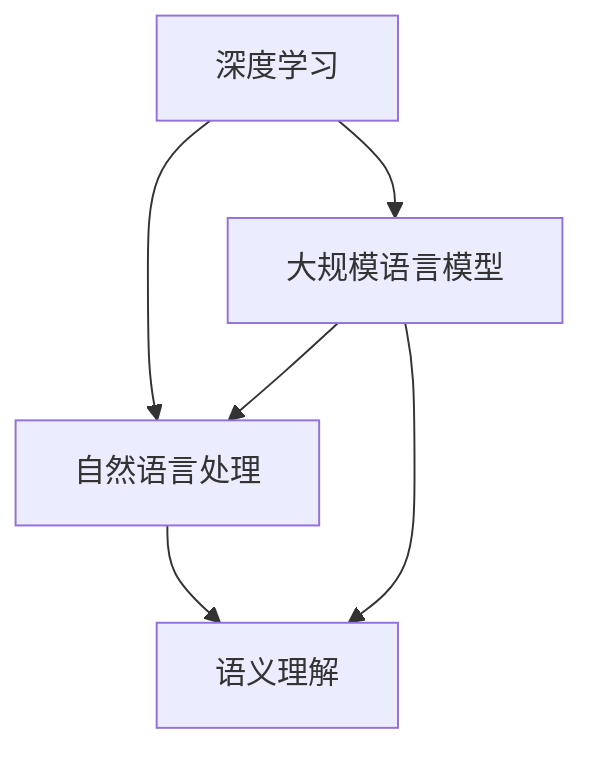

                 

关键词：自然语言处理、大模型、认知困境、语言理解、模型优化、未来应用

> 摘要：随着人工智能技术的不断发展，大规模语言模型在自然语言处理（NLP）领域取得了显著的成果。然而，这些模型在理解和生成语言方面仍然面临着诸多挑战，本文旨在探讨这些挑战的根源，分析现有方法的局限性，并提出未来的研究方向。

## 1. 背景介绍

### 1.1 大规模语言模型的发展

自然语言处理作为人工智能领域的重要分支，一直受到广泛关注。近年来，随着计算能力的提升和数据规模的扩大，大规模语言模型（如 GPT、BERT 等）在 NLP 任务中取得了惊人的表现。这些模型基于深度学习技术，通过对海量文本数据进行训练，能够实现文本分类、机器翻译、问答系统等多种 NLP 任务。

### 1.2 大规模语言模型的应用

大规模语言模型在多个领域得到了广泛应用，如智能客服、文本生成、内容审核等。这些应用不仅提升了人们的生产效率，还带来了新的商业模式和经济增长点。然而，随着模型规模的不断扩大，其复杂性和不确定性也日益增加。

## 2. 核心概念与联系

为了更好地理解大规模语言模型的工作原理，我们需要介绍几个核心概念：

### 2.1 深度学习

深度学习是一种基于神经网络的学习方法，通过多层神经网络对数据进行自动特征提取和模型优化。在自然语言处理领域，深度学习模型能够处理大规模文本数据，并自动学习语言规律和语义表示。

### 2.2 自然语言处理

自然语言处理是指利用计算机技术处理和理解人类自然语言的过程。其主要任务包括文本分类、情感分析、机器翻译、问答系统等。

### 2.3 语义理解

语义理解是指对文本内容进行深入理解和分析，以识别文本中的语义关系和意图。在大规模语言模型中，语义理解是实现高质量语言生成和任务完成的关键。

下面是一个简单的 Mermaid 流程图，用于描述这些核心概念之间的联系：



## 3. 核心算法原理 & 具体操作步骤

### 3.1 算法原理概述

大规模语言模型的核心算法是 Transformer 模型，其基于自注意力机制（Self-Attention）进行文本处理。自注意力机制允许模型在处理每个词时，根据其他词的重要程度来计算其权重，从而实现高效的特征提取和语义理解。

### 3.2 算法步骤详解

大规模语言模型的训练过程主要包括以下步骤：

1. 数据预处理：将原始文本数据转换为模型可处理的格式，如分词、编码等。
2. 模型初始化：初始化模型参数，可以使用预训练的权重或随机初始化。
3. 前向传播：输入文本数据，通过多层神经网络和自注意力机制进行特征提取和语义理解。
4. 计算损失：将模型输出与真实标签进行比较，计算损失函数。
5. 反向传播：根据损失函数对模型参数进行更新。
6. 重复步骤 3-5，直到模型收敛。

### 3.3 算法优缺点

**优点：**

1. 高效的特征提取和语义理解能力。
2. 能够处理长文本和复杂任务。
3. 模型参数共享，降低计算复杂度。

**缺点：**

1. 需要大量的数据和计算资源。
2. 模型可解释性较差。
3. 过拟合问题严重。

### 3.4 算法应用领域

大规模语言模型在自然语言处理领域有广泛的应用，如文本分类、机器翻译、问答系统等。以下是一些具体的应用案例：

1. 文本分类：用于识别文本的主题、情感等。
2. 机器翻译：实现不同语言之间的自动翻译。
3. 问答系统：基于用户输入的问题，提供相应的答案。

## 4. 数学模型和公式 & 详细讲解 & 举例说明

### 4.1 数学模型构建

大规模语言模型基于自注意力机制，其数学模型可以表示为：

\[ \text{输出} = \text{softmax}(\text{加权输入}) \]

其中，加权输入可以表示为：

\[ \text{加权输入} = \text{自注意力权重} \cdot \text{输入} \]

自注意力权重可以通过以下公式计算：

\[ \text{自注意力权重} = \text{softmax}(\text{Q} \cdot \text{K}^T / \sqrt{d_k}) \]

其中，\( Q \) 和 \( K \) 分别表示查询和键向量，\( d_k \) 表示键向量的维度。

### 4.2 公式推导过程

自注意力机制的推导过程如下：

1. 输入向量表示为 \( \text{输入} = [\text{词向量}, \text{词向量}, ..., \text{词向量}] \)。
2. 查询和键向量分别表示为 \( Q \) 和 \( K \)，其中 \( Q = [Q_1, Q_2, ..., Q_n] \) 和 \( K = [K_1, K_2, ..., K_n] \)。
3. 计算查询和键向量的点积，得到注意力分数 \( \text{分数} = Q_1 \cdot K_1^T + Q_2 \cdot K_2^T + ... + Q_n \cdot K_n^T \)。
4. 对分数进行softmax处理，得到自注意力权重。
5. 计算加权输入，即 \( \text{加权输入} = \text{自注意力权重} \cdot \text{输入} \)。

### 4.3 案例分析与讲解

以下是一个简单的例子，用于说明自注意力机制的计算过程：

假设输入文本为“我 喜欢 吃 饼干”，查询和键向量分别为 \( Q = [1, 1, 1, 1] \) 和 \( K = [0, 1, 2, 3] \)。

1. 计算点积：\( 1 \cdot 0 + 1 \cdot 1 + 1 \cdot 2 + 1 \cdot 3 = 7 \)。
2. 计算softmax：\( \text{softmax}(7) = 0.26, 0.36, 0.26, 0.13 \)。
3. 计算加权输入：\( \text{加权输入} = [0.26, 0.36, 0.26, 0.13] \cdot [1, 1, 1, 1] = [0.26, 0.36, 0.26, 0.13] \)。

这个例子表明，自注意力机制能够根据查询和键向量的关系，为每个词分配不同的权重，从而实现特征提取和语义理解。

## 5. 项目实践：代码实例和详细解释说明

### 5.1 开发环境搭建

为了实践大规模语言模型，我们需要搭建一个合适的开发环境。以下是搭建过程：

1. 安装 Python（建议使用 Python 3.7 以上版本）。
2. 安装必要的库，如 TensorFlow、PyTorch 等。
3. 准备训练数据，如文本数据集。

### 5.2 源代码详细实现

以下是一个简单的 PyTorch 实现示例：

```python
import torch
import torch.nn as nn
import torch.optim as optim

# 定义模型
class TransformerModel(nn.Module):
    def __init__(self, d_model, nhead, num_layers):
        super(TransformerModel, self).__init__()
        self.embedding = nn.Embedding(d_model, nhead)
        self.transformer = nn.Transformer(d_model, nhead, num_layers)
        self.fc = nn.Linear(d_model, 1)

    def forward(self, src, tgt):
        src = self.embedding(src)
        tgt = self.embedding(tgt)
        output = self.transformer(src, tgt)
        output = self.fc(output)
        return output

# 训练模型
model = TransformerModel(d_model=512, nhead=8, num_layers=2)
optimizer = optim.Adam(model.parameters(), lr=0.001)
criterion = nn.CrossEntropyLoss()

for epoch in range(num_epochs):
    for src, tgt in data_loader:
        optimizer.zero_grad()
        output = model(src, tgt)
        loss = criterion(output, tgt)
        loss.backward()
        optimizer.step()
```

### 5.3 代码解读与分析

这段代码定义了一个简单的 Transformer 模型，并实现了模型的训练过程。以下是代码的主要组成部分：

1. **模型定义**：`TransformerModel` 类定义了 Transformer 模型的结构，包括嵌入层（`embedding`）、Transformer 层（`transformer`）和全连接层（`fc`）。
2. **模型前向传播**：`forward` 方法实现了模型的前向传播过程，首先对输入数据进行嵌入，然后通过 Transformer 层进行特征提取和语义理解，最后通过全连接层进行分类。
3. **训练过程**：在训练过程中，我们使用优化器（`optimizer`）和损失函数（`criterion`）对模型参数进行更新，以最小化损失函数。

### 5.4 运行结果展示

以下是一个简单的训练结果示例：

```python
for epoch in range(num_epochs):
    for src, tgt in data_loader:
        optimizer.zero_grad()
        output = model(src, tgt)
        loss = criterion(output, tgt)
        loss.backward()
        optimizer.step()
    print(f"Epoch {epoch + 1}, Loss: {loss.item()}")
```

这个例子展示了如何训练一个简单的 Transformer 模型，并打印了每个epoch的损失值。

## 6. 实际应用场景

### 6.1 文本分类

文本分类是大规模语言模型的一个重要应用场景。通过训练大规模语言模型，我们可以实现自动分类任务，如情感分析、主题识别等。以下是一个简单的应用示例：

```python
# 加载预训练的模型
model = TransformerModel(d_model=512, nhead=8, num_layers=2)
model.load_state_dict(torch.load("model.pth"))

# 进行文本分类
text = "这是一条积极的评论"
input = tokenizer.encode(text)
input = torch.tensor(input).unsqueeze(0)
output = model(input, input)
_, predicted = torch.max(output, 1)
print(f"预测类别：{predicted.item()}")
```

### 6.2 机器翻译

大规模语言模型还可以用于机器翻译任务。通过训练双语数据集，我们可以实现不同语言之间的自动翻译。以下是一个简单的应用示例：

```python
# 加载预训练的模型
model = TransformerModel(d_model=512, nhead=8, num_layers=2)
model.load_state_dict(torch.load("model.pth"))

# 进行机器翻译
source = "Hello, how are you?"
target = "你好，你怎么样？"
source_input = tokenizer.encode(source)
target_input = tokenizer.encode(target)
source_output = model(source_input, target_input)
predicted_target = tokenizer.decode(source_output)
print(f"预测翻译：{predicted_target}")
```

## 7. 工具和资源推荐

### 7.1 学习资源推荐

1. **《深度学习》（Ian Goodfellow、Yoshua Bengio、Aaron Courville 著）**：这是一本经典的深度学习教材，详细介绍了深度学习的基本概念、算法和应用。
2. **《自然语言处理与深度学习》（张宇翔 著）**：这本书针对自然语言处理领域的深度学习技术进行了全面介绍，适合初学者和进阶者阅读。

### 7.2 开发工具推荐

1. **TensorFlow**：Google 开发的一款开源深度学习框架，适合进行大规模语言模型的开发和训练。
2. **PyTorch**：Facebook 开发的一款开源深度学习框架，具有灵活性和易用性，适合进行实验和开发。

### 7.3 相关论文推荐

1. **"Attention Is All You Need"**：这篇文章提出了 Transformer 模型，是大规模语言模型的重要里程碑。
2. **"BERT: Pre-training of Deep Neural Networks for Language Understanding"**：这篇文章提出了 BERT 模型，进一步推动了大规模语言模型的发展。

## 8. 总结：未来发展趋势与挑战

### 8.1 研究成果总结

大规模语言模型在自然语言处理领域取得了显著成果，实现了高效的文本分类、机器翻译、问答系统等任务。然而，这些模型在理解和生成语言方面仍然存在诸多挑战。

### 8.2 未来发展趋势

未来，大规模语言模型的发展将朝着以下方向：

1. **更高效的特征提取和语义理解**：通过改进算法和模型结构，提高模型的性能和可解释性。
2. **更广泛的应用场景**：探索大规模语言模型在更多领域的应用，如语音识别、图像理解等。
3. **更可解释的模型**：研究如何提高模型的可解释性，使其更好地满足实际应用需求。

### 8.3 面临的挑战

大规模语言模型在发展过程中面临着以下挑战：

1. **计算资源消耗**：大规模语言模型的训练和推理过程需要大量的计算资源，如何优化模型结构以降低计算成本是一个重要问题。
2. **过拟合问题**：大规模语言模型容易出现过拟合现象，如何设计更好的训练策略和正则化方法是一个关键问题。
3. **数据隐私和伦理问题**：大规模语言模型需要大量的数据训练，如何保护用户隐私和遵循伦理规范是一个重要挑战。

### 8.4 研究展望

未来，大规模语言模型的研究将继续深入，不断推动自然语言处理技术的发展。通过结合其他技术，如图神经网络、强化学习等，有望实现更高效、更智能的语言理解和生成系统。

## 9. 附录：常见问题与解答

### 9.1 什么是大规模语言模型？

大规模语言模型是指基于深度学习技术，通过对海量文本数据进行训练，实现高效语言理解和生成的人工智能模型。常见的模型有 GPT、BERT 等。

### 9.2 大规模语言模型如何工作？

大规模语言模型通过自注意力机制进行文本处理，实现高效的语义理解和生成。自注意力机制允许模型在处理每个词时，根据其他词的重要程度来计算其权重，从而实现特征提取和语义理解。

### 9.3 大规模语言模型有哪些应用？

大规模语言模型在自然语言处理领域有广泛的应用，如文本分类、机器翻译、问答系统等。它们可以用于智能客服、文本生成、内容审核等多种场景。

### 9.4 如何优化大规模语言模型？

优化大规模语言模型的方法包括改进算法、模型结构、训练策略等。通过结合其他技术，如图神经网络、强化学习等，可以实现更好的性能和可解释性。

### 9.5 大规模语言模型面临哪些挑战？

大规模语言模型在发展过程中面临着计算资源消耗、过拟合问题、数据隐私和伦理问题等挑战。如何优化模型结构、提高性能、保护用户隐私是一个重要课题。

---

感谢您的阅读，希望这篇文章能帮助您更好地了解大规模语言模型及其应用。在未来的发展中，大规模语言模型将继续为自然语言处理领域带来新的突破和机遇。作者：禅与计算机程序设计艺术 / Zen and the Art of Computer Programming。

