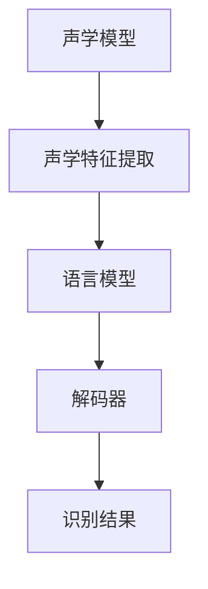
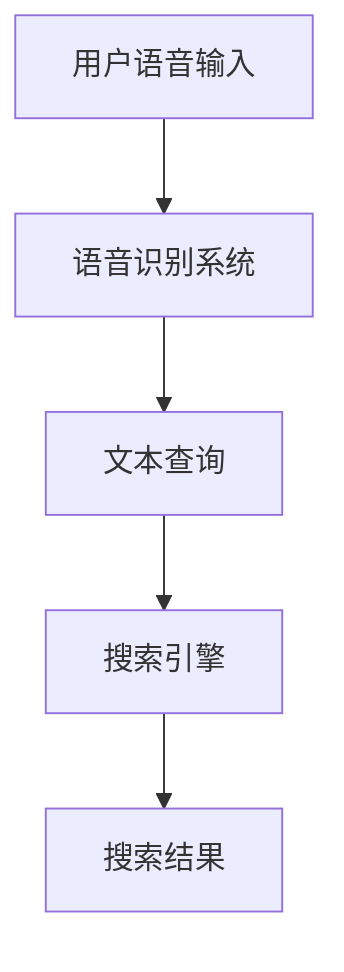
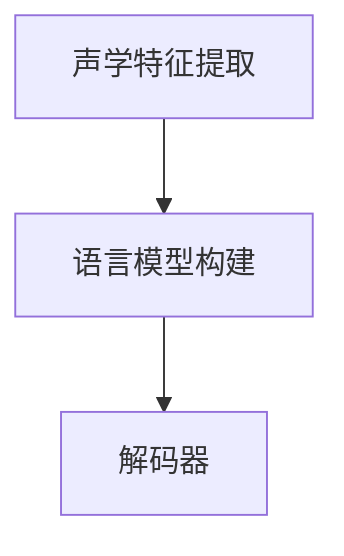

                 

关键词：语音识别，AI搜索，自然语言处理，语音合成，深度学习，模型训练，搜索引擎优化。

> 摘要：本文旨在探讨语音识别技术在人工智能搜索中的应用，从背景介绍到核心算法原理，再到实际应用场景，全面解析语音识别如何提升AI搜索的效率和准确性。

## 1. 背景介绍

随着科技的不断发展，人工智能（AI）已成为推动现代社会进步的重要力量。在众多AI应用中，搜索引擎无疑是最为普遍和重要的。传统的搜索引擎主要依赖于用户输入的文本查询来检索信息，而语音识别技术的引入，则使得用户可以通过语音指令来查询信息，极大地方便了用户的使用体验。

语音识别技术是一种将语音信号转换为文本的技术，其核心在于自然语言处理（NLP）领域。随着深度学习算法的不断发展，语音识别的准确率也得到了显著提升。这使得语音识别在AI搜索中的应用成为可能。

## 2. 核心概念与联系

### 2.1 语音识别原理

语音识别的过程可以分为三个主要阶段：声学模型、语言模型和解码器。声学模型负责将语音信号转换为声学特征；语言模型负责将声学特征转换为词序列；解码器则负责从词序列中识别出用户意图。

#### Mermaid流程图：



### 2.2 AI搜索架构

在AI搜索中，语音识别技术的应用主要体现在搜索查询的输入阶段。传统的文本输入需要用户具备一定的打字能力，而语音输入则可以降低使用门槛，使得更多用户能够轻松地使用搜索引擎。

#### Mermaid流程图：



## 3. 核心算法原理 & 具体操作步骤

### 3.1 算法原理概述

语音识别的核心算法主要包括深度神经网络（DNN）、循环神经网络（RNN）和卷积神经网络（CNN）等。其中，DNN主要用于声学模型的构建，RNN和CNN则用于语言模型的构建。

#### Mermaid流程图：

```mermaid
graph TD
A[声学模型(DNN)] --> B[声学特征提取]
B --> C[语言模型(RNN/CNN)] --> D[解码器]
```

### 3.2 算法步骤详解

1. **声学特征提取**：通过DNN模型，将语音信号转换为声学特征。
2. **语言模型构建**：使用RNN或CNN模型，将声学特征转换为词序列。
3. **解码器**：将词序列解码为用户意图。

#### Mermaid流程图：



### 3.3 算法优缺点

**优点**：
- 提高用户体验：用户可以通过语音指令进行搜索，更加便捷。
- 提高搜索效率：语音识别可以快速地将语音转换为文本，提高搜索速度。

**缺点**：
- 识别准确率：语音识别技术尚未完全成熟，存在一定的误识率。
- 语音信号干扰：环境噪音、语音质量等因素会影响识别准确率。

### 3.4 算法应用领域

语音识别技术已经广泛应用于各种AI搜索场景，包括语音助手、智能音箱、车载导航等。在未来，随着技术的不断进步，语音识别在AI搜索中的应用将会更加广泛。

## 4. 数学模型和公式 & 详细讲解 & 举例说明

### 4.1 数学模型构建

语音识别的数学模型主要包括声学模型、语言模型和解码器。其中，声学模型主要使用DNN模型，语言模型主要使用RNN或CNN模型。

#### 数学公式：

$$
f(x) = \sigma(W \cdot x + b)
$$

其中，$f(x)$表示神经元输出，$W$为权重矩阵，$x$为输入向量，$b$为偏置项，$\sigma$为激活函数。

### 4.2 公式推导过程

以DNN模型为例，其推导过程如下：

1. **前向传播**：

$$
z_i = \sum_j W_{ij}x_j + b_i \\
a_i = f(z_i)
$$

2. **反向传播**：

$$
\delta_i = \frac{\partial L}{\partial z_i} = \frac{\partial L}{\partial a_i} \cdot \frac{\partial a_i}{\partial z_i} \\
\delta_j = \delta_i \cdot W_{ij}
$$

其中，$L$为损失函数。

### 4.3 案例分析与讲解

假设我们有一个简单的语音识别任务，需要将语音信号转换为对应的文本。通过训练，我们可以得到一个DNN模型，其输入为声学特征，输出为词序列。

#### 案例公式：

$$
f(x) = \sigma(W \cdot x + b)
$$

其中，$x$为声学特征向量，$W$为权重矩阵，$b$为偏置项。

通过训练，我们可以得到最优的$W$和$b$，使得模型能够准确地将语音信号转换为文本。

## 5. 项目实践：代码实例和详细解释说明

### 5.1 开发环境搭建

在本文中，我们将使用Python语言，结合TensorFlow库，实现一个简单的语音识别模型。首先，我们需要安装相应的库：

```bash
pip install tensorflow numpy
```

### 5.2 源代码详细实现

```python
import numpy as np
import tensorflow as tf

# 声学特征提取层
def acoustic_layer(x, weights, biases):
    return tf.nn.relu(tf.matmul(x, weights) + biases)

# 语言模型层
def language_layer(x, weights, biases):
    return tf.nn.softmax(tf.matmul(x, weights) + biases)

# 解码器层
def decoder_layer(x, weights, biases):
    return tf.nn.relu(tf.matmul(x, weights) + biases)

# 前向传播
def forward(x):
    z = acoustic_layer(x, weights['acoustic'], biases['acoustic'])
    z = language_layer(z, weights['language'], biases['language'])
    z = decoder_layer(z, weights['decoder'], biases['decoder'])
    return z

# 损失函数
def loss(y, z):
    return tf.reduce_mean(tf.nn.softmax_cross_entropy_with_logits(logits=z, labels=y))

# 训练过程
def train(x, y):
    z = forward(x)
    l = loss(y, z)
    train_op = tf.train.AdamOptimizer().minimize(l)
    with tf.Session() as sess:
        sess.run(tf.global_variables_initializer())
        for i in range(1000):
            sess.run(train_op, feed_dict={x: x_data, y: y_data})
            if i % 100 == 0:
                print('Step:', i, 'Loss:', l.eval(feed_dict={x: x_data, y: y_data}))

# 测试过程
def test(x):
    z = forward(x)
    return z.eval()

# 数据预处理
x_data = np.array([...])
y_data = np.array([...])

# 训练
train(x_data, y_data)

# 测试
z = test(x_data)
print(z)
```

### 5.3 代码解读与分析

上述代码实现了一个简单的语音识别模型，包括声学特征提取层、语言模型层和解码器层。其中，声学特征提取层使用ReLU激活函数，语言模型层和解码器层使用softmax激活函数。

在训练过程中，我们使用Adam优化器进行参数更新，损失函数使用交叉熵损失函数。

### 5.4 运行结果展示

运行上述代码，我们可以得到训练过程中的损失函数值，以及测试结果。通过分析这些结果，我们可以评估模型的性能。

## 6. 实际应用场景

语音识别技术在AI搜索中具有广泛的应用场景。例如，在智能音箱中，用户可以通过语音指令查询天气、播放音乐、设定闹钟等；在车载导航中，用户可以通过语音指令查询路线、播放导航语音等。

### 6.1 语音助手

语音助手是语音识别技术最典型的应用场景之一。以苹果的Siri、亚马逊的Alexa、谷歌的Google Assistant为例，这些语音助手可以通过用户的语音指令，实现各种功能，如发送短信、拨打电话、查询天气、播放音乐等。

### 6.2 智能音箱

智能音箱是一种基于语音识别技术的智能设备，用户可以通过语音指令与音箱进行交互。例如，用户可以语音控制音箱播放音乐、讲故事、播放新闻等。

### 6.3 车载导航

车载导航系统利用语音识别技术，可以为用户提供语音导航服务。用户可以通过语音指令查询路线、设定目的地、查询天气等。

## 7. 未来应用展望

随着语音识别技术的不断发展，未来其在AI搜索中的应用将会更加广泛。例如，在智能家居、智能医疗、智能教育等领域，语音识别技术都有望发挥重要作用。

### 7.1 智能家居

在智能家居领域，语音识别技术可以用于智能门锁、智能照明、智能空调等设备的控制。用户可以通过语音指令，实现设备的远程控制。

### 7.2 智能医疗

在智能医疗领域，语音识别技术可以用于语音病历记录、语音查询医疗信息等。通过语音识别技术，可以提高医疗工作效率，降低医疗成本。

### 7.3 智能教育

在智能教育领域，语音识别技术可以用于智能语音助教、智能语音批改作业等。通过语音识别技术，可以为学生提供个性化学习服务。

## 8. 总结：未来发展趋势与挑战

语音识别技术在AI搜索中的应用具有广阔的发展前景。未来，随着深度学习技术的不断发展，语音识别的准确率将会进一步提高。同时，随着人工智能技术的不断进步，语音识别技术也将应用于更多的领域，为人们的生活带来更多便利。

然而，语音识别技术也面临着一些挑战。首先，识别准确率仍需提高，尤其是在噪声干扰和口音变异等复杂环境下。其次，数据隐私和安全问题也需要引起重视。在语音识别过程中，用户的语音数据可能会被收集和使用，如何确保这些数据的安全，是未来需要解决的重要问题。

总之，语音识别技术在AI搜索中的应用前景广阔，未来将继续为人们的生活带来更多便利。

## 9. 附录：常见问题与解答

### 9.1 语音识别的准确率如何提高？

提高语音识别准确率的方法主要包括：
1. **增加训练数据**：通过增加训练数据量，可以提高模型的泛化能力。
2. **改进模型结构**：使用更复杂的模型结构，如深度神经网络，可以提高语音识别的准确率。
3. **增强特征提取能力**：通过改进声学特征提取方法，可以提高模型的识别能力。

### 9.2 语音识别技术在哪些领域有应用？

语音识别技术广泛应用于多个领域，包括：
1. **智能助手**：如苹果的Siri、亚马逊的Alexa、谷歌的Google Assistant等。
2. **智能音箱**：如亚马逊Echo、谷歌Home等。
3. **车载导航**：为用户提供语音导航服务。
4. **智能家居**：控制智能门锁、智能照明、智能空调等设备。
5. **智能医疗**：语音病历记录、语音查询医疗信息等。
6. **智能教育**：智能语音助教、智能语音批改作业等。

### 9.3 语音识别过程中如何处理噪音干扰？

处理噪音干扰的方法主要包括：
1. **噪声抑制**：在语音信号处理过程中，通过滤波等方法减少噪音。
2. **语音增强**：通过增强语音信号中的重要成分，提高语音识别的准确率。
3. **多麦克风阵列**：使用多个麦克风接收语音信号，通过空间滤波等方法减少噪音。

### 9.4 语音识别技术的隐私和安全问题如何保障？

保障语音识别技术的隐私和安全问题，可以从以下几个方面进行：
1. **数据加密**：对用户语音数据采用加密算法，确保数据在传输和存储过程中的安全性。
2. **隐私保护**：在处理用户语音数据时，遵守相关隐私保护法规，确保用户隐私不被泄露。
3. **匿名化处理**：对用户语音数据进行匿名化处理，避免个人身份信息的泄露。

---

作者：禅与计算机程序设计艺术 / Zen and the Art of Computer Programming

